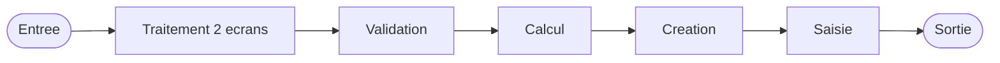

# PLAN V7.2 - Specifications Programme Magic

> **Statut** : VALIDE par revue iterative (2026-01-30)
> **Base** : V7.1 Deep Analysis (4 onglets : Resume | Ecrans | Donnees | Connexions)
> **Objectif** : Enrichir chaque section avec plus de detail metier, liens cliquables, interactivite

---

## TABLE DES MATIERES

1. [Onglet Resume](#onglet-resume)
   - [Section 1 : Fiche d'identite](#section-1--fiche-didentite)
   - [Section 2 : Description fonctionnelle](#section-2--description-fonctionnelle)
   - [Section 3 : Blocs fonctionnels](#section-3--blocs-fonctionnels)
   - [Section 5 : Regles metier](#section-5--regles-metier)
   - [Section 6 : Contexte](#section-6--contexte)
2. [Onglet Ecrans](#onglet-ecrans)
   - [Section 8 : Ecrans](#section-8--ecrans)
   - [Section 9 : Navigation](#section-9--navigation)
3. [Onglet Donnees](#onglet-donnees)
   - [Section 10 : Tables](#section-10--tables)
   - [Section 11 : Variables](#section-11--variables)
   - [Section 12 : Expressions](#section-12--expressions)
4. [Onglet Connexions](#onglet-connexions)
   - [Section 13 : Graphe d'appels](#section-13--graphe-dappels)
   - [Section 14 : Recommandations migration](#section-14--recommandations-migration)
5. [Transversal : Viewer](#transversal--viewer)

---

## ONGLET RESUME

### Section 1 : Fiche d'identite

**Decision** : VALIDE TEL QUEL

8 attributs dans un tableau simple. Aucun changement necessaire.

**Exemple (ADH IDE 121)** :

```markdown
## 1. FICHE D'IDENTITE

| Attribut | Valeur |
|----------|--------|
| Projet | ADH |
| IDE Position | 121 |
| Nom Programme | Gestion caisse |
| Fichier source | `Prg_121.xml` |
| Domaine metier | Caisse |
| Taches | 32 (2 ecrans visibles) |
| Tables modifiees | 4 |
| Programmes appeles | 18 |
```

---

### Section 2 : Description fonctionnelle

**Decision** : REFAIT EN 2 NIVEAUX

- **Niveau 1 (Synthese)** : Toujours visible. Contexte metier en 6-8 lignes. Explique le QUOI/POURQUOI.
- **Niveau 2 (Detail)** : Dans un `<details>` expansible. Phases chronologiques du cycle de vie. Explique le COMMENT.
- Sous-taches plus detaillees (role metier, conditions, variables impactees).

**Exemple complet (ADH IDE 121)** :

```markdown
## 2. DESCRIPTION FONCTIONNELLE

**Gestion caisse** est l'ecran principal de pilotage d'une session de caisse
dans un village vacances. Il permet a l'operateur de :

- **Ouvrir/fermer** une session de caisse (comptage initial, cloture avec ecarts)
- **Approvisionner** le fond de caisse en monnaie et articles
- **Effectuer des remises** au coffre (monnaie et produits)
- **Consulter l'historique** des sessions precedentes
- **Reimprimer les tickets** de fermeture
- **Gerer la concurrence** entre sessions simultanees (multi-terminal)

Accessible depuis le menu caisse principal (IDE 163) ou la fermeture
groupee de sessions (IDE 281). Modifie 4 tables en ecriture.

<details>
<summary>Detail : cycle de vie d'une session de caisse</summary>

### Cycle de vie d'une session

#### Phase 1 : Demarrage et controles (T1→T6)

Au lancement, le programme **charge les parametres caisse** (libelle, etat,
societe, devise locale, nb decimales, masque montant, code village, mode
consultation). Il verifie ensuite :

- **Controle COFFRE2** (T3) : le coffre secondaire est-il accessible ?
  Le terminal courant est-il l'hote du coffre ? → delegue a
  *Controle fermeture caisse WS* (IDE 155) et
  *Verif session caisse ouverte2* (IDE 156)
- **Date comptable** (T5) : determine la date comptable de la session
  en cours → variable R. Delegue a *Calcul concurrence sessions* (IDE 116)
- **Etat de la caisse** (T6) : verifie si une session est deja ouverte
  (variable S = session active, T = user ouverture, U = date ouverture)

#### Phase 2 : Ouverture de session (T8→T9)

- **Existe histo** (T8) : verifie si un historique existe deja pour
  cette session (evite les doublons)
- **Ouverture caisse** (T9) : delegue a *Ouverture caisse* (IDE 122)
  qui gere le comptage initial du fond de caisse

#### Phase 3 : Ecran principal - Operations courantes (T7)

L'ecran **Gestion de la caisse** (939x178, MDI) est le poste de travail
de l'operateur. Depuis cet ecran, il declenche :

| Action operateur | Tache interne | Sous-programme |
|------------------|---------------|----------------|
| Approvisionner monnaie | Apport coffre (T17) | *Apport coffre* (IDE 123) |
| Approvisionner produits | Apport produit (T18) | *Apport articles* (IDE 124) |
| Remise au coffre | Remise au coffre (T19, T24, T28) | *Remise en caisse* (IDE 125) |
| Consulter historique | Historique (T21) | *Historique session* (IDE 132) |
| Consulter session | Consultation (T22) | - |
| Reimprimer tickets | reimprimer tickets (T23) | *Ticket appro remise* (IDE 139), *Reimpr. fermeture* (IDE 151) |
| Voir sessions ouvertes | Open sessions (T25) | *Affichage sessions* (IDE 119) |
| Pointer operations | Pointage (T26) | - |
| Lire sessions | Read Sessions (T27) | - |

**Note** : 3 taches distinctes "Remise au coffre" (T19, T24, T28) gerent
differents types de remise (monnaie, produits, devises).

#### Phase 4 : Fermeture et cloture (T10→T16)

- **Cloture en cours** (T10) : verifie qu'une cloture n'est pas deja
  en cours (variable BA = cloture en cours)
- **Fermeture caisse** (T15) : delegue a *Fermeture caisse* (IDE 131)
  qui gere le comptage final, calcul des ecarts, et edition du ticket
- **Cloture histo session** (T16) : enregistre le resultat de la cloture
- **Creation histo** (T12, T30) : insere les enregistrements de session
  dans **histo_sessions_caisse** (journal des sessions)
- **Histo coffre2** (T13, T31) : met a jour **sessions_coffre2** si le
  coffre secondaire est actif

#### Phase 5 : Concurrence multi-terminal (T32)

L'ecran **Concurrence sessions for devel** (524x236) surveille les acces
concurrents. Quand plusieurs terminaux accedent au coffre simultanement,
le programme ecrit dans **concurrence_sessions** pour eviter les conflits.

#### Initialisation et RAZ

- **Init saisie devises** (T14, T20) : remet a zero les champs de saisie
  achat/vente devises entre chaque operation
- **Ligne initiale** (T29) : reinitialisation complete des variables de
  travail. Delegue a *Init appro article* (IDE 140) et
  *Init devise session* (IDE 141)

### Tables impactees

| Table | Operations | Role metier |
|-------|-----------|-------------|
| histo_sessions_caisse | R/W/L (6 usages) | Journal central : chaque session y est enregistree avec date, operateur, montants |
| sessions_coffre2 | W/L (3 usages) | Etat du coffre secondaire : suivi temps reel du contenu |
| saisie_approvisionnement | W/L (2 usages) | Detail des approvisionnements : monnaie et produits apportes |
| concurrence_sessions | W (1 usage) | Verrou de concurrence : empeche les conflits multi-terminal |

</details>
```

---

### Section 3 : Blocs fonctionnels

**Decision** : ENRICHI MASSIVEMENT

- Detail **tache par tache** avec : role metier, variables positionnees, tables impactees, delegations
- **Liste pliante** pour la tache racine T1 (au lieu d'une liste de numeros)
- **Liens #ancre** cliquables vers chaque tache
- **Liens ecrans** pour naviguer vers les mockups
- **Bouton retour** dans le viewer apres navigation

**Exemple : Tache racine T1 avec liste pliante** :

```markdown
## 3. BLOCS FONCTIONNELS

### 3.1 Traitement (23 taches)

Bloc principal qui orchestre le cycle de vie complet d'une session de caisse.
23 taches internes + 10 sous-programmes.

---

#### <a id="t1"></a>T1 - Gestion caisse (tache racine)

**Role** : Tache d'orchestration. C'est le point d'entree du programme, elle
contient toutes les autres taches en cascade. Ne fait pas de traitement
metier direct, elle coordonne l'enchainement.

**Type** : MDI (Multiple Document Interface)

<details>
<summary>22 sous-taches directes</summary>

| Tache | Nom | Bloc |
|-------|-----|------|
| [T2](#t2) | Parametres caisse (SDI) | Traitement |
| [T4](#t4) | Parametres caisse (MDI) | Traitement |
| [T6](#t6) | Etat de la caisse | Traitement |
| [T7](#t7) | Gestion de la caisse **[ECRAN]** | Traitement |
| [T8](#t8) | Existe histo | Traitement |
| [T9](#t9) | Ouverture caisse | Traitement |
| [T10](#t10) | Cloture en cours v1 | Traitement |
| [T13](#t13) | Histo coffre2 | Traitement |
| [T15](#t15) | Fermeture caisse | Traitement |
| [T16](#t16) | Cloture histo session | Traitement |
| [T17](#t17) | Apport coffre | Traitement |
| [T18](#t18) | Apport produit | Traitement |
| [T19](#t19) | Remise au coffre (monnaie) | Traitement |
| [T21](#t21) | Historique | Traitement |
| [T22](#t22) | Consultation | Traitement |
| [T24](#t24) | Remise au coffre (devises) | Traitement |
| [T25](#t25) | Open sessions | Traitement |
| [T26](#t26) | Pointage | Traitement |
| [T27](#t27) | Read Sessions | Traitement |
| [T28](#t28) | Remise au coffre (produits) | Traitement |
| [T31](#t31) | Histo coffre2 (post-cloture) | Traitement |
| [T32](#t32) | Concurrence sessions **[ECRAN]** | Traitement |

</details>
```

**Exemple : Tache detaillee avec ancre, variables, tables, delegation** :

```markdown
---

#### <a id="t2"></a>T2 - Parametres caisse (chargement SDI)

**Role** : Charge les parametres de la caisse depuis les variables passees
par le programme appelant (Menu caisse IDE 163). Ces parametres conditionnent
tout le fonctionnement de la session.

**Type** : SDI (Single Document Interface)
**Variables chargees** :

| Variable | Lettre | Contenu | Exemple |
|----------|--------|---------|---------|
| Libelle caisse | A | Nom affiche de la caisse | "Caisse principale" |
| Etat caisse | B | Ouvert/Ferme/En cloture | "O", "F", "C" |
| Societe | C | Code societe Club Med | "001" |
| Devise locale | D | Code devise du village | "EUR" |
| Nb decimales | E | Precision monetaire | 2 |
| Masque montant | F | Format d'affichage montants | "#,##0.00" |
| Code village | G | Identifiant village | "CSK" |
| Nom village | H | Nom complet village | "Club Med Cancun" |
| Masque cumul | I | Format affichage cumuls | "#,##0.00" |
| Uni/Bi | J | Mode devise (unilateral/bilateral) | "U" ou "B" |
| Village TAI | K | Code village pour TAI | "CSK" |
| Mode consultation | L | Lecture seule ? | True/False |
| Terminal coffre2 | M | N° terminal coffre secondaire | 5 |
| VIL open sessions | N | Sessions villages ouvertes | "O"/"N" |
| FROM_IMS | O | Appele depuis IMS ? | "O"/"N" |

---

#### <a id="t4"></a>T4 - Parametres caisse (complement MDI)

**Role** : Charge les parametres complementaires qui ne sont pas dans T2.
Notamment les parametres lies au coffre secondaire (coffre2).

**Variables chargees** :

| Variable | Lettre | Contenu |
|----------|--------|---------|
| Host coffre2 | P | Nom machine hote du coffre2 |
| Host courant coffre2 ? | Q | Ce terminal est-il l'hote du coffre2 ? |
| COFFRE 2 est ouvert | BB | Etat du coffre secondaire |
| Avec coffre 2 | BC | Le village a-t-il un coffre2 ? |
| Cloture auto | BD | Mode cloture automatique active ? |

---

#### <a id="t3"></a>T3 - Controle COFFRE2 [VALIDATION]

**Role** : Verifie que le coffre secondaire est accessible et coherent
avant de permettre toute operation. Si le coffre2 n'est pas sur ce terminal
(Q = False), certaines operations sont bloquees.

**Sous-tache** : [T11 - Controle monnaie/produit](#t11)
**Delegue a** :
- [Controle fermeture caisse WS (IDE 155)](ADH-IDE-155.md) : verifie les conditions
  de fermeture aupres du Web Service
- [Verif session caisse ouverte2 (IDE 156)](ADH-IDE-156.md) : s'assure qu'une session
  est bien ouverte sur le coffre2

---

#### <a id="t5"></a>T5 - Date comptable [CALCUL]

**Role** : Determine la date comptable de la session. En hotellerie, la
date comptable peut differer de la date calendaire (ex: operations apres
minuit comptabilisees sur le jour precedent).

**Variable resultat** : R (V Date comptable)
**Lit** : table `date_comptable___dat` (colonnes E, R, U, W)
**Delegue a** : [Calcul concurrence sessions (IDE 116)](ADH-IDE-116.md) - appele 12 fois,
c'est le sous-programme le plus sollicite du programme

---

#### <a id="t6"></a>T6 - Etat de la caisse

**Role** : Determine l'etat actuel de la caisse : session ouverte ou fermee,
qui a ouvert, quand, et si une cloture est en cours.

**Variables positionnees** :

| Variable | Lettre | Signification |
|----------|--------|---------------|
| V session active | S | True = session ouverte |
| V User ouverture | T | Login de l'operateur qui a ouvert |
| V Date ouverture | U | Date d'ouverture |
| V Time ouverture | V | Heure d'ouverture |
| V Date Fin session | W | Date prevue de fin |
| V Last Chrono | X | Dernier chrono operation |
| V Cloture en cours | BA | True = cloture en cours |

**Lit** : table `histo_sessions_caisse` (le journal des sessions)

---

#### <a id="t7"></a>T7 - Gestion de la caisse [ECRAN PRINCIPAL]

**Role** : Ecran MDI (939x178 pixels) qui est le poste de travail de
l'operateur. Affiche les informations de la session et propose les actions
via boutons/menus.

**Ecran** : [939 x 178 DLU, MDI](#ecran-t7) | [Voir mockup](#mockup-gestion-caisse)
**Contenu probable** : Libelle caisse (A), etat (B), devise (D),
date comptable (R), date ouverture (U), heure ouverture (V)

C'est depuis cet ecran que l'operateur lance les operations suivantes.

---

#### <a id="t8"></a>T8 - Existe histo

**Role** : Avant d'ouvrir une nouvelle session, verifie dans
`histo_sessions_caisse` si un historique existe deja pour eviter la
creation de doublons. Positionne la variable G (existe histo).

**Table** : `histo_sessions_caisse` (R/L)
**Variable resultat** : G (existe histo = Logical)

---

#### <a id="t9"></a>T9 - Ouverture caisse

**Role** : Lance le processus d'ouverture d'une session. L'operateur
effectue le comptage initial du fond de caisse (monnaie, produits).

**Delegue a** : [Ouverture caisse (IDE 122)](ADH-IDE-122.md) qui gere :
- Comptage initial de chaque coupure de monnaie
- Comptage initial des articles en stock
- Enregistrement de l'etat initial dans les tables

---

#### <a id="t10"></a>T10 - Cloture en cours v1

**Role** : Verifie si une cloture est deja en cours (variable BA).
Si oui, empeche le lancement d'une deuxieme cloture simultanee.

**Variable testee** : BA (V Cloture en cours)

---

#### <a id="t11"></a>T11 - Controle monnaie/produit

**Role** : Sous-tache de [T3](#t3). Verifie la coherence des montants
monnaie et produits dans le coffre2.

---

#### <a id="t12"></a>T12 - Creation histo session [CREATION]

**Role** : Insere un nouvel enregistrement dans `histo_sessions_caisse`
pour tracer la session. Cree l'entree initiale.

**Table modifiee** : `histo_sessions_caisse` (W)
**Voir aussi** : [T30](#t30) (mise a jour en fin de session)

---

#### <a id="t13"></a>T13 - Histo coffre2

**Role** : Si le village dispose d'un coffre secondaire (BC = "O"),
met a jour `sessions_coffre2` avec les mouvements de la session.

**Condition** : BC (V avec coffre 2) = "O"
**Table modifiee** : `sessions_coffre2` (W)
**Voir aussi** : [T31](#t31) (post-cloture)

---

#### <a id="t15"></a>T15 - Fermeture caisse

**Role** : Lance le processus de fermeture. L'operateur effectue le
comptage final, le programme calcule les ecarts avec le comptage initial,
et genere le ticket de fermeture.

**Delegue a** : [Fermeture caisse (IDE 131)](ADH-IDE-131.md) qui gere :
- Comptage final de chaque coupure/article
- Calcul des ecarts (theorique vs reel)
- Validation avec seuil d'alerte
- Generation ticket fermeture

---

#### <a id="t16"></a>T16 - Cloture histo session

**Role** : Finalise l'historique de session apres la fermeture.
Met a jour le statut dans `histo_sessions_caisse`.

---

#### <a id="t17"></a>T17 - Apport coffre

**Role** : Permet d'approvisionner la caisse en monnaie depuis le coffre.
**Delegue a** : [Apport coffre (IDE 123)](ADH-IDE-123.md)
**Table modifiee** : `saisie_approvisionnement` (W)

---

#### <a id="t18"></a>T18 - Apport produit

**Role** : Permet d'approvisionner la caisse en articles/produits.
**Delegue a** : [Apport articles (IDE 124)](ADH-IDE-124.md)
**Table modifiee** : `saisie_approvisionnement` (W)

---

#### <a id="t19"></a>T19 - Remise au coffre (monnaie)

**Role** : Remise de monnaie locale au coffre principal.
**Delegue a** : [Remise en caisse (IDE 125)](ADH-IDE-125.md)
**Table modifiee** : `sessions_coffre2` (W)

---

#### <a id="t21"></a>T21 - Historique

**Role** : Affiche l'historique des sessions precedentes de cette caisse.
**Delegue a** : [Historique session (IDE 132)](ADH-IDE-132.md)
**Table lue** : `histo_sessions_caisse` (R)

---

#### <a id="t22"></a>T22 - Consultation

**Role** : Permet de consulter le detail d'une session sans modification.
Mode lecture seule (variable L = True).

---

#### <a id="t23"></a>T23 - Reimprimer tickets [IMPRESSION]

**Role** : Reimprimer les tickets d'approvisionnement et de fermeture.
**Delegue a** : [Ticket appro remise (IDE 139)](ADH-IDE-139.md),
[Reimpression tickets fermeture (IDE 151)](ADH-IDE-151.md)

---

#### <a id="t24"></a>T24 - Remise au coffre (devises)

**Role** : Remise de devises etrangeres au coffre.
**Delegue a** : [Remise en caisse (IDE 125)](ADH-IDE-125.md)
**Table modifiee** : `sessions_coffre2` (W)

---

#### <a id="t25"></a>T25 - Open sessions

**Role** : Affiche les sessions ouvertes sur le village, pour verifier
quelles caisses sont actives. Utile pour la gestion multi-caisse.
**Delegue a** : [Affichage sessions (IDE 119)](ADH-IDE-119.md)

---

#### <a id="t26"></a>T26 - Pointage

**Role** : Permet de pointer les operations effectuees pendant la session.
Traitement interne sans delegation.

---

#### <a id="t27"></a>T27 - Read Sessions

**Role** : Lit les sessions depuis la base pour rafraichir l'affichage.
Traitement interne sans delegation.

---

#### <a id="t28"></a>T28 - Remise au coffre (produits)

**Role** : Remise de produits/articles au coffre.
**Delegue a** : [Remise en caisse (IDE 125)](ADH-IDE-125.md)
**Table modifiee** : `sessions_coffre2` (W)

---

#### <a id="t29"></a>T29 - Ligne initiale [INITIALISATION]

**Role** : Reinitialise toutes les variables de travail au demarrage.
**Delegue a** : [Init appro article session WS (IDE 140)](ADH-IDE-140.md),
[Init devise session WS (IDE 141)](ADH-IDE-141.md)

---

#### <a id="t30"></a>T30 - Creation histo session (fin)

**Role** : Met a jour l'enregistrement historique en fin de session
avec les totaux. Complement de [T12](#t12).
**Table modifiee** : `histo_sessions_caisse` (W)

---

#### <a id="t31"></a>T31 - Histo coffre2 (post-cloture)

**Role** : Mise a jour finale du coffre2 apres cloture.
Complement de [T13](#t13).
**Condition** : BC (V avec coffre 2) = "O"
**Table modifiee** : `sessions_coffre2` (W)

---

#### <a id="t32"></a>T32 - Concurrence sessions for devel [ECRAN]

**Role** : Ecran secondaire (524x236) qui surveille les acces concurrents.
Quand plusieurs terminaux accedent au meme coffre, affiche les conflits
potentiels et ecrit dans `concurrence_sessions`.

**Ecran** : [524 x 236 DLU, MDI](#ecran-t32) | [Voir mockup](#mockup-concurrence)
**Table modifiee** : `concurrence_sessions` (W)
```

**Exemple : Bloc Validation (plus petit)** :

```markdown
### 3.2 Validation (2 taches)

Controles de coherence avant toute operation sur le coffre.

---

#### <a id="t3-bloc"></a>T3 - Controle COFFRE2

Voir [detail T3](#t3) ci-dessus.

#### <a id="t11-bloc"></a>T11 - Controle monnaie/produit

Voir [detail T11](#t11) ci-dessus.
```

---

### Section 5 : Regles metier

**Decision** : ENRICHI

- Format [RM-XXX] groupe par bloc fonctionnel (INCHANGE)
- Chaque regle enrichie avec : **condition, action, variables impactees, impact**
- **Exemples concrets** avec valeurs pour les regles complexes
- **Lien vers expression Magic source** (IDE + decode)

**Exemple V7.1 actuel (ADH IDE 237, a changer)** :

```markdown
## 5. REGLES METIER

### Saisie (13 regles)
- [RM-006] Si W0 imputation [W] vaut 'VRL' alors 'Date consommation', sinon 'Date debut sejour'
```

**Exemple V7.2 enrichi** :

```markdown
## 5. REGLES METIER

### Saisie (13 regles)

#### [RM-006] Date saisie conditionnelle

| Element | Detail |
|---------|--------|
| **Condition** | W0 imputation [W] = 'VRL' |
| **Si vrai** | Affiche label "Date consommation" |
| **Si faux** | Affiche label "Date debut sejour" |
| **Variables** | W (imputation), Y (date d'achat) |
| **Expression source** | Expression 42 : `IF(W='VRL','Date consommation','Date debut sejour')` |
| **Exemple** | Imputation VRL (vente resort locale) → l'operateur saisit la date ou le service a ete consomme. Imputation autre → date de debut du sejour. |
| **Impact** | Label dynamique dans l'ecran [Saisie transaction (T1)](#t1) |

---

#### [RM-007] Calcul pourcentage avec arrondi

| Element | Detail |
|---------|--------|
| **Condition** | CG (W0 Pourcentage reduction) > 0 |
| **Action** | Montant reduit = Montant * (1 - CG/100), arrondi a E decimales |
| **Variables** | CF (montant avant reduction), CG (pourcentage), E (nb decimales) |
| **Expression source** | Expression 85 : `Round(CF * (1 - CG / 100), E)` |
| **Exemple** | Article a 150 EUR, reduction 10% → 150 * 0.90 = 135.00 EUR |
| **Impact** | Calcul dans [T35 - calcul nombre carte](#t35) |
```

---

### Section 6 : Contexte

**Decision** : VALIDE TEL QUEL + LIENS CLIQUABLES

Format compact en 2 lignes. Les references IDE deviennent des liens vers les specs.

**Exemple V7.1 actuel** :

```markdown
## 6. CONTEXTE

- **Appele par**: Menu caisse GM - scroll (IDE 163), Fermeture Sessions (IDE 281)
- **Appelle**: 18 programmes | **Tables**: 12 (W:4 R:8 L:5) | **Taches**: 32 | **Expressions**: 7
```

**Exemple V7.2 avec liens** :

```markdown
## 6. CONTEXTE

- **Appele par**: [Menu caisse GM - scroll (IDE 163)](ADH-IDE-163.md), [Fermeture Sessions (IDE 281)](ADH-IDE-281.md)
- **Appelle**: 18 programmes | **Tables**: 12 (W:4 R:8 L:5) | **Taches**: 32 | **Expressions**: 7
```

---

## ONGLET ECRANS

### Section 8 : Ecrans

**Decision** : REFAIT

- Tableau des forms avec **titre hierarchique** (237.X.X)
- Mockups en **rendu HTML/SVG** dans le viewer (coordonnees DLU reelles)
- Controls **cliquables** (tooltip avec variable, type, regles)
- **Navigation** vers ecran cible pour les boutons
- Table des **champs** et **boutons** sous chaque mockup
- Lien **screenshot** pour captures reelles
- Chaque ecran avec **ancre** pour navigation depuis d'autres sections

**Exemple V7.1 actuel (ADH IDE 237)** :

```markdown
### 8.1 Forms visibles (14 / 49)

| # | Tache | Nom | Type | Largeur | Hauteur |
|---|-------|-----|------|---------|---------|
| 1 | 1 | Saisie transaction | Modal | 1112 | 279 |

### 8.2 Mockups Ecrans

+======================================================+
| Saisie transaction [Modal] 1112x279 - Tache 1        |
+------------------------------------------------------+
|  [P0 societe (A)]  [P0 devise locale (B)]  [P0 mas...|
+======================================================+
```

**Exemple V7.2 enrichi** :

```markdown
### 8.1 Forms visibles (14 / 49)

| # | Position | Tache | Nom | Type | Largeur | Hauteur | Bloc |
|---|----------|-------|-----|------|---------|---------|------|
| 1 | 237.1 | T1 | Saisie transaction | Modal | 1112 | 279 | Saisie |
| 2 | 237.2 | T2 | Reglements suite a refus TPE | Type6 | 708 | 256 | Reglement |

### 8.2 Mockups Ecrans

---

#### <a id="ecran-t1"></a><a id="mockup-saisie-transaction"></a>237.1 - Saisie transaction
**Tache** : [T1](#t1) | **Type** : Modal | **Dimensions** : 1112 x 279 DLU
**Bloc** : Saisie | **Titre IDE** : Saisie transaction

<!-- FORM-DATA:
{
  "taskId": 1,
  "type": "Modal",
  "width": 1112,
  "height": 279,
  "controls": [
    {"type": "edit", "x": 10, "y": 13, "w": 130, "h": 20, "var": "A", "label": "Societe", "readonly": true},
    {"type": "edit", "x": 200, "y": 13, "w": 130, "h": 20, "var": "B", "label": "Devise", "readonly": true},
    {"type": "edit", "x": 10, "y": 60, "w": 250, "h": 20, "var": "U", "label": "Code article"},
    {"type": "edit", "x": 10, "y": 90, "w": 130, "h": 20, "var": "W", "label": "Imputation"},
    {"type": "edit", "x": 200, "y": 90, "w": 130, "h": 20, "var": "Y", "label": "Date achat"},
    {"type": "button", "x": 10, "y": 220, "w": 80, "h": 25, "var": "P", "label": "IDENTITE", "target": "#t11"},
    {"type": "button", "x": 100, "y": 220, "w": 80, "h": 25, "var": "Q", "label": "ABANDON"},
    {"type": "button", "x": 190, "y": 220, "w": 80, "h": 25, "var": "S", "label": "VALIDER"}
  ]
}
-->

**Champs de saisie :**

| Position | Variable | Nom | Type | Saisie | Regles |
|----------|----------|-----|------|--------|--------|
| Haut gauche | A | P0 societe | Alpha | Lecture | Parametre entrant |
| Haut centre | B | P0 devise locale | Alpha | Lecture | Parametre entrant |
| Centre | U | W0 code article | Alpha | **Saisie** | [RM-014](#rm-014) |
| Centre | W | W0 imputation | Alpha | **Saisie** | [RM-006](#rm-006), [RM-008](#rm-008) |
| Centre | Y | W0 date d'achat | Date | **Saisie** | Depend de [RM-006](#rm-006) |
| Bas | BD | W0 nbre articles | Numeric | **Saisie** | |

**Boutons :**

| Bouton | Variable | Action declenchee |
|--------|----------|-------------------|
| IDENTITE | P | Ouvre [T11 - VRL Saisie identite](#t11) |
| ABANDON | Q | Annule la saisie, retour menu |
| VALIDER | S | Lance validation + creation |
| BILATERAL | - | Ouvre [T7 - Saisie Bilaterale](#t7) |
| COMMENTAIRES | - | Ouvre [T10 - Saisie Commentaires](#t10) |

*Screenshot reel : [Voir capture](attachments/237-t1-saisie-transaction.png)*
```

**Note pour le viewer** : Le bloc `<!-- FORM-DATA: {...} -->` est un commentaire HTML contenant
les donnees JSON des controls. Le viewer le parse et genere un rendu HTML/SVG interactif avec
les vrais coordonnees DLU. Chaque control est cliquable avec tooltip (variable, type, regles).

---

### Section 9 : Navigation

**Decision** : AMELIORE

- **9.1** : Flowchart des **vrais enchainements d'ecrans** (pas lineaire par bloc)
  Montrer quel ecran mene a quel autre, avec les actions utilisateur et conditions.
- **9.2** : Logique decisionnelle (quand elle existe) - FUSIONNABLE avec 9.1
- **9.3** : Arbre hierarchique avec **liens cliquables** vers taches et ecrans

**Exemple V7.1 actuel (trop simpliste)** :



**Exemple V7.2 (vrais enchainements d'ecrans)** :

```markdown
### 9.1 Enchainement des ecrans

Le diagramme montre les vrais enchainements d'ecrans tels que l'operateur
les vit, avec les actions qui declenchent chaque navigation.

```mermaid
flowchart TD
    START([Entree])
    style START fill:#3fb950
    T7[Gestion caisse ECRAN 939x178]
    style T7 fill:#58a6ff

    T7 -->|Bouton Ouvrir| IDE122[IDE 122 Ouverture caisse]
    T7 -->|Bouton Appro Monnaie| IDE123[IDE 123 Apport coffre]
    T7 -->|Bouton Appro Produit| IDE124[IDE 124 Apport articles]
    T7 -->|Bouton Remise| IDE125[IDE 125 Remise en caisse]
    T7 -->|Bouton Fermer| IDE131[IDE 131 Fermeture caisse]
    T7 -->|Bouton Histo| IDE132[IDE 132 Historique session]
    T7 -->|Bouton Reimprimer| T23[Reimprimer tickets]
    T23 --> IDE139[IDE 139 Ticket appro]
    T23 --> IDE151[IDE 151 Reimpr fermeture]
    T7 -->|Bouton Sessions| IDE119[IDE 119 Affichage sessions]

    T32[Concurrence ECRAN 524x236]
    style T32 fill:#f59e0b

    START --> T7
    T7 -.->|Automatique| T32

    FIN([Sortie])
    style FIN fill:#f85149
    IDE131 --> FIN
`` `

**Detail par enchainement :**

| Depuis | Action | Vers | Retour |
|--------|--------|------|--------|
| Gestion caisse (T7) | Bouton Ouvrir | [IDE 122](ADH-IDE-122.md) | Retour T7 |
| Gestion caisse (T7) | Bouton Appro | [IDE 123](ADH-IDE-123.md) / [124](ADH-IDE-124.md) | Retour T7 |
| Gestion caisse (T7) | Bouton Fermer | [IDE 131](ADH-IDE-131.md) | Sortie programme |
| Gestion caisse (T7) | Bouton Histo | [IDE 132](ADH-IDE-132.md) | Retour T7 |
```

**Exemple V7.2 : Structure hierarchique avec liens** :

```markdown
### 9.3 Structure hierarchique (32 taches)

- **121.1** [Gestion caisse (T1)](#t1)  (MDI) *[Traitement]*
  - **121.1.1** [Parametres caisse (T2)](#t2)  (SDI)
  - **121.1.2** [Parametres caisse (T4)](#t4)  (MDI)
  - **121.1.3** [Etat de la caisse (T6)](#t6)  (MDI)
  - **121.1.4** [Gestion de la caisse (T7)](#t7) **[ECRAN]** (MDI) 939x178 → [mockup](#ecran-t7)
  - **121.1.5** [Existe histo (T8)](#t8)  (MDI)
  - **121.1.6** [Ouverture caisse (T9)](#t9)  (MDI)
  - **121.1.7** [Cloture en cours v1 (T10)](#t10)  (MDI)
  - **121.1.8** [histo coffre2 (T13)](#t13)  (MDI)
  - **121.1.9** [Fermeture caisse (T15)](#t15)  (MDI)
  - **121.1.10** [Cloture histo session (T16)](#t16)  (MDI)
  - **121.1.11** [Apport coffre (T17)](#t17)  (MDI)
  - **121.1.12** [Apport produit (T18)](#t18)  (MDI)
  - **121.1.13** [Remise au coffre (T19)](#t19)  (MDI)
  - **121.1.14** [Historique (T21)](#t21)  (MDI)
  - **121.1.15** [Consultation (T22)](#t22)  (MDI)
  - **121.1.16** [Remise au coffre (T24)](#t24)  (MDI)
  - **121.1.17** [Open sessions (T25)](#t25)  (MDI)
  - **121.1.18** [Pointage (T26)](#t26)  (MDI)
  - **121.1.19** [Read Sessions (T27)](#t27)  (MDI)
  - **121.1.20** [Remise au coffre (T28)](#t28)  (MDI)
  - **121.1.21** [histo coffre2 (T31)](#t31)  (MDI)
  - **121.1.22** [Concurrence sessions (T32)](#t32) **[ECRAN]** (MDI) 524x236 → [mockup](#ecran-t32)
- **121.2** [Controle COFFRE2 (T3)](#t3)  (MDI) *[Validation]*
  - **121.2.1** [Controle monnaie/produit (T11)](#t11)  (MDI)
- **121.3** [Date comptable (T5)](#t5)  (MDI) *[Calcul]*
- **121.4** [Creation histo session (T12)](#t12)  (MDI) *[Creation]*
  - **121.4.1** [Creation histo session (T30)](#t30)  (MDI)
- **121.5** [init tempo saisie dev (T14)](#t14)  (MDI) *[Saisie]*
  - **121.5.1** RAZ Saisie devises P/V (T20)  (MDI)
- **121.6** [reimprimer tickets (T23)](#t23)  (MDI) *[Impression]*
- **121.7** [Ligne Initiale (T29)](#t29)  (MDI) *[Initialisation]*
```

---

## ONGLET DONNEES

### Section 10 : Tables

**Decision** : AMELIORE

- **Fusionner 10.1 et 10.2** : chaque table est deployable directement
- Colonnes **reellement utilisees** dans le programme en gras/**OUI**
- Colonnes presentes dans la DataView mais **non utilisees** : affichees **grisees/barrees**
- Plus de message "Colonnes accessibles via MCP" - le pipeline doit tout extraire

**Exemple V7.1 actuel** :

```markdown
### 10.1 Tables utilisees (12)

| ID | Nom | Description | Type | R | W | L | Usages |
|----|-----|-------------|------|---|---|---|--------|
| 246 | histo_sessions_caisse |  | DB | R | **W** | L | 6 |

### 10.2 Colonnes par table

<details>
<summary>Table 246 - histo_sessions_caisse (R/W/L) - 6 usages</summary>

*Colonnes accessibles via outils MCP (magic_get_line)*

</details>
```

**Exemple V7.2 enrichi** :

```markdown
## 10. TABLES

### Tables utilisees (12)

| ID | Nom | Description | Type | R | W | L | Usages |
|----|-----|-------------|------|---|---|---|--------|
| 23 | reseau_cloture___rec | Donnees reseau/cloture | DB | R |   |   | 1 |
| 70 | date_comptable___dat | Dates comptables session | DB | R |   |   | 1 |
| 197 | articles_en_stock | Stock articles caisse | DB |   |   | L | 1 |
| 198 | coupures_monnaie_locale | Detail coupures/billets | DB | R |   |   | 1 |
| 227 | concurrence_sessions | Verrou acces concurrent | DB |   | **W** |   | 1 |
| 232 | gestion_devise_session | Devises de la session | DB | R |   |   | 1 |
| 244 | saisie_approvisionnement | Comptage appro | DB |   | **W** | L | 2 |
| 246 | histo_sessions_caisse | Journal sessions | DB | R | **W** | L | 6 |
| 248 | sessions_coffre2 | Etat coffre secondaire | DB |   | **W** | L | 3 |
| 249 | histo_sessions_caisse_detail | Detail operations | DB | R |   | L | 4 |
| 697 | droits_applications | Droits operateur | DB | R |   |   | 2 |
| 740 | pv_stock_movements | Mouvements stock PV | DB | R |   |   | 2 |

### Colonnes par table

<details>
<summary>Table 70 - date_comptable___dat (R) - 1 usage</summary>

| Lettre | Variable | Acces | Type | Utilisee |
|--------|----------|-------|------|----------|
| E | Date ouverture | R | Date | **OUI** |
| R | V Date comptable | R | Date | **OUI** |
| U | V Date ouverture | R | Date | **OUI** |
| W | V Date Fin session | R | Date | **OUI** |
| ~~A~~ | ~~Code societe~~ | ~~-~~ | ~~Alpha~~ | ~~NON~~ |
| ~~B~~ | ~~Reserve~~ | ~~-~~ | ~~Alpha~~ | ~~NON~~ |

</details>

<details>
<summary>Table 246 - histo_sessions_caisse (R/**W**/L) - 6 usages</summary>

| Lettre | Variable | Acces | Type | Utilisee |
|--------|----------|-------|------|----------|
| A | Code societe | R | Alpha | **OUI** |
| B | Date session | R/W | Date | **OUI** |
| C | Operateur | R | Alpha | **OUI** |
| G | existe histo | W | Logical | **OUI** |
| ~~D~~ | ~~Commentaire~~ | ~~-~~ | ~~Alpha~~ | ~~NON~~ |
| ~~E~~ | ~~Reserve 1~~ | ~~-~~ | ~~Alpha~~ | ~~NON~~ |
| ~~F~~ | ~~Reserve 2~~ | ~~-~~ | ~~Alpha~~ | ~~NON~~ |

</details>

<details>
<summary>Table 248 - sessions_coffre2 (**W**/L) - 3 usages</summary>

| Lettre | Variable | Acces | Type | Utilisee |
|--------|----------|-------|------|----------|
| N | Param VIL open sessions | W | Alpha | **OUI** |
| ~~A~~ | ~~Code societe~~ | ~~-~~ | ~~Alpha~~ | ~~NON~~ |

</details>
```

**Rendu viewer** : Les lignes ~~barrees~~ doivent apparaitre en gris clair dans le viewer.
A terme, l'utilisateur pourrait filtrer pour ne voir que les colonnes utilisees.

---

### Section 11 : Variables

**Decision** : RESTRUCTURE

- Grouper par **role metier** : Parametres entrants (P0), Variables de session (V.), Variables de travail (W0)
- **Supprimer les non-utilisees** dans la logique du programme
- **Lettrage correct** via le script qui integre les variables du Main pour le comptage (offset Main)
- Garder Top 20 + `<details>` pour la liste complete

**Exemple V7.1 actuel** :

```markdown
### 11.1 Variables principales (Top 20 par usage / 31)

| Cat | Lettre | Nom Variable | Type | Usages | Ref |
|-----|--------|--------------|------|--------|-----|
| Autre | **N** | Param VIL open sessions | Alpha | 1x | `{0,14}` |
| Autre | **J** | Param Uni/Bi | Alpha | - | `{0,10}` |
| V. | **V** | V Time ouverture | Time | - | `{0,22}` |
```

**Exemple V7.2 restructure** :

```markdown
## 11. VARIABLES

### 11.1 Parametres entrants (15)

Variables recues du programme appelant ([Menu caisse IDE 163](ADH-IDE-163.md)).

| Lettre | Nom | Type | Usage dans |
|--------|-----|------|-----------|
| A | Libelle caisse | Alpha | [T2](#t2) chargement, [T7](#t7) affichage |
| B | Etat caisse | Alpha | [T6](#t6) verification etat |
| C | Societe | Alpha | [T7](#t7) affichage |
| D | Devise locale | Alpha | [T7](#t7) affichage |
| E | Nb decimales | Numeric | [T5](#t5) calcul |
| F | Masque montant | Alpha | [T7](#t7) format affichage |
| G | Code village | Alpha | [T7](#t7) contexte |
| H | Nom village | Alpha | [T7](#t7) titre |
| I | Masque cumul | Alpha | [T7](#t7) format cumuls |
| J | Uni/Bi | Alpha | [T7](#t7) mode devise |
| K | Village TAI | Alpha | Configuration TAI |
| L | Mode consultation | Logical | [T22](#t22) lecture seule |
| M | Terminal coffre2 | Numeric | [T3](#t3) controle coffre |
| N | VIL open sessions | Alpha | [T25](#t25) sessions villages |
| O | FROM_IMS | Alpha | Detection appel IMS |

### 11.2 Variables de session (13)

Variables persistantes pendant toute la session de caisse.

| Lettre | Nom | Type | Usage dans |
|--------|-----|------|-----------|
| R | Date comptable | Date | [T5](#t5) calcul, transmise aux sous-programmes |
| S | Session active | Logical | [T6](#t6) etat, conditions d'ouverture/fermeture |
| T | User ouverture | Alpha | [T6](#t6) identification operateur |
| U | Date ouverture | Date | [T6](#t6) affichage, calculs duree |
| V | Time ouverture | Time | [T6](#t6) affichage |
| W | Date Fin session | Date | [T15](#t15) cloture |
| X | Last Chrono | Numeric | Sequenceur operations |
| Y | N° caisse reception mini | Numeric | Plage de reception |
| Z | N° caisse reception maxi | Numeric | Plage de reception |
| BA | Cloture en cours | Logical | [T10](#t10) verrou cloture |
| BC | Avec coffre 2 | Alpha | [T3](#t3), [T13](#t13) condition coffre2 |
| BD | Cloture auto | Alpha | Mode automatique |
| BE | v.fin | Logical | Signal fin programme |

### 11.3 Variables de travail (3)

Variables internes au programme.

| Lettre | Nom | Type | Usage dans |
|--------|-----|------|-----------|
| P | Host coffre2 | Unicode | [T4](#t4) configuration reseau |
| Q | Host courant coffre2 ? | Logical | [T3](#t3) controle terminal |
| BB | COFFRE 2 est ouvert | Logical | [T3](#t3) etat coffre |

<details>
<summary>Toutes les 31 variables (liste complete)</summary>

| Cat | Lettre | Nom Variable | Type |
|-----|--------|--------------|------|
| P0 | A | Libelle caisse | Alpha |
| P0 | B | Etat caisse | Alpha |
| P0 | C | Societe | Alpha |
| P0 | D | Devise locale | Alpha |
| P0 | E | Nb decimales | Numeric |
| P0 | F | Masque montant | Alpha |
| P0 | G | Code village | Alpha |
| P0 | H | Nom village | Alpha |
| P0 | I | Masque cumul | Alpha |
| P0 | J | Uni/Bi | Alpha |
| P0 | K | Village TAI | Alpha |
| P0 | L | Mode consultation | Logical |
| P0 | M | Terminal coffre2 | Numeric |
| P0 | N | VIL open sessions | Alpha |
| P0 | O | FROM_IMS | Alpha |
| W0 | P | Host coffre2 | Unicode |
| W0 | Q | Host courant coffre2 ? | Logical |
| V. | R | Date comptable | Date |
| V. | S | Session active | Logical |
| V. | T | User ouverture | Alpha |
| V. | U | Date ouverture | Date |
| V. | V | Time ouverture | Time |
| V. | W | Date Fin session | Date |
| V. | X | Last Chrono | Numeric |
| V. | Y | N° caisse reception mini | Numeric |
| V. | Z | N° caisse reception maxi | Numeric |
| V. | BA | Cloture en cours | Logical |
| W0 | BB | COFFRE 2 est ouvert | Logical |
| V. | BC | Avec coffre 2 | Alpha |
| V. | BD | Cloture auto | Alpha |
| V. | BE | v.fin | Logical |

</details>
```

---

### Section 12 : Expressions

**Decision** : AMELIORE (TYPES PRECIS)

- Remplacer "OTHER" par des types precis : CONDITION, AFFECTATION, CALCUL, FORMAT, NEGATION, REFERENCE_VG, CONSTANTE
- Format general : OK (repartition par bloc + table)

**Exemple V7.1 actuel** :

```markdown
### 12.2 Expressions cles par bloc

| Type | IDE | Expression | Regle |
|------|-----|------------|-------|
| CONSTANT | 3 | `'D'` | - |
| OTHER | 5 | `'TRUE'LOG` | - |
| OTHER | 6 | `NOT([AE])` | - |
| OTHER | 7 | `VG111` | - |
| OTHER | 1 | `Param VIL open sessions [N]='O'` | - |
```

**Exemple V7.2 avec types precis** :

```markdown
### 12.2 Expressions cles par bloc

| Type | IDE | Expression | Regle |
|------|-----|------------|-------|
| CONSTANTE | 3 | `'D'` | - |
| CAST_LOGIQUE | 5 | `'TRUE'LOG` | - |
| NEGATION | 6 | `NOT([AE])` | - |
| REFERENCE_VG | 7 | `VG111` | - |
| CONDITION | 1 | `Param VIL open sessions [N]='O'` | - |
```

**Typologie des expressions** :

| Type | Description | Exemples |
|------|-------------|----------|
| CONSTANTE | Valeur fixe | `'D'`, `0`, `'TRUE'` |
| CONDITION | Test avec comparaison | `[N]='O'`, `IF(...)` |
| NEGATION | Inversion logique | `NOT([AE])` |
| AFFECTATION | Assignation de valeur | `[A] = [B] + [C]` |
| CALCUL | Operation arithmetique | `Round(CF * (1-CG/100), E)` |
| FORMAT | Formatage d'affichage | `[C]'FORM`, `STR(...)` |
| REFERENCE_VG | Reference variable globale | `VG111`, `VG38` |
| CAST_LOGIQUE | Conversion en logique | `'TRUE'LOG`, `'FALSE'LOG` |
| UI_POSITION | Positionnement ecran | `IF([W]='VRL', 100, 200)` |
| CONCATENATION | Construction de chaine | `[A] & ' - ' & [B]` |

---

## ONGLET CONNEXIONS

### Section 13 : Graphe d'appels

**Decision** : VALIDE TEL QUEL + LIENS CLIQUABLES

Les 4 sous-sections restent identiques. Ajout de **liens cliquables** vers les specs.

**Exemple V7.1 actuel** :

```markdown
### 13.2 Callers

| IDE | Nom Programme | Nb Appels |
|-----|---------------|-----------|
| 163 | Menu caisse GM - scroll | 2 |
| 281 | Fermeture Sessions | 1 |
```

**Exemple V7.2 avec liens** :

```markdown
### 13.2 Callers

| IDE | Nom Programme | Nb Appels |
|-----|---------------|-----------|
| [163](ADH-IDE-163.md) | Menu caisse GM - scroll | 2 |
| [281](ADH-IDE-281.md) | Fermeture Sessions | 1 |

### 13.4 Detail Callees avec contexte

| IDE | Nom Programme | Appels | Contexte |
|-----|---------------|--------|----------|
| [116](ADH-IDE-116.md) | Calcul concurrence sessions | 12 | Calcul de donnees |
| [134](ADH-IDE-134.md) | Mise a jour detail session WS | 3 | Mise a jour donnees |
| [139](ADH-IDE-139.md) | Ticket appro remise | 3 | Impression ticket/document |
| [48](ADH-IDE-48.md) | Controles - Integrite dates | 2 | Sous-programme |
| [122](ADH-IDE-122.md) | Ouverture caisse | 2 | Ouverture session |
| [131](ADH-IDE-131.md) | Fermeture caisse | 2 | Fermeture session |
| [155](ADH-IDE-155.md) | Controle fermeture caisse WS | 2 | Controle/validation |
| [43](ADH-IDE-43.md) | Recuperation du titre | 1 | Recuperation donnees |
| [119](ADH-IDE-119.md) | Affichage sessions | 1 | Affichage donnees |
| [123](ADH-IDE-123.md) | Apport coffre | 1 | Approvisionnement |
| [124](ADH-IDE-124.md) | Apport articles | 1 | Approvisionnement |
| [125](ADH-IDE-125.md) | Remise en caisse | 1 | Programme fidelite |
| [132](ADH-IDE-132.md) | Historique session | 1 | Historique/consultation |
| [140](ADH-IDE-140.md) | Init appro article session WS | 1 | Reinitialisation |
| [141](ADH-IDE-141.md) | Init devise session WS | 1 | Reinitialisation |
| [151](ADH-IDE-151.md) | Reimpression tickets fermeture | 1 | Impression ticket/document |
| [156](ADH-IDE-156.md) | Verif session caisse ouverte2 | 1 | Controle/validation |
| [231](ADH-IDE-231.md) | Raisons utilisation ADH | 1 | Parametrage |
```

---

### Section 14 : Recommandations migration

**Decision** : VALIDE + CONCRETISER

Structure OK (profil + plan par bloc + dependances critiques).
Recommandations plus **concretes** : strategies de migration specifiques au lieu de generiques.

**Exemple V7.1 actuel (trop generique)** :

```markdown
### 14.2 Plan de migration par bloc

#### Traitement (23 taches: 2 ecrans, 21 traitements)
- Traitement standard a migrer

#### Validation (2 taches: 0 ecran, 2 traitements)
- Transformer les conditions en validators (FluentValidation ou equivalent)

#### Impression (1 tache)
- Remplacer par generation PDF/HTML
- Configurer le systeme d'impression
```

**Exemple V7.2 concretise** :

```markdown
### 14.2 Plan de migration par bloc

#### Traitement (23 taches: 2 ecrans, 21 traitements)

**Strategie** : Orchestrateur C# avec DI (Dependency Injection).
Chaque sous-programme (18) devient un service injectable.

- Creer `ICaisseOrchestrator` : point d'entree principal
- Injecter : `IOuvertureService`, `IFermetureService`, `IApprovisionnementService`,
  `IRemiseService`, `IHistoriqueService`, `IImpressionService`
- L'ecran principal (T7) → controleur ASP.NET avec endpoints REST
- La concurrence (T32) → SignalR pour notifications temps reel

**Dependances a migrer en priorite** :
1. [IDE 116 - Calcul concurrence](ADH-IDE-116.md) (12 appels = CRITIQUE)
2. [IDE 134 - MAJ detail session](ADH-IDE-134.md) (3 appels)
3. [IDE 131 - Fermeture caisse](ADH-IDE-131.md) (logique ecarts complexe)

#### Validation (2 taches: 0 ecran, 2 traitements)

**Strategie** : FluentValidation avec validators specifiques.

- `CoffreAccessValidator` : remplace T3 (controle COFFRE2)
  - Verifie terminal = hote coffre
  - Verifie coffre2 ouvert (BB)
- `MonnaieProductValidator` : remplace T11
  - Coherence montants monnaie/produit

#### Impression (1 tache)

**Strategie** : Templates HTML → PDF via wkhtmltopdf ou Puppeteer.

- `TicketApproTemplate.html` : layout ticket approvisionnement
- `TicketFermetureTemplate.html` : layout ticket fermeture avec ecarts
- `PrintService` injectable avec choix imprimante (remplace IDE 139, 151)

#### Creation (2 taches: insertion base)

**Strategie** : Repository pattern avec Entity Framework Core.

- `HistoSessionRepository.CreateAsync()` : remplace T12
- `HistoSessionRepository.UpdateTotauxAsync()` : remplace T30
- Entity `HistoSessionCaisse` avec mapping EF Core vers `histo_sessions_caisse`

#### Initialisation (1 tache)

**Strategie** : Constructeur/methode `InitAsync()` dans l'orchestrateur.

- Reset de toutes les variables de travail
- Appel `InitApproArticle()` et `InitDeviseSession()`
```

---

## TRANSVERSAL : VIEWER

### Features a implementer

| Feature | Description | Priorite |
|---------|-------------|----------|
| **Navigation #ancre** | Liens internes `<a id="tXX">` cliquables entre taches, ecrans, variables. Le viewer doit supporter le scroll vers l'ancre dans la section active. | P0 |
| **Bouton retour** | Apres navigation par ancre, bouton ou raccourci pour revenir a la position precedente. Stack de navigation (comme un browser). | P0 |
| **Cross-onglet** | Les liens peuvent pointer vers un autre onglet. Ex: cliquer sur `[Voir mockup](#ecran-t7)` depuis l'onglet Resume doit switcher vers l'onglet Ecrans et scroller vers l'ancre. | P1 |
| **HTML/SVG Forms** | Parser le bloc `<!-- FORM-DATA: {...} -->` et generer un rendu interactif des ecrans Magic avec coordonnees DLU reelles. Chaque control = element cliquable avec tooltip. | P1 |
| **Liens specs** | Toute reference `[texte](ADH-IDE-XXX.md)` devient un lien navigable vers la spec du programme dans le viewer. | P0 |
| **Colonnes grisees** | Dans les tables de colonnes, les lignes ~~barrees~~ apparaissent en gris clair. Option de filtre pour masquer/afficher les colonnes non-utilisees. | P2 |

### Format des ancres

Convention de nommage des ancres dans le Markdown :

| Type | Format ancre | Exemple |
|------|-------------|---------|
| Tache | `<a id="tXX"></a>` | `<a id="t7"></a>` |
| Ecran | `<a id="ecran-tXX"></a>` | `<a id="ecran-t7"></a>` |
| Mockup | `<a id="mockup-NOM"></a>` | `<a id="mockup-gestion-caisse"></a>` |
| Regle metier | `<a id="rm-XXX"></a>` | `<a id="rm-006"></a>` |

### Bloc FORM-DATA

Commentaire HTML contenant les donnees JSON des controls pour rendu HTML/SVG :

```html
<!-- FORM-DATA:
{
  "taskId": 1,
  "type": "Modal",
  "width": 1112,
  "height": 279,
  "controls": [
    {
      "type": "edit",       // edit, button, label, checkbox, combo, table
      "x": 10,              // position X en DLU
      "y": 13,              // position Y en DLU
      "w": 130,             // largeur en DLU
      "h": 20,              // hauteur en DLU
      "var": "A",           // lettre variable
      "label": "Societe",   // label affiche
      "readonly": true,     // lecture seule
      "rules": ["RM-006"]   // regles metier liees (optionnel)
    }
  ]
}
-->
```

Le viewer detecte ce bloc, le parse, et genere un `<div>` positionne avec CSS :

```css
.form-mockup { position: relative; background: var(--bg-tertiary); border-radius: 8px; }
.ctrl-edit { position: absolute; border: 1px solid var(--border); padding: 2px 4px; }
.ctrl-button { position: absolute; background: var(--btn-bg); cursor: pointer; }
.ctrl-readonly { opacity: 0.7; }
```

---

## RESUME DES CHANGEMENTS V7.1 → V7.2

| Section | V7.1 | V7.2 |
|---------|------|------|
| **1. Fiche identite** | 8 attributs | INCHANGE |
| **2. Description** | Texte plat + liste blocs | Synthese courte + Detail expansible en phases chronologiques |
| **3. Blocs fonctionnels** | Liste taches par bloc | Detail tache par tache (role, variables, tables, delegations) + liens #ancre + liste pliante T1 |
| **5. Regles metier** | [RM-XXX] une ligne | [RM-XXX] enrichi (condition/action/variables/impact/exemple/expression source) |
| **6. Contexte** | 2 lignes | 2 lignes + liens cliquables |
| **8. Ecrans** | ASCII basique | Titre 237.X.X + rendu HTML/SVG (FORM-DATA) + tables champs/boutons + screenshot |
| **9. Navigation** | Flowchart lineaire | Vrais enchainements d'ecrans + liens cliquables hierarchie |
| **10. Tables** | 2 sous-sections | Fusionnees, colonnes utilisees en gras, non-utilisees grisees |
| **11. Variables** | "Autre" / "V." | Restructure par role (P0/V./W0), non-utilisees supprimees, lettrage correct |
| **12. Expressions** | Type "OTHER" | Types precis (CONDITION, CALCUL, FORMAT, etc.) |
| **13. Graphe appels** | Texte | Liens cliquables vers specs |
| **14. Migration** | Generique | Strategies concretes avec services, patterns, ordre de priorite |
| **Viewer** | Tabs + Mermaid | + Navigation #ancre, bouton retour, cross-onglet, HTML/SVG Forms, colonnes grisees |
