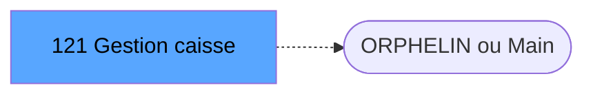
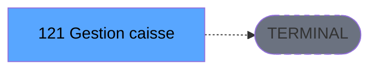

# ADH IDE 121 - Gestion caisse

> **Version spec**: 4.0
> **Analyse**: 2026-01-28 12:31
> **Source**: `D:\Data\Migration\XPA\PMS\ADH\Source\Prg_117.xml`
> **Methode**: APEX 4-Phase Workflow (Auto-generated)

---

<!-- TAB:Fonctionnel -->

## SPECIFICATION FONCTIONNELLE

### 1.1 Objectif metier

| Element | Description |
|---------|-------------|
| **Qui** | Operateur (utilisateur connecte) |
| **Quoi** | Gestion caisse |
| **Pourquoi** | Fonction metier du module ADH |
| **Declencheur** | Appel depuis programme parent ou menu |
| **Resultat** | Traitement effectue selon logique programme |

### 1.2 Regles metier

| Code | Regle | Condition |
|------|-------|-----------|
| RM-001 | Traitement principal | Conditions initiales validees |

### 1.3 Flux utilisateur

1. Reception des parametres d'entree (0 params)
2. Initialisation et verification conditions
3. Traitement principal (32 taches)
4. Appels sous-programmes (0 callees)
5. Retour resultats

### 1.4 Cas d'erreur

| Erreur | Comportement |
|--------|--------------|
| Conditions non remplies | Abandon avec message |
| Erreur sous-programme | Propagation erreur |
| Donnees invalides | Validation et rejet |

### 1.5 Dependances ECF

Programme partage via **ADH.ecf** - Composant: Gestion_Caisse_142

---

<!-- TAB:Technique -->

## SPECIFICATION TECHNIQUE

### 2.1 Identification

| Attribut | Valeur |
|----------|--------|
| **IDE Position** | 121 |
| **Fichier XML** | `Prg_117.xml` |
| **Description** | Gestion caisse |
| **Module** | ADH |
| **Public Name** | Gestion_Caisse_142 |
| **Nombre taches** | 32 |
| **Lignes logique** | 678 |
| **Expressions** | 0 |

### 2.2 Tables - 12 tables dont 4 en ecriture

| IDE# | Nom Physique | Nom Logique | Access | Usage |
|------|--------------|-------------|--------|-------|
| #23 | `cafil001_dat` | reseau_cloture___rec | **READ** | 1x |
| #70 | `cafil048_dat` | date_comptable___dat | **READ** | 1x |
| #197 | `caisse_artstock` | articles_en_stock | **LINK** | 1x |
| #198 | `caisse_banknote` | coupures_monnaie_locale | **READ** | 1x |
| #227 | `caisse_concurrences` | concurrence_sessions | **WRITE** | 1x |
| #232 | `caisse_devise` | gestion_devise_session | **READ** | 1x |
| #244 | `caisse_saisie_appro_dev` | saisie_approvisionnement | **LINK/WRITE** | 2x |
| #246 | `caisse_session` | histo_sessions_caisse | **LINK/READ/WRITE** | 6x |
| #248 | `caisse_session_coffre2` | sessions_coffre2 | **LINK/WRITE** | 3x |
| #249 | `caisse_session_detail` | histo_sessions_caisse_detail | **LINK/READ** | 4x |
| #697 | `droits` | droits_applications | **READ** | 2x |
| #740 | `pv_stockmvt_dat` | pv_stock_movements | **READ** | 2x |

> *Liste limitee aux 20 tables principales*

### 2.3 Parametres d'entree - 0 parametres

| Var | Nom | Type | Direction | Picture |
|-----|-----|------|-----------|---------|
| - | Aucun parametre | - | - | - |

### 2.4 Algorigramme

### 2.5 Expressions cles (selection)

| # | Expression | Commentaire |
|---|------------|-------------|
| - | Aucune expression | - |

> *0 expressions au total. Liste limitee aux 10 premieres.*

### 2.6 Statistiques

| Metrique | Valeur |
|----------|--------|
| **Taches** | 32 |
| **Lignes logique** | 678 |
| **Expressions** | 0 |
| **Parametres** | 0 |
| **Tables accedees** | 12 |
| **Tables en ecriture** | 4 |
| **Callees niveau 1** | 0 |

---

<!-- TAB:Cartographie -->

## CARTOGRAPHIE APPLICATIVE

### 3.1 Chaine d'appels depuis Main

### 3.2 Callers directs

| IDE | Programme | Nb appels |
|-----|-----------|-----------|
| - | ECF partage - appels cross-projet | - |

### 3.3 Callees (3 niveaux)

| Niv | IDE | Programme | Nb appels | Status |
|-----|-----|-----------|-----------|--------|
| - | - | TERMINAL (aucun appel) | - | - |

### 3.4 Composants ECF utilises

| ECF | IDE | Public Name | Description |
|-----|-----|-------------|-------------|
| ADH.ecf | 121 | Gestion_Caisse_142 | Sessions_Reprises |

### 3.5 Verification orphelin

| Critere | Resultat |
|---------|----------|
| Callers actifs | 0 programmes |
| PublicName | Defini: Gestion_Caisse_142 |
| ECF partage | OUI - ADH.ecf |
| **Conclusion** | **NON ORPHELIN** - ECF shared component (ADH.ecf) |

---

## NOTES MIGRATION

### Complexite

| Critere | Score | Detail |
|---------|-------|--------|
| Taches | 32 | Complexe |
| Tables | 12 | Ecriture (4 tables) |
| Callees | 0 | Faible couplage |
| **Score global** | **1058** | **HAUTE** |

### Points d'attention migration

| Point | Solution moderne |
|-------|-----------------|
| Variables globales (VG*) | Service/Repository injection |
| Tables Magic | Entity Framework / Dapper |
| CallTask | Service method calls |
| Forms | React/Angular components |

---

## HISTORIQUE

| Date | Action | Auteur |
|------|--------|--------|
| 2026-01-28 12:31 | **V4.0 APEX Workflow** - Generation automatique 4 phases | Script |

---

*Specification V4.0 - Generated with APEX 4-Phase Workflow*

