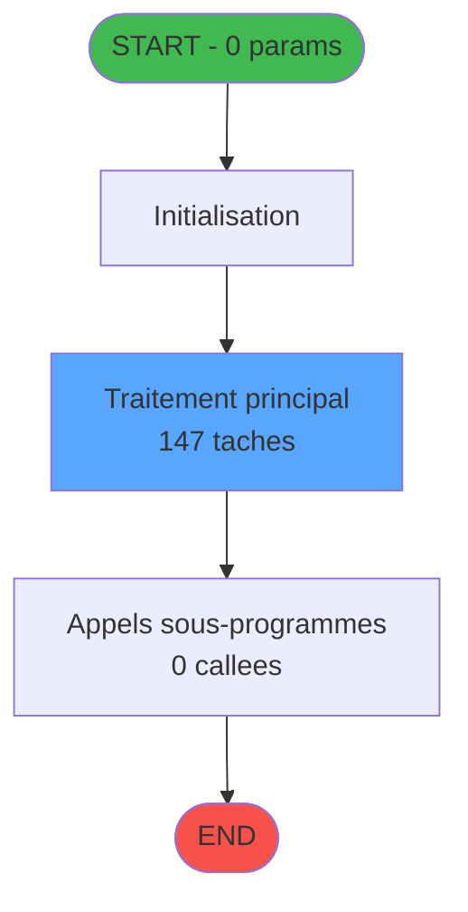
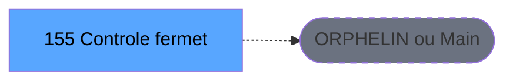
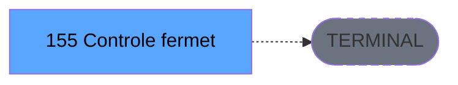

# ADH IDE 155 - Controle fermeture caisse WS

> **Version spec**: 4.0
> **Analyse**: 2026-01-27 23:07
> **Source**: `D:\Data\Migration\XPA\PMS\ADH\Source\Prg_151.xml`
> **Methode**: APEX + PDCA (Auto-generated)

---

<!-- TAB:Fonctionnel -->

## SPECIFICATION FONCTIONNELLE

### 1.1 Objectif metier

| Element | Description |
|---------|-------------|
| **Qui** | Operateur (utilisateur connecte) |
| **Quoi** | Controle fermeture caisse WS |
| **Pourquoi** | Fonction metier du module ADH |
| **Declencheur** | Appel depuis programme parent ou menu |
| **Resultat** | Traitement effectue selon logique programme |

### 1.2 Regles metier

| Code | Regle | Condition |
|------|-------|-----------|
| RM-001 | Execution du traitement principal | Conditions d'entree validees |
| RM-002 | Gestion des tables (32 tables) | Acces selon mode (R/W/L) |
| RM-003 | Appels sous-programmes (0 callees) | Selon logique metier |

### 1.3 Flux utilisateur

1. Reception des parametres d'entree (0 params)
2. Initialisation et verification conditions
3. Traitement principal (147 taches)
4. Appels sous-programmes si necessaire
5. Retour resultats

### 1.4 Cas d'erreur

| Erreur | Comportement |
|--------|--------------|
| Conditions non remplies | Abandon avec message |
| Erreur sous-programme | Propagation erreur |

---

<!-- TAB:Technique -->

## SPECIFICATION TECHNIQUE

### 2.1 Identification

| Attribut | Valeur |
|----------|--------|
| **IDE Position** | 155 |
| **Fichier XML** | `Prg_151.xml` |
| **Description** | Controle fermeture caisse WS |
| **Module** | ADH |
| **Public Name** |  |
| **Nombre taches** | 147 |
| **Lignes logique** | 3366 |
| **Expressions** | 0 |

### 2.2 Tables

| # | Nom logique | Nom physique | Acces | Usage |
|---|-------------|--------------|-------|-------|
| 31 | gm-complet_______gmc | cafil009_dat | READ | Lecture |
| 40 | comptable________cte | cafil018_dat | LINK | Jointure |
| 44 | change___________chg | cafil022_dat | READ | Lecture |
| 77 | articles_________art | cafil055_dat | LINK | Jointure |
| 90 | devises__________dev | cafil068_dat | READ | Lecture |
| 147 | change_vente_____chg | cafil125_dat | READ | Lecture |
| 197 | articles_en_stock | caisse_artstock | LINK | Jointure |
| 232 | gestion_devise_session | caisse_devise | READ/WRITE | Lecture+Ecriture |
| 241 | pointage_appro_remise | caisse_pointage_apprem | LINK/READ/WRITE | Jointure+R/W |
| 242 | pointage_article | caisse_pointage_article | LINK/READ/WRITE | Jointure+R/W |
| 243 | pointage_devise | caisse_pointage_devise | LINK/READ/WRITE | Jointure+R/W |
| 246 | histo_sessions_caisse | caisse_session | READ/WRITE | Lecture+Ecriture |
| 247 | histo_sessions_caisse_article | caisse_session_article | LINK | Jointure |
| 248 | sessions_coffre2 | caisse_session_coffre2 | LINK | Jointure |
| 249 | histo_sessions_caisse_detail | caisse_session_detail | LINK/READ | Jointure+Lecture |
| 250 | histo_sessions_caisse_devise | caisse_session_devise | LINK/READ | Jointure+Lecture |
| 251 | histo_sessions_caisse_remise | caisse_session_remise | READ | Lecture |
| 263 | vente | caisse_vente | LINK | Jointure |
| 505 | pv_comptable | %club_user%_pv_cafil18_dat | LINK/WRITE | Jointure+Ecriture |
| 510 | pv_discounts | %club_user%_pv_disctmp_dat | WRITE | Ecriture |
| 697 | droits_applications | droits | READ | Lecture |

**Resume**: 32 tables accedees dont **7 en ecriture**

### 2.3 Parametres d'entree (0 parametres)

| Var | Nom | Type | Picture |
|-----|-----|------|---------|
| - | Aucun parametre | - | - |

### 2.4 Algorigramme

### 2.5 Statistiques

| Metrique | Valeur |
|----------|--------|
| **Taches** | 147 |
| **Lignes logique** | 3366 |
| **Expressions** | 0 |
| **Parametres** | 0 |
| **Tables accedees** | 32 |
| **Tables en ecriture** | 7 |
| **Callees niveau 1** | 0 |

---

<!-- TAB:Cartographie -->

## CARTOGRAPHIE APPLICATIVE

### 3.1 Chaine d'appels depuis Main

### 3.2 Callers directs

| IDE | Programme | Nb appels |
|-----|-----------|-----------|
| - | ORPHELIN ou Main direct | - |

### 3.3 Callees (3 niveaux)

| Niv | IDE | Programme | Nb appels | Status |
|-----|-----|-----------|-----------|--------|
| - | - | TERMINAL | - | - |

### 3.4 Composants ECF utilises

| ECF | IDE | Public Name | Description |
|-----|-----|-------------|-------------|
| - | - | Aucun composant ECF | - |

### 3.5 Verification orphelin

| Critere | Resultat |
|---------|----------|
| Callers actifs | 0 programmes |
| PublicName | Non defini |
| ECF partage | NON |
| **Conclusion** | **ORPHELIN** - Pas de callers actifs |

---

## NOTES MIGRATION

### Complexite

| Critere | Score | Detail |
|---------|-------|--------|
| Taches | 147 | Complexe |
| Tables | 32 | Ecriture |
| Callees | 0 | Faible couplage |
| **Score global** | **HAUTE** | - |

### Points d'attention migration

| Point | Solution moderne |
|-------|-----------------|
| Variables globales (VG*) | Service/Repository injection |
| Tables Magic | Entity Framework / Dapper |
| CallTask | Service method calls |
| Forms | React/Angular components |

---

## HISTORIQUE

| Date | Action | Auteur |
|------|--------|--------|
| 2026-01-27 23:07 | **V4.0 APEX/PDCA** - Generation automatique complete | Script |

---

*Specification V4.0 - Auto-generated with APEX/PDCA methodology*

