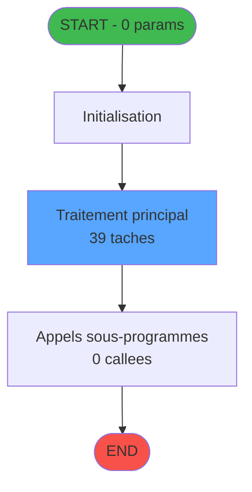
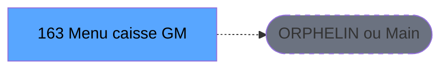
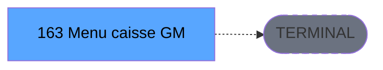

# ADH IDE 163 - Menu caisse GM - scroll

> **Version spec**: 4.0
> **Analyse**: 2026-01-27 23:07
> **Source**: `D:\Data\Migration\XPA\PMS\ADH\Source\Prg_159.xml`
> **Methode**: APEX + PDCA (Auto-generated)

---

<!-- TAB:Fonctionnel -->

## SPECIFICATION FONCTIONNELLE

### 1.1 Objectif metier

| Element | Description |
|---------|-------------|
| **Qui** | Operateur (utilisateur connecte) |
| **Quoi** | Menu caisse GM - scroll |
| **Pourquoi** | Fonction metier du module ADH |
| **Declencheur** | Appel depuis programme parent ou menu |
| **Resultat** | Traitement effectue selon logique programme |

### 1.2 Regles metier

| Code | Regle | Condition |
|------|-------|-----------|
| RM-001 | Execution du traitement principal | Conditions d'entree validees |
| RM-002 | Gestion des tables (52 tables) | Acces selon mode (R/W/L) |
| RM-003 | Appels sous-programmes (0 callees) | Selon logique metier |

### 1.3 Flux utilisateur

1. Reception des parametres d'entree (0 params)
2. Initialisation et verification conditions
3. Traitement principal (39 taches)
4. Appels sous-programmes si necessaire
5. Retour resultats

### 1.4 Cas d'erreur

| Erreur | Comportement |
|--------|--------------|
| Conditions non remplies | Abandon avec message |
| Erreur sous-programme | Propagation erreur |

---

<!-- TAB:Technique -->

## SPECIFICATION TECHNIQUE

### 2.1 Identification

| Attribut | Valeur |
|----------|--------|
| **IDE Position** | 163 |
| **Fichier XML** | `Prg_159.xml` |
| **Description** | Menu caisse GM - scroll |
| **Module** | ADH |
| **Public Name** |  |
| **Nombre taches** | 39 |
| **Lignes logique** | 1507 |
| **Expressions** | 0 |

### 2.2 Tables

| # | Nom logique | Nom physique | Acces | Usage |
|---|-------------|--------------|-------|-------|
| 23 | reseau_cloture___rec | cafil001_dat | WRITE | Ecriture |
| 29 | voyages__________voy | cafil007_dat | LINK | Jointure |
| 30 | gm-recherche_____gmr | cafil008_dat | LINK/READ/WRITE | Jointure+R/W |
| 31 | gm-complet_______gmc | cafil009_dat | LINK/WRITE | Jointure+Ecriture |
| 34 | hebergement______heb | cafil012_dat | LINK | Jointure |
| 36 | client_gm | cafil014_dat | LINK | Jointure |
| 39 | depot_garantie___dga | cafil017_dat | LINK | Jointure |
| 40 | comptable________cte | cafil018_dat | LINK/READ | Jointure+Lecture |
| 41 | depot_objets_____doa | cafil019_dat | LINK | Jointure |
| 43 | solde_devises____sda | cafil021_dat | LINK | Jointure |
| 47 | compte_gm________cgm | cafil025_dat | LINK/READ/WRITE | Jointure+R/W |
| 63 | parametres___par | cafil041_dat | READ | Lecture |
| 67 | tables___________tab | cafil045_dat | READ | Lecture |
| 69 | initialisation___ini | cafil047_dat | LINK | Jointure |
| 78 | param__telephone_tel | cafil056_dat | READ | Lecture |
| 122 | unilateral_bilateral | cafil100_dat | READ | Lecture |
| 123 | fichier_messagerie | cafil101_dat | LINK/READ | Jointure+Lecture |
| 130 | fichier_langue | cafil108_dat | LINK | Jointure |
| 152 | parametres_pour_pabx | cafil130_dat | LINK | Jointure |
| 219 | communication_ims | caisse_com_ims | READ | Lecture |
| 246 | histo_sessions_caisse | caisse_session | READ | Lecture |
| 257 | numero_des_terminaux_ims | caisse_terminaux_ims | READ | Lecture |
| 263 | vente | caisse_vente | LINK | Jointure |
| 268 | cc_total_par_type | ccpartyp | LINK | Jointure |
| 280 | cotion_par_adherent | cotionadh_dat | LINK | Jointure |
| 285 | email | email | LINK/READ | Jointure+Lecture |
| 312 | ez_card | ezcard | LINK | Jointure |
| 340 | histo_fusionseparation | histo_fus_sep | LINK/READ/WRITE | Jointure+R/W |
| 358 | import_mod | moddossier_dat | LINK | Jointure |
| 423 | req_param | req_param_dat | LINK | Jointure |
| 697 | droits_applications | droits | READ | Lecture |
| 720 | arc_transac_entete_bar | arc_bartransacent | LINK | Jointure |
| 728 | arc_cc_total | arc_cctotal | LINK | Jointure |
| 740 | pv_stock_movements | pv_stockmvt_dat | READ | Lecture |
| 786 | qualite_avant_reprise | qualite_avant_reprise | LINK/READ | Jointure+Lecture |
| 805 | vente_par_moyen_paiement | vente_par_moyen_paiement | LINK | Jointure |
| 844 | stat_vendeur | %club_user%_stat_vendeur | LINK | Jointure |
| 876 | log_express_co | log_express_co | LINK | Jointure |
| 878 | categorie_operation_mw | categorie_operation_mw | READ | Lecture |
| 911 | log_booker | log_booker | WRITE | Ecriture |
| 934 | selection enregistrement diver | selection_enregistrement_div | LINK | Jointure |

**Resume**: 52 tables accedees dont **6 en ecriture**

### 2.3 Parametres d'entree (0 parametres)

| Var | Nom | Type | Picture |
|-----|-----|------|---------|
| - | Aucun parametre | - | - |

### 2.4 Algorigramme

### 2.5 Statistiques

| Metrique | Valeur |
|----------|--------|
| **Taches** | 39 |
| **Lignes logique** | 1507 |
| **Expressions** | 0 |
| **Parametres** | 0 |
| **Tables accedees** | 52 |
| **Tables en ecriture** | 6 |
| **Callees niveau 1** | 0 |

---

<!-- TAB:Cartographie -->

## CARTOGRAPHIE APPLICATIVE

### 3.1 Chaine d'appels depuis Main

### 3.2 Callers directs

| IDE | Programme | Nb appels |
|-----|-----------|-----------|
| - | ORPHELIN ou Main direct | - |

### 3.3 Callees (3 niveaux)

| Niv | IDE | Programme | Nb appels | Status |
|-----|-----|-----------|-----------|--------|
| - | - | TERMINAL | - | - |

### 3.4 Composants ECF utilises

| ECF | IDE | Public Name | Description |
|-----|-----|-------------|-------------|
| - | - | Aucun composant ECF | - |

### 3.5 Verification orphelin

| Critere | Resultat |
|---------|----------|
| Callers actifs | 0 programmes |
| PublicName | Non defini |
| ECF partage | NON |
| **Conclusion** | **ORPHELIN** - Pas de callers actifs |

---

## NOTES MIGRATION

### Complexite

| Critere | Score | Detail |
|---------|-------|--------|
| Taches | 39 | Complexe |
| Tables | 52 | Ecriture |
| Callees | 0 | Faible couplage |
| **Score global** | **HAUTE** | - |

### Points d'attention migration

| Point | Solution moderne |
|-------|-----------------|
| Variables globales (VG*) | Service/Repository injection |
| Tables Magic | Entity Framework / Dapper |
| CallTask | Service method calls |
| Forms | React/Angular components |

---

## HISTORIQUE

| Date | Action | Auteur |
|------|--------|--------|
| 2026-01-27 23:07 | **V4.0 APEX/PDCA** - Generation automatique complete | Script |

---

*Specification V4.0 - Auto-generated with APEX/PDCA methodology*

