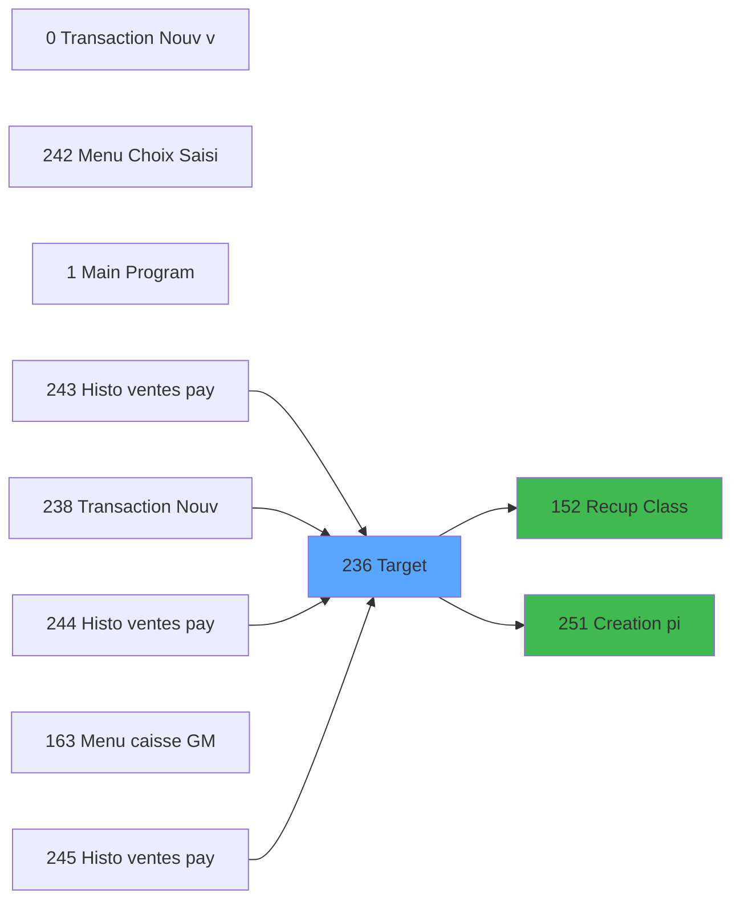

# ADH IDE 236 -  Print ticket vente PMS-584

> **Debut**: 2026-01-28 17:45:05
> **Fin**: 2026-01-28 17:47:09
> **Duree pipeline**: 23.3s
> **Pipeline**: V6.0 Deep Analysis
> **Niveau**: DETAILED (Migration)

<!-- TAB:Fonctionnel -->

## 1. IDENTIFICATION

| Attribut | Valeur |
|----------|--------|
| Projet | ADH |
| IDE Position | 236 |
| Nom Programme |  Print ticket vente PMS-584 |
| Statut Orphelin | NON_ORPHELIN |
| Raison | Appele par 4 programme(s): IDE 238, IDE 243, IDE 244 |

## 2. OBJECTIF METIER

 Print ticket vente PMS-584

### Contexte d'utilisation

- Appele depuis: Transaction Nouv vente PMS-584 (IDE 238), Histo ventes payantes (IDE 243), Histo ventes payantes /PMS-605 (IDE 244), Histo ventes payantes /PMS-623 (IDE 245)
- Appelle: Recup Classe et Lib du MOP (IDE 152), Creation pied Ticket (IDE 251)

<!-- TAB:Technique -->

## 3. MODELE DE DONNEES

### Tables par mode d'acces

#### WRITE (Modification)

| Table ID | Nom Logique | Nom Physique | Occurrences |
|----------|-------------|--------------|-------------|
#### READ (Lecture)

| Table ID | Nom Logique | Nom Physique | Occurrences |
|----------|-------------|--------------|-------------|
| 31 | gm-complet_______gmc | cafil009_dat | 2 |
| 34 | hebergement______heb | cafil012_dat | 2 |
| 40 | comptable________cte | cafil018_dat | 4 |
| 67 | tables___________tab | cafil045_dat | 1 |
| 69 | initialisation___ini | cafil047_dat | 1 |
| 77 | articles_________art | cafil055_dat | 2 |
| 596 | tempo_ecran_police | %club_user%tmp_ecrpolice_dat | 7 |
| 847 | stat_lieu_vente_date | %club_user%_stat_lieu_vente_date | 5 |
| 867 | log_maj_tpe | log_maj_tpe | 5 |
| 878 | categorie_operation_mw | categorie_operation_mw | 2 |
| 1037 | Table_1037 |  | 2 |
#### LINK (Reference)

| Table ID | Nom Logique | Nom Physique | Occurrences |
|----------|-------------|--------------|-------------|
| 34 | hebergement______heb | cafil012_dat | 2 |
| 67 | tables___________tab | cafil045_dat | 2 |
| 77 | articles_________art | cafil055_dat | 1 |
| 263 | vente | caisse_vente | 4 |
| 596 | tempo_ecran_police | %club_user%tmp_ecrpolice_dat | 7 |
| 728 | arc_cc_total | arc_cctotal | 1 |
| 818 | Circuit supprime | zcircafil146 | 1 |
| 847 | stat_lieu_vente_date | %club_user%_stat_lieu_vente_date | 10 |
| 904 | Boo_AvailibleEmployees | Boo_AvailibleEmployees | 3 |

## 4. VARIABLES ET PARAMETRES

### Variables Locales

| Lettre | Nom | Type | Picture |
|--------|-----|------|---------|
| A | P0 od annulation | Logical |  |
| A | V TOTAL | Numeric | 10.4 |
| A | V.Existe OD ? | Logical |  |
| A | V.Existe OD ? | Logical |  |
| A | v Libellé Moyen Paiement | Alpha | 20 |
| A | V TOTAL | Numeric | 10.4 |
| A | V.Existe OD ? | Logical |  |
| A | V.Existe OD ? | Logical |  |
| A | v Libellé Moyen Paiement | Alpha | 20 |
| A | V.Existe OD ? | Logical |  |
| A | v Libellé Moyen Paiement | Alpha | 20 |
| A | V.Existe OD ? | Logical |  |
| A | V.Date Début Séjour | Date |  |
| A | v Libellé Moyen Paiement | Alpha | 20 |
| A | V.Existe OD ? | Logical |  |
| A | V.Début séjour | Date |  |
| A | V.Existe OD ? | Logical |  |
| A | v Libellé Moyen Paiement | Alpha | 20 |
| A | v. retour OD | Logical |  |
| A | v. retour OD | Logical |  |
| B | P0 Nom | Alpha | 60 |
| B | V.Début séjour | Date |  |
| B | v.Existe Entête pour ce type Ar | Logical |  |
| B | v.Total mp | Numeric | N12.3 |
| B | V TOTAL | Numeric | 10.4 |
| B | v.Total mp | Numeric | N12.3 |
| B | V Total | Numeric | 10.4 |
| B | v.total mp | Numeric | N12.3 |
| B | V.Date Fin Séjour | Date |  |
| B | V.Total mp | Numeric | N12.3 |

## 5. LOGIQUE METIER

### Expressions Decodees

**Couverture**: 19 / 19 (100%)

#### Regles Metier Extraites

| ID | Condition | Resultat | Description |
|----|-----------|----------|-------------|
#### Top 20 Expressions

| IDE | Type | Expression Decodee |
|-----|------|-------------------|
| 1 | OTHER | `SetCrsr (2)` |
| 2 | OTHER | `SetCrsr (1)` |
| 3 | OTHER | `GetParam ('CURRENTPRINTERNUM')=1` |
| 4 | OTHER | `GetParam ('CURRENTPRINTERNUM')=4` |
| 5 | OTHER | `GetParam ('CURRENTPRINTERNUM')=5` |
| 6 | OTHER | `GetParam ('CURRENTPRINTERNUM')=8` |
| 7 | OTHER | `GetParam ('CURRENTPRINTERNUM')=9` |
| 8 | CONSTANT | `'VRL'` |
| 9 | CONSTANT | `'VSL'` |
| 10 | OTHER | `Var_V` |
| 11 | OTHER | `INIPut('EmbedFonts=N','FALSE'LOG)` |
| 12 | OTHER | `INIPut('CompressPDF =Y','FALSE'LOG)` |
| 13 | OTHER | `'TRUE'LOG` |
| 14 | OTHER | `VG78` |
| 15 | OTHER | `NOT VG78` |
| 16 | DATE | `Translate ('%TempDir%')&'ticket_vente_'&IF(Var_U,'OD_',''...` |
| 17 | OTHER | `GetParam ('CURRENTPRINTERNUM')` |
| 18 | OTHER | `ExpCalc('3'EXP) OR ExpCalc('7'EXP)` |
| 19 | OTHER | `Var_AX>0` |

## 6. INTERFACE UTILISATEUR

### Forms (Ecrans)

| Form ID | Nom | Type | Dimensions |
|---------|-----|------|------------|
| 2 | Veuillez patienter ... | MDI | 0 x 0 |
| 2 | Counter | MDI | 0 x 0 |
| 2 | Impression reçu change | MDI | 0 x 0 |
| 2 | Recherche dates de séjour | Type0 | 0 x 0 |
| 2 | Impression reçu change | MDI | 0 x 0 |
| 2 | Print reduction | Type0 | 0 x 0 |
| 2 | Edition Multi Moyen Paiement | Type0 | 0 x 0 |
| 2 | Print Tva | Type0 | 0 x 0 |
| 2 | Recherche dates de séjour | Type0 | 0 x 0 |
| 2 | Edition LCO Liberation | Type0 | 0 x 0 |
| 2 | Counter | MDI | 0 x 0 |
| 2 | Impression reçu change | MDI | 0 x 0 |
| 2 | Impression reçu change | MDI | 0 x 0 |
| 2 | Print reduction | Type0 | 0 x 0 |
| 2 | Print Tva | Type0 | 0 x 0 |
| 2 | Edition Multi Moyen Paiement | Type0 | 0 x 0 |
| 2 | Printer 5 | MDI | 0 x 0 |
| 2 | Veuillez patienter ... | MDI | 0 x 0 |
| 2 | Edition Multi Moyen Paiement | Type0 | 0 x 0 |
| 2 | Print reduction | Type0 | 0 x 0 |
| 2 | Print Tva | Type0 | 0 x 0 |
| 2 | Printer 5 | MDI | 0 x 0 |
| 2 | Veuillez patienter ... | MDI | 0 x 0 |
| 2 | Récup. dates de séjour /PMS28/ | Type0 | 0 x 0 |
| 2 | Edition Multi Moyen Paiement | Type0 | 0 x 0 |
| 2 | Print reduction | Type0 | 0 x 0 |
| 2 | Print Tva | Type0 | 0 x 0 |
| 2 | Printer 9 | MDI | 0 x 0 |
| 2 | Veuillez patienter ... | MDI | 0 x 0 |
| 2 | Edition LCO Liberation | Type0 | 0 x 0 |
| 2 | Récup. dates de séjour /PMS28/ | Type0 | 0 x 0 |
| 2 | Print reduction | Type0 | 0 x 0 |
| 2 | Edition Multi Moyen Paiement | Type0 | 0 x 0 |
| 2 | Print Tva | Type0 | 0 x 0 |
| 2 | recup terminal | Type0 | 0 x 0 |
| 2 | recup terminal | Type0 | 0 x 0 |
| 1 | Errors | Type0 | 0 x 0 |
| 1 |  | Type0 | 0 x 0 |
### Mockup ASCII

```
+--------------------------------------+
|        Veuillez patienter ...        |
+--------------------------------------+
|  [Form content - MDI]                |
|                                      |
+--------------------------------------+
```

<!-- TAB:Cartographie -->

## 7. GRAPHE D'APPELS

### 7.1 Chaine depuis Main



### 7.2 Callers (Qui m'appelle)

| IDE | Nom Programme | Nb Appels |
|-----|---------------|-----------|
| 238 | Transaction Nouv vente PMS-584 | 4 |
| 243 | Histo ventes payantes | 2 |
| 244 | Histo ventes payantes /PMS-605 | 2 |
| 245 | Histo ventes payantes /PMS-623 | 2 |

### 7.3 Callees (Qui j'appelle)

| IDE | Nom Programme | Nb Appels |
|-----|---------------|-----------|
| 152 | Recup Classe et Lib du MOP | 5 |
| 251 | Creation pied Ticket | 5 |

## 8. STATISTIQUES

| Metrique | Valeur |
|----------|--------|
| Taches | 38 |
| Lignes Logic | 1231 |
| Lignes Desactivees | 0 |
| Expressions | 19 |
| Regles Metier | 0 |
| Tables (total) | 15 |
| Tables WRITE | 0 |
| Tables READ | 11 |
| Callers | 4 |
| Callees | 2 |

---

## 9. NOTES MIGRATION

### Complexite estimee

**BASSE** - Moins de 100 expressions

### Points d'attention

- Tables en ecriture: 
- Dependances callees: 2 programmes appeles
- Expressions conditionnelles: 0

---
*Spec DETAILED generee par Pipeline V6.0 - 2026-01-28 17:46*
