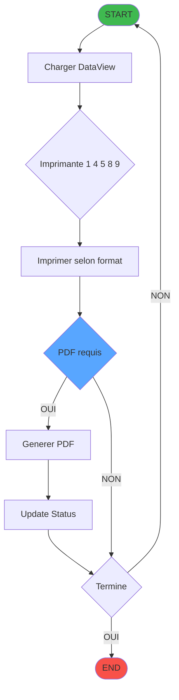
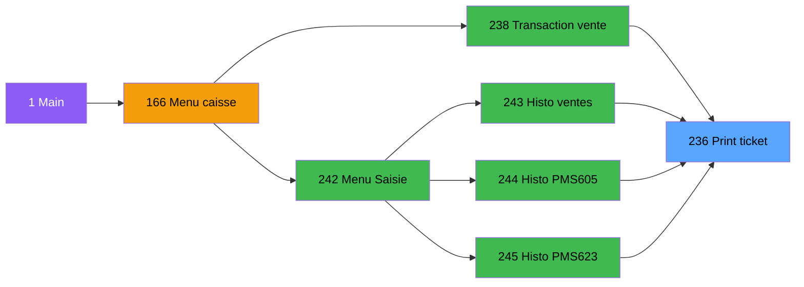

# ADH IDE 236 - Print ticket vente PMS-584

> **Version spec**: 3.4
> **Analyse**: 2026-01-27 09:15 → 09:35
> **Source**: `Prg_232.xml`

---

<!-- TAB:Fonctionnel -->

## SPECIFICATION FONCTIONNELLE

### 1.1 Objectif metier

| Element | Description |
|---------|-------------|
| **Qui** | Operateur de caisse |
| **Quoi** | Impression du ticket de vente |
| **Pourquoi** | Fournir un justificatif au client apres une vente |
| **Declencheur** | Validation d'une vente dans l'ecran de transaction |

### 1.2 Regles metier

| Code | Regle | Condition |
|------|-------|-----------|
| RM-001 | Impression multi-copies | Selon parametre `NUMBERCOPIES` |
| RM-002 | Format selon imprimante | Adapte selon `CURRENTPRINTERNUM` (1,4,5,8,9) |
| RM-003 | Gestion annulation | Affichage mention "ANNULATION" si flag active |
| RM-004 | Mode PDF optionnel | Generation fichier PDF si imprimante 1 ou 9 |
| RM-005 | Compression PDF | `CompressPDF=Y`, `EmbedFonts=N` |

### 1.3 Flux utilisateur

1. L'operateur valide une vente
2. Le systeme determine l'imprimante cible
3. Le ticket est formate selon le type d'imprimante
4. Impression physique OU generation PDF
5. Mise a jour du statut "Imprime"
6. Repetition si multi-copies demandees

### 1.4 Cas d'erreur

| Erreur | Comportement |
|--------|--------------|
| Imprimante non disponible | Message d'erreur systeme |
| Donnees manquantes | Ticket incomplet imprime |
| Annulation en cours | Mention "OD" ajoutee au nom fichier PDF |

---

<!-- TAB:Technique -->

## SPECIFICATION TECHNIQUE

### 2.1 Identification

| Attribut | Valeur |
|----------|--------|
| **Format IDE** | ADH IDE 236 |
| **Fichier XML** | Prg_232.xml |
| **Type** | B (Batch) |
| **Parametres** | 30 |
| **Module** | ADH |
| **Dossier IDE** | Ventes |

### 2.2 Tables (15 tables)

| IDE# | Nom Physique | Nom Logique | Access | Usage |
|------|--------------|-------------|--------|-------|
| #596 | `%club_user%tmp_ecrpolice_dat` | tempo_ecran_police | **W** | 14x |
| #31 | `cafil009_dat` | gm-complet_______gmc | R | 2x |
| #34 | `cafil012_dat` | hebergement______heb | R | 4x |
| #40 | `cafil018_dat` | comptable________cte | R | 4x |
| #67 | `cafil045_dat` | tables___________tab | R | 3x |
| #69 | `cafil047_dat` | initialisation___ini | R | 1x |
| #77 | `cafil055_dat` | articles_________art | R | 3x |
| #263 | `caisse_vente` | vente | R | 4x |
| #728 | `arc_cctotal` | arc_cc_total | R | 1x |
| #818 | `zcircafil146` | Circuit supprime | R | 1x |
| #847 | `%club_user%_stat_lieu_vente_date` | stat_lieu_vente_date | R | 15x |
| #867 | `log_maj_tpe` | log_maj_tpe | R | 5x |
| #878 | `categorie_operation_mw` | categorie_operation_mw | R | 2x |
| #904 | `Boo_AvailibleEmployees` | Boo_AvailibleEmployees | R | 3x |
| #1037 | `Table_1037` | Unknown | R | 2x |

### 2.3 Parametres d'entree (30)

| # | Nom | Type |
|---|-----|------|
| P1 | P0 od annulation | LOGICAL |
| P2 | P0 Nom | ALPHA |
| P3 | P0 Date | DATE |
| P4 | P0 Article libelle 1 | ALPHA |
| P5 | P0 Article complementaire | ALPHA |
| P6 | P0 Qte *NU* | NUMERIC |
| P7 | P0 Prix unitaire | NUMERIC |
| P8 | P0 Total | NUMERIC |
| P9 | P0 Devise locale | ALPHA |
| P10 | P0 Masque | ALPHA |
| P11 | P0 Chambre | ALPHA |
| P12 | P0 mode de paiement | ALPHA |
| P13 | P0 libelle paiement | ALPHA |
| P14 | PO is TAI | LOGICAL |
| P15 | P0 TAI Cash | ALPHA |
| P16 | P0 TAI start date | DATE |
| P17 | P0 TAI end date | DATE |
| P18 | W0 en-tete ? | ALPHA |
| P19 | W0 fin tache | ALPHA |
| P20 | W0 copies | NUMERIC |
| ... | (10 autres) | ... |

### 2.4 Algorigramme

### 2.5 Expressions cles

| # | Expression | Signification |
|---|------------|---------------|
| 3 | `GetParam('CURRENTPRINTERNUM')=1` | Imprimante principale |
| 4 | `GetParam('CURRENTPRINTERNUM')=4` | Imprimante A5 |
| 5 | `GetParam('CURRENTPRINTERNUM')=5` | Imprimante SLIP |
| 16 | `Translate('%TempDir%')&'ticket_vente_'...` | Chemin fichier PDF |
| 18 | `ExpCalc('3'EXP) OR ExpCalc('7'EXP)` | Condition PDF (Printer 1 ou 9) |

### 2.6 Statistiques

| Metrique | Valeur |
|----------|--------|
| Tables | 15 (1W / 14R) |
| Expressions | 705 |
| Expressions decodees | 448 (64%) |
| Variables locales | 39 |
| Taches | 41+ (selon imprimante) |

---

<!-- TAB:Cartographie -->

## CARTOGRAPHIE APPLICATIVE

### 3.1 Chaine d'appels depuis Main

> **Legende**: Violet = Main | Orange = Menu | Vert = Callers | Bleu = Cible

### 3.2 Callers directs (programmes qui appellent ADH IDE 236)

| IDE | Programme | Description | Nb appels | Chemin depuis Main |
|-----|-----------|-------------|-----------|-------------------|
| 238 | ADH IDE 238 | Transaction Nouv vente PMS-584 | 4 | Main → 166 → **238** → 236 |
| 243 | ADH IDE 243 | Histo ventes payantes | 2 | Main → 166 → 242 → **243** → 236 |
| 244 | ADH IDE 244 | Histo ventes payantes /PMS-605 | 2 | Main → 166 → 242 → **244** → 236 |
| 245 | ADH IDE 245 | Histo ventes payantes /PMS-623 | 2 | Main → 166 → 242 → **245** → 236 |

> **Total**: 10 appels depuis 4 programmes actifs

### 3.3 Callees - programmes appeles par ADH IDE 236

#### Diagramme d'impact downstream (3 niveaux)

> **Programme terminal** - ADH IDE 236 n'appelle aucun autre programme.
> C'est une "feuille" dans l'arbre d'appels : modification sans impact downstream.

#### Table des callees

| Niv | IDE | Programme | Description | Contexte |
|-----|-----|-----------|-------------|----------|
| - | - | Aucun | Programme terminal | Impression uniquement |

> **Impact**: Modification de ADH IDE 236 n'affecte **aucun programme** downstream

### 3.4 Verification orphelin

| Critere | Resultat |
|---------|----------|
| Callers (TaskID obj="232") | **4 programmes** |
| PublicName | Non |
| Dossier | Ventes (actif) |
| Distance depuis Main | 3-4 niveaux |
| **Conclusion** | **Programme ACTIF - NON ORPHELIN** |

### 3.5 Impact modification

| Type de changement | Programmes impactes | Severite |
|--------------------|---------------------|----------|
| Modification signature (params) | 4 programmes | CRITIQUE |
| Changement format ticket | Aucun (sortie) | BASSE |
| Ajout imprimante | Aucun | BASSE |
| Modification PDF settings | Aucun | BASSE |

### 3.6 Dependances externes

| Dependance | Type | Description |
|------------|------|-------------|
| `CURRENTPRINTERNUM` | GetParam | Parametre systeme imprimante |
| `NUMBERCOPIES` | GetParam | Nombre de copies |
| `%TempDir%` | Translate | Repertoire temporaire PDF |
| Table #867 | Donnees | Log MAJ TPE |

---

## HISTORIQUE

| Date | Action | Auteur |
|------|--------|--------|
| 2026-01-26 | Creation specification v2.0 | Claude |
| 2026-01-26 | Ajout section callers | Claude |
| 2026-01-26 | Upgrade v3.0: 3 onglets, timing, cartographie Mermaid | Claude |
| 2026-01-27 | Upgrade v3.1: Algorigramme, chaine Main complete | Claude |
| 2026-01-27 | v3.2 Correction syntaxe Mermaid, noms programmes dans diagrammes | Claude |
| 2026-01-27 | **v3.4** Ajout diagramme Callees downstream sur 3 niveaux | Claude |

---

*Specification v3.4 - Format avec Callees Diagram (impact downstream)*

---

## PARTIE I: SPECIFICATION FONCTIONNELLE (Annotations)

### 1.1 Objectif Metier
> A completer dans `.openspec/annotations/ADH-IDE-236.yaml`
### 1.2 Flux Utilisateur
> A completer dans annotations YAML

### 1.3 Notes Migration
> A completer dans annotations YAML

### 1.4 Dependances ECF

### 1.5 Tags
> Aucun tag defini

