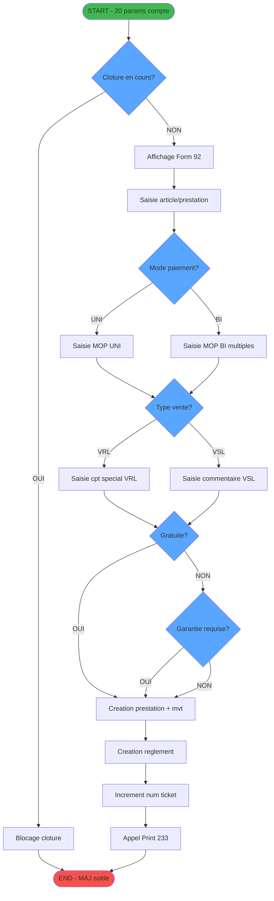
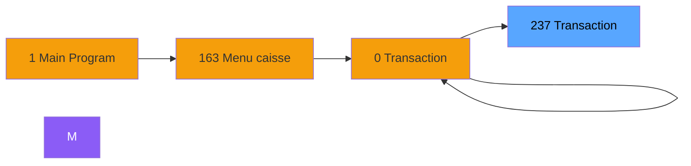
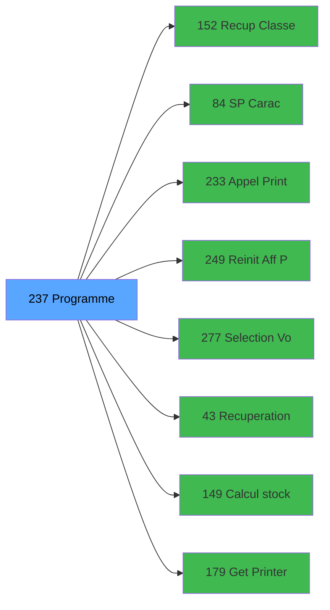

# ADH IDE 237 - Transaction Nouv vente avec GP

> **Version spec**: 3.6
> **Analyse**: 2026-01-27 22:20
> **Source**: `Prg_233.xml`

---

<!-- TAB:Fonctionnel -->

## SPECIFICATION FONCTIONNELLE

### 1.1 Objectif metier

| Element | Description |
|---------|-------------|
| **Qui** | Operateur caisse |
| **Quoi** | Saisie complete d'une transaction de vente avec Gift Pass (GP) |
| **Pourquoi** | Enregistrer une vente (article, service, prestation) avec paiement GP ou autre MOP |
| **Declencheur** | Selection menu "Nouvelle vente" depuis caisse (ADH IDE 163) |

### 1.2 Regles metier

| Code | Regle | Condition |
|------|-------|-----------|
| RM-001 | Verification cloture | Bloquer si cloture comptable en cours (tache 12-14) |
| RM-002 | Modes paiement | UNI = un seul MOP, BI = plusieurs MOP combines |
| RM-003 | Transfert compte | VSL transfere sur logement client (chambre) |
| RM-004 | Reglement local | VRL reglement immediat en caisse |
| RM-005 | Forfaits | Gestion dates debut/fin pour prestations forfaitaires |
| RM-006 | Gratuite | Verification si article offert (tache 25) |
| RM-007 | Garantie | Depot garantie obligatoire selon config (tache 31) |
| RM-008 | Multi-paiement | Changement MOP autorise avant validation (tache 34) |
| RM-009 | Transfert PAX | Affectation automatique ou manuelle des passagers |
| RM-010 | Liberation chambre | MAJ heure liberation si vente check-out |

### 1.3 Flux utilisateur

1. Reception parametres compte (societe, devise, solde, code GM, filiation, dates sejour)
2. Verification cloture en cours (blocage si oui)
3. Affichage ecran saisie vente (form 92)
4. Saisie article/prestation avec quantite et prix
5. Selection mode reglement (UNI ou BI)
6. Si VSL: saisie identification compte special
7. Si VRL: saisie reglement immediat
8. Verification gratuite et garantie
9. Creation prestation + mouvement + reglement
10. Increment numero ticket
11. Impression ticket (appel ADH IDE 233)
12. Retour avec MAJ solde compte

### 1.4 Cas d'erreur

| Erreur | Comportement |
|--------|--------------|
| Cloture en cours | Tache 12/13/14 - Message blocage, abandon |
| Erreur TPE | Tache 2 - Reglement suite erreur, retry |
| Verif total KO | Tache 5 - Recalcul montants |
| Reseau indisponible | Tache 16 - Test reseau, message erreur |

---

<!-- TAB:Technique -->

## SPECIFICATION TECHNIQUE

### 2.1 Identification

| Attribut | Valeur |
|----------|--------|
| **Format IDE** | ADH IDE 237 |
| **Description** | Transaction Nouv vente avec GP |
| **Module** | ADH |

### 2.2 Tables

| # | Nom logique | Nom physique | Acces | Usage |
|---|-------------|--------------|-------|-------|
| 23 | reseau_cloture___rec | `cafil001_dat` | R | 1x |
| 23 | reseau_cloture___rec | `cafil001_dat` | **W** | 4x |
| 26 | comptes_speciaux_spc | `cafil004_dat` | L | 1x |
| 30 | gm-recherche_____gmr | `cafil008_dat` | L | 2x |
| 30 | gm-recherche_____gmr | `cafil008_dat` | R | 1x |
| 32 | prestations | `cafil010_dat` | R | 1x |
| 32 | prestations | `cafil010_dat` | **W** | 2x |
| 34 | hebergement______heb | `cafil012_dat` | L | 1x |
| 39 | depot_garantie___dga | `cafil017_dat` | R | 1x |
| 46 | mvt_prestation___mpr | `cafil024_dat` | L | 1x |
| 46 | mvt_prestation___mpr | `cafil024_dat` | **W** | 1x |
| 47 | compte_gm________cgm | `cafil025_dat` | **W** | 2x |
| 50 | moyens_reglement_mor | `cafil028_dat` | R | 3x |
| 67 | tables___________tab | `cafil045_dat` | L | 1x |
| 68 | compteurs________cpt | `cafil046_dat` | **W** | 1x |
| 70 | date_comptable___dat | `cafil048_dat` | L | 1x |
| 77 | articles_________art | `cafil055_dat` | L | 2x |
| 77 | articles_________art | `cafil055_dat` | R | 2x |
| 79 | gratuites________gra | `cafil057_dat` | R | 1x |
| 89 | moyen_paiement___mop | `cafil067_dat` | L | 4x |
| 89 | moyen_paiement___mop | `cafil067_dat` | R | 4x |
| 96 | table_prestation_pre | `cafil074_dat` | L | 1x |
| 103 | logement_client__loc | `cafil081_dat` | R | 1x |
| 109 | table_utilisateurs | `cafil087_dat` | R | 1x |
| 139 | moyens_reglement_mor | `cafil117_dat` | R | 1x |
| 140 | moyen_paiement___mop | `cafil118_dat` | L | 1x |
| 197 | articles_en_stock | `caisse_artstock` | L | 1x |
| 372 | pv_budget | `pv_budget_dat` | L | 1x |
| 596 | tempo_ecran_police | `%club_user%tmp_ecrpolice_dat` | L | 4x |
| 596 | tempo_ecran_police | `%club_user%tmp_ecrpolice_dat` | R | 1x |
| 596 | tempo_ecran_police | `%club_user%tmp_ecrpolice_dat` | **W** | 2x |
| 697 | droits_applications | `droits` | L | 1x |
| 728 | arc_cc_total | `arc_cctotal` | L | 1x |
| 801 | moyens_reglement_complem | `moyens_reglement_complem` | L | 1x |
| 818 | Circuit supprime | `zcircafil146` | L | 1x |
| 847 | stat_lieu_vente_date | `%club_user%_stat_lieu_vente_date` | L | 10x |
| 847 | stat_lieu_vente_date | `%club_user%_stat_lieu_vente_date` | **W** | 3x |
| 899 | Boo_ResultsRechercheHoraire | `Boo_ResultsRechercheHoraire` | R | 2x |
| 899 | Boo_ResultsRechercheHoraire | `Boo_ResultsRechercheHoraire` | **W** | 6x |
| 1037 | Table_1037 | - | **W** | 3x |
### 2.3 Parametres d'entree (20 parametres)

| Variable | Nom | Type | Picture | Description |
|----------|-----|------|---------|-------------|
| A | P0 societe | ALPHA | U | Code societe (1 car) |
| B | P0 devise locale | ALPHA | U3 | Code devise (EUR, USD) |
| C | P0 masque montant | ALPHA | 16 | Format affichage montant |
| D | P0 solde compte | NUMERIC | N## ### ###.###Z | Solde actuel client |
| E | P0 code GM | NUMERIC | ########P0 | Numero compte GM |
| F | P0 filiation | NUMERIC | 3 | Numero filiation |
| G | P0 date fin sejour | DATE | ##/##/## | Date check-out |
| H | P0 etat compte | ALPHA | 1 | O=Ouvert, F=Ferme, B=Bloque |
| I | P0 date solde | DATE | ##/##/## | Date dernier mouvement |
| J | P0 garanti O/N | ALPHA | 1 | Flag garantie deposee |
| K | P0 Nom prenom | ALPHA | 60 | Identite client |
| L | P0 UNI/BI | ALPHA | 3 | Mode paiement |
| FD | P0 Date debut sejour | DATE | ##/##/## | Date check-in |
| FE | P0 Valide | NUMERIC | 1 | Flag validation |
| GA | P0 Nb decimales | NUMERIC | 1 | Precision devise |
### 2.4 Algorigramme

### 2.5 Expressions cles

| IDE | Expression | Commentaire |
|-----|------------|-------------|
| 1 | `DStr(Variable G, 'DD/MM/YYYY')` | Formatage date fin sejour |
| 2 | `IF(Trim(Variable BE)='1','ALLER',IF...)` | Determination sens transfert |
| 3 | `MlsTrans('Verifier transaction...')` | Message validation multilangue |
| 4 | `Date()` | Date systeme courante |
| 5 | `IF(Variable GG=0, IF(Variable W='VSL'...))` | Calcul date selon type vente |
| 6 | `NOT VG38` | Negation flag global cloture |
| 7 | `VG2` | Variable globale societe |
| 8 | `Trim(Variable EO)` | Nettoyage code article |
| 9 | `154` | Constante code operation |
| 10 | `Variable A` | P0 societe |
| 11 | `Variable E` | P0 code GM |
| 12 | `Variable F` | P0 filiation |
| 13 | `'F'` | Constante etat Ferme |
| 14 | `Date()` | Date courante |
| 15 | `Variable AW * Variable AV` | Calcul qte x prix unitaire |
| 16 | `(Variable AW * Variable AV) - Variable CQ` | Total moins remise |
| 17 | `'FALSE'LOG` | Constante logique faux |
| 18 | `'N'` | Constante Non |
| 19 | `1` | Constante numerique |
| 20 | `'CAISSE'` | Constante module origine |

> **Total**: 305 expressions - Principales decodees en format IDE

### 2.6 Variables importantes

| Variable | Nom | Type | Role |
|----------|-----|------|------|
| A | P0 societe | ALPHA(1) | Code societe courante |
| D | P0 solde compte | NUMERIC | Solde affiche et mis a jour |
| E | P0 code GM | NUMERIC | Identifiant compte client |
| F | P0 filiation | NUMERIC | Numero filiation client |
| H | P0 etat compte | ALPHA(1) | O/F/B - controle acces |
| L | P0 UNI/BI | ALPHA(3) | Mode paiement selectionne |
| M | Bouton IDENTITE | ALPHA | Action affichage identite |
| N | Bouton ABANDON | ALPHA | Action annulation |
| O | W0 FIN SAISIE OD | LOGICAL | Flag fin saisie operation |
| Q | W0 Cloture en cours | LOGICAL | Flag blocage cloture |
| VG2 | Societe globale | ALPHA | Variable globale societe |
| VG38 | Flag cloture | LOGICAL | Indicateur cloture comptable |

### 2.7 Statistiques

| Metrique | Valeur |
|----------|--------|
| **Taches** | 49 |
| **Lignes logique** | 1818 |
| **Lignes desactivees** | 0 |
| **Parametres** | 20 |
| **Tables accedees** | 37 (12 en ecriture) |
---

<!-- TAB:Cartographie -->

## CARTOGRAPHIE APPLICATIVE

### 3.1 Chaine d'appels depuis Main

### 3.2 Callers directs

| IDE | Programme | Nb appels |
|-----|-----------|-----------|
| 163 | Menu caisse GM - scroll | 1 |
| 242 | Menu Choix Saisie/Annul vente | 1 |
| 316 | Saisie transaction Nouv vente | 1 |
### 3.3 Callees

| Niv | IDE | Programme | Nb appels |
|-----|-----|-----------|-----------|
| 1 | 152 | Recup Classe et Lib du MOP | 4 |
| 1 | 84 |     SP Caractères Interdits | 2 |
| 1 | 233 | Appel Print ticket vente PMS28 | 2 |
| 1 | 249 | Reinit Aff PYR | 2 |
| 1 | 277 | Selection Vols /t Ville à côté | 2 |
| 1 | 43 | Recuperation du titre | 1 |
| 1 | 149 | Calcul stock produit WS | 1 |
| 1 | 179 | Get Printer | 1 |
| 1 | 180 | Printer choice | 1 |
| 1 | 181 | Set Listing Number | 1 |
| 1 | 182 | Raz Current Printer | 1 |
| 1 | 225 | Get Fidelisation et Remise | 1 |
| 1 | 227 | Get Matricule | 1 |
| 1 | 228 | Gestion Chèque | 1 |
| 1 | 241 | Solde Gift Pass | 1 |
| 1 | 247 | Deversement Transaction | 1 |
| 1 | 248 | Choix PYR (plusieurs chambres) | 1 |
| 1 | 254 | Solde Resort Credit | 1 |
| 1 | 257 | Zoom articles | 1 |
| 1 | 269 | Zoom services village | 1 |
### 3.4 Verification orphelin

| Critere | Resultat |
|---------|----------|
| Callers actifs | 3 programmes (163 Menu caisse, 242 Menu Choix, 316 Saisie) |
| **Conclusion** | NON ORPHELIN - point d'entree principal pour ventes GP |

---

## NOTES MIGRATION

### Complexite

| Critere | Score | Detail |
|---------|-------|--------|
| Taches | 49 | Tres nombreuses sous-taches metier |
| Tables | 37 | Lecture et ecriture multiples |
| Callees | 19 | Fort couplage avec modules annexes |
| Expressions | 305 | Logique complexe |
| **Score global** | ELEVE | Programme central, critique pour le metier |

### Points d'attention

1. **Cloture comptable (VG38)** - Mutex global, implementer avec lock distribue
2. **Multi-MOP (UNI/BI)** - Pattern Strategy pour gestion paiements
3. **Tables tempo** - Remplacer par cache Redis ou en memoire
4. **Form 92** - Ecran complexe, decomposer en composants
5. **CallTask 233** - Appel impression asynchrone
6. **Transactions** - 12 tables en ecriture = transaction unitaire obligatoire

### Dependances critiques

| Programme | Role | Priorite migration |
|-----------|------|-------------------|
| 152 | Recup Classe MOP | P0 - Prerequis |
| 233 | Print ticket | P1 - Couple |
| 241 | Solde Gift Pass | P1 - Couple |
| 254 | Solde Resort Credit | P1 - Couple |
| 247 | Deversement | P2 - Secondaire |

### Strategie recommandee

- **Pattern**: Saga pour transaction distribuee (creation + reglement + stock)
- **Architecture**: CQRS avec Command pour vente et Query pour soldes
- **UI**: React avec state machine (XState) pour le flux complexe
- **Tests**: Scenarii BDD pour chaque combinaison MOP/VRL/VSL

---

## HISTORIQUE

| Date | Action | Auteur |
|------|--------|--------|
| 2026-01-27 22:20 | **V3.6 APEX** - Analyse profonde, expressions IDE, algorigramme reel, notes migration | Claude |
| 2026-01-27 20:24 | **DATA V2** - Tables reelles, Expressions, Stats, CallChain | Script |
| 2026-01-27 19:50 | **DATA POPULATED** - Tables, Callgraph (305 expr) | Script |
| 2026-01-27 17:57 | **Upgrade V3.5** - TAB markers, Mermaid | Claude |

---

*Specification V3.6 - Analyse APEX avec expressions IDE et notes migration*
