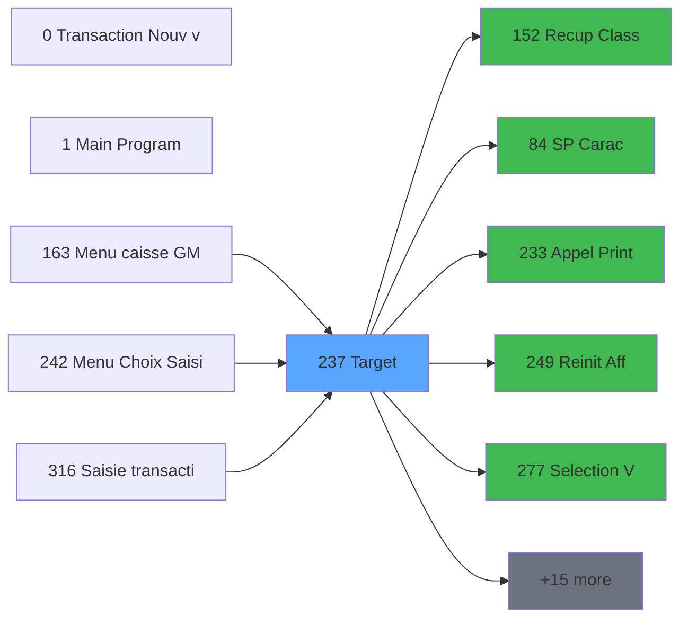

# ADH IDE 237 - Transaction Nouv vente avec GP

> **Debut**: 2026-01-28 17:47:37
> **Fin**: 2026-01-28 17:48:11
> **Duree pipeline**: 15.8s
> **Pipeline**: V6.0 Deep Analysis
> **Niveau**: DETAILED (Migration)

<!-- TAB:Fonctionnel -->

## 1. IDENTIFICATION

| Attribut | Valeur |
|----------|--------|
| Projet | ADH |
| IDE Position | 237 |
| Nom Programme | Transaction Nouv vente avec GP |
| Statut Orphelin | NON_ORPHELIN |
| Raison | Appele par 3 programme(s): IDE 163, IDE 242, IDE 316 |

## 2. OBJECTIF METIER

Transaction Nouv vente avec GP

### Contexte d'utilisation

- Appele depuis: Menu caisse GM - scroll (IDE 163), Menu Choix Saisie/Annul vente (IDE 242), Saisie transaction Nouv vente (IDE 316)
- Appelle: Recup Classe et Lib du MOP (IDE 152),     SP Caractères Interdits (IDE 84), Appel Print ticket vente PMS28 (IDE 233), Reinit Aff PYR (IDE 249), Selection Vols /t Ville à côté (IDE 277)

<!-- TAB:Technique -->

## 3. MODELE DE DONNEES

### Tables par mode d'acces

#### WRITE (Modification)

| Table ID | Nom Logique | Nom Physique | Occurrences |
|----------|-------------|--------------|-------------|
| 23 | reseau_cloture___rec | cafil001_dat | 4 |
| 32 | prestations | cafil010_dat | 2 |
| 46 | mvt_prestation___mpr | cafil024_dat | 1 |
| 47 | compte_gm________cgm | cafil025_dat | 2 |
| 68 | compteurs________cpt | cafil046_dat | 1 |
| 596 | tempo_ecran_police | %club_user%tmp_ecrpolice_dat | 2 |
| 847 | stat_lieu_vente_date | %club_user%_stat_lieu_vente_date | 3 |
| 899 | Boo_ResultsRechercheHoraire | Boo_ResultsRechercheHoraire | 6 |
| 1037 | Table_1037 |  | 3 |
#### READ (Lecture)

| Table ID | Nom Logique | Nom Physique | Occurrences |
|----------|-------------|--------------|-------------|
| 23 | reseau_cloture___rec | cafil001_dat | 1 |
| 30 | gm-recherche_____gmr | cafil008_dat | 1 |
| 32 | prestations | cafil010_dat | 1 |
| 39 | depot_garantie___dga | cafil017_dat | 1 |
| 50 | moyens_reglement_mor | cafil028_dat | 3 |
| 77 | articles_________art | cafil055_dat | 2 |
| 79 | gratuites________gra | cafil057_dat | 1 |
| 89 | moyen_paiement___mop | cafil067_dat | 4 |
| 103 | logement_client__loc | cafil081_dat | 1 |
| 109 | table_utilisateurs | cafil087_dat | 1 |
| 139 | moyens_reglement_mor | cafil117_dat | 1 |
| 596 | tempo_ecran_police | %club_user%tmp_ecrpolice_dat | 1 |
| 899 | Boo_ResultsRechercheHoraire | Boo_ResultsRechercheHoraire | 2 |
#### LINK (Reference)

| Table ID | Nom Logique | Nom Physique | Occurrences |
|----------|-------------|--------------|-------------|
| 26 | comptes_speciaux_spc | cafil004_dat | 1 |
| 30 | gm-recherche_____gmr | cafil008_dat | 2 |
| 34 | hebergement______heb | cafil012_dat | 1 |
| 46 | mvt_prestation___mpr | cafil024_dat | 1 |
| 67 | tables___________tab | cafil045_dat | 1 |
| 70 | date_comptable___dat | cafil048_dat | 1 |
| 77 | articles_________art | cafil055_dat | 2 |
| 89 | moyen_paiement___mop | cafil067_dat | 4 |
| 96 | table_prestation_pre | cafil074_dat | 1 |
| 140 | moyen_paiement___mop | cafil118_dat | 1 |
| 197 | articles_en_stock | caisse_artstock | 1 |
| 372 | pv_budget | pv_budget_dat | 1 |
| 596 | tempo_ecran_police | %club_user%tmp_ecrpolice_dat | 4 |
| 697 | droits_applications | droits | 1 |
| 728 | arc_cc_total | arc_cctotal | 1 |

## 4. VARIABLES ET PARAMETRES

### Variables Locales

| Lettre | Nom | Type | Picture |
|--------|-----|------|---------|
| A | P0 societe | Alpha | U |
| A | V.Existe MOP ? | Logical |  |
| A | V.Existe reglement ? | Logical |  |
| A | v Concatenation | Alpha | 11 |
| A | v Montant cumulé saisie | Numeric | N12.3 |
| A | v Montant cumulé saisie | Numeric | N12.3 |
| A | P.Toute ligne | Logical |  |
| A | b.Valider | Alpha | 10 |
| A | W2 Titre | Alpha | 2 |
| A | W1 fin tache | Alpha | U |
| A | W1 ret.lien forfait | Numeric | 1 |
| A | W1 fin tâche | Alpha | U |
| A | W2 date debut | Date | ##/##/##Z |
| A | W1 ret.lien gratuite | Numeric | 1 |
| A | W2 ret.lien imput | Numeric | 1 |
| A | Mont-GiftPass | Numeric | N12.3 |
| A | P.Ligne | Numeric | 3 |
| A | DETAIL | Alpha | 6 |
| A | V garantie trouvee | Logical |  |
| A | V.Changement effectue ? | Logical |  |
| A | P Type transfert Global | Alpha | 1 |
| A | P Type transfert Detail | Alpha | 1 |
| A | v.Sélectionné ? | Logical |  |
| A | p.o.Abandon | Logical |  |
| A | p.o.Nb chambres/LCO | Numeric | 4 |
| B | P0 devise locale | Alpha | U3 |
| B | V.Existe MOP ligne ? | Logical |  |
| B | b.abandonner | Alpha | 10 |
| B | b.Abandonner | Alpha | 10 |
| B | W2 Nom | Alpha | U30 |

## 5. LOGIQUE METIER

### Expressions Decodees

**Couverture**: 305 / 305 (100%)

#### Regles Metier Extraites

| ID | Condition | Resultat | Description |
|----|-----------|----------|-------------|
| RM-001 | `Trim(Var_BA)='1'` | 'ALLER' | Si Trim(Variable )='1' alors 'ALLER' sinon IF(T... |
| RM-002 | `Var_GA=0` | IF(Var_W='VSL' | Si Variable =0 alors IF(Var_W='VSL' sinon Var_M... |
| RM-003 | `Var_C=''` | '15.2' | Si Variable ='' alors '15.2' sinon Var_C) |
| RM-004 | `VG7 OR VG35 OR VG87` | 'Var_C'FORM | Si VG7 OR VG35 OR VG87 alors 'Var_C'FORM sinon ... |
| RM-005 | `NOT Var_CL` | Var_CK | Si NOT Variable  alors Var_CK sinon Var_CO) |
| RM-006 | `Var_W='VRL'` | 'Date consommation' | Si Variable ='VRL' alors 'Date consommation' si... |
| RM-007 | `Var_CO<>0 AND NOT(Var_CL)` | Fix(Var_CN*Var_CO/100 | Si Variable <>0 AND NOT(Variable ) alors Fix(Va... |
| RM-008 | `Var_GA=0` | IF(Var_W='VSL' | Si Variable =0 alors IF(Var_W='VSL' sinon Var_G... |
| RM-009 | `Var_W='VRL' OR Var_W='VSL'` | 'Nb forfait' | Si Variable ='VRL' OR Variable ='VSL' alors 'Nb... |
| RM-010 | `IN (Var_W` | 'VRL' | Si IN (Variable  alors 'VRL' sinon 'VSL','TRF',... |
| RM-011 | `IN (Var_W` | 'VRL' | Si IN (Variable  alors 'VRL' sinon 'VSL','TRF',... |
| RM-012 | `IN (Var_W` | 'VRL' | Si IN (Variable  alors 'VRL' sinon 'VSL','TRF',... |
| RM-013 | `IN (Var_W` | 'VRL' | Si IN (Variable  alors 'VRL' sinon 'VSL','TRF',... |
| RM-014 | `IN (Var_W` | 'VRL' | Si IN (Variable  alors 'VRL' sinon 'VSL','TRF',... |
| RM-015 | `IN (Var_W` | 'VRL' | Si IN (Variable  alors 'VRL' sinon 'VSL','TRF',... |
#### Top 20 Expressions

| IDE | Type | Expression Decodee |
|-----|------|-------------------|
| 1 | DATE | `DStr(Var_G,'DD/MM/YYYY')` |
| 2 | CONDITION | `IF(Trim(Var_BA)='1','ALLER',IF(Trim(Var_BA)='2','RETOUR',...` |
| 3 | STRING | `MlsTrans ('Verifier que la transaction est bien pour')&' ...` |
| 4 | DATE | `Date ()` |
| 5 | CONDITION | `IF(Var_GA=0,IF(Var_W='VSL',Var_M,Date()),Var_CR)` |
| 6 | OTHER | `NOT VG38` |
| 7 | OTHER | `VG2` |
| 8 | STRING | `Trim (Var_EM)` |
| 9 | CONSTANT | `154` |
| 10 | OTHER | `Var_A` |
| 11 | OTHER | `Var_E` |
| 12 | OTHER | `Var_F` |
| 13 | CONSTANT | `'F'` |
| 14 | DATE | `Date ()` |
| 15 | CALCULATION | `Var_AW*Var_AV` |
| 16 | CALCULATION | `(Var_AW*Var_AV)-Var_CQ` |
| 17 | OTHER | `'FALSE'LOG` |
| 18 | CONSTANT | `'N'` |
| 19 | CONSTANT | `1` |
| 20 | CONSTANT | `'CAISSE'` |

## 6. INTERFACE UTILISATEUR

### Forms (Ecrans)

| Form ID | Nom | Type | Dimensions |
|---------|-----|------|------------|
| 2 | Saisie transaction | Modal | 0 x 0 |
| 2 | Reglements suite a refus TPE | Type6 | 0 x 0 |
| 2 | verif reg restant | Type0 | 0 x 0 |
| 2 | creation règlement | Type0 | 0 x 0 |
| 2 | Verif reglement tpe | Type0 | 0 x 0 |
| 2 | Dé-Affecition | Type0 | 0 x 0 |
| 2 | Saisie Bilaterale | Type6 | 0 x 0 |
| 2 | Saisie mode de règlement | Type6 | 0 x 0 |
| 2 | RAZ 269 | MDI | 0 x 0 |
| 2 | Saisie Commentaires | Type6 | 0 x 0 |
| 2 | VRL : Saisie identité | MDI | 0 x 0 |
| 2 | Test si cloture en cours | MDI | 0 x 0 |
| 2 | Blocage cloture v1 | MDI | 0 x 0 |
| 2 | Blocage cloture v1 | MDI | 0 x 0 |
| 2 | Reaffichage infos compte | MDI | 0 x 0 |
| 2 | Test reseau | MDI | 0 x 0 |
| 2 | Forfait | MDI | 0 x 0 |
| 2 |  | Modal | 0 x 0 |
| 2 | Saisie dates forfait | MDI | 0 x 0 |
| 2 | Effacement forfait | MDI | 0 x 0 |
| 2 | Effacement mvt forfait | MDI | 0 x 0 |
| 2 | Creation prestation | MDI | 0 x 0 |
| 2 | Deblocage cloture v1 | MDI | 0 x 0 |
| 2 | Deblocage cloture | MDI | 0 x 0 |
| 2 | Gratuite ? | MDI | 0 x 0 |
| 2 | Recherche imputation/ssimput | MDI | 0 x 0 |
| 2 | Creation Tempo | MDI | 0 x 0 |
| 2 | Creation reglement | Type0 | 0 x 0 |
| 2 | Creation | Type0 | 0 x 0 |
| 2 | Affiche saisie | Modal | 0 x 0 |
| 2 | garantie? | MDI | 0 x 0 |
| 2 | RAZ 269 | MDI | 0 x 0 |
| 2 | Increment Num. Ticket(VRL/VSL) | Type0 | 0 x 0 |
| 2 | Changement MOP multi paiement | Type0 | 0 x 0 |
| 2 | calcul nombre carte | Type0 | 0 x 0 |
| 2 | Raz Affectation Transfert | Type0 | 0 x 0 |
| 2 | Compte Enregs affectés | Type0 | 0 x 0 |
| 2 | Type transfert | Type6 | 0 x 0 |
| 2 | Affiche Transfert A/R | Type6 | 0 x 0 |
| 2 | Affectation PAX / Transfert | Type0 | 0 x 0 |
| 2 | Supprime enregs non affectés | Type0 | 0 x 0 |
| 2 | Compte Enregs affectés | Type0 | 0 x 0 |
| 2 | Compte Enregs affectés | Type0 | 0 x 0 |
| 2 | Affectation Auto | Type0 | 0 x 0 |
| 2 | MaJ Num Chèque | Type0 | 0 x 0 |
| 2 | Libération du logement | Type0 | 0 x 0 |
| 2 | Creation_heure_liberation | Type0 | 0 x 0 |
| 2 | RAZ LCO liberation | Type0 | 0 x 0 |
| 2 | Récup nb chambre /LCO | Type0 | 0 x 0 |
### Mockup ASCII

```
+--------------------------------------+
|          Saisie transaction          |
+--------------------------------------+
|  [Form content - Modal]              |
|                                      |
+--------------------------------------+
```

<!-- TAB:Cartographie -->

## 7. GRAPHE D'APPELS

### 7.1 Chaine depuis Main



### 7.2 Callers (Qui m'appelle)

| IDE | Nom Programme | Nb Appels |
|-----|---------------|-----------|
| 163 | Menu caisse GM - scroll | 1 |
| 242 | Menu Choix Saisie/Annul vente | 1 |
| 316 | Saisie transaction Nouv vente | 1 |

### 7.3 Callees (Qui j'appelle)

| IDE | Nom Programme | Nb Appels |
|-----|---------------|-----------|
| 152 | Recup Classe et Lib du MOP | 4 |
| 84 |     SP Caractères Interdits | 2 |
| 233 | Appel Print ticket vente PMS28 | 2 |
| 249 | Reinit Aff PYR | 2 |
| 277 | Selection Vols /t Ville à côté | 2 |
| 43 | Recuperation du titre | 1 |
| 149 | Calcul stock produit WS | 1 |
| 179 | Get Printer | 1 |
| 180 | Printer choice | 1 |
| 181 | Set Listing Number | 1 |
| 182 | Raz Current Printer | 1 |
| 225 | Get Fidelisation et Remise | 1 |
| 227 | Get Matricule | 1 |
| 228 | Gestion Chèque | 1 |
| 241 | Solde Gift Pass | 1 |
| 247 | Deversement Transaction | 1 |
| 248 | Choix PYR (plusieurs chambres) | 1 |
| 254 | Solde Resort Credit | 1 |
| 257 | Zoom articles | 1 |
| 269 | Zoom services village | 1 |

## 8. STATISTIQUES

| Metrique | Valeur |
|----------|--------|
| Taches | 49 |
| Lignes Logic | 1818 |
| Lignes Desactivees | 0 |
| Expressions | 305 |
| Regles Metier | 31 |
| Tables (total) | 30 |
| Tables WRITE | 9 |
| Tables READ | 13 |
| Callers | 3 |
| Callees | 20 |

---

## 9. NOTES MIGRATION

### Complexite estimee

**HAUTE** - Plus de 200 expressions

### Points d'attention

- Tables en ecriture: reseau_cloture___rec, prestations, mvt_prestation___mpr, compte_gm________cgm, compteurs________cpt, tempo_ecran_police, stat_lieu_vente_date, Boo_ResultsRechercheHoraire, Table_1037
- Dependances callees: 20 programmes appeles
- Expressions conditionnelles: 31

---
*Spec DETAILED generee par Pipeline V6.0 - 2026-01-28 17:48*
