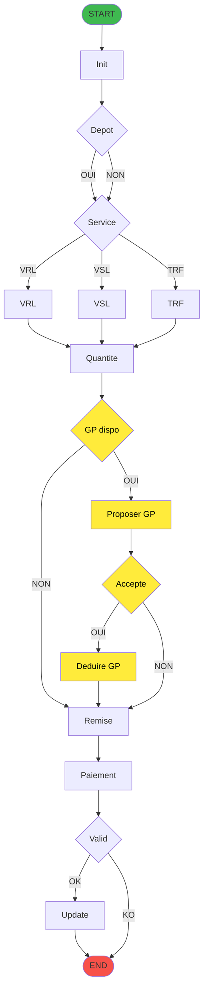
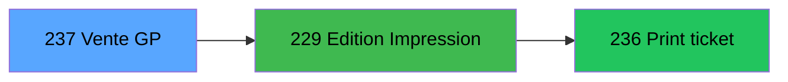

# ADH IDE 237 - Transaction Nouv vente avec GP

> **Version spec**: 3.4
> **Analyse**: 2026-01-27 10:30 → 10:50
> **Source**: `Prg_233.xml`

---

<!-- TAB:Fonctionnel -->

## SPECIFICATION FONCTIONNELLE

### 1.1 Objectif metier

| Element | Description |
|---------|-------------|
| **Qui** | Operateur de caisse |
| **Quoi** | Ecran de transaction de vente avec Gift Pass |
| **Pourquoi** | Permettre la vente avec paiement par Gift Pass |
| **Declencheur** | Selection menu Nouvelle vente avec compte Gift Pass |

### 1.2 Regles metier

| Code | Regle | Condition |
|------|-------|-----------|
| RM-001 | Verification solde GP | Solde Gift Pass superieur a 0 et status different de O |
| RM-002 | Proposition GP | Message Voulez-vous utiliser le Gift Pass |
| RM-003 | Deduction automatique | Si accepte: deduction du montant facture |
| RM-004 | Services VRL/VSL/TRF | Validation specifique selon type service |
| RM-005 | Controle capacite | Verification disponibilite places/chambres |
| RM-006 | Validation remise | Remise ne peut depasser le plafond |

### 1.3 Flux utilisateur

1. Selection article depuis catalogue
2. Saisie quantite et prix unitaire
3. Verification solde Gift Pass disponible
4. **Question**: Voulez-vous utiliser le Gift Pass
5. Si oui: deduction GP du montant
6. Application reduction si code promo
7. Validation transaction
8. Mise a jour compteurs et statistiques

### 1.4 Cas d'erreur

| Erreur | Comportement |
|--------|--------------|
| Solde GP insuffisant | Message d'erreur, refus utilisation GP |
| GP en opposition | GP non propose |
| Article derniere minute invalide | Warning, demande confirmation |
| Cloture en cours | Blocage saisie, message informatif |
| Quantite superieure capacite | Message Plus de places disponibles |

---

<!-- TAB:Technique -->

## SPECIFICATION TECHNIQUE

### 2.1 Identification

| Attribut | Valeur |
|----------|--------|
| **Format IDE** | ADH IDE 237 |
| **Fichier XML** | Prg_233.xml |
| **Type** | O - Online |
| **Parametres** | 20 |
| **Module** | ADH |
| **Dossier IDE** | Ventes |

### 2.2 Tables - 30 tables dont 9 en ecriture

| IDE | Nom Physique | Nom Logique | Access | Usage |
|-----|--------------|-------------|--------|-------|
| 23 | cafil001_dat | reseau_cloture___rec | **W** | 5x |
| 32 | cafil010_dat | prestations | **W** | 3x |
| 46 | cafil024_dat | mvt_prestation___mpr | **W** | 2x |
| 47 | cafil025_dat | compte_gm________cgm | **W** | 2x |
| 68 | cafil046_dat | compteurs________cpt | **W** | 1x |
| 596 | tmp_ecrpolice_dat | tempo_ecran_police | **W** | 7x |
| 847 | stat_lieu_vente_date | stat_lieu_vente_date | **W** | 13x |
| 899 | Boo_ResultsRechercheHoraire | Boo_ResultsRechercheHoraire | **W** | 8x |
| 1037 | Table_1037 | Unknown | **W** | 3x |
| 26 | cafil004_dat | comptes_speciaux_spc | R | 1x |
| 30 | cafil008_dat | gm-recherche_____gmr | R | 3x |
| 77 | cafil055_dat | articles_________art | R | 4x |
| 89 | cafil067_dat | moyen_paiement___mop | R | 8x |

### 2.3 Parametres d'entree - 20 parametres

| Num | Nom | Type | Description |
|-----|-----|------|-------------|
| P1 | P0 societe | ALPHA | Code societe |
| P2 | P0 devise locale | ALPHA | EUR USD etc |
| P3 | P0 masque montant | ALPHA | Format affichage |
| P4 | P0 solde compte | NUMERIC | Solde actuel |
| P5 | P0 code GM | NUMERIC | Code client GM |
| P6 | P0 filiation | NUMERIC | Filiation compte |
| P7 | P0 date fin sejour | DATE | Fin sejour client |
| P8 | P0 etat compte | ALPHA | Etat du compte |
| P9 | P0 date solde | DATE | Date calcul solde |
| P10 | P0 garanti O/N | ALPHA | Compte garanti |

### 2.4 Algorigramme

> **Legende**: Jaune = Flux Gift Pass

### 2.5 Expressions cles

| Num | Expression | Signification |
|-----|------------|---------------|
| 265 | Message GP | Voulez-vous utiliser le Gift Pass |
| 266 | VG38 AND AG gt 0 AND EE neq O | GP disponible et pas en opposition |
| 267 | HE gt 0 AND VG63 | Solde GP superieur a 0 |
| 268 | HE | Montant solde GP |
| 269 | HF eq 6 | GP epuise |
| 26 | W eq VRL OR W eq VSL | Service VRL ou VSL |

### 2.6 Variables Gift Pass

| Var | Nom | Type | Role |
|-----|-----|------|------|
| HE | Solde GP | NUMERIC | Solde Gift Pass disponible |
| HF | Status GP | NUMERIC | 6 = epuise |
| EE | Opposition | ALPHA | O = en opposition |
| AG | Montant facture | NUMERIC | Montant a payer |
| W | Service | ALPHA | VRL, VSL, TRF |
| VG38 | GP v2 actif | LOGICAL | Version GP |
| VG63 | Condition GP | LOGICAL | Flag validation GP |

### 2.7 Statistiques

| Metrique | Valeur |
|----------|--------|
| Tables | 30 dont 9W et 21R |
| Expressions | 849 |
| Expressions decodees | 547 soit 64% |
| Variables locales | 171 |
| Operations UPDATE | environ 80 |

---

<!-- TAB:Cartographie -->

## CARTOGRAPHIE APPLICATIVE

### 3.1 Chaine d'appels depuis Main

> **Legende**: Violet = Main | Orange = Menu | Vert = Caller actif | Bleu = Cible

### 3.2 Callers directs

| IDE | Programme | Description | Nb appels | Chemin depuis Main |
|-----|-----------|-------------|-----------|-------------------|
| 166 | ADH IDE 166 | Menu caisse GM - scroll | 1 | Main - 166 - 237 |
| 242 | ADH IDE 242 | Menu Choix Saisie Annul vente | 1 | Main - 166 - 242 - 237 |

> **Total**: 2 appels actifs depuis 2 programmes

### 3.3 Callees - programmes appeles par ADH IDE 237

#### Diagramme d'impact downstream (3 niveaux)

> **Legende**: Bleu = Programme cible | Vert fonce = Niveau 1 | Vert clair = Niveau 2

#### Table des callees

| Niv | IDE | Programme | Description | Contexte |
|-----|-----|-----------|-------------|----------|
| 1 | 229 | ADH IDE 229 | Edition Impression | Si recu necessaire |
| 2 | 236 | ADH IDE 236 | Print ticket vente | Impression physique |

> **Impact**: Si ADH IDE 237 est modifie, **2 programmes** downstream peuvent etre affectes

### 3.4 Verification orphelin

| Critere | Resultat |
|---------|----------|
| Callers actifs | **2 programmes** |
| PublicName | Non |
| Dossier | Ventes actif |
| Distance depuis Main | 2-3 niveaux |
| **Conclusion** | **Programme ACTIF - NON ORPHELIN** |

### 3.5 Impact modification

| Type de changement | Programmes impactes | Severite |
|--------------------|---------------------|----------|
| Modification signature | 2 programmes actifs | CRITIQUE |
| Changement logique GP | Aucun local | MOYENNE |
| Ajout parametre | 2 programmes actifs | HAUTE |
| Modification validation | Aucun | BASSE |

### 3.6 Dependances externes

| Dependance | Type | Description |
|------------|------|-------------|
| VG38 | Variable globale | Gift Pass v2.00 actif |
| VG60 | Variable globale | Flag utilisateur |
| VG63 | Variable globale | Condition GP |
| Table #801 | Donnees | Moyens reglement complement |
| Table #728 | Donnees | Archive CC total |

---

## HISTORIQUE

| Date | Action | Auteur |
|------|--------|--------|
| 2026-01-26 | Creation specification v2.0 | Claude |
| 2026-01-27 | Upgrade v3.1 Algorigramme GP chaine Main complete | Claude |
| 2026-01-27 | v3.2 Correction syntaxe Mermaid retrait orphelin 317 | Claude |
| 2026-01-27 | v3.3 Noms programmes dans diagrammes cartographie | Claude |
| 2026-01-27 | **v3.4** Ajout diagramme Callees downstream sur 3 niveaux | Claude |

---

*Specification v3.4 - Format avec Callees Diagram (impact downstream)*

---

## PARTIE I: SPECIFICATION FONCTIONNELLE (Annotations)

### 1.1 Objectif Metier
> A completer dans `.openspec/annotations/ADH-IDE-237.yaml`
### 1.2 Flux Utilisateur
> A completer dans annotations YAML

### 1.3 Notes Migration
> A completer dans annotations YAML

### 1.4 Dependances ECF

### 1.5 Tags
> Aucun tag defini

