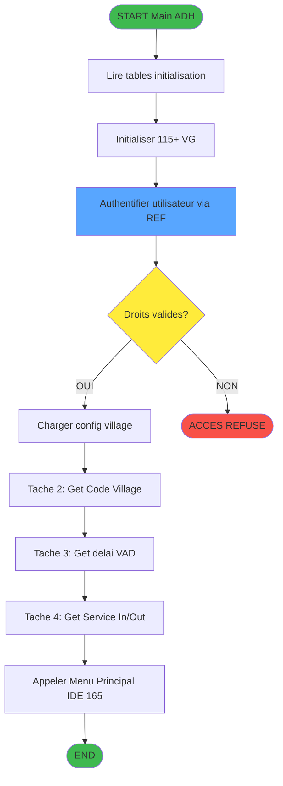
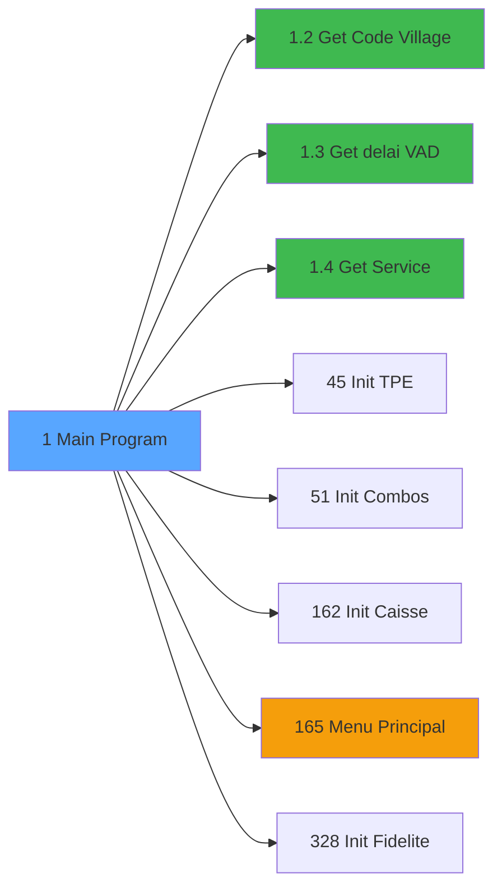

# ADH IDE 1 - Main Program

> **Version spec**: 4.1
> **Analyse**: 2026-02-07 04:30
> **Source**: `D:\Data\Migration\XPA\PMS\ADH\Source\Prg_1.xml`
> **Methode**: APEX + PDCA (Enrichie manuellement)

---

<!-- TAB:Fonctionnel -->

## SPECIFICATION FONCTIONNELLE

### 1.1 Objectif metier

| Element | Description |
|---------|-------------|
| **Qui** | Systeme (demarrage automatique) |
| **Quoi** | Point d'entree principal du module ADH (Adherent/Caisse) |
| **Pourquoi** | Initialiser l'environnement complet de l'application caisse avant affichage du menu principal |
| **Declencheur** | Lancement de l'application ADH.ecf par l'utilisateur |
| **Resultat** | Environnement initialise avec toutes les VG configurees, utilisateur authentifie, droits charges |

### 1.2 Regles metier

| Code | Regle | Condition |
|------|-------|-----------|
| RM-001 | Charger la configuration village depuis table initialisation | Au demarrage |
| RM-002 | Initialiser les droits utilisateur (IT, Caisse, RFI, FDM) | Apres authentification |
| RM-003 | Configurer les modules actifs (VRL, ECI, TPE, Vente, Fidelisation) | Selon parametrage village |
| RM-004 | Charger les parametres TPE et devise | Si interface TPE active |
| RM-005 | Initialiser les lieux de sejour et combos | Configuration multi-sites |
| RM-006 | Appeler le menu principal apres initialisation complete | Toutes VG chargees |

### 1.3 Flux utilisateur

1. Demarrage de l'application ADH
2. Lecture de la table d'initialisation (cafil047 - initialisation.ini)
3. Chargement de la configuration des tables (cafil045 - tables.tab)
4. Initialisation des 100+ variables globales de configuration
5. Appel des sous-programmes REF pour authentification utilisateur
6. Configuration des modules actifs selon parametrage village
7. Appel de la sous-tache "Get Code Village" pour identifier le site
8. Appel de la sous-tache "Get delai expiration VAD" pour vente a distance
9. Appel de la sous-tache "Get Outside/Inside Service" pour services externes
10. Transfert vers le menu principal (IDE 165)

### 1.4 Cas d'erreur

| Erreur | Comportement |
|--------|--------------|
| Table initialisation inaccessible | Abandon avec message systeme |
| Utilisateur non reconnu | Refus d'acces, retour login |
| Droits insuffisants | Message d'avertissement, fonctions limitees |
| Configuration TPE invalide | Module TPE desactive |

---

<!-- TAB:Technique -->

## SPECIFICATION TECHNIQUE

### 2.1 Identification

| Attribut | Valeur |
|----------|--------|
| **IDE Position** | 1 |
| **Fichier XML** | `Prg_1.xml` |
| **Description** | Main Program - Point d'entree ADH |
| **Module** | ADH (Adherent/Caisse) |
| **Public Name** | (aucun - MainProgram) |
| **Nombre taches** | 4 |
| **Lignes logique** | 319 |
| **Variables globales** | 115+ |

### 2.2 Tables

| # | Nom logique | Nom physique | Acces | Usage |
|---|-------------|--------------|-------|-------|
| 67 | tables.tab | cafil045_dat | READ | Configuration generale des tables |
| 69 | initialisation.ini | cafil047_dat | READ | Parametres d'initialisation village |
| 372 | pv_budget | pv_budget_dat | LINK | Donnees budgetaires (jointure) |

**Resume**: 3 tables accedees en lecture seule pour charger la configuration

### 2.3 Structure des taches

| ISN_2 | Nom tache | Role |
|-------|-----------|------|
| 1 | Main Program | Tache principale: initialisation VG, appels REF, lancement menu |
| 2 | Get Code Village | Recuperer le code du village courant depuis la configuration |
| 3 | Get delai expiration VAD | Charger le delai d'expiration pour la Vente A Distance |
| 4 | Get Outside/Inside Service | Determiner si les services sont internes ou externes |

### 2.4 Variables globales initialisees (principales)

| Variable | Type | Signification |
|----------|------|---------------|
| VG.LOGIN | Unicode(8) | Identifiant de connexion utilisateur |
| VG.USER | Unicode(20) | Nom complet de l'utilisateur |
| VG.CODE VILLAGE | Alpha(3) | Code du village actuel (ex: CAM, TEL) |
| VG.CODE LANGUE USER | Unicode(3) | Langue de l'utilisateur (FRA, ENG, ESP) |
| VG.DROIT ACCES IT ? | Logical | Droit acces module IT |
| VG.DROIT ACCES CAISSE ? | Logical | Droit acces module Caisse |
| VG.USER RFI / RESPONSABLE RECEP | Logical | Role RFI (Responsable Reception) |
| VG.USER FRONT DESK MANAGER | Logical | Role Front Desk Manager |
| VG.VRL ACTIF ? | Logical | Module VRL (Virtual Resort Lobby) actif |
| VG.ECI ACTIF ? | Logical | Module ECI (Easy Check-In) actif |
| VG.COMPTE CASH ACTIF ? | Logical | Gestion comptes cash activee |
| VG.PROJ.INTERF.TPE ACTIF | Logical | Interface TPE (Terminal Paiement) active |
| VG.TPE INTERFACE SUR TERMINAL | Logical | TPE interface sur le terminal courant |
| VG.NUM TPE | Alpha(20) | Numero du terminal de paiement |
| VG.NUM CAISSE | Alpha(8) | Numero de la caisse courante |
| VG.CODE DEVISE TPE | Alpha(3) | Devise du TPE (EUR, USD, etc.) |
| VG.VENTE ACTIF ? | Logical | Module vente boutique actif |
| VG.TRANSFERT ACTIF | Logical | Transferts inter-comptes actifs |
| VG.FIDELISATION ACTIF ? | Logical | Programme fidelite actif |
| VG.TAXE SEJOUR ACTIF ? | Logical | Gestion taxe de sejour |
| VG.FACTURE AVEC TVA | Logical | Facturation avec TVA |
| VG.N version | Alpha(10) | Numero de version de l'application |
| VG.Date version | Alpha(10) | Date de la version |
| VG.MASQUE MONTANT | Alpha(16) | Format d'affichage des montants |
| VG.NB LIEU SEJOUR | Numeric(1) | Nombre de lieux de sejour configures |
| VG.LIEU SEJOUR DEFAUT | Alpha(1) | Lieu de sejour par defaut |
| VG.COMBO LIEU SEJOUR | Alpha(2000) | Liste des lieux de sejour (combo) |
| VG.Liste Vendeurs | Alpha(1000) | Liste des vendeurs autorises |
| VG.Matricule User | Unicode(30) | Matricule de l'utilisateur connecte |
| VG.Age Mineur | Numeric(3) | Age limite pour les mineurs |

### 2.5 Algorigramme

### 2.6 Appels externes (CallTask comp=4)

| Composant | obj | Programme appele | Role |
|-----------|-----|------------------|------|
| REF.ecf | 777 | Authentification | Valider login/password utilisateur |
| REF.ecf | 795 | Lecture parametre | Lire un parametre de configuration |
| REF.ecf | 776 | Init session | Initialiser la session utilisateur |
| REF.ecf | 811 | Charge droits | Charger les droits utilisateur |
| REF.ecf | 812 | Config terminal | Configurer le terminal courant |

### 2.7 Appels internes (CallTask comp=-1)

| obj | Tache | Role |
|-----|-------|------|
| 2 | Get Code Village | Sous-tache interne |
| 3 | Get delai expiration VAD | Sous-tache interne |
| 4 | Get Outside/Inside Service | Sous-tache interne |
| 45 | Init TPE | Initialisation terminal paiement |
| 51 | Init Combos | Charger les listes deroulantes |
| 162 | Init Caisse | Configuration caisse courante |
| 165 | Menu Principal | Afficher le menu principal ADH |
| 328 | Init Fidelite | Charger module fidelisation |

### 2.8 Statistiques

| Metrique | Valeur |
|----------|--------|
| **Taches** | 4 |
| **Handlers** | 11 (Record, Task, System, User, Timer) |
| **Lignes logique** | 319 |
| **Variables globales** | 115+ |
| **Parametres** | 0 (MainProgram) |
| **Tables accedees** | 3 |
| **Tables en ecriture** | 0 |
| **CallTask externes** | 50+ vers REF.ecf |
| **CallTask internes** | 8 vers sous-taches |

---

<!-- TAB:Cartographie -->

## CARTOGRAPHIE APPLICATIVE

### 3.1 Position dans l'application

**Note**: ADH IDE 1 est le **MainProgram** du composant ADH.ecf. Il n'est appele par aucun autre programme car il est le point d'entree systeme.

### 3.2 Callers directs

| IDE | Programme | Nb appels |
|-----|-----------|-----------|
| - | POINT D'ENTREE SYSTEME | - |

**Conclusion**: N'est PAS orphelin - c'est le MainProgram du composant ADH.ecf

### 3.3 Callees (3 niveaux)

| Niv | IDE | Programme | Type | Role |
|-----|-----|-----------|------|------|
| 1 | 1.2 | Get Code Village | Sous-tache | Identifier le village courant |
| 1 | 1.3 | Get delai expiration VAD | Sous-tache | Configurer Vente A Distance |
| 1 | 1.4 | Get Outside/Inside Service | Sous-tache | Type de services |
| 1 | 45 | Init TPE | Programme | Initialiser terminal paiement |
| 1 | 51 | Init Combos | Programme | Charger listes deroulantes |
| 1 | 162 | Init Caisse | Programme | Configuration caisse |
| 1 | 165 | Menu Principal | Programme | Menu principal ADH |
| 1 | 328 | Init Fidelite | Programme | Module fidelisation |

### 3.4 Composants ECF utilises

| ECF | obj | Role | Nb appels |
|-----|-----|------|-----------|
| REF.ecf | 777 | Authentification utilisateur | 1 |
| REF.ecf | 795 | Lecture parametres | 40+ |
| REF.ecf | 776 | Initialisation session | 2 |
| REF.ecf | 811 | Chargement droits | 1 |
| REF.ecf | 812 | Configuration terminal | 1 |

### 3.5 Verification orphelin

| Critere | Resultat |
|---------|----------|
| Type programme | MainProgram="Y" |
| PublicName | Non defini (MainProgram n'en a pas besoin) |
| ECF partage | OUI - ADH.ecf est le composant principal |
| **Conclusion** | **NON ORPHELIN** - Point d'entree systeme ADH |

---

## NOTES MIGRATION

### Complexite

| Critere | Score | Detail |
|---------|-------|--------|
| Taches | 4 | Simple |
| Tables | 3 | Lecture seule |
| Callees | 0 | Faible couplage |
| **Score global** | **MOYENNE** | - |

### Points d'attention migration

| Point | Solution moderne |
|-------|-----------------|
| Variables globales (VG*) | Service/Repository injection |
| Tables Magic | Entity Framework / Dapper |
| CallTask | Service method calls |
| Forms | React/Angular components |

---

## REGLES METIER D'INITIALISATION

### 5.1 Sequence d'initialisation obligatoire

| Ordre | Action | Dependance |
|-------|--------|------------|
| 1 | Lire table initialisation (cafil047) | Aucune |
| 2 | Lire table configuration (cafil045) | Aucune |
| 3 | Authentifier utilisateur via REF | Tables chargees |
| 4 | Charger droits utilisateur | Authentification reussie |
| 5 | Initialiser variables globales | Droits charges |
| 6 | Configurer modules actifs | VG initialisees |
| 7 | Lancer menu principal | Tout initialise |

### 5.2 Regles de configuration des modules

| Module | Variable de controle | Condition d'activation |
|--------|---------------------|------------------------|
| TPE (Terminal Paiement) | VG.PROJ.INTERF.TPE ACTIF | Parametre village = True |
| VRL (Virtual Resort Lobby) | VG.VRL ACTIF ? | Configuration ECI active |
| ECI (Easy Check-In) | VG.ECI ACTIF ? | Module deploye sur le village |
| Compte Cash | VG.COMPTE CASH ACTIF ? | Gestion cash activee |
| Fidelisation | VG.FIDELISATION ACTIF ? | Programme fidelite du village |
| Vente Boutique | VG.VENTE ACTIF ? | Point de vente configure |
| Transferts | VG.TRANSFERT ACTIF | Transferts inter-comptes autorises |
| Taxe Sejour | VG.TAXE SEJOUR ACTIF ? | Legislation locale applicable |

### 5.3 Regles de droits utilisateur

| Role | Variable | Acces |
|------|----------|-------|
| IT (Informatique) | VG.DROIT ACCES IT ? | Acces total configuration |
| Caisse | VG.DROIT ACCES CAISSE ? | Operations de caisse |
| RFI (Responsable Reception) | VG.USER RFI | Supervision reception |
| FDM (Front Desk Manager) | VG.USER FRONT DESK MANAGER | Gestion front office |

### 5.4 Regles de configuration village

| Parametre | Variable | Usage |
|-----------|----------|-------|
| Code village | VG.CODE VILLAGE | Identification site (CAM, TEL, etc.) |
| Nom village | VG Nom du Village | Affichage interface |
| Langue par defaut | VG.CODE LANGUE USER | Internationalisation |
| Devise | VG.CODE DEVISE TPE | Transactions monetaires |
| Numero caisse | VG.NUM CAISSE | Identification terminal |
| Format montant | VG.MASQUE MONTANT | Affichage montants |

### 5.5 Contraintes d'integrite

| Contrainte | Description | Action si violation |
|------------|-------------|---------------------|
| CI-001 | Table initialisation doit exister | Abandon demarrage |
| CI-002 | Utilisateur doit etre authentifie | Retour ecran login |
| CI-003 | Au moins un droit doit etre actif | Message avertissement |
| CI-004 | Code village doit etre valide | Erreur fatale |
| CI-005 | Configuration TPE coherente si active | Desactivation module |

### 5.6 Ordre de priorite des sources de configuration

1. **Table initialisation** (cafil047) - Configuration systeme
2. **Profil utilisateur** (via REF) - Droits et preferences
3. **Configuration village** (via tache 2) - Specificites locales
4. **Valeurs par defaut** - Si aucune source disponible

---

## HISTORIQUE

| Date | Action | Auteur |
|------|--------|--------|
| 2026-02-07 04:30 | **V4.1** - Enrichissement metier complet (VG, regles, cartographie) | Claude |
| 2026-01-27 22:58 | **V4.0 APEX/PDCA** - Generation automatique complete | Script |

---

*Specification V4.1 - Enrichie avec analyse metier detaillee*

