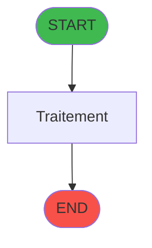
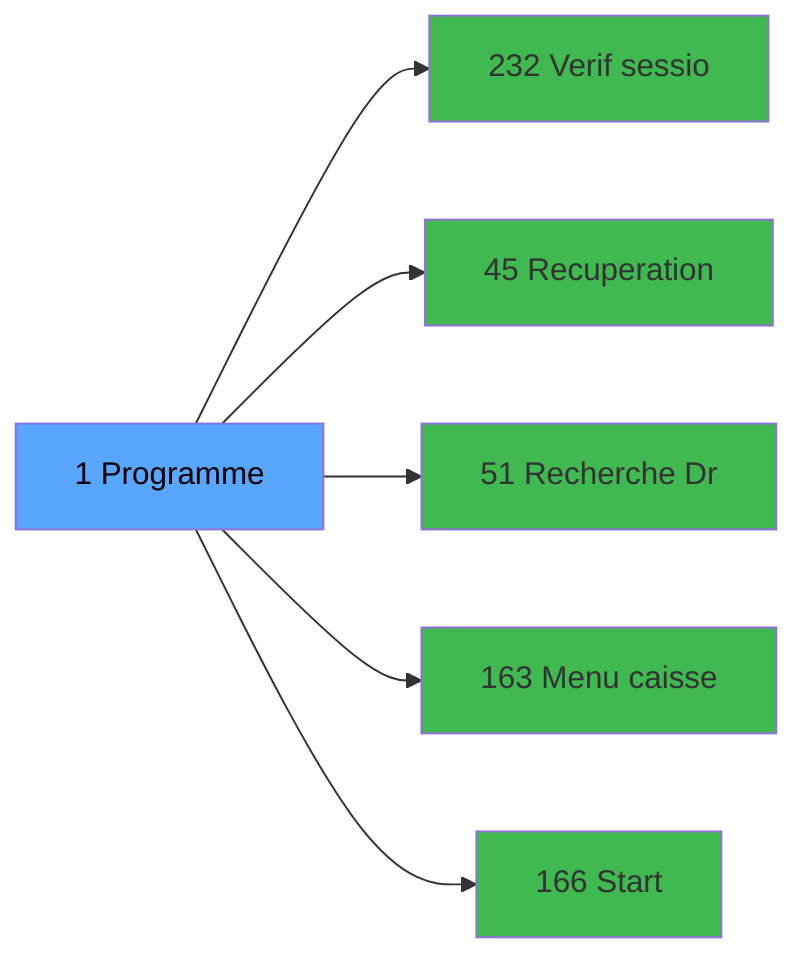

# ADH IDE 1 - Main Program

> **Version spec**: 3.5
> **Analyse**: 2026-01-27 17:56
> **Source**: `Prg_XXX.xml`

---

<!-- TAB:Fonctionnel -->

## SPECIFICATION FONCTIONNELLE

### 1.1 Objectif metier

| Element | Description |
|---------|-------------|
| **Qui** | Operateur |
| **Quoi** | Main Program
 |
| **Pourquoi** | A documenter |
| **Declencheur** | A identifier |

### 1.2 Regles metier

| Code | Regle | Condition |
|------|-------|-----------|
| RM-001 | A documenter | - |

### 1.3 Flux utilisateur

1. Demarrage programme
2. Traitement principal
3. Fin programme

### 1.4 Cas d'erreur

| Erreur | Comportement |
|--------|--------------|
| - | A documenter |

---

<!-- TAB:Technique -->

## SPECIFICATION TECHNIQUE

### 2.1 Identification

| Attribut | Valeur |
|----------|--------|
| **Format IDE** | ADH IDE 1 |
| **Description** | Main Program
 |
| **Module** | ADH |

### 2.2 Tables

| # | Nom logique | Nom physique | Acces | Usage |
|---|-------------|--------------|-------|-------|
| 67 | tables___________tab | `cafil045_dat` | R | 1x |
| 69 | initialisation___ini | `cafil047_dat` | R | 2x |
| 372 | pv_budget | `pv_budget_dat` | L | 1x |
### 2.3 Parametres d'entree

| Variable | Nom | Type | Picture |
|----------|-----|------|---------|
| - | Aucun parametre | - | - |
### 2.4 Algorigramme

### 2.5 Expressions cles

| IDE | Expression | Commentaire |
|-----|------------|-------------|
| 1 | `MnuShow ('Express Check-Out',{0,43})` | - |
| 2 | `RunMode ()<=2` | - |
| 3 | `RunMode ()<=2 OR IsComponent()` | - |
| 4 | `NOT(IsComponent())` | - |
| 5 | `CallProg(ProgIdx('hasRight','TRUE'LOG),{0,1},'C...` | - |
| 6 | `CallProg(ProgIdx('hasRight','TRUE'LOG),{0,1},'A...` | - |
| 7 | `'1.00'` | - |
| 8 | `'2.00'` | - |
| 9 | `'3.00'` | - |
| 10 | `'CALC.EXE'` | - |
| 11 | `'CA'` | - |
| 12 | `'TAX'` | - |
| 13 | `'4.11'` | - |
| 14 | `'08/01/2026'` | - |
| 15 | `ASCIIChr(13)&ASCIIChr(10)` | - |
| 16 | `'Caisse Adhérent -V '&Trim(ExpCalc('17'EXP))&' ...` | - |
| 17 | `'EFF'` | - |
| 18 | `'LEX'` | - |
| 19 | `'FTV'` | - |
| 20 | `'TPE'` | - |

> **Total**: 87 expressions (affichees: 20)
### 2.6 Variables importantes

### 2.7 Statistiques

| Metrique | Valeur |
|----------|--------|
| **Taches** | 4 |
| **Lignes logique** | 319 |
| **Lignes desactivees** | 0 |
---

<!-- TAB:Cartographie -->

## CARTOGRAPHIE APPLICATIVE

### 3.1 Chaine d'appels depuis Main

### 3.2 Callers directs

| IDE | Programme | Nb appels |
|-----|-----------|-----------|
| - | **Aucun caller** (point d'entree ou orphelin) | - |
### 3.3 Callees

| Niv | IDE | Programme | Nb appels |
|-----|-----|-----------|-----------|
| 1 | 232 | Verif session caisse ouverte | 2 |
| 1 | 45 | Recuperation langue | 1 |
| 1 | 51 | Recherche Droit Solde Free Ext | 1 |
| 1 | 163 | Menu caisse GM - scroll | 1 |
| 1 | 166 | Start | 1 |
### 3.4 Verification orphelin

| Critere | Resultat |
|---------|----------|
| Callers actifs | A verifier |
| **Conclusion** | A analyser |

---

## HISTORIQUE

| Date | Action | Auteur |
|------|--------|--------|
| 2026-01-27 20:17 | **DATA V2** - Tables reelles, Expressions, Stats, CallChain | Script |
| 2026-01-27 19:43 | **DATA POPULATED** - Tables, Callgraph (87 expr) | Script |
| 2026-01-27 17:56 | **Upgrade V3.5** - TAB markers, Mermaid | Claude |

---

*Specification V3.5 - Format avec TAB markers et Mermaid*
