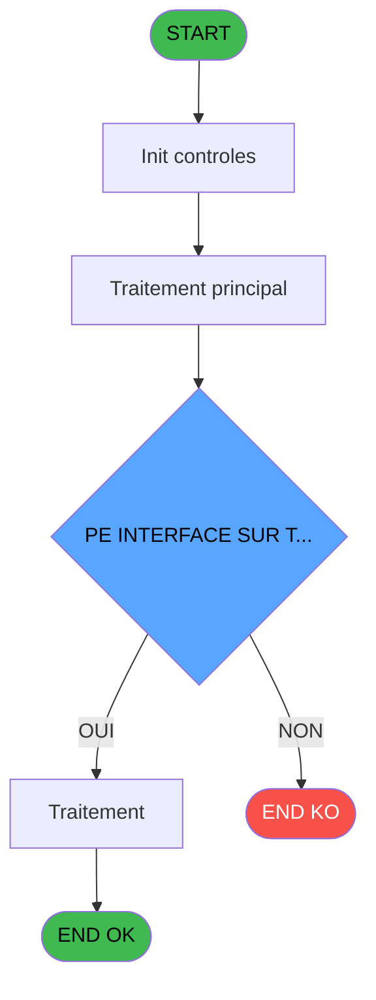
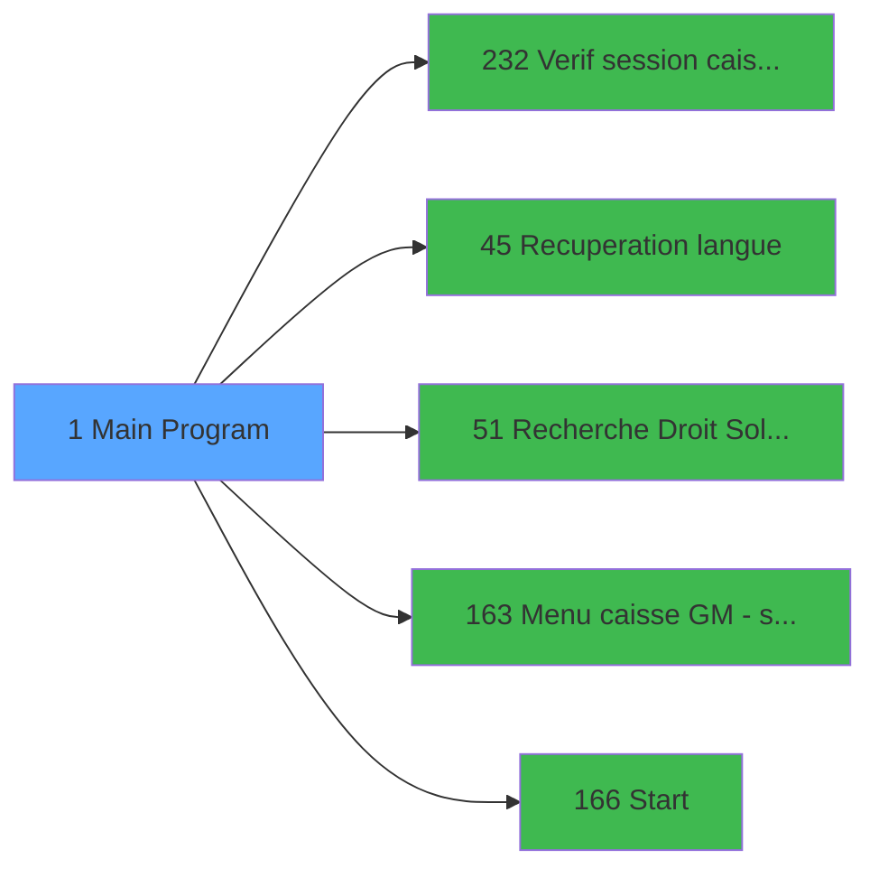

# ADH IDE 1 - Main Program

> **Analyse**: Phases 1-4 2026-02-08 00:59 -> 00:59 (6s) | Assemblage 00:59
> **Pipeline**: V7.2 Enrichi
> **Structure**: 4 onglets (Resume | Ecrans | Donnees | Connexions)

<!-- TAB:Resume -->

## 1. FICHE D'IDENTITE

| Attribut | Valeur |
|----------|--------|
| Projet | ADH |
| IDE Position | 1 |
| Nom Programme | Main Program |
| Fichier source | `Prg_1.xml` |
| Dossier IDE | General |
| Taches | 4 (0 ecrans visibles) |
| Tables modifiees | 0 |
| Programmes appeles | 5 |
| Complexite | **BASSE** (score 15/100) |
| Statut | **ORPHELIN_POTENTIEL** |

## 2. DESCRIPTION FONCTIONNELLE

ADH IDE 1 est le point d'entrée principal du système de gestion de caisse du projet ADH. Ce programme assure les vérifications préalables à toute session de caisse : il vérifie que la session caisse est ouverte (appel à IDE 232), récupère la langue de l'utilisateur (IDE 45), et contrôle les droits d'accès au solde free ext (IDE 51). Ces vérifications garantissent que l'utilisateur a les permissions nécessaires avant d'accéder aux fonctionnalités principales.

Une fois les validations effectuées, le programme initialise l'environnement utilisateur via le menu caisse avec scroll (IDE 163), puis dirige vers l'écran de démarrage principal (IDE 166). Ce flux séquentiel assure une initialisation cohérente et sécurisée de la session avant d'exposer les menus et écrans interactifs.

Ce programme agit comme contrôleur de session : il n'exécute pas directement la logique métier mais orchestre les validations et les routages qui permettent aux programmes spécialisés (ventes, zooms, extraction de compte) d'opérer dans un contexte d'utilisateur valide et autorisé.

## 3. BLOCS FONCTIONNELS

## 5. REGLES METIER

7 regles identifiees:

### Autres (7 regles)

#### [RM-001] Condition: RunMode () <= 2

| Element | Detail |
|---------|--------|
| **Condition** | `RunMode ()<=2` |
| **Si vrai** | Action si vrai |
| **Expression source** | Expression 2 : `RunMode ()<=2` |
| **Exemple** | Si RunMode ()<=2 → Action si vrai |

#### [RM-002] Condition composite: RunMode ()<=2 OR IsComponent()

| Element | Detail |
|---------|--------|
| **Condition** | `RunMode ()<=2 OR IsComponent()` |
| **Si vrai** | Action si vrai |
| **Expression source** | Expression 3 : `RunMode ()<=2 OR IsComponent()` |
| **Exemple** | Si RunMode ()<=2 OR IsComponent() → Action si vrai |

#### [RM-003] Condition composite: 'Caisse Adhérent -V '&Trim(ExpCalc('17'EXP))&' - '&Trim(ExpCalc('18'EXP)) & IF(VG.PROJ.INTERF.TPE ACTIF [X] AND VG.TPE INTERFACE SUR T... [Y]<>'', ' - TPE : ' & VG.TPE INTERFACE SUR T... [Y], '')

| Element | Detail |
|---------|--------|
| **Condition** | `'Caisse Adhérent -V '&Trim(ExpCalc('17'EXP))&' - '&Trim(ExpCalc('18'EXP)) & IF(VG.PROJ.INTERF.TPE ACTIF [X] AND VG.TPE INTERFACE SUR T... [Y]<>'', ' - TPE : ' & VG.TPE INTERFACE SUR T... [Y], '')` |
| **Si vrai** | Action si vrai |
| **Variables** | FK (VG.PROJ.INTERF.TPE ACTIF) |
| **Expression source** | Expression 16 : `'Caisse Adhérent -V '&Trim(ExpCalc('17'EXP))&' - '&Trim(ExpC` |
| **Exemple** | Si 'Caisse Adhérent -V '&Trim(ExpCalc('17'EXP))&' - '&Trim(ExpCalc('18'EXP)) & IF(VG.PROJ.INTERF.TPE ACTIF [X] AND VG.TPE INTERFACE SUR T... [Y]<>'', ' - TPE : ' & VG.TPE INTERFACE SUR T... [Y], '') → Action si vrai |

#### [RM-004] Negation de FileExist('%club_exportdata%'&'PDF') (condition inversee)

| Element | Detail |
|---------|--------|
| **Condition** | `NOT FileExist('%club_exportdata%'&'PDF')` |
| **Si vrai** | Action si vrai |
| **Expression source** | Expression 24 : `NOT FileExist('%club_exportdata%'&'PDF')` |
| **Exemple** | Si NOT FileExist('%club_exportdata%'&'PDF') → Action si vrai |

#### [RM-005] Verification: IsComponent

| Element | Detail |
|---------|--------|
| **Condition** | `IsComponent()` |
| **Si vrai** | Action si vrai |
| **Expression source** | Expression 51 : `IsComponent()` |
| **Exemple** | Si IsComponent() → Action si vrai |

#### [RM-006] Negation de VG.Interfaces OB [CZ] (condition inversee)

| Element | Detail |
|---------|--------|
| **Condition** | `NOT VG.Interfaces OB [CZ]` |
| **Si vrai** | Action si vrai |
| **Variables** | HM (VG.Interfaces OB) |
| **Expression source** | Expression 55 : `NOT VG.Interfaces OB [CZ]` |
| **Exemple** | Si NOT VG.Interfaces OB [CZ] → Action si vrai |

#### [RM-007] Condition composite: (Time()>= '21:00:00'TIME AND Time()<='21:02:00'TIME)

| Element | Detail |
|---------|--------|
| **Condition** | `(Time()>= '21:00:00'TIME AND Time()<='21:02:00'TIME)` |
| **Si vrai** | Action si vrai |
| **Expression source** | Expression 84 : `(Time()>= '21:00:00'TIME AND Time()<='21:02:00'TIME)` |
| **Exemple** | Si (Time()>= '21:00:00'TIME AND Time()<='21:02:00'TIME) → Action si vrai |

## 6. CONTEXTE

- **Appele par**: (aucun)
- **Appelle**: 5 programmes | **Tables**: 3 (W:0 R:2 L:1) | **Taches**: 4 | **Expressions**: 87

<!-- TAB:Ecrans -->

## 8. ECRANS

*(Programme sans ecran visible)*

## 9. NAVIGATION

### 9.3 Structure hierarchique (0 tache)

| Position | Tache | Type | Dimensions | Bloc |
|----------|-------|------|------------|------|

### 9.4 Algorigramme

> **Legende**: Vert = START/END OK | Rouge = END KO | Bleu = Decisions
> *Algorigramme auto-genere. Utiliser `/algorigramme` pour une synthese metier detaillee.*

<!-- TAB:Donnees -->

## 10. TABLES

### Tables utilisees (3)

| ID | Nom | Description | Type | R | W | L | Usages |
|----|-----|-------------|------|---|---|---|--------|
| 69 | initialisation___ini |  | DB | R |   |   | 2 |
| 67 | tables___________tab |  | DB | R |   |   | 1 |
| 372 | pv_budget |  | DB |   |   | L | 1 |

### Colonnes par table (2 / 2 tables avec colonnes identifiees)

Table 69 - initialisation___ini (R) - 2 usages

| Lettre | Variable | Acces | Type |
|--------|----------|-------|------|
| FP | VG.CODE INITIALISATION TPE | R | Alpha |

Table 67 - tables___________tab (R) - 1 usages

| Lettre | Variable | Acces | Type |
|--------|----------|-------|------|
| A | P.Service | R | Alpha |
| B | P.Service Interne ClubMed | R | Logical |

## 11. VARIABLES

### 11.1 Variables de session (2)

Variables persistantes pendant toute la session.

| Lettre | Nom | Type | Usage dans |
|--------|-----|------|-----------|
| IY | v.Service | Alpha | - |
| IZ | v.Service Interne ClubMed? | Logical | - |

### 11.2 Variables globales (113)

Variables globales partagees entre programmes.

| Lettre | Nom | Type | Usage dans |
|--------|-----|------|-----------|
| EN | VG.LOGIN | Unicode | 2x variable globale |
| EO | VG.USER | Unicode | - |
| EP | VG.Retour Chariot | Alpha | 1x variable globale |
| EQ | VG.DROIT ACCES IT ? | Logical | - |
| ER | VG.DROIT ACCES CAISSE ? | Logical | - |
| ES | VG.BRAZIL DATACATCHING? | Logical | - |
| ET | VG.USE MDR | Logical | - |
| EU | VG.VRL ACTIF ? | Logical | - |
| EV | VG.ECI ACTIF ? | Logical | - |
| EW | VG.COMPTE CASH ACTIF ? | Logical | - |
| EX | VG.IND SEJ PAYE ACTIF ? | Logical | - |
| EY | VG.CODE LANGUE USER | Unicode | - |
| EZ | VG.EFFECTIF ACTIF ? | Logical | - |
| FA | VG.TAXE SEJOUR ACTIF ? | Logical | - |
| FB | VG.N° version | Alpha | - |
| FC | VG.Date version | Alpha | - |
| FD | VG.FIDELISATION ACTIF ? | Logical | - |
| FE | VG.CALCUL EFFECTIF 2 ACTIF? | Logical | - |
| FF | VG.LIEU SEJOUR DEFAUT | Alpha | - |
| FG | VG.FACTURE AVEC TVA | Logical | - |
| FH | VG.NB LIEU SEJOUR | Numeric | - |
| FI | VG.COMBO LIEU SEJOUR | Alpha | - |
| FJ | VG.MASQUE MONTANT | Alpha | - |
| FK | VG.PROJ.INTERF.TPE ACTIF | Logical | 1x variable globale |
| FL | VG.TPE INTERFACE SUR TERMINAL | Logical | - |
| FM | VG.NUM TPE | Alpha | - |
| FN | VG.NUM CAISSE | Alpha | - |
| FO | VG.CODE VILLAGE | Alpha | - |
| FP | VG.CODE INITIALISATION TPE | Alpha | - |
| FQ | VG CODE JOURNAL TPE | Alpha | - |
| FR | VG.CODE DEVISE TPE | Alpha | - |
| FS | VG.Easy Location | Alpha | - |
| FT | VG.Easy  Cours | Alpha | - |
| FU | VG.Easy Enfants | Alpha | - |
| FV | VG VENTE ACTIF ? | Logical | 1x variable globale |
| FW | VG TRANSFERT ACTIF | Logical | - |
| FX | VG TRANSFERT 2.00 ? | Logical | - |
| FY | VG FREE EXTRA | Logical | - |
| FZ | VG GIFT PASS_V2.00 | Logical | - |
| GA | VG DROIT SOLDE AVEC FREE EXTRA | Logical | - |
| GB | VG.FACTURE AVEC TVA V2 | Logical | - |
| GC | VG.PME | Logical | - |
| GD | VG VENTE ACTIF ? | Logical | 1x variable globale |
| GG | VG.CALCUL EFFECTIF 3 ACTIF? | Logical | - |
| GH | VG.LEX_Libellé_extraits_compte | Logical | - |
| GI | VG.USER RFI / RESPONSABLE RECEP | Logical | - |
| GJ | VG.USER FRONT DESK MANAGER | Logical | - |
| GK | VG.GARANTIE CROSS BORDER | Logical | - |
| GL | VG.GARANTIE CROSS BORDER V2 | Logical | - |
| GM | VG.Tickets bilingues TIK V1.00 | Logical | - |
| GN | VG.Numero Ticket V1.00 | Logical | - |
| GO | VG.Facture V3.00 | Logical | - |
| GP | VG.Suivi CA Reception ACTIF | Logical | - |
| GQ | VG.Gestion Cheques | Logical | - |
| GR | VG.Gestion Remise | Logical | - |
| GS | VG.Liste Vendeurs | Alpha | - |
| GT | VG.Matricule User | Unicode | - |
| GU | VG.Libellés Commerciaux V2.00 | Logical | - |
| GV | VG.Gift Pass 3.00 | Logical | - |
| GW | VG.Extrait de compte 1.00 | Logical | - |
| GX | VG.Entete Paramétrable V1.00 | Logical | - |
| GY | VG.ResortCredit 1.00 | Logical | - |
| GZ | VG.Prise de Garantie V2.00 | Logical | - |
| HA | VG Village à Cam | Alpha | - |
| HB | VG Nom du Village | Alpha | - |
| HC | VG Village à Tel | Alpha | - |
| HD | VG Village à Bibop | Alpha | - |
| HE | VG Tel à Cam | Alpha | - |
| HF | VG Type de Triplet | Alpha | - |
| HG | VG Type Interface (PABX) | Alpha | - |
| HH | VG UNI.BI | Alpha | - |
| HI | VG.AnnulationGiftPass | Logical | - |
| HJ | VG.Identification CM Pass | Logical | - |
| HK | VG.Age Mineur | Numeric | - |
| HL | VG Edit Extrait Co V1.00 | Logical | - |
| HM | VG.Interfaces OB | Logical | 2x variable globale |
| HN | VG.Hostname au lieu de Term | Logical | - |
| HO | VG.Numéro pseudo terminal | Numeric | - |
| HP | VG Réception en mobilité V1.00 | Logical | - |
| HQ | VG Email des reçus de vente V1 | Logical | - |
| HR | VG SUPPORT (Tablette,WorkStatio | Alpha | - |
| HS | VG Envoi Mail paiement VAD | Logical | - |
| HT | VG délai expiration VAD | Numeric | - |
| HU | VG Fusion Liste Operations | Logical | - |
| HV | VG Contractor Recept | Logical | - |
| HW | VG.VAE/Biking | Logical | - |
| HY | VG.Modif ligne de vente actif ? | Logical | - |
| HZ | VG.Gestion Taxes Additionnelles | Logical | - |
| IA | VG.Verification PLBS par PES | Logical | - |
| IB | VG.Annulation de Garantie | Logical | - |
| IC | VG.Mail Vente Ass. 0 Soucis | Logical | - |
| ID | VG.Gestion Garantie API CM | Logical | - |
| IE | VG. Fusion 1.00 | Logical | - |
| IF | VG. F.Police Maroc 2.00 | Logical | - |
| IG | VG. F.Police Turquie 2.00 | Logical | - |
| IH | VG. F.Police Portugal 1.00 | Logical | - |
| II | VG.Facture THAI new | Logical | - |
| IJ | VG.Séparation compte art LOC | Logical | - |
| IK | VG.Reçu vente Japon | Logical | - |
| IL | VG.Reçu Loi AGEC | Logical | - |
| IM | VG. Gestion Pied Recu Vente | Logical | - |
| IN | VG. Great Members Revamped | Logical | - |
| IO | VG.Utilisation Odyssey | Logical | - |
| IP | VG.Id Log Utilisation ADH | Numeric | - |
| IQ | VG.Date Debut Log use ADH | Date | - |
| IR | VG.Heure Debut Log use ADH | Time | - |
| IS | VG.Info Additionnelles use ADH | Unicode | - |
| IT | VG.ECI En cours de séjour | Logical | - |
| IU | VG. Interface Galaxy Grèce | Logical | - |
| IV | VG.Second Safe Control 1.00 | Logical | - |
| IW | VG.Devise locale | Alpha | - |
| IX | VG.Masque | Alpha | - |
| JA | VG.Easy  Enfant | Alpha | - |

### 11.3 Autres (3)

Variables diverses.

| Lettre | Nom | Type | Usage dans |
|--------|-----|------|-----------|
| GE | VG_TPE_V2.00 | Logical | - |
| GF | VG_FAX_VISIBLE | Logical | - |
| HX | VG-Exclusion GM sans nom | Logical | - |

Toutes les 118 variables (liste complete)

| Cat | Lettre | Nom Variable | Type |
|-----|--------|--------------|------|
| V. | **IY** | v.Service | Alpha |
| V. | **IZ** | v.Service Interne ClubMed? | Logical |
| VG | **EN** | VG.LOGIN | Unicode |
| VG | **EO** | VG.USER | Unicode |
| VG | **EP** | VG.Retour Chariot | Alpha |
| VG | **EQ** | VG.DROIT ACCES IT ? | Logical |
| VG | **ER** | VG.DROIT ACCES CAISSE ? | Logical |
| VG | **ES** | VG.BRAZIL DATACATCHING? | Logical |
| VG | **ET** | VG.USE MDR | Logical |
| VG | **EU** | VG.VRL ACTIF ? | Logical |
| VG | **EV** | VG.ECI ACTIF ? | Logical |
| VG | **EW** | VG.COMPTE CASH ACTIF ? | Logical |
| VG | **EX** | VG.IND SEJ PAYE ACTIF ? | Logical |
| VG | **EY** | VG.CODE LANGUE USER | Unicode |
| VG | **EZ** | VG.EFFECTIF ACTIF ? | Logical |
| VG | **FA** | VG.TAXE SEJOUR ACTIF ? | Logical |
| VG | **FB** | VG.N° version | Alpha |
| VG | **FC** | VG.Date version | Alpha |
| VG | **FD** | VG.FIDELISATION ACTIF ? | Logical |
| VG | **FE** | VG.CALCUL EFFECTIF 2 ACTIF? | Logical |
| VG | **FF** | VG.LIEU SEJOUR DEFAUT | Alpha |
| VG | **FG** | VG.FACTURE AVEC TVA | Logical |
| VG | **FH** | VG.NB LIEU SEJOUR | Numeric |
| VG | **FI** | VG.COMBO LIEU SEJOUR | Alpha |
| VG | **FJ** | VG.MASQUE MONTANT | Alpha |
| VG | **FK** | VG.PROJ.INTERF.TPE ACTIF | Logical |
| VG | **FL** | VG.TPE INTERFACE SUR TERMINAL | Logical |
| VG | **FM** | VG.NUM TPE | Alpha |
| VG | **FN** | VG.NUM CAISSE | Alpha |
| VG | **FO** | VG.CODE VILLAGE | Alpha |
| VG | **FP** | VG.CODE INITIALISATION TPE | Alpha |
| VG | **FQ** | VG CODE JOURNAL TPE | Alpha |
| VG | **FR** | VG.CODE DEVISE TPE | Alpha |
| VG | **FS** | VG.Easy Location | Alpha |
| VG | **FT** | VG.Easy  Cours | Alpha |
| VG | **FU** | VG.Easy Enfants | Alpha |
| VG | **FV** | VG VENTE ACTIF ? | Logical |
| VG | **FW** | VG TRANSFERT ACTIF | Logical |
| VG | **FX** | VG TRANSFERT 2.00 ? | Logical |
| VG | **FY** | VG FREE EXTRA | Logical |
| VG | **FZ** | VG GIFT PASS_V2.00 | Logical |
| VG | **GA** | VG DROIT SOLDE AVEC FREE EXTRA | Logical |
| VG | **GB** | VG.FACTURE AVEC TVA V2 | Logical |
| VG | **GC** | VG.PME | Logical |
| VG | **GD** | VG VENTE ACTIF ? | Logical |
| VG | **GG** | VG.CALCUL EFFECTIF 3 ACTIF? | Logical |
| VG | **GH** | VG.LEX_Libellé_extraits_compte | Logical |
| VG | **GI** | VG.USER RFI / RESPONSABLE RECEP | Logical |
| VG | **GJ** | VG.USER FRONT DESK MANAGER | Logical |
| VG | **GK** | VG.GARANTIE CROSS BORDER | Logical |
| VG | **GL** | VG.GARANTIE CROSS BORDER V2 | Logical |
| VG | **GM** | VG.Tickets bilingues TIK V1.00 | Logical |
| VG | **GN** | VG.Numero Ticket V1.00 | Logical |
| VG | **GO** | VG.Facture V3.00 | Logical |
| VG | **GP** | VG.Suivi CA Reception ACTIF | Logical |
| VG | **GQ** | VG.Gestion Cheques | Logical |
| VG | **GR** | VG.Gestion Remise | Logical |
| VG | **GS** | VG.Liste Vendeurs | Alpha |
| VG | **GT** | VG.Matricule User | Unicode |
| VG | **GU** | VG.Libellés Commerciaux V2.00 | Logical |
| VG | **GV** | VG.Gift Pass 3.00 | Logical |
| VG | **GW** | VG.Extrait de compte 1.00 | Logical |
| VG | **GX** | VG.Entete Paramétrable V1.00 | Logical |
| VG | **GY** | VG.ResortCredit 1.00 | Logical |
| VG | **GZ** | VG.Prise de Garantie V2.00 | Logical |
| VG | **HA** | VG Village à Cam | Alpha |
| VG | **HB** | VG Nom du Village | Alpha |
| VG | **HC** | VG Village à Tel | Alpha |
| VG | **HD** | VG Village à Bibop | Alpha |
| VG | **HE** | VG Tel à Cam | Alpha |
| VG | **HF** | VG Type de Triplet | Alpha |
| VG | **HG** | VG Type Interface (PABX) | Alpha |
| VG | **HH** | VG UNI.BI | Alpha |
| VG | **HI** | VG.AnnulationGiftPass | Logical |
| VG | **HJ** | VG.Identification CM Pass | Logical |
| VG | **HK** | VG.Age Mineur | Numeric |
| VG | **HL** | VG Edit Extrait Co V1.00 | Logical |
| VG | **HM** | VG.Interfaces OB | Logical |
| VG | **HN** | VG.Hostname au lieu de Term | Logical |
| VG | **HO** | VG.Numéro pseudo terminal | Numeric |
| VG | **HP** | VG Réception en mobilité V1.00 | Logical |
| VG | **HQ** | VG Email des reçus de vente V1 | Logical |
| VG | **HR** | VG SUPPORT (Tablette,WorkStatio | Alpha |
| VG | **HS** | VG Envoi Mail paiement VAD | Logical |
| VG | **HT** | VG délai expiration VAD | Numeric |
| VG | **HU** | VG Fusion Liste Operations | Logical |
| VG | **HV** | VG Contractor Recept | Logical |
| VG | **HW** | VG.VAE/Biking | Logical |
| VG | **HY** | VG.Modif ligne de vente actif ? | Logical |
| VG | **HZ** | VG.Gestion Taxes Additionnelles | Logical |
| VG | **IA** | VG.Verification PLBS par PES | Logical |
| VG | **IB** | VG.Annulation de Garantie | Logical |
| VG | **IC** | VG.Mail Vente Ass. 0 Soucis | Logical |
| VG | **ID** | VG.Gestion Garantie API CM | Logical |
| VG | **IE** | VG. Fusion 1.00 | Logical |
| VG | **IF** | VG. F.Police Maroc 2.00 | Logical |
| VG | **IG** | VG. F.Police Turquie 2.00 | Logical |
| VG | **IH** | VG. F.Police Portugal 1.00 | Logical |
| VG | **II** | VG.Facture THAI new | Logical |
| VG | **IJ** | VG.Séparation compte art LOC | Logical |
| VG | **IK** | VG.Reçu vente Japon | Logical |
| VG | **IL** | VG.Reçu Loi AGEC | Logical |
| VG | **IM** | VG. Gestion Pied Recu Vente | Logical |
| VG | **IN** | VG. Great Members Revamped | Logical |
| VG | **IO** | VG.Utilisation Odyssey | Logical |
| VG | **IP** | VG.Id Log Utilisation ADH | Numeric |
| VG | **IQ** | VG.Date Debut Log use ADH | Date |
| VG | **IR** | VG.Heure Debut Log use ADH | Time |
| VG | **IS** | VG.Info Additionnelles use ADH | Unicode |
| VG | **IT** | VG.ECI En cours de séjour | Logical |
| VG | **IU** | VG. Interface Galaxy Grèce | Logical |
| VG | **IV** | VG.Second Safe Control 1.00 | Logical |
| VG | **IW** | VG.Devise locale | Alpha |
| VG | **IX** | VG.Masque | Alpha |
| VG | **JA** | VG.Easy  Enfant | Alpha |
| Autre | **GE** | VG_TPE_V2.00 | Logical |
| Autre | **GF** | VG_FAX_VISIBLE | Logical |
| Autre | **HX** | VG-Exclusion GM sans nom | Logical |

## 12. EXPRESSIONS

**87 / 87 expressions decodees (100%)**

### 12.1 Repartition par type

| Type | Expressions | Regles |
|------|-------------|--------|
| CALCULATION | 1 | 0 |
| CONCATENATION | 2 | 5 |
| CONDITION | 5 | 4 |
| NEGATION | 2 | 2 |
| CONSTANTE | 60 | 0 |
| OTHER | 13 | 0 |
| CAST_LOGIQUE | 3 | 0 |
| FORMAT | 1 | 0 |

### 12.2 Expressions cles par type

#### CALCULATION (1 expressions)

| Type | IDE | Expression | Regle |
|------|-----|------------|-------|
| CALCULATION | 1 | `MnuShow ('Express Check-Out',VG VENTE ACTIF ? [BQ])` | - |

#### CONCATENATION (2 expressions)

| Type | IDE | Expression | Regle |
|------|-----|------------|-------|
| CONCATENATION | 16 | `'Caisse Adhérent -V '&Trim(ExpCalc('17'EXP))&' - '&Trim(ExpCalc('18'EXP)) & IF(VG.PROJ.INTERF.TPE ACTIF [X] AND VG.TPE INTERFACE SUR T... [Y]<>'', ' - TPE : ' & VG.TPE INTERFACE SUR T... [Y], '')` | [RM-003](#rm-RM-003) |
| CONCATENATION | 23 | `'cmd /c mkdir '&'%club_exportdata%'&'PDF'` | - |

#### CONDITION (5 expressions)

| Type | IDE | Expression | Regle |
|------|-----|------------|-------|
| CONDITION | 51 | `IsComponent()` | [RM-005](#rm-RM-005) |
| CONDITION | 84 | `(Time()>= '21:00:00'TIME AND Time()<='21:02:00'TIME)` | [RM-007](#rm-RM-007) |
| CONDITION | 2 | `RunMode ()<=2` | [RM-001](#rm-RM-001) |
| CONDITION | 3 | `RunMode ()<=2 OR IsComponent()` | [RM-002](#rm-RM-002) |
| CONDITION | 85 | `Time()>= '21:02:00'TIME` | - |

#### NEGATION (2 expressions)

| Type | IDE | Expression | Regle |
|------|-----|------------|-------|
| NEGATION | 55 | `NOT VG.Interfaces OB [CZ]` | [RM-006](#rm-RM-006) |
| NEGATION | 24 | `NOT FileExist('%club_exportdata%'&'PDF')` | [RM-004](#rm-RM-004) |

#### CONSTANTE (60 expressions)

| Type | IDE | Expression | Regle |
|------|-----|------------|-------|
| CONSTANTE | 60 | `'INS'` | - |
| CONSTANTE | 59 | `'ITO'` | - |
| CONSTANTE | 58 | `'PVMANAGE'` | - |
| CONSTANTE | 62 | `'GTA'` | - |
| CONSTANTE | 65 | `'GAC'` | - |
| ... | | *+55 autres* | |

#### OTHER (13 expressions)

| Type | IDE | Expression | Regle |
|------|-----|------------|-------|
| OTHER | 74 | `VG.Séparation compte a... [DW]` | - |
| OTHER | 73 | `VG. F.Police Portugal ... [DU]` | - |
| OTHER | 61 | `VG SUPPORT (Tablette,W... [DE]` | - |
| OTHER | 87 | `GetParam ('AMOUNTFORMAT')` | - |
| OTHER | 86 | `GetParam ('CURRENCYVALUE')` | - |
| ... | | *+8 autres* | |

#### CAST_LOGIQUE (3 expressions)

| Type | IDE | Expression | Regle |
|------|-----|------------|-------|
| CAST_LOGIQUE | 31 | `'TRUE'LOG` | - |
| CAST_LOGIQUE | 6 | `CallProg(ProgIdx('hasRight','TRUE'LOG),VG.LOGIN [A],'ACCESALL')` | - |
| CAST_LOGIQUE | 5 | `CallProg(ProgIdx('hasRight','TRUE'LOG),VG.LOGIN [A],'CAISSEADH')` | - |

#### FORMAT (1 expressions)

| Type | IDE | Expression | Regle |
|------|-----|------------|-------|
| FORMAT | 25 | `Str(VG.Hostname au lieu de... [DA],'8P0')` | - |

### 12.3 Toutes les expressions (87)

Voir les 87 expressions

#### CALCULATION (1)

| IDE | Expression Decodee |
|-----|-------------------|
| 1 | `MnuShow ('Express Check-Out',VG VENTE ACTIF ? [BQ])` |

#### CONCATENATION (2)

| IDE | Expression Decodee |
|-----|-------------------|
| 23 | `'cmd /c mkdir '&'%club_exportdata%'&'PDF'` |
| 16 | `'Caisse Adhérent -V '&Trim(ExpCalc('17'EXP))&' - '&Trim(ExpCalc('18'EXP)) & IF(VG.PROJ.INTERF.TPE ACTIF [X] AND VG.TPE INTERFACE SUR T... [Y]<>'', ' - TPE : ' & VG.TPE INTERFACE SUR T... [Y], '')` |

#### CONDITION (5)

| IDE | Expression Decodee |
|-----|-------------------|
| 2 | `RunMode ()<=2` |
| 3 | `RunMode ()<=2 OR IsComponent()` |
| 51 | `IsComponent()` |
| 84 | `(Time()>= '21:00:00'TIME AND Time()<='21:02:00'TIME)` |
| 85 | `Time()>= '21:02:00'TIME` |

#### NEGATION (2)

| IDE | Expression Decodee |
|-----|-------------------|
| 24 | `NOT FileExist('%club_exportdata%'&'PDF')` |
| 55 | `NOT VG.Interfaces OB [CZ]` |

#### CONSTANTE (60)

| IDE | Expression Decodee |
|-----|-------------------|
| 7 | `'1.00'` |
| 8 | `'2.00'` |
| 9 | `'3.00'` |
| 10 | `'CALC.EXE'` |
| 11 | `'CA'` |
| 12 | `'TAX'` |
| 13 | `'4.11'` |
| 14 | `'08/01/2026'` |
| 17 | `'EFF'` |
| 18 | `'LEX'` |
| 19 | `'FTV'` |
| 20 | `'TPE'` |
| 21 | `'PME'` |
| 22 | `'HEA'` |
| 26 | `'I'` |
| 27 | `'J'` |
| 28 | `'VEN'` |
| 29 | `'TRA'` |
| 30 | `'FEX'` |
| 32 | `'SUPERVISOR'` |
| 33 | `'BGA'` |
| 34 | `'TIK'` |
| 35 | `'TEN'` |
| 36 | `'SCR'` |
| 37 | `'CHQ'` |
| 38 | `'FEX'` |
| 39 | `'RCR'` |
| 40 | `'GAR'` |
| 41 | `'AGP'` |
| 42 | `'IDC'` |
| 43 | `'EEX'` |
| 44 | `'IOB'` |
| 45 | `'T2H'` |
| 46 | `'RMO'` |
| 47 | `'RVM'` |
| 48 | `'FLO'` |
| 49 | `'TPR'` |
| 50 | `'VAE'` |
| 58 | `'PVMANAGE'` |
| 59 | `'ITO'` |
| 60 | `'INS'` |
| 62 | `'GTA'` |
| 63 | `'ANG'` |
| 64 | `'AGC'` |
| 65 | `'GAC'` |
| 66 | `'FUS'` |
| 67 | `'DGS'` |
| 68 | `'FPT'` |
| 69 | `'FPP'` |
| 70 | `'FTB'` |
| 71 | `'JSR'` |
| 72 | `'SEP'` |
| 75 | `'PRD'` |
| 76 | `'GMR'` |
| 77 | `'ODY'` |
| 78 | `'ECI'` |
| 79 | `'IGA'` |
| 80 | `'SSC'` |
| 82 | `0` |
| 83 | `''` |

#### OTHER (13)

| IDE | Expression Decodee |
|-----|-------------------|
| 4 | `NOT(IsComponent())` |
| 15 | `ASCIIChr(13)&ASCIIChr(10)` |
| 52 | `GetPseudoTerminal()` |
| 53 | `VG.Interfaces OB [CZ]` |
| 54 | `Term ()` |
| 56 | `VG.TPE INTERFACE SUR T... [Y]` |
| 57 | `MID(GetHostName(),5,2)` |
| 61 | `VG SUPPORT (Tablette,W... [DE]` |
| 73 | `VG. F.Police Portugal ... [DU]` |
| 74 | `VG.Séparation compte a... [DW]` |
| 81 | `NOT(VG.Retour Chariot [C])` |
| 86 | `GetParam ('CURRENCYVALUE')` |
| 87 | `GetParam ('AMOUNTFORMAT')` |

#### CAST_LOGIQUE (3)

| IDE | Expression Decodee |
|-----|-------------------|
| 5 | `CallProg(ProgIdx('hasRight','TRUE'LOG),VG.LOGIN [A],'CAISSEADH')` |
| 6 | `CallProg(ProgIdx('hasRight','TRUE'LOG),VG.LOGIN [A],'ACCESALL')` |
| 31 | `'TRUE'LOG` |

#### FORMAT (1)

| IDE | Expression Decodee |
|-----|-------------------|
| 25 | `Str(VG.Hostname au lieu de... [DA],'8P0')` |

<!-- TAB:Connexions -->

## 13. GRAPHE D'APPELS

### 13.1 Chaine depuis Main (Callers)

**Chemin**: (pas de callers directs)

### 13.2 Callers

| IDE | Nom Programme | Nb Appels |
|-----|---------------|-----------|
| - | (aucun) | - |

### 13.3 Callees (programmes appeles)

### 13.4 Detail Callees avec contexte

| IDE | Nom Programme | Appels | Contexte |
|-----|---------------|--------|----------|
| [232](ADH-IDE-232.md) | Verif session caisse ouverte | 2 | Controle/validation |
| [45](ADH-IDE-45.md) | Recuperation langue | 1 | Recuperation donnees |
| [51](ADH-IDE-51.md) | Recherche Droit Solde Free Ext | 1 | Verification solde |
| [163](ADH-IDE-163.md) | Menu caisse GM - scroll | 1 | Navigation menu |
| [166](ADH-IDE-166.md) | Start | 1 | Sous-programme |

## 14. RECOMMANDATIONS MIGRATION

### 14.1 Profil du programme

| Metrique | Valeur | Impact migration |
|----------|--------|-----------------|
| Lignes de logique | 319 | Taille moyenne |
| Expressions | 87 | Logique moderee |
| Tables WRITE | 0 | Impact faible |
| Sous-programmes | 5 | Peu de dependances |
| Ecrans visibles | 0 | Ecran unique ou traitement batch |
| Code desactive | 2.2% (7 / 319) | Code sain |
| Regles metier | 7 | Quelques regles a preserver |

### 14.2 Plan de migration par bloc

### 14.3 Dependances critiques

| Dependance | Type | Appels | Impact |
|------------|------|--------|--------|
| [Verif session caisse ouverte (IDE 232)](ADH-IDE-232.md) | Sous-programme | 2x | Haute - Controle/validation |
| [Menu caisse GM - scroll (IDE 163)](ADH-IDE-163.md) | Sous-programme | 1x | Normale - Navigation menu |
| [Start (IDE 166)](ADH-IDE-166.md) | Sous-programme | 1x | Normale - Sous-programme |
| [Recuperation langue (IDE 45)](ADH-IDE-45.md) | Sous-programme | 1x | Normale - Recuperation donnees |
| [Recherche Droit Solde Free Ext (IDE 51)](ADH-IDE-51.md) | Sous-programme | 1x | Normale - Verification solde |

---
*Spec DETAILED generee par Pipeline V7.2 - 2026-02-08 01:00*
