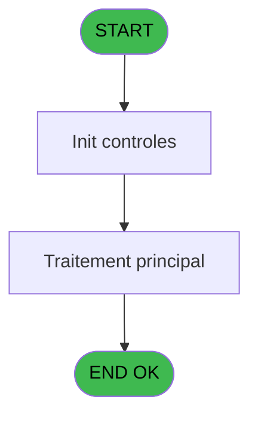

# ADH IDE 10 - Print list Checkout (shift F9)

> **Analyse**: Phases 1-4 2026-02-07 03:39 -> 01:09 (21h29min) | Assemblage 01:09
> **Pipeline**: V7.2 Enrichi
> **Structure**: 4 onglets (Resume | Ecrans | Donnees | Connexions)

<!-- TAB:Resume -->

## 1. FICHE D'IDENTITE

| Attribut | Valeur |
|----------|--------|
| Projet | ADH |
| IDE Position | 10 |
| Nom Programme | Print list Checkout (shift F9) |
| Fichier source | `Prg_10.xml` |
| Dossier IDE | Impression |
| Taches | 3 (1 ecrans visibles) |
| Tables modifiees | 0 |
| Programmes appeles | 1 |
| Complexite | **BASSE** (score 5/100) |

## 2. DESCRIPTION FONCTIONNELLE

# ADH IDE 10 - Print list Checkout

Programme d'édition des listes de paie/caisse en fin de service. Lancé par la touche Shift+F9 depuis le menu de saisie (ADH IDE 7), il gère l'impression du récapitulatif des opérations de caisse avec détails des paiements et soldes. L'interface affiche un message d'attente avant de transmettre les données à l'imprimante configurée.

La logique principale exécute trois tâches séquentielles : affichage du message "Veuillez patienter..." pour informer l'utilisateur, envoi des données d'édition à l'imprimante 1 (gestionnaire d'impression), puis appel au programme ADH IDE 11 (Export - address) pour exporter les détails du compte associé. Ce flux garantit que l'impression physique est lancée avant l'export de l'extrait de compte.

Dépendances critiques : le programme repose sur la configuration d'impression (Printer 1), l'accès aux tables de caisse (sessions, mouvements), et l'intégrité des données d'export vers ADH IDE 11. Les variations de statut imprimante ou d'absence de papier peuvent bloquer l'édition sans retour d'erreur visible à l'utilisateur.

## 3. BLOCS FONCTIONNELS

### 3.1 Traitement (1 tache)

Traitements internes.

---

#### 10 - Veuillez patienter... [[ECRAN]](#ecran-t1)

**Role** : Traitement : Veuillez patienter....
**Ecran** : 424 x 57 DLU (MDI) | [Voir mockup](#ecran-t1)
**Delegue a** : [Export - address (IDE 11)](ADH-IDE-11.md)

### 3.2 Impression (2 taches)

Generation des documents et tickets.

---

#### 10.1 - Printer 1

**Role** : Generation du document : Printer 1.

---

#### 10.1.1 - edition extrait compte

**Role** : Generation du document : edition extrait compte.
**Variables liees** : EN (W1 solde compte)

## 5. REGLES METIER

*(Programme d'impression - logique technique sans conditions metier)*

## 6. CONTEXTE

- **Appele par**: [Menu Data Catching (IDE 7)](ADH-IDE-7.md)
- **Appelle**: 1 programmes | **Tables**: 1 (W:0 R:1 L:0) | **Taches**: 3 | **Expressions**: 2

<!-- TAB:Ecrans -->

## 8. ECRANS

### 8.1 Forms visibles (1 / 3)

| # | Position | Tache | Nom | Type | Largeur | Hauteur | Bloc |
|---|----------|-------|-----|------|---------|---------|------|
| 1 | 10 | 10 | Veuillez patienter... | MDI | 424 | 57 | Traitement |

### 8.2 Mockups Ecrans

---

#### 10 - Veuillez patienter...
**Tache** : [10](#t1) | **Type** : MDI | **Dimensions** : 424 x 57 DLU
**Bloc** : Traitement | **Titre IDE** : Veuillez patienter...

<!-- FORM-DATA:
{
    "width":  424,
    "vFactor":  8,
    "type":  "MDI",
    "hFactor":  8,
    "controls":  [
                     {
                         "x":  0,
                         "type":  "label",
                         "var":  "",
                         "y":  0,
                         "w":  423,
                         "fmt":  "",
                         "name":  "",
                         "h":  29,
                         "color":  "",
                         "text":  "",
                         "parent":  null
                     },
                     {
                         "x":  120,
                         "type":  "label",
                         "var":  "",
                         "y":  10,
                         "w":  221,
                         "fmt":  "",
                         "name":  "",
                         "h":  8,
                         "color":  "7",
                         "text":  "Impression en cours ...",
                         "parent":  null
                     },
                     {
                         "x":  0,
                         "type":  "label",
                         "var":  "",
                         "y":  29,
                         "w":  423,
                         "fmt":  "",
                         "name":  "",
                         "h":  27,
                         "color":  "",
                         "text":  "",
                         "parent":  null
                     },
                     {
                         "x":  52,
                         "type":  "label",
                         "var":  "",
                         "y":  38,
                         "w":  318,
                         "fmt":  "",
                         "name":  "",
                         "h":  8,
                         "color":  "",
                         "text":  "Impression de l\u0027extrait de compte",
                         "parent":  null
                     },
                     {
                         "x":  4,
                         "type":  "image",
                         "var":  "",
                         "y":  2,
                         "w":  72,
                         "fmt":  "",
                         "name":  "",
                         "h":  25,
                         "color":  "",
                         "text":  "",
                         "parent":  null
                     }
                 ],
    "taskId":  "10",
    "height":  57
}
-->

## 9. NAVIGATION

Ecran unique: **Veuillez patienter...**

### 9.3 Structure hierarchique (3 taches)

| Position | Tache | Type | Dimensions | Bloc |
|----------|-------|------|------------|------|
| **10.1** | [**Veuillez patienter...** (10)](#t1) [mockup](#ecran-t1) | MDI | 424x57 | Traitement |
| **10.2** | [**Printer 1** (10.1)](#t2) | MDI | - | Impression |
| 10.2.1 | [edition extrait compte (10.1.1)](#t3) | MDI | - | |

### 9.4 Algorigramme

> **Legende**: Vert = START/END OK | Rouge = END KO | Bleu = Decisions
> *Algorigramme auto-genere. Utiliser `/algorigramme` pour une synthese metier detaillee.*

<!-- TAB:Donnees -->

## 10. TABLES

### Tables utilisees (1)

| ID | Nom | Description | Type | R | W | L | Usages |
|----|-----|-------------|------|---|---|---|--------|
| 47 | compte_gm________cgm | Comptes GM (generaux) | DB | R |   |   | 1 |

### Colonnes par table (1 / 1 tables avec colonnes identifiees)

Table 47 - compte_gm________cgm (R) - 1 usages

| Lettre | Variable | Acces | Type |
|--------|----------|-------|------|
| EN | W1 solde compte | R | Numeric |

## 11. VARIABLES

*(Programme sans variables locales mappees)*

## 12. EXPRESSIONS

**2 / 2 expressions decodees (100%)**

### 12.1 Repartition par type

| Type | Expressions | Regles |
|------|-------------|--------|
| OTHER | 2 | 0 |

### 12.2 Expressions cles par type

#### OTHER (2 expressions)

| Type | IDE | Expression | Regle |
|------|-----|------------|-------|
| OTHER | 2 | `SetCrsr (2)` | - |
| OTHER | 1 | `SetCrsr (1)` | - |

<!-- TAB:Connexions -->

## 13. GRAPHE D'APPELS

### 13.1 Chaine depuis Main (Callers)

Main -> ... -> [Menu Data Catching (IDE 7)](ADH-IDE-7.md) -> **Print list Checkout (shift F9) (IDE 10)**

### 13.2 Callers

| IDE | Nom Programme | Nb Appels |
|-----|---------------|-----------|
| [7](ADH-IDE-7.md) | Menu Data Catching | 1 |

### 13.3 Callees (programmes appeles)

### 13.4 Detail Callees avec contexte

| IDE | Nom Programme | Appels | Contexte |
|-----|---------------|--------|----------|
| [11](ADH-IDE-11.md) | Export - address | 1 | Sous-programme |

## 14. RECOMMANDATIONS MIGRATION

### 14.1 Profil du programme

| Metrique | Valeur | Impact migration |
|----------|--------|-----------------|
| Lignes de logique | 26 | Programme compact |
| Expressions | 2 | Peu de logique |
| Tables WRITE | 0 | Impact faible |
| Sous-programmes | 1 | Peu de dependances |
| Ecrans visibles | 1 | Ecran unique ou traitement batch |
| Code desactive | 0% (0 / 26) | Code sain |
| Regles metier | 0 | Pas de regle identifiee |

### 14.2 Plan de migration par bloc

#### Traitement (1 tache: 1 ecran, 0 traitement)

- **Strategie** : 1 composant(s) UI (Razor/React) avec formulaires et validation.
- 1 sous-programme(s) a migrer ou a reutiliser depuis les services existants.
- Decomposer les taches en services unitaires testables.

#### Impression (2 taches: 0 ecran, 2 traitements)

- **Strategie** : Templates HTML -> PDF via wkhtmltopdf ou Puppeteer.
- `PrintService` injectable avec choix imprimante

### 14.3 Dependances critiques

| Dependance | Type | Appels | Impact |
|------------|------|--------|--------|
| [Export - address (IDE 11)](ADH-IDE-11.md) | Sous-programme | 1x | Normale - Sous-programme |

---
*Spec DETAILED generee par Pipeline V7.2 - 2026-02-08 01:09*
