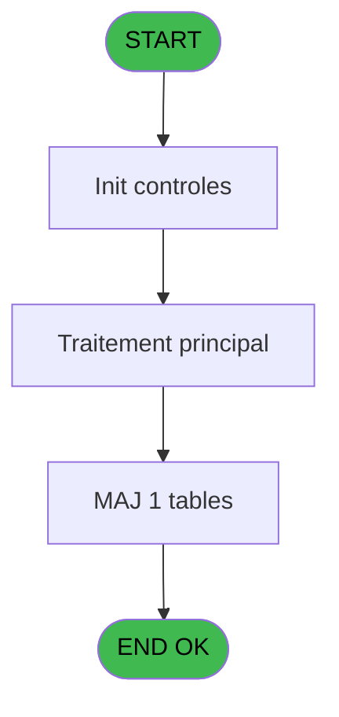

# ADH IDE 100 - flag ligne boutique V3

> **Analyse**: Phases 1-4 2026-02-07 03:47 -> 02:39 (22h51min) | Assemblage 02:39
> **Pipeline**: V7.2 Enrichi
> **Structure**: 4 onglets (Resume | Ecrans | Donnees | Connexions)

<!-- TAB:Resume -->

## 1. FICHE D'IDENTITE

| Attribut | Valeur |
|----------|--------|
| Projet | ADH |
| IDE Position | 100 |
| Nom Programme | flag ligne boutique V3 |
| Fichier source | `Prg_100.xml` |
| Dossier IDE | General |
| Taches | 2 (0 ecrans visibles) |
| Tables modifiees | 1 |
| Programmes appeles | 0 |
| Complexite | **BASSE** (score 7/100) |
| Statut | **ORPHELIN_POTENTIEL** |

## 2. DESCRIPTION FONCTIONNELLE

**ADH IDE 100 - Flag ligne boutique V3** est un programme batch simple dédié au marquage des lignes boutique après facturation. Il reçoit deux paramètres (Societe et Compte) et exécute une mise à jour unique sur la table `maj_appli_tpe` pour flaguer les lignes comme facturées en mode "R". Avec seulement 2 tâches linéaires et 16 lignes de logique, c'est un programme isolé sans appels externes ni dépendances complexes.

Ce programme s'intègre dans le workflow de facturation V3 (programmes 96-105), où il intervient après vérification des lignes boutique pour enregistrer leur traitement comptable. Son rôle est transactionnel et déterministe : appliquer un flag TRUE logique aux enregistrements concernés et enregistrer la date/heure de traitement. Aucune branche conditionnelle, aucun calcul métier — juste une opération UPDATE paramétrée.

Sur le plan technique, le programme est idéal pour la migration C# .NET 8 : complexité minimale (score 7/100), absence de code mort, logique purement déclarative. Il a déjà été migré en endpoint REST (`POST /api/factures/flag-ligne-boutique`) via la classe `FlagLigneBoutiqueCommand`, et fonctionne en production via la caisse TPE pour marquer les transactions boutique comme facturées après leur enregistrement en base.

## 3. BLOCS FONCTIONNELS

### 3.1 Traitement (2 taches)

Traitements internes.

---

#### 100 - flag ligne boutique V3

**Role** : Traitement : flag ligne boutique V3.

---

#### 100.1 - flag ligne

**Role** : Traitement : flag ligne.

## 5. REGLES METIER

*(Aucune regle metier identifiee dans les expressions)*

## 6. CONTEXTE

- **Appele par**: (aucun)
- **Appelle**: 0 programmes | **Tables**: 1 (W:1 R:0 L:0) | **Taches**: 2 | **Expressions**: 4

<!-- TAB:Ecrans -->

## 8. ECRANS

*(Programme sans ecran visible)*

## 9. NAVIGATION

### 9.3 Structure hierarchique (2 taches)

| Position | Tache | Type | Dimensions | Bloc |
|----------|-------|------|------------|------|
| **100.1** | [**flag ligne boutique V3** (100)](#t1) | - | - | Traitement |
| 100.1.1 | [flag ligne (100.1)](#t2) | - | - | |

### 9.4 Algorigramme

> **Legende**: Vert = START/END OK | Rouge = END KO | Bleu = Decisions
> *Algorigramme auto-genere. Utiliser `/algorigramme` pour une synthese metier detaillee.*

<!-- TAB:Donnees -->

## 10. TABLES

### Tables utilisees (1)

| ID | Nom | Description | Type | R | W | L | Usages |
|----|-----|-------------|------|---|---|---|--------|
| 866 | maj_appli_tpe |  | DB |   | **W** |   | 2 |

### Colonnes par table (1 / 1 tables avec colonnes identifiees)

Table 866 - maj_appli_tpe (**W**) - 2 usages

| Lettre | Variable | Acces | Type |
|--------|----------|-------|------|
| A | p.Societe | W | Unicode |
| B | p.Compte | W | Numeric |

## 11. VARIABLES

### 11.1 Parametres entrants (2)

Variables recues en parametre.

| Lettre | Nom | Type | Usage dans |
|--------|-----|------|-----------|
| EN | p.Societe | Unicode | 1x parametre entrant |
| EO | p.Compte | Numeric | 1x parametre entrant |

## 12. EXPRESSIONS

**4 / 4 expressions decodees (100%)**

### 12.1 Repartition par type

| Type | Expressions | Regles |
|------|-------------|--------|
| CONSTANTE | 1 | 0 |
| CAST_LOGIQUE | 1 | 0 |
| OTHER | 2 | 0 |

### 12.2 Expressions cles par type

#### CONSTANTE (1 expressions)

| Type | IDE | Expression | Regle |
|------|-----|------------|-------|
| CONSTANTE | 2 | `'R'` | - |

#### CAST_LOGIQUE (1 expressions)

| Type | IDE | Expression | Regle |
|------|-----|------------|-------|
| CAST_LOGIQUE | 1 | `'TRUE'LOG` | - |

#### OTHER (2 expressions)

| Type | IDE | Expression | Regle |
|------|-----|------------|-------|
| OTHER | 4 | `p.Compte [B]` | - |
| OTHER | 3 | `p.Societe [A]` | - |

<!-- TAB:Connexions -->

## 13. GRAPHE D'APPELS

### 13.1 Chaine depuis Main (Callers)

**Chemin**: (pas de callers directs)

### 13.2 Callers

| IDE | Nom Programme | Nb Appels |
|-----|---------------|-----------|
| - | (aucun) | - |

### 13.3 Callees (programmes appeles)

### 13.4 Detail Callees avec contexte

| IDE | Nom Programme | Appels | Contexte |
|-----|---------------|--------|----------|
| - | (aucun) | - | - |

## 14. RECOMMANDATIONS MIGRATION

### 14.1 Profil du programme

| Metrique | Valeur | Impact migration |
|----------|--------|-----------------|
| Lignes de logique | 16 | Programme compact |
| Expressions | 4 | Peu de logique |
| Tables WRITE | 1 | Impact faible |
| Sous-programmes | 0 | Peu de dependances |
| Ecrans visibles | 0 | Ecran unique ou traitement batch |
| Code desactive | 0% (0 / 16) | Code sain |
| Regles metier | 0 | Pas de regle identifiee |

### 14.2 Plan de migration par bloc

#### Traitement (2 taches: 0 ecran, 2 traitements)

- **Strategie** : 2 service(s) backend injectable(s) (Domain Services).
- Decomposer les taches en services unitaires testables.

### 14.3 Dependances critiques

| Dependance | Type | Appels | Impact |
|------------|------|--------|--------|
| maj_appli_tpe | Table WRITE (Database) | 2x | Schema + repository |

---
*Spec DETAILED generee par Pipeline V7.2 - 2026-02-08 02:41*
