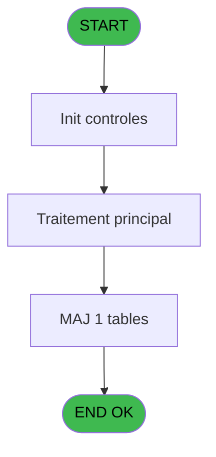

# ADH IDE 102 - Maj lignes saisies archive V3

> **Analyse**: Phases 1-4 2026-02-07 06:59 -> 06:59 (17s) | Assemblage 06:59
> **Pipeline**: V7.2 Enrichi
> **Structure**: 4 onglets (Resume | Ecrans | Donnees | Connexions)

<!-- TAB:Resume -->

## 1. FICHE D'IDENTITE

| Attribut | Valeur |
|----------|--------|
| Projet | ADH |
| IDE Position | 102 |
| Nom Programme | Maj lignes saisies archive V3 |
| Fichier source | `Prg_102.xml` |
| Dossier IDE | Factures |
| Taches | 1 (0 ecrans visibles) |
| Tables modifiees | 1 |
| Programmes appeles | 0 |
| :warning: Statut | **ORPHELIN_POTENTIEL** |

## 2. DESCRIPTION FONCTIONNELLE

**Maj lignes saisies archive V3** assure la gestion complete de ce processus.

**Donnees modifiees** : 1 tables en ecriture (projet).

**Logique metier** : 1 regles identifiees couvrant conditions metier.

## 3. BLOCS FONCTIONNELS

## 5. REGLES METIER

1 regles identifiees:

### Autres (1 regles)

#### [RM-001] Condition toujours vraie (flag actif)

| Element | Detail |
|---------|--------|
| **Condition** | `P.Flague [C]` |
| **Si vrai** | 'TRUE'LOG |
| **Si faux** | 'FALSE'LOG) |
| **Variables** | C (P.Flague) |
| **Expression source** | Expression 9 : `IF(P.Flague [C],'TRUE'LOG,'FALSE'LOG)` |
| **Exemple** | Si P.Flague [C] → 'TRUE'LOG. Sinon → 'FALSE'LOG) |

## 6. CONTEXTE

- **Appele par**: (aucun)
- **Appelle**: 0 programmes | **Tables**: 4 (W:1 R:0 L:3) | **Taches**: 1 | **Expressions**: 14

<!-- TAB:Ecrans -->

## 8. ECRANS

*(Programme sans ecran visible)*

## 9. NAVIGATION

### 9.3 Structure hierarchique (0 tache)

| Position | Tache | Type | Dimensions | Bloc |
|----------|-------|------|------------|------|

### 9.4 Algorigramme

> **Legende**: Vert = START/END OK | Rouge = END KO | Bleu = Decisions
> *Algorigramme auto-genere. Utiliser `/algorigramme` pour une synthese metier detaillee.*

<!-- TAB:Donnees -->

## 10. TABLES

### Tables utilisees (4)

| ID | Nom | Description | Type | R | W | L | Usages |
|----|-----|-------------|------|---|---|---|--------|
| 746 | projet |  | DB |   | **W** |   | 1 |
| 866 | maj_appli_tpe |  | DB |   |   | L | 1 |
| 870 | Rayons_Boutique |  | DB |   |   | L | 1 |
| 871 | Activite |  | DB |   |   | L | 1 |

### Colonnes par table (1 / 1 tables avec colonnes identifiees)

Table 746 - projet (**W**) - 1 usages

| Lettre | Variable | Acces | Type |
|--------|----------|-------|------|
| A | p.Societe | W | Unicode |
| B | p.Compte | W | Numeric |
| C | P.Flague | W | Logical |
| D | p.No_Facture | W | Numeric |
| E | p.NomFichPDF | W | Alpha |
| F | V retour Compta | W | Logical |
| G | v Retour Vente | W | Logical |
| H | v Trouvé Compta | W | Logical |
| I | v Trouvé Vente | W | Logical |

## 11. VARIABLES

### 11.1 Parametres entrants (5)

Variables recues en parametre.

| Lettre | Nom | Type | Usage dans |
|--------|-----|------|-----------|
| A | p.Societe | Unicode | 1x parametre entrant |
| B | p.Compte | Numeric | 1x parametre entrant |
| C | P.Flague | Logical | 1x parametre entrant |
| D | p.No_Facture | Numeric | 1x parametre entrant |
| E | p.NomFichPDF | Alpha | 1x parametre entrant |

### 11.2 Variables de session (4)

Variables persistantes pendant toute la session.

| Lettre | Nom | Type | Usage dans |
|--------|-----|------|-----------|
| F | V retour Compta | Logical | - |
| G | v Retour Vente | Logical | - |
| H | v Trouvé Compta | Logical | - |
| I | v Trouvé Vente | Logical | - |

## 12. EXPRESSIONS

**14 / 14 expressions decodees (100%)**

### 12.1 Repartition par type

| Type | Expressions | Regles |
|------|-------------|--------|
| CAST_LOGIQUE | 1 | 5 |
| DATE | 2 | 0 |
| CONDITION | 2 | 0 |
| OTHER | 9 | 0 |

### 12.2 Expressions cles par type

#### CAST_LOGIQUE (1 expressions)

| Type | IDE | Expression | Regle |
|------|-----|------------|-------|
| CAST_LOGIQUE | 9 | `IF(P.Flague [C],'TRUE'LOG,'FALSE'LOG)` | [RM-001](#rm-RM-001) |

#### DATE (2 expressions)

| Type | IDE | Expression | Regle |
|------|-----|------------|-------|
| DATE | 8 | `Date()` | - |
| DATE | 4 | `Date()` | - |

#### CONDITION (2 expressions)

| Type | IDE | Expression | Regle |
|------|-----|------------|-------|
| CONDITION | 2 | `[AH]=0` | - |
| CONDITION | 1 | `[Y]=0` | - |

#### OTHER (9 expressions)

| Type | IDE | Expression | Regle |
|------|-----|------------|-------|
| OTHER | 12 | `[AC]` | - |
| OTHER | 11 | `[W]` | - |
| OTHER | 14 | `[S]` | - |
| OTHER | 13 | `[K]` | - |
| OTHER | 10 | `[K]` | - |
| ... | | *+4 autres* | |

<!-- TAB:Connexions -->

## 13. GRAPHE D'APPELS

### 13.1 Chaine depuis Main (Callers)

**Chemin**: (pas de callers directs)

### 13.2 Callers

| IDE | Nom Programme | Nb Appels |
|-----|---------------|-----------|
| - | (aucun) | - |

### 13.3 Callees (programmes appeles)

### 13.4 Detail Callees avec contexte

| IDE | Nom Programme | Appels | Contexte |
|-----|---------------|--------|----------|
| - | (aucun) | - | - |

## 14. RECOMMANDATIONS MIGRATION

### 14.1 Profil du programme

| Metrique | Valeur | Impact migration |
|----------|--------|-----------------|
| Lignes de logique | 63 | Programme compact |
| Expressions | 14 | Peu de logique |
| Tables WRITE | 1 | Impact faible |
| Sous-programmes | 0 | Peu de dependances |
| Ecrans visibles | 0 | Ecran unique ou traitement batch |
| Code desactive | 0% (0 / 63) | Code sain |
| Regles metier | 1 | Quelques regles a preserver |

### 14.2 Plan de migration par bloc

### 14.3 Dependances critiques

| Dependance | Type | Appels | Impact |
|------------|------|--------|--------|
| projet | Table WRITE (Database) | 1x | Schema + repository |

---
*Spec DETAILED generee par Pipeline V7.2 - 2026-02-07 06:59*
