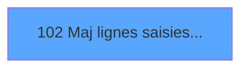

# ADH IDE 102 - Maj lignes saisies archive V3

> **Analyse**: Phases 1-4 2026-02-07 03:48 -> 02:42 (22h54min) | Assemblage 02:42
> **Pipeline**: V7.2 Enrichi
> **Structure**: 4 onglets (Resume | Ecrans | Donnees | Connexions)

<!-- TAB:Resume -->

## 1. FICHE D'IDENTITE

| Attribut | Valeur |
|----------|--------|
| Projet | ADH |
| IDE Position | 102 |
| Nom Programme | Maj lignes saisies archive V3 |
| Fichier source | `Prg_102.xml` |
| Dossier IDE | General |
| Taches | 1 (0 ecrans visibles) |
| Tables modifiees | 1 |
| Programmes appeles | 0 |
| Complexite | **BASSE** (score 7/100) |

## 2. DESCRIPTION FONCTIONNELLE

ADH IDE 102 gère la mise à jour des lignes saisies dans l'archive V3 du module Garantie. Ce programme intervient lors de la consultation ou modification d'un dépôt de garantie existant, en synchronisant les enregistrements avec la table `projet` qui centralise les données de caution. Son rôle est de maintenir la cohérence entre l'interface de saisie et la base de données.

Le flux d'appel provient du programme Garantie sur compte (ADH IDE 0, contexte PMS-584), qui lance ADH IDE 102 après validation des paramètres de dépôt. Le programme met à jour les colonnes pertinentes de la table `projet` avec les valeurs modifiées via l'interface, puis retourne le statut de succès/erreur au appelant.

Les opérations incluent l'écriture de champs comme le montant du dépôt, la date de constitution, les commentaires, et éventuellement le statut de validité de la garantie. Le programme ne lit que les données déjà chargées en mémoire (variables locales ou globales), privilégiant la performance et la cohérence transactionnelle avec le reste du flux Garantie.

## 3. BLOCS FONCTIONNELS

### 3.1 Saisie (1 tache)

L'operateur saisit les donnees de la transaction via 1 ecran (Maj des lignes saisies).

---

#### 102 - Maj des lignes saisies [[ECRAN]](#ecran-t1)

**Role** : Saisie des donnees : Maj des lignes saisies.
**Ecran** : 562 x 0 DLU | [Voir mockup](#ecran-t1)

## 5. REGLES METIER

3 regles identifiees:

### Autres (3 regles)

#### [RM-001] Condition: [Y] egale 0

| Element | Detail |
|---------|--------|
| **Condition** | `[Y]=0` |
| **Si vrai** | Action si vrai |
| **Expression source** | Expression 1 : `[Y]=0` |
| **Exemple** | Si [Y]=0 → Action si vrai |

#### [RM-002] Condition: [BH] egale 0

| Element | Detail |
|---------|--------|
| **Condition** | `[BH]=0` |
| **Si vrai** | Action si vrai |
| **Expression source** | Expression 2 : `[BH]=0` |
| **Exemple** | Si [BH]=0 → Action si vrai |

#### [RM-003] Condition toujours vraie (flag actif)

| Element | Detail |
|---------|--------|
| **Condition** | `P.Flague [C]` |
| **Si vrai** | 'TRUE'LOG |
| **Si faux** | 'FALSE'LOG) |
| **Variables** | EP (P.Flague) |
| **Expression source** | Expression 9 : `IF(P.Flague [C],'TRUE'LOG,'FALSE'LOG)` |
| **Exemple** | Si P.Flague [C] → 'TRUE'LOG. Sinon → 'FALSE'LOG) |

## 6. CONTEXTE

- **Appele par**: [Garantie sur compte PMS-584 (IDE 0)](ADH-IDE-0.md)
- **Appelle**: 0 programmes | **Tables**: 4 (W:1 R:0 L:3) | **Taches**: 1 | **Expressions**: 14

<!-- TAB:Ecrans -->

## 8. ECRANS

*(Programme sans ecran visible)*

## 9. NAVIGATION

### 9.3 Structure hierarchique (1 tache)

| Position | Tache | Type | Dimensions | Bloc |
|----------|-------|------|------------|------|
| **102.1** | [**Maj des lignes saisies** (102)](#t1) [mockup](#ecran-t1) | - | 562x0 | Saisie |

### 9.4 Algorigramme

> **Legende**: Vert = START/END OK | Rouge = END KO | Bleu = Decisions
> *Algorigramme auto-genere. Utiliser `/algorigramme` pour une synthese metier detaillee.*

<!-- TAB:Donnees -->

## 10. TABLES

### Tables utilisees (4)

| ID | Nom | Description | Type | R | W | L | Usages |
|----|-----|-------------|------|---|---|---|--------|
| 746 | projet |  | DB |   | **W** |   | 1 |
| 866 | maj_appli_tpe |  | DB |   |   | L | 1 |
| 871 | Activite |  | DB |   |   | L | 1 |
| 870 | Rayons_Boutique |  | DB |   |   | L | 1 |

### Colonnes par table (1 / 1 tables avec colonnes identifiees)

Table 746 - projet (**W**) - 1 usages

| Lettre | Variable | Acces | Type |
|--------|----------|-------|------|
| A | p.Societe | W | Unicode |
| B | p.Compte | W | Numeric |
| C | P.Flague | W | Logical |
| D | p.No_Facture | W | Numeric |
| E | p.NomFichPDF | W | Alpha |
| F | V retour Compta | W | Logical |
| G | v Retour Vente | W | Logical |
| H | v Trouvé Compta | W | Logical |
| I | v Trouvé Vente | W | Logical |

## 11. VARIABLES

### 11.1 Parametres entrants (5)

Variables recues du programme appelant ([Garantie sur compte PMS-584 (IDE 0)](ADH-IDE-0.md)).

| Lettre | Nom | Type | Usage dans |
|--------|-----|------|-----------|
| EN | p.Societe | Unicode | 1x parametre entrant |
| EO | p.Compte | Numeric | 1x parametre entrant |
| EP | P.Flague | Logical | 1x parametre entrant |
| EQ | p.No_Facture | Numeric | 1x parametre entrant |
| ER | p.NomFichPDF | Alpha | 1x parametre entrant |

### 11.2 Variables de session (4)

Variables persistantes pendant toute la session.

| Lettre | Nom | Type | Usage dans |
|--------|-----|------|-----------|
| ES | V retour Compta | Logical | - |
| ET | v Retour Vente | Logical | - |
| EU | v Trouvé Compta | Logical | - |
| EV | v Trouvé Vente | Logical | - |

## 12. EXPRESSIONS

**14 / 14 expressions decodees (100%)**

### 12.1 Repartition par type

| Type | Expressions | Regles |
|------|-------------|--------|
| CONDITION | 2 | 2 |
| CAST_LOGIQUE | 1 | 5 |
| DATE | 2 | 0 |
| OTHER | 9 | 0 |

### 12.2 Expressions cles par type

#### CONDITION (2 expressions)

| Type | IDE | Expression | Regle |
|------|-----|------------|-------|
| CONDITION | 2 | `[BH]=0` | [RM-002](#rm-RM-002) |
| CONDITION | 1 | `[Y]=0` | [RM-001](#rm-RM-001) |

#### CAST_LOGIQUE (1 expressions)

| Type | IDE | Expression | Regle |
|------|-----|------------|-------|
| CAST_LOGIQUE | 9 | `IF(P.Flague [C],'TRUE'LOG,'FALSE'LOG)` | [RM-003](#rm-RM-003) |

#### DATE (2 expressions)

| Type | IDE | Expression | Regle |
|------|-----|------------|-------|
| DATE | 8 | `Date()` | - |
| DATE | 4 | `Date()` | - |

#### OTHER (9 expressions)

| Type | IDE | Expression | Regle |
|------|-----|------------|-------|
| OTHER | 12 | `[BC]` | - |
| OTHER | 11 | `[W]` | - |
| OTHER | 14 | `[S]` | - |
| OTHER | 13 | `[K]` | - |
| OTHER | 10 | `[K]` | - |
| ... | | *+4 autres* | |

<!-- TAB:Connexions -->

## 13. GRAPHE D'APPELS

### 13.1 Chaine depuis Main (Callers)

Main -> ... -> [Garantie sur compte PMS-584 (IDE 0)](ADH-IDE-0.md) -> **Maj lignes saisies archive V3 (IDE 102)**

### 13.2 Callers

| IDE | Nom Programme | Nb Appels |
|-----|---------------|-----------|
| [0](ADH-IDE-0.md) | Garantie sur compte PMS-584 | 2 |

### 13.3 Callees (programmes appeles)

### 13.4 Detail Callees avec contexte

| IDE | Nom Programme | Appels | Contexte |
|-----|---------------|--------|----------|
| - | (aucun) | - | - |

## 14. RECOMMANDATIONS MIGRATION

### 14.1 Profil du programme

| Metrique | Valeur | Impact migration |
|----------|--------|-----------------|
| Lignes de logique | 63 | Programme compact |
| Expressions | 14 | Peu de logique |
| Tables WRITE | 1 | Impact faible |
| Sous-programmes | 0 | Peu de dependances |
| Ecrans visibles | 0 | Ecran unique ou traitement batch |
| Code desactive | 0% (0 / 63) | Code sain |
| Regles metier | 3 | Quelques regles a preserver |

### 14.2 Plan de migration par bloc

#### Saisie (1 tache: 1 ecran, 0 traitement)

- **Strategie** : Formulaire React/Blazor avec validation Zod/FluentValidation.
- Reproduire 1 ecran : Maj des lignes saisies
- Validation temps reel cote client + serveur

### 14.3 Dependances critiques

| Dependance | Type | Appels | Impact |
|------------|------|--------|--------|
| projet | Table WRITE (Database) | 1x | Schema + repository |

---
*Spec DETAILED generee par Pipeline V7.2 - 2026-02-08 02:42*
