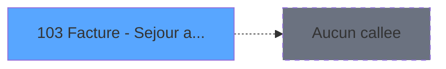

# ADH IDE 103 - Facture - Sejour archive V3

> **Analyse**: Phases 1-4 2026-02-07 03:48 -> 02:42 (22h54min) | Assemblage 02:42
> **Pipeline**: V7.2 Enrichi
> **Structure**: 4 onglets (Resume | Ecrans | Donnees | Connexions)

<!-- TAB:Resume -->

## 1. FICHE D'IDENTITE

| Attribut | Valeur |
|----------|--------|
| Projet | ADH |
| IDE Position | 103 |
| Nom Programme | Facture - Sejour archive V3 |
| Fichier source | `Prg_103.xml` |
| Dossier IDE | Facturation |
| Taches | 6 (0 ecrans visibles) |
| Tables modifiees | 2 |
| Programmes appeles | 0 |
| Complexite | **BASSE** (score 14/100) |

## 2. DESCRIPTION FONCTIONNELLE

ADH IDE 103 archive les factures de séjour client en créant les écritures comptables et commerciales qui garantissent la traçabilité financière. Le programme est appelé par le module Garantie sur compte (IDE 0) et traite trois opérations successives : création d'un enregistrement dans la table Affectation_Gift_Pass avec les paramètres de société/compte/filiation, génération de la ligne comptable correspondante dans Rayons_Boutique, puis enregistrement de la transaction commerciale pour l'historique des ventes.

Le flux métier se compose de six tâches organisées en trois blocs. Le bloc traitement orchestre la création et synchronisation de l'hébergement à travers trois mises à jour successives (création initiale, puis deux mises à jour temporaires d'état). Le bloc calcul génère la ligne comptable avec les montants financiers associés. Le bloc saisie enregistre la dimension commerciale avec un écran de saisie (630x0 DLU) pour finaliser la transaction.

Programme isolé et de basse complexité (270 lignes, 0% code désactivé), ADH IDE 103 n'appelle aucun programme externe et repose sur une logique linéaire sans boucles ni branchements complexes. Son rôle critique dans le cycle de facturation des séjours archivés et son absence de dépendances descendantes en font un composant fiable pour maintenir l'intégrité comptable et commerciale.

## 3. BLOCS FONCTIONNELS

### 3.1 Traitement (4 taches)

Traitements internes.

---

#### 103 - Hebergement [[ECRAN]](#ecran-t1)

**Role** : Traitement : Hebergement.
**Ecran** : 630 x 0 DLU | [Voir mockup](#ecran-t1)

3 sous-taches directes

| Tache | Nom | Bloc |
|-------|-----|------|
| [103.1](#t2) | Création | Traitement |
| [103.2.1](#t4) | Maj Hebergement Temp | Traitement |
| [103.3.1](#t6) | Maj Hebergement Temp | Traitement |

**Variables liees** : EQ (V.Lien Hebergement_Pro)

---

#### 103.1 - Création

**Role** : Traitement : Création.

---

#### 103.2.1 - Maj Hebergement Temp

**Role** : Traitement : Maj Hebergement Temp.
**Variables liees** : EQ (V.Lien Hebergement_Pro)

---

#### 103.3.1 - Maj Hebergement Temp

**Role** : Traitement : Maj Hebergement Temp.
**Variables liees** : EQ (V.Lien Hebergement_Pro)

### 3.2 Calcul (1 tache)

Calculs metier : montants, stocks, compteurs.

---

#### 103.2 - Creation Lg Compta

**Role** : Creation d'enregistrement : Creation Lg Compta.

### 3.3 Saisie (1 tache)

L'operateur saisit les donnees de la transaction via 1 ecran (Creation Lg Vente).

---

#### 103.3 - Creation Lg Vente [[ECRAN]](#ecran-t5)

**Role** : Saisie des donnees : Creation Lg Vente.
**Ecran** : 630 x 0 DLU | [Voir mockup](#ecran-t5)

## 5. REGLES METIER

*(Aucune regle metier identifiee dans les expressions)*

## 6. CONTEXTE

- **Appele par**: [Garantie sur compte PMS-584 (IDE 0)](ADH-IDE-0.md)
- **Appelle**: 0 programmes | **Tables**: 7 (W:2 R:1 L:5) | **Taches**: 6 | **Expressions**: 6

<!-- TAB:Ecrans -->

## 8. ECRANS

*(Programme sans ecran visible)*

## 9. NAVIGATION

### 9.3 Structure hierarchique (6 taches)

| Position | Tache | Type | Dimensions | Bloc |
|----------|-------|------|------------|------|
| **103.1** | [**Hebergement** (103)](#t1) [mockup](#ecran-t1) | - | 630x0 | Traitement |
| 103.1.1 | [Création (103.1)](#t2) | - | - | |
| 103.1.2 | [Maj Hebergement Temp (103.2.1)](#t4) | - | - | |
| 103.1.3 | [Maj Hebergement Temp (103.3.1)](#t6) | - | - | |
| **103.2** | [**Creation Lg Compta** (103.2)](#t3) | - | - | Calcul |
| **103.3** | [**Creation Lg Vente** (103.3)](#t5) [mockup](#ecran-t5) | - | 630x0 | Saisie |

### 9.4 Algorigramme

> **Legende**: Vert = START/END OK | Rouge = END KO | Bleu = Decisions
> *Algorigramme auto-genere. Utiliser `/algorigramme` pour une synthese metier detaillee.*

<!-- TAB:Donnees -->

## 10. TABLES

### Tables utilisees (7)

| ID | Nom | Description | Type | R | W | L | Usages |
|----|-----|-------------|------|---|---|---|--------|
| 868 | Affectation_Gift_Pass |  | DB | R | **W** |   | 4 |
| 870 | Rayons_Boutique |  | DB |   | **W** |   | 2 |
| 755 | cafil_address_tmp | Services / filieres | DB |   |   | L | 2 |
| 756 | Country_ISO |  | DB |   |   | L | 2 |
| 871 | Activite |  | DB |   |   | L | 1 |
| 744 | pv_lieux_vente | Donnees de ventes | DB |   |   | L | 1 |
| 746 | projet |  | DB |   |   | L | 1 |

### Colonnes par table (1 / 2 tables avec colonnes identifiees)

Table 868 - Affectation_Gift_Pass (R/**W**) - 4 usages

| Lettre | Variable | Acces | Type |
|--------|----------|-------|------|
| A | P.Société | W | Alpha |
| B | P.Num compte | W | Numeric |
| C | P.Fliliation | W | Numeric |
| D | V.Lien Hebergement_Pro | W | Logical |

Table 870 - Rayons_Boutique (**W**) - 2 usages

*Table utilisee uniquement en Link ou aucune colonne Real identifiee dans le DataView.*

## 11. VARIABLES

### 11.1 Parametres entrants (3)

Variables recues du programme appelant ([Garantie sur compte PMS-584 (IDE 0)](ADH-IDE-0.md)).

| Lettre | Nom | Type | Usage dans |
|--------|-----|------|-----------|
| EN | P.Société | Alpha | 1x parametre entrant |
| EO | P.Num compte | Numeric | 1x parametre entrant |
| EP | P.Fliliation | Numeric | 1x parametre entrant |

### 11.2 Variables de session (1)

Variables persistantes pendant toute la session.

| Lettre | Nom | Type | Usage dans |
|--------|-----|------|-----------|
| EQ | V.Lien Hebergement_Pro | Logical | - |

## 12. EXPRESSIONS

**6 / 6 expressions decodees (100%)**

### 12.1 Repartition par type

| Type | Expressions | Regles |
|------|-------------|--------|
| OTHER | 6 | 0 |

### 12.2 Expressions cles par type

#### OTHER (6 expressions)

| Type | IDE | Expression | Regle |
|------|-----|------------|-------|
| OTHER | 4 | `[G]` | - |
| OTHER | 5 | `[H]` | - |
| OTHER | 6 | `NOT([I])` | - |
| OTHER | 1 | `P.Société [A]` | - |
| OTHER | 2 | `P.Num compte [B]` | - |
| ... | | *+1 autres* | |

<!-- TAB:Connexions -->

## 13. GRAPHE D'APPELS

### 13.1 Chaine depuis Main (Callers)

Main -> ... -> [Garantie sur compte PMS-584 (IDE 0)](ADH-IDE-0.md) -> **Facture - Sejour archive V3 (IDE 103)**

### 13.2 Callers

| IDE | Nom Programme | Nb Appels |
|-----|---------------|-----------|
| [0](ADH-IDE-0.md) | Garantie sur compte PMS-584 | 2 |

### 13.3 Callees (programmes appeles)

### 13.4 Detail Callees avec contexte

| IDE | Nom Programme | Appels | Contexte |
|-----|---------------|--------|----------|
| - | (aucun) | - | - |

## 14. RECOMMANDATIONS MIGRATION

### 14.1 Profil du programme

| Metrique | Valeur | Impact migration |
|----------|--------|-----------------|
| Lignes de logique | 270 | Taille moyenne |
| Expressions | 6 | Peu de logique |
| Tables WRITE | 2 | Impact faible |
| Sous-programmes | 0 | Peu de dependances |
| Ecrans visibles | 0 | Ecran unique ou traitement batch |
| Code desactive | 0% (0 / 270) | Code sain |
| Regles metier | 0 | Pas de regle identifiee |

### 14.2 Plan de migration par bloc

#### Traitement (4 taches: 1 ecran, 3 traitements)

- **Strategie** : Orchestrateur avec 1 ecrans (Razor/React) et 3 traitements backend (services).
- Les ecrans deviennent des composants UI, les traitements invisibles deviennent des services injectables.
- Decomposer les taches en services unitaires testables.

#### Calcul (1 tache: 0 ecran, 1 traitement)

- **Strategie** : Services de calcul purs (Domain Services).
- Migrer la logique de calcul (stock, compteurs, montants)

#### Saisie (1 tache: 1 ecran, 0 traitement)

- **Strategie** : Formulaire React/Blazor avec validation Zod/FluentValidation.
- Reproduire 1 ecran : Creation Lg Vente
- Validation temps reel cote client + serveur

### 14.3 Dependances critiques

| Dependance | Type | Appels | Impact |
|------------|------|--------|--------|
| Affectation_Gift_Pass | Table WRITE (Database) | 3x | Schema + repository |
| Rayons_Boutique | Table WRITE (Database) | 2x | Schema + repository |

---
*Spec DETAILED generee par Pipeline V7.2 - 2026-02-08 02:46*
