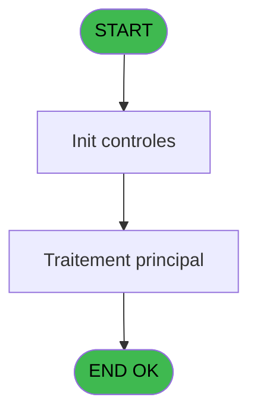
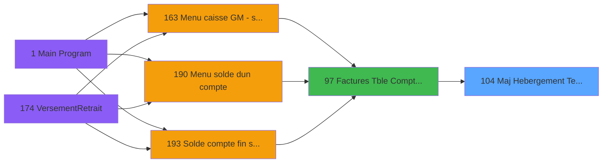

# ADH IDE 104 - Maj Hebergement Tempo V3

> **Analyse**: Phases 1-4 2026-02-07 03:48 -> 02:46 (22h57min) | Assemblage 02:46
> **Pipeline**: V7.2 Enrichi
> **Structure**: 4 onglets (Resume | Ecrans | Donnees | Connexions)

<!-- TAB:Resume -->

## 1. FICHE D'IDENTITE

| Attribut | Valeur |
|----------|--------|
| Projet | ADH |
| IDE Position | 104 |
| Nom Programme | Maj Hebergement Tempo V3 |
| Fichier source | `Prg_104.xml` |
| Dossier IDE | General |
| Taches | 1 (0 ecrans visibles) |
| Tables modifiees | 0 |
| Programmes appeles | 0 |
| Complexite | **BASSE** (score 0/100) |

## 2. DESCRIPTION FONCTIONNELLE

ADH IDE 104 est un utilitaire léger de synchronisation des hébergements temporaires intégré au flux de facturation. Appelé exclusivement par ADH IDE 97 (Factures Compta&Vent) lors de la génération d'une facture client, ce programme opère en mode lecture seule sans modification directe des données. Son rôle est de maintenir la traçabilité entre les factures émises et les situations de logement provisoire des clients, en effectuant des vérifications de cohérence entre les références d'hébergement court terme et les configurations de cartes cadeau.

Le programme contient une unique tâche de 27 lignes sans branchement conditionnel. Le flux reçoit 7 paramètres d'entrée depuis IDE 97 : identifiant client (Société A, Compte B, Filiation C), numéro de facture D, dates d'hébergement (E DateDebut, F DateFin) et drapeau de traitement G. La logique d'exécution est simple : initialisation du contrôle, extraction des données de configuration TPE depuis Table 866 (maj_appli_tpe), vérification du lien avec Table 868 (Affectation_Gift_Pass) pour valider les cartes cadeau associées, puis retour de la variable session H au programme appelant.

Le programme accède à seulement 2 tables en lecture : Table 866 (maj_appli_tpe) pour récupérer les configurations d'application TPE, et Table 868 (Affectation_Gift_Pass) en jointure pour vérifier les allocations de cartes cadeau. Aucune table n'est modifiée. Les expressions du programme sont majoritairement des références de variables simples plus une seule expression DATE(). Ce programme terminal n'appelle aucun autre programme, minimalisant ainsi le couplage et l'impact en cascade des modifications. Complexité très basse, code sain sans lignes désactivées.

## 3. BLOCS FONCTIONNELS

### 3.1 Traitement (1 tache)

Traitements internes.

---

#### 104 - Maj Hebergement Tempo V3 [[ECRAN]](#ecran-t1)

**Role** : Traitement : Maj Hebergement Tempo V3.
**Ecran** : 672 x 0 DLU | [Voir mockup](#ecran-t1)
**Variables liees** : EU (V.Lien Hebergement_Pro)

## 5. REGLES METIER

*(Aucune regle metier identifiee dans les expressions)*

## 6. CONTEXTE

- **Appele par**: [Factures (Tble Compta&Vent) V3 (IDE 97)](ADH-IDE-97.md)
- **Appelle**: 0 programmes | **Tables**: 2 (W:0 R:1 L:1) | **Taches**: 1 | **Expressions**: 9

<!-- TAB:Ecrans -->

## 8. ECRANS

*(Programme sans ecran visible)*

## 9. NAVIGATION

### 9.3 Structure hierarchique (1 tache)

| Position | Tache | Type | Dimensions | Bloc |
|----------|-------|------|------------|------|
| **104.1** | [**Maj Hebergement Tempo V3** (104)](#t1) [mockup](#ecran-t1) | - | 672x0 | Traitement |

### 9.4 Algorigramme

> **Legende**: Vert = START/END OK | Rouge = END KO | Bleu = Decisions
> *Algorigramme auto-genere. Utiliser `/algorigramme` pour une synthese metier detaillee.*

<!-- TAB:Donnees -->

## 10. TABLES

### Tables utilisees (2)

| ID | Nom | Description | Type | R | W | L | Usages |
|----|-----|-------------|------|---|---|---|--------|
| 866 | maj_appli_tpe |  | DB | R |   |   | 1 |
| 868 | Affectation_Gift_Pass |  | DB |   |   | L | 1 |

### Colonnes par table (1 / 1 tables avec colonnes identifiees)

Table 866 - maj_appli_tpe (R) - 1 usages

| Lettre | Variable | Acces | Type |
|--------|----------|-------|------|
| A | p.Societe | R | Unicode |
| B | p.Compte | R | Numeric |
| C | p.Filiation | R | Numeric |
| D | p.NumFac | R | Numeric |
| E | p.DateDebut | R | Date |
| F | p.DateFin | R | Date |
| G | p.Flague | R | Logical |
| H | V.Lien Hebergement_Pro | R | Logical |

## 11. VARIABLES

### 11.1 Parametres entrants (7)

Variables recues du programme appelant ([Factures (Tble Compta&Vent) V3 (IDE 97)](ADH-IDE-97.md)).

| Lettre | Nom | Type | Usage dans |
|--------|-----|------|-----------|
| EN | p.Societe | Unicode | 1x parametre entrant |
| EO | p.Compte | Numeric | 1x parametre entrant |
| EP | p.Filiation | Numeric | 1x parametre entrant |
| EQ | p.NumFac | Numeric | 1x parametre entrant |
| ER | p.DateDebut | Date | 1x parametre entrant |
| ES | p.DateFin | Date | 1x parametre entrant |
| ET | p.Flague | Logical | 1x parametre entrant |

### 11.2 Variables de session (1)

Variables persistantes pendant toute la session.

| Lettre | Nom | Type | Usage dans |
|--------|-----|------|-----------|
| EU | V.Lien Hebergement_Pro | Logical | 1x session |

## 12. EXPRESSIONS

**9 / 9 expressions decodees (100%)**

### 12.1 Repartition par type

| Type | Expressions | Regles |
|------|-------------|--------|
| DATE | 1 | 0 |
| OTHER | 8 | 0 |

### 12.2 Expressions cles par type

#### DATE (1 expressions)

| Type | IDE | Expression | Regle |
|------|-----|------------|-------|
| DATE | 1 | `Date()` | - |

#### OTHER (8 expressions)

| Type | IDE | Expression | Regle |
|------|-----|------------|-------|
| OTHER | 7 | `p.DateFin [F]` | - |
| OTHER | 6 | `p.DateDebut [E]` | - |
| OTHER | 9 | `p.Flague [G]` | - |
| OTHER | 8 | `V.Lien Hebergement_Pro [H]` | - |
| OTHER | 3 | `p.Societe [A]` | - |
| ... | | *+3 autres* | |

<!-- TAB:Connexions -->

## 13. GRAPHE D'APPELS

### 13.1 Chaine depuis Main (Callers)

Main -> ... -> [Factures (Tble Compta&Vent) V3 (IDE 97)](ADH-IDE-97.md) -> **Maj Hebergement Tempo V3 (IDE 104)**

### 13.2 Callers

| IDE | Nom Programme | Nb Appels |
|-----|---------------|-----------|
| [97](ADH-IDE-97.md) | Factures (Tble Compta&Vent) V3 | 1 |

### 13.3 Callees (programmes appeles)

### 13.4 Detail Callees avec contexte

| IDE | Nom Programme | Appels | Contexte |
|-----|---------------|--------|----------|
| - | (aucun) | - | - |

## 14. RECOMMANDATIONS MIGRATION

### 14.1 Profil du programme

| Metrique | Valeur | Impact migration |
|----------|--------|-----------------|
| Lignes de logique | 27 | Programme compact |
| Expressions | 9 | Peu de logique |
| Tables WRITE | 0 | Impact faible |
| Sous-programmes | 0 | Peu de dependances |
| Ecrans visibles | 0 | Ecran unique ou traitement batch |
| Code desactive | 0% (0 / 27) | Code sain |
| Regles metier | 0 | Pas de regle identifiee |

### 14.2 Plan de migration par bloc

#### Traitement (1 tache: 1 ecran, 0 traitement)

- **Strategie** : 1 composant(s) UI (Razor/React) avec formulaires et validation.
- Decomposer les taches en services unitaires testables.

### 14.3 Dependances critiques

| Dependance | Type | Appels | Impact |
|------------|------|--------|--------|

---
*Spec DETAILED generee par Pipeline V7.2 - 2026-02-08 02:47*
