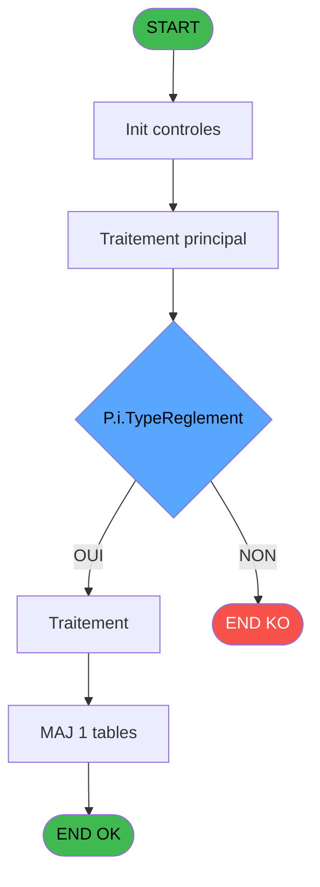
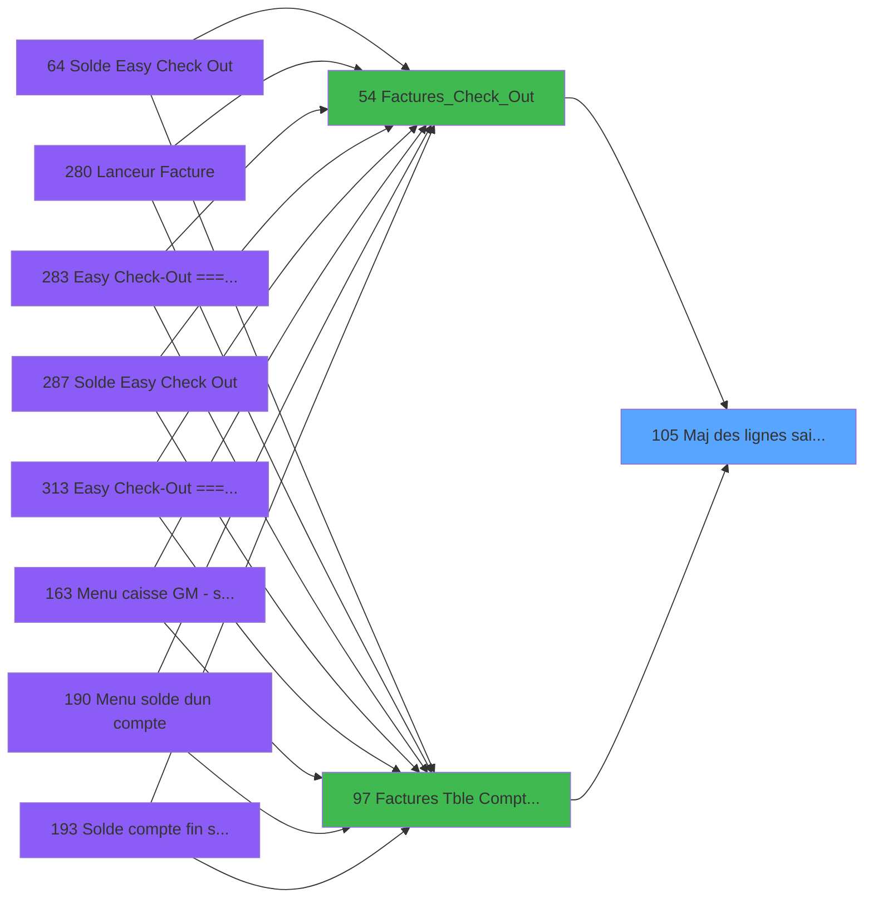

# ADH IDE 105 - Maj des lignes saisies V3

> **Analyse**: Phases 1-4 2026-02-07 03:48 -> 02:47 (22h58min) | Assemblage 02:47
> **Pipeline**: V7.2 Enrichi
> **Structure**: 4 onglets (Resume | Ecrans | Donnees | Connexions)

<!-- TAB:Resume -->

## 1. FICHE D'IDENTITE

| Attribut | Valeur |
|----------|--------|
| Projet | ADH |
| IDE Position | 105 |
| Nom Programme | Maj des lignes saisies V3 |
| Fichier source | `Prg_105.xml` |
| Dossier IDE | General |
| Taches | 1 (0 ecrans visibles) |
| Tables modifiees | 1 |
| Programmes appeles | 0 |
| Complexite | **BASSE** (score 7/100) |

## 2. DESCRIPTION FONCTIONNELLE

# ADH IDE 105 - Maj des lignes saisies V3

Programme de mise à jour des lignes comptables suite à des modifications de garanties ou factures. Il reçoit les paramètres identifiant une ligne comptable existante (clés societe/compte/filiation/service/numero) et met à jour les colonnes pertinentes dans la table `comptable________cte`. Appelé en tant que sous-tache lors de la validation de garanties (garantie sur compte) ou de la finalisation de factures (checkout ou gestion manuelle).

La logique effectue une validation des paramètres reçus, localise la ligne cible dans `comptable________cte`, puis applique les modifications. Le programme gère les cas d'erreur comme l'absence de ligne correspondante ou les violations de contraintes d'intégrité. Les modifications sont écrites directement dans la table, sans rollback automatique en cas de conflit concurrent.

Utilisé dans le workflow comptable V3 (versioning indiqué par le suffixe) pour maintenir la cohérence des saisies manuelles. Le programme est appelé par des handlers de tâches supérieures qui orchestrent le flux global (garantie, facture) et s'attendent à ce que les mises à jour soient appliquées sans confirmation utilisateur.

## 3. BLOCS FONCTIONNELS

### 3.1 Saisie (1 tache)

L'operateur saisit les donnees de la transaction via 1 ecran (Maj des lignes saisies V3).

---

#### 105 - Maj des lignes saisies V3 [[ECRAN]](#ecran-t1)

**Role** : Saisie des donnees : Maj des lignes saisies V3.
**Ecran** : 1070 x 0 DLU | [Voir mockup](#ecran-t1)

## 5. REGLES METIER

7 regles identifiees:

### Autres (7 regles)

#### [RM-001] Condition composite: [BE]=0 AND NOT P.i.Facture ECO [H]

| Element | Detail |
|---------|--------|
| **Condition** | `[BE]=0 AND NOT P.i.Facture ECO [H]` |
| **Si vrai** | Action si vrai |
| **Variables** | EU (P.i.Facture ECO) |
| **Expression source** | Expression 1 : `[BE]=0 AND NOT P.i.Facture ECO [H]` |
| **Exemple** | Si [BE]=0 AND NOT P.i.Facture ECO [H] → Action si vrai |

#### [RM-002] Condition composite: [BP]=0 AND NOT P.i.Facture ECO [H]

| Element | Detail |
|---------|--------|
| **Condition** | `[BP]=0 AND NOT P.i.Facture ECO [H]` |
| **Si vrai** | Action si vrai |
| **Variables** | EU (P.i.Facture ECO) |
| **Expression source** | Expression 2 : `[BP]=0 AND NOT P.i.Facture ECO [H]` |
| **Exemple** | Si [BP]=0 AND NOT P.i.Facture ECO [H] → Action si vrai |

#### [RM-003] Condition: [BC] AND Trim(P.i.TypeReglement [G]) different de 'D'

| Element | Detail |
|---------|--------|
| **Condition** | `[BC] AND Trim(P.i.TypeReglement [G])<>'D'` |
| **Si vrai** | Action si vrai |
| **Variables** | ET (P.i.TypeReglement) |
| **Expression source** | Expression 11 : `[BC] AND Trim(P.i.TypeReglement [G])<>'D'` |
| **Exemple** | Si [BC] AND Trim(P.i.TypeReglement [G])<>'D' → Action si vrai |

#### [RM-004] Condition: [BJ] AND Trim(P.i.TypeReglement [G]) different de 'I'

| Element | Detail |
|---------|--------|
| **Condition** | `[BJ] AND Trim(P.i.TypeReglement [G])<>'I'` |
| **Si vrai** | Action si vrai |
| **Variables** | ET (P.i.TypeReglement) |
| **Expression source** | Expression 12 : `[BJ] AND Trim(P.i.TypeReglement [G])<>'I'` |
| **Exemple** | Si [BJ] AND Trim(P.i.TypeReglement [G])<>'I' → Action si vrai |

#### [RM-005] Condition: [Q] = 0 OR [BE] egale 0

| Element | Detail |
|---------|--------|
| **Condition** | `[Q] = 0 OR [BE] = 0` |
| **Si vrai** | Action si vrai |
| **Expression source** | Expression 15 : `[Q] = 0 OR [BE] = 0` |
| **Exemple** | Si [Q] = 0 OR [BE] = 0 → Action si vrai |

#### [RM-006] Valeur par defaut si Trim(P.i.TypeReglement [G]) est vide

| Element | Detail |
|---------|--------|
| **Condition** | `Trim(P.i.TypeReglement [G])=''` |
| **Si vrai** | 'TRUE'LOG |
| **Si faux** | IF(Trim(P.i.TypeReglement [G])='I',[BC],[BJ])) |
| **Variables** | ET (P.i.TypeReglement) |
| **Expression source** | Expression 17 : `IF(Trim(P.i.TypeReglement [G])='','TRUE'LOG,IF(Trim(P.i.Type` |
| **Exemple** | Si Trim(P.i.TypeReglement [G])='' → 'TRUE'LOG. Sinon → IF(Trim(P.i.TypeReglement [G])='I',[BC],[BJ])) |

#### [RM-007] Si Trim(P.i.TypeReglement [G])='I' alors [BC] sinon [BJ])

| Element | Detail |
|---------|--------|
| **Condition** | `Trim(P.i.TypeReglement [G])='I'` |
| **Si vrai** | [BC] |
| **Si faux** | [BJ]) |
| **Variables** | ET (P.i.TypeReglement) |
| **Expression source** | Expression 18 : `IF(Trim(P.i.TypeReglement [G])='I',[BC],[BJ])` |
| **Exemple** | Si Trim(P.i.TypeReglement [G])='I' → [BC]. Sinon → [BJ]) |

## 6. CONTEXTE

- **Appele par**: [Garantie sur compte PMS-584 (IDE 0)](ADH-IDE-0.md), [Factures_Check_Out (IDE 54)](ADH-IDE-54.md), [Factures (Tble Compta&Vent) V3 (IDE 97)](ADH-IDE-97.md)
- **Appelle**: 0 programmes | **Tables**: 4 (W:1 R:0 L:3) | **Taches**: 1 | **Expressions**: 23

<!-- TAB:Ecrans -->

## 8. ECRANS

*(Programme sans ecran visible)*

## 9. NAVIGATION

### 9.3 Structure hierarchique (1 tache)

| Position | Tache | Type | Dimensions | Bloc |
|----------|-------|------|------------|------|
| **105.1** | [**Maj des lignes saisies V3** (105)](#t1) [mockup](#ecran-t1) | - | 1070x0 | Saisie |

### 9.4 Algorigramme

> **Legende**: Vert = START/END OK | Rouge = END KO | Bleu = Decisions
> *Algorigramme auto-genere. Utiliser `/algorigramme` pour une synthese metier detaillee.*

<!-- TAB:Donnees -->

## 10. TABLES

### Tables utilisees (4)

| ID | Nom | Description | Type | R | W | L | Usages |
|----|-----|-------------|------|---|---|---|--------|
| 40 | comptable________cte |  | DB |   | **W** |   | 1 |
| 263 | vente | Donnees de ventes | DB |   |   | L | 1 |
| 866 | maj_appli_tpe |  | DB |   |   | L | 1 |
| 870 | Rayons_Boutique |  | DB |   |   | L | 1 |

### Colonnes par table (2 / 1 tables avec colonnes identifiees)

Table 40 - comptable________cte (**W**) - 1 usages

| Lettre | Variable | Acces | Type |
|--------|----------|-------|------|
| A | P.i.Societe | W | Unicode |
| B | P.i.Compte | W | Numeric |
| C | P.i.Flague | W | Logical |
| D | P.i.NumFac | W | Numeric |
| E | P.i.NomFacPDF | W | Alpha |
| F | P.i.SelectionManulle | W | Logical |
| G | P.i.TypeReglement | W | Unicode |
| H | P.i.Facture ECO | W | Logical |
| I | V retour Compta | W | Logical |
| J | v Retour Vente | W | Logical |
| K | v Trouvé Compta | W | Logical |
| L | v Trouvé Vente | W | Logical |

## 11. VARIABLES

### 11.1 Parametres entrants (8)

Variables recues du programme appelant ([Garantie sur compte PMS-584 (IDE 0)](ADH-IDE-0.md)).

| Lettre | Nom | Type | Usage dans |
|--------|-----|------|-----------|
| EN | P.i.Societe | Unicode | 1x parametre entrant |
| EO | P.i.Compte | Numeric | 1x parametre entrant |
| EP | P.i.Flague | Logical | - |
| EQ | P.i.NumFac | Numeric | 1x parametre entrant |
| ER | P.i.NomFacPDF | Alpha | 1x parametre entrant |
| ES | P.i.SelectionManulle | Logical | 2x parametre entrant |
| ET | P.i.TypeReglement | Unicode | 5x parametre entrant |
| EU | P.i.Facture ECO | Logical | 2x parametre entrant |

### 11.2 Variables de session (4)

Variables persistantes pendant toute la session.

| Lettre | Nom | Type | Usage dans |
|--------|-----|------|-----------|
| EV | V retour Compta | Logical | - |
| EW | v Retour Vente | Logical | - |
| EX | v Trouvé Compta | Logical | - |
| EY | v Trouvé Vente | Logical | 1x session |

## 12. EXPRESSIONS

**23 / 23 expressions decodees (100%)**

### 12.1 Repartition par type

| Type | Expressions | Regles |
|------|-------------|--------|
| CONDITION | 7 | 6 |
| CAST_LOGIQUE | 2 | 5 |
| DATE | 2 | 0 |
| OTHER | 12 | 0 |

### 12.2 Expressions cles par type

#### CONDITION (7 expressions)

| Type | IDE | Expression | Regle |
|------|-----|------------|-------|
| CONDITION | 12 | `[BJ] AND Trim(P.i.TypeReglement [G])<>'I'` | [RM-004](#rm-RM-004) |
| CONDITION | 15 | `[Q] = 0 OR [BE] = 0` | [RM-005](#rm-RM-005) |
| CONDITION | 18 | `IF(Trim(P.i.TypeReglement [G])='I',[BC],[BJ])` | [RM-007](#rm-RM-007) |
| CONDITION | 1 | `[BE]=0 AND NOT P.i.Facture ECO [H]` | [RM-001](#rm-RM-001) |
| CONDITION | 2 | `[BP]=0 AND NOT P.i.Facture ECO [H]` | [RM-002](#rm-RM-002) |
| ... | | *+2 autres* | |

#### CAST_LOGIQUE (2 expressions)

| Type | IDE | Expression | Regle |
|------|-----|------------|-------|
| CAST_LOGIQUE | 17 | `IF(Trim(P.i.TypeReglement [G])='','TRUE'LOG,IF(Trim(P.i.TypeReglement [G])='I',[BC],[BJ]))` | [RM-006](#rm-RM-006) |
| CAST_LOGIQUE | 20 | `'FALSE'LOG` | - |

#### DATE (2 expressions)

| Type | IDE | Expression | Regle |
|------|-----|------------|-------|
| DATE | 9 | `Date()` | - |
| DATE | 4 | `Date()` | - |

#### OTHER (12 expressions)

| Type | IDE | Expression | Regle |
|------|-----|------------|-------|
| OTHER | 16 | `P.i.SelectionManulle [F]` | - |
| OTHER | 14 | `[V]` | - |
| OTHER | 13 | `[N]` | - |
| OTHER | 23 | `[BO]` | - |
| OTHER | 22 | `[BI]` | - |
| ... | | *+7 autres* | |

### 12.3 Toutes les expressions (23)

Voir les 23 expressions

#### CONDITION (7)

| IDE | Expression Decodee |
|-----|-------------------|
| 1 | `[BE]=0 AND NOT P.i.Facture ECO [H]` |
| 2 | `[BP]=0 AND NOT P.i.Facture ECO [H]` |
| 11 | `[BC] AND Trim(P.i.TypeReglement [G])<>'D'` |
| 12 | `[BJ] AND Trim(P.i.TypeReglement [G])<>'I'` |
| 15 | `[Q] = 0 OR [BE] = 0` |
| 18 | `IF(Trim(P.i.TypeReglement [G])='I',[BC],[BJ])` |
| 21 | `CndRange(Trim(P.i.TypeReglement [G])='',P.i.SelectionManulle [F])` |

#### CAST_LOGIQUE (2)

| IDE | Expression Decodee |
|-----|-------------------|
| 17 | `IF(Trim(P.i.TypeReglement [G])='','TRUE'LOG,IF(Trim(P.i.TypeReglement [G])='I',[BC],[BJ]))` |
| 20 | `'FALSE'LOG` |

#### DATE (2)

| IDE | Expression Decodee |
|-----|-------------------|
| 4 | `Date()` |
| 9 | `Date()` |

#### OTHER (12)

| IDE | Expression Decodee |
|-----|-------------------|
| 3 | `P.i.NumFac [D]` |
| 5 | `Time()` |
| 6 | `P.i.NomFacPDF [E]` |
| 7 | `P.i.Societe [A]` |
| 8 | `P.i.Compte [B]` |
| 10 | `[N]` |
| 13 | `[N]` |
| 14 | `[V]` |
| 16 | `P.i.SelectionManulle [F]` |
| 19 | `v Trouvé Vente [L]` |
| 22 | `[BI]` |
| 23 | `[BO]` |

<!-- TAB:Connexions -->

## 13. GRAPHE D'APPELS

### 13.1 Chaine depuis Main (Callers)

Main -> ... -> [Garantie sur compte PMS-584 (IDE 0)](ADH-IDE-0.md) -> **Maj des lignes saisies V3 (IDE 105)**

Main -> ... -> [Factures_Check_Out (IDE 54)](ADH-IDE-54.md) -> **Maj des lignes saisies V3 (IDE 105)**

Main -> ... -> [Factures (Tble Compta&Vent) V3 (IDE 97)](ADH-IDE-97.md) -> **Maj des lignes saisies V3 (IDE 105)**

### 13.2 Callers

| IDE | Nom Programme | Nb Appels |
|-----|---------------|-----------|
| [0](ADH-IDE-0.md) | Garantie sur compte PMS-584 | 2 |
| [54](ADH-IDE-54.md) | Factures_Check_Out | 2 |
| [97](ADH-IDE-97.md) | Factures (Tble Compta&Vent) V3 | 2 |

### 13.3 Callees (programmes appeles)

### 13.4 Detail Callees avec contexte

| IDE | Nom Programme | Appels | Contexte |
|-----|---------------|--------|----------|
| - | (aucun) | - | - |

## 14. RECOMMANDATIONS MIGRATION

### 14.1 Profil du programme

| Metrique | Valeur | Impact migration |
|----------|--------|-----------------|
| Lignes de logique | 81 | Programme compact |
| Expressions | 23 | Peu de logique |
| Tables WRITE | 1 | Impact faible |
| Sous-programmes | 0 | Peu de dependances |
| Ecrans visibles | 0 | Ecran unique ou traitement batch |
| Code desactive | 0% (0 / 81) | Code sain |
| Regles metier | 7 | Quelques regles a preserver |

### 14.2 Plan de migration par bloc

#### Saisie (1 tache: 1 ecran, 0 traitement)

- **Strategie** : Formulaire React/Blazor avec validation Zod/FluentValidation.
- Reproduire 1 ecran : Maj des lignes saisies V3
- Validation temps reel cote client + serveur

### 14.3 Dependances critiques

| Dependance | Type | Appels | Impact |
|------------|------|--------|--------|
| comptable________cte | Table WRITE (Database) | 1x | Schema + repository |

---
*Spec DETAILED generee par Pipeline V7.2 - 2026-02-08 02:48*
