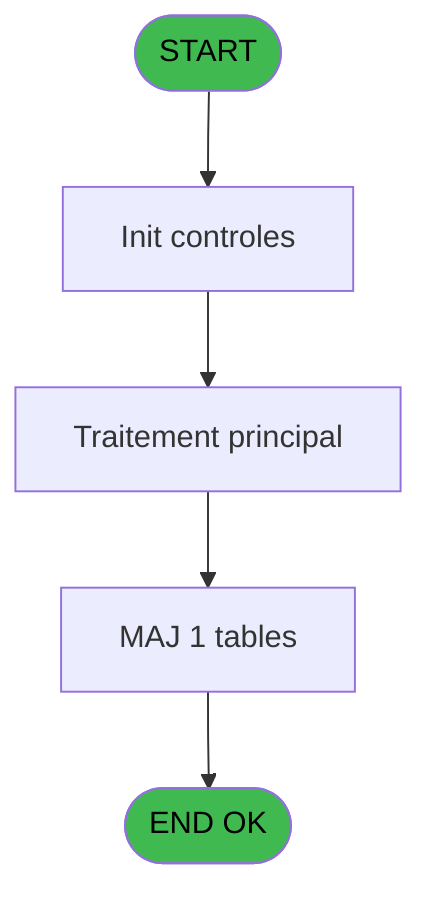
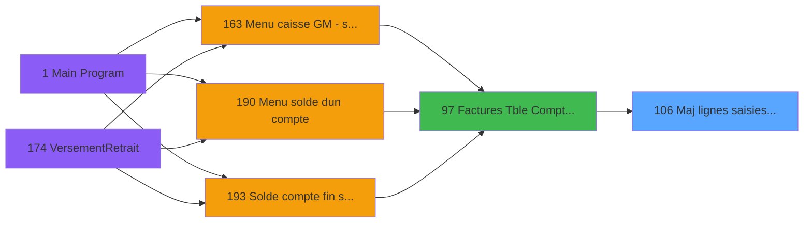

# ADH IDE 106 - Maj lignes saisies archive V3

> **Analyse**: Phases 1-4 2026-02-07 07:01 -> 02:48 (19h47min) | Assemblage 02:48
> **Pipeline**: V7.2 Enrichi
> **Structure**: 4 onglets (Resume | Ecrans | Donnees | Connexions)

<!-- TAB:Resume -->

## 1. FICHE D'IDENTITE

| Attribut | Valeur |
|----------|--------|
| Projet | ADH |
| IDE Position | 106 |
| Nom Programme | Maj lignes saisies archive V3 |
| Fichier source | `Prg_106.xml` |
| Dossier IDE | General |
| Taches | 1 (0 ecrans visibles) |
| Tables modifiees | 1 |
| Programmes appeles | 0 |
| Complexite | **BASSE** (score 7/100) |

## 2. DESCRIPTION FONCTIONNELLE

**ADH IDE 106** est un utilitaire de maintenance spécialisé dans la **synchronisation des archives de factures lors de la migration V2→V3**. Le programme met à jour en batch les enregistrements archivés de la table **projet** en enrichissant chaque ligne avec les données de facturation critiques : numéro de facture, compte, société, indicateurs de statut. Il valide en parallèle les correspondances avec les systèmes Compta et Vente via les tables de référence (Activité, Rayons_Boutique, maj_appli_tpe).

Le flux d'exécution est très simple : réinitialisation des variables de contrôle, capture du timestamp courant, puis traitement conditionnel basé sur le champ `P.i.Flague [C]` (indicateur d'activation). Pour chaque enregistrement archivé, le programme affecte les 7 variables paramètres (sociétés, comptes, numéros de facture) et écrit les 11 colonnes modifiées dans la table projet. Les conditions sur les champs Compta et Vente permettent de détecter les correspondances manquantes et de signaler les anomalies de synchronisation.

Complexité très basse (71 lignes de logique, zéro appels de sous-programmes). Le programme est un traitement batch isolé sans écran visible, sûr à modifier car il n'impacte qu'une table en écriture et n'a aucune dépendance en aval.

## 3. BLOCS FONCTIONNELS

## 5. REGLES METIER

4 regles identifiees:

### Autres (4 regles)

#### [RM-001] Condition: [BC] egale 0

| Element | Detail |
|---------|--------|
| **Condition** | `[BC]=0` |
| **Si vrai** | Action si vrai |
| **Expression source** | Expression 1 : `[BC]=0` |
| **Exemple** | Si [BC]=0 → Action si vrai |

#### [RM-002] Condition: [BM] egale 0

| Element | Detail |
|---------|--------|
| **Condition** | `[BM]=0` |
| **Si vrai** | Action si vrai |
| **Expression source** | Expression 2 : `[BM]=0` |
| **Exemple** | Si [BM]=0 → Action si vrai |

#### [RM-003] Condition toujours vraie (flag actif)

| Element | Detail |
|---------|--------|
| **Condition** | `P.i.Flague [C]` |
| **Si vrai** | 'TRUE'LOG |
| **Si faux** | 'FALSE'LOG) |
| **Variables** | EP (P.i.Flague) |
| **Expression source** | Expression 10 : `IF(P.i.Flague [C],'TRUE'LOG,'FALSE'LOG)` |
| **Exemple** | Si P.i.Flague [C] → 'TRUE'LOG. Sinon → 'FALSE'LOG) |

#### [RM-004] Condition: [P]=0 OR [BC] egale 0

| Element | Detail |
|---------|--------|
| **Condition** | `[P]=0 OR [BC]=0` |
| **Si vrai** | Action si vrai |
| **Expression source** | Expression 16 : `[P]=0 OR [BC]=0` |
| **Exemple** | Si [P]=0 OR [BC]=0 → Action si vrai |

## 6. CONTEXTE

- **Appele par**: [Factures (Tble Compta&Vent) V3 (IDE 97)](ADH-IDE-97.md)
- **Appelle**: 0 programmes | **Tables**: 4 (W:1 R:0 L:3) | **Taches**: 1 | **Expressions**: 18

<!-- TAB:Ecrans -->

## 8. ECRANS

*(Programme sans ecran visible)*

## 9. NAVIGATION

### 9.3 Structure hierarchique (0 tache)

| Position | Tache | Type | Dimensions | Bloc |
|----------|-------|------|------------|------|

### 9.4 Algorigramme

> **Legende**: Vert = START/END OK | Rouge = END KO | Bleu = Decisions
> *Algorigramme auto-genere. Utiliser `/algorigramme` pour une synthese metier detaillee.*

<!-- TAB:Donnees -->

## 10. TABLES

### Tables utilisees (4)

| ID | Nom | Description | Type | R | W | L | Usages |
|----|-----|-------------|------|---|---|---|--------|
| 746 | projet |  | DB |   | **W** |   | 1 |
| 866 | maj_appli_tpe |  | DB |   |   | L | 1 |
| 871 | Activite |  | DB |   |   | L | 1 |
| 870 | Rayons_Boutique |  | DB |   |   | L | 1 |

### Colonnes par table (1 / 1 tables avec colonnes identifiees)

Table 746 - projet (**W**) - 1 usages

| Lettre | Variable | Acces | Type |
|--------|----------|-------|------|
| A | P.i.Societe | W | Unicode |
| B | P.i.Compte | W | Numeric |
| C | P.i.Flague | W | Logical |
| D | P.i.No_Facture | W | Numeric |
| E | P.i.NomFichPDF | W | Alpha |
| F | P.i.SelectionManuelle | W | Logical |
| G | P.i.Date Purge | W | Date |
| H | V retour Compta | W | Logical |
| I | v Retour Vente | W | Logical |
| J | v Trouvé Compta | W | Logical |
| K | v Trouvé Vente | W | Logical |

## 11. VARIABLES

### 11.1 Parametres entrants (7)

Variables recues du programme appelant ([Factures (Tble Compta&Vent) V3 (IDE 97)](ADH-IDE-97.md)).

| Lettre | Nom | Type | Usage dans |
|--------|-----|------|-----------|
| EN | P.i.Societe | Unicode | 1x parametre entrant |
| EO | P.i.Compte | Numeric | 1x parametre entrant |
| EP | P.i.Flague | Logical | 1x parametre entrant |
| EQ | P.i.No_Facture | Numeric | 1x parametre entrant |
| ER | P.i.NomFichPDF | Alpha | 1x parametre entrant |
| ES | P.i.SelectionManuelle | Logical | 1x parametre entrant |
| ET | P.i.Date Purge | Date | 1x parametre entrant |

### 11.2 Variables de session (4)

Variables persistantes pendant toute la session.

| Lettre | Nom | Type | Usage dans |
|--------|-----|------|-----------|
| EU | V retour Compta | Logical | - |
| EV | v Retour Vente | Logical | - |
| EW | v Trouvé Compta | Logical | - |
| EX | v Trouvé Vente | Logical | - |

## 12. EXPRESSIONS

**18 / 18 expressions decodees (100%)**

### 12.1 Repartition par type

| Type | Expressions | Regles |
|------|-------------|--------|
| CONDITION | 3 | 3 |
| CAST_LOGIQUE | 1 | 5 |
| DATE | 2 | 0 |
| OTHER | 12 | 0 |

### 12.2 Expressions cles par type

#### CONDITION (3 expressions)

| Type | IDE | Expression | Regle |
|------|-----|------------|-------|
| CONDITION | 16 | `[P]=0 OR [BC]=0` | [RM-004](#rm-RM-004) |
| CONDITION | 2 | `[BM]=0` | [RM-002](#rm-RM-002) |
| CONDITION | 1 | `[BC]=0` | [RM-001](#rm-RM-001) |

#### CAST_LOGIQUE (1 expressions)

| Type | IDE | Expression | Regle |
|------|-----|------------|-------|
| CAST_LOGIQUE | 10 | `IF(P.i.Flague [C],'TRUE'LOG,'FALSE'LOG)` | [RM-003](#rm-RM-003) |

#### DATE (2 expressions)

| Type | IDE | Expression | Regle |
|------|-----|------------|-------|
| DATE | 9 | `Date()` | - |
| DATE | 4 | `Date()` | - |

#### OTHER (12 expressions)

| Type | IDE | Expression | Regle |
|------|-----|------------|-------|
| OTHER | 14 | `[M]` | - |
| OTHER | 13 | `[BH]` | - |
| OTHER | 12 | `[BA]` | - |
| OTHER | 18 | `P.i.Date Purge [G]` | - |
| OTHER | 17 | `P.i.SelectionManuelle [F]` | - |
| ... | | *+7 autres* | |

<!-- TAB:Connexions -->

## 13. GRAPHE D'APPELS

### 13.1 Chaine depuis Main (Callers)

Main -> ... -> [Factures (Tble Compta&Vent) V3 (IDE 97)](ADH-IDE-97.md) -> **Maj lignes saisies archive V3 (IDE 106)**

### 13.2 Callers

| IDE | Nom Programme | Nb Appels |
|-----|---------------|-----------|
| [97](ADH-IDE-97.md) | Factures (Tble Compta&Vent) V3 | 2 |

### 13.3 Callees (programmes appeles)

### 13.4 Detail Callees avec contexte

| IDE | Nom Programme | Appels | Contexte |
|-----|---------------|--------|----------|
| - | (aucun) | - | - |

## 14. RECOMMANDATIONS MIGRATION

### 14.1 Profil du programme

| Metrique | Valeur | Impact migration |
|----------|--------|-----------------|
| Lignes de logique | 71 | Programme compact |
| Expressions | 18 | Peu de logique |
| Tables WRITE | 1 | Impact faible |
| Sous-programmes | 0 | Peu de dependances |
| Ecrans visibles | 0 | Ecran unique ou traitement batch |
| Code desactive | 0% (0 / 71) | Code sain |
| Regles metier | 4 | Quelques regles a preserver |

### 14.2 Plan de migration par bloc

### 14.3 Dependances critiques

| Dependance | Type | Appels | Impact |
|------------|------|--------|--------|
| projet | Table WRITE (Database) | 1x | Schema + repository |

---
*Spec DETAILED generee par Pipeline V7.2 - 2026-02-08 02:49*
