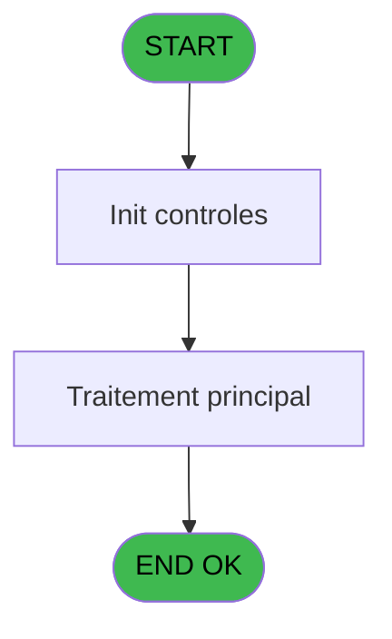
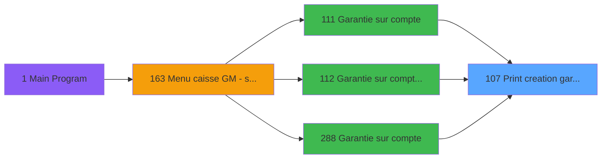

# ADH IDE 107 - Print creation garantie

> **Analyse**: Phases 1-4 2026-02-07 03:48 -> 02:49 (23h00min) | Assemblage 02:49
> **Pipeline**: V7.2 Enrichi
> **Structure**: 4 onglets (Resume | Ecrans | Donnees | Connexions)

<!-- TAB:Resume -->

## 1. FICHE D'IDENTITE

| Attribut | Valeur |
|----------|--------|
| Projet | ADH |
| IDE Position | 107 |
| Nom Programme | Print creation garantie |
| Fichier source | `Prg_107.xml` |
| Dossier IDE | Garanties |
| Taches | 14 (1 ecrans visibles) |
| Tables modifiees | 0 |
| Programmes appeles | 1 |
| Complexite | **BASSE** (score 12/100) |

## 2. DESCRIPTION FONCTIONNELLE

**ADH IDE 107** gère l'impression des garanties de compte, servant de composant central dans le flux de création de garantie. Appelé par quatre programmes liés aux garanties (IDE 111, 112, 288 et 0), il reçoit les paramètres du compte et formate les données de garantie pour impression. Son rôle est d'orchestrer l'envoi des informations vers l'imprimante configurée, avec support de multiples formats selon le type de garantie traité.

Le programme s'organise autour d'une série coordonnée de tâches : initialisation de l'imprimante (Printer 1), trois boucles d'édition d'extraits de compte avec paramètres distincts, tâches d'imprimante secondaires (Printer 4, 8, 9), et deux passes additionnelles d'édition. Cette structure permet de gérer différentes phases d'impression avec formatage spécifique pour chaque variante de garantie, tout en affichant un écran "Veuillez patienter..." pendant le traitement.

Le programme finalise son exécution en réinitialisant l'état de l'imprimante via l'appel à **Raz Current Printer (IDE 182)**, garantissant qu'elle revient à un état propre pour éviter les blocages. Ce pattern initialisation-traitement-réinitialisation est standard dans les flux d'impression Magic pour assurer la cohérence des opérations suivantes.

## 3. BLOCS FONCTIONNELS

### 3.1 Traitement (4 taches)

Traitements internes.

---

#### 107 - (sans nom)

**Role** : Traitement interne.

3 sous-taches directes

| Tache | Nom | Bloc |
|-------|-----|------|
| [107.3](#t8) | Iteration **[[ECRAN]](#ecran-t8)** | Traitement |
| [107.3.1](#t9) | Veuillez patienter... **[[ECRAN]](#ecran-t9)** | Traitement |
| [107.4](#t10) | recup nom adherent | Traitement |

---

#### 107.3 - Iteration [[ECRAN]](#ecran-t8)

**Role** : Traitement : Iteration.
**Ecran** : 422 x 56 DLU (MDI) | [Voir mockup](#ecran-t8)

---

#### 107.3.1 - Veuillez patienter... [[ECRAN]](#ecran-t9)

**Role** : Traitement : Veuillez patienter....
**Ecran** : 422 x 56 DLU (MDI) | [Voir mockup](#ecran-t9)

---

#### 107.4 - recup nom adherent

**Role** : Consultation/chargement : recup nom adherent.
**Variables liees** : EO (P0 code adherent), EU (W0 n° adherent)

### 3.2 Impression (10 taches)

Generation des documents et tickets.

---

#### 107.1 - Printer 1

**Role** : Generation du document : Printer 1.
**Delegue a** : [Raz Current Printer (IDE 182)](ADH-IDE-182.md)

---

#### 107.1.1 - edition extrait compte

**Role** : Generation du document : edition extrait compte.
**Delegue a** : [Raz Current Printer (IDE 182)](ADH-IDE-182.md)

---

#### 107.1.2 - edition extrait compte

**Role** : Generation du document : edition extrait compte.
**Delegue a** : [Raz Current Printer (IDE 182)](ADH-IDE-182.md)

---

#### 107.2 - Printer 4

**Role** : Generation du document : Printer 4.
**Delegue a** : [Raz Current Printer (IDE 182)](ADH-IDE-182.md)

---

#### 107.2.1 - edition extrait compte

**Role** : Generation du document : edition extrait compte.
**Delegue a** : [Raz Current Printer (IDE 182)](ADH-IDE-182.md)

---

#### 107.2.2 - edition extrait compte

**Role** : Generation du document : edition extrait compte.
**Delegue a** : [Raz Current Printer (IDE 182)](ADH-IDE-182.md)

---

#### 107.5 - Printer 8

**Role** : Generation du document : Printer 8.
**Delegue a** : [Raz Current Printer (IDE 182)](ADH-IDE-182.md)

---

#### 107.5.1 - edition extrait compte

**Role** : Generation du document : edition extrait compte.
**Delegue a** : [Raz Current Printer (IDE 182)](ADH-IDE-182.md)

---

#### 107.6 - Printer 9

**Role** : Generation du document : Printer 9.
**Delegue a** : [Raz Current Printer (IDE 182)](ADH-IDE-182.md)

---

#### 107.6.1 - edition extrait compte

**Role** : Generation du document : edition extrait compte.
**Delegue a** : [Raz Current Printer (IDE 182)](ADH-IDE-182.md)

## 5. REGLES METIER

5 regles identifiees:

### Impression (5 regles)

#### [RM-001] Verification que l'imprimante courante est la n1

| Element | Detail |
|---------|--------|
| **Condition** | `GetParam ('CURRENTPRINTERNUM')=1` |
| **Si vrai** | Action si CURRENTPRINTERNUM = 1 |
| **Expression source** | Expression 5 : `GetParam ('CURRENTPRINTERNUM')=1` |
| **Exemple** | Si GetParam ('CURRENTPRINTERNUM')=1 → Action si CURRENTPRINTERNUM = 1 |
| **Impact** | [107.1 - Printer 1](#t2) |

#### [RM-002] Verification que l'imprimante courante est la n4

| Element | Detail |
|---------|--------|
| **Condition** | `GetParam ('CURRENTPRINTERNUM')=4` |
| **Si vrai** | Action si CURRENTPRINTERNUM = 4 |
| **Expression source** | Expression 6 : `GetParam ('CURRENTPRINTERNUM')=4` |
| **Exemple** | Si GetParam ('CURRENTPRINTERNUM')=4 → Action si CURRENTPRINTERNUM = 4 |
| **Impact** | [107.1 - Printer 1](#t2) |

#### [RM-003] Verification que l'imprimante courante est la n5

| Element | Detail |
|---------|--------|
| **Condition** | `GetParam ('CURRENTPRINTERNUM')=5` |
| **Si vrai** | Action si CURRENTPRINTERNUM = 5 |
| **Expression source** | Expression 7 : `GetParam ('CURRENTPRINTERNUM')=5` |
| **Exemple** | Si GetParam ('CURRENTPRINTERNUM')=5 → Action si CURRENTPRINTERNUM = 5 |
| **Impact** | [107.1 - Printer 1](#t2) |

#### [RM-004] Verification que l'imprimante courante est la n8

| Element | Detail |
|---------|--------|
| **Condition** | `GetParam ('CURRENTPRINTERNUM')=8` |
| **Si vrai** | Action si CURRENTPRINTERNUM = 8 |
| **Expression source** | Expression 8 : `GetParam ('CURRENTPRINTERNUM')=8` |
| **Exemple** | Si GetParam ('CURRENTPRINTERNUM')=8 → Action si CURRENTPRINTERNUM = 8 |
| **Impact** | [107.1 - Printer 1](#t2) |

#### [RM-005] Verification que l'imprimante courante est la n9

| Element | Detail |
|---------|--------|
| **Condition** | `GetParam ('CURRENTPRINTERNUM')=9` |
| **Si vrai** | Action si CURRENTPRINTERNUM = 9 |
| **Expression source** | Expression 9 : `GetParam ('CURRENTPRINTERNUM')=9` |
| **Exemple** | Si GetParam ('CURRENTPRINTERNUM')=9 → Action si CURRENTPRINTERNUM = 9 |
| **Impact** | [107.1 - Printer 1](#t2) |

## 6. CONTEXTE

- **Appele par**: [Garantie sur compte (IDE 111)](ADH-IDE-111.md), [Garantie sur compte PMS-584 (IDE 112)](ADH-IDE-112.md), [Garantie sur compte (IDE 288)](ADH-IDE-288.md), [Garantie sur compte PMS-584 (IDE 0)](ADH-IDE-0.md)
- **Appelle**: 1 programmes | **Tables**: 7 (W:0 R:3 L:4) | **Taches**: 14 | **Expressions**: 12

<!-- TAB:Ecrans -->

## 8. ECRANS

### 8.1 Forms visibles (1 / 14)

| # | Position | Tache | Nom | Type | Largeur | Hauteur | Bloc |
|---|----------|-------|-----|------|---------|---------|------|
| 1 | 107.3.1 | 107.3.1 | Veuillez patienter... | MDI | 422 | 56 | Traitement |

### 8.2 Mockups Ecrans

---

#### 107.3.1 - Veuillez patienter...
**Tache** : [107.3.1](#t9) | **Type** : MDI | **Dimensions** : 422 x 56 DLU
**Bloc** : Traitement | **Titre IDE** : Veuillez patienter...

<!-- FORM-DATA:
{
    "width":  422,
    "vFactor":  8,
    "type":  "MDI",
    "hFactor":  8,
    "controls":  [
                     {
                         "x":  0,
                         "type":  "label",
                         "var":  "",
                         "y":  0,
                         "w":  423,
                         "fmt":  "",
                         "name":  "",
                         "h":  29,
                         "color":  "",
                         "text":  "",
                         "parent":  null
                     },
                     {
                         "x":  120,
                         "type":  "label",
                         "var":  "",
                         "y":  10,
                         "w":  221,
                         "fmt":  "",
                         "name":  "",
                         "h":  8,
                         "color":  "7",
                         "text":  "Impression en cours ...",
                         "parent":  null
                     },
                     {
                         "x":  0,
                         "type":  "label",
                         "var":  "",
                         "y":  29,
                         "w":  423,
                         "fmt":  "",
                         "name":  "",
                         "h":  27,
                         "color":  "",
                         "text":  "",
                         "parent":  null
                     },
                     {
                         "x":  50,
                         "type":  "label",
                         "var":  "",
                         "y":  38,
                         "w":  323,
                         "fmt":  "",
                         "name":  "",
                         "h":  8,
                         "color":  "",
                         "text":  "Edition de la creation de garantie",
                         "parent":  null
                     },
                     {
                         "x":  4,
                         "type":  "image",
                         "var":  "",
                         "y":  2,
                         "w":  72,
                         "fmt":  "",
                         "name":  "",
                         "h":  25,
                         "color":  "",
                         "text":  "",
                         "parent":  null
                     }
                 ],
    "taskId":  "107.3.1",
    "height":  56
}
-->

## 9. NAVIGATION

Ecran unique: **Veuillez patienter...**

### 9.3 Structure hierarchique (14 taches)

| Position | Tache | Type | Dimensions | Bloc |
|----------|-------|------|------------|------|
| **107.1** | [**(sans nom)** (107)](#t1) | MDI | - | Traitement |
| 107.1.1 | [Iteration (107.3)](#t8) [mockup](#ecran-t8) | MDI | 422x56 | |
| 107.1.2 | [Veuillez patienter... (107.3.1)](#t9) [mockup](#ecran-t9) | MDI | 422x56 | |
| 107.1.3 | [recup nom adherent (107.4)](#t10) | MDI | - | |
| **107.2** | [**Printer 1** (107.1)](#t2) | MDI | - | Impression |
| 107.2.1 | [edition extrait compte (107.1.1)](#t3) | MDI | - | |
| 107.2.2 | [edition extrait compte (107.1.2)](#t4) | MDI | - | |
| 107.2.3 | [Printer 4 (107.2)](#t5) | MDI | - | |
| 107.2.4 | [edition extrait compte (107.2.1)](#t6) | MDI | - | |
| 107.2.5 | [edition extrait compte (107.2.2)](#t7) | MDI | - | |
| 107.2.6 | [Printer 8 (107.5)](#t11) | MDI | - | |
| 107.2.7 | [edition extrait compte (107.5.1)](#t12) | MDI | - | |
| 107.2.8 | [Printer 9 (107.6)](#t13) | MDI | - | |
| 107.2.9 | [edition extrait compte (107.6.1)](#t14) | MDI | - | |

### 9.4 Algorigramme

> **Legende**: Vert = START/END OK | Rouge = END KO | Bleu = Decisions
> *Algorigramme auto-genere. Utiliser `/algorigramme` pour une synthese metier detaillee.*

<!-- TAB:Donnees -->

## 10. TABLES

### Tables utilisees (7)

| ID | Nom | Description | Type | R | W | L | Usages |
|----|-----|-------------|------|---|---|---|--------|
| 39 | depot_garantie___dga | Depots et garanties | DB | R |   |   | 7 |
| 30 | gm-recherche_____gmr | Index de recherche | DB | R |   |   | 1 |
| 368 | pms_village |  | DB | R |   |   | 1 |
| 91 | garantie_________gar | Depots et garanties | DB |   |   | L | 7 |
| 31 | gm-complet_______gmc |  | DB |   |   | L | 1 |
| 818 | Circuit supprime |  | DB |   |   | L | 1 |
| 34 | hebergement______heb | Hebergement (chambres) | DB |   |   | L | 1 |

### Colonnes par table (2 / 3 tables avec colonnes identifiees)

Table 39 - depot_garantie___dga (R) - 7 usages

| Lettre | Variable | Acces | Type |
|--------|----------|-------|------|
| A | W1 config imp | R | Alpha |
| B | W1 large | R | Alpha |
| C | W1 normal | R | Alpha |
| D | W1 condense | R | Alpha |
| E | W1 detecteur papier | R | Alpha |
| F | W1 inhibe panel | R | Alpha |
| G | W1 massicot | R | Alpha |
| H | W1 selection feuille | R | Alpha |
| I | W1 selection rouleau | R | Alpha |

Table 30 - gm-recherche_____gmr (R) - 1 usages

*Table utilisee uniquement en Link ou aucune colonne Real identifiee dans le DataView.*

Table 368 - pms_village (R) - 1 usages

| Lettre | Variable | Acces | Type |
|--------|----------|-------|------|
| A | P0 societe | R | Alpha |
| B | P0 code adherent | R | Numeric |
| C | P0 filiation | R | Numeric |
| D | P0 nom village | R | Alpha |
| E | P0 masque montant | R | Alpha |
| F | W0 nom | R | Alpha |
| G | W0 prenom | R | Alpha |
| H | W0 n° adherent | R | Numeric |
| I | W0 lettre contrôle | R | Alpha |
| J | W0 filiation | R | Numeric |
| K | W0 Chambre | R | Alpha |
| L | v.comment | R | Alpha |

## 11. VARIABLES

### 11.1 Parametres entrants (5)

Variables recues du programme appelant ([Garantie sur compte (IDE 111)](ADH-IDE-111.md)).

| Lettre | Nom | Type | Usage dans |
|--------|-----|------|-----------|
| EN | P0 societe | Alpha | - |
| EO | P0 code adherent | Numeric | - |
| EP | P0 filiation | Numeric | - |
| EQ | P0 nom village | Alpha | - |
| ER | P0 masque montant | Alpha | - |

### 11.2 Variables de session (1)

Variables persistantes pendant toute la session.

| Lettre | Nom | Type | Usage dans |
|--------|-----|------|-----------|
| EY | v.comment | Alpha | - |

### 11.3 Variables de travail (6)

Variables internes au programme.

| Lettre | Nom | Type | Usage dans |
|--------|-----|------|-----------|
| ES | W0 nom | Alpha | - |
| ET | W0 prenom | Alpha | - |
| EU | W0 n° adherent | Numeric | - |
| EV | W0 lettre contrôle | Alpha | - |
| EW | W0 filiation | Numeric | - |
| EX | W0 Chambre | Alpha | - |

## 12. EXPRESSIONS

**12 / 12 expressions decodees (100%)**

### 12.1 Repartition par type

| Type | Expressions | Regles |
|------|-------------|--------|
| CONDITION | 5 | 5 |
| CONSTANTE | 2 | 0 |
| OTHER | 3 | 0 |
| CAST_LOGIQUE | 1 | 0 |
| CONCATENATION | 1 | 0 |

### 12.2 Expressions cles par type

#### CONDITION (5 expressions)

| Type | IDE | Expression | Regle |
|------|-----|------------|-------|
| CONDITION | 8 | `GetParam ('CURRENTPRINTERNUM')=8` | [RM-004](#rm-RM-004) |
| CONDITION | 9 | `GetParam ('CURRENTPRINTERNUM')=9` | [RM-005](#rm-RM-005) |
| CONDITION | 7 | `GetParam ('CURRENTPRINTERNUM')=5` | [RM-003](#rm-RM-003) |
| CONDITION | 5 | `GetParam ('CURRENTPRINTERNUM')=1` | [RM-001](#rm-RM-001) |
| CONDITION | 6 | `GetParam ('CURRENTPRINTERNUM')=4` | [RM-002](#rm-RM-002) |

#### CONSTANTE (2 expressions)

| Type | IDE | Expression | Regle |
|------|-----|------------|-------|
| CONSTANTE | 11 | `'GL2'` | - |
| CONSTANTE | 10 | `'GL1'` | - |

#### OTHER (3 expressions)

| Type | IDE | Expression | Regle |
|------|-----|------------|-------|
| OTHER | 4 | `SetCrsr (1)` | - |
| OTHER | 2 | `GetParam ('CURRENTLISTINGNUM')` | - |
| OTHER | 1 | `SetCrsr (2)` | - |

#### CAST_LOGIQUE (1 expressions)

| Type | IDE | Expression | Regle |
|------|-----|------------|-------|
| CAST_LOGIQUE | 12 | `'TRUE'LOG` | - |

#### CONCATENATION (1 expressions)

| Type | IDE | Expression | Regle |
|------|-----|------------|-------|
| CONCATENATION | 3 | `Trim ([M])&' '&Trim ([N])&' '&Trim ([O])` | - |

<!-- TAB:Connexions -->

## 13. GRAPHE D'APPELS

### 13.1 Chaine depuis Main (Callers)

Main -> ... -> [Garantie sur compte (IDE 111)](ADH-IDE-111.md) -> **Print creation garantie (IDE 107)**

Main -> ... -> [Garantie sur compte PMS-584 (IDE 112)](ADH-IDE-112.md) -> **Print creation garantie (IDE 107)**

Main -> ... -> [Garantie sur compte (IDE 288)](ADH-IDE-288.md) -> **Print creation garantie (IDE 107)**

Main -> ... -> [Garantie sur compte PMS-584 (IDE 0)](ADH-IDE-0.md) -> **Print creation garantie (IDE 107)**

### 13.2 Callers

| IDE | Nom Programme | Nb Appels |
|-----|---------------|-----------|
| [111](ADH-IDE-111.md) | Garantie sur compte | 2 |
| [112](ADH-IDE-112.md) | Garantie sur compte PMS-584 | 2 |
| [288](ADH-IDE-288.md) | Garantie sur compte | 2 |
| [0](ADH-IDE-0.md) | Garantie sur compte PMS-584 | 1 |

### 13.3 Callees (programmes appeles)

### 13.4 Detail Callees avec contexte

| IDE | Nom Programme | Appels | Contexte |
|-----|---------------|--------|----------|
| [182](ADH-IDE-182.md) | Raz Current Printer | 1 | Impression ticket/document |

## 14. RECOMMANDATIONS MIGRATION

### 14.1 Profil du programme

| Metrique | Valeur | Impact migration |
|----------|--------|-----------------|
| Lignes de logique | 262 | Taille moyenne |
| Expressions | 12 | Peu de logique |
| Tables WRITE | 0 | Impact faible |
| Sous-programmes | 1 | Peu de dependances |
| Ecrans visibles | 1 | Ecran unique ou traitement batch |
| Code desactive | 0% (0 / 262) | Code sain |
| Regles metier | 5 | Quelques regles a preserver |

### 14.2 Plan de migration par bloc

#### Traitement (4 taches: 2 ecrans, 2 traitements)

- **Strategie** : Orchestrateur avec 2 ecrans (Razor/React) et 2 traitements backend (services).
- Les ecrans deviennent des composants UI, les traitements invisibles deviennent des services injectables.
- 1 sous-programme(s) a migrer ou a reutiliser depuis les services existants.
- Decomposer les taches en services unitaires testables.

#### Impression (10 taches: 0 ecran, 10 traitements)

- **Strategie** : Templates HTML -> PDF via wkhtmltopdf ou Puppeteer.
- `PrintService` injectable avec choix imprimante

### 14.3 Dependances critiques

| Dependance | Type | Appels | Impact |
|------------|------|--------|--------|
| [Raz Current Printer (IDE 182)](ADH-IDE-182.md) | Sous-programme | 1x | Normale - Impression ticket/document |

---
*Spec DETAILED generee par Pipeline V7.2 - 2026-02-08 02:50*
