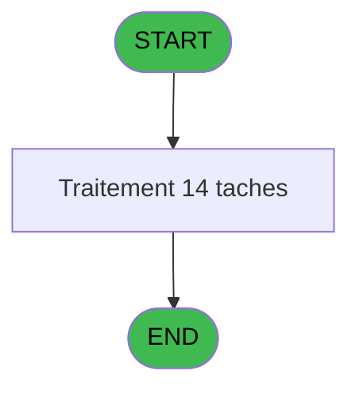
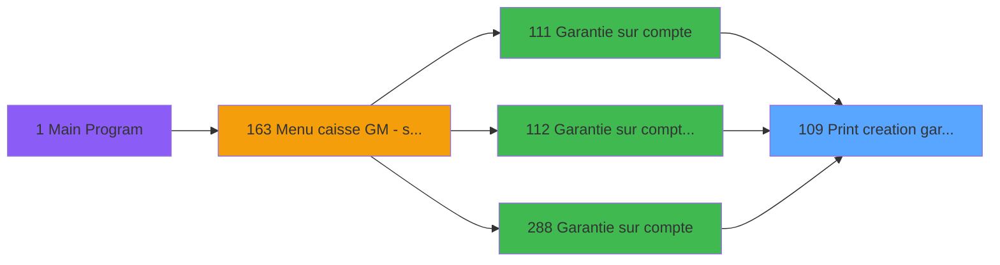
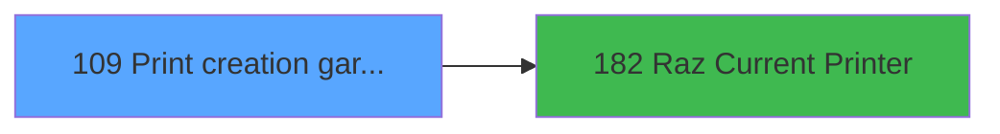

# ADH IDE 109 - Print creation garantie TIK V1

> **Analyse**: Phases 1-4 2026-02-07 03:48 -> 03:49 (27s) | Assemblage 07:02
> **Pipeline**: V7.2 Enrichi
> **Structure**: 4 onglets (Resume | Ecrans | Donnees | Connexions)

<!-- TAB:Resume -->

## 1. FICHE D'IDENTITE

| Attribut | Valeur |
|----------|--------|
| Projet | ADH |
| IDE Position | 109 |
| Nom Programme | Print creation garantie TIK V1 |
| Fichier source | `Prg_109.xml` |
| Dossier IDE | Garantie |
| Taches | 14 (1 ecrans visibles) |
| Tables modifiees | 0 |
| Programmes appeles | 1 |

## 2. DESCRIPTION FONCTIONNELLE

**Print creation garantie TIK V1** assure la gestion complete de ce processus, accessible depuis [Garantie sur compte (IDE 111)](ADH-IDE-111.md), [Garantie sur compte PMS-584 (IDE 112)](ADH-IDE-112.md), [Garantie sur compte (IDE 288)](ADH-IDE-288.md).

Le flux de traitement s'organise en **2 blocs fonctionnels** :

- **Impression** (11 taches) : generation de tickets et documents
- **Traitement** (3 taches) : traitements metier divers

Detail : phases du traitement

#### Phase 1 : Impression (11 taches)

- **T1** - Print creation garantie TIK V1
- **T2** - Printer 1
- **T3** - edition extrait compte
- **T4** - edition extrait compte
- **T5** - Printer 4
- **T6** - edition extrait compte
- **T7** - edition extrait compte
- **T11** - Printer 8
- **T12** - edition extrait compte
- **T13** - Printer 9
- **T14** - edition extrait compte

Delegue a : [Raz Current Printer (IDE 182)](ADH-IDE-182.md)

#### Phase 2 : Traitement (3 taches)

- **T8** - Iteration **[ECRAN]**
- **T9** - Veuillez patienter... **[ECRAN]**
- **T10** - recup nom adherent

## 3. BLOCS FONCTIONNELS

### 3.1 Impression (11 taches)

Generation des documents et tickets.

---

#### T1 - Print creation garantie TIK V1

**Role** : Tache d'orchestration : point d'entree du programme (11 sous-taches). Coordonne l'enchainement des traitements.

10 sous-taches directes

| Tache | Nom | Bloc |
|-------|-----|------|
| [T2](#t2) | Printer 1 | Impression |
| [T3](#t3) | edition extrait compte | Impression |
| [T4](#t4) | edition extrait compte | Impression |
| [T5](#t5) | Printer 4 | Impression |
| [T6](#t6) | edition extrait compte | Impression |
| [T7](#t7) | edition extrait compte | Impression |
| [T11](#t11) | Printer 8 | Impression |
| [T12](#t12) | edition extrait compte | Impression |
| [T13](#t13) | Printer 9 | Impression |
| [T14](#t14) | edition extrait compte | Impression |

---

#### T2 - Printer 1

**Role** : Generation du document : Printer 1.

---

#### T3 - edition extrait compte

**Role** : Generation du document : edition extrait compte.

---

#### T4 - edition extrait compte

**Role** : Generation du document : edition extrait compte.

---

#### T5 - Printer 4

**Role** : Generation du document : Printer 4.

---

#### T6 - edition extrait compte

**Role** : Generation du document : edition extrait compte.

---

#### T7 - edition extrait compte

**Role** : Generation du document : edition extrait compte.

---

#### T11 - Printer 8

**Role** : Generation du document : Printer 8.

---

#### T12 - edition extrait compte

**Role** : Generation du document : edition extrait compte.

---

#### T13 - Printer 9

**Role** : Generation du document : Printer 9.

---

#### T14 - edition extrait compte

**Role** : Generation du document : edition extrait compte.

### 3.2 Traitement (3 taches)

Traitements internes.

---

#### T8 - Iteration [ECRAN]

**Role** : Traitement : Iteration.
**Ecran** : 422 x 56 DLU (MDI) | [Voir mockup](#ecran-t8)

---

#### T9 - Veuillez patienter... [ECRAN]

**Role** : Traitement : Veuillez patienter....
**Ecran** : 422 x 56 DLU (MDI) | [Voir mockup](#ecran-t9)

---

#### T10 - recup nom adherent

**Role** : Consultation/chargement : recup nom adherent.
**Variables liees** : B (P0 code adherent), H (W0 n° adherent)

## 5. REGLES METIER

*(Aucune regle metier identifiee)*

## 6. CONTEXTE

- **Appele par**: [Garantie sur compte (IDE 111)](ADH-IDE-111.md), [Garantie sur compte PMS-584 (IDE 112)](ADH-IDE-112.md), [Garantie sur compte (IDE 288)](ADH-IDE-288.md)
- **Appelle**: 1 programmes | **Tables**: 7 (W:0 R:3 L:4) | **Taches**: 14 | **Expressions**: 12

<!-- TAB:Ecrans -->

## 8. ECRANS

### 8.1 Forms visibles (1 / 14)

| # | Position | Tache | Nom | Type | Largeur | Hauteur | Bloc |
|---|----------|-------|-----|------|---------|---------|------|
| 1 | 109.3.1 | T9 | Veuillez patienter... | MDI | 422 | 56 | Traitement |

### 8.2 Mockups Ecrans

---

#### 109.3.1 - Veuillez patienter...
**Tache** : [T9](#t9) | **Type** : MDI | **Dimensions** : 422 x 56 DLU
**Bloc** : Traitement | **Titre IDE** : Veuillez patienter...

<!-- FORM-DATA:
{
    "width":  422,
    "vFactor":  8,
    "type":  "MDI",
    "hFactor":  8,
    "controls":  [
                     {
                         "x":  0,
                         "type":  "label",
                         "var":  "",
                         "y":  0,
                         "w":  423,
                         "fmt":  "",
                         "name":  "",
                         "h":  29,
                         "color":  "",
                         "text":  "",
                         "parent":  null
                     },
                     {
                         "x":  120,
                         "type":  "label",
                         "var":  "",
                         "y":  10,
                         "w":  221,
                         "fmt":  "",
                         "name":  "",
                         "h":  8,
                         "color":  "7",
                         "text":  "Impression en cours ...",
                         "parent":  null
                     },
                     {
                         "x":  0,
                         "type":  "label",
                         "var":  "",
                         "y":  29,
                         "w":  423,
                         "fmt":  "",
                         "name":  "",
                         "h":  27,
                         "color":  "",
                         "text":  "",
                         "parent":  null
                     },
                     {
                         "x":  50,
                         "type":  "label",
                         "var":  "",
                         "y":  38,
                         "w":  323,
                         "fmt":  "",
                         "name":  "",
                         "h":  8,
                         "color":  "",
                         "text":  "Edition de la creation de garantie",
                         "parent":  null
                     },
                     {
                         "x":  4,
                         "type":  "image",
                         "var":  "",
                         "y":  2,
                         "w":  72,
                         "fmt":  "",
                         "name":  "",
                         "h":  25,
                         "color":  "",
                         "text":  "",
                         "parent":  null
                     }
                 ],
    "taskId":  "109.3.1",
    "height":  56
}
-->

## 9. NAVIGATION

Ecran unique: **Veuillez patienter...**

### 9.3 Structure hierarchique (14 taches)

| Position | Tache | Type | Dimensions | Bloc |
|----------|-------|------|------------|------|
| **109.1** | [**Print creation garantie TIK V1** (T1)](#t1) | MDI | - | Impression |
| 109.1.1 | [Printer 1 (T2)](#t2) | MDI | - | |
| 109.1.2 | [edition extrait compte (T3)](#t3) | MDI | - | |
| 109.1.3 | [edition extrait compte (T4)](#t4) | MDI | - | |
| 109.1.4 | [Printer 4 (T5)](#t5) | MDI | - | |
| 109.1.5 | [edition extrait compte (T6)](#t6) | MDI | - | |
| 109.1.6 | [edition extrait compte (T7)](#t7) | MDI | - | |
| 109.1.7 | [Printer 8 (T11)](#t11) | MDI | - | |
| 109.1.8 | [edition extrait compte (T12)](#t12) | MDI | - | |
| 109.1.9 | [Printer 9 (T13)](#t13) | MDI | - | |
| 109.1.10 | [edition extrait compte (T14)](#t14) | MDI | - | |
| **109.2** | [**Iteration** (T8)](#t8) [mockup](#ecran-t8) | MDI | 422x56 | Traitement |
| 109.2.1 | [Veuillez patienter... (T9)](#t9) [mockup](#ecran-t9) | MDI | 422x56 | |
| 109.2.2 | [recup nom adherent (T10)](#t10) | MDI | - | |

### 9.4 Algorigramme

> *algo-data indisponible. Utiliser `/algorigramme` pour generer.*

<!-- TAB:Donnees -->

## 10. TABLES

### Tables utilisees (7)

| ID | Nom | Description | Type | R | W | L | Usages |
|----|-----|-------------|------|---|---|---|--------|
| 30 | gm-recherche_____gmr | Index de recherche | DB | R |   |   | 1 |
| 31 | gm-complet_______gmc |  | DB |   |   | L | 1 |
| 34 | hebergement______heb | Hebergement (chambres) | DB |   |   | L | 1 |
| 39 | depot_garantie___dga | Depots et garanties | DB | R |   |   | 7 |
| 91 | garantie_________gar | Depots et garanties | DB |   |   | L | 7 |
| 368 | pms_village |  | DB | R |   |   | 1 |
| 818 | Circuit supprime |  | DB |   |   | L | 1 |

### Colonnes par table (2 / 3 tables avec colonnes identifiees)

Table 30 - gm-recherche_____gmr (R) - 1 usages

*Table utilisee uniquement en Link ou aucune colonne Real identifiee dans le DataView.*

Table 39 - depot_garantie___dga (R) - 7 usages

| Lettre | Variable | Acces | Type |
|--------|----------|-------|------|
| A | W1 config imp | R | Alpha |
| B | W1 large | R | Alpha |
| C | W1 normal | R | Alpha |
| D | W1 condense | R | Alpha |
| E | W1 detecteur papier | R | Alpha |
| F | W1 inhibe panel | R | Alpha |
| G | W1 massicot | R | Alpha |
| H | W1 selection feuille | R | Alpha |
| I | W1 selection rouleau | R | Alpha |

Table 368 - pms_village (R) - 1 usages

| Lettre | Variable | Acces | Type |
|--------|----------|-------|------|
| A | P0 societe | R | Alpha |
| B | P0 code adherent | R | Numeric |
| C | P0 filiation | R | Numeric |
| D | P0 nom village | R | Alpha |
| E | P0 masque montant | R | Alpha |
| F | W0 nom | R | Alpha |
| G | W0 prenom | R | Alpha |
| H | W0 n° adherent | R | Numeric |
| I | W0 lettre contrôle | R | Alpha |
| J | W0 filiation | R | Numeric |
| K | W0 Chambre | R | Alpha |
| L | W0 date de debut | R | Date |
| M | W0 date de fin | R | Date |
| N | v.comment | R | Alpha |

## 11. VARIABLES

### 11.1 Parametres entrants (5)

Variables recues du programme appelant ([Garantie sur compte (IDE 111)](ADH-IDE-111.md)).

| Lettre | Nom | Type | Usage dans |
|--------|-----|------|-----------|
| A | P0 societe | Alpha | - |
| B | P0 code adherent | Numeric | - |
| C | P0 filiation | Numeric | - |
| D | P0 nom village | Alpha | - |
| E | P0 masque montant | Alpha | - |

### 11.2 Variables de session (1)

Variables persistantes pendant toute la session.

| Lettre | Nom | Type | Usage dans |
|--------|-----|------|-----------|
| N | v.comment | Alpha | - |

### 11.3 Variables de travail (8)

Variables internes au programme.

| Lettre | Nom | Type | Usage dans |
|--------|-----|------|-----------|
| F | W0 nom | Alpha | - |
| G | W0 prenom | Alpha | - |
| H | W0 n° adherent | Numeric | - |
| I | W0 lettre contrôle | Alpha | - |
| J | W0 filiation | Numeric | - |
| K | W0 Chambre | Alpha | - |
| L | W0 date de debut | Date | - |
| M | W0 date de fin | Date | - |

## 12. EXPRESSIONS

**12 / 12 expressions decodees (100%)**

### 12.1 Repartition par type

| Type | Expressions | Regles |
|------|-------------|--------|
| CONSTANTE | 2 | 0 |
| OTHER | 3 | 0 |
| CONDITION | 5 | 0 |
| CAST_LOGIQUE | 1 | 0 |
| CONCATENATION | 1 | 0 |

### 12.2 Expressions cles par type

#### CONSTANTE (2 expressions)

| Type | IDE | Expression | Regle |
|------|-----|------------|-------|
| CONSTANTE | 11 | `'GL2'` | - |
| CONSTANTE | 10 | `'GL1'` | - |

#### OTHER (3 expressions)

| Type | IDE | Expression | Regle |
|------|-----|------------|-------|
| OTHER | 4 | `SetCrsr (1)` | - |
| OTHER | 2 | `GetParam ('CURRENTLISTINGNUM')` | - |
| OTHER | 1 | `SetCrsr (2)` | - |

#### CONDITION (5 expressions)

| Type | IDE | Expression | Regle |
|------|-----|------------|-------|
| CONDITION | 8 | `GetParam ('CURRENTPRINTERNUM')=8` | - |
| CONDITION | 9 | `GetParam ('CURRENTPRINTERNUM')=9` | - |
| CONDITION | 7 | `GetParam ('CURRENTPRINTERNUM')=5` | - |
| CONDITION | 5 | `GetParam ('CURRENTPRINTERNUM')=1` | - |
| CONDITION | 6 | `GetParam ('CURRENTPRINTERNUM')=4` | - |

#### CAST_LOGIQUE (1 expressions)

| Type | IDE | Expression | Regle |
|------|-----|------------|-------|
| CAST_LOGIQUE | 12 | `'TRUE'LOG` | - |

#### CONCATENATION (1 expressions)

| Type | IDE | Expression | Regle |
|------|-----|------------|-------|
| CONCATENATION | 3 | `Trim ([O])&' '&Trim ([P])&' '&Trim ([Q])` | - |

<!-- TAB:Connexions -->

## 13. GRAPHE D'APPELS

### 13.1 Chaine depuis Main (Callers)

Main -> ... -> [Garantie sur compte (IDE 111)](ADH-IDE-111.md) -> **Print creation garantie TIK V1 (IDE 109)**

Main -> ... -> [Garantie sur compte PMS-584 (IDE 112)](ADH-IDE-112.md) -> **Print creation garantie TIK V1 (IDE 109)**

Main -> ... -> [Garantie sur compte (IDE 288)](ADH-IDE-288.md) -> **Print creation garantie TIK V1 (IDE 109)**

### 13.2 Callers

| IDE | Nom Programme | Nb Appels |
|-----|---------------|-----------|
| [111](ADH-IDE-111.md) | Garantie sur compte | 2 |
| [112](ADH-IDE-112.md) | Garantie sur compte PMS-584 | 2 |
| [288](ADH-IDE-288.md) | Garantie sur compte | 2 |

### 13.3 Callees (programmes appeles)

### 13.4 Detail Callees avec contexte

| IDE | Nom Programme | Appels | Contexte |
|-----|---------------|--------|----------|
| [182](ADH-IDE-182.md) | Raz Current Printer | 1 | Impression ticket/document |

## 14. RECOMMANDATIONS MIGRATION

### 14.1 Profil du programme

| Metrique | Valeur | Impact migration |
|----------|--------|-----------------|
| Lignes de logique | 281 | Taille moyenne |
| Expressions | 12 | Peu de logique |
| Tables WRITE | 0 | Impact faible |
| Sous-programmes | 1 | Peu de dependances |
| Ecrans visibles | 1 | Ecran unique ou traitement batch |
| Code desactive | 0% (0 / 281) | Code sain |
| Regles metier | 0 | Pas de regle identifiee |

### 14.2 Plan de migration par bloc

#### Impression (11 taches: 0 ecran, 11 traitements)

- **Strategie** : Templates HTML -> PDF via wkhtmltopdf ou Puppeteer.
- `PrintService` injectable avec choix imprimante

#### Traitement (3 taches: 2 ecrans, 1 traitement)

- **Strategie** : Orchestrateur avec 2 ecrans (Razor/React) et 1 traitements backend (services).
- Les ecrans deviennent des composants UI, les traitements invisibles deviennent des services injectables.
- 1 sous-programme(s) a migrer ou a reutiliser depuis les services existants.
- Decomposer les taches en services unitaires testables.

### 14.3 Dependances critiques

| Dependance | Type | Appels | Impact |
|------------|------|--------|--------|
| [Raz Current Printer (IDE 182)](ADH-IDE-182.md) | Sous-programme | 1x | Normale - Impression ticket/document |

---
*Spec DETAILED generee par Pipeline V7.2 - 2026-02-07 07:02*
