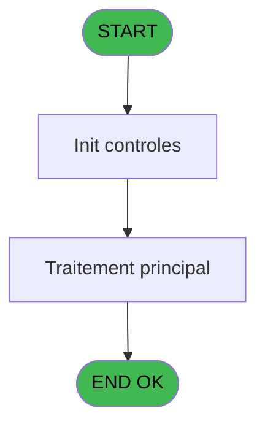
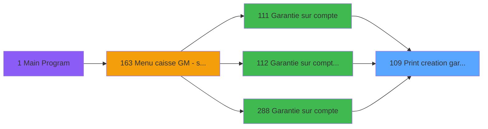

# ADH IDE 109 - Print creation garantie TIK V1

> **Analyse**: Phases 1-4 2026-02-07 03:49 -> 02:51 (23h01min) | Assemblage 02:51
> **Pipeline**: V7.2 Enrichi
> **Structure**: 4 onglets (Resume | Ecrans | Donnees | Connexions)

<!-- TAB:Resume -->

## 1. FICHE D'IDENTITE

| Attribut | Valeur |
|----------|--------|
| Projet | ADH |
| IDE Position | 109 |
| Nom Programme | Print creation garantie TIK V1 |
| Fichier source | `Prg_109.xml` |
| Dossier IDE | Garanties |
| Taches | 14 (1 ecrans visibles) |
| Tables modifiees | 0 |
| Programmes appeles | 1 |
| Complexite | **BASSE** (score 12/100) |

## 2. DESCRIPTION FONCTIONNELLE

**ADH IDE 109** gère l'impression des documents de création de garantie (dépôt de caution). Le programme orchestre un flux d'impression multi-imprimante : il initialise d'abord l'imprimante cible via RAZ Current Printer (IDE 182), puis enchaîne les éditions d'extrait de compte sur différentes imprimantes (imprimantes 1 et 4 mentionnées dans les tâches).

La logique suit un pattern classique de gestion caisse : préparation de la ressource (RAZ imprimante), suivi de l'envoi des données vers les périphériques d'impression. Les trois appels entrants (IDE 111, 112, 288) indiquent que ce programme est appelé depuis plusieurs points du module Garantie, probablement lors de la validation ou confirmation d'un dépôt.

L'architecture utilise des tâches d'édition paramétrées (répétition de "edition extrait compte") suggérant que le même modèle d'impression est appliqué à plusieurs périphériques ou dans plusieurs contextes (par exemple, impression caisse ET impression client, ou impression locale ET transmission réseau).

## 3. BLOCS FONCTIONNELS

### 3.1 Impression (11 taches)

Generation des documents et tickets.

---

#### 109 - Print creation garantie TIK V1

**Role** : Tache d'orchestration : point d'entree du programme (11 sous-taches). Coordonne l'enchainement des traitements.

10 sous-taches directes

| Tache | Nom | Bloc |
|-------|-----|------|
| [109.1](#t2) | Printer 1 | Impression |
| [109.1.1](#t3) | edition extrait compte | Impression |
| [109.1.2](#t4) | edition extrait compte | Impression |
| [109.2](#t5) | Printer 4 | Impression |
| [109.2.1](#t6) | edition extrait compte | Impression |
| [109.2.2](#t7) | edition extrait compte | Impression |
| [109.5](#t11) | Printer 8 | Impression |
| [109.5.1](#t12) | edition extrait compte | Impression |
| [109.6](#t13) | Printer 9 | Impression |
| [109.6.1](#t14) | edition extrait compte | Impression |

---

#### 109.1 - Printer 1

**Role** : Generation du document : Printer 1.

---

#### 109.1.1 - edition extrait compte

**Role** : Generation du document : edition extrait compte.

---

#### 109.1.2 - edition extrait compte

**Role** : Generation du document : edition extrait compte.

---

#### 109.2 - Printer 4

**Role** : Generation du document : Printer 4.

---

#### 109.2.1 - edition extrait compte

**Role** : Generation du document : edition extrait compte.

---

#### 109.2.2 - edition extrait compte

**Role** : Generation du document : edition extrait compte.

---

#### 109.5 - Printer 8

**Role** : Generation du document : Printer 8.

---

#### 109.5.1 - edition extrait compte

**Role** : Generation du document : edition extrait compte.

---

#### 109.6 - Printer 9

**Role** : Generation du document : Printer 9.

---

#### 109.6.1 - edition extrait compte

**Role** : Generation du document : edition extrait compte.

### 3.2 Traitement (3 taches)

Traitements internes.

---

#### 109.3 - Iteration [[ECRAN]](#ecran-t8)

**Role** : Traitement : Iteration.
**Ecran** : 422 x 56 DLU (MDI) | [Voir mockup](#ecran-t8)

---

#### 109.3.1 - Veuillez patienter... [[ECRAN]](#ecran-t9)

**Role** : Traitement : Veuillez patienter....
**Ecran** : 422 x 56 DLU (MDI) | [Voir mockup](#ecran-t9)

---

#### 109.4 - recup nom adherent

**Role** : Consultation/chargement : recup nom adherent.
**Variables liees** : EO (P0 code adherent), EU (W0 n° adherent)

## 5. REGLES METIER

5 regles identifiees:

### Impression (5 regles)

#### [RM-001] Verification que l'imprimante courante est la n1

| Element | Detail |
|---------|--------|
| **Condition** | `GetParam ('CURRENTPRINTERNUM')=1` |
| **Si vrai** | Action si CURRENTPRINTERNUM = 1 |
| **Expression source** | Expression 5 : `GetParam ('CURRENTPRINTERNUM')=1` |
| **Exemple** | Si GetParam ('CURRENTPRINTERNUM')=1 → Action si CURRENTPRINTERNUM = 1 |
| **Impact** | [109 - Print creation garantie TIK V1](#t1) |

#### [RM-002] Verification que l'imprimante courante est la n4

| Element | Detail |
|---------|--------|
| **Condition** | `GetParam ('CURRENTPRINTERNUM')=4` |
| **Si vrai** | Action si CURRENTPRINTERNUM = 4 |
| **Expression source** | Expression 6 : `GetParam ('CURRENTPRINTERNUM')=4` |
| **Exemple** | Si GetParam ('CURRENTPRINTERNUM')=4 → Action si CURRENTPRINTERNUM = 4 |
| **Impact** | [109 - Print creation garantie TIK V1](#t1) |

#### [RM-003] Verification que l'imprimante courante est la n5

| Element | Detail |
|---------|--------|
| **Condition** | `GetParam ('CURRENTPRINTERNUM')=5` |
| **Si vrai** | Action si CURRENTPRINTERNUM = 5 |
| **Expression source** | Expression 7 : `GetParam ('CURRENTPRINTERNUM')=5` |
| **Exemple** | Si GetParam ('CURRENTPRINTERNUM')=5 → Action si CURRENTPRINTERNUM = 5 |
| **Impact** | [109 - Print creation garantie TIK V1](#t1) |

#### [RM-004] Verification que l'imprimante courante est la n8

| Element | Detail |
|---------|--------|
| **Condition** | `GetParam ('CURRENTPRINTERNUM')=8` |
| **Si vrai** | Action si CURRENTPRINTERNUM = 8 |
| **Expression source** | Expression 8 : `GetParam ('CURRENTPRINTERNUM')=8` |
| **Exemple** | Si GetParam ('CURRENTPRINTERNUM')=8 → Action si CURRENTPRINTERNUM = 8 |
| **Impact** | [109 - Print creation garantie TIK V1](#t1) |

#### [RM-005] Verification que l'imprimante courante est la n9

| Element | Detail |
|---------|--------|
| **Condition** | `GetParam ('CURRENTPRINTERNUM')=9` |
| **Si vrai** | Action si CURRENTPRINTERNUM = 9 |
| **Expression source** | Expression 9 : `GetParam ('CURRENTPRINTERNUM')=9` |
| **Exemple** | Si GetParam ('CURRENTPRINTERNUM')=9 → Action si CURRENTPRINTERNUM = 9 |
| **Impact** | [109 - Print creation garantie TIK V1](#t1) |

## 6. CONTEXTE

- **Appele par**: [Garantie sur compte (IDE 111)](ADH-IDE-111.md), [Garantie sur compte PMS-584 (IDE 112)](ADH-IDE-112.md), [Garantie sur compte (IDE 288)](ADH-IDE-288.md)
- **Appelle**: 1 programmes | **Tables**: 7 (W:0 R:3 L:4) | **Taches**: 14 | **Expressions**: 12

<!-- TAB:Ecrans -->

## 8. ECRANS

### 8.1 Forms visibles (1 / 14)

| # | Position | Tache | Nom | Type | Largeur | Hauteur | Bloc |
|---|----------|-------|-----|------|---------|---------|------|
| 1 | 109.3.1 | 109.3.1 | Veuillez patienter... | MDI | 422 | 56 | Traitement |

### 8.2 Mockups Ecrans

---

#### 109.3.1 - Veuillez patienter...
**Tache** : [109.3.1](#t9) | **Type** : MDI | **Dimensions** : 422 x 56 DLU
**Bloc** : Traitement | **Titre IDE** : Veuillez patienter...

<!-- FORM-DATA:
{
    "width":  422,
    "vFactor":  8,
    "type":  "MDI",
    "hFactor":  8,
    "controls":  [
                     {
                         "x":  0,
                         "type":  "label",
                         "var":  "",
                         "y":  0,
                         "w":  423,
                         "fmt":  "",
                         "name":  "",
                         "h":  29,
                         "color":  "",
                         "text":  "",
                         "parent":  null
                     },
                     {
                         "x":  120,
                         "type":  "label",
                         "var":  "",
                         "y":  10,
                         "w":  221,
                         "fmt":  "",
                         "name":  "",
                         "h":  8,
                         "color":  "7",
                         "text":  "Impression en cours ...",
                         "parent":  null
                     },
                     {
                         "x":  0,
                         "type":  "label",
                         "var":  "",
                         "y":  29,
                         "w":  423,
                         "fmt":  "",
                         "name":  "",
                         "h":  27,
                         "color":  "",
                         "text":  "",
                         "parent":  null
                     },
                     {
                         "x":  50,
                         "type":  "label",
                         "var":  "",
                         "y":  38,
                         "w":  323,
                         "fmt":  "",
                         "name":  "",
                         "h":  8,
                         "color":  "",
                         "text":  "Edition de la creation de garantie",
                         "parent":  null
                     },
                     {
                         "x":  4,
                         "type":  "image",
                         "var":  "",
                         "y":  2,
                         "w":  72,
                         "fmt":  "",
                         "name":  "",
                         "h":  25,
                         "color":  "",
                         "text":  "",
                         "parent":  null
                     }
                 ],
    "taskId":  "109.3.1",
    "height":  56
}
-->

## 9. NAVIGATION

Ecran unique: **Veuillez patienter...**

### 9.3 Structure hierarchique (14 taches)

| Position | Tache | Type | Dimensions | Bloc |
|----------|-------|------|------------|------|
| **109.1** | [**Print creation garantie TIK V1** (109)](#t1) | MDI | - | Impression |
| 109.1.1 | [Printer 1 (109.1)](#t2) | MDI | - | |
| 109.1.2 | [edition extrait compte (109.1.1)](#t3) | MDI | - | |
| 109.1.3 | [edition extrait compte (109.1.2)](#t4) | MDI | - | |
| 109.1.4 | [Printer 4 (109.2)](#t5) | MDI | - | |
| 109.1.5 | [edition extrait compte (109.2.1)](#t6) | MDI | - | |
| 109.1.6 | [edition extrait compte (109.2.2)](#t7) | MDI | - | |
| 109.1.7 | [Printer 8 (109.5)](#t11) | MDI | - | |
| 109.1.8 | [edition extrait compte (109.5.1)](#t12) | MDI | - | |
| 109.1.9 | [Printer 9 (109.6)](#t13) | MDI | - | |
| 109.1.10 | [edition extrait compte (109.6.1)](#t14) | MDI | - | |
| **109.2** | [**Iteration** (109.3)](#t8) [mockup](#ecran-t8) | MDI | 422x56 | Traitement |
| 109.2.1 | [Veuillez patienter... (109.3.1)](#t9) [mockup](#ecran-t9) | MDI | 422x56 | |
| 109.2.2 | [recup nom adherent (109.4)](#t10) | MDI | - | |

### 9.4 Algorigramme

> **Legende**: Vert = START/END OK | Rouge = END KO | Bleu = Decisions
> *Algorigramme auto-genere. Utiliser `/algorigramme` pour une synthese metier detaillee.*

<!-- TAB:Donnees -->

## 10. TABLES

### Tables utilisees (7)

| ID | Nom | Description | Type | R | W | L | Usages |
|----|-----|-------------|------|---|---|---|--------|
| 39 | depot_garantie___dga | Depots et garanties | DB | R |   |   | 7 |
| 30 | gm-recherche_____gmr | Index de recherche | DB | R |   |   | 1 |
| 368 | pms_village |  | DB | R |   |   | 1 |
| 91 | garantie_________gar | Depots et garanties | DB |   |   | L | 7 |
| 31 | gm-complet_______gmc |  | DB |   |   | L | 1 |
| 818 | Circuit supprime |  | DB |   |   | L | 1 |
| 34 | hebergement______heb | Hebergement (chambres) | DB |   |   | L | 1 |

### Colonnes par table (2 / 3 tables avec colonnes identifiees)

Table 39 - depot_garantie___dga (R) - 7 usages

| Lettre | Variable | Acces | Type |
|--------|----------|-------|------|
| A | W1 config imp | R | Alpha |
| B | W1 large | R | Alpha |
| C | W1 normal | R | Alpha |
| D | W1 condense | R | Alpha |
| E | W1 detecteur papier | R | Alpha |
| F | W1 inhibe panel | R | Alpha |
| G | W1 massicot | R | Alpha |
| H | W1 selection feuille | R | Alpha |
| I | W1 selection rouleau | R | Alpha |

Table 30 - gm-recherche_____gmr (R) - 1 usages

*Table utilisee uniquement en Link ou aucune colonne Real identifiee dans le DataView.*

Table 368 - pms_village (R) - 1 usages

| Lettre | Variable | Acces | Type |
|--------|----------|-------|------|
| A | P0 societe | R | Alpha |
| B | P0 code adherent | R | Numeric |
| C | P0 filiation | R | Numeric |
| D | P0 nom village | R | Alpha |
| E | P0 masque montant | R | Alpha |
| F | W0 nom | R | Alpha |
| G | W0 prenom | R | Alpha |
| H | W0 n° adherent | R | Numeric |
| I | W0 lettre contrôle | R | Alpha |
| J | W0 filiation | R | Numeric |
| K | W0 Chambre | R | Alpha |
| L | W0 date de debut | R | Date |
| M | W0 date de fin | R | Date |
| N | v.comment | R | Alpha |

## 11. VARIABLES

### 11.1 Parametres entrants (5)

Variables recues du programme appelant ([Garantie sur compte (IDE 111)](ADH-IDE-111.md)).

| Lettre | Nom | Type | Usage dans |
|--------|-----|------|-----------|
| EN | P0 societe | Alpha | - |
| EO | P0 code adherent | Numeric | - |
| EP | P0 filiation | Numeric | - |
| EQ | P0 nom village | Alpha | - |
| ER | P0 masque montant | Alpha | - |

### 11.2 Variables de session (1)

Variables persistantes pendant toute la session.

| Lettre | Nom | Type | Usage dans |
|--------|-----|------|-----------|
| FA | v.comment | Alpha | - |

### 11.3 Variables de travail (8)

Variables internes au programme.

| Lettre | Nom | Type | Usage dans |
|--------|-----|------|-----------|
| ES | W0 nom | Alpha | - |
| ET | W0 prenom | Alpha | - |
| EU | W0 n° adherent | Numeric | - |
| EV | W0 lettre contrôle | Alpha | - |
| EW | W0 filiation | Numeric | - |
| EX | W0 Chambre | Alpha | - |
| EY | W0 date de debut | Date | - |
| EZ | W0 date de fin | Date | - |

## 12. EXPRESSIONS

**12 / 12 expressions decodees (100%)**

### 12.1 Repartition par type

| Type | Expressions | Regles |
|------|-------------|--------|
| CONDITION | 5 | 5 |
| CONSTANTE | 2 | 0 |
| OTHER | 3 | 0 |
| CAST_LOGIQUE | 1 | 0 |
| CONCATENATION | 1 | 0 |

### 12.2 Expressions cles par type

#### CONDITION (5 expressions)

| Type | IDE | Expression | Regle |
|------|-----|------------|-------|
| CONDITION | 8 | `GetParam ('CURRENTPRINTERNUM')=8` | [RM-004](#rm-RM-004) |
| CONDITION | 9 | `GetParam ('CURRENTPRINTERNUM')=9` | [RM-005](#rm-RM-005) |
| CONDITION | 7 | `GetParam ('CURRENTPRINTERNUM')=5` | [RM-003](#rm-RM-003) |
| CONDITION | 5 | `GetParam ('CURRENTPRINTERNUM')=1` | [RM-001](#rm-RM-001) |
| CONDITION | 6 | `GetParam ('CURRENTPRINTERNUM')=4` | [RM-002](#rm-RM-002) |

#### CONSTANTE (2 expressions)

| Type | IDE | Expression | Regle |
|------|-----|------------|-------|
| CONSTANTE | 11 | `'GL2'` | - |
| CONSTANTE | 10 | `'GL1'` | - |

#### OTHER (3 expressions)

| Type | IDE | Expression | Regle |
|------|-----|------------|-------|
| OTHER | 4 | `SetCrsr (1)` | - |
| OTHER | 2 | `GetParam ('CURRENTLISTINGNUM')` | - |
| OTHER | 1 | `SetCrsr (2)` | - |

#### CAST_LOGIQUE (1 expressions)

| Type | IDE | Expression | Regle |
|------|-----|------------|-------|
| CAST_LOGIQUE | 12 | `'TRUE'LOG` | - |

#### CONCATENATION (1 expressions)

| Type | IDE | Expression | Regle |
|------|-----|------------|-------|
| CONCATENATION | 3 | `Trim ([O])&' '&Trim ([P])&' '&Trim ([Q])` | - |

<!-- TAB:Connexions -->

## 13. GRAPHE D'APPELS

### 13.1 Chaine depuis Main (Callers)

Main -> ... -> [Garantie sur compte (IDE 111)](ADH-IDE-111.md) -> **Print creation garantie TIK V1 (IDE 109)**

Main -> ... -> [Garantie sur compte PMS-584 (IDE 112)](ADH-IDE-112.md) -> **Print creation garantie TIK V1 (IDE 109)**

Main -> ... -> [Garantie sur compte (IDE 288)](ADH-IDE-288.md) -> **Print creation garantie TIK V1 (IDE 109)**

### 13.2 Callers

| IDE | Nom Programme | Nb Appels |
|-----|---------------|-----------|
| [111](ADH-IDE-111.md) | Garantie sur compte | 2 |
| [112](ADH-IDE-112.md) | Garantie sur compte PMS-584 | 2 |
| [288](ADH-IDE-288.md) | Garantie sur compte | 2 |

### 13.3 Callees (programmes appeles)

### 13.4 Detail Callees avec contexte

| IDE | Nom Programme | Appels | Contexte |
|-----|---------------|--------|----------|
| [182](ADH-IDE-182.md) | Raz Current Printer | 1 | Impression ticket/document |

## 14. RECOMMANDATIONS MIGRATION

### 14.1 Profil du programme

| Metrique | Valeur | Impact migration |
|----------|--------|-----------------|
| Lignes de logique | 281 | Taille moyenne |
| Expressions | 12 | Peu de logique |
| Tables WRITE | 0 | Impact faible |
| Sous-programmes | 1 | Peu de dependances |
| Ecrans visibles | 1 | Ecran unique ou traitement batch |
| Code desactive | 0% (0 / 281) | Code sain |
| Regles metier | 5 | Quelques regles a preserver |

### 14.2 Plan de migration par bloc

#### Impression (11 taches: 0 ecran, 11 traitements)

- **Strategie** : Templates HTML -> PDF via wkhtmltopdf ou Puppeteer.
- `PrintService` injectable avec choix imprimante

#### Traitement (3 taches: 2 ecrans, 1 traitement)

- **Strategie** : Orchestrateur avec 2 ecrans (Razor/React) et 1 traitements backend (services).
- Les ecrans deviennent des composants UI, les traitements invisibles deviennent des services injectables.
- 1 sous-programme(s) a migrer ou a reutiliser depuis les services existants.
- Decomposer les taches en services unitaires testables.

### 14.3 Dependances critiques

| Dependance | Type | Appels | Impact |
|------------|------|--------|--------|
| [Raz Current Printer (IDE 182)](ADH-IDE-182.md) | Sous-programme | 1x | Normale - Impression ticket/document |

---
*Spec DETAILED generee par Pipeline V7.2 - 2026-02-08 02:51*
