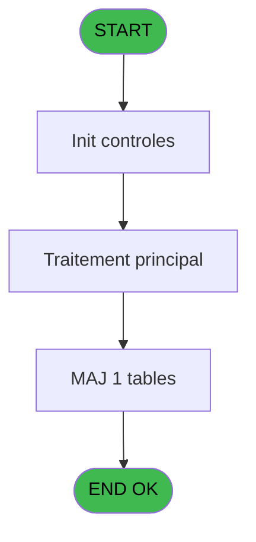

# ADH IDE 11 - Export - address

> **Analyse**: Phases 1-4 2026-02-07 03:38 -> 03:39 (28s) | Assemblage 12:50
> **Pipeline**: V7.2 Enrichi
> **Structure**: 4 onglets (Resume | Ecrans | Donnees | Connexions)

<!-- TAB:Resume -->

## 1. FICHE D'IDENTITE

| Attribut | Valeur |
|----------|--------|
| Projet | ADH |
| IDE Position | 11 |
| Nom Programme | Export - address |
| Fichier source | `Prg_11.xml` |
| Dossier IDE | General |
| Taches | 1 (1 ecrans visibles) |
| Tables modifiees | 1 |
| Programmes appeles | 0 |
| Complexite | **BASSE** (score 7/100) |

## 2. DESCRIPTION FONCTIONNELLE

ADH IDE 11 est un **programme de capture et export d'adresses** utilisé lors du processus de validation de commande (shift F9). Appelé depuis IDE 10 (Print list Checkout), il écrit les données d'adresse dans la table `address_data_catching` avec un statut d'acceptation email tri-niveau. Le programme applique une règle métier simple : si une variable [AY] n'est pas vide, le statut est '0' (accepté), sinon il vérifie [BD]=0 pour '1' (en attente) ou '2' (rejeté).

Le programme est structuré en une seule tâche (Tache 11.1) composée de 68 lignes de logique 100% active, sans code mort. Il utilise un formulaire minimaliste avec un seul champ EDIT pour l'acceptation email, et référence deux tables liées (`gm-complet_______gmc` et `client_gm`) pour le contexte. Aucune sous-tâche, aucun branchement conditionnel : la logique est linéaire et déterministe, parfaitement isolée en tant que programme terminal.

Le programme génère un fichier export nommé **KIOemail.TXT** (chemin dynamique depuis configuration INI), persistent la capture d'adresse avec le statut email calculé. Il représente une pièce simple mais critique du workflow Data Catching, serveur de persistance pour les validations de checkout sans dépendances aval.

## 3. BLOCS FONCTIONNELS

### 3.1 Traitement (1 tache)

Traitements internes.

---

#### 11 - Export - address [[ECRAN]](#ecran-t1)

**Role** : Traitement : Export - address.
**Ecran** : 364 x 46 DLU (MDI) | [Voir mockup](#ecran-t1)

## 5. REGLES METIER

1 regles identifiees:

### Autres (1 regles)

#### [RM-001] Traitement conditionnel si [AY]<>'','0',IF ([BD] est a zero

| Element | Detail |
|---------|--------|
| **Condition** | `[AY]<>''` |
| **Si vrai** | '0' |
| **Si faux** | IF ([BD]=0,'1','2')) |
| **Expression source** | Expression 10 : `IF ([AY]<>'','0',IF ([BD]=0,'1','2'))` |
| **Exemple** | Si [AY]<>'' → '0'. Sinon → IF ([BD]=0,'1','2')) |

## 6. CONTEXTE

- **Appele par**: [Print list Checkout (shift F9) (IDE 10)](ADH-IDE-10.md)
- **Appelle**: 0 programmes | **Tables**: 3 (W:1 R:0 L:2) | **Taches**: 1 | **Expressions**: 11

<!-- TAB:Ecrans -->

## 8. ECRANS

### 8.1 Forms visibles (1 / 1)

| # | Position | Tache | Nom | Type | Largeur | Hauteur | Bloc |
|---|----------|-------|-----|------|---------|---------|------|
| 1 | 11 | 11 | Export - address | MDI | 364 | 46 | Traitement |

### 8.2 Mockups Ecrans

---

#### 11 - Export - address
**Tache** : [11](#t1) | **Type** : MDI | **Dimensions** : 364 x 46 DLU
**Bloc** : Traitement | **Titre IDE** : Export - address

<!-- FORM-DATA:
{
    "width":  364,
    "vFactor":  8,
    "type":  "MDI",
    "hFactor":  4,
    "controls":  [
                     {
                         "x":  22,
                         "type":  "edit",
                         "var":  "",
                         "y":  18,
                         "w":  320,
                         "fmt":  "60",
                         "name":  "",
                         "h":  11,
                         "color":  "6",
                         "text":  "",
                         "parent":  null
                     }
                 ],
    "taskId":  "11",
    "height":  46
}
-->

<strong>Champs : 1 champs</strong>

| Pos (x,y) | Nom | Variable | Type |
|-----------|-----|----------|------|
| 22,18 | 60 | - | edit |

## 9. NAVIGATION

Ecran unique: **Export - address**

### 9.3 Structure hierarchique (1 tache)

| Position | Tache | Type | Dimensions | Bloc |
|----------|-------|------|------------|------|
| **11.1** | [**Export - address** (11)](#t1) [mockup](#ecran-t1) | MDI | 364x46 | Traitement |

### 9.4 Algorigramme

> **Legende**: Vert = START/END OK | Rouge = END KO | Bleu = Decisions
> *Algorigramme auto-genere. Utiliser `/algorigramme` pour une synthese metier detaillee.*

<!-- TAB:Donnees -->

## 10. TABLES

### Tables utilisees (3)

| ID | Nom | Description | Type | R | W | L | Usages |
|----|-----|-------------|------|---|---|---|--------|
| 22 | address_data_catching |  | DB |   | **W** |   | 1 |
| 36 | client_gm |  | DB |   |   | L | 1 |
| 31 | gm-complet_______gmc |  | DB |   |   | L | 1 |

### Colonnes par table (0 / 1 tables avec colonnes identifiees)

Table 22 - address_data_catching (**W**) - 1 usages

*Table utilisee uniquement en Link ou aucune colonne Real identifiee dans le DataView.*

## 11. VARIABLES

*(Programme sans variables locales mappees)*

## 12. EXPRESSIONS

**11 / 11 expressions decodees (100%)**

### 12.1 Repartition par type

| Type | Expressions | Regles |
|------|-------------|--------|
| CONDITION | 1 | 5 |
| OTHER | 6 | 0 |
| CAST_LOGIQUE | 4 | 0 |

### 12.2 Expressions cles par type

#### CONDITION (1 expressions)

| Type | IDE | Expression | Regle |
|------|-----|------------|-------|
| CONDITION | 10 | `IF ([AY]<>'','0',IF ([BD]=0,'1','2'))` | [RM-001](#rm-RM-001) |

#### OTHER (6 expressions)

| Type | IDE | Expression | Regle |
|------|-----|------------|-------|
| OTHER | 4 | `[J]` | - |
| OTHER | 7 | `ASCIIChr (33)` | - |
| OTHER | 9 | `INIGet ('[MAGIC_LOGICAL_NAMES]club_email_export')&'KIOemail.TXT'` | - |
| OTHER | 1 | `[B]` | - |
| OTHER | 2 | `[H]` | - |
| ... | | *+1 autres* | |

#### CAST_LOGIQUE (4 expressions)

| Type | IDE | Expression | Regle |
|------|-----|------------|-------|
| CAST_LOGIQUE | 8 | `'TRUE'LOG` | - |
| CAST_LOGIQUE | 11 | `'TRUE'LOG` | - |
| CAST_LOGIQUE | 5 | `'FALSE'LOG` | - |
| CAST_LOGIQUE | 6 | `'TRUE'LOG` | - |

<!-- TAB:Connexions -->

## 13. GRAPHE D'APPELS

### 13.1 Chaine depuis Main (Callers)

Main -> ... -> [Print list Checkout (shift F9) (IDE 10)](ADH-IDE-10.md) -> **Export - address (IDE 11)**

### 13.2 Callers

| IDE | Nom Programme | Nb Appels |
|-----|---------------|-----------|
| [10](ADH-IDE-10.md) | Print list Checkout (shift F9) | 1 |

### 13.3 Callees (programmes appeles)

### 13.4 Detail Callees avec contexte

| IDE | Nom Programme | Appels | Contexte |
|-----|---------------|--------|----------|
| - | (aucun) | - | - |

## 14. RECOMMANDATIONS MIGRATION

### 14.1 Profil du programme

| Metrique | Valeur | Impact migration |
|----------|--------|-----------------|
| Lignes de logique | 68 | Programme compact |
| Expressions | 11 | Peu de logique |
| Tables WRITE | 1 | Impact faible |
| Sous-programmes | 0 | Peu de dependances |
| Ecrans visibles | 1 | Ecran unique ou traitement batch |
| Code desactive | 0% (0 / 68) | Code sain |
| Regles metier | 1 | Quelques regles a preserver |

### 14.2 Plan de migration par bloc

#### Traitement (1 tache: 1 ecran, 0 traitement)

- **Strategie** : 1 composant(s) UI (Razor/React) avec formulaires et validation.
- Decomposer les taches en services unitaires testables.

### 14.3 Dependances critiques

| Dependance | Type | Appels | Impact |
|------------|------|--------|--------|
| address_data_catching | Table WRITE (Database) | 1x | Schema + repository |

---
*Spec DETAILED generee par Pipeline V7.2 - 2026-02-07 12:52*
