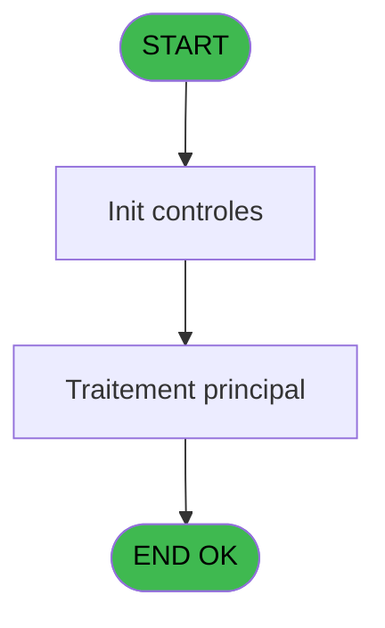
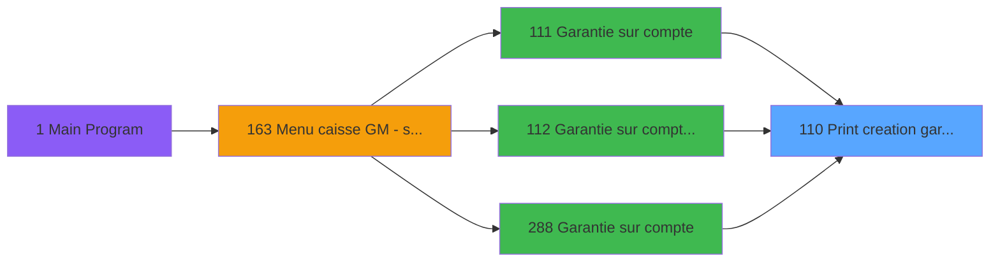

# ADH IDE 110 - Print creation garanti PMS-584

> **Analyse**: Phases 1-4 2026-02-07 03:49 -> 02:51 (23h02min) | Assemblage 02:51
> **Pipeline**: V7.2 Enrichi
> **Structure**: 4 onglets (Resume | Ecrans | Donnees | Connexions)

<!-- TAB:Resume -->

## 1. FICHE D'IDENTITE

| Attribut | Valeur |
|----------|--------|
| Projet | ADH |
| IDE Position | 110 |
| Nom Programme | Print creation garanti PMS-584 |
| Fichier source | `Prg_110.xml` |
| Dossier IDE | Impression |
| Taches | 16 (1 ecrans visibles) |
| Tables modifiees | 0 |
| Programmes appeles | 1 |
| Complexite | **BASSE** (score 18/100) |

## 2. DESCRIPTION FONCTIONNELLE

ADH IDE 110 - Print creation garanti PMS-584 gère l'impression des documents de garantie (dépôt/caution) pour les comptes clients. Le programme est appelé depuis trois points d'entrée liés à la gestion des garanties (IDE 111, 112, 288) et effectue l'initialisation de l'imprimante avant chaque impression via un appel à Raz Current Printer (IDE 182).

Le flux d'exécution suit un processus standardisé : réinitialisation de l'imprimante, formatage du document (extraction compte, en-tête, corps), puis envoi à l'imprimante physique. Les tâches multiples (Print creation garantie TIK V1, Printer 1-4) correspondent aux différents modèles d'imprimante supportés et aux variantes de mise en page selon le type de garantie.

Ce programme fait partie de la chaîne critique de gestion des garanties, garantissant que chaque dépôt/caution est documenté et imprimé de manière cohérente pour l'archivage administratif et client.

## 3. BLOCS FONCTIONNELS

### 3.1 Impression (11 taches)

Generation des documents et tickets.

---

#### 110 - Print creation garantie TIK V1

**Role** : Tache d'orchestration : point d'entree du programme (11 sous-taches). Coordonne l'enchainement des traitements.

10 sous-taches directes

| Tache | Nom | Bloc |
|-------|-----|------|
| [110.1](#t2) | Printer 1 | Impression |
| [110.1.1](#t3) | edition extrait compte | Impression |
| [110.1.2](#t4) | edition extrait compte | Impression |
| [110.2](#t5) | Printer 4 | Impression |
| [110.2.1](#t6) | edition extrait compte | Impression |
| [110.2.2](#t7) | edition extrait compte | Impression |
| [110.5](#t11) | Printer 8 | Impression |
| [110.5.1](#t12) | edition extrait compte | Impression |
| [110.6](#t13) | Printer 9 | Impression |
| [110.6.1](#t14) | edition extrait compte | Impression |

---

#### 110.1 - Printer 1

**Role** : Generation du document : Printer 1.

---

#### 110.1.1 - edition extrait compte

**Role** : Generation du document : edition extrait compte.

---

#### 110.1.2 - edition extrait compte

**Role** : Generation du document : edition extrait compte.

---

#### 110.2 - Printer 4

**Role** : Generation du document : Printer 4.

---

#### 110.2.1 - edition extrait compte

**Role** : Generation du document : edition extrait compte.

---

#### 110.2.2 - edition extrait compte

**Role** : Generation du document : edition extrait compte.

---

#### 110.5 - Printer 8

**Role** : Generation du document : Printer 8.

---

#### 110.5.1 - edition extrait compte

**Role** : Generation du document : edition extrait compte.

---

#### 110.6 - Printer 9

**Role** : Generation du document : Printer 9.

---

#### 110.6.1 - edition extrait compte

**Role** : Generation du document : edition extrait compte.

### 3.2 Traitement (5 taches)

Traitements internes.

---

#### 110.3 - Iteration [[ECRAN]](#ecran-t8)

**Role** : Traitement : Iteration.
**Ecran** : 422 x 56 DLU (MDI) | [Voir mockup](#ecran-t8)

---

#### 110.3.1 - Veuillez patienter... [[ECRAN]](#ecran-t9)

**Role** : Traitement : Veuillez patienter....
**Ecran** : 422 x 56 DLU (MDI) | [Voir mockup](#ecran-t9)

---

#### 110.4 - recup nom adherent

**Role** : Consultation/chargement : recup nom adherent.
**Variables liees** : EO (P0 code adherent), EY (W0 n° adherent)

---

#### 110.7 - recup terminal

**Role** : Consultation/chargement : recup terminal.

---

#### 110.8 - recup terminal

**Role** : Consultation/chargement : recup terminal.

## 5. REGLES METIER

7 regles identifiees:

### Impression (5 regles)

#### [RM-001] Verification que l'imprimante courante est la n1

| Element | Detail |
|---------|--------|
| **Condition** | `GetParam ('CURRENTPRINTERNUM')=1 OR VG82='TB'` |
| **Si vrai** | Action si CURRENTPRINTERNUM = 1 |
| **Expression source** | Expression 5 : `GetParam ('CURRENTPRINTERNUM')=1 OR VG82='TB'` |
| **Exemple** | Si GetParam ('CURRENTPRINTERNUM')=1 OR VG82='TB' → Action si CURRENTPRINTERNUM = 1 |
| **Impact** | [110 - Print creation garantie TIK V1](#t1) |

#### [RM-002] Verification que l'imprimante courante est la n4

| Element | Detail |
|---------|--------|
| **Condition** | `GetParam ('CURRENTPRINTERNUM')=4` |
| **Si vrai** | Action si CURRENTPRINTERNUM = 4 |
| **Expression source** | Expression 6 : `GetParam ('CURRENTPRINTERNUM')=4` |
| **Exemple** | Si GetParam ('CURRENTPRINTERNUM')=4 → Action si CURRENTPRINTERNUM = 4 |
| **Impact** | [110 - Print creation garantie TIK V1](#t1) |

#### [RM-003] Verification que l'imprimante courante est la n5

| Element | Detail |
|---------|--------|
| **Condition** | `GetParam ('CURRENTPRINTERNUM')=5` |
| **Si vrai** | Action si CURRENTPRINTERNUM = 5 |
| **Expression source** | Expression 7 : `GetParam ('CURRENTPRINTERNUM')=5` |
| **Exemple** | Si GetParam ('CURRENTPRINTERNUM')=5 → Action si CURRENTPRINTERNUM = 5 |
| **Impact** | [110 - Print creation garantie TIK V1](#t1) |

#### [RM-004] Verification que l'imprimante courante est la n8

| Element | Detail |
|---------|--------|
| **Condition** | `GetParam ('CURRENTPRINTERNUM')=8` |
| **Si vrai** | Action si CURRENTPRINTERNUM = 8 |
| **Expression source** | Expression 8 : `GetParam ('CURRENTPRINTERNUM')=8` |
| **Exemple** | Si GetParam ('CURRENTPRINTERNUM')=8 → Action si CURRENTPRINTERNUM = 8 |
| **Impact** | [110 - Print creation garantie TIK V1](#t1) |

#### [RM-005] Verification que l'imprimante courante est la n9

| Element | Detail |
|---------|--------|
| **Condition** | `GetParam ('CURRENTPRINTERNUM')=9` |
| **Si vrai** | Action si CURRENTPRINTERNUM = 9 |
| **Expression source** | Expression 9 : `GetParam ('CURRENTPRINTERNUM')=9` |
| **Exemple** | Si GetParam ('CURRENTPRINTERNUM')=9 → Action si CURRENTPRINTERNUM = 9 |
| **Impact** | [110 - Print creation garantie TIK V1](#t1) |

### Autres (2 regles)

#### [RM-006] Condition: P0 Fichier édition pdf [H] egale

| Element | Detail |
|---------|--------|
| **Condition** | `P0 Fichier édition pdf [H]=''` |
| **Si vrai** | Action si vrai |
| **Variables** | EU (P0 Fichier édition pdf) |
| **Expression source** | Expression 14 : `P0 Fichier édition pdf [H]=''` |
| **Exemple** | Si P0 Fichier édition pdf [H]='' → Action si vrai |

#### [RM-007] Negation de VG78 (condition inversee)

| Element | Detail |
|---------|--------|
| **Condition** | `NOT VG78` |
| **Si vrai** | Action si vrai |
| **Expression source** | Expression 16 : `NOT VG78` |
| **Exemple** | Si NOT VG78 → Action si vrai |

## 6. CONTEXTE

- **Appele par**: [Garantie sur compte (IDE 111)](ADH-IDE-111.md), [Garantie sur compte PMS-584 (IDE 112)](ADH-IDE-112.md), [Garantie sur compte (IDE 288)](ADH-IDE-288.md)
- **Appelle**: 1 programmes | **Tables**: 8 (W:0 R:4 L:4) | **Taches**: 16 | **Expressions**: 16

<!-- TAB:Ecrans -->

## 8. ECRANS

### 8.1 Forms visibles (1 / 16)

| # | Position | Tache | Nom | Type | Largeur | Hauteur | Bloc |
|---|----------|-------|-----|------|---------|---------|------|
| 1 | 110.3.1 | 110.3.1 | Veuillez patienter... | MDI | 422 | 56 | Traitement |

### 8.2 Mockups Ecrans

---

#### 110.3.1 - Veuillez patienter...
**Tache** : [110.3.1](#t9) | **Type** : MDI | **Dimensions** : 422 x 56 DLU
**Bloc** : Traitement | **Titre IDE** : Veuillez patienter...

<!-- FORM-DATA:
{
    "width":  422,
    "vFactor":  8,
    "type":  "MDI",
    "hFactor":  8,
    "controls":  [
                     {
                         "x":  0,
                         "type":  "label",
                         "var":  "",
                         "y":  0,
                         "w":  423,
                         "fmt":  "",
                         "name":  "",
                         "h":  29,
                         "color":  "",
                         "text":  "",
                         "parent":  null
                     },
                     {
                         "x":  120,
                         "type":  "label",
                         "var":  "",
                         "y":  10,
                         "w":  221,
                         "fmt":  "",
                         "name":  "",
                         "h":  8,
                         "color":  "7",
                         "text":  "Impression en cours ...",
                         "parent":  null
                     },
                     {
                         "x":  0,
                         "type":  "label",
                         "var":  "",
                         "y":  29,
                         "w":  423,
                         "fmt":  "",
                         "name":  "",
                         "h":  27,
                         "color":  "",
                         "text":  "",
                         "parent":  null
                     },
                     {
                         "x":  50,
                         "type":  "label",
                         "var":  "",
                         "y":  38,
                         "w":  323,
                         "fmt":  "",
                         "name":  "",
                         "h":  8,
                         "color":  "",
                         "text":  "Edition de la creation de garantie",
                         "parent":  null
                     },
                     {
                         "x":  4,
                         "type":  "image",
                         "var":  "",
                         "y":  2,
                         "w":  72,
                         "fmt":  "",
                         "name":  "",
                         "h":  25,
                         "color":  "",
                         "text":  "",
                         "parent":  null
                     }
                 ],
    "taskId":  "110.3.1",
    "height":  56
}
-->

## 9. NAVIGATION

Ecran unique: **Veuillez patienter...**

### 9.3 Structure hierarchique (16 taches)

| Position | Tache | Type | Dimensions | Bloc |
|----------|-------|------|------------|------|
| **110.1** | [**Print creation garantie TIK V1** (110)](#t1) | MDI | - | Impression |
| 110.1.1 | [Printer 1 (110.1)](#t2) | MDI | - | |
| 110.1.2 | [edition extrait compte (110.1.1)](#t3) | MDI | - | |
| 110.1.3 | [edition extrait compte (110.1.2)](#t4) | MDI | - | |
| 110.1.4 | [Printer 4 (110.2)](#t5) | MDI | - | |
| 110.1.5 | [edition extrait compte (110.2.1)](#t6) | MDI | - | |
| 110.1.6 | [edition extrait compte (110.2.2)](#t7) | MDI | - | |
| 110.1.7 | [Printer 8 (110.5)](#t11) | MDI | - | |
| 110.1.8 | [edition extrait compte (110.5.1)](#t12) | MDI | - | |
| 110.1.9 | [Printer 9 (110.6)](#t13) | MDI | - | |
| 110.1.10 | [edition extrait compte (110.6.1)](#t14) | MDI | - | |
| **110.2** | [**Iteration** (110.3)](#t8) [mockup](#ecran-t8) | MDI | 422x56 | Traitement |
| 110.2.1 | [Veuillez patienter... (110.3.1)](#t9) [mockup](#ecran-t9) | MDI | 422x56 | |
| 110.2.2 | [recup nom adherent (110.4)](#t10) | MDI | - | |
| 110.2.3 | [recup terminal (110.7)](#t15) | - | - | |
| 110.2.4 | [recup terminal (110.8)](#t16) | - | - | |

### 9.4 Algorigramme

> **Legende**: Vert = START/END OK | Rouge = END KO | Bleu = Decisions
> *Algorigramme auto-genere. Utiliser `/algorigramme` pour une synthese metier detaillee.*

<!-- TAB:Donnees -->

## 10. TABLES

### Tables utilisees (8)

| ID | Nom | Description | Type | R | W | L | Usages |
|----|-----|-------------|------|---|---|---|--------|
| 39 | depot_garantie___dga | Depots et garanties | DB | R |   |   | 7 |
| 878 | categorie_operation_mw | Operations comptables | DB | R |   |   | 2 |
| 30 | gm-recherche_____gmr | Index de recherche | DB | R |   |   | 1 |
| 368 | pms_village |  | DB | R |   |   | 1 |
| 91 | garantie_________gar | Depots et garanties | DB |   |   | L | 7 |
| 31 | gm-complet_______gmc |  | DB |   |   | L | 1 |
| 818 | Circuit supprime |  | DB |   |   | L | 1 |
| 34 | hebergement______heb | Hebergement (chambres) | DB |   |   | L | 1 |

### Colonnes par table (2 / 4 tables avec colonnes identifiees)

Table 39 - depot_garantie___dga (R) - 7 usages

| Lettre | Variable | Acces | Type |
|--------|----------|-------|------|
| A | W1 config imp | R | Alpha |
| B | W1 large | R | Alpha |
| C | W1 normal | R | Alpha |
| D | W1 condense | R | Alpha |
| E | W1 detecteur papier | R | Alpha |
| F | W1 inhibe panel | R | Alpha |
| G | W1 massicot | R | Alpha |
| H | W1 selection feuille | R | Alpha |
| I | W1 selection rouleau | R | Alpha |

Table 878 - categorie_operation_mw (R) - 2 usages

*Table utilisee uniquement en Link ou aucune colonne Real identifiee dans le DataView.*

Table 30 - gm-recherche_____gmr (R) - 1 usages

*Table utilisee uniquement en Link ou aucune colonne Real identifiee dans le DataView.*

Table 368 - pms_village (R) - 1 usages

| Lettre | Variable | Acces | Type |
|--------|----------|-------|------|
| A | P0 societe | R | Alpha |
| B | P0 code adherent | R | Numeric |
| C | P0 filiation | R | Numeric |
| D | P0 nom village | R | Alpha |
| E | P0 masque montant | R | Alpha |
| F | P0 N° Dossier | R | Alpha |
| G | P0 N° autorisation | R | Alpha |
| H | P0 Fichier édition pdf | R | Alpha |
| I | P0 fichier signature | R | Alpha |
| J | W0 nom | R | Alpha |
| K | W0 prenom | R | Alpha |
| L | W0 n° adherent | R | Numeric |
| M | W0 lettre contrôle | R | Alpha |
| N | W0 filiation | R | Numeric |
| O | W0 Chambre | R | Alpha |
| P | W0 date de debut | R | Date |
| Q | W0 date de fin | R | Date |
| R | W0 TPE ICMP | R | Logical |
| S | v.comment | R | Alpha |

## 11. VARIABLES

### 11.1 Parametres entrants (9)

Variables recues du programme appelant ([Garantie sur compte (IDE 111)](ADH-IDE-111.md)).

| Lettre | Nom | Type | Usage dans |
|--------|-----|------|-----------|
| EN | P0 societe | Alpha | - |
| EO | P0 code adherent | Numeric | [110.4](#t10) |
| EP | P0 filiation | Numeric | 1x parametre entrant |
| EQ | P0 nom village | Alpha | - |
| ER | P0 masque montant | Alpha | - |
| ES | P0 N° Dossier | Alpha | - |
| ET | P0 N° autorisation | Alpha | - |
| EU | P0 Fichier édition pdf | Alpha | 1x parametre entrant |
| EV | P0 fichier signature | Alpha | - |

### 11.2 Variables de session (1)

Variables persistantes pendant toute la session.

| Lettre | Nom | Type | Usage dans |
|--------|-----|------|-----------|
| FF | v.comment | Alpha | - |

### 11.3 Variables de travail (9)

Variables internes au programme.

| Lettre | Nom | Type | Usage dans |
|--------|-----|------|-----------|
| EW | W0 nom | Alpha | - |
| EX | W0 prenom | Alpha | - |
| EY | W0 n° adherent | Numeric | - |
| EZ | W0 lettre contrôle | Alpha | - |
| FA | W0 filiation | Numeric | - |
| FB | W0 Chambre | Alpha | - |
| FC | W0 date de debut | Date | - |
| FD | W0 date de fin | Date | - |
| FE | W0 TPE ICMP | Logical | - |

Toutes les 19 variables (liste complete)

| Cat | Lettre | Nom Variable | Type |
|-----|--------|--------------|------|
| P0 | **EN** | P0 societe | Alpha |
| P0 | **EO** | P0 code adherent | Numeric |
| P0 | **EP** | P0 filiation | Numeric |
| P0 | **EQ** | P0 nom village | Alpha |
| P0 | **ER** | P0 masque montant | Alpha |
| P0 | **ES** | P0 N° Dossier | Alpha |
| P0 | **ET** | P0 N° autorisation | Alpha |
| P0 | **EU** | P0 Fichier édition pdf | Alpha |
| P0 | **EV** | P0 fichier signature | Alpha |
| W0 | **EW** | W0 nom | Alpha |
| W0 | **EX** | W0 prenom | Alpha |
| W0 | **EY** | W0 n° adherent | Numeric |
| W0 | **EZ** | W0 lettre contrôle | Alpha |
| W0 | **FA** | W0 filiation | Numeric |
| W0 | **FB** | W0 Chambre | Alpha |
| W0 | **FC** | W0 date de debut | Date |
| W0 | **FD** | W0 date de fin | Date |
| W0 | **FE** | W0 TPE ICMP | Logical |
| V. | **FF** | v.comment | Alpha |

## 12. EXPRESSIONS

**16 / 16 expressions decodees (100%)**

### 12.1 Repartition par type

| Type | Expressions | Regles |
|------|-------------|--------|
| CONDITION | 6 | 6 |
| NEGATION | 1 | 5 |
| CONSTANTE | 2 | 0 |
| FORMAT | 1 | 0 |
| OTHER | 3 | 0 |
| CAST_LOGIQUE | 1 | 0 |
| REFERENCE_VG | 1 | 0 |
| CONCATENATION | 1 | 0 |

### 12.2 Expressions cles par type

#### CONDITION (6 expressions)

| Type | IDE | Expression | Regle |
|------|-----|------------|-------|
| CONDITION | 8 | `GetParam ('CURRENTPRINTERNUM')=8` | [RM-004](#rm-RM-004) |
| CONDITION | 9 | `GetParam ('CURRENTPRINTERNUM')=9` | [RM-005](#rm-RM-005) |
| CONDITION | 14 | `P0 Fichier édition pdf [H]=''` | [RM-006](#rm-RM-006) |
| CONDITION | 5 | `GetParam ('CURRENTPRINTERNUM')=1 OR VG82='TB'` | [RM-001](#rm-RM-001) |
| CONDITION | 6 | `GetParam ('CURRENTPRINTERNUM')=4` | [RM-002](#rm-RM-002) |
| ... | | *+1 autres* | |

#### NEGATION (1 expressions)

| Type | IDE | Expression | Regle |
|------|-----|------------|-------|
| NEGATION | 16 | `NOT VG78` | [RM-007](#rm-RM-007) |

#### CONSTANTE (2 expressions)

| Type | IDE | Expression | Regle |
|------|-----|------------|-------|
| CONSTANTE | 11 | `'GL2'` | - |
| CONSTANTE | 10 | `'GL1'` | - |

#### FORMAT (1 expressions)

| Type | IDE | Expression | Regle |
|------|-----|------------|-------|
| FORMAT | 13 | `Translate ('%TempDir%ticket_garant_'&Str(P0 code adherent [B],'8P0')&
'_'&Trim(Str(P0 filiation [C],'3P0'))&'_'&DStr(Date(),'YYMMDD')&
TStr(Time(),'HHMMSS')&'.pdf')` | - |

#### OTHER (3 expressions)

| Type | IDE | Expression | Regle |
|------|-----|------------|-------|
| OTHER | 4 | `SetCrsr (1)` | - |
| OTHER | 2 | `GetParam ('CURRENTLISTINGNUM')` | - |
| OTHER | 1 | `SetCrsr (2)` | - |

#### CAST_LOGIQUE (1 expressions)

| Type | IDE | Expression | Regle |
|------|-----|------------|-------|
| CAST_LOGIQUE | 12 | `'TRUE'LOG` | - |

#### REFERENCE_VG (1 expressions)

| Type | IDE | Expression | Regle |
|------|-----|------------|-------|
| REFERENCE_VG | 15 | `VG78` | - |

#### CONCATENATION (1 expressions)

| Type | IDE | Expression | Regle |
|------|-----|------------|-------|
| CONCATENATION | 3 | `Trim ([T])&' '&Trim ([U])&' '&Trim ([V])` | - |

<!-- TAB:Connexions -->

## 13. GRAPHE D'APPELS

### 13.1 Chaine depuis Main (Callers)

Main -> ... -> [Garantie sur compte (IDE 111)](ADH-IDE-111.md) -> **Print creation garanti PMS-584 (IDE 110)**

Main -> ... -> [Garantie sur compte PMS-584 (IDE 112)](ADH-IDE-112.md) -> **Print creation garanti PMS-584 (IDE 110)**

Main -> ... -> [Garantie sur compte (IDE 288)](ADH-IDE-288.md) -> **Print creation garanti PMS-584 (IDE 110)**

### 13.2 Callers

| IDE | Nom Programme | Nb Appels |
|-----|---------------|-----------|
| [111](ADH-IDE-111.md) | Garantie sur compte | 1 |
| [112](ADH-IDE-112.md) | Garantie sur compte PMS-584 | 1 |
| [288](ADH-IDE-288.md) | Garantie sur compte | 1 |

### 13.3 Callees (programmes appeles)

### 13.4 Detail Callees avec contexte

| IDE | Nom Programme | Appels | Contexte |
|-----|---------------|--------|----------|
| [182](ADH-IDE-182.md) | Raz Current Printer | 1 | Impression ticket/document |

## 14. RECOMMANDATIONS MIGRATION

### 14.1 Profil du programme

| Metrique | Valeur | Impact migration |
|----------|--------|-----------------|
| Lignes de logique | 305 | Taille moyenne |
| Expressions | 16 | Peu de logique |
| Tables WRITE | 0 | Impact faible |
| Sous-programmes | 1 | Peu de dependances |
| Ecrans visibles | 1 | Ecran unique ou traitement batch |
| Code desactive | 0% (0 / 305) | Code sain |
| Regles metier | 7 | Quelques regles a preserver |

### 14.2 Plan de migration par bloc

#### Impression (11 taches: 0 ecran, 11 traitements)

- **Strategie** : Templates HTML -> PDF via wkhtmltopdf ou Puppeteer.
- `PrintService` injectable avec choix imprimante

#### Traitement (5 taches: 2 ecrans, 3 traitements)

- **Strategie** : Orchestrateur avec 2 ecrans (Razor/React) et 3 traitements backend (services).
- Les ecrans deviennent des composants UI, les traitements invisibles deviennent des services injectables.
- 1 sous-programme(s) a migrer ou a reutiliser depuis les services existants.
- Decomposer les taches en services unitaires testables.

### 14.3 Dependances critiques

| Dependance | Type | Appels | Impact |
|------------|------|--------|--------|
| [Raz Current Printer (IDE 182)](ADH-IDE-182.md) | Sous-programme | 1x | Normale - Impression ticket/document |

---
*Spec DETAILED generee par Pipeline V7.2 - 2026-02-08 02:52*
