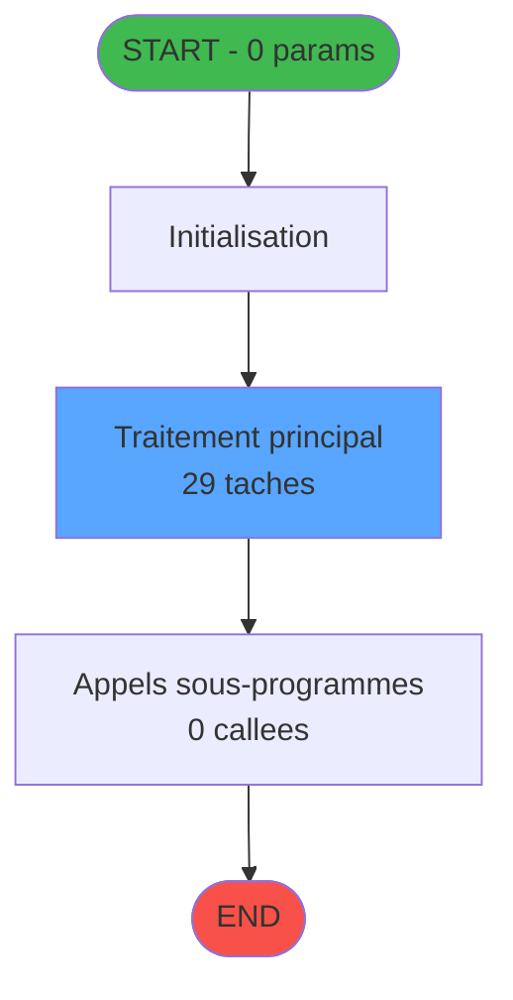
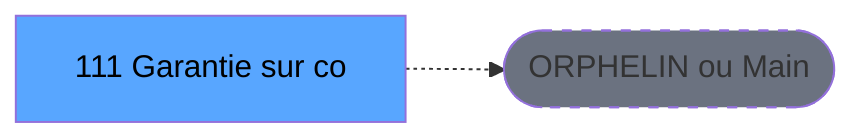
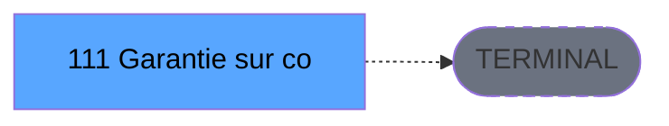

# ADH IDE 111 - Garantie sur compte

> **Version spec**: 4.0
> **Analyse**: 2026-01-27 23:04
> **Source**: `D:\Data\Migration\XPA\PMS\ADH\Source\Prg_107.xml`
> **Methode**: APEX + PDCA (Auto-generated)

---

<!-- TAB:Fonctionnel -->

## SPECIFICATION FONCTIONNELLE

### 1.1 Objectif metier

| Element | Description |
|---------|-------------|
| **Qui** | Operateur (utilisateur connecte) |
| **Quoi** | Garantie sur compte |
| **Pourquoi** | Fonction metier du module ADH |
| **Declencheur** | Appel depuis programme parent ou menu |
| **Resultat** | Traitement effectue selon logique programme |

### 1.2 Regles metier

| Code | Regle | Condition |
|------|-------|-----------|
| RM-001 | Execution du traitement principal | Conditions d'entree validees |
| RM-002 | Gestion des tables (28 tables) | Acces selon mode (R/W/L) |
| RM-003 | Appels sous-programmes (0 callees) | Selon logique metier |

### 1.3 Flux utilisateur

1. Reception des parametres d'entree (0 params)
2. Initialisation et verification conditions
3. Traitement principal (29 taches)
4. Appels sous-programmes si necessaire
5. Retour resultats

### 1.4 Cas d'erreur

| Erreur | Comportement |
|--------|--------------|
| Conditions non remplies | Abandon avec message |
| Erreur sous-programme | Propagation erreur |

---

<!-- TAB:Technique -->

## SPECIFICATION TECHNIQUE

### 2.1 Identification

| Attribut | Valeur |
|----------|--------|
| **IDE Position** | 111 |
| **Fichier XML** | `Prg_107.xml` |
| **Description** | Garantie sur compte |
| **Module** | ADH |
| **Public Name** | GARANTIE |
| **Nombre taches** | 29 |
| **Lignes logique** | 1286 |
| **Expressions** | 0 |

### 2.2 Tables

| # | Nom logique | Nom physique | Acces | Usage |
|---|-------------|--------------|-------|-------|
| 23 | reseau_cloture___rec | cafil001_dat | READ | Lecture |
| 30 | gm-recherche_____gmr | cafil008_dat | READ | Lecture |
| 31 | gm-complet_______gmc | cafil009_dat | LINK/READ/WRITE | Jointure+R/W |
| 39 | depot_garantie___dga | cafil017_dat | LINK/READ/WRITE | Jointure+R/W |
| 40 | comptable________cte | cafil018_dat | LINK | Jointure |
| 47 | compte_gm________cgm | cafil025_dat | LINK/WRITE | Jointure+Ecriture |
| 50 | moyens_reglement_mor | cafil028_dat | LINK | Jointure |
| 66 | imputations______imp | cafil044_dat | LINK | Jointure |
| 68 | compteurs________cpt | cafil046_dat | WRITE | Ecriture |
| 69 | initialisation___ini | cafil047_dat | LINK | Jointure |
| 70 | date_comptable___dat | cafil048_dat | LINK | Jointure |
| 88 | historik_station | cafil066_dat | LINK | Jointure |
| 89 | moyen_paiement___mop | cafil067_dat | LINK | Jointure |
| 91 | garantie_________gar | cafil069_dat | LINK/READ | Jointure+Lecture |
| 139 | moyens_reglement_mor | cafil117_dat | LINK | Jointure |
| 140 | moyen_paiement___mop | cafil118_dat | LINK | Jointure |
| 285 | email | email | LINK | Jointure |
| 312 | ez_card | ezcard | LINK | Jointure |
| 370 | pv_accounting_date | pv_accountdate_dat | WRITE | Ecriture |
| 910 | classification_memory | classification_memory | LINK | Jointure |
| 911 | log_booker | log_booker | WRITE | Ecriture |
| 945 | Table_945 |  | WRITE | Ecriture |

**Resume**: 28 tables accedees dont **7 en ecriture**

### 2.3 Parametres d'entree (0 parametres)

| Var | Nom | Type | Picture |
|-----|-----|------|---------|
| - | Aucun parametre | - | - |

### 2.4 Algorigramme

### 2.5 Statistiques

| Metrique | Valeur |
|----------|--------|
| **Taches** | 29 |
| **Lignes logique** | 1286 |
| **Expressions** | 0 |
| **Parametres** | 0 |
| **Tables accedees** | 28 |
| **Tables en ecriture** | 7 |
| **Callees niveau 1** | 0 |

---

<!-- TAB:Cartographie -->

## CARTOGRAPHIE APPLICATIVE

### 3.1 Chaine d'appels depuis Main

### 3.2 Callers directs

| IDE | Programme | Nb appels |
|-----|-----------|-----------|
| - | ECF partage - appels cross-projet | - |

### 3.3 Callees (3 niveaux)

| Niv | IDE | Programme | Nb appels | Status |
|-----|-----|-----------|-----------|--------|
| - | - | TERMINAL | - | - |

### 3.4 Composants ECF utilises

| ECF | IDE | Public Name | Description |
|-----|-----|-------------|-------------|
| ADH.ecf | 111 | GARANTIE | Sessions_Reprises |

### 3.5 Verification orphelin

| Critere | Resultat |
|---------|----------|
| Callers actifs | 0 programmes |
| PublicName | Defini: GARANTIE |
| ECF partage | OUI - ADH.ecf |
| **Conclusion** | **NON ORPHELIN** - Composant ECF partage |

---

## NOTES MIGRATION

### Complexite

| Critere | Score | Detail |
|---------|-------|--------|
| Taches | 29 | Complexe |
| Tables | 28 | Ecriture |
| Callees | 0 | Faible couplage |
| **Score global** | **HAUTE** | - |

### Points d'attention migration

| Point | Solution moderne |
|-------|-----------------|
| Variables globales (VG*) | Service/Repository injection |
| Tables Magic | Entity Framework / Dapper |
| CallTask | Service method calls |
| Forms | React/Angular components |

---

## HISTORIQUE

| Date | Action | Auteur |
|------|--------|--------|
| 2026-01-27 23:04 | **V4.0 APEX/PDCA** - Generation automatique complete | Script |

---

*Specification V4.0 - Auto-generated with APEX/PDCA methodology*

