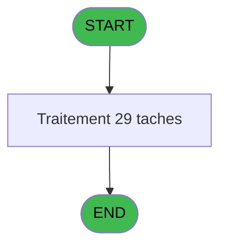
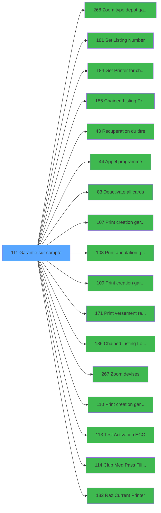

# ADH IDE 111 - Garantie sur compte

> **Analyse**: Phases 1-4 2026-02-07 03:48 -> 03:49 (28s) | Assemblage 07:02
> **Pipeline**: V7.2 Enrichi
> **Structure**: 4 onglets (Resume | Ecrans | Donnees | Connexions)

<!-- TAB:Resume -->

## 1. FICHE D'IDENTITE

| Attribut | Valeur |
|----------|--------|
| Projet | ADH |
| IDE Position | 111 |
| Nom Programme | Garantie sur compte |
| Fichier source | `Prg_111.xml` |
| Dossier IDE | Garantie |
| Taches | 29 (4 ecrans visibles) |
| Tables modifiees | 7 |
| Programmes appeles | 17 |

## 2. DESCRIPTION FONCTIONNELLE

**Garantie sur compte** assure la gestion complete de ce processus, accessible depuis [Menu caisse GM - scroll (IDE 163)](ADH-IDE-163.md).

Le flux de traitement s'organise en **5 blocs fonctionnels** :

- **Traitement** (18 taches) : traitements metier divers
- **Calcul** (5 taches) : calculs de montants, stocks ou compteurs
- **Impression** (2 taches) : generation de tickets et documents
- **Creation** (2 taches) : insertion d'enregistrements en base (mouvements, prestations)
- **Saisie** (2 taches) : ecrans de saisie utilisateur (formulaires, champs, donnees)

**Donnees modifiees** : 7 tables en ecriture (gm-complet_______gmc, depot_garantie___dga, compte_gm________cgm, compteurs________cpt, pv_accounting_date, log_booker, Table_945).

Detail : phases du traitement

#### Phase 1 : Traitement (18 taches)

- **T1** - (sans nom)
- **T2** - Test reseau
- **T3** - Depôt de garantie **[ECRAN]**
- **T5** - Scroll depôt objet
- **T7** - MAJ solde devise depot
- **T8** - CARD?
- **T9** - CARD?
- **T10** - Abandon
- **T11** - SendMail
- **T18** - MAJ CMP
- **T19** - Param OK ?
- **T20** - Param OK ?
- **T21** - Envoi mail garantie
- **T22** - Envoi mail garantie
- **T23** - Depôt de garantie **[ECRAN]**
- **T24** - Scroll depôt objet
- **T26** - MAJ solde devise depot
- **T32** - CARD?

Delegue a : [Set Listing Number (IDE 181)](ADH-IDE-181.md), [Recuperation du titre (IDE 43)](ADH-IDE-43.md), [Appel programme (IDE 44)](ADH-IDE-44.md), [Deactivate all cards (IDE 83)](ADH-IDE-83.md), [Chained Listing Load Default (IDE 186)](ADH-IDE-186.md), [Test Activation ECO (IDE 113)](ADH-IDE-113.md), [Club Med Pass Filiations (IDE 114)](ADH-IDE-114.md)

#### Phase 2 : Calcul (5 taches)

- **T4** - Calcul flag
- **T13** - Recup compteur verst/retrait
- **T16** - Recup compteur verst/retrait
- **T27** - Calcul flag
- **T28** - Reaffichage info compte

#### Phase 3 : Saisie (2 taches)

- **T6** - Saisie depôt objet **[ECRAN]**
- **T25** - Saisie depôt objet **[ECRAN]**

#### Phase 4 : Creation (2 taches)

- **T12** - Creation Versement v2
- **T15** - Creation Versement T2H

#### Phase 5 : Impression (2 taches)

- **T14** - Création reedition_ticket
- **T17** - Création reedition_ticket

Delegue a : [Set Listing Number (IDE 181)](ADH-IDE-181.md), [Get Printer for chained list (IDE 184)](ADH-IDE-184.md), [Chained Listing Printer Choice (IDE 185)](ADH-IDE-185.md), [Print creation garantie (IDE 107)](ADH-IDE-107.md), [Print annulation garantie (IDE 108)](ADH-IDE-108.md), [Print creation garantie TIK V1 (IDE 109)](ADH-IDE-109.md), [Print versement retrait (IDE 171)](ADH-IDE-171.md), [Chained Listing Load Default (IDE 186)](ADH-IDE-186.md), [Print creation garanti PMS-584 (IDE 110)](ADH-IDE-110.md), [Raz Current Printer (IDE 182)](ADH-IDE-182.md)

#### Tables impactees

| Table | Operations | Role metier |
|-------|-----------|-------------|
| compte_gm________cgm | **W**/L (7 usages) | Comptes GM (generaux) |
| depot_garantie___dga | R/**W**/L (6 usages) | Depots et garanties |
| gm-complet_______gmc | R/**W**/L (4 usages) |  |
| Table_945 | **W** (2 usages) |  |
| compteurs________cpt | **W** (2 usages) | Comptes GM (generaux) |
| pv_accounting_date | **W** (2 usages) |  |
| log_booker | **W** (2 usages) |  |

## 3. BLOCS FONCTIONNELS

### 3.1 Traitement (18 taches)

Traitements internes.

---

#### T1 - (sans nom)

**Role** : Tache d'orchestration : point d'entree du programme (18 sous-taches). Coordonne l'enchainement des traitements.

17 sous-taches directes

| Tache | Nom | Bloc |
|-------|-----|------|
| [T2](#t2) | Test reseau | Traitement |
| [T3](#t3) | Depôt de garantie **[ECRAN]** | Traitement |
| [T5](#t5) | Scroll depôt objet | Traitement |
| [T7](#t7) | MAJ solde devise depot | Traitement |
| [T8](#t8) | CARD? | Traitement |
| [T9](#t9) | CARD? | Traitement |
| [T10](#t10) | Abandon | Traitement |
| [T11](#t11) | SendMail | Traitement |
| [T18](#t18) | MAJ CMP | Traitement |
| [T19](#t19) | Param OK ? | Traitement |
| [T20](#t20) | Param OK ? | Traitement |
| [T21](#t21) | Envoi mail garantie | Traitement |
| [T22](#t22) | Envoi mail garantie | Traitement |
| [T23](#t23) | Depôt de garantie **[ECRAN]** | Traitement |
| [T24](#t24) | Scroll depôt objet | Traitement |
| [T26](#t26) | MAJ solde devise depot | Traitement |
| [T32](#t32) | CARD? | Traitement |

---

#### T2 - Test reseau

**Role** : Verification : Test reseau.
**Variables liees** : R (W0 reseau)

---

#### T3 - Depôt de garantie [ECRAN]

**Role** : Traitement : Depôt de garantie.
**Ecran** : 810 x 282 DLU (MDI) | [Voir mockup](#ecran-t3)
**Variables liees** : O (P.i.choix garantie), Z (W0 montant depôt), BC (W0 etat depôt), BF (W0 conf Garantie), BP (W0 imprime garantie ?)

---

#### T5 - Scroll depôt objet

**Role** : Traitement : Scroll depôt objet.
**Variables liees** : Z (W0 montant depôt), BC (W0 etat depôt), CJ (CHG_REASON_W0 type depôt), CK (CHG_PRV_W0 type depôt)

---

#### T7 - MAJ solde devise depot

**Role** : Consultation/chargement : MAJ solde devise depot.
**Variables liees** : D (P.i.devise locale), H (P.i.flag depot), K (P.i.solde compte), M (P.i.date solde), Y (W0 devise)

---

#### T8 - CARD?

**Role** : Traitement : CARD?.

---

#### T9 - CARD?

**Role** : Traitement : CARD?.

---

#### T10 - Abandon

**Role** : Traitement : Abandon.

---

#### T11 - SendMail

**Role** : Traitement : SendMail.

---

#### T18 - MAJ CMP

**Role** : Traitement : MAJ CMP.

---

#### T19 - Param OK ?

**Role** : Traitement : Param OK ?.

---

#### T20 - Param OK ?

**Role** : Traitement : Param OK ?.

---

#### T21 - Envoi mail garantie

**Role** : Traitement : Envoi mail garantie.
**Variables liees** : O (P.i.choix garantie), BF (W0 conf Garantie), BP (W0 imprime garantie ?), BQ (W0 imprime annul garantie ?), BX (W0 Adresse Email)

---

#### T22 - Envoi mail garantie

**Role** : Traitement : Envoi mail garantie.
**Variables liees** : O (P.i.choix garantie), BF (W0 conf Garantie), BP (W0 imprime garantie ?), BQ (W0 imprime annul garantie ?), BX (W0 Adresse Email)

---

#### T23 - Depôt de garantie [ECRAN]

**Role** : Traitement : Depôt de garantie.
**Ecran** : 784 x 251 DLU (MDI) | [Voir mockup](#ecran-t23)
**Variables liees** : O (P.i.choix garantie), Z (W0 montant depôt), BC (W0 etat depôt), BF (W0 conf Garantie), BP (W0 imprime garantie ?)

---

#### T24 - Scroll depôt objet

**Role** : Traitement : Scroll depôt objet.
**Variables liees** : Z (W0 montant depôt), BC (W0 etat depôt), CJ (CHG_REASON_W0 type depôt), CK (CHG_PRV_W0 type depôt)

---

#### T26 - MAJ solde devise depot

**Role** : Consultation/chargement : MAJ solde devise depot.
**Variables liees** : D (P.i.devise locale), H (P.i.flag depot), K (P.i.solde compte), M (P.i.date solde), Y (W0 devise)

---

#### T32 - CARD?

**Role** : Traitement : CARD?.

### 3.2 Calcul (5 taches)

Calculs metier : montants, stocks, compteurs.

---

#### T4 - Calcul flag

**Role** : Calcul : Calcul flag.
**Variables liees** : H (P.i.flag depot), CD (v.flag validation signature)

---

#### T13 - Recup compteur verst/retrait

**Role** : Calcul : Recup compteur verst/retrait.

---

#### T16 - Recup compteur verst/retrait

**Role** : Calcul : Recup compteur verst/retrait.

---

#### T27 - Calcul flag

**Role** : Calcul : Calcul flag.
**Variables liees** : H (P.i.flag depot), CD (v.flag validation signature)

---

#### T28 - Reaffichage info compte

**Role** : Reinitialisation : Reaffichage info compte.
**Variables liees** : B (P.i.num compte), K (P.i.solde compte), L (P.i.etat compte)

### 3.3 Saisie (2 taches)

L'operateur saisit les donnees de la transaction via 2 ecrans (Saisie depôt objet, Saisie depôt objet).

---

#### T6 - Saisie depôt objet [ECRAN]

**Role** : Saisie des donnees : Saisie depôt objet.
**Ecran** : 591 x 108 DLU (Modal) | [Voir mockup](#ecran-t6)
**Variables liees** : Z (W0 montant depôt), BC (W0 etat depôt), CB (v.Saisie mail proposée), CJ (CHG_REASON_W0 type depôt), CK (CHG_PRV_W0 type depôt)

---

#### T25 - Saisie depôt objet [ECRAN]

**Role** : Saisie des donnees : Saisie depôt objet.
**Ecran** : 546 x 80 DLU (Modal) | [Voir mockup](#ecran-t25)
**Variables liees** : Z (W0 montant depôt), BC (W0 etat depôt), CB (v.Saisie mail proposée), CJ (CHG_REASON_W0 type depôt), CK (CHG_PRV_W0 type depôt)

### 3.4 Creation (2 taches)

Insertion de nouveaux enregistrements en base.

---

#### T12 - Creation Versement v2

**Role** : Creation d'enregistrement : Creation Versement v2.
**Variables liees** : BI (W0 Operateur creation), BJ (W0 Date creation), BK (W0 Time creation), CC (v.versement enregistré)
**Delegue a** : [Print creation garantie (IDE 107)](ADH-IDE-107.md), [Print creation garantie TIK V1 (IDE 109)](ADH-IDE-109.md), [Print creation garanti PMS-584 (IDE 110)](ADH-IDE-110.md)

---

#### T15 - Creation Versement T2H

**Role** : Creation d'enregistrement : Creation Versement T2H.
**Variables liees** : BI (W0 Operateur creation), BJ (W0 Date creation), BK (W0 Time creation), CC (v.versement enregistré)
**Delegue a** : [Print creation garantie (IDE 107)](ADH-IDE-107.md), [Print creation garantie TIK V1 (IDE 109)](ADH-IDE-109.md), [Print creation garanti PMS-584 (IDE 110)](ADH-IDE-110.md)

### 3.5 Impression (2 taches)

Generation des documents et tickets.

---

#### T14 - Création reedition_ticket

**Role** : Generation du document : Création reedition_ticket.
**Variables liees** : T (v.Création Garantie)
**Delegue a** : [Get Printer for chained list (IDE 184)](ADH-IDE-184.md), [Chained Listing Printer Choice (IDE 185)](ADH-IDE-185.md), [Print creation garantie (IDE 107)](ADH-IDE-107.md)

---

#### T17 - Création reedition_ticket

**Role** : Generation du document : Création reedition_ticket.
**Variables liees** : T (v.Création Garantie)
**Delegue a** : [Get Printer for chained list (IDE 184)](ADH-IDE-184.md), [Chained Listing Printer Choice (IDE 185)](ADH-IDE-185.md), [Print creation garantie (IDE 107)](ADH-IDE-107.md)

## 5. REGLES METIER

*(Aucune regle metier identifiee)*

## 6. CONTEXTE

- **Appele par**: [Menu caisse GM - scroll (IDE 163)](ADH-IDE-163.md)
- **Appelle**: 17 programmes | **Tables**: 22 (W:7 R:5 L:16) | **Taches**: 29 | **Expressions**: 14

<!-- TAB:Ecrans -->

## 8. ECRANS

### 8.1 Forms visibles (4 / 29)

| # | Position | Tache | Nom | Type | Largeur | Hauteur | Bloc |
|---|----------|-------|-----|------|---------|---------|------|
| 1 | 111.2 | T3 | Depôt de garantie | MDI | 810 | 282 | Traitement |
| 2 | 111.2.3 | T6 | Saisie depôt objet | Modal | 591 | 108 | Saisie |
| 3 | 111.3 | T23 | Depôt de garantie | MDI | 784 | 251 | Traitement |
| 4 | 111.3.2 | T25 | Saisie depôt objet | Modal | 546 | 80 | Saisie |

### 8.2 Mockups Ecrans

---

#### 111.2 - Depôt de garantie
**Tache** : [T3](#t3) | **Type** : MDI | **Dimensions** : 810 x 282 DLU
**Bloc** : Traitement | **Titre IDE** : Depôt de garantie

<!-- FORM-DATA:
{
    "width":  810,
    "vFactor":  8,
    "type":  "MDI",
    "hFactor":  8,
    "controls":  [
                     {
                         "x":  4,
                         "type":  "label",
                         "var":  "",
                         "y":  1,
                         "w":  800,
                         "fmt":  "",
                         "name":  "",
                         "h":  20,
                         "color":  "",
                         "text":  "",
                         "parent":  null
                     },
                     {
                         "x":  43,
                         "type":  "label",
                         "var":  "",
                         "y":  25,
                         "w":  716,
                         "fmt":  "",
                         "name":  "",
                         "h":  90,
                         "color":  "",
                         "text":  "",
                         "parent":  null
                     },
                     {
                         "x":  3,
                         "type":  "label",
                         "var":  "",
                         "y":  258,
                         "w":  803,
                         "fmt":  "",
                         "name":  "",
                         "h":  24,
                         "color":  "",
                         "text":  "",
                         "parent":  null
                     },
                     {
                         "x":  64,
                         "type":  "label",
                         "var":  "",
                         "y":  28,
                         "w":  674,
                         "fmt":  "",
                         "name":  "",
                         "h":  78,
                         "color":  "195",
                         "text":  "Dépôt.",
                         "parent":  4
                     },
                     {
                         "x":  127,
                         "type":  "edit",
                         "var":  "",
                         "y":  90,
                         "w":  59,
                         "fmt":  "",
                         "name":  "W0 type depôt",
                         "h":  10,
                         "color":  "6",
                         "text":  "",
                         "parent":  7
                     },
                     {
                         "x":  127,
                         "type":  "edit",
                         "var":  "",
                         "y":  69,
                         "w":  235,
                         "fmt":  "",
                         "name":  "",
                         "h":  11,
                         "color":  "146",
                         "text":  "",
                         "parent":  7
                     },
                     {
                         "x":  205,
                         "type":  "edit",
                         "var":  "",
                         "y":  90,
                         "w":  48,
                         "fmt":  "",
                         "name":  "W0 devise",
                         "h":  10,
                         "color":  "6",
                         "text":  "",
                         "parent":  7
                     },
                     {
                         "x":  272,
                         "type":  "edit",
                         "var":  "",
                         "y":  90,
                         "w":  115,
                         "fmt":  "#########Z",
                         "name":  "W0 montant depôt",
                         "h":  10,
                         "color":  "6",
                         "text":  "",
                         "parent":  7
                     },
                     {
                         "x":  546,
                         "type":  "checkbox",
                         "var":  "",
                         "y":  69,
                         "w":  178,
                         "fmt":  "",
                         "name":  "v_Express_Chek_out",
                         "h":  12,
                         "color":  "",
                         "text":  "Easy Check-Out",
                         "parent":  null
                     },
                     {
                         "x":  9,
                         "type":  "button",
                         "var":  "",
                         "y":  261,
                         "w":  154,
                         "fmt":  "20",
                         "name":  "Btn Valider",
                         "h":  18,
                         "color":  "",
                         "text":  "",
                         "parent":  6
                     },
                     {
                         "x":  597,
                         "type":  "edit",
                         "var":  "",
                         "y":  6,
                         "w":  203,
                         "fmt":  "WWW DD MMM YYYYT",
                         "name":  "",
                         "h":  8,
                         "color":  "",
                         "text":  "",
                         "parent":  1
                     },
                     {
                         "x":  14,
                         "type":  "edit",
                         "var":  "",
                         "y":  7,
                         "w":  267,
                         "fmt":  "20",
                         "name":  "",
                         "h":  8,
                         "color":  "",
                         "text":  "",
                         "parent":  1
                     },
                     {
                         "x":  217,
                         "type":  "edit",
                         "var":  "",
                         "y":  38,
                         "w":  397,
                         "fmt":  "40",
                         "name":  "",
                         "h":  10,
                         "color":  "",
                         "text":  "",
                         "parent":  7
                     },
                     {
                         "x":  176,
                         "type":  "edit",
                         "var":  "",
                         "y":  54,
                         "w":  456,
                         "fmt":  "100",
                         "name":  "",
                         "h":  8,
                         "color":  "",
                         "text":  "",
                         "parent":  7
                     },
                     {
                         "x":  406,
                         "type":  "edit",
                         "var":  "",
                         "y":  90,
                         "w":  309,
                         "fmt":  "30",
                         "name":  "",
                         "h":  10,
                         "color":  "142",
                         "text":  "",
                         "parent":  7
                     },
                     {
                         "x":  16,
                         "type":  "image",
                         "var":  "",
                         "y":  159,
                         "w":  160,
                         "fmt":  "",
                         "name":  "",
                         "h":  62,
                         "color":  "",
                         "text":  "",
                         "parent":  null
                     },
                     {
                         "x":  172,
                         "type":  "button",
                         "var":  "",
                         "y":  261,
                         "w":  154,
                         "fmt":  "A\u0026bandon",
                         "name":  "Abandon",
                         "h":  18,
                         "color":  "",
                         "text":  "",
                         "parent":  6
                     },
                     {
                         "x":  643,
                         "type":  "button",
                         "var":  "",
                         "y":  261,
                         "w":  154,
                         "fmt":  "Printer",
                         "name":  "",
                         "h":  18,
                         "color":  "",
                         "text":  "",
                         "parent":  6
                     },
                     {
                         "x":  482,
                         "type":  "button",
                         "var":  "",
                         "y":  261,
                         "w":  154,
                         "fmt":  "Ticket",
                         "name":  "Visu Ticket",
                         "h":  18,
                         "color":  "",
                         "text":  "",
                         "parent":  null
                     }
                 ],
    "taskId":  "111.2",
    "height":  282
}
-->

<strong>Champs : 10 champs</strong>

| Pos (x,y) | Nom | Variable | Type |
|-----------|-----|----------|------|
| 127,90 | W0 type depôt | - | edit |
| 127,69 | (sans nom) | - | edit |
| 205,90 | W0 devise | - | edit |
| 272,90 | W0 montant depôt | - | edit |
| 546,69 | v_Express_Chek_out | - | checkbox |
| 597,6 | WWW DD MMM YYYYT | - | edit |
| 14,7 | 20 | - | edit |
| 217,38 | 40 | - | edit |
| 176,54 | 100 | - | edit |
| 406,90 | 30 | - | edit |

<strong>Boutons : 4 boutons</strong>

| Bouton | Pos (x,y) | Action |
|--------|-----------|--------|
| 20 | 9,261 | Bouton fonctionnel |
| Abandon | 172,261 | Annule et retour au menu |
| Printer | 643,261 | Appel [Get Printer for chained list (IDE 184)](ADH-IDE-184.md) |
| Ticket | 482,261 | Lance l'impression |

---

#### 111.2.3 - Saisie depôt objet
**Tache** : [T6](#t6) | **Type** : Modal | **Dimensions** : 591 x 108 DLU
**Bloc** : Saisie | **Titre IDE** : Saisie depôt objet

<!-- FORM-DATA:
{
    "width":  591,
    "vFactor":  8,
    "type":  "Modal",
    "hFactor":  8,
    "controls":  [
                     {
                         "x":  79,
                         "type":  "label",
                         "var":  "",
                         "y":  19,
                         "w":  278,
                         "fmt":  "",
                         "name":  "",
                         "h":  88,
                         "color":  "",
                         "text":  "",
                         "parent":  null
                     },
                     {
                         "x":  81,
                         "type":  "label",
                         "var":  "",
                         "y":  20,
                         "w":  274,
                         "fmt":  "",
                         "name":  "",
                         "h":  86,
                         "color":  "",
                         "text":  "",
                         "parent":  null
                     },
                     {
                         "x":  104,
                         "type":  "label",
                         "var":  "",
                         "y":  27,
                         "w":  226,
                         "fmt":  "",
                         "name":  "",
                         "h":  64,
                         "color":  "",
                         "text":  "",
                         "parent":  null
                     },
                     {
                         "x":  107,
                         "type":  "label",
                         "var":  "",
                         "y":  28,
                         "w":  44,
                         "fmt":  "",
                         "name":  "",
                         "h":  62,
                         "color":  "",
                         "text":  "",
                         "parent":  null
                     },
                     {
                         "x":  158,
                         "type":  "label",
                         "var":  "",
                         "y":  31,
                         "w":  160,
                         "fmt":  "",
                         "name":  "",
                         "h":  8,
                         "color":  "7",
                         "text":  "Annulation",
                         "parent":  null
                     },
                     {
                         "x":  158,
                         "type":  "label",
                         "var":  "",
                         "y":  43,
                         "w":  160,
                         "fmt":  "",
                         "name":  "",
                         "h":  8,
                         "color":  "7",
                         "text":  "Nouveau dépôt",
                         "parent":  null
                     },
                     {
                         "x":  158,
                         "type":  "label",
                         "var":  "",
                         "y":  55,
                         "w":  160,
                         "fmt":  "",
                         "name":  "",
                         "h":  8,
                         "color":  "7",
                         "text":  "Modification",
                         "parent":  null
                     },
                     {
                         "x":  158,
                         "type":  "label",
                         "var":  "",
                         "y":  66,
                         "w":  160,
                         "fmt":  "",
                         "name":  "",
                         "h":  8,
                         "color":  "7",
                         "text":  "Réactivation",
                         "parent":  null
                     },
                     {
                         "x":  158,
                         "type":  "label",
                         "var":  "",
                         "y":  78,
                         "w":  160,
                         "fmt":  "",
                         "name":  "",
                         "h":  8,
                         "color":  "7",
                         "text":  "Quitter",
                         "parent":  null
                     },
                     {
                         "x":  140,
                         "type":  "label",
                         "var":  "",
                         "y":  94,
                         "w":  120,
                         "fmt":  "",
                         "name":  "",
                         "h":  8,
                         "color":  "",
                         "text":  "Votre choix",
                         "parent":  null
                     },
                     {
                         "x":  259,
                         "type":  "edit",
                         "var":  "",
                         "y":  93,
                         "w":  26,
                         "fmt":  "",
                         "name":  "W1 choix action",
                         "h":  10,
                         "color":  "6",
                         "text":  "",
                         "parent":  null
                     },
                     {
                         "x":  0,
                         "type":  "edit",
                         "var":  "",
                         "y":  2,
                         "w":  575,
                         "fmt":  "100",
                         "name":  "",
                         "h":  8,
                         "color":  "143",
                         "text":  "",
                         "parent":  null
                     },
                     {
                         "x":  118,
                         "type":  "button",
                         "var":  "",
                         "y":  31,
                         "w":  22,
                         "fmt":  "A",
                         "name":  "A",
                         "h":  9,
                         "color":  "",
                         "text":  "",
                         "parent":  null
                     },
                     {
                         "x":  118,
                         "type":  "button",
                         "var":  "",
                         "y":  42,
                         "w":  22,
                         "fmt":  "D",
                         "name":  "D",
                         "h":  10,
                         "color":  "",
                         "text":  "",
                         "parent":  null
                     },
                     {
                         "x":  118,
                         "type":  "button",
                         "var":  "",
                         "y":  54,
                         "w":  22,
                         "fmt":  "M",
                         "name":  "M",
                         "h":  10,
                         "color":  "",
                         "text":  "",
                         "parent":  null
                     },
                     {
                         "x":  118,
                         "type":  "button",
                         "var":  "",
                         "y":  65,
                         "w":  22,
                         "fmt":  "R",
                         "name":  "R",
                         "h":  10,
                         "color":  "",
                         "text":  "",
                         "parent":  null
                     },
                     {
                         "x":  118,
                         "type":  "button",
                         "var":  "",
                         "y":  76,
                         "w":  22,
                         "fmt":  "Q",
                         "name":  "Q",
                         "h":  10,
                         "color":  "",
                         "text":  "",
                         "parent":  null
                     }
                 ],
    "taskId":  "111.2.3",
    "height":  108
}
-->

<strong>Champs : 2 champs</strong>

| Pos (x,y) | Nom | Variable | Type |
|-----------|-----|----------|------|
| 259,93 | W1 choix action | - | edit |
| 0,2 | 100 | - | edit |

<strong>Boutons : 5 boutons</strong>

| Bouton | Pos (x,y) | Action |
|--------|-----------|--------|
| A | 118,31 | Bouton fonctionnel |
| D | 118,42 | Bouton fonctionnel |
| M | 118,54 | Bouton fonctionnel |
| R | 118,65 | Bouton fonctionnel |
| Q | 118,76 | Bouton fonctionnel |

---

#### 111.3 - Depôt de garantie
**Tache** : [T23](#t23) | **Type** : MDI | **Dimensions** : 784 x 251 DLU
**Bloc** : Traitement | **Titre IDE** : Depôt de garantie

<!-- FORM-DATA:
{
    "width":  784,
    "vFactor":  8,
    "type":  "MDI",
    "hFactor":  8,
    "controls":  [
                     {
                         "x":  4,
                         "type":  "label",
                         "var":  "",
                         "y":  0,
                         "w":  776,
                         "fmt":  "",
                         "name":  "",
                         "h":  19,
                         "color":  "",
                         "text":  "",
                         "parent":  null
                     },
                     {
                         "x":  6,
                         "type":  "label",
                         "var":  "",
                         "y":  23,
                         "w":  764,
                         "fmt":  "",
                         "name":  "",
                         "h":  101,
                         "color":  "",
                         "text":  "",
                         "parent":  null
                     },
                     {
                         "x":  4,
                         "type":  "label",
                         "var":  "",
                         "y":  225,
                         "w":  776,
                         "fmt":  "",
                         "name":  "",
                         "h":  24,
                         "color":  "",
                         "text":  "",
                         "parent":  null
                     },
                     {
                         "x":  19,
                         "type":  "label",
                         "var":  "",
                         "y":  27,
                         "w":  738,
                         "fmt":  "",
                         "name":  "",
                         "h":  87,
                         "color":  "195",
                         "text":  "Dépôt",
                         "parent":  null
                     },
                     {
                         "x":  276,
                         "type":  "label",
                         "var":  "",
                         "y":  40,
                         "w":  8,
                         "fmt":  "",
                         "name":  "",
                         "h":  8,
                         "color":  "155",
                         "text":  "Û",
                         "parent":  7
                     },
                     {
                         "x":  495,
                         "type":  "label",
                         "var":  "",
                         "y":  56,
                         "w":  8,
                         "fmt":  "",
                         "name":  "",
                         "h":  8,
                         "color":  "155",
                         "text":  "Û",
                         "parent":  7
                     },
                     {
                         "x":  378,
                         "type":  "label",
                         "var":  "",
                         "y":  57,
                         "w":  19,
                         "fmt":  "",
                         "name":  "",
                         "h":  8,
                         "color":  "",
                         "text":  "à",
                         "parent":  7
                     },
                     {
                         "x":  76,
                         "type":  "label",
                         "var":  "",
                         "y":  59,
                         "w":  88,
                         "fmt":  "",
                         "name":  "",
                         "h":  8,
                         "color":  "4",
                         "text":  "Effectué le",
                         "parent":  7
                     },
                     {
                         "x":  495,
                         "type":  "label",
                         "var":  "",
                         "y":  64,
                         "w":  8,
                         "fmt":  "",
                         "name":  "",
                         "h":  8,
                         "color":  "155",
                         "text":  "Û",
                         "parent":  7
                     },
                     {
                         "x":  495,
                         "type":  "label",
                         "var":  "",
                         "y":  72,
                         "w":  8,
                         "fmt":  "",
                         "name":  "",
                         "h":  8,
                         "color":  "155",
                         "text":  "Û",
                         "parent":  7
                     },
                     {
                         "x":  180,
                         "type":  "edit",
                         "var":  "",
                         "y":  57,
                         "w":  182,
                         "fmt":  "WWW DD MMM YYYYT",
                         "name":  "",
                         "h":  10,
                         "color":  "6",
                         "text":  "",
                         "parent":  7
                     },
                     {
                         "x":  407,
                         "type":  "edit",
                         "var":  "",
                         "y":  57,
                         "w":  88,
                         "fmt":  "HH:MM:SS",
                         "name":  "",
                         "h":  10,
                         "color":  "6",
                         "text":  "",
                         "parent":  7
                     },
                     {
                         "x":  76,
                         "type":  "edit",
                         "var":  "",
                         "y":  92,
                         "w":  59,
                         "fmt":  "",
                         "name":  "",
                         "h":  10,
                         "color":  "6",
                         "text":  "",
                         "parent":  7
                     },
                     {
                         "x":  76,
                         "type":  "edit",
                         "var":  "",
                         "y":  74,
                         "w":  238,
                         "fmt":  "",
                         "name":  "W0 libelle depôt",
                         "h":  10,
                         "color":  "6",
                         "text":  "",
                         "parent":  7
                     },
                     {
                         "x":  154,
                         "type":  "edit",
                         "var":  "",
                         "y":  92,
                         "w":  48,
                         "fmt":  "",
                         "name":  "W0 devise",
                         "h":  10,
                         "color":  "6",
                         "text":  "",
                         "parent":  7
                     },
                     {
                         "x":  221,
                         "type":  "edit",
                         "var":  "",
                         "y":  92,
                         "w":  149,
                         "fmt":  "",
                         "name":  "W0 montant depôt",
                         "h":  10,
                         "color":  "6",
                         "text":  "",
                         "parent":  7
                     },
                     {
                         "x":  12,
                         "type":  "button",
                         "var":  "",
                         "y":  228,
                         "w":  154,
                         "fmt":  "\u0026Ok",
                         "name":  "Btn Valider",
                         "h":  18,
                         "color":  "",
                         "text":  "",
                         "parent":  6
                     },
                     {
                         "x":  485,
                         "type":  "edit",
                         "var":  "",
                         "y":  5,
                         "w":  283,
                         "fmt":  "WWW DD MMM YYYYT",
                         "name":  "",
                         "h":  8,
                         "color":  "",
                         "text":  "",
                         "parent":  1
                     },
                     {
                         "x":  14,
                         "type":  "edit",
                         "var":  "",
                         "y":  6,
                         "w":  267,
                         "fmt":  "20",
                         "name":  "",
                         "h":  8,
                         "color":  "",
                         "text":  "",
                         "parent":  1
                     },
                     {
                         "x":  268,
                         "type":  "edit",
                         "var":  "",
                         "y":  35,
                         "w":  203,
                         "fmt":  "15",
                         "name":  "",
                         "h":  8,
                         "color":  "193",
                         "text":  "",
                         "parent":  7
                     },
                     {
                         "x":  390,
                         "type":  "edit",
                         "var":  "",
                         "y":  92,
                         "w":  350,
                         "fmt":  "30",
                         "name":  "",
                         "h":  10,
                         "color":  "7",
                         "text":  "",
                         "parent":  7
                     },
                     {
                         "x":  16,
                         "type":  "image",
                         "var":  "",
                         "y":  159,
                         "w":  160,
                         "fmt":  "",
                         "name":  "",
                         "h":  54,
                         "color":  "",
                         "text":  "",
                         "parent":  null
                     },
                     {
                         "x":  600,
                         "type":  "button",
                         "var":  "",
                         "y":  228,
                         "w":  168,
                         "fmt":  "Printer",
                         "name":  "",
                         "h":  18,
                         "color":  "",
                         "text":  "",
                         "parent":  6
                     },
                     {
                         "x":  172,
                         "type":  "button",
                         "var":  "",
                         "y":  228,
                         "w":  154,
                         "fmt":  "A\u0026bandonner",
                         "name":  "",
                         "h":  18,
                         "color":  "",
                         "text":  "",
                         "parent":  6
                     },
                     {
                         "x":  563,
                         "type":  "checkbox",
                         "var":  "",
                         "y":  74,
                         "w":  178,
                         "fmt":  "",
                         "name":  "v_Express_Chek_out",
                         "h":  12,
                         "color":  "",
                         "text":  "Easy Chek-Out",
                         "parent":  null
                     }
                 ],
    "taskId":  "111.3",
    "height":  251
}
-->

<strong>Champs : 11 champs</strong>

| Pos (x,y) | Nom | Variable | Type |
|-----------|-----|----------|------|
| 180,57 | WWW DD MMM YYYYT | - | edit |
| 407,57 | HH:MM:SS | - | edit |
| 76,92 | (sans nom) | - | edit |
| 76,74 | W0 libelle depôt | - | edit |
| 154,92 | W0 devise | - | edit |
| 221,92 | W0 montant depôt | - | edit |
| 485,5 | WWW DD MMM YYYYT | - | edit |
| 14,6 | 20 | - | edit |
| 268,35 | 15 | - | edit |
| 390,92 | 30 | - | edit |
| 563,74 | v_Express_Chek_out | - | checkbox |

<strong>Boutons : 3 boutons</strong>

| Bouton | Pos (x,y) | Action |
|--------|-----------|--------|
| Ok | 12,228 | Valide la saisie et enregistre |
| Printer | 600,228 | Appel [Get Printer for chained list (IDE 184)](ADH-IDE-184.md) |
| Abandonner | 172,228 | Annule et retour au menu |

---

#### 111.3.2 - Saisie depôt objet
**Tache** : [T25](#t25) | **Type** : Modal | **Dimensions** : 546 x 80 DLU
**Bloc** : Saisie | **Titre IDE** : Saisie depôt objet

<!-- FORM-DATA:
{
    "width":  546,
    "vFactor":  8,
    "type":  "Modal",
    "hFactor":  8,
    "controls":  [
                     {
                         "x":  68,
                         "type":  "label",
                         "var":  "",
                         "y":  10,
                         "w":  280,
                         "fmt":  "",
                         "name":  "",
                         "h":  68,
                         "color":  "",
                         "text":  "",
                         "parent":  null
                     },
                     {
                         "x":  72,
                         "type":  "label",
                         "var":  "",
                         "y":  11,
                         "w":  275,
                         "fmt":  "",
                         "name":  "",
                         "h":  66,
                         "color":  "",
                         "text":  "",
                         "parent":  null
                     },
                     {
                         "x":  85,
                         "type":  "label",
                         "var":  "",
                         "y":  16,
                         "w":  242,
                         "fmt":  "",
                         "name":  "",
                         "h":  47,
                         "color":  "195",
                         "text":  "",
                         "parent":  null
                     },
                     {
                         "x":  86,
                         "type":  "label",
                         "var":  "",
                         "y":  17,
                         "w":  46,
                         "fmt":  "",
                         "name":  "",
                         "h":  45,
                         "color":  "1",
                         "text":  "",
                         "parent":  null
                     },
                     {
                         "x":  148,
                         "type":  "label",
                         "var":  "",
                         "y":  19,
                         "w":  117,
                         "fmt":  "",
                         "name":  "",
                         "h":  8,
                         "color":  "7",
                         "text":  "Annulation",
                         "parent":  null
                     },
                     {
                         "x":  148,
                         "type":  "label",
                         "var":  "",
                         "y":  29,
                         "w":  160,
                         "fmt":  "",
                         "name":  "",
                         "h":  8,
                         "color":  "7",
                         "text":  "Nouveau depôt",
                         "parent":  null
                     },
                     {
                         "x":  148,
                         "type":  "label",
                         "var":  "",
                         "y":  39,
                         "w":  131,
                         "fmt":  "",
                         "name":  "",
                         "h":  8,
                         "color":  "7",
                         "text":  "Modification",
                         "parent":  null
                     },
                     {
                         "x":  148,
                         "type":  "label",
                         "var":  "",
                         "y":  49,
                         "w":  131,
                         "fmt":  "",
                         "name":  "",
                         "h":  8,
                         "color":  "7",
                         "text":  "Quitter",
                         "parent":  null
                     },
                     {
                         "x":  89,
                         "type":  "label",
                         "var":  "",
                         "y":  66,
                         "w":  167,
                         "fmt":  "",
                         "name":  "",
                         "h":  8,
                         "color":  "",
                         "text":  "Choix action",
                         "parent":  null
                     },
                     {
                         "x":  263,
                         "type":  "edit",
                         "var":  "",
                         "y":  65,
                         "w":  26,
                         "fmt":  "",
                         "name":  "W1 choix action",
                         "h":  10,
                         "color":  "6",
                         "text":  "",
                         "parent":  null
                     },
                     {
                         "x":  1,
                         "type":  "edit",
                         "var":  "",
                         "y":  0,
                         "w":  413,
                         "fmt":  "60",
                         "name":  "",
                         "h":  8,
                         "color":  "143",
                         "text":  "",
                         "parent":  null
                     },
                     {
                         "x":  94,
                         "type":  "button",
                         "var":  "",
                         "y":  19,
                         "w":  30,
                         "fmt":  "A",
                         "name":  "A",
                         "h":  9,
                         "color":  "1",
                         "text":  "",
                         "parent":  null
                     },
                     {
                         "x":  94,
                         "type":  "button",
                         "var":  "",
                         "y":  29,
                         "w":  30,
                         "fmt":  "D",
                         "name":  "D",
                         "h":  9,
                         "color":  "1",
                         "text":  "",
                         "parent":  null
                     },
                     {
                         "x":  94,
                         "type":  "button",
                         "var":  "",
                         "y":  39,
                         "w":  30,
                         "fmt":  "M",
                         "name":  "M",
                         "h":  9,
                         "color":  "1",
                         "text":  "",
                         "parent":  null
                     },
                     {
                         "x":  94,
                         "type":  "button",
                         "var":  "",
                         "y":  49,
                         "w":  30,
                         "fmt":  "Q",
                         "name":  "Q",
                         "h":  9,
                         "color":  "1",
                         "text":  "",
                         "parent":  null
                     }
                 ],
    "taskId":  "111.3.2",
    "height":  80
}
-->

<strong>Champs : 2 champs</strong>

| Pos (x,y) | Nom | Variable | Type |
|-----------|-----|----------|------|
| 263,65 | W1 choix action | - | edit |
| 1,0 | 60 | - | edit |

<strong>Boutons : 4 boutons</strong>

| Bouton | Pos (x,y) | Action |
|--------|-----------|--------|
| A | 94,19 | Bouton fonctionnel |
| D | 94,29 | Bouton fonctionnel |
| M | 94,39 | Bouton fonctionnel |
| Q | 94,49 | Bouton fonctionnel |

## 9. NAVIGATION

### 9.1 Enchainement des ecrans

```mermaid
flowchart TD
    START([Entree])
    style START fill:#3fb950
    VF3[T3 Depôt de garantie]
    style VF3 fill:#58a6ff
    VF6[T6 Saisie depôt objet]
    style VF6 fill:#58a6ff
    VF23[T23 Depôt de garantie]
    style VF23 fill:#58a6ff
    VF25[T25 Saisie depôt objet]
    style VF25 fill:#58a6ff
    EXT268[IDE 268 Zoom type depo...]
    style EXT268 fill:#3fb950
    EXT181[IDE 181 Set Listing Nu...]
    style EXT181 fill:#3fb950
    EXT184[IDE 184 Get Printer fo...]
    style EXT184 fill:#3fb950
    EXT185[IDE 185 Chained Listin...]
    style EXT185 fill:#3fb950
    EXT43[IDE 43 Recuperation du...]
    style EXT43 fill:#3fb950
    EXT44[IDE 44 Appel programme]
    style EXT44 fill:#3fb950
    EXT83[IDE 83 Deactivate all ...]
    style EXT83 fill:#3fb950
    EXT107[IDE 107 Print creation...]
    style EXT107 fill:#3fb950
    EXT108[IDE 108 Print annulati...]
    style EXT108 fill:#3fb950
    EXT109[IDE 109 Print creation...]
    style EXT109 fill:#3fb950
    EXT171[IDE 171 Print versemen...]
    style EXT171 fill:#3fb950
    EXT186[IDE 186 Chained Listin...]
    style EXT186 fill:#3fb950
    EXT267[IDE 267 Zoom devises]
    style EXT267 fill:#3fb950
    EXT110[IDE 110 Print creation...]
    style EXT110 fill:#3fb950
    EXT113[IDE 113 Test Activatio...]
    style EXT113 fill:#3fb950
    EXT114[IDE 114 Club Med Pass ...]
    style EXT114 fill:#3fb950
    EXT182[IDE 182 Raz Current Pr...]
    style EXT182 fill:#3fb950
    FIN([Sortie])
    style FIN fill:#f85149
    START --> VF3
    VF3 -->|Selection/consultation| EXT268
    VF3 -->|Configuration impression| EXT181
    VF3 -->|Impression ticket/document| EXT184
    VF3 -->|Impression ticket/document| EXT185
    VF3 -->|Recuperation donnees| EXT43
    VF3 -->|Sous-programme| EXT44
    VF3 -->|Sous-programme| EXT83
    VF3 -->|Impression ticket/document| EXT107
    EXT182 --> FIN
```

**Detail par enchainement :**

| Depuis | Action | Vers | Retour |
|--------|--------|------|--------|
| Depôt de garantie | Selection/consultation | [Zoom type depot garantie (IDE 268)](ADH-IDE-268.md) | Retour ecran |
| Depôt de garantie | Configuration impression | [Set Listing Number (IDE 181)](ADH-IDE-181.md) | Retour ecran |
| Depôt de garantie | Impression ticket/document | [Get Printer for chained list (IDE 184)](ADH-IDE-184.md) | Retour ecran |
| Depôt de garantie | Impression ticket/document | [Chained Listing Printer Choice (IDE 185)](ADH-IDE-185.md) | Retour ecran |
| Depôt de garantie | Recuperation donnees | [Recuperation du titre (IDE 43)](ADH-IDE-43.md) | Retour ecran |
| Depôt de garantie | Sous-programme | [Appel programme (IDE 44)](ADH-IDE-44.md) | Retour ecran |
| Depôt de garantie | Sous-programme | [Deactivate all cards (IDE 83)](ADH-IDE-83.md) | Retour ecran |
| Depôt de garantie | Impression ticket/document | [Print creation garantie (IDE 107)](ADH-IDE-107.md) | Retour ecran |
| Depôt de garantie | Impression ticket/document | [Print annulation garantie (IDE 108)](ADH-IDE-108.md) | Retour ecran |
| Depôt de garantie | Impression ticket/document | [Print creation garantie TIK V1 (IDE 109)](ADH-IDE-109.md) | Retour ecran |
| Depôt de garantie | Impression ticket/document | [Print versement retrait (IDE 171)](ADH-IDE-171.md) | Retour ecran |
| Depôt de garantie | Configuration impression | [Chained Listing Load Default (IDE 186)](ADH-IDE-186.md) | Retour ecran |
| Depôt de garantie | Selection/consultation | [Zoom devises (IDE 267)](ADH-IDE-267.md) | Retour ecran |
| Depôt de garantie | Impression ticket/document | [Print creation garanti PMS-584 (IDE 110)](ADH-IDE-110.md) | Retour ecran |
| Depôt de garantie | Sous-programme | [Test Activation ECO (IDE 113)](ADH-IDE-113.md) | Retour ecran |
| Depôt de garantie | Sous-programme | [Club Med Pass Filiations (IDE 114)](ADH-IDE-114.md) | Retour ecran |
| Depôt de garantie | Impression ticket/document | [Raz Current Printer (IDE 182)](ADH-IDE-182.md) | Retour ecran |

### 9.3 Structure hierarchique (29 taches)

| Position | Tache | Type | Dimensions | Bloc |
|----------|-------|------|------------|------|
| **111.1** | [**(sans nom)** (T1)](#t1) | MDI | - | Traitement |
| 111.1.1 | [Test reseau (T2)](#t2) | MDI | - | |
| 111.1.2 | [Depôt de garantie (T3)](#t3) [mockup](#ecran-t3) | MDI | 810x282 | |
| 111.1.3 | [Scroll depôt objet (T5)](#t5) | Modal | - | |
| 111.1.4 | [MAJ solde devise depot (T7)](#t7) | MDI | - | |
| 111.1.5 | [CARD? (T8)](#t8) | MDI | - | |
| 111.1.6 | [CARD? (T9)](#t9) | MDI | - | |
| 111.1.7 | [Abandon (T10)](#t10) | MDI | - | |
| 111.1.8 | [SendMail (T11)](#t11) | - | - | |
| 111.1.9 | [MAJ CMP (T18)](#t18) | - | - | |
| 111.1.10 | [Param OK ? (T19)](#t19) | - | - | |
| 111.1.11 | [Param OK ? (T20)](#t20) | - | - | |
| 111.1.12 | [Envoi mail garantie (T21)](#t21) | - | - | |
| 111.1.13 | [Envoi mail garantie (T22)](#t22) | - | - | |
| 111.1.14 | [Depôt de garantie (T23)](#t23) [mockup](#ecran-t23) | MDI | 784x251 | |
| 111.1.15 | [Scroll depôt objet (T24)](#t24) | Modal | - | |
| 111.1.16 | [MAJ solde devise depot (T26)](#t26) | MDI | - | |
| 111.1.17 | [CARD? (T32)](#t32) | MDI | - | |
| **111.2** | [**Calcul flag** (T4)](#t4) | MDI | - | Calcul |
| 111.2.1 | [Recup compteur verst/retrait (T13)](#t13) | MDI | - | |
| 111.2.2 | [Recup compteur verst/retrait (T16)](#t16) | MDI | - | |
| 111.2.3 | [Calcul flag (T27)](#t27) | MDI | - | |
| 111.2.4 | [Reaffichage info compte (T28)](#t28) | MDI | - | |
| **111.3** | [**Saisie depôt objet** (T6)](#t6) [mockup](#ecran-t6) | Modal | 591x108 | Saisie |
| 111.3.1 | [Saisie depôt objet (T25)](#t25) [mockup](#ecran-t25) | Modal | 546x80 | |
| **111.4** | [**Creation Versement v2** (T12)](#t12) | MDI | - | Creation |
| 111.4.1 | [Creation Versement T2H (T15)](#t15) | MDI | - | |
| **111.5** | [**Création reedition_ticket** (T14)](#t14) | - | - | Impression |
| 111.5.1 | [Création reedition_ticket (T17)](#t17) | - | - | |

### 9.4 Algorigramme

> *algo-data indisponible. Utiliser `/algorigramme` pour generer.*

<!-- TAB:Donnees -->

## 10. TABLES

### Tables utilisees (22)

| ID | Nom | Description | Type | R | W | L | Usages |
|----|-----|-------------|------|---|---|---|--------|
| 23 | reseau_cloture___rec | Donnees reseau/cloture | DB | R |   |   | 2 |
| 30 | gm-recherche_____gmr | Index de recherche | DB | R |   |   | 4 |
| 31 | gm-complet_______gmc |  | DB | R | **W** | L | 4 |
| 39 | depot_garantie___dga | Depots et garanties | DB | R | **W** | L | 6 |
| 40 | comptable________cte |  | DB |   |   | L | 2 |
| 47 | compte_gm________cgm | Comptes GM (generaux) | DB |   | **W** | L | 7 |
| 50 | moyens_reglement_mor | Reglements / paiements | DB |   |   | L | 1 |
| 66 | imputations______imp |  | DB |   |   | L | 2 |
| 68 | compteurs________cpt | Comptes GM (generaux) | DB |   | **W** |   | 2 |
| 69 | initialisation___ini |  | DB |   |   | L | 2 |
| 70 | date_comptable___dat |  | DB |   |   | L | 2 |
| 88 | historik_station | Historique / journal | DB |   |   | L | 2 |
| 89 | moyen_paiement___mop |  | DB |   |   | L | 1 |
| 91 | garantie_________gar | Depots et garanties | DB | R |   | L | 4 |
| 139 | moyens_reglement_mor | Reglements / paiements | DB |   |   | L | 1 |
| 140 | moyen_paiement___mop |  | DB |   |   | L | 1 |
| 285 | email |  | DB |   |   | L | 2 |
| 312 | ez_card |  | DB |   |   | L | 1 |
| 370 | pv_accounting_date |  | DB |   | **W** |   | 2 |
| 910 | classification_memory |  | DB |   |   | L | 1 |
| 911 | log_booker |  | DB |   | **W** |   | 2 |
| 945 | Table_945 |  | MEM |   | **W** |   | 2 |

### Colonnes par table (10 / 10 tables avec colonnes identifiees)

Table 23 - reseau_cloture___rec (R) - 2 usages

| Lettre | Variable | Acces | Type |
|--------|----------|-------|------|
| A | V.ClotureEnCours | R | Logical |
| B | V.numero chrono | R | Numeric |
| C | V.montant | R | Numeric |
| D | V.ret-lien CTE ann. | R | Numeric |
| E | V.CompteurTicket | R | Numeric |

Table 30 - gm-recherche_____gmr (R) - 4 usages

| Lettre | Variable | Acces | Type |
|--------|----------|-------|------|
| A | P.i. societe | R | Alpha |
| B | P.i.num compte | R | Numeric |
| C | P.i.filiation | R | Numeric |
| D | P.i.devise locale | R | Alpha |
| E | P.i.nb decimale | R | Numeric |
| F | P.i.masque montant | R | Alpha |
| G | P.i.village à CAM | R | Alpha |
| H | P.i.flag depot | R | Alpha |
| I | P.o.code retour | R | Alpha |
| J | P.i.nom village | R | Alpha |
| K | P.i.solde compte | R | Numeric |
| L | P.i.etat compte | R | Alpha |
| M | P.i.date solde | R | Date |
| N | P.i.change uni/bi ? | R | Alpha |
| O | P.i.choix garantie | R | Alpha |
| P | P.i.From POS | R | Logical |
| Q | P.i.Mode Consultation | R | Logical |
| R | W0 reseau | R | Alpha |
| S | W0 fin tache | R | Alpha |
| T | v.Création Garantie | R | Logical |
| U | v.TPE ICMP ? | R | Logical |
| V | v.Session caisse ouverte? | R | Logical |
| W | v.Fichier ticket garantie | R | Alpha |
| X | v.Decline mail GARANTMOB | R | Logical |
| Y | W0 devise | R | Alpha |
| Z | W0 montant depôt | R | Numeric |
| BA | W0 date retrait | R | Date |
| BB | W0 heure retrait | R | Time |
| BC | W0 etat depôt | R | Alpha |
| BD | W0 validation | R | Alpha |
| BE | W0 confirmation annulation EZ | R | Numeric |
| BF | W0 conf Garantie | R | Numeric |
| BG | W0 nb Club Med Pass | R | Numeric |
| BH | v.titre | R | Alpha |
| BI | W0 Operateur creation | R | Alpha |
| BJ | W0 Date creation | R | Date |
| BK | W0 Time creation | R | Time |
| BL | W0 Operateur annulation | R | Alpha |
| BM | W0 Date annulation | R | Date |
| BN | W0 Time annulation | R | Time |
| BO | Btn Valider | R | Alpha |
| BP | W0 imprime garantie ? | R | Logical |
| BQ | W0 imprime annul garantie ? | R | Logical |
| BR | W0 Transaction TPE validee ? | R | Logical |
| BS | W0 id dossier PMS | R | Alpha |
| BT | W0 Id dossier AXIS | R | Alpha |
| BU | W0 Num dossier NA | R | Unicode |
| BV | W0 Num autorisation | R | Alpha |
| BW | W0 Message erreur | R | Alpha |
| BX | W0 Adresse Email | R | Alpha |
| BY | W0 Passage variable change | R | Logical |
| BZ | v.MailNomFichierPDF | R | Unicode |
| CA | v.Mail Deja Envoyé | R | Logical |
| CB | v.Saisie mail proposée | R | Logical |
| CC | v.versement enregistré | R | Logical |
| CD | v.flag validation signature | R | Logical |
| CE | v.sejour en cours | R | Logical |
| CF | v.ConfirmSouscriptionECO | R | Numeric |
| CG | v.Confirm ECO (GAR2.00) ? | R | Numeric |
| CH | Nb storke signature | R | Alpha |
| CI | v.Blb2File | R | Logical |
| CJ | CHG_REASON_W0 type depôt | R | Numeric |
| CK | CHG_PRV_W0 type depôt | R | Alpha |

Table 31 - gm-complet_______gmc (R/**W**/L) - 4 usages

| Lettre | Variable | Acces | Type |
|--------|----------|-------|------|
| A | W1 fin tâche MAJ | W | Alpha |
| B | W0 choix action | W | Alpha |
| C | W0 carte de credit | W | Alpha |
| D | W0 test lien MOP | W | Numeric |
| E | W0 test lien MOR | W | Numeric |
| F | W0 type operation | W | Alpha |
| G | W0 date depôt | W | Date |
| H | W0 heure depôt | W | Time |
| I | W0 operateur | W | Alpha |
| J | W0 typ-depôt-numeric | W | Numeric |
| K | W0 type depôt | W | Alpha |
| L | W0 libelle depôt | W | Alpha |
| M | v_Express_Chek_out | W | Logical |
| N | v_Reponse | W | Numeric |
| O | W0 devise | W | Alpha |
| P | W0 montant depôt | W | Numeric |
| Q | W0 date retrait | W | Date |
| R | W0 heure retrait | W | Time |
| S | W0 etat depôt | W | Alpha |
| T | W0 validation | W | Alpha |
| U | W0 confirme annulation CMP | W | Numeric |
| V | W0 nb Club Med Pass | W | Numeric |
| W | v.titre | W | Alpha |
| X | Btn Valider | W | Alpha |

Table 39 - depot_garantie___dga (R/**W**/L) - 6 usages

| Lettre | Variable | Acces | Type |
|--------|----------|-------|------|
| A | Lien Depot garantie | W | Logical |
| BF | W0 conf Garantie | W | Numeric |
| BP | W0 imprime garantie ? | W | Logical |
| BQ | W0 imprime annul garantie ? | W | Logical |
| H | P.i.flag depot | W | Alpha |
| O | P.i.choix garantie | W | Alpha |
| T | v.Création Garantie | W | Logical |
| W | v.Fichier ticket garantie | W | Alpha |

Table 47 - compte_gm________cgm (**W**/L) - 7 usages

| Lettre | Variable | Acces | Type |
|--------|----------|-------|------|
| B | P.i.num compte | W | Numeric |
| E | V.CompteurTicket | W | Numeric |
| K | P.i.solde compte | W | Numeric |
| L | P.i.etat compte | W | Alpha |

Table 68 - compteurs________cpt (**W**) - 2 usages

*Table utilisee uniquement en Link ou aucune colonne Real identifiee dans le DataView.*

Table 91 - garantie_________gar (R/L) - 4 usages

| Lettre | Variable | Acces | Type |
|--------|----------|-------|------|
| A | Lien Depot garantie | R | Logical |
| BF | W0 conf Garantie | R | Numeric |
| BP | W0 imprime garantie ? | R | Logical |
| BQ | W0 imprime annul garantie ? | R | Logical |
| O | P.i.choix garantie | R | Alpha |
| T | v.Création Garantie | R | Logical |
| W | v.Fichier ticket garantie | R | Alpha |

Table 370 - pv_accounting_date (**W**) - 2 usages

| Lettre | Variable | Acces | Type |
|--------|----------|-------|------|
| BA | W0 date retrait | W | Date |
| BJ | W0 Date creation | W | Date |
| BM | W0 Date annulation | W | Date |
| G | W0 date depôt | W | Date |
| I | v.date depôt | W | Date |
| M | P.i.date solde | W | Date |
| Q | W0 date retrait | W | Date |

Table 911 - log_booker (**W**) - 2 usages

| Lettre | Variable | Acces | Type |
|--------|----------|-------|------|
| A | Lien Depot garantie | W | Logical |
| B | v.Fichier envoi email | W | Alpha |

Table 945 - Table_945 (**W**) - 2 usages

*Table utilisee uniquement en Link ou aucune colonne Real identifiee dans le DataView.*

## 11. VARIABLES

### 11.1 Parametres entrants (17)

Variables recues du programme appelant ([Menu caisse GM - scroll (IDE 163)](ADH-IDE-163.md)).

| Lettre | Nom | Type | Usage dans |
|--------|-----|------|-----------|
| A | P.i. societe | Alpha | 2x parametre entrant |
| B | P.i.num compte | Numeric | [T13](#t13), [T16](#t16), [T28](#t28) |
| C | P.i.filiation | Numeric | 1x parametre entrant |
| D | P.i.devise locale | Alpha | - |
| E | P.i.nb decimale | Numeric | - |
| F | P.i.masque montant | Alpha | - |
| G | P.i.village à CAM | Alpha | - |
| H | P.i.flag depot | Alpha | - |
| I | P.o.code retour | Alpha | - |
| J | P.i.nom village | Alpha | - |
| K | P.i.solde compte | Numeric | - |
| L | P.i.etat compte | Alpha | - |
| M | P.i.date solde | Date | - |
| N | P.i.change uni/bi ? | Alpha | 2x parametre entrant |
| O | P.i.choix garantie | Alpha | - |
| P | P.i.From POS | Logical | - |
| Q | P.i.Mode Consultation | Logical | - |

### 11.2 Variables de session (15)

Variables persistantes pendant toute la session.

| Lettre | Nom | Type | Usage dans |
|--------|-----|------|-----------|
| T | v.Création Garantie | Logical | [T3](#t3), [T21](#t21), [T22](#t22) |
| U | v.TPE ICMP ? | Logical | - |
| V | v.Session caisse ouverte? | Logical | 1x session |
| W | v.Fichier ticket garantie | Alpha | - |
| X | v.Decline mail GARANTMOB | Logical | - |
| BH | v.titre | Alpha | - |
| BZ | v.MailNomFichierPDF | Unicode | - |
| CA | v.Mail Deja Envoyé | Logical | - |
| CB | v.Saisie mail proposée | Logical | - |
| CC | v.versement enregistré | Logical | - |
| CD | v.flag validation signature | Logical | - |
| CE | v.sejour en cours | Logical | - |
| CF | v.ConfirmSouscriptionECO | Numeric | - |
| CG | v.Confirm ECO (GAR2.00) ? | Numeric | - |
| CI | v.Blb2File | Logical | - |

### 11.3 Variables de travail (27)

Variables internes au programme.

| Lettre | Nom | Type | Usage dans |
|--------|-----|------|-----------|
| R | W0 reseau | Alpha | [T2](#t2) |
| S | W0 fin tache | Alpha | 1x calcul interne |
| Y | W0 devise | Alpha | - |
| Z | W0 montant depôt | Numeric | - |
| BA | W0 date retrait | Date | - |
| BB | W0 heure retrait | Time | - |
| BC | W0 etat depôt | Alpha | - |
| BD | W0 validation | Alpha | - |
| BE | W0 confirmation annulation EZ | Numeric | - |
| BF | W0 conf Garantie | Numeric | - |
| BG | W0 nb Club Med Pass | Numeric | - |
| BI | W0 Operateur creation | Alpha | - |
| BJ | W0 Date creation | Date | - |
| BK | W0 Time creation | Time | - |
| BL | W0 Operateur annulation | Alpha | - |
| BM | W0 Date annulation | Date | - |
| BN | W0 Time annulation | Time | - |
| BP | W0 imprime garantie ? | Logical | - |
| BQ | W0 imprime annul garantie ? | Logical | - |
| BR | W0 Transaction TPE validee ? | Logical | - |
| BS | W0 id dossier PMS | Alpha | - |
| BT | W0 Id dossier AXIS | Alpha | - |
| BU | W0 Num dossier NA | Unicode | - |
| BV | W0 Num autorisation | Alpha | - |
| BW | W0 Message erreur | Alpha | - |
| BX | W0 Adresse Email | Alpha | - |
| BY | W0 Passage variable change | Logical | - |

### 11.4 Autres (4)

Variables diverses.

| Lettre | Nom | Type | Usage dans |
|--------|-----|------|-----------|
| BO | Btn Valider | Alpha | - |
| CH | Nb storke signature | Alpha | - |
| CJ | CHG_REASON_W0 type depôt | Numeric | - |
| CK | CHG_PRV_W0 type depôt | Alpha | - |

Toutes les 63 variables (liste complete)

| Cat | Lettre | Nom Variable | Type |
|-----|--------|--------------|------|
| P0 | **A** | P.i. societe | Alpha |
| P0 | **B** | P.i.num compte | Numeric |
| P0 | **C** | P.i.filiation | Numeric |
| P0 | **D** | P.i.devise locale | Alpha |
| P0 | **E** | P.i.nb decimale | Numeric |
| P0 | **F** | P.i.masque montant | Alpha |
| P0 | **G** | P.i.village à CAM | Alpha |
| P0 | **H** | P.i.flag depot | Alpha |
| P0 | **I** | P.o.code retour | Alpha |
| P0 | **J** | P.i.nom village | Alpha |
| P0 | **K** | P.i.solde compte | Numeric |
| P0 | **L** | P.i.etat compte | Alpha |
| P0 | **M** | P.i.date solde | Date |
| P0 | **N** | P.i.change uni/bi ? | Alpha |
| P0 | **O** | P.i.choix garantie | Alpha |
| P0 | **P** | P.i.From POS | Logical |
| P0 | **Q** | P.i.Mode Consultation | Logical |
| W0 | **R** | W0 reseau | Alpha |
| W0 | **S** | W0 fin tache | Alpha |
| W0 | **Y** | W0 devise | Alpha |
| W0 | **Z** | W0 montant depôt | Numeric |
| W0 | **BA** | W0 date retrait | Date |
| W0 | **BB** | W0 heure retrait | Time |
| W0 | **BC** | W0 etat depôt | Alpha |
| W0 | **BD** | W0 validation | Alpha |
| W0 | **BE** | W0 confirmation annulation EZ | Numeric |
| W0 | **BF** | W0 conf Garantie | Numeric |
| W0 | **BG** | W0 nb Club Med Pass | Numeric |
| W0 | **BI** | W0 Operateur creation | Alpha |
| W0 | **BJ** | W0 Date creation | Date |
| W0 | **BK** | W0 Time creation | Time |
| W0 | **BL** | W0 Operateur annulation | Alpha |
| W0 | **BM** | W0 Date annulation | Date |
| W0 | **BN** | W0 Time annulation | Time |
| W0 | **BP** | W0 imprime garantie ? | Logical |
| W0 | **BQ** | W0 imprime annul garantie ? | Logical |
| W0 | **BR** | W0 Transaction TPE validee ? | Logical |
| W0 | **BS** | W0 id dossier PMS | Alpha |
| W0 | **BT** | W0 Id dossier AXIS | Alpha |
| W0 | **BU** | W0 Num dossier NA | Unicode |
| W0 | **BV** | W0 Num autorisation | Alpha |
| W0 | **BW** | W0 Message erreur | Alpha |
| W0 | **BX** | W0 Adresse Email | Alpha |
| W0 | **BY** | W0 Passage variable change | Logical |
| V. | **T** | v.Création Garantie | Logical |
| V. | **U** | v.TPE ICMP ? | Logical |
| V. | **V** | v.Session caisse ouverte? | Logical |
| V. | **W** | v.Fichier ticket garantie | Alpha |
| V. | **X** | v.Decline mail GARANTMOB | Logical |
| V. | **BH** | v.titre | Alpha |
| V. | **BZ** | v.MailNomFichierPDF | Unicode |
| V. | **CA** | v.Mail Deja Envoyé | Logical |
| V. | **CB** | v.Saisie mail proposée | Logical |
| V. | **CC** | v.versement enregistré | Logical |
| V. | **CD** | v.flag validation signature | Logical |
| V. | **CE** | v.sejour en cours | Logical |
| V. | **CF** | v.ConfirmSouscriptionECO | Numeric |
| V. | **CG** | v.Confirm ECO (GAR2.00) ? | Numeric |
| V. | **CI** | v.Blb2File | Logical |
| Autre | **BO** | Btn Valider | Alpha |
| Autre | **CH** | Nb storke signature | Alpha |
| Autre | **CJ** | CHG_REASON_W0 type depôt | Numeric |
| Autre | **CK** | CHG_PRV_W0 type depôt | Alpha |

## 12. EXPRESSIONS

**14 / 14 expressions decodees (100%)**

### 12.1 Repartition par type

| Type | Expressions | Regles |
|------|-------------|--------|
| CALCULATION | 1 | 0 |
| CONSTANTE | 3 | 0 |
| CAST_LOGIQUE | 1 | 0 |
| CONDITION | 4 | 0 |
| OTHER | 5 | 0 |

### 12.2 Expressions cles par type

#### CALCULATION (1 expressions)

| Type | IDE | Expression | Regle |
|------|-----|------------|-------|
| CALCULATION | 10 | `CallProg('{323,-1}'PROG)` | - |

#### CONSTANTE (3 expressions)

| Type | IDE | Expression | Regle |
|------|-----|------------|-------|
| CONSTANTE | 7 | `''` | - |
| CONSTANTE | 5 | `'F'` | - |
| CONSTANTE | 2 | `'C'` | - |

#### CAST_LOGIQUE (1 expressions)

| Type | IDE | Expression | Regle |
|------|-----|------------|-------|
| CAST_LOGIQUE | 9 | `VG94 AND IF(VG23,VG116,'TRUE'LOG) AND [AA]>=Date()` | - |

#### CONDITION (4 expressions)

| Type | IDE | Expression | Regle |
|------|-----|------------|-------|
| CONDITION | 4 | `W0 reseau [R]<>'R' AND P.i.change uni/bi ? [N]='B'` | - |
| CONDITION | 6 | `W0 fin tache [S]='F'` | - |
| CONDITION | 1 | `P.i. societe [A]=''` | - |
| CONDITION | 3 | `W0 reseau [R]<>'R' AND P.i.change uni/bi ? [N]<>'B'` | - |

#### OTHER (5 expressions)

| Type | IDE | Expression | Regle |
|------|-----|------------|-------|
| OTHER | 13 | `P.i.num compte [B]` | - |
| OTHER | 14 | `P.i.filiation [C]` | - |
| OTHER | 12 | `P.i. societe [A]` | - |
| OTHER | 8 | `v.Création Garantie [T] AND VG64` | - |
| OTHER | 11 | `NOT(v.Session caisse ouverte? [V]) AND NOT(VG3)` | - |

<!-- TAB:Connexions -->

## 13. GRAPHE D'APPELS

### 13.1 Chaine depuis Main (Callers)

Main -> ... -> [Menu caisse GM - scroll (IDE 163)](ADH-IDE-163.md) -> **Garantie sur compte (IDE 111)**

### 13.2 Callers

| IDE | Nom Programme | Nb Appels |
|-----|---------------|-----------|
| [163](ADH-IDE-163.md) | Menu caisse GM - scroll | 1 |

### 13.3 Callees (programmes appeles)

### 13.4 Detail Callees avec contexte

| IDE | Nom Programme | Appels | Contexte |
|-----|---------------|--------|----------|
| [268](ADH-IDE-268.md) | Zoom type depot garantie | 5 | Selection/consultation |
| [181](ADH-IDE-181.md) | Set Listing Number | 4 | Configuration impression |
| [184](ADH-IDE-184.md) | Get Printer for chained list | 4 | Impression ticket/document |
| [185](ADH-IDE-185.md) | Chained Listing Printer Choice | 4 | Impression ticket/document |
| [43](ADH-IDE-43.md) | Recuperation du titre | 2 | Recuperation donnees |
| [44](ADH-IDE-44.md) | Appel programme | 2 | Sous-programme |
| [83](ADH-IDE-83.md) | Deactivate all cards | 2 | Sous-programme |
| [107](ADH-IDE-107.md) | Print creation garantie | 2 | Impression ticket/document |
| [108](ADH-IDE-108.md) | Print annulation garantie | 2 | Impression ticket/document |
| [109](ADH-IDE-109.md) | Print creation garantie TIK V1 | 2 | Impression ticket/document |
| [171](ADH-IDE-171.md) | Print versement retrait | 2 | Impression ticket/document |
| [186](ADH-IDE-186.md) | Chained Listing Load Default | 2 | Configuration impression |
| [267](ADH-IDE-267.md) | Zoom devises | 2 | Selection/consultation |
| [110](ADH-IDE-110.md) | Print creation garanti PMS-584 | 1 | Impression ticket/document |
| [113](ADH-IDE-113.md) | Test Activation ECO | 1 | Sous-programme |
| [114](ADH-IDE-114.md) | Club Med Pass Filiations | 1 | Sous-programme |
| [182](ADH-IDE-182.md) | Raz Current Printer | 1 | Impression ticket/document |

## 14. RECOMMANDATIONS MIGRATION

### 14.1 Profil du programme

| Metrique | Valeur | Impact migration |
|----------|--------|-----------------|
| Lignes de logique | 1286 | Programme volumineux |
| Expressions | 14 | Peu de logique |
| Tables WRITE | 7 | Fort impact donnees |
| Sous-programmes | 17 | Forte dependance |
| Ecrans visibles | 4 | Quelques ecrans |
| Code desactive | 1.1% (14 / 1286) | Code sain |
| Regles metier | 0 | Pas de regle identifiee |

### 14.2 Plan de migration par bloc

#### Traitement (18 taches: 2 ecrans, 16 traitements)

- **Strategie** : Orchestrateur avec 2 ecrans (Razor/React) et 16 traitements backend (services).
- Les ecrans deviennent des composants UI, les traitements invisibles deviennent des services injectables.
- 17 sous-programme(s) a migrer ou a reutiliser depuis les services existants.
- Decomposer les taches en services unitaires testables.

#### Calcul (5 taches: 0 ecran, 5 traitements)

- **Strategie** : Services de calcul purs (Domain Services).
- Migrer la logique de calcul (stock, compteurs, montants)

#### Saisie (2 taches: 2 ecrans, 0 traitement)

- **Strategie** : Formulaire React/Blazor avec validation Zod/FluentValidation.
- Reproduire 2 ecrans : Saisie depôt objet, Saisie depôt objet
- Validation temps reel cote client + serveur

#### Creation (2 taches: 0 ecran, 2 traitements)

- **Strategie** : Repository pattern avec Entity Framework Core.
- Insertion via `IRepository<T>.CreateAsync()`

#### Impression (2 taches: 0 ecran, 2 traitements)

- **Strategie** : Templates HTML -> PDF via wkhtmltopdf ou Puppeteer.
- `PrintService` injectable avec choix imprimante

### 14.3 Dependances critiques

| Dependance | Type | Appels | Impact |
|------------|------|--------|--------|
| gm-complet_______gmc | Table WRITE (Database) | 1x | Schema + repository |
| depot_garantie___dga | Table WRITE (Database) | 1x | Schema + repository |
| compte_gm________cgm | Table WRITE (Database) | 2x | Schema + repository |
| compteurs________cpt | Table WRITE (Database) | 2x | Schema + repository |
| pv_accounting_date | Table WRITE (Database) | 2x | Schema + repository |
| log_booker | Table WRITE (Database) | 2x | Schema + repository |
| Table_945 | Table WRITE (Memory) | 2x | Schema + repository |
| [Zoom type depot garantie (IDE 268)](ADH-IDE-268.md) | Sous-programme | 5x | **CRITIQUE** - Selection/consultation |
| [Chained Listing Printer Choice (IDE 185)](ADH-IDE-185.md) | Sous-programme | 4x | **CRITIQUE** - Impression ticket/document |
| [Get Printer for chained list (IDE 184)](ADH-IDE-184.md) | Sous-programme | 4x | **CRITIQUE** - Impression ticket/document |
| [Set Listing Number (IDE 181)](ADH-IDE-181.md) | Sous-programme | 4x | **CRITIQUE** - Configuration impression |
| [Print versement retrait (IDE 171)](ADH-IDE-171.md) | Sous-programme | 2x | Haute - Impression ticket/document |
| [Print creation garantie TIK V1 (IDE 109)](ADH-IDE-109.md) | Sous-programme | 2x | Haute - Impression ticket/document |
| [Zoom devises (IDE 267)](ADH-IDE-267.md) | Sous-programme | 2x | Haute - Selection/consultation |
| [Chained Listing Load Default (IDE 186)](ADH-IDE-186.md) | Sous-programme | 2x | Haute - Configuration impression |
| [Print annulation garantie (IDE 108)](ADH-IDE-108.md) | Sous-programme | 2x | Haute - Impression ticket/document |
| [Appel programme (IDE 44)](ADH-IDE-44.md) | Sous-programme | 2x | Haute - Sous-programme |

---
*Spec DETAILED generee par Pipeline V7.2 - 2026-02-07 07:02*
