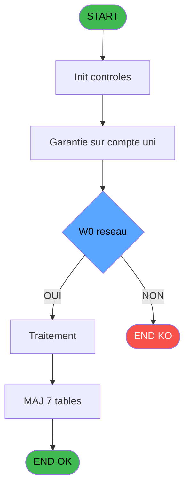
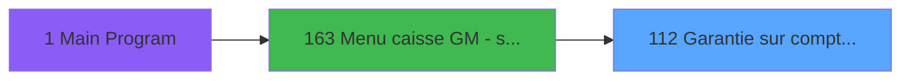
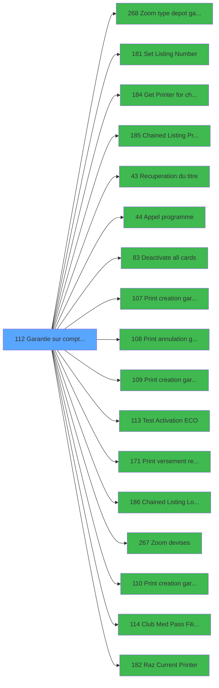

# ADH IDE 112 - Garantie sur compte PMS-584

> **Analyse**: Phases 1-4 2026-02-07 03:49 -> 02:52 (23h03min) | Assemblage 02:52
> **Pipeline**: V7.2 Enrichi
> **Structure**: 4 onglets (Resume | Ecrans | Donnees | Connexions)

<!-- TAB:Resume -->

## 1. FICHE D'IDENTITE

| Attribut | Valeur |
|----------|--------|
| Projet | ADH |
| IDE Position | 112 |
| Nom Programme | Garantie sur compte PMS-584 |
| Fichier source | `Prg_112.xml` |
| Dossier IDE | Comptabilite |
| Taches | 29 (4 ecrans visibles) |
| Tables modifiees | 7 |
| Programmes appeles | 17 |
| Complexite | **MOYENNE** (score 48/100) |

## 2. DESCRIPTION FONCTIONNELLE

ADH IDE 112 gère la création et l'annulation de garanties (dépôts de garantie) sur un compte client. Le programme s'appuie sur une grille de dépôts existants qu'il affiche en scroll, permettant au caissier de visualiser tous les dépôts actifs, leurs montants par devise, et leurs statuts. L'interface offre des actions contextuelles : création d'un nouveau dépôt (avec saisie du montant et de la devise), annulation d'un dépôt existant, et impression de justificatifs.

La logique métier valide que le montant du dépôt ne dépasse pas les limites autorisées par type de garantie (récupérées via le zoom IDE 268), calcule les équivalents en devise de compensation (utilisant le zoom IDE 267 pour les taux), et met à jour le solde du compte. Chaque opération génère un justicatif imprimé via les programmes d'édition spécialisés (IDE 107-110), avec traçabilité comptable dans les tables `depot_garantie` et `pv_accounting_date`.

Le programme intègre également un test de connectivité réseau (probable détection de disponibilité d'imprimante réseau), gère les défaillances d'impression gracieusement, et enregistre les opérations dans le log Booker pour audit. La gestion des dépôts TIK (test activation ECO IDE 113) et Club Med Pass (IDE 114) suggère des règles métier spécifiques par type de carte.

## 3. BLOCS FONCTIONNELS

### 3.1 Traitement (17 taches)

Traitements internes.

---

#### 112 - (sans nom)

**Role** : Tache d'orchestration : point d'entree du programme (17 sous-taches). Coordonne l'enchainement des traitements.

16 sous-taches directes

| Tache | Nom | Bloc |
|-------|-----|------|
| [112.1](#t2) | Test reseau | Traitement |
| [112.2](#t3) | Depôt de garantie **[[ECRAN]](#ecran-t3)** | Traitement |
| [112.2.2](#t5) | Scroll depôt objet | Traitement |
| [112.2.4](#t7) | MAJ solde devise depot | Traitement |
| [112.2.5](#t8) | CARD? | Traitement |
| [112.2.6](#t9) | CARD? | Traitement |
| [112.2.7](#t10) | Abandon | Traitement |
| [112.2.8](#t11) | SendMail | Traitement |
| [112.2.11](#t18) | MAJ CMP | Traitement |
| [112.2.12](#t19) | Param OK ? | Traitement |
| [112.2.13](#t20) | Param OK ? | Traitement |
| [112.2.14](#t21) | Envoi mail garantie | Traitement |
| [112.2.15](#t22) | Envoi mail garantie | Traitement |
| [112.3](#t24) | Depôt de garantie **[[ECRAN]](#ecran-t24)** | Traitement |
| [112.3.1](#t25) | Scroll depôt objet | Traitement |
| [112.3.3](#t27) | MAJ solde devise depot | Traitement |

---

#### 112.1 - Test reseau

**Role** : Verification : Test reseau.
**Variables liees** : FE (W0 reseau)

---

#### 112.2 - Depôt de garantie [[ECRAN]](#ecran-t3)

**Role** : Traitement : Depôt de garantie.
**Ecran** : 810 x 285 DLU (MDI) | [Voir mockup](#ecran-t3)
**Variables liees** : FM (W0 montant depôt), FP (W0 etat depôt), FS (W0 conf reactivation Garantie), GC (W0 imprime garantie ?), GD (W0 imprime annul garantie ?)

---

#### 112.2.2 - Scroll depôt objet

**Role** : Traitement : Scroll depôt objet.
**Variables liees** : FM (W0 montant depôt), FP (W0 etat depôt), GX (CHG_REASON_W0 type depôt), GY (CHG_PRV_W0 type depôt)

---

#### 112.2.4 - MAJ solde devise depot

**Role** : Consultation/chargement : MAJ solde devise depot.
**Variables liees** : FL (W0 devise), EQ (> devise locale), EU (> flag depot), EX (> solde compte), EZ (> date solde)

---

#### 112.2.5 - CARD?

**Role** : Traitement : CARD?.

---

#### 112.2.6 - CARD?

**Role** : Traitement : CARD?.

---

#### 112.2.7 - Abandon

**Role** : Traitement : Abandon.

---

#### 112.2.8 - SendMail

**Role** : Traitement : SendMail.

---

#### 112.2.11 - MAJ CMP

**Role** : Traitement : MAJ CMP.

---

#### 112.2.12 - Param OK ?

**Role** : Traitement : Param OK ?.

---

#### 112.2.13 - Param OK ?

**Role** : Traitement : Param OK ?.

---

#### 112.2.14 - Envoi mail garantie

**Role** : Traitement : Envoi mail garantie.
**Variables liees** : FS (W0 conf reactivation Garantie), GC (W0 imprime garantie ?), GD (W0 imprime annul garantie ?), GK (W0 Adresse Email), FG (V.Création Garantie)

---

#### 112.2.15 - Envoi mail garantie

**Role** : Traitement : Envoi mail garantie.
**Variables liees** : FS (W0 conf reactivation Garantie), GC (W0 imprime garantie ?), GD (W0 imprime annul garantie ?), GK (W0 Adresse Email), FG (V.Création Garantie)

---

#### 112.3 - Depôt de garantie [[ECRAN]](#ecran-t24)

**Role** : Traitement : Depôt de garantie.
**Ecran** : 784 x 251 DLU (MDI) | [Voir mockup](#ecran-t24)
**Variables liees** : FM (W0 montant depôt), FP (W0 etat depôt), FS (W0 conf reactivation Garantie), GC (W0 imprime garantie ?), GD (W0 imprime annul garantie ?)

---

#### 112.3.1 - Scroll depôt objet

**Role** : Traitement : Scroll depôt objet.
**Variables liees** : FM (W0 montant depôt), FP (W0 etat depôt), GX (CHG_REASON_W0 type depôt), GY (CHG_PRV_W0 type depôt)

---

#### 112.3.3 - MAJ solde devise depot

**Role** : Consultation/chargement : MAJ solde devise depot.
**Variables liees** : FL (W0 devise), EQ (> devise locale), EU (> flag depot), EX (> solde compte), EZ (> date solde)

### 3.2 Calcul (5 taches)

Calculs metier : montants, stocks, compteurs.

---

#### 112.2.1 - Calcul flag

**Role** : Calcul : Calcul flag.
**Variables liees** : GQ (v.flag validation signature), GR (v.flag recup fichier Ticket), EU (> flag depot)

---

#### 112.2.9.1 - Recup compteur verst/retrait

**Role** : Calcul : Recup compteur verst/retrait.
**Variables liees** : GR (v.flag recup fichier Ticket)

---

#### 112.2.10.1 - Recup compteur verst/retrait

**Role** : Calcul : Recup compteur verst/retrait.
**Variables liees** : GR (v.flag recup fichier Ticket)

---

#### 112.3.4 - Calcul flag

**Role** : Calcul : Calcul flag.
**Variables liees** : GQ (v.flag validation signature), GR (v.flag recup fichier Ticket), EU (> flag depot)

---

#### 112.4 - Reaffichage info compte

**Role** : Reinitialisation : Reaffichage info compte.
**Variables liees** : EX (> solde compte), EY (> etat compte)

### 3.3 Saisie (2 taches)

L'operateur saisit les donnees de la transaction via 2 ecrans (Saisie depôt objet, Saisie depôt objet).

---

#### 112.2.3 - Saisie depôt objet [[ECRAN]](#ecran-t6)

**Role** : Saisie des donnees : Saisie depôt objet.
**Ecran** : 591 x 108 DLU (Modal) | [Voir mockup](#ecran-t6)
**Variables liees** : FM (W0 montant depôt), FP (W0 etat depôt), GO (v.Saisie mail proposée), GX (CHG_REASON_W0 type depôt), GY (CHG_PRV_W0 type depôt)

---

#### 112.3.2 - Saisie depôt objet [[ECRAN]](#ecran-t26)

**Role** : Saisie des donnees : Saisie depôt objet.
**Ecran** : 546 x 80 DLU (Modal) | [Voir mockup](#ecran-t26)
**Variables liees** : FM (W0 montant depôt), FP (W0 etat depôt), GO (v.Saisie mail proposée), GX (CHG_REASON_W0 type depôt), GY (CHG_PRV_W0 type depôt)

### 3.4 Creation (2 taches)

Insertion de nouveaux enregistrements en base.

---

#### 112.2.9 - Creation Versement v2

**Role** : Creation d'enregistrement : Creation Versement v2.
**Variables liees** : FV (W0 Operateur creation), FW (W0 Date creation), FX (W0 Time creation), GP (v.versement enregistré)
**Delegue a** : [Print creation garantie (IDE 107)](ADH-IDE-107.md), [Print creation garantie TIK V1 (IDE 109)](ADH-IDE-109.md), [Print creation garanti PMS-584 (IDE 110)](ADH-IDE-110.md)

---

#### 112.2.10 - Creation Versement T2H

**Role** : Creation d'enregistrement : Creation Versement T2H.
**Variables liees** : FV (W0 Operateur creation), FW (W0 Date creation), FX (W0 Time creation), GP (v.versement enregistré)
**Delegue a** : [Print creation garantie (IDE 107)](ADH-IDE-107.md), [Print creation garantie TIK V1 (IDE 109)](ADH-IDE-109.md), [Print creation garanti PMS-584 (IDE 110)](ADH-IDE-110.md)

### 3.5 Impression (2 taches)

Generation des documents et tickets.

---

#### 112.2.9.2 - Création reedition_ticket

**Role** : Generation du document : Création reedition_ticket.
**Variables liees** : FG (V.Création Garantie)
**Delegue a** : [Get Printer for chained list (IDE 184)](ADH-IDE-184.md), [Chained Listing Printer Choice (IDE 185)](ADH-IDE-185.md), [Print creation garantie (IDE 107)](ADH-IDE-107.md)

---

#### 112.2.10.2 - Création reedition_ticket

**Role** : Generation du document : Création reedition_ticket.
**Variables liees** : FG (V.Création Garantie)
**Delegue a** : [Get Printer for chained list (IDE 184)](ADH-IDE-184.md), [Chained Listing Printer Choice (IDE 185)](ADH-IDE-185.md), [Print creation garantie (IDE 107)](ADH-IDE-107.md)

### 3.6 Reglement (1 tache)

Gestion des moyens de paiement : 1 tache de reglement.

---

#### 112.2.16 - Vérif Mop mobilité

**Role** : Traitement : Vérif Mop mobilité.
**Variables liees** : GS (v.Verif Mop mobilité)

## 5. REGLES METIER

6 regles identifiees:

### Saisie (3 regles)

#### [RM-002] Condition: W0 reseau [R]<>'R' AND > change uni/bi ? [N] different de 'B'

| Element | Detail |
|---------|--------|
| **Condition** | `W0 reseau [R]<>'R' AND > change uni/bi ? [N]<>'B'` |
| **Si vrai** | Action si vrai |
| **Variables** | FE (W0 reseau), FA (> change uni/bi ?) |
| **Expression source** | Expression 3 : `W0 reseau [R]<>'R' AND > change uni/bi ? [N]<>'B'` |
| **Exemple** | Si W0 reseau [R]<>'R' AND > change uni/bi ? [N]<>'B' → Action si vrai |
| **Impact** | Bloc Saisie |

#### [RM-003] Condition: W0 reseau [R]<>'R' AND > change uni/bi ? [N] egale 'B'

| Element | Detail |
|---------|--------|
| **Condition** | `W0 reseau [R]<>'R' AND > change uni/bi ? [N]='B'` |
| **Si vrai** | Action si vrai |
| **Variables** | FE (W0 reseau), FA (> change uni/bi ?) |
| **Expression source** | Expression 4 : `W0 reseau [R]<>'R' AND > change uni/bi ? [N]='B'` |
| **Exemple** | Si W0 reseau [R]<>'R' AND > change uni/bi ? [N]='B' → Action si vrai |
| **Impact** | Bloc Saisie |

#### [RM-004] Condition: W0 fin tache [S] egale 'F'

| Element | Detail |
|---------|--------|
| **Condition** | `W0 fin tache [S]='F'` |
| **Si vrai** | Action si vrai |
| **Variables** | FF (W0 fin tache) |
| **Expression source** | Expression 6 : `W0 fin tache [S]='F'` |
| **Exemple** | Si W0 fin tache [S]='F' → Action si vrai |
| **Impact** | Bloc Saisie |

### Autres (3 regles)

#### [RM-001] Condition: > societe [A] egale

| Element | Detail |
|---------|--------|
| **Condition** | `> societe [A]=''` |
| **Si vrai** | Action si vrai |
| **Variables** | EN (> societe) |
| **Expression source** | Expression 1 : `> societe [A]=''` |
| **Exemple** | Si > societe [A]='' → Action si vrai |

#### [RM-005] Condition composite: V.Création Garantie [T] AND VG64

| Element | Detail |
|---------|--------|
| **Condition** | `V.Création Garantie [T] AND VG64` |
| **Si vrai** | Action si vrai |
| **Variables** | FG (V.Création Garantie) |
| **Expression source** | Expression 8 : `V.Création Garantie [T] AND VG64` |
| **Exemple** | Si V.Création Garantie [T] AND VG64 → Action si vrai |
| **Impact** | [112.2.9.2 - Création reedition_ticket](#t14) |

#### [RM-006] Condition composite: NOT(v.Session caisse ouverte? [V]) AND NOT(VG3)

| Element | Detail |
|---------|--------|
| **Condition** | `NOT(v.Session caisse ouverte? [V]) AND NOT(VG3)` |
| **Si vrai** | Action si vrai |
| **Variables** | FI (v.Session caisse ouverte?) |
| **Expression source** | Expression 10 : `NOT(v.Session caisse ouverte? [V]) AND NOT(VG3)` |
| **Exemple** | Si NOT(v.Session caisse ouverte? [V]) AND NOT(VG3) → Action si vrai |

## 6. CONTEXTE

- **Appele par**: [Menu caisse GM - scroll (IDE 163)](ADH-IDE-163.md)
- **Appelle**: 17 programmes | **Tables**: 22 (W:7 R:5 L:16) | **Taches**: 29 | **Expressions**: 10

<!-- TAB:Ecrans -->

## 8. ECRANS

### 8.1 Forms visibles (4 / 29)

| # | Position | Tache | Nom | Type | Largeur | Hauteur | Bloc |
|---|----------|-------|-----|------|---------|---------|------|
| 1 | 112.2 | 112.2 | Depôt de garantie | MDI | 810 | 285 | Traitement |
| 2 | 112.2.3 | 112.2.3 | Saisie depôt objet | Modal | 591 | 108 | Saisie |
| 3 | 112.3 | 112.3 | Depôt de garantie | MDI | 784 | 251 | Traitement |
| 4 | 112.3.2 | 112.3.2 | Saisie depôt objet | Modal | 546 | 80 | Saisie |

### 8.2 Mockups Ecrans

---

#### 112.2 - Depôt de garantie
**Tache** : [112.2](#t3) | **Type** : MDI | **Dimensions** : 810 x 285 DLU
**Bloc** : Traitement | **Titre IDE** : Depôt de garantie

<!-- FORM-DATA:
{
    "width":  810,
    "vFactor":  8,
    "type":  "MDI",
    "hFactor":  8,
    "controls":  [
                     {
                         "x":  4,
                         "type":  "label",
                         "var":  "",
                         "y":  1,
                         "w":  800,
                         "fmt":  "",
                         "name":  "",
                         "h":  20,
                         "color":  "",
                         "text":  "",
                         "parent":  null
                     },
                     {
                         "x":  43,
                         "type":  "label",
                         "var":  "",
                         "y":  25,
                         "w":  716,
                         "fmt":  "",
                         "name":  "",
                         "h":  90,
                         "color":  "",
                         "text":  "",
                         "parent":  null
                     },
                     {
                         "x":  3,
                         "type":  "label",
                         "var":  "",
                         "y":  258,
                         "w":  803,
                         "fmt":  "",
                         "name":  "",
                         "h":  24,
                         "color":  "",
                         "text":  "",
                         "parent":  null
                     },
                     {
                         "x":  64,
                         "type":  "label",
                         "var":  "",
                         "y":  28,
                         "w":  674,
                         "fmt":  "",
                         "name":  "",
                         "h":  78,
                         "color":  "195",
                         "text":  "Dépôt.",
                         "parent":  4
                     },
                     {
                         "x":  127,
                         "type":  "edit",
                         "var":  "",
                         "y":  90,
                         "w":  59,
                         "fmt":  "",
                         "name":  "W0 type depôt",
                         "h":  10,
                         "color":  "6",
                         "text":  "",
                         "parent":  7
                     },
                     {
                         "x":  127,
                         "type":  "edit",
                         "var":  "",
                         "y":  69,
                         "w":  235,
                         "fmt":  "",
                         "name":  "",
                         "h":  11,
                         "color":  "146",
                         "text":  "",
                         "parent":  7
                     },
                     {
                         "x":  205,
                         "type":  "edit",
                         "var":  "",
                         "y":  90,
                         "w":  48,
                         "fmt":  "",
                         "name":  "W0 devise",
                         "h":  10,
                         "color":  "6",
                         "text":  "",
                         "parent":  7
                     },
                     {
                         "x":  272,
                         "type":  "edit",
                         "var":  "",
                         "y":  90,
                         "w":  115,
                         "fmt":  "#########Z",
                         "name":  "W0 montant depôt",
                         "h":  10,
                         "color":  "6",
                         "text":  "",
                         "parent":  7
                     },
                     {
                         "x":  546,
                         "type":  "checkbox",
                         "var":  "",
                         "y":  69,
                         "w":  178,
                         "fmt":  "",
                         "name":  "v_Express_Chek_out",
                         "h":  12,
                         "color":  "",
                         "text":  "Easy Check-Out",
                         "parent":  null
                     },
                     {
                         "x":  9,
                         "type":  "button",
                         "var":  "",
                         "y":  261,
                         "w":  154,
                         "fmt":  "20",
                         "name":  "Btn Valider",
                         "h":  18,
                         "color":  "",
                         "text":  "",
                         "parent":  6
                     },
                     {
                         "x":  597,
                         "type":  "edit",
                         "var":  "",
                         "y":  6,
                         "w":  203,
                         "fmt":  "WWW DD MMM YYYYT",
                         "name":  "",
                         "h":  8,
                         "color":  "",
                         "text":  "",
                         "parent":  1
                     },
                     {
                         "x":  14,
                         "type":  "edit",
                         "var":  "",
                         "y":  7,
                         "w":  267,
                         "fmt":  "20",
                         "name":  "",
                         "h":  8,
                         "color":  "",
                         "text":  "",
                         "parent":  1
                     },
                     {
                         "x":  217,
                         "type":  "edit",
                         "var":  "",
                         "y":  38,
                         "w":  397,
                         "fmt":  "40",
                         "name":  "",
                         "h":  10,
                         "color":  "",
                         "text":  "",
                         "parent":  7
                     },
                     {
                         "x":  187,
                         "type":  "edit",
                         "var":  "",
                         "y":  54,
                         "w":  456,
                         "fmt":  "100",
                         "name":  "",
                         "h":  8,
                         "color":  "",
                         "text":  "",
                         "parent":  7
                     },
                     {
                         "x":  406,
                         "type":  "edit",
                         "var":  "",
                         "y":  90,
                         "w":  309,
                         "fmt":  "30",
                         "name":  "",
                         "h":  10,
                         "color":  "142",
                         "text":  "",
                         "parent":  7
                     },
                     {
                         "x":  16,
                         "type":  "image",
                         "var":  "",
                         "y":  159,
                         "w":  160,
                         "fmt":  "",
                         "name":  "",
                         "h":  62,
                         "color":  "",
                         "text":  "",
                         "parent":  null
                     },
                     {
                         "x":  172,
                         "type":  "button",
                         "var":  "",
                         "y":  261,
                         "w":  154,
                         "fmt":  "A\u0026bandon",
                         "name":  "Abandon",
                         "h":  18,
                         "color":  "",
                         "text":  "",
                         "parent":  6
                     },
                     {
                         "x":  643,
                         "type":  "button",
                         "var":  "",
                         "y":  261,
                         "w":  154,
                         "fmt":  "Printer",
                         "name":  "",
                         "h":  18,
                         "color":  "",
                         "text":  "",
                         "parent":  6
                     },
                     {
                         "x":  482,
                         "type":  "button",
                         "var":  "",
                         "y":  261,
                         "w":  154,
                         "fmt":  "Ticket",
                         "name":  "Visu Ticket",
                         "h":  18,
                         "color":  "",
                         "text":  "",
                         "parent":  null
                     }
                 ],
    "taskId":  "112.2",
    "height":  285
}
-->

<strong>Champs : 10 champs</strong>

| Pos (x,y) | Nom | Variable | Type |
|-----------|-----|----------|------|
| 127,90 | W0 type depôt | - | edit |
| 127,69 | (sans nom) | - | edit |
| 205,90 | W0 devise | - | edit |
| 272,90 | W0 montant depôt | - | edit |
| 546,69 | v_Express_Chek_out | - | checkbox |
| 597,6 | WWW DD MMM YYYYT | - | edit |
| 14,7 | 20 | - | edit |
| 217,38 | 40 | - | edit |
| 187,54 | 100 | - | edit |
| 406,90 | 30 | - | edit |

<strong>Boutons : 4 boutons</strong>

| Bouton | Pos (x,y) | Action |
|--------|-----------|--------|
| 20 | 9,261 | Bouton fonctionnel |
| Abandon | 172,261 | Annule et retour au menu |
| Printer | 643,261 | Appel [Get Printer for chained list (IDE 184)](ADH-IDE-184.md) |
| Ticket | 482,261 | Lance l'impression |

---

#### 112.2.3 - Saisie depôt objet
**Tache** : [112.2.3](#t6) | **Type** : Modal | **Dimensions** : 591 x 108 DLU
**Bloc** : Saisie | **Titre IDE** : Saisie depôt objet

<!-- FORM-DATA:
{
    "width":  591,
    "vFactor":  8,
    "type":  "Modal",
    "hFactor":  8,
    "controls":  [
                     {
                         "x":  79,
                         "type":  "label",
                         "var":  "",
                         "y":  19,
                         "w":  278,
                         "fmt":  "",
                         "name":  "",
                         "h":  88,
                         "color":  "",
                         "text":  "",
                         "parent":  null
                     },
                     {
                         "x":  81,
                         "type":  "label",
                         "var":  "",
                         "y":  20,
                         "w":  274,
                         "fmt":  "",
                         "name":  "",
                         "h":  86,
                         "color":  "",
                         "text":  "",
                         "parent":  null
                     },
                     {
                         "x":  104,
                         "type":  "label",
                         "var":  "",
                         "y":  27,
                         "w":  226,
                         "fmt":  "",
                         "name":  "",
                         "h":  64,
                         "color":  "",
                         "text":  "",
                         "parent":  null
                     },
                     {
                         "x":  107,
                         "type":  "label",
                         "var":  "",
                         "y":  28,
                         "w":  44,
                         "fmt":  "",
                         "name":  "",
                         "h":  62,
                         "color":  "",
                         "text":  "",
                         "parent":  null
                     },
                     {
                         "x":  158,
                         "type":  "label",
                         "var":  "",
                         "y":  31,
                         "w":  160,
                         "fmt":  "",
                         "name":  "",
                         "h":  8,
                         "color":  "7",
                         "text":  "Annulation",
                         "parent":  null
                     },
                     {
                         "x":  158,
                         "type":  "label",
                         "var":  "",
                         "y":  43,
                         "w":  160,
                         "fmt":  "",
                         "name":  "",
                         "h":  8,
                         "color":  "7",
                         "text":  "Nouveau dépôt",
                         "parent":  null
                     },
                     {
                         "x":  158,
                         "type":  "label",
                         "var":  "",
                         "y":  55,
                         "w":  160,
                         "fmt":  "",
                         "name":  "",
                         "h":  8,
                         "color":  "7",
                         "text":  "Modification",
                         "parent":  null
                     },
                     {
                         "x":  158,
                         "type":  "label",
                         "var":  "",
                         "y":  66,
                         "w":  160,
                         "fmt":  "",
                         "name":  "",
                         "h":  8,
                         "color":  "7",
                         "text":  "Réactivation",
                         "parent":  null
                     },
                     {
                         "x":  158,
                         "type":  "label",
                         "var":  "",
                         "y":  78,
                         "w":  160,
                         "fmt":  "",
                         "name":  "",
                         "h":  8,
                         "color":  "7",
                         "text":  "Quitter",
                         "parent":  null
                     },
                     {
                         "x":  140,
                         "type":  "label",
                         "var":  "",
                         "y":  94,
                         "w":  120,
                         "fmt":  "",
                         "name":  "",
                         "h":  8,
                         "color":  "",
                         "text":  "Votre choix",
                         "parent":  null
                     },
                     {
                         "x":  259,
                         "type":  "edit",
                         "var":  "",
                         "y":  93,
                         "w":  26,
                         "fmt":  "",
                         "name":  "W1 choix action",
                         "h":  10,
                         "color":  "6",
                         "text":  "",
                         "parent":  null
                     },
                     {
                         "x":  0,
                         "type":  "edit",
                         "var":  "",
                         "y":  2,
                         "w":  575,
                         "fmt":  "100",
                         "name":  "",
                         "h":  8,
                         "color":  "143",
                         "text":  "",
                         "parent":  null
                     },
                     {
                         "x":  118,
                         "type":  "button",
                         "var":  "",
                         "y":  31,
                         "w":  22,
                         "fmt":  "A",
                         "name":  "A",
                         "h":  9,
                         "color":  "",
                         "text":  "",
                         "parent":  null
                     },
                     {
                         "x":  118,
                         "type":  "button",
                         "var":  "",
                         "y":  42,
                         "w":  22,
                         "fmt":  "D",
                         "name":  "D",
                         "h":  10,
                         "color":  "",
                         "text":  "",
                         "parent":  null
                     },
                     {
                         "x":  118,
                         "type":  "button",
                         "var":  "",
                         "y":  54,
                         "w":  22,
                         "fmt":  "M",
                         "name":  "M",
                         "h":  10,
                         "color":  "",
                         "text":  "",
                         "parent":  null
                     },
                     {
                         "x":  118,
                         "type":  "button",
                         "var":  "",
                         "y":  65,
                         "w":  22,
                         "fmt":  "R",
                         "name":  "R",
                         "h":  10,
                         "color":  "",
                         "text":  "",
                         "parent":  null
                     },
                     {
                         "x":  118,
                         "type":  "button",
                         "var":  "",
                         "y":  76,
                         "w":  22,
                         "fmt":  "Q",
                         "name":  "Q",
                         "h":  10,
                         "color":  "",
                         "text":  "",
                         "parent":  null
                     }
                 ],
    "taskId":  "112.2.3",
    "height":  108
}
-->

<strong>Champs : 2 champs</strong>

| Pos (x,y) | Nom | Variable | Type |
|-----------|-----|----------|------|
| 259,93 | W1 choix action | - | edit |
| 0,2 | 100 | - | edit |

<strong>Boutons : 5 boutons</strong>

| Bouton | Pos (x,y) | Action |
|--------|-----------|--------|
| A | 118,31 | Bouton fonctionnel |
| D | 118,42 | Bouton fonctionnel |
| M | 118,54 | Bouton fonctionnel |
| R | 118,65 | Bouton fonctionnel |
| Q | 118,76 | Bouton fonctionnel |

---

#### 112.3 - Depôt de garantie
**Tache** : [112.3](#t24) | **Type** : MDI | **Dimensions** : 784 x 251 DLU
**Bloc** : Traitement | **Titre IDE** : Depôt de garantie

<!-- FORM-DATA:
{
    "width":  784,
    "vFactor":  8,
    "type":  "MDI",
    "hFactor":  8,
    "controls":  [
                     {
                         "x":  4,
                         "type":  "label",
                         "var":  "",
                         "y":  0,
                         "w":  776,
                         "fmt":  "",
                         "name":  "",
                         "h":  19,
                         "color":  "",
                         "text":  "",
                         "parent":  null
                     },
                     {
                         "x":  6,
                         "type":  "label",
                         "var":  "",
                         "y":  23,
                         "w":  764,
                         "fmt":  "",
                         "name":  "",
                         "h":  101,
                         "color":  "",
                         "text":  "",
                         "parent":  null
                     },
                     {
                         "x":  4,
                         "type":  "label",
                         "var":  "",
                         "y":  225,
                         "w":  776,
                         "fmt":  "",
                         "name":  "",
                         "h":  24,
                         "color":  "",
                         "text":  "",
                         "parent":  null
                     },
                     {
                         "x":  19,
                         "type":  "label",
                         "var":  "",
                         "y":  27,
                         "w":  738,
                         "fmt":  "",
                         "name":  "",
                         "h":  87,
                         "color":  "195",
                         "text":  "Dépôt",
                         "parent":  null
                     },
                     {
                         "x":  276,
                         "type":  "label",
                         "var":  "",
                         "y":  40,
                         "w":  8,
                         "fmt":  "",
                         "name":  "",
                         "h":  8,
                         "color":  "155",
                         "text":  "Û",
                         "parent":  7
                     },
                     {
                         "x":  495,
                         "type":  "label",
                         "var":  "",
                         "y":  56,
                         "w":  8,
                         "fmt":  "",
                         "name":  "",
                         "h":  8,
                         "color":  "155",
                         "text":  "Û",
                         "parent":  7
                     },
                     {
                         "x":  378,
                         "type":  "label",
                         "var":  "",
                         "y":  57,
                         "w":  19,
                         "fmt":  "",
                         "name":  "",
                         "h":  8,
                         "color":  "",
                         "text":  "à",
                         "parent":  7
                     },
                     {
                         "x":  76,
                         "type":  "label",
                         "var":  "",
                         "y":  59,
                         "w":  88,
                         "fmt":  "",
                         "name":  "",
                         "h":  8,
                         "color":  "4",
                         "text":  "Effectué le",
                         "parent":  7
                     },
                     {
                         "x":  495,
                         "type":  "label",
                         "var":  "",
                         "y":  64,
                         "w":  8,
                         "fmt":  "",
                         "name":  "",
                         "h":  8,
                         "color":  "155",
                         "text":  "Û",
                         "parent":  7
                     },
                     {
                         "x":  495,
                         "type":  "label",
                         "var":  "",
                         "y":  72,
                         "w":  8,
                         "fmt":  "",
                         "name":  "",
                         "h":  8,
                         "color":  "155",
                         "text":  "Û",
                         "parent":  7
                     },
                     {
                         "x":  180,
                         "type":  "edit",
                         "var":  "",
                         "y":  57,
                         "w":  182,
                         "fmt":  "WWW DD MMM YYYYT",
                         "name":  "",
                         "h":  10,
                         "color":  "6",
                         "text":  "",
                         "parent":  7
                     },
                     {
                         "x":  407,
                         "type":  "edit",
                         "var":  "",
                         "y":  57,
                         "w":  88,
                         "fmt":  "HH:MM:SS",
                         "name":  "",
                         "h":  10,
                         "color":  "6",
                         "text":  "",
                         "parent":  7
                     },
                     {
                         "x":  76,
                         "type":  "edit",
                         "var":  "",
                         "y":  92,
                         "w":  59,
                         "fmt":  "",
                         "name":  "",
                         "h":  10,
                         "color":  "6",
                         "text":  "",
                         "parent":  7
                     },
                     {
                         "x":  76,
                         "type":  "edit",
                         "var":  "",
                         "y":  74,
                         "w":  238,
                         "fmt":  "",
                         "name":  "W0 libelle depôt",
                         "h":  10,
                         "color":  "6",
                         "text":  "",
                         "parent":  7
                     },
                     {
                         "x":  154,
                         "type":  "edit",
                         "var":  "",
                         "y":  92,
                         "w":  48,
                         "fmt":  "",
                         "name":  "W0 devise",
                         "h":  10,
                         "color":  "6",
                         "text":  "",
                         "parent":  7
                     },
                     {
                         "x":  221,
                         "type":  "edit",
                         "var":  "",
                         "y":  92,
                         "w":  149,
                         "fmt":  "",
                         "name":  "W0 montant depôt",
                         "h":  10,
                         "color":  "6",
                         "text":  "",
                         "parent":  7
                     },
                     {
                         "x":  12,
                         "type":  "button",
                         "var":  "",
                         "y":  228,
                         "w":  154,
                         "fmt":  "\u0026Ok",
                         "name":  "Btn Valider",
                         "h":  18,
                         "color":  "",
                         "text":  "",
                         "parent":  6
                     },
                     {
                         "x":  485,
                         "type":  "edit",
                         "var":  "",
                         "y":  5,
                         "w":  283,
                         "fmt":  "WWW DD MMM YYYYT",
                         "name":  "",
                         "h":  8,
                         "color":  "",
                         "text":  "",
                         "parent":  1
                     },
                     {
                         "x":  14,
                         "type":  "edit",
                         "var":  "",
                         "y":  6,
                         "w":  267,
                         "fmt":  "20",
                         "name":  "",
                         "h":  8,
                         "color":  "",
                         "text":  "",
                         "parent":  1
                     },
                     {
                         "x":  268,
                         "type":  "edit",
                         "var":  "",
                         "y":  35,
                         "w":  203,
                         "fmt":  "15",
                         "name":  "",
                         "h":  8,
                         "color":  "193",
                         "text":  "",
                         "parent":  7
                     },
                     {
                         "x":  390,
                         "type":  "edit",
                         "var":  "",
                         "y":  92,
                         "w":  350,
                         "fmt":  "30",
                         "name":  "",
                         "h":  10,
                         "color":  "7",
                         "text":  "",
                         "parent":  7
                     },
                     {
                         "x":  16,
                         "type":  "image",
                         "var":  "",
                         "y":  159,
                         "w":  160,
                         "fmt":  "",
                         "name":  "",
                         "h":  54,
                         "color":  "",
                         "text":  "",
                         "parent":  null
                     },
                     {
                         "x":  600,
                         "type":  "button",
                         "var":  "",
                         "y":  228,
                         "w":  168,
                         "fmt":  "Printer",
                         "name":  "",
                         "h":  18,
                         "color":  "",
                         "text":  "",
                         "parent":  6
                     },
                     {
                         "x":  172,
                         "type":  "button",
                         "var":  "",
                         "y":  228,
                         "w":  154,
                         "fmt":  "A\u0026bandonner",
                         "name":  "",
                         "h":  18,
                         "color":  "",
                         "text":  "",
                         "parent":  6
                     },
                     {
                         "x":  563,
                         "type":  "checkbox",
                         "var":  "",
                         "y":  74,
                         "w":  178,
                         "fmt":  "",
                         "name":  "v_Express_Chek_out",
                         "h":  12,
                         "color":  "",
                         "text":  "Easy Chek-Out",
                         "parent":  null
                     }
                 ],
    "taskId":  "112.3",
    "height":  251
}
-->

<strong>Champs : 11 champs</strong>

| Pos (x,y) | Nom | Variable | Type |
|-----------|-----|----------|------|
| 180,57 | WWW DD MMM YYYYT | - | edit |
| 407,57 | HH:MM:SS | - | edit |
| 76,92 | (sans nom) | - | edit |
| 76,74 | W0 libelle depôt | - | edit |
| 154,92 | W0 devise | - | edit |
| 221,92 | W0 montant depôt | - | edit |
| 485,5 | WWW DD MMM YYYYT | - | edit |
| 14,6 | 20 | - | edit |
| 268,35 | 15 | - | edit |
| 390,92 | 30 | - | edit |
| 563,74 | v_Express_Chek_out | - | checkbox |

<strong>Boutons : 3 boutons</strong>

| Bouton | Pos (x,y) | Action |
|--------|-----------|--------|
| Ok | 12,228 | Valide la saisie et enregistre |
| Printer | 600,228 | Appel [Get Printer for chained list (IDE 184)](ADH-IDE-184.md) |
| Abandonner | 172,228 | Annule et retour au menu |

---

#### 112.3.2 - Saisie depôt objet
**Tache** : [112.3.2](#t26) | **Type** : Modal | **Dimensions** : 546 x 80 DLU
**Bloc** : Saisie | **Titre IDE** : Saisie depôt objet

<!-- FORM-DATA:
{
    "width":  546,
    "vFactor":  8,
    "type":  "Modal",
    "hFactor":  8,
    "controls":  [
                     {
                         "x":  68,
                         "type":  "label",
                         "var":  "",
                         "y":  10,
                         "w":  280,
                         "fmt":  "",
                         "name":  "",
                         "h":  68,
                         "color":  "",
                         "text":  "",
                         "parent":  null
                     },
                     {
                         "x":  72,
                         "type":  "label",
                         "var":  "",
                         "y":  11,
                         "w":  275,
                         "fmt":  "",
                         "name":  "",
                         "h":  66,
                         "color":  "",
                         "text":  "",
                         "parent":  null
                     },
                     {
                         "x":  85,
                         "type":  "label",
                         "var":  "",
                         "y":  16,
                         "w":  242,
                         "fmt":  "",
                         "name":  "",
                         "h":  47,
                         "color":  "195",
                         "text":  "",
                         "parent":  null
                     },
                     {
                         "x":  86,
                         "type":  "label",
                         "var":  "",
                         "y":  17,
                         "w":  46,
                         "fmt":  "",
                         "name":  "",
                         "h":  45,
                         "color":  "1",
                         "text":  "",
                         "parent":  null
                     },
                     {
                         "x":  148,
                         "type":  "label",
                         "var":  "",
                         "y":  19,
                         "w":  117,
                         "fmt":  "",
                         "name":  "",
                         "h":  8,
                         "color":  "7",
                         "text":  "Annulation",
                         "parent":  null
                     },
                     {
                         "x":  148,
                         "type":  "label",
                         "var":  "",
                         "y":  29,
                         "w":  160,
                         "fmt":  "",
                         "name":  "",
                         "h":  8,
                         "color":  "7",
                         "text":  "Nouveau depôt",
                         "parent":  null
                     },
                     {
                         "x":  148,
                         "type":  "label",
                         "var":  "",
                         "y":  39,
                         "w":  131,
                         "fmt":  "",
                         "name":  "",
                         "h":  8,
                         "color":  "7",
                         "text":  "Modification",
                         "parent":  null
                     },
                     {
                         "x":  148,
                         "type":  "label",
                         "var":  "",
                         "y":  49,
                         "w":  131,
                         "fmt":  "",
                         "name":  "",
                         "h":  8,
                         "color":  "7",
                         "text":  "Quitter",
                         "parent":  null
                     },
                     {
                         "x":  89,
                         "type":  "label",
                         "var":  "",
                         "y":  66,
                         "w":  167,
                         "fmt":  "",
                         "name":  "",
                         "h":  8,
                         "color":  "",
                         "text":  "Choix action",
                         "parent":  null
                     },
                     {
                         "x":  263,
                         "type":  "edit",
                         "var":  "",
                         "y":  65,
                         "w":  26,
                         "fmt":  "",
                         "name":  "W1 choix action",
                         "h":  10,
                         "color":  "6",
                         "text":  "",
                         "parent":  null
                     },
                     {
                         "x":  1,
                         "type":  "edit",
                         "var":  "",
                         "y":  0,
                         "w":  413,
                         "fmt":  "60",
                         "name":  "",
                         "h":  8,
                         "color":  "143",
                         "text":  "",
                         "parent":  null
                     },
                     {
                         "x":  94,
                         "type":  "button",
                         "var":  "",
                         "y":  19,
                         "w":  30,
                         "fmt":  "A",
                         "name":  "A",
                         "h":  9,
                         "color":  "1",
                         "text":  "",
                         "parent":  null
                     },
                     {
                         "x":  94,
                         "type":  "button",
                         "var":  "",
                         "y":  29,
                         "w":  30,
                         "fmt":  "D",
                         "name":  "D",
                         "h":  9,
                         "color":  "1",
                         "text":  "",
                         "parent":  null
                     },
                     {
                         "x":  94,
                         "type":  "button",
                         "var":  "",
                         "y":  39,
                         "w":  30,
                         "fmt":  "M",
                         "name":  "M",
                         "h":  9,
                         "color":  "1",
                         "text":  "",
                         "parent":  null
                     },
                     {
                         "x":  94,
                         "type":  "button",
                         "var":  "",
                         "y":  49,
                         "w":  30,
                         "fmt":  "Q",
                         "name":  "Q",
                         "h":  9,
                         "color":  "1",
                         "text":  "",
                         "parent":  null
                     }
                 ],
    "taskId":  "112.3.2",
    "height":  80
}
-->

<strong>Champs : 2 champs</strong>

| Pos (x,y) | Nom | Variable | Type |
|-----------|-----|----------|------|
| 263,65 | W1 choix action | - | edit |
| 1,0 | 60 | - | edit |

<strong>Boutons : 4 boutons</strong>

| Bouton | Pos (x,y) | Action |
|--------|-----------|--------|
| A | 94,19 | Bouton fonctionnel |
| D | 94,29 | Bouton fonctionnel |
| M | 94,39 | Bouton fonctionnel |
| Q | 94,49 | Bouton fonctionnel |

## 9. NAVIGATION

### 9.1 Enchainement des ecrans

```mermaid
flowchart TD
    START([Entree])
    style START fill:#3fb950
    VF3[112.2 Depôt de garantie]
    style VF3 fill:#58a6ff
    VF6[112.2.3 Saisie depôt objet]
    style VF6 fill:#58a6ff
    VF24[112.3 Depôt de garantie]
    style VF24 fill:#58a6ff
    VF26[112.3.2 Saisie depôt objet]
    style VF26 fill:#58a6ff
    EXT268[IDE 268 Zoom type depo...]
    style EXT268 fill:#3fb950
    EXT181[IDE 181 Set Listing Nu...]
    style EXT181 fill:#3fb950
    EXT184[IDE 184 Get Printer fo...]
    style EXT184 fill:#3fb950
    EXT185[IDE 185 Chained Listin...]
    style EXT185 fill:#3fb950
    EXT43[IDE 43 Recuperation du...]
    style EXT43 fill:#3fb950
    EXT44[IDE 44 Appel programme]
    style EXT44 fill:#3fb950
    EXT83[IDE 83 Deactivate all ...]
    style EXT83 fill:#3fb950
    EXT107[IDE 107 Print creation...]
    style EXT107 fill:#3fb950
    EXT108[IDE 108 Print annulati...]
    style EXT108 fill:#3fb950
    EXT109[IDE 109 Print creation...]
    style EXT109 fill:#3fb950
    EXT113[IDE 113 Test Activatio...]
    style EXT113 fill:#3fb950
    EXT171[IDE 171 Print versemen...]
    style EXT171 fill:#3fb950
    EXT186[IDE 186 Chained Listin...]
    style EXT186 fill:#3fb950
    EXT267[IDE 267 Zoom devises]
    style EXT267 fill:#3fb950
    EXT110[IDE 110 Print creation...]
    style EXT110 fill:#3fb950
    EXT114[IDE 114 Club Med Pass ...]
    style EXT114 fill:#3fb950
    EXT182[IDE 182 Raz Current Pr...]
    style EXT182 fill:#3fb950
    FIN([Sortie])
    style FIN fill:#f85149
    START --> VF3
    VF3 -->|Selection/consultation| EXT268
    VF3 -->|Configuration impression| EXT181
    VF3 -->|Impression ticket/document| EXT184
    VF3 -->|Impression ticket/document| EXT185
    VF3 -->|Recuperation donnees| EXT43
    VF3 -->|Sous-programme| EXT44
    VF3 -->|Sous-programme| EXT83
    VF3 -->|Impression ticket/document| EXT107
    EXT182 --> FIN
```

**Detail par enchainement :**

| Depuis | Action | Vers | Retour |
|--------|--------|------|--------|
| Depôt de garantie | Selection/consultation | [Zoom type depot garantie (IDE 268)](ADH-IDE-268.md) | Retour ecran |
| Depôt de garantie | Configuration impression | [Set Listing Number (IDE 181)](ADH-IDE-181.md) | Retour ecran |
| Depôt de garantie | Impression ticket/document | [Get Printer for chained list (IDE 184)](ADH-IDE-184.md) | Retour ecran |
| Depôt de garantie | Impression ticket/document | [Chained Listing Printer Choice (IDE 185)](ADH-IDE-185.md) | Retour ecran |
| Depôt de garantie | Recuperation donnees | [Recuperation du titre (IDE 43)](ADH-IDE-43.md) | Retour ecran |
| Depôt de garantie | Sous-programme | [Appel programme (IDE 44)](ADH-IDE-44.md) | Retour ecran |
| Depôt de garantie | Sous-programme | [Deactivate all cards (IDE 83)](ADH-IDE-83.md) | Retour ecran |
| Depôt de garantie | Impression ticket/document | [Print creation garantie (IDE 107)](ADH-IDE-107.md) | Retour ecran |
| Depôt de garantie | Impression ticket/document | [Print annulation garantie (IDE 108)](ADH-IDE-108.md) | Retour ecran |
| Depôt de garantie | Impression ticket/document | [Print creation garantie TIK V1 (IDE 109)](ADH-IDE-109.md) | Retour ecran |
| Depôt de garantie | Sous-programme | [Test Activation ECO (IDE 113)](ADH-IDE-113.md) | Retour ecran |
| Depôt de garantie | Impression ticket/document | [Print versement retrait (IDE 171)](ADH-IDE-171.md) | Retour ecran |
| Depôt de garantie | Configuration impression | [Chained Listing Load Default (IDE 186)](ADH-IDE-186.md) | Retour ecran |
| Depôt de garantie | Selection/consultation | [Zoom devises (IDE 267)](ADH-IDE-267.md) | Retour ecran |
| Depôt de garantie | Impression ticket/document | [Print creation garanti PMS-584 (IDE 110)](ADH-IDE-110.md) | Retour ecran |
| Depôt de garantie | Sous-programme | [Club Med Pass Filiations (IDE 114)](ADH-IDE-114.md) | Retour ecran |
| Depôt de garantie | Impression ticket/document | [Raz Current Printer (IDE 182)](ADH-IDE-182.md) | Retour ecran |

### 9.3 Structure hierarchique (29 taches)

| Position | Tache | Type | Dimensions | Bloc |
|----------|-------|------|------------|------|
| **112.1** | [**(sans nom)** (112)](#t1) | MDI | - | Traitement |
| 112.1.1 | [Test reseau (112.1)](#t2) | MDI | - | |
| 112.1.2 | [Depôt de garantie (112.2)](#t3) [mockup](#ecran-t3) | MDI | 810x285 | |
| 112.1.3 | [Scroll depôt objet (112.2.2)](#t5) | Modal | - | |
| 112.1.4 | [MAJ solde devise depot (112.2.4)](#t7) | MDI | - | |
| 112.1.5 | [CARD? (112.2.5)](#t8) | MDI | - | |
| 112.1.6 | [CARD? (112.2.6)](#t9) | MDI | - | |
| 112.1.7 | [Abandon (112.2.7)](#t10) | MDI | - | |
| 112.1.8 | [SendMail (112.2.8)](#t11) | - | - | |
| 112.1.9 | [MAJ CMP (112.2.11)](#t18) | - | - | |
| 112.1.10 | [Param OK ? (112.2.12)](#t19) | - | - | |
| 112.1.11 | [Param OK ? (112.2.13)](#t20) | - | - | |
| 112.1.12 | [Envoi mail garantie (112.2.14)](#t21) | - | - | |
| 112.1.13 | [Envoi mail garantie (112.2.15)](#t22) | - | - | |
| 112.1.14 | [Depôt de garantie (112.3)](#t24) [mockup](#ecran-t24) | MDI | 784x251 | |
| 112.1.15 | [Scroll depôt objet (112.3.1)](#t25) | Modal | - | |
| 112.1.16 | [MAJ solde devise depot (112.3.3)](#t27) | MDI | - | |
| **112.2** | [**Calcul flag** (112.2.1)](#t4) | MDI | - | Calcul |
| 112.2.1 | [Recup compteur verst/retrait (112.2.9.1)](#t13) | MDI | - | |
| 112.2.2 | [Recup compteur verst/retrait (112.2.10.1)](#t16) | MDI | - | |
| 112.2.3 | [Calcul flag (112.3.4)](#t28) | MDI | - | |
| 112.2.4 | [Reaffichage info compte (112.4)](#t29) | MDI | - | |
| **112.3** | [**Saisie depôt objet** (112.2.3)](#t6) [mockup](#ecran-t6) | Modal | 591x108 | Saisie |
| 112.3.1 | [Saisie depôt objet (112.3.2)](#t26) [mockup](#ecran-t26) | Modal | 546x80 | |
| **112.4** | [**Creation Versement v2** (112.2.9)](#t12) | MDI | - | Creation |
| 112.4.1 | [Creation Versement T2H (112.2.10)](#t15) | MDI | - | |
| **112.5** | [**Création reedition_ticket** (112.2.9.2)](#t14) | - | - | Impression |
| 112.5.1 | [Création reedition_ticket (112.2.10.2)](#t17) | - | - | |
| **112.6** | [**Vérif Mop mobilité** (112.2.16)](#t23) | - | - | Reglement |

### 9.4 Algorigramme

> **Legende**: Vert = START/END OK | Rouge = END KO | Bleu = Decisions
> *Algorigramme auto-genere. Utiliser `/algorigramme` pour une synthese metier detaillee.*

<!-- TAB:Donnees -->

## 10. TABLES

### Tables utilisees (22)

| ID | Nom | Description | Type | R | W | L | Usages |
|----|-----|-------------|------|---|---|---|--------|
| 39 | depot_garantie___dga | Depots et garanties | DB | R | **W** | L | 6 |
| 31 | gm-complet_______gmc |  | DB | R | **W** | L | 4 |
| 47 | compte_gm________cgm | Comptes GM (generaux) | DB |   | **W** | L | 7 |
| 68 | compteurs________cpt | Comptes GM (generaux) | DB |   | **W** |   | 2 |
| 945 | Table_945 |  | MEM |   | **W** |   | 2 |
| 911 | log_booker |  | DB |   | **W** |   | 2 |
| 370 | pv_accounting_date |  | DB |   | **W** |   | 2 |
| 91 | garantie_________gar | Depots et garanties | DB | R |   | L | 5 |
| 30 | gm-recherche_____gmr | Index de recherche | DB | R |   |   | 2 |
| 23 | reseau_cloture___rec | Donnees reseau/cloture | DB | R |   |   | 2 |
| 40 | comptable________cte |  | DB |   |   | L | 2 |
| 285 | email |  | DB |   |   | L | 2 |
| 69 | initialisation___ini |  | DB |   |   | L | 2 |
| 66 | imputations______imp |  | DB |   |   | L | 2 |
| 70 | date_comptable___dat |  | DB |   |   | L | 2 |
| 88 | historik_station | Historique / journal | DB |   |   | L | 2 |
| 140 | moyen_paiement___mop |  | DB |   |   | L | 1 |
| 910 | classification_memory |  | DB |   |   | L | 1 |
| 50 | moyens_reglement_mor | Reglements / paiements | DB |   |   | L | 1 |
| 312 | ez_card |  | DB |   |   | L | 1 |
| 89 | moyen_paiement___mop |  | DB |   |   | L | 1 |
| 139 | moyens_reglement_mor | Reglements / paiements | DB |   |   | L | 1 |

### Colonnes par table (10 / 10 tables avec colonnes identifiees)

Table 39 - depot_garantie___dga (R/**W**/L) - 6 usages

| Lettre | Variable | Acces | Type |
|--------|----------|-------|------|
| EN | Lien Depot garantie | W | Logical |
| FS | W0 conf reactivation Garantie | W | Numeric |
| GC | W0 imprime garantie ? | W | Logical |
| GD | W0 imprime annul garantie ? | W | Logical |
| EU | > flag depot | W | Alpha |
| FB | > choix garantie | W | Alpha |
| FG | V.Création Garantie | W | Logical |
| FJ | v.Fichier ticket garantie | W | Alpha |

Table 31 - gm-complet_______gmc (R/**W**/L) - 4 usages

| Lettre | Variable | Acces | Type |
|--------|----------|-------|------|
| A | W1 fin tâche MAJ | W | Alpha |
| B | W0 choix action | W | Alpha |
| C | W0 carte de credit | W | Alpha |
| D | W0 test lien MOP | W | Numeric |
| E | W0 test lien MOR | W | Numeric |
| F | W0 type operation | W | Alpha |
| G | W0 date depôt | W | Date |
| H | W0 heure depôt | W | Time |
| I | W0 operateur | W | Alpha |
| J | W0 typ-depôt-numeric | W | Numeric |
| K | W0 type depôt | W | Alpha |
| L | W0 libelle depôt | W | Alpha |
| M | v_Express_Chek_out | W | Logical |
| N | v_Reponse | W | Numeric |
| O | W0 devise | W | Alpha |
| P | W0 montant depôt | W | Numeric |
| Q | W0 date retrait | W | Date |
| R | W0 heure retrait | W | Time |
| S | W0 etat depôt | W | Alpha |
| T | W0 validation | W | Alpha |
| U | W0 confirme annulation CMP | W | Numeric |
| V | W0 nb Club Med Pass | W | Numeric |
| W | v.titre | W | Alpha |
| X | Btn Valider | W | Alpha |

Table 47 - compte_gm________cgm (**W**/L) - 7 usages

| Lettre | Variable | Acces | Type |
|--------|----------|-------|------|
| ER | V.CompteurTicket | W | Numeric |
| EX | > solde compte | W | Numeric |
| EY | > etat compte | W | Alpha |

Table 68 - compteurs________cpt (**W**) - 2 usages

*Table utilisee uniquement en Link ou aucune colonne Real identifiee dans le DataView.*

Table 945 - Table_945 (**W**) - 2 usages

*Table utilisee uniquement en Link ou aucune colonne Real identifiee dans le DataView.*

Table 911 - log_booker (**W**) - 2 usages

| Lettre | Variable | Acces | Type |
|--------|----------|-------|------|
| A | Lien Depot garantie | W | Logical |
| B | v.Fichier envoi email | W | Alpha |

Table 370 - pv_accounting_date (**W**) - 2 usages

| Lettre | Variable | Acces | Type |
|--------|----------|-------|------|
| FN | W0 date retrait | W | Date |
| FW | W0 Date creation | W | Date |
| FZ | W0 Date annulation | W | Date |
| GT | v.Date&Heure alpha | W | Alpha |
| ET | W0 date depôt | W | Date |
| EV | v.date depôt | W | Date |
| EZ | > date solde | W | Date |
| FD | W0 date retrait | W | Date |

Table 91 - garantie_________gar (R/L) - 5 usages

| Lettre | Variable | Acces | Type |
|--------|----------|-------|------|
| EN | Lien Depot garantie | R | Logical |
| FS | W0 conf reactivation Garantie | R | Numeric |
| GC | W0 imprime garantie ? | R | Logical |
| GD | W0 imprime annul garantie ? | R | Logical |
| FB | > choix garantie | R | Alpha |
| FG | V.Création Garantie | R | Logical |
| FJ | v.Fichier ticket garantie | R | Alpha |

Table 30 - gm-recherche_____gmr (R) - 2 usages

| Lettre | Variable | Acces | Type |
|--------|----------|-------|------|
| A | v.mtt-mini-garant | R | Numeric |
| B | v.action D sans menu | R | Logical |
| C | v.choix action | R | Alpha |
| D | v.ctrl-msg-validez | R | Alpha |
| E | v.carte de credit | R | Alpha |
| F | v.test lien MOP | R | Numeric |
| G | v.test lien MOR | R | Numeric |
| H | v.type operation | R | Alpha |
| I | v.date depôt | R | Date |
| J | v.heure depôt | R | Time |
| K | v.operateur | R | Alpha |
| L | v.fin de tache | R | Logical |
| M | v.typ-depôt-numeric | R | Numeric |
| N | v.quitter zoom tg | R | Logical |
| O | v.type depôt | R | Alpha |
| P | v.libelle depôt | R | Alpha |
| Q | v.class | R | Alpha |
| R | v.Easy_Chek_out | R | Logical |
| S | v.Reponse | R | Numeric |
| T | v.Mop_class_origine | R | Unicode |
| U | v.Token Id | R | Unicode |
| V | v.Email client | R | Unicode |
| W | v.Fichier ticket garantie | R | Alpha |
| X | v.Decline mail GARANTMOB | R | Logical |
| Y | W0 devise | R | Alpha |
| Z | W0 montant depôt | R | Numeric |
| BA | W0 date retrait | R | Date |
| BB | W0 heure retrait | R | Time |
| BC | W0 etat depôt | R | Alpha |
| BD | W0 validation | R | Alpha |
| BE | W0 confirmation annulation EZ | R | Numeric |
| BF | W0 conf reactivation Garantie | R | Numeric |
| BG | W0 nb Club Med Pass | R | Numeric |
| BH | v.titre | R | Alpha |
| BI | W0 Operateur creation | R | Alpha |
| BJ | W0 Date creation | R | Date |
| BK | W0 Time creation | R | Time |
| BL | W0 Operateur annulation | R | Alpha |
| BM | W0 Date annulation | R | Date |
| BN | W0 Time annulation | R | Time |
| BO | Btn Valider | R | Alpha |
| BP | W0 imprime garantie ? | R | Logical |
| BQ | W0 imprime annul garantie ? | R | Logical |
| BR | W0 Transaction TPE validee ? | R | Logical |
| BS | W0 id dossier PMS | R | Alpha |
| BT | W0 Id dossier AXIS | R | Alpha |
| BU | W0 num dossier NA | R | Unicode |
| BV | W0 Num autorisation | R | Alpha |
| BW | W0 Message erreur | R | Alpha |
| BX | W0 Adresse Email | R | Alpha |
| BY | W0 Passage variable change | R | Logical |
| BZ | v.MailNomFichierPDF | R | Unicode |
| CA | v.Mail Deja Envoyé | R | Logical |
| CB | v.Saisie mail proposée | R | Logical |
| CC | v.versement enregistré | R | Logical |
| CD | v.flag validation signature | R | Logical |
| CE | v.flag recup fichier Ticket | R | Logical |
| CF | v.Verif Mop mobilité | R | Logical |
| CG | v.Date&Heure alpha | R | Alpha |
| CH | v.ConfirmSouscriptionECO | R | Numeric |
| CI | v.Confirm ECO (GAR2.00) ? | R | Numeric |
| CJ | Nb storke signature | R | Alpha |
| CK | CHG_REASON_W0 type depôt | R | Numeric |
| CL | CHG_PRV_W0 type depôt | R | Alpha |

Table 23 - reseau_cloture___rec (R) - 2 usages

| Lettre | Variable | Acces | Type |
|--------|----------|-------|------|
| A | V.ClotureEnCours | R | Logical |
| B | V.numero chrono | R | Numeric |
| C | V.montant | R | Numeric |
| D | V.ret-lien CTE ann. | R | Numeric |
| E | V.CompteurTicket | R | Numeric |

## 11. VARIABLES

### 11.1 Variables de session (16)

Variables persistantes pendant toute la session.

| Lettre | Nom | Type | Usage dans |
|--------|-----|------|-----------|
| FG | V.Création Garantie | Logical | [112.2](#t3), [112.2.14](#t21), [112.2.15](#t22) |
| FH | v.TPE ICMP ? | Logical | - |
| FI | v.Session caisse ouverte? | Logical | 1x session |
| FJ | v.Fichier ticket garantie | Alpha | - |
| FK | v.Decline mail GARANTMOB | Logical | - |
| FU | v.titre | Alpha | - |
| GM | v.MailNomFichierPDF | Unicode | - |
| GN | v.Mail Deja Envoyé | Logical | - |
| GO | v.Saisie mail proposée | Logical | - |
| GP | v.versement enregistré | Logical | - |
| GQ | v.flag validation signature | Logical | - |
| GR | v.flag recup fichier Ticket | Logical | - |
| GS | v.Verif Mop mobilité | Logical | - |
| GT | v.Date&Heure alpha | Alpha | - |
| GU | v.ConfirmSouscriptionECO | Numeric | - |
| GV | v.Confirm ECO (GAR2.00) ? | Numeric | - |

### 11.2 Variables de travail (27)

Variables internes au programme.

| Lettre | Nom | Type | Usage dans |
|--------|-----|------|-----------|
| FE | W0 reseau | Alpha | [112.1](#t2) |
| FF | W0 fin tache | Alpha | 1x calcul interne |
| FL | W0 devise | Alpha | - |
| FM | W0 montant depôt | Numeric | - |
| FN | W0 date retrait | Date | - |
| FO | W0 heure retrait | Time | - |
| FP | W0 etat depôt | Alpha | - |
| FQ | W0 validation | Alpha | - |
| FR | W0 confirmation annulation EZ | Numeric | - |
| FS | W0 conf reactivation Garantie | Numeric | - |
| FT | W0 nb Club Med Pass | Numeric | - |
| FV | W0 Operateur creation | Alpha | - |
| FW | W0 Date creation | Date | - |
| FX | W0 Time creation | Time | - |
| FY | W0 Operateur annulation | Alpha | - |
| FZ | W0 Date annulation | Date | - |
| GA | W0 Time annulation | Time | - |
| GC | W0 imprime garantie ? | Logical | - |
| GD | W0 imprime annul garantie ? | Logical | - |
| GE | W0 Transaction TPE validee ? | Logical | - |
| GF | W0 id dossier PMS | Alpha | - |
| GG | W0 Id dossier AXIS | Alpha | - |
| GH | W0 num dossier NA | Unicode | - |
| GI | W0 Num autorisation | Alpha | - |
| GJ | W0 Message erreur | Alpha | - |
| GK | W0 Adresse Email | Alpha | - |
| GL | W0 Passage variable change | Logical | - |

### 11.3 Autres (21)

Variables diverses.

| Lettre | Nom | Type | Usage dans |
|--------|-----|------|-----------|
| EN | > societe | Alpha | 1x refs |
| EO | > code adherent | Numeric | - |
| EP | > filiation | Numeric | - |
| EQ | > devise locale | Alpha | - |
| ER | > nb decimale | Numeric | - |
| ES | > masque montant | Alpha | - |
| ET | > village à CAM | Alpha | - |
| EU | > flag depot | Alpha | - |
| EV | > code retour | Alpha | - |
| EW | > nom village | Alpha | - |
| EX | > solde compte | Numeric | - |
| EY | > etat compte | Alpha | - |
| EZ | > date solde | Date | - |
| FA | > change uni/bi ? | Alpha | 2x refs |
| FB | > choix garantie | Alpha | - |
| FC | >From POS | Logical | - |
| FD | >Mode Consultation | Logical | - |
| GB | Btn Valider | Alpha | - |
| GW | Nb storke signature | Alpha | - |
| GX | CHG_REASON_W0 type depôt | Numeric | - |
| GY | CHG_PRV_W0 type depôt | Alpha | - |

Toutes les 64 variables (liste complete)

| Cat | Lettre | Nom Variable | Type |
|-----|--------|--------------|------|
| W0 | **FE** | W0 reseau | Alpha |
| W0 | **FF** | W0 fin tache | Alpha |
| W0 | **FL** | W0 devise | Alpha |
| W0 | **FM** | W0 montant depôt | Numeric |
| W0 | **FN** | W0 date retrait | Date |
| W0 | **FO** | W0 heure retrait | Time |
| W0 | **FP** | W0 etat depôt | Alpha |
| W0 | **FQ** | W0 validation | Alpha |
| W0 | **FR** | W0 confirmation annulation EZ | Numeric |
| W0 | **FS** | W0 conf reactivation Garantie | Numeric |
| W0 | **FT** | W0 nb Club Med Pass | Numeric |
| W0 | **FV** | W0 Operateur creation | Alpha |
| W0 | **FW** | W0 Date creation | Date |
| W0 | **FX** | W0 Time creation | Time |
| W0 | **FY** | W0 Operateur annulation | Alpha |
| W0 | **FZ** | W0 Date annulation | Date |
| W0 | **GA** | W0 Time annulation | Time |
| W0 | **GC** | W0 imprime garantie ? | Logical |
| W0 | **GD** | W0 imprime annul garantie ? | Logical |
| W0 | **GE** | W0 Transaction TPE validee ? | Logical |
| W0 | **GF** | W0 id dossier PMS | Alpha |
| W0 | **GG** | W0 Id dossier AXIS | Alpha |
| W0 | **GH** | W0 num dossier NA | Unicode |
| W0 | **GI** | W0 Num autorisation | Alpha |
| W0 | **GJ** | W0 Message erreur | Alpha |
| W0 | **GK** | W0 Adresse Email | Alpha |
| W0 | **GL** | W0 Passage variable change | Logical |
| V. | **FG** | V.Création Garantie | Logical |
| V. | **FH** | v.TPE ICMP ? | Logical |
| V. | **FI** | v.Session caisse ouverte? | Logical |
| V. | **FJ** | v.Fichier ticket garantie | Alpha |
| V. | **FK** | v.Decline mail GARANTMOB | Logical |
| V. | **FU** | v.titre | Alpha |
| V. | **GM** | v.MailNomFichierPDF | Unicode |
| V. | **GN** | v.Mail Deja Envoyé | Logical |
| V. | **GO** | v.Saisie mail proposée | Logical |
| V. | **GP** | v.versement enregistré | Logical |
| V. | **GQ** | v.flag validation signature | Logical |
| V. | **GR** | v.flag recup fichier Ticket | Logical |
| V. | **GS** | v.Verif Mop mobilité | Logical |
| V. | **GT** | v.Date&Heure alpha | Alpha |
| V. | **GU** | v.ConfirmSouscriptionECO | Numeric |
| V. | **GV** | v.Confirm ECO (GAR2.00) ? | Numeric |
| Autre | **EN** | > societe | Alpha |
| Autre | **EO** | > code adherent | Numeric |
| Autre | **EP** | > filiation | Numeric |
| Autre | **EQ** | > devise locale | Alpha |
| Autre | **ER** | > nb decimale | Numeric |
| Autre | **ES** | > masque montant | Alpha |
| Autre | **ET** | > village à CAM | Alpha |
| Autre | **EU** | > flag depot | Alpha |
| Autre | **EV** | > code retour | Alpha |
| Autre | **EW** | > nom village | Alpha |
| Autre | **EX** | > solde compte | Numeric |
| Autre | **EY** | > etat compte | Alpha |
| Autre | **EZ** | > date solde | Date |
| Autre | **FA** | > change uni/bi ? | Alpha |
| Autre | **FB** | > choix garantie | Alpha |
| Autre | **FC** | >From POS | Logical |
| Autre | **FD** | >Mode Consultation | Logical |
| Autre | **GB** | Btn Valider | Alpha |
| Autre | **GW** | Nb storke signature | Alpha |
| Autre | **GX** | CHG_REASON_W0 type depôt | Numeric |
| Autre | **GY** | CHG_PRV_W0 type depôt | Alpha |

## 12. EXPRESSIONS

**10 / 10 expressions decodees (100%)**

### 12.1 Repartition par type

| Type | Expressions | Regles |
|------|-------------|--------|
| CALCULATION | 1 | 0 |
| CONDITION | 6 | 6 |
| CONSTANTE | 3 | 0 |

### 12.2 Expressions cles par type

#### CALCULATION (1 expressions)

| Type | IDE | Expression | Regle |
|------|-----|------------|-------|
| CALCULATION | 9 | `CallProg('{323,-1}'PROG)` | - |

#### CONDITION (6 expressions)

| Type | IDE | Expression | Regle |
|------|-----|------------|-------|
| CONDITION | 6 | `W0 fin tache [S]='F'` | [RM-004](#rm-RM-004) |
| CONDITION | 8 | `V.Création Garantie [T] AND VG64` | [RM-005](#rm-RM-005) |
| CONDITION | 10 | `NOT(v.Session caisse ouverte? [V]) AND NOT(VG3)` | [RM-006](#rm-RM-006) |
| CONDITION | 1 | `> societe [A]=''` | [RM-001](#rm-RM-001) |
| CONDITION | 3 | `W0 reseau [R]<>'R' AND > change uni/bi ? [N]<>'B'` | [RM-002](#rm-RM-002) |
| ... | | *+1 autres* | |

#### CONSTANTE (3 expressions)

| Type | IDE | Expression | Regle |
|------|-----|------------|-------|
| CONSTANTE | 7 | `''` | - |
| CONSTANTE | 5 | `'F'` | - |
| CONSTANTE | 2 | `'C'` | - |

<!-- TAB:Connexions -->

## 13. GRAPHE D'APPELS

### 13.1 Chaine depuis Main (Callers)

Main -> ... -> [Menu caisse GM - scroll (IDE 163)](ADH-IDE-163.md) -> **Garantie sur compte PMS-584 (IDE 112)**

### 13.2 Callers

| IDE | Nom Programme | Nb Appels |
|-----|---------------|-----------|
| [163](ADH-IDE-163.md) | Menu caisse GM - scroll | 1 |

### 13.3 Callees (programmes appeles)

### 13.4 Detail Callees avec contexte

| IDE | Nom Programme | Appels | Contexte |
|-----|---------------|--------|----------|
| [268](ADH-IDE-268.md) | Zoom type depot garantie | 5 | Selection/consultation |
| [181](ADH-IDE-181.md) | Set Listing Number | 4 | Configuration impression |
| [184](ADH-IDE-184.md) | Get Printer for chained list | 4 | Impression ticket/document |
| [185](ADH-IDE-185.md) | Chained Listing Printer Choice | 4 | Impression ticket/document |
| [43](ADH-IDE-43.md) | Recuperation du titre | 2 | Recuperation donnees |
| [44](ADH-IDE-44.md) | Appel programme | 2 | Sous-programme |
| [83](ADH-IDE-83.md) | Deactivate all cards | 2 | Sous-programme |
| [107](ADH-IDE-107.md) | Print creation garantie | 2 | Impression ticket/document |
| [108](ADH-IDE-108.md) | Print annulation garantie | 2 | Impression ticket/document |
| [109](ADH-IDE-109.md) | Print creation garantie TIK V1 | 2 | Impression ticket/document |
| [113](ADH-IDE-113.md) | Test Activation ECO | 2 | Sous-programme |
| [171](ADH-IDE-171.md) | Print versement retrait | 2 | Impression ticket/document |
| [186](ADH-IDE-186.md) | Chained Listing Load Default | 2 | Configuration impression |
| [267](ADH-IDE-267.md) | Zoom devises | 2 | Selection/consultation |
| [110](ADH-IDE-110.md) | Print creation garanti PMS-584 | 1 | Impression ticket/document |
| [114](ADH-IDE-114.md) | Club Med Pass Filiations | 1 | Sous-programme |
| [182](ADH-IDE-182.md) | Raz Current Printer | 1 | Impression ticket/document |

## 14. RECOMMANDATIONS MIGRATION

### 14.1 Profil du programme

| Metrique | Valeur | Impact migration |
|----------|--------|-----------------|
| Lignes de logique | 1275 | Programme volumineux |
| Expressions | 10 | Peu de logique |
| Tables WRITE | 7 | Fort impact donnees |
| Sous-programmes | 17 | Forte dependance |
| Ecrans visibles | 4 | Quelques ecrans |
| Code desactive | 0.6% (8 / 1275) | Code sain |
| Regles metier | 6 | Quelques regles a preserver |

### 14.2 Plan de migration par bloc

#### Traitement (17 taches: 2 ecrans, 15 traitements)

- **Strategie** : Orchestrateur avec 2 ecrans (Razor/React) et 15 traitements backend (services).
- Les ecrans deviennent des composants UI, les traitements invisibles deviennent des services injectables.
- 17 sous-programme(s) a migrer ou a reutiliser depuis les services existants.
- Decomposer les taches en services unitaires testables.

#### Calcul (5 taches: 0 ecran, 5 traitements)

- **Strategie** : Services de calcul purs (Domain Services).
- Migrer la logique de calcul (stock, compteurs, montants)

#### Saisie (2 taches: 2 ecrans, 0 traitement)

- **Strategie** : Formulaire React/Blazor avec validation Zod/FluentValidation.
- Reproduire 2 ecrans : Saisie depôt objet, Saisie depôt objet
- Validation temps reel cote client + serveur

#### Creation (2 taches: 0 ecran, 2 traitements)

- **Strategie** : Repository pattern avec Entity Framework Core.
- Insertion via `IRepository<T>.CreateAsync()`

#### Impression (2 taches: 0 ecran, 2 traitements)

- **Strategie** : Templates HTML -> PDF via wkhtmltopdf ou Puppeteer.
- `PrintService` injectable avec choix imprimante

#### Reglement (1 tache: 0 ecran, 1 traitement)

- **Strategie** : Service `IReglementService` avec pattern Strategy par mode de paiement.
- Integration TPE si applicable

### 14.3 Dependances critiques

| Dependance | Type | Appels | Impact |
|------------|------|--------|--------|
| gm-complet_______gmc | Table WRITE (Database) | 1x | Schema + repository |
| depot_garantie___dga | Table WRITE (Database) | 1x | Schema + repository |
| compte_gm________cgm | Table WRITE (Database) | 2x | Schema + repository |
| compteurs________cpt | Table WRITE (Database) | 2x | Schema + repository |
| pv_accounting_date | Table WRITE (Database) | 2x | Schema + repository |
| log_booker | Table WRITE (Database) | 2x | Schema + repository |
| Table_945 | Table WRITE (Memory) | 2x | Schema + repository |
| [Zoom type depot garantie (IDE 268)](ADH-IDE-268.md) | Sous-programme | 5x | **CRITIQUE** - Selection/consultation |
| [Chained Listing Printer Choice (IDE 185)](ADH-IDE-185.md) | Sous-programme | 4x | **CRITIQUE** - Impression ticket/document |
| [Get Printer for chained list (IDE 184)](ADH-IDE-184.md) | Sous-programme | 4x | **CRITIQUE** - Impression ticket/document |
| [Set Listing Number (IDE 181)](ADH-IDE-181.md) | Sous-programme | 4x | **CRITIQUE** - Configuration impression |
| [Test Activation ECO (IDE 113)](ADH-IDE-113.md) | Sous-programme | 2x | Haute - Sous-programme |
| [Print creation garantie TIK V1 (IDE 109)](ADH-IDE-109.md) | Sous-programme | 2x | Haute - Impression ticket/document |
| [Print versement retrait (IDE 171)](ADH-IDE-171.md) | Sous-programme | 2x | Haute - Impression ticket/document |
| [Zoom devises (IDE 267)](ADH-IDE-267.md) | Sous-programme | 2x | Haute - Selection/consultation |
| [Chained Listing Load Default (IDE 186)](ADH-IDE-186.md) | Sous-programme | 2x | Haute - Configuration impression |
| [Appel programme (IDE 44)](ADH-IDE-44.md) | Sous-programme | 2x | Haute - Sous-programme |

---
*Spec DETAILED generee par Pipeline V7.2 - 2026-02-08 02:53*
