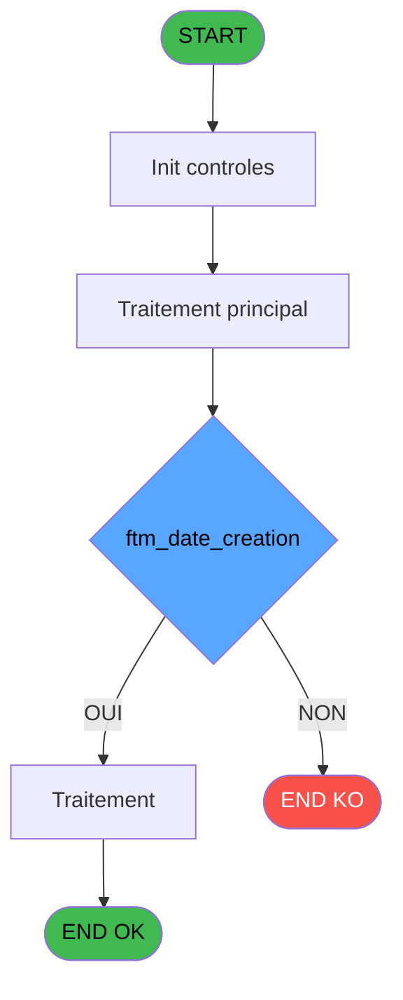
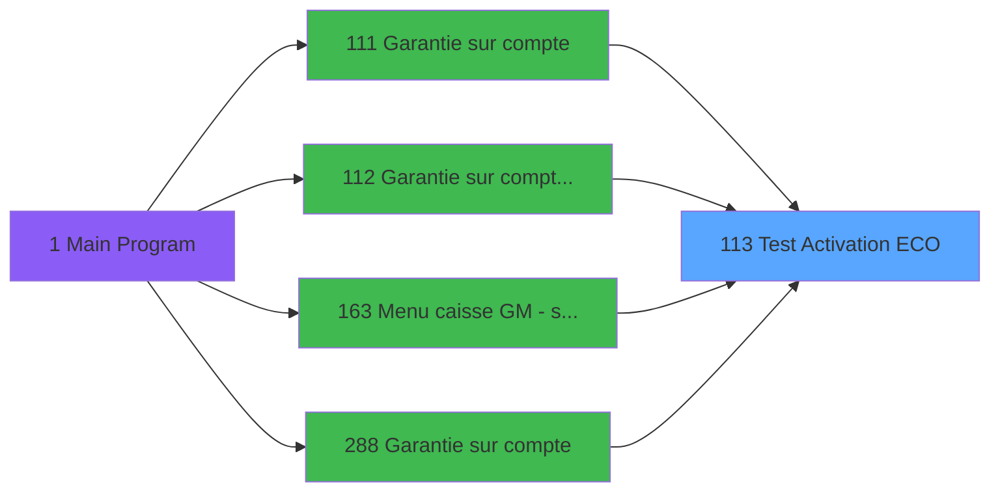

# ADH IDE 113 - Test Activation ECO

> **Analyse**: Phases 1-4 2026-02-07 07:03 -> 02:53 (19h49min) | Assemblage 02:53
> **Pipeline**: V7.2 Enrichi
> **Structure**: 4 onglets (Resume | Ecrans | Donnees | Connexions)

<!-- TAB:Resume -->

## 1. FICHE D'IDENTITE

| Attribut | Valeur |
|----------|--------|
| Projet | ADH |
| IDE Position | 113 |
| Nom Programme | Test Activation ECO |
| Fichier source | `Prg_113.xml` |
| Dossier IDE | General |
| Taches | 1 (0 ecrans visibles) |
| Tables modifiees | 0 |
| Programmes appeles | 0 |
| Complexite | **BASSE** (score 0/100) |

## 2. DESCRIPTION FONCTIONNELLE

Le programme ADH IDE 113 - Test Activation ECO valide l'activation d'une garantie écologique sur un compte. Il s'agit d'une tâche de vérification qui intervient dans le flux de gestion des garanties du module caisse, particulièrement lors de la consultation ou modification de dépôts de garantie. Le programme reçoit des paramètres de contexte (société, compte, filiation) et effectue des tests de conformité pour déterminer si une garantie ECO peut être activée.

Le flux d'appel montre que ce programme est sollicité depuis plusieurs points du module Garantie : principalement depuis ADH IDE 112 (Garantie sur compte PMS-584), ADH IDE 111 (Garantie sur compte), ADH IDE 163 (Menu caisse GM avec scroll), et ADH IDE 288. Cette multiplicité de callers indique qu'il s'agit d'une validation récurrente dans différents contextes d'accès aux garanties, possiblement basée sur le type de dépôt ou le statut du compte.

En termes d'architecture, ce programme joue un rôle de validation métier dans la chaîne de gestion des garanties. Il complète les programmes d'extraction de données (IDE 111, 112) en ajoutant une couche de contrôle applicatif avant l'affichage ou la modification de garanties écologiques. Son positionnement en tant que callee (appelé par d'autres modules) suggère qu'il centralise la logique de vérification d'activation ECO, évitant ainsi la duplication de cette règle métier.

## 3. BLOCS FONCTIONNELS

## 5. REGLES METIER

1 regles identifiees:

### Autres (1 regles)

#### [RM-001] Condition composite: Counter(0)>0 AND Range(DVal(ftm_date_creation [D],'YYYYMMDD'),Date()-1,Date())

| Element | Detail |
|---------|--------|
| **Condition** | `Counter(0)>0 AND Range(DVal(ftm_date_creation [D],'YYYYMMDD'),Date()-1,Date())` |
| **Si vrai** | Action si vrai |
| **Variables** | EQ (ftm_date_creation) |
| **Expression source** | Expression 4 : `Counter(0)>0 AND Range(DVal(ftm_date_creation [D],'YYYYMMDD'` |
| **Exemple** | Si Counter(0)>0 AND Range(DVal(ftm_date_creation [D],'YYYYMMDD'),Date()-1,Date()) → Action si vrai |

## 6. CONTEXTE

- **Appele par**: [Garantie sur compte PMS-584 (IDE 112)](ADH-IDE-112.md), [Garantie sur compte (IDE 111)](ADH-IDE-111.md), [Menu caisse GM - scroll (IDE 163)](ADH-IDE-163.md), [Garantie sur compte (IDE 288)](ADH-IDE-288.md)
- **Appelle**: 0 programmes | **Tables**: 0 (W:0 R:0 L:0) | **Taches**: 1 | **Expressions**: 4

<!-- TAB:Ecrans -->

## 8. ECRANS

*(Programme sans ecran visible)*

## 9. NAVIGATION

### 9.3 Structure hierarchique (0 tache)

| Position | Tache | Type | Dimensions | Bloc |
|----------|-------|------|------------|------|

### 9.4 Algorigramme

> **Legende**: Vert = START/END OK | Rouge = END KO | Bleu = Decisions
> *Algorigramme auto-genere. Utiliser `/algorigramme` pour une synthese metier detaillee.*

<!-- TAB:Donnees -->

## 10. TABLES

### Tables utilisees (0)

| ID | Nom | Description | Type | R | W | L | Usages |
|----|-----|-------------|------|---|---|---|--------|

### Colonnes par table (0 / 0 tables avec colonnes identifiees)

## 11. VARIABLES

### 11.1 Parametres entrants (3)

Variables recues du programme appelant ([Garantie sur compte PMS-584 (IDE 112)](ADH-IDE-112.md)).

| Lettre | Nom | Type | Usage dans |
|--------|-----|------|-----------|
| EN | p.Compte | Numeric | 1x parametre entrant |
| EO | p.Traitement | Alpha | 1x parametre entrant |
| EP | p.mail envoyé | Logical | - |

### 11.2 Autres (1)

Variables diverses.

| Lettre | Nom | Type | Usage dans |
|--------|-----|------|-----------|
| EQ | ftm_date_creation | Alpha | 1x refs |

## 12. EXPRESSIONS

**4 / 4 expressions decodees (100%)**

### 12.1 Repartition par type

| Type | Expressions | Regles |
|------|-------------|--------|
| CONDITION | 1 | 5 |
| CAST_LOGIQUE | 2 | 0 |
| FORMAT | 1 | 0 |

### 12.2 Expressions cles par type

#### CONDITION (1 expressions)

| Type | IDE | Expression | Regle |
|------|-----|------------|-------|
| CONDITION | 4 | `Counter(0)>0 AND Range(DVal(ftm_date_creation [D],'YYYYMMDD'),Date()-1,Date())` | [RM-001](#rm-RM-001) |

#### CAST_LOGIQUE (2 expressions)

| Type | IDE | Expression | Regle |
|------|-----|------------|-------|
| CAST_LOGIQUE | 3 | `'TRUE'LOG` | - |
| CAST_LOGIQUE | 2 | `'FALSE'LOG` | - |

#### FORMAT (1 expressions)

| Type | IDE | Expression | Regle |
|------|-----|------------|-------|
| FORMAT | 1 | `Trim(p.Traitement [B])&'_'&Trim(Str(p.Compte [A],'8P0'))` | - |

<!-- TAB:Connexions -->

## 13. GRAPHE D'APPELS

### 13.1 Chaine depuis Main (Callers)

Main -> ... -> [Garantie sur compte PMS-584 (IDE 112)](ADH-IDE-112.md) -> **Test Activation ECO (IDE 113)**

Main -> ... -> [Garantie sur compte (IDE 111)](ADH-IDE-111.md) -> **Test Activation ECO (IDE 113)**

Main -> ... -> [Menu caisse GM - scroll (IDE 163)](ADH-IDE-163.md) -> **Test Activation ECO (IDE 113)**

Main -> ... -> [Garantie sur compte (IDE 288)](ADH-IDE-288.md) -> **Test Activation ECO (IDE 113)**

### 13.2 Callers

| IDE | Nom Programme | Nb Appels |
|-----|---------------|-----------|
| [112](ADH-IDE-112.md) | Garantie sur compte PMS-584 | 2 |
| [111](ADH-IDE-111.md) | Garantie sur compte | 1 |
| [163](ADH-IDE-163.md) | Menu caisse GM - scroll | 1 |
| [288](ADH-IDE-288.md) | Garantie sur compte | 1 |

### 13.3 Callees (programmes appeles)

### 13.4 Detail Callees avec contexte

| IDE | Nom Programme | Appels | Contexte |
|-----|---------------|--------|----------|
| - | (aucun) | - | - |

## 14. RECOMMANDATIONS MIGRATION

### 14.1 Profil du programme

| Metrique | Valeur | Impact migration |
|----------|--------|-----------------|
| Lignes de logique | 8 | Programme compact |
| Expressions | 4 | Peu de logique |
| Tables WRITE | 0 | Impact faible |
| Sous-programmes | 0 | Peu de dependances |
| Ecrans visibles | 0 | Ecran unique ou traitement batch |
| Code desactive | 0% (0 / 8) | Code sain |
| Regles metier | 1 | Quelques regles a preserver |

### 14.2 Plan de migration par bloc

### 14.3 Dependances critiques

| Dependance | Type | Appels | Impact |
|------------|------|--------|--------|

---
*Spec DETAILED generee par Pipeline V7.2 - 2026-02-08 02:54*
