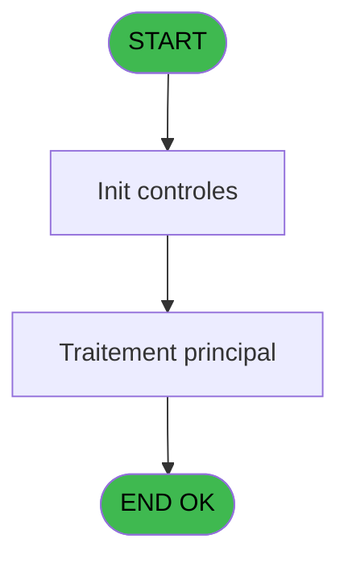

# ADH IDE 113 - Test Activation ECO

> **Analyse**: Phases 1-4 2026-02-07 03:49 -> 03:49 (27s) | Assemblage 03:49
> **Pipeline**: V7.2 Enrichi
> **Structure**: 4 onglets (Resume | Ecrans | Donnees | Connexions)

<!-- TAB:Resume -->

## 1. FICHE D'IDENTITE

| Attribut | Valeur |
|----------|--------|
| Projet | ADH |
| IDE Position | 113 |
| Nom Programme | Test Activation ECO |
| Fichier source | `Prg_113.xml` |
| Dossier IDE | General |
| Taches | 1 (0 ecrans visibles) |
| Tables modifiees | 0 |
| Programmes appeles | 0 |

## 2. DESCRIPTION FONCTIONNELLE

**Test Activation ECO** assure la gestion complete de ce processus, accessible depuis [Garantie sur compte PMS-584 (IDE 112)](ADH-IDE-112.md), [Garantie sur compte (IDE 111)](ADH-IDE-111.md), [Menu caisse GM - scroll (IDE 163)](ADH-IDE-163.md), [Garantie sur compte (IDE 288)](ADH-IDE-288.md).

Le flux de traitement s'organise en **1 blocs fonctionnels** :

- **Traitement** (1 tache) : traitements metier divers

## 3. BLOCS FONCTIONNELS

### 3.1 Traitement (1 tache)

Traitements internes.

---

#### 113 - Test Activation ECO

**Role** : Verification : Test Activation ECO.

## 5. REGLES METIER

*(Aucune regle metier identifiee)*

## 6. CONTEXTE

- **Appele par**: [Garantie sur compte PMS-584 (IDE 112)](ADH-IDE-112.md), [Garantie sur compte (IDE 111)](ADH-IDE-111.md), [Menu caisse GM - scroll (IDE 163)](ADH-IDE-163.md), [Garantie sur compte (IDE 288)](ADH-IDE-288.md)
- **Appelle**: 0 programmes | **Tables**: 0 (W:0 R:0 L:0) | **Taches**: 1 | **Expressions**: 4

<!-- TAB:Ecrans -->

## 8. ECRANS

*(Programme sans ecran visible)*

## 9. NAVIGATION

### 9.3 Structure hierarchique (1 tache)

| Position | Tache | Type | Dimensions | Bloc |
|----------|-------|------|------------|------|
| **113.1** | [**Test Activation ECO** (113)](#t1) | - | - | Traitement |

### 9.4 Algorigramme

> **Legende**: Vert = START/END OK | Rouge = END KO | Bleu = Decisions
> *Algorigramme auto-genere. Utiliser `/algorigramme` pour une synthese metier detaillee.*

<!-- TAB:Donnees -->

## 10. TABLES

### Tables utilisees (0)

| ID | Nom | Description | Type | R | W | L | Usages |
|----|-----|-------------|------|---|---|---|--------|

### Colonnes par table (0 / 0 tables avec colonnes identifiees)

## 11. VARIABLES

### 11.1 Parametres entrants (3)

Variables recues du programme appelant ([Garantie sur compte PMS-584 (IDE 112)](ADH-IDE-112.md)).

| Lettre | Nom | Type | Usage dans |
|--------|-----|------|-----------|
| A | p.Compte | Numeric | 1x parametre entrant |
| B | p.Traitement | Alpha | 1x parametre entrant |
| C | p.mail envoyé | Logical | - |

### 11.2 Autres (1)

Variables diverses.

| Lettre | Nom | Type | Usage dans |
|--------|-----|------|-----------|
| D | ftm_date_creation | Alpha | 1x refs |

## 12. EXPRESSIONS

**4 / 4 expressions decodees (100%)**

### 12.1 Repartition par type

| Type | Expressions | Regles |
|------|-------------|--------|
| CONDITION | 1 | 0 |
| CAST_LOGIQUE | 2 | 0 |
| FORMAT | 1 | 0 |

### 12.2 Expressions cles par type

#### CONDITION (1 expressions)

| Type | IDE | Expression | Regle |
|------|-----|------------|-------|
| CONDITION | 4 | `Counter(0)>0 AND Range(DVal(ftm_date_creation [D],'YYYYMMDD'),Date()-1,Date())` | - |

#### CAST_LOGIQUE (2 expressions)

| Type | IDE | Expression | Regle |
|------|-----|------------|-------|
| CAST_LOGIQUE | 3 | `'TRUE'LOG` | - |
| CAST_LOGIQUE | 2 | `'FALSE'LOG` | - |

#### FORMAT (1 expressions)

| Type | IDE | Expression | Regle |
|------|-----|------------|-------|
| FORMAT | 1 | `Trim(p.Traitement [B])&'_'&Trim(Str(p.Compte [A],'8P0'))` | - |

<!-- TAB:Connexions -->

## 13. GRAPHE D'APPELS

### 13.1 Chaine depuis Main (Callers)

Main -> ... -> [Garantie sur compte PMS-584 (IDE 112)](ADH-IDE-112.md) -> **Test Activation ECO (IDE 113)**

Main -> ... -> [Garantie sur compte (IDE 111)](ADH-IDE-111.md) -> **Test Activation ECO (IDE 113)**

Main -> ... -> [Menu caisse GM - scroll (IDE 163)](ADH-IDE-163.md) -> **Test Activation ECO (IDE 113)**

Main -> ... -> [Garantie sur compte (IDE 288)](ADH-IDE-288.md) -> **Test Activation ECO (IDE 113)**

### 13.2 Callers

| IDE | Nom Programme | Nb Appels |
|-----|---------------|-----------|
| [112](ADH-IDE-112.md) | Garantie sur compte PMS-584 | 2 |
| [111](ADH-IDE-111.md) | Garantie sur compte | 1 |
| [163](ADH-IDE-163.md) | Menu caisse GM - scroll | 1 |
| [288](ADH-IDE-288.md) | Garantie sur compte | 1 |

### 13.3 Callees (programmes appeles)

### 13.4 Detail Callees avec contexte

| IDE | Nom Programme | Appels | Contexte |
|-----|---------------|--------|----------|
| - | (aucun) | - | - |

## 14. RECOMMANDATIONS MIGRATION

### 14.1 Profil du programme

| Metrique | Valeur | Impact migration |
|----------|--------|-----------------|
| Lignes de logique | 8 | Programme compact |
| Expressions | 4 | Peu de logique |
| Tables WRITE | 0 | Impact faible |
| Sous-programmes | 0 | Peu de dependances |
| Ecrans visibles | 0 | Ecran unique ou traitement batch |
| Code desactive | 0% (0 / 8) | Code sain |
| Regles metier | 0 | Pas de regle identifiee |

### 14.2 Plan de migration par bloc

#### Traitement (1 tache: 0 ecran, 1 traitement)

- **Strategie** : 1 service(s) backend injectable(s) (Domain Services).
- Decomposer les taches en services unitaires testables.

### 14.3 Dependances critiques

| Dependance | Type | Appels | Impact |
|------------|------|--------|--------|

---
*Spec DETAILED generee par Pipeline V7.2 - 2026-02-07 03:49*
