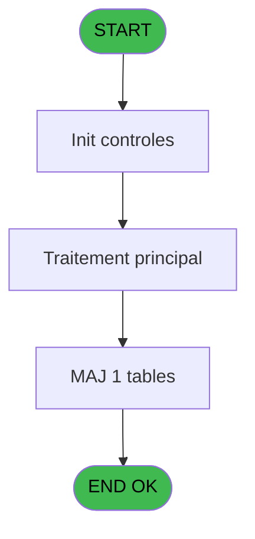

# ADH IDE 114 - Club Med Pass Filiations

> **Analyse**: Phases 1-4 2026-02-07 03:49 -> 02:54 (23h04min) | Assemblage 02:54
> **Pipeline**: V7.2 Enrichi
> **Structure**: 4 onglets (Resume | Ecrans | Donnees | Connexions)

<!-- TAB:Resume -->

## 1. FICHE D'IDENTITE

| Attribut | Valeur |
|----------|--------|
| Projet | ADH |
| IDE Position | 114 |
| Nom Programme | Club Med Pass Filiations |
| Fichier source | `Prg_114.xml` |
| Dossier IDE | General |
| Taches | 2 (1 ecrans visibles) |
| Tables modifiees | 1 |
| Programmes appeles | 0 |
| Complexite | **BASSE** (score 7/100) |

## 2. DESCRIPTION FONCTIONNELLE

**ADH IDE 114 - Club Med Pass Filiations** gère l'interface de création et de modification des numéros de Club Med Pass pour les comptes clients. Le programme affiche une grille MDI permettant de saisir ou mettre à jour les données de passe (numéro, statut, dates), en lisant les informations clients depuis deux tables référence (gm-recherche et compte_gm). La mise à jour des modifications s'effectue dans la table ez_card via la tâche enfant "Update Ezcard", qui enregistre le nouveau numéro de passe pour chaque client traité.

Les règles métier principales concernent la détection des changements (comparaison ancien/nouveau numéro), la validation des saisies avec flags de permission, et l'affichage contextuel des dates de séjour passé/actuel/futur. Le programme applique des formats de présentation conditionnels selon les valeurs numériques et utilise la traduction multilingue pour les libellés d'interface.

Le programme est très simple et terminal—il n'appelle aucun sous-programme Magic—mais reçoit ses appels depuis quatre autres programmes (IDE 111, 112, 163, 288) tous liés à la gestion des garanties et menus caisse. Cette architecture faible-couplage en fait un candidat idéal pour une migration vers un composant React avec backend .NET pour la persistence.

## 3. BLOCS FONCTIONNELS

### 3.1 Traitement (2 taches)

Traitements internes.

---

#### 114 - Création des Club Med Pass [[ECRAN]](#ecran-t1)

**Role** : Traitement : Création des Club Med Pass.
**Ecran** : 1102 x 227 DLU (MDI) | [Voir mockup](#ecran-t1)

---

#### 114.1 - Update Ezcard

**Role** : Traitement : Update Ezcard.

## 5. REGLES METIER

9 regles identifiees:

### Autres (9 regles)

#### [RM-001] Traitement conditionnel si [P]>0,Str ([P],'###'),IF ([Q] est a zero

| Element | Detail |
|---------|--------|
| **Condition** | `[P]>0` |
| **Si vrai** | Str ([P] |
| **Si faux** | '###'),IF ([Q]=0,'',Str ([P],'##'))) |
| **Expression source** | Expression 6 : `IF ([P]>0,Str ([P],'###'),IF ([Q]=0,'',Str ([P],'##')))` |
| **Exemple** | Si [P]>0 → Str ([P]. Sinon → '###'),IF ([Q]=0,'',Str ([P],'##'))) |

#### [RM-002] Si [O]<Date () alors MlsTrans ('dernier sejour :') sinon IF ([N]>Date (),MlsTrans ('prochain sejour :'),MlsTrans ('sejour en cours')))

| Element | Detail |
|---------|--------|
| **Condition** | `[O]<Date ()` |
| **Si vrai** | MlsTrans ('dernier sejour :') |
| **Si faux** | IF ([N]>Date (),MlsTrans ('prochain sejour :'),MlsTrans ('sejour en cours'))) |
| **Expression source** | Expression 9 : `IF ([O]<Date (),MlsTrans ('dernier sejour :'),IF ([N]>Date (` |
| **Exemple** | Si [O]<Date () → MlsTrans ('dernier sejour :') |

#### [RM-003] Condition: [K] egale 0

| Element | Detail |
|---------|--------|
| **Condition** | `[K]=0` |
| **Si vrai** | Action si vrai |
| **Expression source** | Expression 12 : `[K]=0` |
| **Exemple** | Si [K]=0 → Action si vrai |

#### [RM-004] Condition composite: [S] AND (v.num cmp [D]*1000+[K]<>[V]*1000+[W] OR [X]='O')

| Element | Detail |
|---------|--------|
| **Condition** | `[S] AND (v.num cmp [D]*1000+[K]<>[V]*1000+[W] OR [X]='O')` |
| **Si vrai** | Action si vrai |
| **Variables** | EQ (v.num cmp) |
| **Expression source** | Expression 13 : `[S] AND (v.num cmp [D]*1000+[K]<>[V]*1000+[W] OR [X]='O')` |
| **Exemple** | Si [S] AND (v.num cmp [D]*1000+[K]<>[V]*1000+[W] OR [X]='O') → Action si vrai |

#### [RM-005] Condition composite: Trim([BD])<>'' AND Trim([BD])<>Trim([R])

| Element | Detail |
|---------|--------|
| **Condition** | `Trim([BD])<>'' AND Trim([BD])<>Trim([R])` |
| **Si vrai** | Action si vrai |
| **Expression source** | Expression 19 : `Trim([BD])<>'' AND Trim([BD])<>Trim([R])` |
| **Exemple** | Si Trim([BD])<>'' AND Trim([BD])<>Trim([R]) → Action si vrai |

#### [RM-006] Condition: Trim([BD])='' AND Trim([R]) different de

| Element | Detail |
|---------|--------|
| **Condition** | `Trim([BD])='' AND Trim([R])<>''` |
| **Si vrai** | Action si vrai |
| **Expression source** | Expression 21 : `Trim([BD])='' AND Trim([R])<>''` |
| **Exemple** | Si Trim([BD])='' AND Trim([R])<>'' → Action si vrai |

#### [RM-007] Traitement si Trim([BD]) est renseigne

| Element | Detail |
|---------|--------|
| **Condition** | `Trim([BD])<>'' AND Trim([BD])<>Trim([R]) AND [BE]=1` |
| **Si vrai** | [BD] |
| **Si faux** | '') |
| **Expression source** | Expression 22 : `IF(Trim([BD])<>'' AND Trim([BD])<>Trim([R]) AND [BE]=1,[BD],` |
| **Exemple** | Si Trim([BD])<>'' AND Trim([BD])<>Trim([R]) AND [BE]=1 → [BD]. Sinon → '') |

#### [RM-008] Condition: [BE] egale 1

| Element | Detail |
|---------|--------|
| **Condition** | `[BE]=1` |
| **Si vrai** | Action si vrai |
| **Expression source** | Expression 23 : `[BE]=1` |
| **Exemple** | Si [BE]=1 → Action si vrai |

#### [RM-009] Condition: [BE] different de 1

| Element | Detail |
|---------|--------|
| **Condition** | `[BE]<>1` |
| **Si vrai** | Action si vrai |
| **Expression source** | Expression 24 : `[BE]<>1` |
| **Exemple** | Si [BE]<>1 → Action si vrai |

## 6. CONTEXTE

- **Appele par**: [Garantie sur compte (IDE 111)](ADH-IDE-111.md), [Garantie sur compte PMS-584 (IDE 112)](ADH-IDE-112.md), [Menu caisse GM - scroll (IDE 163)](ADH-IDE-163.md), [Garantie sur compte (IDE 288)](ADH-IDE-288.md)
- **Appelle**: 0 programmes | **Tables**: 3 (W:1 R:1 L:2) | **Taches**: 2 | **Expressions**: 25

<!-- TAB:Ecrans -->

## 8. ECRANS

### 8.1 Forms visibles (1 / 2)

| # | Position | Tache | Nom | Type | Largeur | Hauteur | Bloc |
|---|----------|-------|-----|------|---------|---------|------|
| 1 | 114 | 114 | Création des Club Med Pass | MDI | 1102 | 227 | Traitement |

### 8.2 Mockups Ecrans

---

#### 114 - Création des Club Med Pass
**Tache** : [114](#t1) | **Type** : MDI | **Dimensions** : 1102 x 227 DLU
**Bloc** : Traitement | **Titre IDE** : Création des Club Med Pass

<!-- FORM-DATA:
{
    "width":  1102,
    "vFactor":  8,
    "type":  "MDI",
    "hFactor":  8,
    "controls":  [
                     {
                         "x":  0,
                         "type":  "label",
                         "var":  "",
                         "y":  0,
                         "w":  1101,
                         "fmt":  "",
                         "name":  "",
                         "h":  18,
                         "color":  "",
                         "text":  "",
                         "parent":  null
                     },
                     {
                         "x":  0,
                         "type":  "label",
                         "var":  "",
                         "y":  203,
                         "w":  1101,
                         "fmt":  "",
                         "name":  "",
                         "h":  24,
                         "color":  "",
                         "text":  "",
                         "parent":  null
                     },
                     {
                         "x":  22,
                         "type":  "table",
                         "var":  "",
                         "name":  "",
                         "titleH":  15,
                         "color":  "110",
                         "w":  1050,
                         "y":  26,
                         "fmt":  "",
                         "parent":  null,
                         "text":  "",
                         "rowH":  31,
                         "h":  171,
                         "cols":  [
                                      {
                                          "title":  "Nom / Prénom",
                                          "layer":  1,
                                          "w":  361
                                      },
                                      {
                                          "title":  "Sexe",
                                          "layer":  2,
                                          "w":  69
                                      },
                                      {
                                          "title":  "Age",
                                          "layer":  3,
                                          "w":  125
                                      },
                                      {
                                          "title":  "Numéro",
                                          "layer":  4,
                                          "w":  255
                                      },
                                      {
                                          "title":  "N° Club Med Pass",
                                          "layer":  5,
                                          "w":  200
                                      }
                                  ],
                         "rows":  5
                     },
                     {
                         "x":  760,
                         "type":  "label",
                         "var":  "",
                         "y":  56,
                         "w":  20,
                         "fmt":  "",
                         "name":  "",
                         "h":  12,
                         "color":  "110",
                         "text":  "m",
                         "parent":  5
                     },
                     {
                         "x":  838,
                         "type":  "edit",
                         "var":  "",
                         "y":  44,
                         "w":  187,
                         "fmt":  "10",
                         "name":  "N° Club Med Pass",
                         "h":  22,
                         "color":  "110",
                         "text":  "",
                         "parent":  5
                     },
                     {
                         "x":  34,
                         "type":  "edit",
                         "var":  "",
                         "y":  45,
                         "w":  295,
                         "fmt":  "",
                         "name":  "",
                         "h":  8,
                         "color":  "110",
                         "text":  "",
                         "parent":  5
                     },
                     {
                         "x":  258,
                         "type":  "edit",
                         "var":  "",
                         "y":  60,
                         "w":  132,
                         "fmt":  "WWW DD MMMMZ",
                         "name":  "",
                         "h":  8,
                         "color":  "110",
                         "text":  "",
                         "parent":  5
                     },
                     {
                         "x":  586,
                         "type":  "edit",
                         "var":  "",
                         "y":  45,
                         "w":  120,
                         "fmt":  "",
                         "name":  "",
                         "h":  8,
                         "color":  "110",
                         "text":  "",
                         "parent":  5
                     },
                     {
                         "x":  725,
                         "type":  "edit",
                         "var":  "",
                         "y":  45,
                         "w":  20,
                         "fmt":  "1",
                         "name":  "",
                         "h":  8,
                         "color":  "110",
                         "text":  "",
                         "parent":  5
                     },
                     {
                         "x":  765,
                         "type":  "edit",
                         "var":  "",
                         "y":  45,
                         "w":  42,
                         "fmt":  "",
                         "name":  "",
                         "h":  8,
                         "color":  "110",
                         "text":  "",
                         "parent":  5
                     },
                     {
                         "x":  546,
                         "type":  "edit",
                         "var":  "",
                         "y":  60,
                         "w":  132,
                         "fmt":  "WWW DD MMMMZ",
                         "name":  "",
                         "h":  8,
                         "color":  "110",
                         "text":  "",
                         "parent":  5
                     },
                     {
                         "x":  6,
                         "type":  "edit",
                         "var":  "",
                         "y":  4,
                         "w":  267,
                         "fmt":  "20",
                         "name":  "",
                         "h":  8,
                         "color":  "",
                         "text":  "",
                         "parent":  1
                     },
                     {
                         "x":  879,
                         "type":  "edit",
                         "var":  "",
                         "y":  4,
                         "w":  203,
                         "fmt":  "WWW DD MMM YYYYT",
                         "name":  "",
                         "h":  8,
                         "color":  "",
                         "text":  "",
                         "parent":  1
                     },
                     {
                         "x":  406,
                         "type":  "edit",
                         "var":  "",
                         "y":  45,
                         "w":  30,
                         "fmt":  "2",
                         "name":  "gmr_sexe",
                         "h":  8,
                         "color":  "110",
                         "text":  "",
                         "parent":  5
                     },
                     {
                         "x":  466,
                         "type":  "edit",
                         "var":  "",
                         "y":  45,
                         "w":  34,
                         "fmt":  "3",
                         "name":  "",
                         "h":  8,
                         "color":  "110",
                         "text":  "",
                         "parent":  5
                     },
                     {
                         "x":  517,
                         "type":  "edit",
                         "var":  "",
                         "y":  45,
                         "w":  52,
                         "fmt":  "4",
                         "name":  "",
                         "h":  8,
                         "color":  "110",
                         "text":  "",
                         "parent":  5
                     },
                     {
                         "x":  742,
                         "type":  "edit",
                         "var":  "",
                         "y":  45,
                         "w":  20,
                         "fmt":  "1",
                         "name":  "",
                         "h":  8,
                         "color":  "110",
                         "text":  "",
                         "parent":  5
                     },
                     {
                         "x":  34,
                         "type":  "edit",
                         "var":  "",
                         "y":  60,
                         "w":  169,
                         "fmt":  "17",
                         "name":  "",
                         "h":  8,
                         "color":  "110",
                         "text":  "",
                         "parent":  5
                     },
                     {
                         "x":  203,
                         "type":  "edit",
                         "var":  "",
                         "y":  60,
                         "w":  53,
                         "fmt":  "4",
                         "name":  "",
                         "h":  8,
                         "color":  "110",
                         "text":  "",
                         "parent":  5
                     },
                     {
                         "x":  498,
                         "type":  "edit",
                         "var":  "",
                         "y":  60,
                         "w":  52,
                         "fmt":  "4",
                         "name":  "",
                         "h":  8,
                         "color":  "110",
                         "text":  "",
                         "parent":  5
                     },
                     {
                         "x":  9,
                         "type":  "button",
                         "var":  "",
                         "y":  206,
                         "w":  168,
                         "fmt":  "\u0026Quitter",
                         "name":  "",
                         "h":  18,
                         "color":  "",
                         "text":  "",
                         "parent":  null
                     }
                 ],
    "taskId":  "114",
    "height":  227
}
-->

<strong>Champs : 16 champs</strong>

| Pos (x,y) | Nom | Variable | Type |
|-----------|-----|----------|------|
| 838,44 | N° Club Med Pass | - | edit |
| 34,45 | (sans nom) | - | edit |
| 258,60 | WWW DD MMMMZ | - | edit |
| 586,45 | (sans nom) | - | edit |
| 725,45 | 1 | - | edit |
| 765,45 | (sans nom) | - | edit |
| 546,60 | WWW DD MMMMZ | - | edit |
| 6,4 | 20 | - | edit |
| 879,4 | WWW DD MMM YYYYT | - | edit |
| 406,45 | gmr_sexe | - | edit |
| 466,45 | 3 | - | edit |
| 517,45 | 4 | - | edit |
| 742,45 | 1 | - | edit |
| 34,60 | 17 | - | edit |
| 203,60 | 4 | - | edit |
| 498,60 | 4 | - | edit |

<strong>Boutons : 1 boutons</strong>

| Bouton | Pos (x,y) | Action |
|--------|-----------|--------|
| Quitter | 9,206 | Quitte le programme |

## 9. NAVIGATION

Ecran unique: **Création des Club Med Pass**

### 9.3 Structure hierarchique (2 taches)

| Position | Tache | Type | Dimensions | Bloc |
|----------|-------|------|------------|------|
| **114.1** | [**Création des Club Med Pass** (114)](#t1) [mockup](#ecran-t1) | MDI | 1102x227 | Traitement |
| 114.1.1 | [Update Ezcard (114.1)](#t2) | - | - | |

### 9.4 Algorigramme

> **Legende**: Vert = START/END OK | Rouge = END KO | Bleu = Decisions
> *Algorigramme auto-genere. Utiliser `/algorigramme` pour une synthese metier detaillee.*

<!-- TAB:Donnees -->

## 10. TABLES

### Tables utilisees (3)

| ID | Nom | Description | Type | R | W | L | Usages |
|----|-----|-------------|------|---|---|---|--------|
| 312 | ez_card |  | DB |   | **W** | L | 2 |
| 30 | gm-recherche_____gmr | Index de recherche | DB | R |   |   | 1 |
| 47 | compte_gm________cgm | Comptes GM (generaux) | DB |   |   | L | 1 |

### Colonnes par table (3 / 2 tables avec colonnes identifiees)

Table 312 - ez_card (**W**/L) - 2 usages

| Lettre | Variable | Acces | Type |
|--------|----------|-------|------|
| EN | P.Card Id | W | Unicode |

Table 30 - gm-recherche_____gmr (R) - 1 usages

| Lettre | Variable | Acces | Type |
|--------|----------|-------|------|
| A | P. Societe | R | Unicode |
| B | P.Compte | R | Numeric |
| C | v. nom & prenom | R | Alpha |
| D | v.num cmp | R | Unicode |
| E | N° CMP Existe déjà ? | R | Logical |
| F | v.var change en cours | R | Logical |
| G | CHG_REASON_v.num cmp | R | Numeric |
| H | CHG_PRV_v.num cmp | R | Unicode |
| I | v.confirmation | R | Numeric |

## 11. VARIABLES

### 11.1 Parametres entrants (2)

Variables recues du programme appelant ([Garantie sur compte (IDE 111)](ADH-IDE-111.md)).

| Lettre | Nom | Type | Usage dans |
|--------|-----|------|-----------|
| EN | P. Societe | Unicode | 1x parametre entrant |
| EO | P.Compte | Numeric | 1x parametre entrant |

### 11.2 Variables de session (4)

Variables persistantes pendant toute la session.

| Lettre | Nom | Type | Usage dans |
|--------|-----|------|-----------|
| EP | v. nom & prenom | Alpha | 1x session |
| EQ | v.num cmp | Unicode | 2x session |
| ES | v.var change en cours | Logical | 1x session |
| EV | v.confirmation | Numeric | - |

### 11.3 Autres (3)

Variables diverses.

| Lettre | Nom | Type | Usage dans |
|--------|-----|------|-----------|
| ER | N° CMP Existe déjà ? | Logical | 1x refs |
| ET | CHG_REASON_v.num cmp | Numeric | - |
| EU | CHG_PRV_v.num cmp | Unicode | - |

## 12. EXPRESSIONS

**25 / 25 expressions decodees (100%)**

### 12.1 Repartition par type

| Type | Expressions | Regles |
|------|-------------|--------|
| CALCULATION | 1 | 0 |
| CONDITION | 10 | 9 |
| CONSTANTE | 2 | 0 |
| DATE | 1 | 0 |
| REFERENCE_VG | 1 | 0 |
| OTHER | 7 | 0 |
| CAST_LOGIQUE | 2 | 0 |
| CONCATENATION | 1 | 0 |

### 12.2 Expressions cles par type

#### CALCULATION (1 expressions)

| Type | IDE | Expression | Regle |
|------|-----|------------|-------|
| CALCULATION | 16 | `CallProg('{160,-1}'PROG,v. nom & prenom [C],v.num cmp [D],[K])` | - |

#### CONDITION (10 expressions)

| Type | IDE | Expression | Regle |
|------|-----|------------|-------|
| CONDITION | 21 | `Trim([BD])='' AND Trim([R])<>''` | [RM-006](#rm-RM-006) |
| CONDITION | 19 | `Trim([BD])<>'' AND Trim([BD])<>Trim([R])` | [RM-005](#rm-RM-005) |
| CONDITION | 22 | `IF(Trim([BD])<>'' AND Trim([BD])<>Trim([R]) AND [BE]=1,[BD],'')` | [RM-007](#rm-RM-007) |
| CONDITION | 24 | `[BE]<>1` | [RM-009](#rm-RM-009) |
| CONDITION | 23 | `[BE]=1` | [RM-008](#rm-RM-008) |
| ... | | *+5 autres* | |

#### CONSTANTE (2 expressions)

| Type | IDE | Expression | Regle |
|------|-----|------------|-------|
| CONSTANTE | 20 | `1` | - |
| CONSTANTE | 8 | `'-'` | - |

#### DATE (1 expressions)

| Type | IDE | Expression | Regle |
|------|-----|------------|-------|
| DATE | 1 | `Date ()` | - |

#### REFERENCE_VG (1 expressions)

| Type | IDE | Expression | Regle |
|------|-----|------------|-------|
| REFERENCE_VG | 2 | `VG2` | - |

#### OTHER (7 expressions)

| Type | IDE | Expression | Regle |
|------|-----|------------|-------|
| OTHER | 14 | `[R]` | - |
| OTHER | 17 | `[BD]` | - |
| OTHER | 25 | `NOT([Y])` | - |
| OTHER | 11 | `MlsTrans ('au')` | - |
| OTHER | 3 | `P. Societe [A]` | - |
| ... | | *+2 autres* | |

#### CAST_LOGIQUE (2 expressions)

| Type | IDE | Expression | Regle |
|------|-----|------------|-------|
| CAST_LOGIQUE | 18 | `'FALSE'LOG` | - |
| CAST_LOGIQUE | 15 | `'TRUE'LOG` | - |

#### CONCATENATION (1 expressions)

| Type | IDE | Expression | Regle |
|------|-----|------------|-------|
| CONCATENATION | 5 | `Trim (N° CMP Existe déjà ? [E])&' '&v.var change en cours [F]` | - |

### 12.3 Toutes les expressions (25)

Voir les 25 expressions

#### CALCULATION (1)

| IDE | Expression Decodee |
|-----|-------------------|
| 16 | `CallProg('{160,-1}'PROG,v. nom & prenom [C],v.num cmp [D],[K])` |

#### CONDITION (10)

| IDE | Expression Decodee |
|-----|-------------------|
| 6 | `IF ([P]>0,Str ([P],'###'),IF ([Q]=0,'',Str ([P],'##')))` |
| 7 | `IF ([P]>0,'ans',IF ([Q]=0,'','mois'))` |
| 9 | `IF ([O]<Date (),MlsTrans ('dernier sejour :'),IF ([N]>Date (),MlsTrans ('prochain sejour :'),MlsTrans ('sejour en cours')))` |
| 12 | `[K]=0` |
| 13 | `[S] AND (v.num cmp [D]*1000+[K]<>[V]*1000+[W] OR [X]='O')` |
| 19 | `Trim([BD])<>'' AND Trim([BD])<>Trim([R])` |
| 21 | `Trim([BD])='' AND Trim([R])<>''` |
| 22 | `IF(Trim([BD])<>'' AND Trim([BD])<>Trim([R]) AND [BE]=1,[BD],'')` |
| 23 | `[BE]=1` |
| 24 | `[BE]<>1` |

#### CONSTANTE (2)

| IDE | Expression Decodee |
|-----|-------------------|
| 8 | `'-'` |
| 20 | `1` |

#### DATE (1)

| IDE | Expression Decodee |
|-----|-------------------|
| 1 | `Date ()` |

#### REFERENCE_VG (1)

| IDE | Expression Decodee |
|-----|-------------------|
| 2 | `VG2` |

#### OTHER (7)

| IDE | Expression Decodee |
|-----|-------------------|
| 3 | `P. Societe [A]` |
| 4 | `P.Compte [B]` |
| 10 | `MlsTrans ('du')` |
| 11 | `MlsTrans ('au')` |
| 14 | `[R]` |
| 17 | `[BD]` |
| 25 | `NOT([Y])` |

#### CAST_LOGIQUE (2)

| IDE | Expression Decodee |
|-----|-------------------|
| 15 | `'TRUE'LOG` |
| 18 | `'FALSE'LOG` |

#### CONCATENATION (1)

| IDE | Expression Decodee |
|-----|-------------------|
| 5 | `Trim (N° CMP Existe déjà ? [E])&' '&v.var change en cours [F]` |

<!-- TAB:Connexions -->

## 13. GRAPHE D'APPELS

### 13.1 Chaine depuis Main (Callers)

Main -> ... -> [Garantie sur compte (IDE 111)](ADH-IDE-111.md) -> **Club Med Pass Filiations (IDE 114)**

Main -> ... -> [Garantie sur compte PMS-584 (IDE 112)](ADH-IDE-112.md) -> **Club Med Pass Filiations (IDE 114)**

Main -> ... -> [Menu caisse GM - scroll (IDE 163)](ADH-IDE-163.md) -> **Club Med Pass Filiations (IDE 114)**

Main -> ... -> [Garantie sur compte (IDE 288)](ADH-IDE-288.md) -> **Club Med Pass Filiations (IDE 114)**

### 13.2 Callers

| IDE | Nom Programme | Nb Appels |
|-----|---------------|-----------|
| [111](ADH-IDE-111.md) | Garantie sur compte | 1 |
| [112](ADH-IDE-112.md) | Garantie sur compte PMS-584 | 1 |
| [163](ADH-IDE-163.md) | Menu caisse GM - scroll | 1 |
| [288](ADH-IDE-288.md) | Garantie sur compte | 1 |

### 13.3 Callees (programmes appeles)

### 13.4 Detail Callees avec contexte

| IDE | Nom Programme | Appels | Contexte |
|-----|---------------|--------|----------|
| - | (aucun) | - | - |

## 14. RECOMMANDATIONS MIGRATION

### 14.1 Profil du programme

| Metrique | Valeur | Impact migration |
|----------|--------|-----------------|
| Lignes de logique | 90 | Programme compact |
| Expressions | 25 | Peu de logique |
| Tables WRITE | 1 | Impact faible |
| Sous-programmes | 0 | Peu de dependances |
| Ecrans visibles | 1 | Ecran unique ou traitement batch |
| Code desactive | 0% (0 / 90) | Code sain |
| Regles metier | 9 | Quelques regles a preserver |

### 14.2 Plan de migration par bloc

#### Traitement (2 taches: 1 ecran, 1 traitement)

- **Strategie** : Orchestrateur avec 1 ecrans (Razor/React) et 1 traitements backend (services).
- Les ecrans deviennent des composants UI, les traitements invisibles deviennent des services injectables.
- Decomposer les taches en services unitaires testables.

### 14.3 Dependances critiques

| Dependance | Type | Appels | Impact |
|------------|------|--------|--------|
| ez_card | Table WRITE (Database) | 1x | Schema + repository |

---
*Spec DETAILED generee par Pipeline V7.2 - 2026-02-08 02:56*
