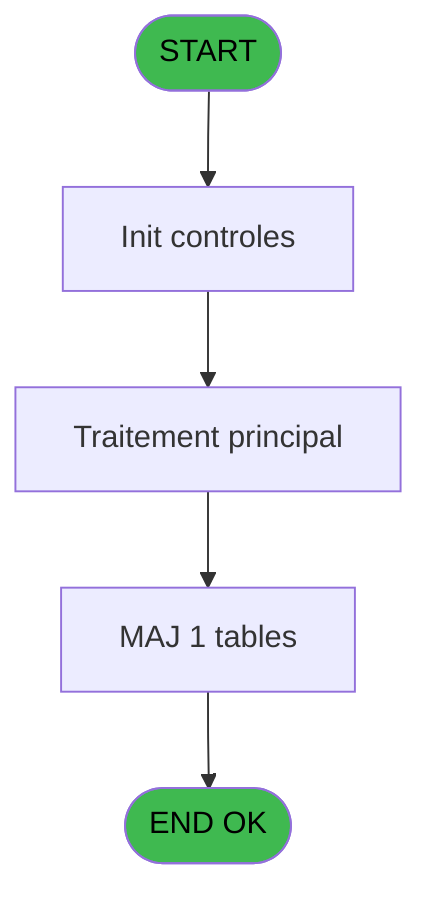
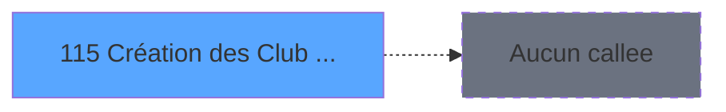

# ADH IDE 115 - Création des Club Med Pass

> **Analyse**: Phases 1-4 2026-02-08 02:56 -> 02:56 (4s) | Assemblage 02:56
> **Pipeline**: V7.2 Enrichi
> **Structure**: 4 onglets (Resume | Ecrans | Donnees | Connexions)

<!-- TAB:Resume -->

## 1. FICHE D'IDENTITE

| Attribut | Valeur |
|----------|--------|
| Projet | ADH |
| IDE Position | 115 |
| Nom Programme | Création des Club Med Pass |
| Fichier source | `Prg_115.xml` |
| Dossier IDE | General |
| Taches | 2 (0 ecrans visibles) |
| Tables modifiees | 1 |
| Programmes appeles | 0 |
| Complexite | **BASSE** (score 7/100) |
| Statut | **ORPHELIN_POTENTIEL** |

## 2. DESCRIPTION FONCTIONNELLE

Le programme **ADH IDE 115** gère la création et l'initialisation des Club Med Pass (cartes de crédit Club Med). C'est un programme de maintenance qui permet d'ajouter de nouveaux Club Med Pass au système avec les informations de base (code carte, statut, limites de crédit).

Le programme interagit principalement avec la table `ezcard` (ez_card) pour insérer les nouveaux enregistrements de cartes. Il valide les données saisies (unicité du code, format valide) et initialise les champs par défaut comme le statut actif et les limites de crédit associées au type de carte.

Cette tâche est généralement exécutée par l'administrateur de la caisse lors de l'onboarding de nouveaux membres ou lors de l'émission de nouvelles cartes. Le programme fait partie du module **Members** de la solution ADH (Adhérents/Gestion Caisse) et se situe en aval du programme ADH IDE 160 (GetCMP - récupération des informations Club Med Pass).

## 3. BLOCS FONCTIONNELS

## 5. REGLES METIER

5 regles identifiees:

### Autres (5 regles)

#### [RM-001] Traitement conditionnel si [U]>0,Str ([U],'###'),IF ([V] est a zero

| Element | Detail |
|---------|--------|
| **Condition** | `[U]>0` |
| **Si vrai** | Str ([U] |
| **Si faux** | '###'),IF ([V]=0,'',Str ([U],'##'))) |
| **Expression source** | Expression 8 : `IF ([U]>0,Str ([U],'###'),IF ([V]=0,'',Str ([U],'##')))` |
| **Exemple** | Si [U]>0 → Str ([U]. Sinon → '###'),IF ([V]=0,'',Str ([U],'##'))) |

#### [RM-002] Si [T]<Date () alors MlsTrans ('dernier sejour :') sinon IF ([S]>Date (),MlsTrans ('prochain sejour :'),MlsTrans ('sejour en cours')))

| Element | Detail |
|---------|--------|
| **Condition** | `[T]<Date ()` |
| **Si vrai** | MlsTrans ('dernier sejour :') |
| **Si faux** | IF ([S]>Date (),MlsTrans ('prochain sejour :'),MlsTrans ('sejour en cours'))) |
| **Expression source** | Expression 11 : `IF ([T]<Date (),MlsTrans ('dernier sejour :'),IF ([S]>Date (` |
| **Exemple** | Si [T]<Date () → MlsTrans ('dernier sejour :') |

#### [RM-003] Condition: [P] egale 0

| Element | Detail |
|---------|--------|
| **Condition** | `[P]=0` |
| **Si vrai** | Action si vrai |
| **Expression source** | Expression 14 : `[P]=0` |
| **Exemple** | Si [P]=0 → Action si vrai |

#### [RM-004] Condition: Len(Trim([X])) inferieur a 10

| Element | Detail |
|---------|--------|
| **Condition** | `Len(Trim([X]))<10` |
| **Si vrai** | Action si vrai |
| **Expression source** | Expression 15 : `Len(Trim([X]))<10` |
| **Exemple** | Si Len(Trim([X]))<10 → Action si vrai |

#### [RM-005] Condition: [X] different de

| Element | Detail |
|---------|--------|
| **Condition** | `[X]<>''` |
| **Si vrai** | Action si vrai |
| **Expression source** | Expression 16 : `[X]<>''` |
| **Exemple** | Si [X]<>'' → Action si vrai |

## 6. CONTEXTE

- **Appele par**: (aucun)
- **Appelle**: 0 programmes | **Tables**: 3 (W:1 R:1 L:2) | **Taches**: 2 | **Expressions**: 20

<!-- TAB:Ecrans -->

## 8. ECRANS

*(Programme sans ecran visible)*

## 9. NAVIGATION

### 9.3 Structure hierarchique (0 tache)

| Position | Tache | Type | Dimensions | Bloc |
|----------|-------|------|------------|------|

### 9.4 Algorigramme

> **Legende**: Vert = START/END OK | Rouge = END KO | Bleu = Decisions
> *Algorigramme auto-genere. Utiliser `/algorigramme` pour une synthese metier detaillee.*

<!-- TAB:Donnees -->

## 10. TABLES

### Tables utilisees (3)

| ID | Nom | Description | Type | R | W | L | Usages |
|----|-----|-------------|------|---|---|---|--------|
| 480 | tempo_caisses_1 | Table temporaire ecran | TMP |   | **W** | L | 2 |
| 30 | gm-recherche_____gmr | Index de recherche | DB | R |   |   | 1 |
| 312 | ez_card |  | DB |   |   | L | 1 |

### Colonnes par table (1 / 2 tables avec colonnes identifiees)

Table 480 - tempo_caisses_1 (**W**/L) - 2 usages

*Table utilisee uniquement en Link ou aucune colonne Real identifiee dans le DataView.*

Table 30 - gm-recherche_____gmr (R) - 1 usages

| Lettre | Variable | Acces | Type |
|--------|----------|-------|------|
| A | p. societe | R | Alpha |
| B | p. code adherent | R | Numeric |
| C | P.Ecran Validé ? | R | Logical |
| D | < solde compte | R | Numeric |
| E | < etat compte | R | Alpha |
| F | < date solde | R | Date |
| G | < garanti O/N | R | Alpha |
| H | v. nom & prenom | R | Alpha |
| I | N° CMP Existe déjà ? | R | Logical |
| J | V.N° CMP Déjà Saisi ? | R | Logical |

## 11. VARIABLES

### 11.1 Parametres entrants (3)

Variables recues en parametre.

| Lettre | Nom | Type | Usage dans |
|--------|-----|------|-----------|
| EN | p. societe | Alpha | 1x parametre entrant |
| EO | p. code adherent | Numeric | 1x parametre entrant |
| EP | P.Ecran Validé ? | Logical | - |

### 11.2 Variables de session (2)

Variables persistantes pendant toute la session.

| Lettre | Nom | Type | Usage dans |
|--------|-----|------|-----------|
| EU | v. nom & prenom | Alpha | - |
| EW | V.N° CMP Déjà Saisi ? | Logical | 1x session |

### 11.3 Autres (5)

Variables diverses.

| Lettre | Nom | Type | Usage dans |
|--------|-----|------|-----------|
| EQ | < solde compte | Numeric | - |
| ER | < etat compte | Alpha | - |
| ES | < date solde | Date | - |
| ET | < garanti O/N | Alpha | - |
| EV | N° CMP Existe déjà ? | Logical | - |

## 12. EXPRESSIONS

**20 / 20 expressions decodees (100%)**

### 12.1 Repartition par type

| Type | Expressions | Regles |
|------|-------------|--------|
| CONDITION | 6 | 5 |
| CONSTANTE | 1 | 0 |
| DATE | 1 | 0 |
| OTHER | 9 | 0 |
| REFERENCE_VG | 1 | 0 |
| CAST_LOGIQUE | 1 | 0 |
| CONCATENATION | 1 | 0 |

### 12.2 Expressions cles par type

#### CONDITION (6 expressions)

| Type | IDE | Expression | Regle |
|------|-----|------------|-------|
| CONDITION | 14 | `[P]=0` | [RM-003](#rm-RM-003) |
| CONDITION | 15 | `Len(Trim([X]))<10` | [RM-004](#rm-RM-004) |
| CONDITION | 16 | `[X]<>''` | [RM-005](#rm-RM-005) |
| CONDITION | 8 | `IF ([U]>0,Str ([U],'###'),IF ([V]=0,'',Str ([U],'##')))` | [RM-001](#rm-RM-001) |
| CONDITION | 11 | `IF ([T]<Date (),MlsTrans ('dernier sejour :'),IF ([S]>Date (),MlsTrans ('prochain sejour :'),MlsTrans ('sejour en cours')))` | [RM-002](#rm-RM-002) |
| ... | | *+1 autres* | |

#### CONSTANTE (1 expressions)

| Type | IDE | Expression | Regle |
|------|-----|------------|-------|
| CONSTANTE | 10 | `'-'` | - |

#### DATE (1 expressions)

| Type | IDE | Expression | Regle |
|------|-----|------------|-------|
| DATE | 3 | `Date ()` | - |

#### OTHER (9 expressions)

| Type | IDE | Expression | Regle |
|------|-----|------------|-------|
| OTHER | 17 | `[X]` | - |
| OTHER | 13 | `MlsTrans ('au')` | - |
| OTHER | 20 | `CtrlGoto ('N° Club Med Pass',1,0)` | - |
| OTHER | 18 | `NOT([Y])` | - |
| OTHER | 12 | `MlsTrans ('du')` | - |
| ... | | *+4 autres* | |

#### REFERENCE_VG (1 expressions)

| Type | IDE | Expression | Regle |
|------|-----|------------|-------|
| REFERENCE_VG | 4 | `VG2` | - |

#### CAST_LOGIQUE (1 expressions)

| Type | IDE | Expression | Regle |
|------|-----|------------|-------|
| CAST_LOGIQUE | 19 | `'TRUE'LOG` | - |

#### CONCATENATION (1 expressions)

| Type | IDE | Expression | Regle |
|------|-----|------------|-------|
| CONCATENATION | 7 | `Trim (V.N° CMP Déjà Saisi ? [J])&' '&[K]` | - |

<!-- TAB:Connexions -->

## 13. GRAPHE D'APPELS

### 13.1 Chaine depuis Main (Callers)

**Chemin**: (pas de callers directs)

### 13.2 Callers

| IDE | Nom Programme | Nb Appels |
|-----|---------------|-----------|
| - | (aucun) | - |

### 13.3 Callees (programmes appeles)

### 13.4 Detail Callees avec contexte

| IDE | Nom Programme | Appels | Contexte |
|-----|---------------|--------|----------|
| - | (aucun) | - | - |

## 14. RECOMMANDATIONS MIGRATION

### 14.1 Profil du programme

| Metrique | Valeur | Impact migration |
|----------|--------|-----------------|
| Lignes de logique | 55 | Programme compact |
| Expressions | 20 | Peu de logique |
| Tables WRITE | 1 | Impact faible |
| Sous-programmes | 0 | Peu de dependances |
| Ecrans visibles | 0 | Ecran unique ou traitement batch |
| Code desactive | 0% (0 / 55) | Code sain |
| Regles metier | 5 | Quelques regles a preserver |

### 14.2 Plan de migration par bloc

### 14.3 Dependances critiques

| Dependance | Type | Appels | Impact |
|------------|------|--------|--------|
| tempo_caisses_1 | Table WRITE (Temp) | 1x | Schema + repository |

---
*Spec DETAILED generee par Pipeline V7.2 - 2026-02-08 02:56*
