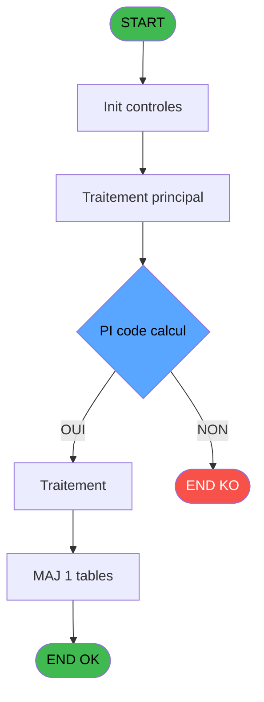
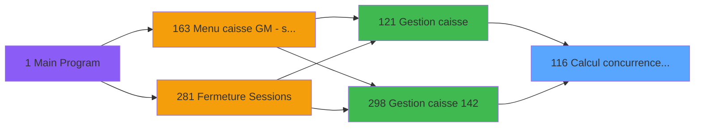
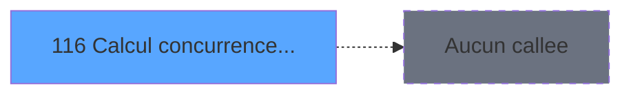

# ADH IDE 116 - Calcul concurrence sessions

> **Analyse**: Phases 1-4 2026-02-08 02:56 -> 02:56 (4s) | Assemblage 02:56
> **Pipeline**: V7.2 Enrichi
> **Structure**: 4 onglets (Resume | Ecrans | Donnees | Connexions)

<!-- TAB:Resume -->

## 1. FICHE D'IDENTITE

| Attribut | Valeur |
|----------|--------|
| Projet | ADH |
| IDE Position | 116 |
| Nom Programme | Calcul concurrence sessions |
| Fichier source | `Prg_116.xml` |
| Dossier IDE | Caisse |
| Taches | 5 (0 ecrans visibles) |
| Tables modifiees | 1 |
| Programmes appeles | 0 |
| Complexite | **BASSE** (score 7/100) |

## 2. DESCRIPTION FONCTIONNELLE

ADH IDE 116 - Calcul concurrence sessions

Le programme ADH IDE 116 est responsable de la détection et gestion des ouvertures de session concurrentes pour un même compte membre. Il intervient lors de l'accès à la caisse pour vérifier qu'une session n'est pas déjà active sur un autre terminal, ce qui pourrait créer des incohérences de solde ou des mouvements contradictoires.

Le flux principal interroge la table `concurrence_sessions` pour identifier les sessions actives associées au couple (societe, compte, filiation). Si une session existe déjà, le programme peut soit bloquer l'accès (mode strict), soit afficher un avertissement à l'opérateur lui permettant de forcer l'ouverture après validation. Cette logique est critique pour garantir l'intégrité transactionnelle en environnement multi-caisse.

Les appels émis depuis Gestion caisse (IDE 121) ou sa variante IDE 298 déclenchent ce contrôle avant de créer une nouvelle session de travail. Le programme met à jour l'enregistrement de concurrence avec un timestamp et un identifiant terminal, permettant ainsi aux gestionnaires de tracer les conflits potentiels et de nettoyer les sessions "zombies" abandonnées sans fermeture propre.

## 3. BLOCS FONCTIONNELS

## 5. REGLES METIER

4 regles identifiees:

### Autres (4 regles)

#### [RM-001] Condition: PI code calcul [A] egale 'C'

| Element | Detail |
|---------|--------|
| **Condition** | `PI code calcul [A]='C'` |
| **Si vrai** | Action si vrai |
| **Variables** | EN (PI code calcul) |
| **Expression source** | Expression 1 : `PI code calcul [A]='C'` |
| **Exemple** | Si PI code calcul [A]='C' → Action si vrai |

#### [RM-002] Condition: PI code calcul [A] egale 'D'

| Element | Detail |
|---------|--------|
| **Condition** | `PI code calcul [A]='D'` |
| **Si vrai** | Action si vrai |
| **Variables** | EN (PI code calcul) |
| **Expression source** | Expression 2 : `PI code calcul [A]='D'` |
| **Exemple** | Si PI code calcul [A]='D' → Action si vrai |

#### [RM-003] Negation de (coffre en cours comptage [C]) (condition inversee)

| Element | Detail |
|---------|--------|
| **Condition** | `NOT (coffre en cours comptage [C])` |
| **Si vrai** | Action si vrai |
| **Variables** | EP (coffre en cours comptage) |
| **Expression source** | Expression 7 : `NOT (coffre en cours comptage [C])` |
| **Exemple** | Si NOT (coffre en cours comptage [C]) → Action si vrai |

#### [RM-004] Negation de VG78 (condition inversee)

| Element | Detail |
|---------|--------|
| **Condition** | `NOT VG78` |
| **Si vrai** | Action si vrai |
| **Expression source** | Expression 8 : `NOT VG78` |
| **Exemple** | Si NOT VG78 → Action si vrai |

## 6. CONTEXTE

- **Appele par**: [Gestion caisse (IDE 121)](ADH-IDE-121.md), [Gestion caisse 142 (IDE 298)](ADH-IDE-298.md)
- **Appelle**: 0 programmes | **Tables**: 1 (W:1 R:1 L:0) | **Taches**: 5 | **Expressions**: 9

<!-- TAB:Ecrans -->

## 8. ECRANS

*(Programme sans ecran visible)*

## 9. NAVIGATION

### 9.3 Structure hierarchique (0 tache)

| Position | Tache | Type | Dimensions | Bloc |
|----------|-------|------|------------|------|

### 9.4 Algorigramme

> **Legende**: Vert = START/END OK | Rouge = END KO | Bleu = Decisions
> *Algorigramme auto-genere. Utiliser `/algorigramme` pour une synthese metier detaillee.*

<!-- TAB:Donnees -->

## 10. TABLES

### Tables utilisees (1)

| ID | Nom | Description | Type | R | W | L | Usages |
|----|-----|-------------|------|---|---|---|--------|
| 227 | concurrence_sessions | Sessions de caisse | DB | R | **W** |   | 5 |

### Colonnes par table (1 / 1 tables avec colonnes identifiees)

Table 227 - concurrence_sessions (R/**W**) - 5 usages

| Lettre | Variable | Acces | Type |
|--------|----------|-------|------|
| A | PI code calcul | W | Alpha |
| B | PO coffre en cours comptage | W | Alpha |
| C | coffre en cours comptage | W | Logical |

## 11. VARIABLES

### 11.1 Parametres entrants (2)

Variables recues du programme appelant ([Gestion caisse (IDE 121)](ADH-IDE-121.md)).

| Lettre | Nom | Type | Usage dans |
|--------|-----|------|-----------|
| EN | PI code calcul | Alpha | 2x parametre entrant |
| EO | PO coffre en cours comptage | Alpha | - |

### 11.2 Autres (1)

Variables diverses.

| Lettre | Nom | Type | Usage dans |
|--------|-----|------|-----------|
| EP | coffre en cours comptage | Logical | 2x refs |

## 12. EXPRESSIONS

**9 / 9 expressions decodees (100%)**

### 12.1 Repartition par type

| Type | Expressions | Regles |
|------|-------------|--------|
| CONDITION | 2 | 2 |
| NEGATION | 2 | 2 |
| CONSTANTE | 3 | 0 |
| OTHER | 1 | 0 |
| REFERENCE_VG | 1 | 0 |

### 12.2 Expressions cles par type

#### CONDITION (2 expressions)

| Type | IDE | Expression | Regle |
|------|-----|------------|-------|
| CONDITION | 2 | `PI code calcul [A]='D'` | [RM-002](#rm-RM-002) |
| CONDITION | 1 | `PI code calcul [A]='C'` | [RM-001](#rm-RM-001) |

#### NEGATION (2 expressions)

| Type | IDE | Expression | Regle |
|------|-----|------------|-------|
| NEGATION | 8 | `NOT VG78` | [RM-004](#rm-RM-004) |
| NEGATION | 7 | `NOT (coffre en cours comptage [C])` | [RM-003](#rm-RM-003) |

#### CONSTANTE (3 expressions)

| Type | IDE | Expression | Regle |
|------|-----|------------|-------|
| CONSTANTE | 5 | `'O'` | - |
| CONSTANTE | 4 | `'O'` | - |
| CONSTANTE | 3 | `'C'` | - |

#### OTHER (1 expressions)

| Type | IDE | Expression | Regle |
|------|-----|------------|-------|
| OTHER | 6 | `coffre en cours comptage [C]` | - |

#### REFERENCE_VG (1 expressions)

| Type | IDE | Expression | Regle |
|------|-----|------------|-------|
| REFERENCE_VG | 9 | `VG78` | - |

<!-- TAB:Connexions -->

## 13. GRAPHE D'APPELS

### 13.1 Chaine depuis Main (Callers)

Main -> ... -> [Gestion caisse (IDE 121)](ADH-IDE-121.md) -> **Calcul concurrence sessions (IDE 116)**

Main -> ... -> [Gestion caisse 142 (IDE 298)](ADH-IDE-298.md) -> **Calcul concurrence sessions (IDE 116)**

### 13.2 Callers

| IDE | Nom Programme | Nb Appels |
|-----|---------------|-----------|
| [121](ADH-IDE-121.md) | Gestion caisse | 12 |
| [298](ADH-IDE-298.md) | Gestion caisse 142 | 12 |

### 13.3 Callees (programmes appeles)

### 13.4 Detail Callees avec contexte

| IDE | Nom Programme | Appels | Contexte |
|-----|---------------|--------|----------|
| - | (aucun) | - | - |

## 14. RECOMMANDATIONS MIGRATION

### 14.1 Profil du programme

| Metrique | Valeur | Impact migration |
|----------|--------|-----------------|
| Lignes de logique | 69 | Programme compact |
| Expressions | 9 | Peu de logique |
| Tables WRITE | 1 | Impact faible |
| Sous-programmes | 0 | Peu de dependances |
| Ecrans visibles | 0 | Ecran unique ou traitement batch |
| Code desactive | 0% (0 / 69) | Code sain |
| Regles metier | 4 | Quelques regles a preserver |

### 14.2 Plan de migration par bloc

### 14.3 Dependances critiques

| Dependance | Type | Appels | Impact |
|------------|------|--------|--------|
| concurrence_sessions | Table WRITE (Database) | 4x | Schema + repository |

---
*Spec DETAILED generee par Pipeline V7.2 - 2026-02-08 02:57*
