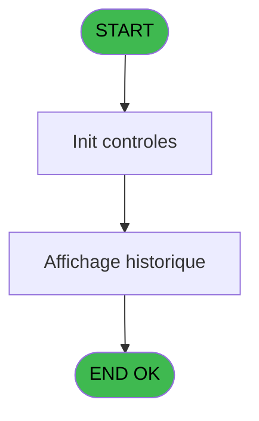
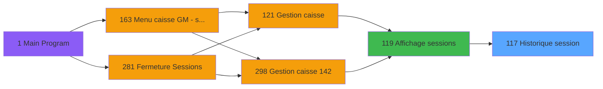
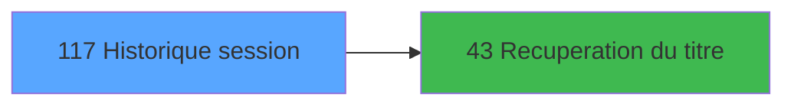

# ADH IDE 117 - Historique session

> **Analyse**: Phases 1-4 2026-02-08 02:57 -> 02:57 (4s) | Assemblage 02:57
> **Pipeline**: V7.2 Enrichi
> **Structure**: 4 onglets (Resume | Ecrans | Donnees | Connexions)

<!-- TAB:Resume -->

## 1. FICHE D'IDENTITE

| Attribut | Valeur |
|----------|--------|
| Projet | ADH |
| IDE Position | 117 |
| Nom Programme | Historique session |
| Fichier source | `Prg_117.xml` |
| Dossier IDE | Caisse |
| Taches | 4 (0 ecrans visibles) |
| Tables modifiees | 0 |
| Programmes appeles | 1 |
| Complexite | **BASSE** (score 5/100) |

## 2. DESCRIPTION FONCTIONNELLE

ADH IDE 117 affiche l'historique des opérations effectuées au cours d'une session de caisse. Le programme récupère les mouvements enregistrés (ventes, encaissements, remboursements) et les présente chronologiquement pour permettre à l'opérateur de consulter les transactions passées. C'est un programme de lecture pure, sans modification de données, qui facilite l'audit et le contrôle des opérations.

La structure repose sur une grille de consultation interrogeant la table des opérations avec filtrage par numéro de session et période. Le programme applique les droits d'accès pour déterminer quelles colonnes afficher (soldes, montants détaillés, etc.) selon le profil de l'opérateur. Les données sont triées chronologiquement pour reconstituer le fil des événements.

ADH IDE 117 s'inscrit dans le flux de gestion de caisse en tant qu'outil de traçabilité. Après la fermeture de session, l'opérateur peut consulter cet historique pour valider l'exactitude des enregistrements ou investiguer une anomalie. Le programme appelle ADH IDE 43 pour résoudre les identifiants de compte en noms d'adhérents, enrichissant la lisibilité des mouvements affichés.

## 3. BLOCS FONCTIONNELS

## 5. REGLES METIER

*(Aucune regle metier identifiee dans les expressions)*

## 6. CONTEXTE

- **Appele par**: [Affichage sessions (IDE 119)](ADH-IDE-119.md)
- **Appelle**: 1 programmes | **Tables**: 3 (W:0 R:2 L:1) | **Taches**: 4 | **Expressions**: 1

<!-- TAB:Ecrans -->

## 8. ECRANS

*(Programme sans ecran visible)*

## 9. NAVIGATION

### 9.3 Structure hierarchique (0 tache)

| Position | Tache | Type | Dimensions | Bloc |
|----------|-------|------|------------|------|

### 9.4 Algorigramme

> **Legende**: Vert = START/END OK | Rouge = END KO | Bleu = Decisions
> *Algorigramme auto-genere. Utiliser `/algorigramme` pour une synthese metier detaillee.*

<!-- TAB:Donnees -->

## 10. TABLES

### Tables utilisees (3)

| ID | Nom | Description | Type | R | W | L | Usages |
|----|-----|-------------|------|---|---|---|--------|
| 249 | histo_sessions_caisse_detail | Sessions de caisse | DB | R |   |   | 1 |
| 246 | histo_sessions_caisse | Sessions de caisse | DB | R |   |   | 1 |
| 693 | devise_in | Devises / taux de change | DB |   |   | L | 1 |

### Colonnes par table (3 / 2 tables avec colonnes identifiees)

Table 249 - histo_sessions_caisse_detail (R) - 1 usages

| Lettre | Variable | Acces | Type |
|--------|----------|-------|------|
| EN | curseur detail | R | Logical |
| EO | Flag detail | R | Logical |
| ER | Fin Historique | R | Logical |
| EW | Total caisse | R | Numeric |

Table 246 - histo_sessions_caisse (R) - 1 usages

| Lettre | Variable | Acces | Type |
|--------|----------|-------|------|
| A | curseur | R | Logical |
| B | Flag detail | R | Logical |
| C | titre | R | Alpha |

## 11. VARIABLES

### 11.1 Autres (10)

Variables diverses.

| Lettre | Nom | Type | Usage dans |
|--------|-----|------|-----------|
| EN | Param societe | Alpha | - |
| EO | Param devise locale | Alpha | - |
| EP | Param masque montant | Alpha | - |
| EQ | Param user | Alpha | - |
| ER | Fin Historique | Logical | 1x refs |
| ES | LastQuand | Alpha | - |
| ET | Validation comptage chrono his | Numeric | - |
| EU | Validation comptage chrono date | Date | - |
| EV | Validation comptage chrono time | Time | - |
| EW | Total caisse | Numeric | - |

## 12. EXPRESSIONS

**1 / 1 expressions decodees (100%)**

### 12.1 Repartition par type

| Type | Expressions | Regles |
|------|-------------|--------|
| OTHER | 1 | 0 |

### 12.2 Expressions cles par type

#### OTHER (1 expressions)

| Type | IDE | Expression | Regle |
|------|-----|------------|-------|
| OTHER | 1 | `Fin Historique [E]` | - |

<!-- TAB:Connexions -->

## 13. GRAPHE D'APPELS

### 13.1 Chaine depuis Main (Callers)

Main -> ... -> [Affichage sessions (IDE 119)](ADH-IDE-119.md) -> **Historique session (IDE 117)**

### 13.2 Callers

| IDE | Nom Programme | Nb Appels |
|-----|---------------|-----------|
| [119](ADH-IDE-119.md) | Affichage sessions | 2 |

### 13.3 Callees (programmes appeles)

### 13.4 Detail Callees avec contexte

| IDE | Nom Programme | Appels | Contexte |
|-----|---------------|--------|----------|
| [43](ADH-IDE-43.md) | Recuperation du titre | 1 | Recuperation donnees |

## 14. RECOMMANDATIONS MIGRATION

### 14.1 Profil du programme

| Metrique | Valeur | Impact migration |
|----------|--------|-----------------|
| Lignes de logique | 124 | Programme compact |
| Expressions | 1 | Peu de logique |
| Tables WRITE | 0 | Impact faible |
| Sous-programmes | 1 | Peu de dependances |
| Ecrans visibles | 0 | Ecran unique ou traitement batch |
| Code desactive | 0% (0 / 124) | Code sain |
| Regles metier | 0 | Pas de regle identifiee |

### 14.2 Plan de migration par bloc

### 14.3 Dependances critiques

| Dependance | Type | Appels | Impact |
|------------|------|--------|--------|
| [Recuperation du titre (IDE 43)](ADH-IDE-43.md) | Sous-programme | 1x | Normale - Recuperation donnees |

---
*Spec DETAILED generee par Pipeline V7.2 - 2026-02-08 02:58*
