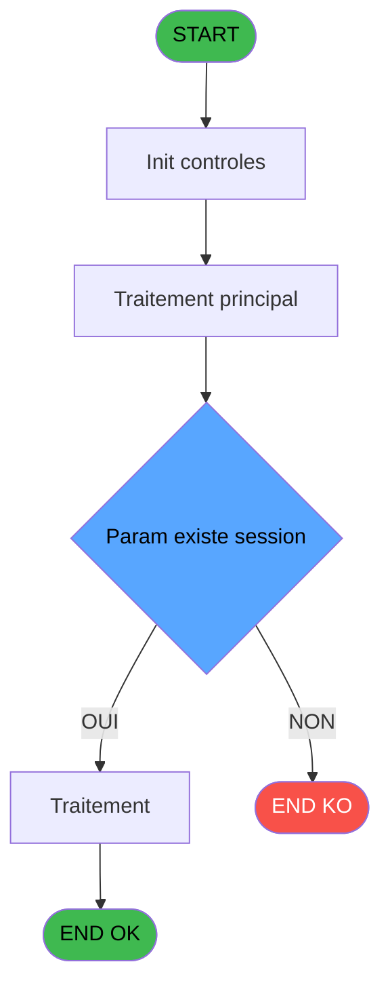
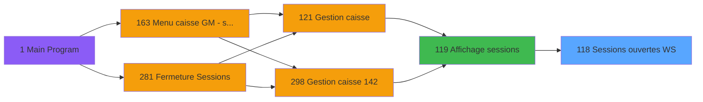
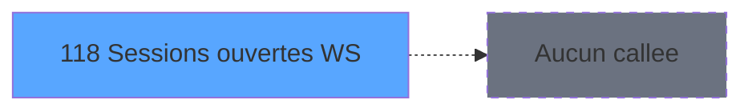

# ADH IDE 118 - Sessions ouvertes WS

> **Analyse**: Phases 1-4 2026-02-08 02:58 -> 02:58 (4s) | Assemblage 02:58
> **Pipeline**: V7.2 Enrichi
> **Structure**: 4 onglets (Resume | Ecrans | Donnees | Connexions)

<!-- TAB:Resume -->

## 1. FICHE D'IDENTITE

| Attribut | Valeur |
|----------|--------|
| Projet | ADH |
| IDE Position | 118 |
| Nom Programme | Sessions ouvertes WS |
| Fichier source | `Prg_118.xml` |
| Dossier IDE | Caisse |
| Taches | 1 (0 ecrans visibles) |
| Tables modifiees | 0 |
| Programmes appeles | 0 |
| Complexite | **BASSE** (score 0/100) |

## 2. DESCRIPTION FONCTIONNELLE

# ADH IDE 118 - Sessions ouvertes WS

Programme de consultation des sessions ouvertes actuellement, avec affichage des données clés (numéro compte, opérateur, devise, montant). Utilisé comme source de données pour l'écran de gestion des sessions (IDE 119), d'où il est appelé via CallTask pour alimenter une grille/table avec les sessions actives.

Structure basée sur une requête vers la table des sessions (sessions_dat ou équivalent), avec filtrage par statut ouvert et tri par ordre chronologique. Les variables retournées incluent identifiants compte/filiation/société, détails opérateur et métadonnées monétaires (devise locale, montants coffre).

Point d'intégration critique dans le flux "Gestion Caisse" — IDÉ 118 fournit la liste des contextes actifs que l'opérateur doit fermer ou consulter. Pas d'interface visuelle propre (données brutes), mais rôle de data provider pour l'écran IDÉ 119 qui présente ces données à l'utilisateur final.

## 3. BLOCS FONCTIONNELS

## 5. REGLES METIER

2 regles identifiees:

### Autres (2 regles)

#### [RM-001] Condition: [C] egale 0

| Element | Detail |
|---------|--------|
| **Condition** | `[C]=0` |
| **Si vrai** | Action si vrai |
| **Expression source** | Expression 4 : `[C]=0` |
| **Exemple** | Si [C]=0 → Action si vrai |

#### [RM-002] Condition composite: Param existe session [A] AND Param existe session o... [B]

| Element | Detail |
|---------|--------|
| **Condition** | `Param existe session [A] AND Param existe session o... [B]` |
| **Si vrai** | Action si vrai |
| **Variables** | EN (Param existe session) |
| **Expression source** | Expression 5 : `Param existe session [A] AND Param existe session o... [B]` |
| **Exemple** | Si Param existe session [A] AND Param existe session o... [B] → Action si vrai |

## 6. CONTEXTE

- **Appele par**: [Affichage sessions (IDE 119)](ADH-IDE-119.md)
- **Appelle**: 0 programmes | **Tables**: 1 (W:0 R:1 L:0) | **Taches**: 1 | **Expressions**: 5

<!-- TAB:Ecrans -->

## 8. ECRANS

*(Programme sans ecran visible)*

## 9. NAVIGATION

### 9.3 Structure hierarchique (0 tache)

| Position | Tache | Type | Dimensions | Bloc |
|----------|-------|------|------------|------|

### 9.4 Algorigramme

> **Legende**: Vert = START/END OK | Rouge = END KO | Bleu = Decisions
> *Algorigramme auto-genere. Utiliser `/algorigramme` pour une synthese metier detaillee.*

<!-- TAB:Donnees -->

## 10. TABLES

### Tables utilisees (1)

| ID | Nom | Description | Type | R | W | L | Usages |
|----|-----|-------------|------|---|---|---|--------|
| 246 | histo_sessions_caisse | Sessions de caisse | DB | R |   |   | 1 |

### Colonnes par table (1 / 1 tables avec colonnes identifiees)

Table 246 - histo_sessions_caisse (R) - 1 usages

| Lettre | Variable | Acces | Type |
|--------|----------|-------|------|
| A | Param existe session | R | Logical |
| B | Param existe session ouverte | R | Logical |

## 11. VARIABLES

### 11.1 Autres (2)

Variables diverses.

| Lettre | Nom | Type | Usage dans |
|--------|-----|------|-----------|
| EN | Param existe session | Logical | 1x refs |
| EO | Param existe session ouverte | Logical | - |

## 12. EXPRESSIONS

**5 / 5 expressions decodees (100%)**

### 12.1 Repartition par type

| Type | Expressions | Regles |
|------|-------------|--------|
| CONDITION | 2 | 2 |
| CONSTANTE | 1 | 0 |
| CAST_LOGIQUE | 2 | 0 |

### 12.2 Expressions cles par type

#### CONDITION (2 expressions)

| Type | IDE | Expression | Regle |
|------|-----|------------|-------|
| CONDITION | 5 | `Param existe session [A] AND Param existe session o... [B]` | [RM-002](#rm-RM-002) |
| CONDITION | 4 | `[C]=0` | [RM-001](#rm-RM-001) |

#### CONSTANTE (1 expressions)

| Type | IDE | Expression | Regle |
|------|-----|------------|-------|
| CONSTANTE | 2 | `0` | - |

#### CAST_LOGIQUE (2 expressions)

| Type | IDE | Expression | Regle |
|------|-----|------------|-------|
| CAST_LOGIQUE | 3 | `'TRUE'LOG` | - |
| CAST_LOGIQUE | 1 | `'FALSE'LOG` | - |

<!-- TAB:Connexions -->

## 13. GRAPHE D'APPELS

### 13.1 Chaine depuis Main (Callers)

Main -> ... -> [Affichage sessions (IDE 119)](ADH-IDE-119.md) -> **Sessions ouvertes WS (IDE 118)**

### 13.2 Callers

| IDE | Nom Programme | Nb Appels |
|-----|---------------|-----------|
| [119](ADH-IDE-119.md) | Affichage sessions | 3 |

### 13.3 Callees (programmes appeles)

### 13.4 Detail Callees avec contexte

| IDE | Nom Programme | Appels | Contexte |
|-----|---------------|--------|----------|
| - | (aucun) | - | - |

## 14. RECOMMANDATIONS MIGRATION

### 14.1 Profil du programme

| Metrique | Valeur | Impact migration |
|----------|--------|-----------------|
| Lignes de logique | 10 | Programme compact |
| Expressions | 5 | Peu de logique |
| Tables WRITE | 0 | Impact faible |
| Sous-programmes | 0 | Peu de dependances |
| Ecrans visibles | 0 | Ecran unique ou traitement batch |
| Code desactive | 0% (0 / 10) | Code sain |
| Regles metier | 2 | Quelques regles a preserver |

### 14.2 Plan de migration par bloc

### 14.3 Dependances critiques

| Dependance | Type | Appels | Impact |
|------------|------|--------|--------|

---
*Spec DETAILED generee par Pipeline V7.2 - 2026-02-08 02:58*
