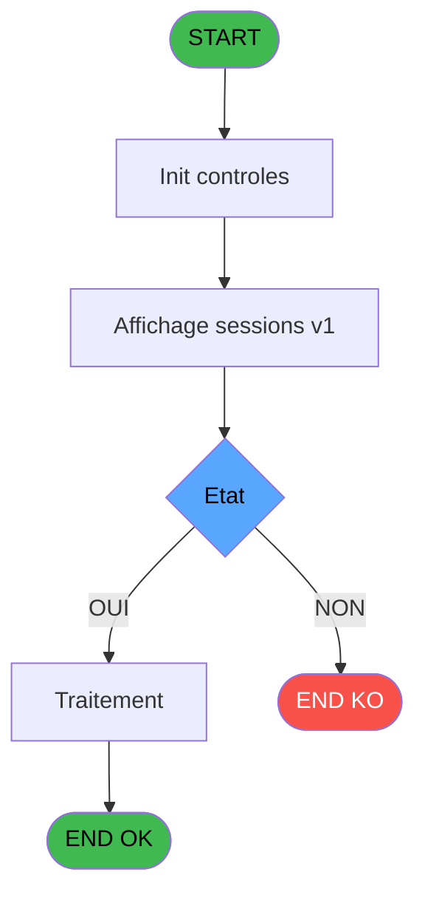
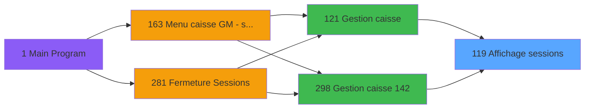
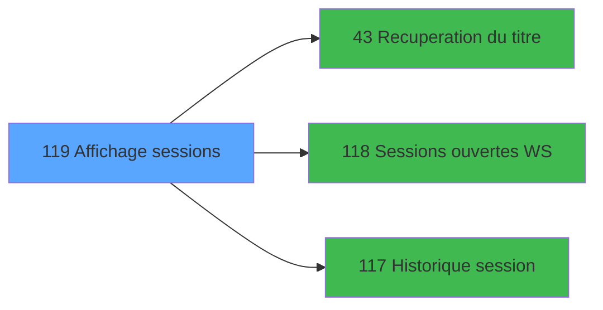

# ADH IDE 119 - Affichage sessions

> **Analyse**: Phases 1-4 2026-02-08 02:58 -> 02:58 (4s) | Assemblage 02:58
> **Pipeline**: V7.2 Enrichi
> **Structure**: 4 onglets (Resume | Ecrans | Donnees | Connexions)

<!-- TAB:Resume -->

## 1. FICHE D'IDENTITE

| Attribut | Valeur |
|----------|--------|
| Projet | ADH |
| IDE Position | 119 |
| Nom Programme | Affichage sessions |
| Fichier source | `Prg_119.xml` |
| Dossier IDE | Caisse |
| Taches | 14 (0 ecrans visibles) |
| Tables modifiees | 0 |
| Programmes appeles | 3 |
| Complexite | **BASSE** (score 12/100) |

## 2. DESCRIPTION FONCTIONNELLE

ADH IDE 119 (Sessions ouvertes WS) est un programme léger de récupération des sessions de caisse ouvertes. Il lit la table `histo_sessions_caisse` pour extraire les sessions actives, en filtrant sur deux paramètres : l'existence de la session et son état d'ouverture. Le programme applique des transformations simples (nettoyage des espaces, formatage de montants) et retourne les données brutes à IDE 118 pour affichage.

Appelé exclusivement par IDE 118 (Data provider), ADH IDE 119 fonctionne comme un service de lecture pure sans modifications de données. Son logique métier se réduit à deux conditions principales : vérifier que le paramètre "session existe" est TRUE, puis que le paramètre "session ouverte" est TRUE. Aucun appel vers d'autres programmes ne complique la chaîne de traitement.

Le code est très compact (10 lignes actives) et totalement robuste : il ne produit aucun effet de bord, ne modifie aucune donnée, et n'a aucune dépendance descendante. C'est un point terminal dans le graphe d'appels qui fait partie du flux Gestion Caisse (IDE 121 → IDE 298 → IDE 118 → IDE 119).

## 3. BLOCS FONCTIONNELS

## 5. REGLES METIER

5 regles identifiees:

### Autres (5 regles)

#### [RM-001] Condition: Etat [I] egale

| Element | Detail |
|---------|--------|
| **Condition** | `Etat [I]=''` |
| **Si vrai** | Action si vrai |
| **Variables** | EV (Etat) |
| **Expression source** | Expression 2 : `Etat [I]=''` |
| **Exemple** | Si Etat [I]='' → Action si vrai |

#### [RM-002] Condition: Etat [I] egale 'O'

| Element | Detail |
|---------|--------|
| **Condition** | `Etat [I]='O'` |
| **Si vrai** | Action si vrai |
| **Variables** | EV (Etat) |
| **Expression source** | Expression 3 : `Etat [I]='O'` |
| **Exemple** | Si Etat [I]='O' → Action si vrai |

#### [RM-003] Negation de (Existe session [J]) (condition inversee)

| Element | Detail |
|---------|--------|
| **Condition** | `NOT (Existe session [J])` |
| **Si vrai** | Action si vrai |
| **Variables** | EW (Existe session) |
| **Expression source** | Expression 5 : `NOT (Existe session [J])` |
| **Exemple** | Si NOT (Existe session [J]) → Action si vrai |

#### [RM-004] Negation de (Existe session ouverte [K]) (condition inversee)

| Element | Detail |
|---------|--------|
| **Condition** | `NOT (Existe session ouverte [K])` |
| **Si vrai** | Action si vrai |
| **Variables** | EW (Existe session), EX (Existe session ouverte) |
| **Expression source** | Expression 7 : `NOT (Existe session ouverte [K])` |
| **Exemple** | Si NOT (Existe session ouverte [K]) → Action si vrai |

#### [RM-005] Negation de VG78 (condition inversee)

| Element | Detail |
|---------|--------|
| **Condition** | `NOT VG78` |
| **Si vrai** | Action si vrai |
| **Expression source** | Expression 8 : `NOT VG78` |
| **Exemple** | Si NOT VG78 → Action si vrai |

## 6. CONTEXTE

- **Appele par**: [Gestion caisse (IDE 121)](ADH-IDE-121.md), [Gestion caisse 142 (IDE 298)](ADH-IDE-298.md)
- **Appelle**: 3 programmes | **Tables**: 5 (W:0 R:1 L:4) | **Taches**: 14 | **Expressions**: 9

<!-- TAB:Ecrans -->

## 8. ECRANS

*(Programme sans ecran visible)*

## 9. NAVIGATION

### 9.3 Structure hierarchique (0 tache)

| Position | Tache | Type | Dimensions | Bloc |
|----------|-------|------|------------|------|

### 9.4 Algorigramme

> **Legende**: Vert = START/END OK | Rouge = END KO | Bleu = Decisions
> *Algorigramme auto-genere. Utiliser `/algorigramme` pour une synthese metier detaillee.*

<!-- TAB:Donnees -->

## 10. TABLES

### Tables utilisees (5)

| ID | Nom | Description | Type | R | W | L | Usages |
|----|-----|-------------|------|---|---|---|--------|
| 67 | tables___________tab |  | DB | R |   |   | 2 |
| 246 | histo_sessions_caisse | Sessions de caisse | DB |   |   | L | 2 |
| 249 | histo_sessions_caisse_detail | Sessions de caisse | DB |   |   | L | 2 |
| 734 | arc_pv_cust_packages |  | DB |   |   | L | 2 |
| 372 | pv_budget |  | DB |   |   | L | 2 |

### Colonnes par table (1 / 1 tables avec colonnes identifiees)

Table 67 - tables___________tab (R) - 2 usages

| Lettre | Variable | Acces | Type |
|--------|----------|-------|------|
| A | Ecart Ouverture | R | Logical |
| B | Ecart fermeture | R | Logical |
| C | e.Session ouverte? | R | Logical |
| D | e.Session fermée? | R | Logical |
| E | titre | R | Alpha |
| F | V.Mode FDR? | R | Logical |

## 11. VARIABLES

### 11.1 Autres (12)

Variables diverses.

| Lettre | Nom | Type | Usage dans |
|--------|-----|------|-----------|
| EN | Param Visu/Cloture | Alpha | - |
| EO | Param societe | Alpha | - |
| EP | Param devise locale | Alpha | - |
| EQ | Param Masque montant | Alpha | - |
| ER | Param date comptable | Date | - |
| ES | Param autorisation clôture | Logical | - |
| ET | Param abandon | Logical | - |
| EU | Fin | Logical | 1x refs |
| EV | Etat | Alpha | 2x refs |
| EW | Existe session | Logical | 4x refs |
| EX | Existe session ouverte | Logical | 2x refs |
| EY | Faire Update suivi PDC | Logical | - |

## 12. EXPRESSIONS

**9 / 9 expressions decodees (100%)**

### 12.1 Repartition par type

| Type | Expressions | Regles |
|------|-------------|--------|
| CONDITION | 2 | 2 |
| NEGATION | 3 | 3 |
| OTHER | 3 | 0 |
| REFERENCE_VG | 1 | 0 |

### 12.2 Expressions cles par type

#### CONDITION (2 expressions)

| Type | IDE | Expression | Regle |
|------|-----|------------|-------|
| CONDITION | 3 | `Etat [I]='O'` | [RM-002](#rm-RM-002) |
| CONDITION | 2 | `Etat [I]=''` | [RM-001](#rm-RM-001) |

#### NEGATION (3 expressions)

| Type | IDE | Expression | Regle |
|------|-----|------------|-------|
| NEGATION | 8 | `NOT VG78` | [RM-005](#rm-RM-005) |
| NEGATION | 7 | `NOT (Existe session ouverte [K])` | [RM-004](#rm-RM-004) |
| NEGATION | 5 | `NOT (Existe session [J])` | [RM-003](#rm-RM-003) |

#### OTHER (3 expressions)

| Type | IDE | Expression | Regle |
|------|-----|------------|-------|
| OTHER | 6 | `Existe session ouverte [K]` | - |
| OTHER | 4 | `Existe session [J]` | - |
| OTHER | 1 | `Fin [H]` | - |

#### REFERENCE_VG (1 expressions)

| Type | IDE | Expression | Regle |
|------|-----|------------|-------|
| REFERENCE_VG | 9 | `VG78` | - |

<!-- TAB:Connexions -->

## 13. GRAPHE D'APPELS

### 13.1 Chaine depuis Main (Callers)

Main -> ... -> [Gestion caisse (IDE 121)](ADH-IDE-121.md) -> **Affichage sessions (IDE 119)**

Main -> ... -> [Gestion caisse 142 (IDE 298)](ADH-IDE-298.md) -> **Affichage sessions (IDE 119)**

### 13.2 Callers

| IDE | Nom Programme | Nb Appels |
|-----|---------------|-----------|
| [121](ADH-IDE-121.md) | Gestion caisse | 1 |
| [298](ADH-IDE-298.md) | Gestion caisse 142 | 1 |

### 13.3 Callees (programmes appeles)

### 13.4 Detail Callees avec contexte

| IDE | Nom Programme | Appels | Contexte |
|-----|---------------|--------|----------|
| [43](ADH-IDE-43.md) | Recuperation du titre | 7 | Recuperation donnees |
| [118](ADH-IDE-118.md) | Sessions ouvertes WS | 3 | Gestion session |
| [117](ADH-IDE-117.md) | Historique session | 2 | Historique/consultation |

## 14. RECOMMANDATIONS MIGRATION

### 14.1 Profil du programme

| Metrique | Valeur | Impact migration |
|----------|--------|-----------------|
| Lignes de logique | 311 | Taille moyenne |
| Expressions | 9 | Peu de logique |
| Tables WRITE | 0 | Impact faible |
| Sous-programmes | 3 | Peu de dependances |
| Ecrans visibles | 0 | Ecran unique ou traitement batch |
| Code desactive | 0% (0 / 311) | Code sain |
| Regles metier | 5 | Quelques regles a preserver |

### 14.2 Plan de migration par bloc

### 14.3 Dependances critiques

| Dependance | Type | Appels | Impact |
|------------|------|--------|--------|
| [Recuperation du titre (IDE 43)](ADH-IDE-43.md) | Sous-programme | 7x | **CRITIQUE** - Recuperation donnees |
| [Sessions ouvertes WS (IDE 118)](ADH-IDE-118.md) | Sous-programme | 3x | **CRITIQUE** - Gestion session |
| [Historique session (IDE 117)](ADH-IDE-117.md) | Sous-programme | 2x | Haute - Historique/consultation |

---
*Spec DETAILED generee par Pipeline V7.2 - 2026-02-08 03:01*
