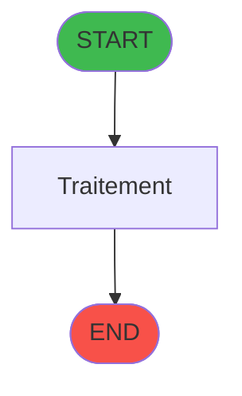
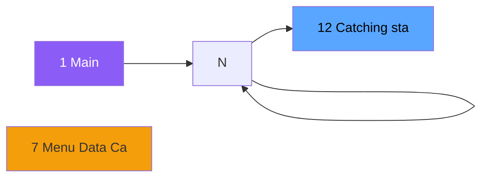
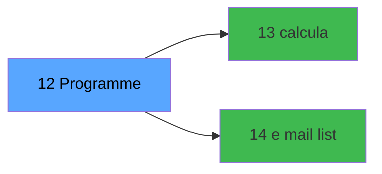

# ADH IDE 12 - Catching stats

> **Version spec**: 3.5
> **Analyse**: 2026-01-27 17:56
> **Source**: `Prg_XXX.xml`

---

<!-- TAB:Fonctionnel -->

## SPECIFICATION FONCTIONNELLE

### 1.1 Objectif metier

| Element | Description |
|---------|-------------|
| **Qui** | Operateur |
| **Quoi** | Catching stats
 |
| **Pourquoi** | A documenter |
| **Declencheur** | A identifier |

### 1.2 Regles metier

| Code | Regle | Condition |
|------|-------|-----------|
| RM-001 | A documenter | - |

### 1.3 Flux utilisateur

1. Demarrage programme
2. Traitement principal
3. Fin programme

### 1.4 Cas d'erreur

| Erreur | Comportement |
|--------|--------------|
| - | A documenter |

---

<!-- TAB:Technique -->

## SPECIFICATION TECHNIQUE

### 2.1 Identification

| Attribut | Valeur |
|----------|--------|
| **Format IDE** | ADH IDE 12 |
| **Description** | Catching stats
 |
| **Module** | ADH |

### 2.2 Tables

| # | Nom logique | Nom physique | Acces | Usage |
|---|-------------|--------------|-------|-------|
| 22 | address_data_catching | `cafil_address_ec` | R | 1x |
| 22 | address_data_catching | `cafil_address_ec` | **W** | 1x |
| 69 | initialisation___ini | `cafil047_dat` | R | 1x |
| 781 | log_affec_auto_entete | `log_affec_auto_entete` | R | 1x |
| 782 | quadriga_chambre | `quadriga_chambre` | **W** | 1x |
### 2.3 Parametres d'entree

| Variable | Nom | Type | Picture |
|----------|-----|------|---------|
| - | Aucun parametre | - | - |
### 2.4 Algorigramme

### 2.5 Expressions cles

| IDE | Expression | Commentaire |
|-----|------------|-------------|
| 1 | `NOT ({0,1})` | - |
| 2 | `'FALSE'LOG` | - |
| 3 | `BOM ({0,2})` | - |
| 4 | `DOW ({0,3})` | - |
| 5 | `AddDate ({0,3},0,0,1-{0,4})` | - |
| 6 | `Date ()` | - |
| 7 | `BOM ({0,2})` | - |
| 8 | `IF ({0,9}-{0,8}=0,'D',IF ({0,9}-{0,8}=6,'W','M'))` | - |
| 9 | `IF (LastClicked ()<>'MANUALY',IF ({0,7}='D',{0,...` | - |

> **Total**: 9 expressions (affichees: 9)
### 2.6 Variables importantes

### 2.7 Statistiques

| Metrique | Valeur |
|----------|--------|
| **Taches** | 7 |
| **Lignes logique** | 194 |
| **Lignes desactivees** | 0 |
---

<!-- TAB:Cartographie -->

## CARTOGRAPHIE APPLICATIVE

### 3.1 Chaine d'appels depuis Main

### 3.2 Callers directs

| IDE | Programme | Nb appels |
|-----|-----------|-----------|
| 7 | Menu Data Catching | 1 |
### 3.3 Callees

| Niv | IDE | Programme | Nb appels |
|-----|-----|-----------|-----------|
| 1 | 13 |      calculate week # | 1 |
| 1 | 14 | e-mail list | 1 |
### 3.4 Verification orphelin

| Critere | Resultat |
|---------|----------|
| Callers actifs | A verifier |
| **Conclusion** | A analyser |

---

## HISTORIQUE

| Date | Action | Auteur |
|------|--------|--------|
| 2026-01-27 20:17 | **DATA V2** - Tables reelles, Expressions, Stats, CallChain | Script |
| 2026-01-27 19:43 | **DATA POPULATED** - Tables, Callgraph (9 expr) | Script |
| 2026-01-27 17:56 | **Upgrade V3.5** - TAB markers, Mermaid | Claude |

---

*Specification V3.5 - Format avec TAB markers et Mermaid*
