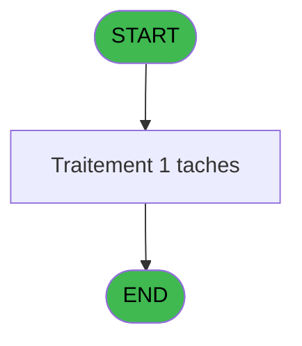

# ADH IDE 12 - Export - address

> **Analyse**: Phases 1-4 2026-02-07 06:34 -> 06:35 (17s) | Assemblage 06:35
> **Pipeline**: V7.2 Enrichi
> **Structure**: 4 onglets (Resume | Ecrans | Donnees | Connexions)

<!-- TAB:Resume -->

## 1. FICHE D'IDENTITE

| Attribut | Valeur |
|----------|--------|
| Projet | ADH |
| IDE Position | 12 |
| Nom Programme | Export - address |
| Fichier source | `Prg_12.xml` |
| Dossier IDE | Brazil |
| Taches | 1 (0 ecrans visibles) |
| Tables modifiees | 1 |
| Programmes appeles | 0 |
| :warning: Statut | **ORPHELIN_POTENTIEL** |

## 2. DESCRIPTION FONCTIONNELLE

**Export - address** assure la gestion complete de ce processus.

**Donnees modifiees** : 1 tables en ecriture (address_data_catching).

**Logique metier** : 1 regles identifiees couvrant conditions metier.

## 3. BLOCS FONCTIONNELS

## 5. REGLES METIER

1 regles identifiees:

### Autres (1 regles)

#### [RM-001] Traitement conditionnel si [AY]<>'','0',IF ([BD] est a zero

| Element | Detail |
|---------|--------|
| **Condition** | `[AY]<>''` |
| **Si vrai** | '0' |
| **Si faux** | IF ([BD]=0,'1','2')) |
| **Expression source** | Expression 10 : `IF ([AY]<>'','0',IF ([BD]=0,'1','2'))` |
| **Exemple** | Si [AY]<>'' → '0'. Sinon → IF ([BD]=0,'1','2')) |

## 6. CONTEXTE

- **Appele par**: (aucun)
- **Appelle**: 0 programmes | **Tables**: 3 (W:1 R:0 L:2) | **Taches**: 1 | **Expressions**: 11

<!-- TAB:Ecrans -->

## 8. ECRANS

*(Programme sans ecran visible)*

## 9. NAVIGATION

### 9.3 Structure hierarchique (0 tache)

| Position | Tache | Type | Dimensions | Bloc |
|----------|-------|------|------------|------|

### 9.4 Algorigramme

> *algo-data indisponible. Utiliser `/algorigramme` pour generer.*

<!-- TAB:Donnees -->

## 10. TABLES

### Tables utilisees (3)

| ID | Nom | Description | Type | R | W | L | Usages |
|----|-----|-------------|------|---|---|---|--------|
| 22 | address_data_catching |  | DB |   | **W** |   | 1 |
| 31 | gm-complet_______gmc |  | DB |   |   | L | 1 |
| 36 | client_gm |  | DB |   |   | L | 1 |

### Colonnes par table (0 / 1 tables avec colonnes identifiees)

Table 22 - address_data_catching (**W**) - 1 usages

*Table utilisee uniquement en Link ou aucune colonne Real identifiee dans le DataView.*

## 11. VARIABLES

*(Programme sans variables locales mappees)*

## 12. EXPRESSIONS

**11 / 11 expressions decodees (100%)**

### 12.1 Repartition par type

| Type | Expressions | Regles |
|------|-------------|--------|
| CONDITION | 1 | 5 |
| OTHER | 6 | 0 |
| CAST_LOGIQUE | 4 | 0 |

### 12.2 Expressions cles par type

#### CONDITION (1 expressions)

| Type | IDE | Expression | Regle |
|------|-----|------------|-------|
| CONDITION | 10 | `IF ([AY]<>'','0',IF ([BD]=0,'1','2'))` | [RM-001](#rm-RM-001) |

#### OTHER (6 expressions)

| Type | IDE | Expression | Regle |
|------|-----|------------|-------|
| OTHER | 4 | `[J]` | - |
| OTHER | 7 | `ASCIIChr (33)` | - |
| OTHER | 9 | `INIGet ('[MAGIC_LOGICAL_NAMES]club_email_export')&'KIOemail.TXT'` | - |
| OTHER | 1 | `[B]` | - |
| OTHER | 2 | `[H]` | - |
| ... | | *+1 autres* | |

#### CAST_LOGIQUE (4 expressions)

| Type | IDE | Expression | Regle |
|------|-----|------------|-------|
| CAST_LOGIQUE | 8 | `'TRUE'LOG` | - |
| CAST_LOGIQUE | 11 | `'TRUE'LOG` | - |
| CAST_LOGIQUE | 5 | `'FALSE'LOG` | - |
| CAST_LOGIQUE | 6 | `'TRUE'LOG` | - |

<!-- TAB:Connexions -->

## 13. GRAPHE D'APPELS

### 13.1 Chaine depuis Main (Callers)

**Chemin**: (pas de callers directs)

### 13.2 Callers

| IDE | Nom Programme | Nb Appels |
|-----|---------------|-----------|
| - | (aucun) | - |

### 13.3 Callees (programmes appeles)

### 13.4 Detail Callees avec contexte

| IDE | Nom Programme | Appels | Contexte |
|-----|---------------|--------|----------|
| - | (aucun) | - | - |

## 14. RECOMMANDATIONS MIGRATION

### 14.1 Profil du programme

| Metrique | Valeur | Impact migration |
|----------|--------|-----------------|
| Lignes de logique | 68 | Programme compact |
| Expressions | 11 | Peu de logique |
| Tables WRITE | 1 | Impact faible |
| Sous-programmes | 0 | Peu de dependances |
| Ecrans visibles | 0 | Ecran unique ou traitement batch |
| Code desactive | 0% (0 / 68) | Code sain |
| Regles metier | 1 | Quelques regles a preserver |

### 14.2 Plan de migration par bloc

### 14.3 Dependances critiques

| Dependance | Type | Appels | Impact |
|------------|------|--------|--------|
| address_data_catching | Table WRITE (Database) | 1x | Schema + repository |

---
*Spec DETAILED generee par Pipeline V7.2 - 2026-02-07 06:35*
