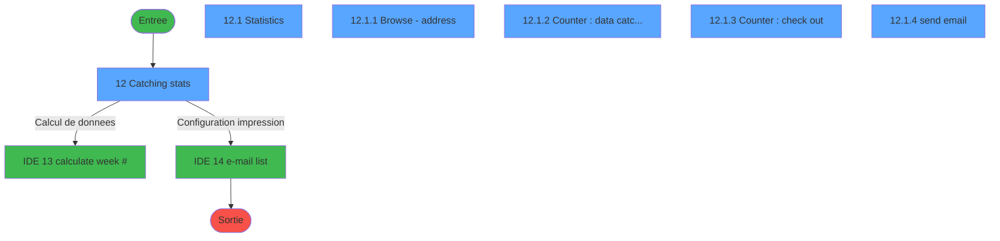
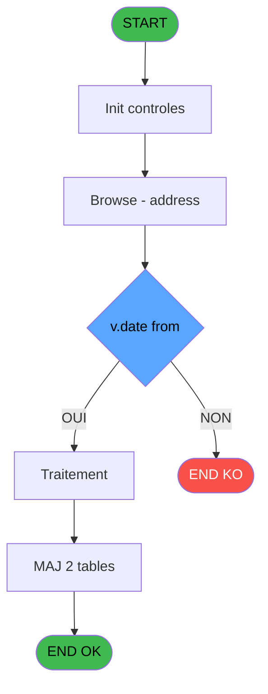
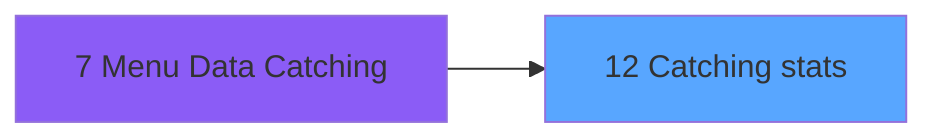
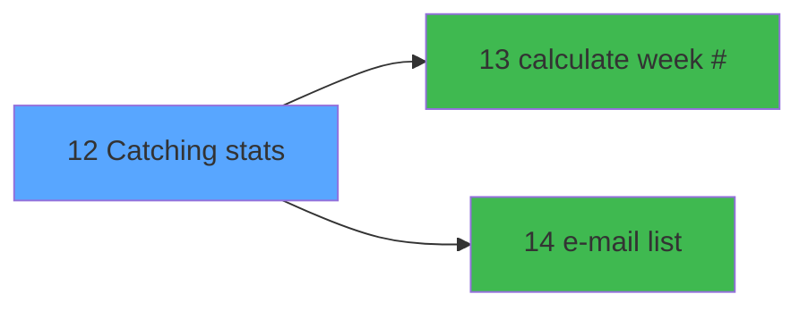

# ADH IDE 12 - Catching stats

> **Analyse**: Phases 1-4 2026-02-07 03:39 -> 01:11 (21h31min) | Assemblage 01:11
> **Pipeline**: V7.2 Enrichi
> **Structure**: 4 onglets (Resume | Ecrans | Donnees | Connexions)

<!-- TAB:Resume -->

## 1. FICHE D'IDENTITE

| Attribut | Valeur |
|----------|--------|
| Projet | ADH |
| IDE Position | 12 |
| Nom Programme | Catching stats |
| Fichier source | `Prg_12.xml` |
| Dossier IDE | General |
| Taches | 7 (6 ecrans visibles) |
| Tables modifiees | 2 |
| Programmes appeles | 2 |
| Complexite | **BASSE** (score 19/100) |

## 2. DESCRIPTION FONCTIONNELLE

**ADH IDE 12 - Catching stats** gère la collecte et le traitement des statistiques de capture de données pour le module Brazil DataCatching. Ce programme batch fonctionne de manière isolée, sans paramètres d'entrée, exécutant une logique simple composée d'une unique tâche contenant 68 lignes. Son rôle est d'interagir avec les tables de catching pour enregistrer et mettre à jour les statistiques, notamment la table `address_data_catching` qu'il modifie directement.

La logique décisionnelle du programme repose sur une expression conditionnelle clé qui évalue deux variables locales (AY et BD) pour déterminer un statut : `IF ([AY]<>'','0',IF ([BD]=0,'1','2'))`. Cette règle implémente une classification métier simple basée sur la présence/absence de données et une valeur numérique, probablement pour distinguer différents états du catching (complet, incomplet, ou cas d'erreur).

Le programme est un terminal applicatif sans dépendances externes : il ne reçoit aucun appel de sous-programmes et n'appelle lui-même aucun programme. Il consulte deux tables de référence (client GM, complétude GM) en lecture mais modifie exclusivement `address_data_catching`, ce qui en fait un intégrateur de données de capturing spécialisé dans l'accumulation et la validation des statistiques du système.

## 3. BLOCS FONCTIONNELS

### 3.1 Traitement (7 taches)

Traitements internes.

---

#### 12 - Catching stats [[ECRAN]](#ecran-t1)

**Role** : Tache d'orchestration : point d'entree du programme (7 sous-taches). Coordonne l'enchainement des traitements.
**Ecran** : 723 x 375 DLU (MDI) | [Voir mockup](#ecran-t1)

6 sous-taches directes

| Tache | Nom | Bloc |
|-------|-----|------|
| [12.1](#t2) | Statistics **[[ECRAN]](#ecran-t2)** | Traitement |
| [12.1.1](#t3) | Browse - address **[[ECRAN]](#ecran-t3)** | Traitement |
| [12.1.2](#t4) | Counter  : data catching **[[ECRAN]](#ecran-t4)** | Traitement |
| [12.1.3](#t5) | Counter : check out **[[ECRAN]](#ecran-t5)** | Traitement |
| [12.1.4](#t6) | send email **[[ECRAN]](#ecran-t6)** | Traitement |
| [12.1.4.1](#t7) | (sans nom) | Traitement |

**Delegue a** : [e-mail list (IDE 14)](ADH-IDE-14.md)

---

#### 12.1 - Statistics [[ECRAN]](#ecran-t2)

**Role** : Traitement : Statistics.
**Ecran** : 819 x 412 DLU (MDI) | [Voir mockup](#ecran-t2)
**Delegue a** : [e-mail list (IDE 14)](ADH-IDE-14.md)

---

#### 12.1.1 - Browse - address [[ECRAN]](#ecran-t3)

**Role** : Traitement : Browse - address.
**Ecran** : 792 x 0 DLU (Modal) | [Voir mockup](#ecran-t3)
**Delegue a** : [e-mail list (IDE 14)](ADH-IDE-14.md)

---

#### 12.1.2 - Counter  : data catching [[ECRAN]](#ecran-t4)

**Role** : Traitement : Counter  : data catching.
**Ecran** : 134 x 54 DLU (Modal) | [Voir mockup](#ecran-t4)
**Variables liees** : EX (v.counter #foyers total), EY (v.counter # GM total)
**Delegue a** : [e-mail list (IDE 14)](ADH-IDE-14.md)

---

#### 12.1.3 - Counter : check out [[ECRAN]](#ecran-t5)

**Role** : Traitement : Counter : check out.
**Ecran** : 134 x 54 DLU (Modal) | [Voir mockup](#ecran-t5)
**Variables liees** : EX (v.counter #foyers total), EY (v.counter # GM total)
**Delegue a** : [e-mail list (IDE 14)](ADH-IDE-14.md)

---

#### 12.1.4 - send email [[ECRAN]](#ecran-t6)

**Role** : Traitement : send email.
**Ecran** : 405 x 226 DLU (MDI) | [Voir mockup](#ecran-t6)
**Variables liees** : EW (v1.email only ?)
**Delegue a** : [e-mail list (IDE 14)](ADH-IDE-14.md)

---

#### 12.1.4.1 - (sans nom)

**Role** : Traitement interne.
**Delegue a** : [e-mail list (IDE 14)](ADH-IDE-14.md)

## 5. REGLES METIER

3 regles identifiees:

### Autres (3 regles)

#### [RM-001] Negation de (v.no exit [A]) (condition inversee)

| Element | Detail |
|---------|--------|
| **Condition** | `NOT (v.no exit [A])` |
| **Si vrai** | Action si vrai |
| **Variables** | EN (v.no exit) |
| **Expression source** | Expression 1 : `NOT (v.no exit [A])` |
| **Exemple** | Si NOT (v.no exit [A]) → Action si vrai |

#### [RM-002] Traitement conditionnel si v.date to [I]-v.date from [H] est a zero

| Element | Detail |
|---------|--------|
| **Condition** | `v.date to [I]-v.date from [H]=0` |
| **Si vrai** | 'D' |
| **Si faux** | IF (v.date to [I]-v.date from [H]=6,'W','M')) |
| **Variables** | EU (v.date from), EV (v.date to) |
| **Expression source** | Expression 8 : `IF (v.date to [I]-v.date from [H]=0,'D',IF (v.date to [I]-v.` |
| **Exemple** | Si v.date to [I]-v.date from [H]=0 → 'D'. Sinon → IF (v.date to [I]-v.date from [H]=6,'W','M')) |

#### [RM-003] Si LastClicked ()<>'MANUALY' alors IF (v.DayWeekMonth [G]='D' sinon v.date from [H],IF (v.DayWeekMonth [G]='W',v.date from [H]+6,EOM (v.date from [H]))),v.date to [I])

| Element | Detail |
|---------|--------|
| **Condition** | `LastClicked ()<>'MANUALY'` |
| **Si vrai** | IF (v.DayWeekMonth [G]='D' |
| **Si faux** | v.date from [H],IF (v.DayWeekMonth [G]='W',v.date from [H]+6,EOM (v.date from [H]))),v.date to [I]) |
| **Variables** | ET (v.DayWeekMonth), EU (v.date from), EV (v.date to) |
| **Expression source** | Expression 9 : `IF (LastClicked ()<>'MANUALY',IF (v.DayWeekMonth [G]='D',v.d` |
| **Exemple** | Si LastClicked ()<>'MANUALY' → IF (v.DayWeekMonth [G]='D' |

## 6. CONTEXTE

- **Appele par**: [Menu Data Catching (IDE 7)](ADH-IDE-7.md)
- **Appelle**: 2 programmes | **Tables**: 4 (W:2 R:3 L:0) | **Taches**: 7 | **Expressions**: 9

<!-- TAB:Ecrans -->

## 8. ECRANS

### 8.1 Forms visibles (6 / 7)

| # | Position | Tache | Nom | Type | Largeur | Hauteur | Bloc |
|---|----------|-------|-----|------|---------|---------|------|
| 1 | 12 | 12 | Catching stats | MDI | 723 | 375 | Traitement |
| 2 | 12.1 | 12.1 | Statistics | MDI | 819 | 412 | Traitement |
| 3 | 12.1.1 | 12.1.1 | Browse - address | Modal | 792 | 0 | Traitement |
| 4 | 12.1.2 | 12.1.2 | Counter  : data catching | Modal | 134 | 54 | Traitement |
| 5 | 12.1.3 | 12.1.3 | Counter : check out | Modal | 134 | 54 | Traitement |
| 6 | 12.1.4 | 12.1.4 | send email | MDI | 405 | 226 | Traitement |

### 8.2 Mockups Ecrans

---

#### 12.1 - Statistics
**Tache** : [12.1](#t2) | **Type** : MDI | **Dimensions** : 819 x 412 DLU
**Bloc** : Traitement | **Titre IDE** : Statistics

<!-- FORM-DATA:
{
    "width":  819,
    "vFactor":  8,
    "type":  "MDI",
    "hFactor":  4,
    "controls":  [
                     {
                         "x":  49,
                         "type":  "label",
                         "var":  "",
                         "y":  13,
                         "w":  289,
                         "fmt":  "",
                         "name":  "",
                         "h":  13,
                         "color":  "200",
                         "text":  "Select a month and a year",
                         "parent":  null
                     },
                     {
                         "x":  342,
                         "type":  "label",
                         "var":  "",
                         "y":  13,
                         "w":  271,
                         "fmt":  "",
                         "name":  "",
                         "h":  13,
                         "color":  "200",
                         "text":  "Select specific dates",
                         "parent":  null
                     },
                     {
                         "x":  617,
                         "type":  "label",
                         "var":  "",
                         "y":  13,
                         "w":  145,
                         "fmt":  "",
                         "name":  "",
                         "h":  13,
                         "color":  "200",
                         "text":  "E-mails only ?",
                         "parent":  null
                     },
                     {
                         "x":  49,
                         "type":  "label",
                         "var":  "",
                         "y":  27,
                         "w":  289,
                         "fmt":  "",
                         "name":  "",
                         "h":  23,
                         "color":  "6",
                         "text":  "",
                         "parent":  null
                     },
                     {
                         "x":  342,
                         "type":  "label",
                         "var":  "",
                         "y":  27,
                         "w":  271,
                         "fmt":  "",
                         "name":  "",
                         "h":  23,
                         "color":  "6",
                         "text":  "",
                         "parent":  null
                     },
                     {
                         "x":  386,
                         "type":  "label",
                         "var":  "",
                         "y":  33,
                         "w":  21,
                         "fmt":  "",
                         "name":  "",
                         "h":  11,
                         "color":  "6",
                         "text":  "From",
                         "parent":  null
                     },
                     {
                         "x":  514,
                         "type":  "label",
                         "var":  "",
                         "y":  33,
                         "w":  15,
                         "fmt":  "",
                         "name":  "",
                         "h":  11,
                         "color":  "6",
                         "text":  "To",
                         "parent":  null
                     },
                     {
                         "x":  111,
                         "type":  "label",
                         "var":  "",
                         "y":  62,
                         "w":  21,
                         "fmt":  "",
                         "name":  "",
                         "h":  14,
                         "color":  "6",
                         "text":  "Sun",
                         "parent":  null
                     },
                     {
                         "x":  139,
                         "type":  "label",
                         "var":  "",
                         "y":  62,
                         "w":  21,
                         "fmt":  "",
                         "name":  "",
                         "h":  14,
                         "color":  "6",
                         "text":  "Mon",
                         "parent":  null
                     },
                     {
                         "x":  167,
                         "type":  "label",
                         "var":  "",
                         "y":  62,
                         "w":  21,
                         "fmt":  "",
                         "name":  "",
                         "h":  14,
                         "color":  "6",
                         "text":  "Tue",
                         "parent":  null
                     },
                     {
                         "x":  195,
                         "type":  "label",
                         "var":  "",
                         "y":  62,
                         "w":  21,
                         "fmt":  "",
                         "name":  "",
                         "h":  14,
                         "color":  "6",
                         "text":  "Wed",
                         "parent":  null
                     },
                     {
                         "x":  223,
                         "type":  "label",
                         "var":  "",
                         "y":  62,
                         "w":  21,
                         "fmt":  "",
                         "name":  "",
                         "h":  14,
                         "color":  "6",
                         "text":  "Thu",
                         "parent":  null
                     },
                     {
                         "x":  251,
                         "type":  "label",
                         "var":  "",
                         "y":  62,
                         "w":  21,
                         "fmt":  "",
                         "name":  "",
                         "h":  14,
                         "color":  "6",
                         "text":  "Fri",
                         "parent":  null
                     },
                     {
                         "x":  279,
                         "type":  "label",
                         "var":  "",
                         "y":  62,
                         "w":  21,
                         "fmt":  "",
                         "name":  "",
                         "h":  14,
                         "color":  "6",
                         "text":  "Sat",
                         "parent":  null
                     },
                     {
                         "x":  106,
                         "type":  "line",
                         "var":  "",
                         "y":  78,
                         "w":  0,
                         "fmt":  "",
                         "name":  "",
                         "h":  85,
                         "color":  "",
                         "text":  "",
                         "parent":  null
                     },
                     {
                         "x":  107,
                         "type":  "line",
                         "var":  "",
                         "y":  78,
                         "w":  202,
                         "fmt":  "",
                         "name":  "",
                         "h":  0,
                         "color":  "",
                         "text":  "",
                         "parent":  null
                     },
                     {
                         "x":  342,
                         "type":  "line",
                         "var":  "",
                         "y":  100,
                         "w":  420,
                         "fmt":  "",
                         "name":  "",
                         "h":  0,
                         "color":  "6",
                         "text":  "",
                         "parent":  null
                     },
                     {
                         "x":  409,
                         "type":  "edit",
                         "var":  "",
                         "y":  33,
                         "w":  57,
                         "fmt":  "",
                         "name":  "date from",
                         "h":  12,
                         "color":  "110",
                         "text":  "",
                         "parent":  null
                     },
                     {
                         "x":  531,
                         "type":  "edit",
                         "var":  "",
                         "y":  33,
                         "w":  57,
                         "fmt":  "",
                         "name":  "date to",
                         "h":  12,
                         "color":  "110",
                         "text":  "",
                         "parent":  null
                     },
                     {
                         "x":  617,
                         "type":  "radio",
                         "var":  "",
                         "y":  27,
                         "w":  145,
                         "fmt":  "",
                         "name":  "v2.email only ?",
                         "h":  23,
                         "color":  "6",
                         "text":  "",
                         "parent":  null
                     },
                     {
                         "x":  54,
                         "type":  "button",
                         "var":  "",
                         "y":  31,
                         "w":  42,
                         "fmt":  "\u003c\u003c",
                         "name":  "Y-",
                         "h":  14,
                         "color":  "",
                         "text":  "",
                         "parent":  null
                     },
                     {
                         "x":  95,
                         "type":  "button",
                         "var":  "",
                         "y":  31,
                         "w":  42,
                         "fmt":  "\u003c",
                         "name":  "M-",
                         "h":  14,
                         "color":  "",
                         "text":  "",
                         "parent":  null
                     },
                     {
                         "x":  136,
                         "type":  "button",
                         "var":  "",
                         "y":  31,
                         "w":  115,
                         "fmt":  "30",
                         "name":  "MONTH",
                         "h":  14,
                         "color":  "",
                         "text":  "",
                         "parent":  null
                     },
                     {
                         "x":  250,
                         "type":  "button",
                         "var":  "",
                         "y":  31,
                         "w":  42,
                         "fmt":  "\u003e",
                         "name":  "M+",
                         "h":  14,
                         "color":  "",
                         "text":  "",
                         "parent":  null
                     },
                     {
                         "x":  291,
                         "type":  "button",
                         "var":  "",
                         "y":  31,
                         "w":  42,
                         "fmt":  "\u003e\u003e",
                         "name":  "Y+",
                         "h":  14,
                         "color":  "",
                         "text":  "",
                         "parent":  null
                     },
                     {
                         "x":  343,
                         "type":  "button",
                         "var":  "",
                         "y":  66,
                         "w":  101,
                         "fmt":  "Refresh",
                         "name":  "MANUALY",
                         "h":  20,
                         "color":  "",
                         "text":  "",
                         "parent":  null
                     },
                     {
                         "x":  449,
                         "type":  "button",
                         "var":  "",
                         "y":  66,
                         "w":  101,
                         "fmt":  "Email list",
                         "name":  "",
                         "h":  20,
                         "color":  "",
                         "text":  "",
                         "parent":  null
                     },
                     {
                         "x":  555,
                         "type":  "button",
                         "var":  "",
                         "y":  66,
                         "w":  101,
                         "fmt":  "Send Email",
                         "name":  "EMAIL",
                         "h":  20,
                         "color":  "",
                         "text":  "",
                         "parent":  null
                     },
                     {
                         "x":  661,
                         "type":  "button",
                         "var":  "",
                         "y":  66,
                         "w":  101,
                         "fmt":  "Exit",
                         "name":  "",
                         "h":  20,
                         "color":  "",
                         "text":  "",
                         "parent":  null
                     },
                     {
                         "x":  76,
                         "type":  "button",
                         "var":  "",
                         "y":  83,
                         "w":  21,
                         "fmt":  "W0",
                         "name":  "W0",
                         "h":  10,
                         "color":  "110",
                         "text":  "",
                         "parent":  null
                     },
                     {
                         "x":  111,
                         "type":  "button",
                         "var":  "",
                         "y":  83,
                         "w":  21,
                         "fmt":  "0",
                         "name":  "D0",
                         "h":  10,
                         "color":  "110",
                         "text":  "",
                         "parent":  null
                     },
                     {
                         "x":  139,
                         "type":  "button",
                         "var":  "",
                         "y":  83,
                         "w":  21,
                         "fmt":  "1",
                         "name":  "D1",
                         "h":  10,
                         "color":  "110",
                         "text":  "",
                         "parent":  null
                     },
                     {
                         "x":  167,
                         "type":  "button",
                         "var":  "",
                         "y":  83,
                         "w":  21,
                         "fmt":  "2",
                         "name":  "D2",
                         "h":  10,
                         "color":  "110",
                         "text":  "",
                         "parent":  null
                     },
                     {
                         "x":  195,
                         "type":  "button",
                         "var":  "",
                         "y":  83,
                         "w":  21,
                         "fmt":  "3",
                         "name":  "D3",
                         "h":  10,
                         "color":  "110",
                         "text":  "",
                         "parent":  null
                     },
                     {
                         "x":  223,
                         "type":  "button",
                         "var":  "",
                         "y":  83,
                         "w":  21,
                         "fmt":  "4",
                         "name":  "D4",
                         "h":  10,
                         "color":  "110",
                         "text":  "",
                         "parent":  null
                     },
                     {
                         "x":  251,
                         "type":  "button",
                         "var":  "",
                         "y":  83,
                         "w":  21,
                         "fmt":  "5",
                         "name":  "D5",
                         "h":  10,
                         "color":  "110",
                         "text":  "",
                         "parent":  null
                     },
                     {
                         "x":  279,
                         "type":  "button",
                         "var":  "",
                         "y":  83,
                         "w":  21,
                         "fmt":  "6",
                         "name":  "D6",
                         "h":  10,
                         "color":  "110",
                         "text":  "",
                         "parent":  null
                     },
                     {
                         "x":  76,
                         "type":  "button",
                         "var":  "",
                         "y":  97,
                         "w":  21,
                         "fmt":  "W1",
                         "name":  "W7",
                         "h":  10,
                         "color":  "110",
                         "text":  "",
                         "parent":  null
                     },
                     {
                         "x":  111,
                         "type":  "button",
                         "var":  "",
                         "y":  97,
                         "w":  21,
                         "fmt":  "7",
                         "name":  "D7",
                         "h":  10,
                         "color":  "110",
                         "text":  "",
                         "parent":  null
                     },
                     {
                         "x":  139,
                         "type":  "button",
                         "var":  "",
                         "y":  97,
                         "w":  21,
                         "fmt":  "8",
                         "name":  "D8",
                         "h":  10,
                         "color":  "110",
                         "text":  "",
                         "parent":  null
                     },
                     {
                         "x":  167,
                         "type":  "button",
                         "var":  "",
                         "y":  97,
                         "w":  21,
                         "fmt":  "9",
                         "name":  "D9",
                         "h":  10,
                         "color":  "110",
                         "text":  "",
                         "parent":  null
                     },
                     {
                         "x":  195,
                         "type":  "button",
                         "var":  "",
                         "y":  97,
                         "w":  21,
                         "fmt":  "10",
                         "name":  "D10",
                         "h":  10,
                         "color":  "110",
                         "text":  "",
                         "parent":  null
                     },
                     {
                         "x":  223,
                         "type":  "button",
                         "var":  "",
                         "y":  97,
                         "w":  21,
                         "fmt":  "11",
                         "name":  "D11",
                         "h":  10,
                         "color":  "110",
                         "text":  "",
                         "parent":  null
                     },
                     {
                         "x":  251,
                         "type":  "button",
                         "var":  "",
                         "y":  97,
                         "w":  21,
                         "fmt":  "12",
                         "name":  "D12",
                         "h":  10,
                         "color":  "110",
                         "text":  "",
                         "parent":  null
                     },
                     {
                         "x":  279,
                         "type":  "button",
                         "var":  "",
                         "y":  97,
                         "w":  21,
                         "fmt":  "13",
                         "name":  "D13",
                         "h":  10,
                         "color":  "110",
                         "text":  "",
                         "parent":  null
                     },
                     {
                         "x":  76,
                         "type":  "button",
                         "var":  "",
                         "y":  111,
                         "w":  21,
                         "fmt":  "W2",
                         "name":  "W14",
                         "h":  10,
                         "color":  "110",
                         "text":  "",
                         "parent":  null
                     },
                     {
                         "x":  111,
                         "type":  "button",
                         "var":  "",
                         "y":  111,
                         "w":  21,
                         "fmt":  "14",
                         "name":  "D14",
                         "h":  10,
                         "color":  "110",
                         "text":  "",
                         "parent":  null
                     },
                     {
                         "x":  139,
                         "type":  "button",
                         "var":  "",
                         "y":  111,
                         "w":  21,
                         "fmt":  "15",
                         "name":  "D15",
                         "h":  10,
                         "color":  "110",
                         "text":  "",
                         "parent":  null
                     },
                     {
                         "x":  167,
                         "type":  "button",
                         "var":  "",
                         "y":  111,
                         "w":  21,
                         "fmt":  "16",
                         "name":  "D16",
                         "h":  10,
                         "color":  "110",
                         "text":  "",
                         "parent":  null
                     },
                     {
                         "x":  195,
                         "type":  "button",
                         "var":  "",
                         "y":  111,
                         "w":  21,
                         "fmt":  "17",
                         "name":  "D17",
                         "h":  10,
                         "color":  "110",
                         "text":  "",
                         "parent":  null
                     },
                     {
                         "x":  223,
                         "type":  "button",
                         "var":  "",
                         "y":  111,
                         "w":  21,
                         "fmt":  "18",
                         "name":  "D18",
                         "h":  10,
                         "color":  "110",
                         "text":  "",
                         "parent":  null
                     },
                     {
                         "x":  251,
                         "type":  "button",
                         "var":  "",
                         "y":  111,
                         "w":  21,
                         "fmt":  "19",
                         "name":  "D19",
                         "h":  10,
                         "color":  "110",
                         "text":  "",
                         "parent":  null
                     },
                     {
                         "x":  279,
                         "type":  "button",
                         "var":  "",
                         "y":  111,
                         "w":  21,
                         "fmt":  "20",
                         "name":  "D20",
                         "h":  10,
                         "color":  "110",
                         "text":  "",
                         "parent":  null
                     },
                     {
                         "x":  76,
                         "type":  "button",
                         "var":  "",
                         "y":  125,
                         "w":  21,
                         "fmt":  "W3",
                         "name":  "W21",
                         "h":  10,
                         "color":  "110",
                         "text":  "",
                         "parent":  null
                     },
                     {
                         "x":  111,
                         "type":  "button",
                         "var":  "",
                         "y":  125,
                         "w":  21,
                         "fmt":  "21",
                         "name":  "D21",
                         "h":  10,
                         "color":  "110",
                         "text":  "",
                         "parent":  null
                     },
                     {
                         "x":  139,
                         "type":  "button",
                         "var":  "",
                         "y":  125,
                         "w":  21,
                         "fmt":  "22",
                         "name":  "D22",
                         "h":  10,
                         "color":  "110",
                         "text":  "",
                         "parent":  null
                     },
                     {
                         "x":  167,
                         "type":  "button",
                         "var":  "",
                         "y":  125,
                         "w":  21,
                         "fmt":  "23",
                         "name":  "D23",
                         "h":  10,
                         "color":  "110",
                         "text":  "",
                         "parent":  null
                     },
                     {
                         "x":  195,
                         "type":  "button",
                         "var":  "",
                         "y":  125,
                         "w":  21,
                         "fmt":  "24",
                         "name":  "D24",
                         "h":  10,
                         "color":  "110",
                         "text":  "",
                         "parent":  null
                     },
                     {
                         "x":  223,
                         "type":  "button",
                         "var":  "",
                         "y":  125,
                         "w":  21,
                         "fmt":  "25",
                         "name":  "D25",
                         "h":  10,
                         "color":  "110",
                         "text":  "",
                         "parent":  null
                     },
                     {
                         "x":  251,
                         "type":  "button",
                         "var":  "",
                         "y":  125,
                         "w":  21,
                         "fmt":  "26",
                         "name":  "D26",
                         "h":  10,
                         "color":  "110",
                         "text":  "",
                         "parent":  null
                     },
                     {
                         "x":  279,
                         "type":  "button",
                         "var":  "",
                         "y":  125,
                         "w":  21,
                         "fmt":  "27",
                         "name":  "D27",
                         "h":  10,
                         "color":  "110",
                         "text":  "",
                         "parent":  null
                     },
                     {
                         "x":  76,
                         "type":  "button",
                         "var":  "",
                         "y":  139,
                         "w":  21,
                         "fmt":  "W4",
                         "name":  "W28",
                         "h":  10,
                         "color":  "110",
                         "text":  "",
                         "parent":  null
                     },
                     {
                         "x":  111,
                         "type":  "button",
                         "var":  "",
                         "y":  139,
                         "w":  21,
                         "fmt":  "28",
                         "name":  "D28",
                         "h":  10,
                         "color":  "110",
                         "text":  "",
                         "parent":  null
                     },
                     {
                         "x":  139,
                         "type":  "button",
                         "var":  "",
                         "y":  139,
                         "w":  21,
                         "fmt":  "29",
                         "name":  "D29",
                         "h":  10,
                         "color":  "110",
                         "text":  "",
                         "parent":  null
                     },
                     {
                         "x":  167,
                         "type":  "button",
                         "var":  "",
                         "y":  139,
                         "w":  21,
                         "fmt":  "30",
                         "name":  "D30",
                         "h":  10,
                         "color":  "110",
                         "text":  "",
                         "parent":  null
                     },
                     {
                         "x":  195,
                         "type":  "button",
                         "var":  "",
                         "y":  139,
                         "w":  21,
                         "fmt":  "31",
                         "name":  "D31",
                         "h":  10,
                         "color":  "110",
                         "text":  "",
                         "parent":  null
                     },
                     {
                         "x":  223,
                         "type":  "button",
                         "var":  "",
                         "y":  139,
                         "w":  21,
                         "fmt":  "32",
                         "name":  "D32",
                         "h":  10,
                         "color":  "110",
                         "text":  "",
                         "parent":  null
                     },
                     {
                         "x":  251,
                         "type":  "button",
                         "var":  "",
                         "y":  139,
                         "w":  21,
                         "fmt":  "33",
                         "name":  "D33",
                         "h":  10,
                         "color":  "110",
                         "text":  "",
                         "parent":  null
                     },
                     {
                         "x":  279,
                         "type":  "button",
                         "var":  "",
                         "y":  139,
                         "w":  21,
                         "fmt":  "34",
                         "name":  "D34",
                         "h":  10,
                         "color":  "110",
                         "text":  "",
                         "parent":  null
                     },
                     {
                         "x":  76,
                         "type":  "button",
                         "var":  "",
                         "y":  153,
                         "w":  21,
                         "fmt":  "W5",
                         "name":  "W35",
                         "h":  10,
                         "color":  "110",
                         "text":  "",
                         "parent":  null
                     },
                     {
                         "x":  111,
                         "type":  "button",
                         "var":  "",
                         "y":  153,
                         "w":  21,
                         "fmt":  "35",
                         "name":  "D35",
                         "h":  10,
                         "color":  "110",
                         "text":  "",
                         "parent":  null
                     },
                     {
                         "x":  139,
                         "type":  "button",
                         "var":  "",
                         "y":  153,
                         "w":  21,
                         "fmt":  "36",
                         "name":  "D36",
                         "h":  10,
                         "color":  "110",
                         "text":  "",
                         "parent":  null
                     },
                     {
                         "x":  167,
                         "type":  "button",
                         "var":  "",
                         "y":  153,
                         "w":  21,
                         "fmt":  "37",
                         "name":  "D37",
                         "h":  10,
                         "color":  "110",
                         "text":  "",
                         "parent":  null
                     },
                     {
                         "x":  195,
                         "type":  "button",
                         "var":  "",
                         "y":  153,
                         "w":  21,
                         "fmt":  "38",
                         "name":  "D38",
                         "h":  10,
                         "color":  "110",
                         "text":  "",
                         "parent":  null
                     },
                     {
                         "x":  223,
                         "type":  "button",
                         "var":  "",
                         "y":  153,
                         "w":  21,
                         "fmt":  "39",
                         "name":  "D39",
                         "h":  10,
                         "color":  "110",
                         "text":  "",
                         "parent":  null
                     },
                     {
                         "x":  251,
                         "type":  "button",
                         "var":  "",
                         "y":  153,
                         "w":  21,
                         "fmt":  "40",
                         "name":  "D40",
                         "h":  10,
                         "color":  "110",
                         "text":  "",
                         "parent":  null
                     },
                     {
                         "x":  279,
                         "type":  "button",
                         "var":  "",
                         "y":  153,
                         "w":  21,
                         "fmt":  "41",
                         "name":  "D41",
                         "h":  10,
                         "color":  "110",
                         "text":  "",
                         "parent":  null
                     },
                     {
                         "x":  4,
                         "type":  "subform",
                         "var":  "",
                         "y":  173,
                         "w":  812,
                         "fmt":  "",
                         "name":  "Browse - address",
                         "h":  236,
                         "color":  "",
                         "text":  "",
                         "parent":  null
                     }
                 ],
    "taskId":  "12.1",
    "height":  412
}
-->

<strong>Champs : 2 champs</strong>

| Pos (x,y) | Nom | Variable | Type |
|-----------|-----|----------|------|
| 409,33 | date from | - | edit |
| 531,33 | date to | - | edit |

<strong>Boutons : 57 boutons</strong>

| Bouton | Pos (x,y) | Action |
|--------|-----------|--------|
| << | 54,31 | Bouton fonctionnel |
| < | 95,31 | Bouton fonctionnel |
| 30 | 136,31 | Bouton fonctionnel |
| > | 250,31 | Bouton fonctionnel |
| >> | 291,31 | Bouton fonctionnel |
| Refresh | 343,66 | Rafraichit l'affichage |
| Email list | 449,66 | Bouton fonctionnel |
| Send Email | 555,66 | Bouton fonctionnel |
| Exit | 661,66 | Quitte le programme |
| W0 | 76,83 | Bouton fonctionnel |
| 0 | 111,83 | Bouton fonctionnel |
| 1 | 139,83 | Bouton fonctionnel |
| 2 | 167,83 | Bouton fonctionnel |
| 3 | 195,83 | Bouton fonctionnel |
| 4 | 223,83 | Bouton fonctionnel |
| 5 | 251,83 | Bouton fonctionnel |
| 6 | 279,83 | Bouton fonctionnel |
| W1 | 76,97 | Bouton fonctionnel |
| 7 | 111,97 | Bouton fonctionnel |
| 8 | 139,97 | Bouton fonctionnel |
| 9 | 167,97 | Bouton fonctionnel |
| 10 | 195,97 | Bouton fonctionnel |
| 11 | 223,97 | Bouton fonctionnel |
| 12 | 251,97 | Bouton fonctionnel |
| 13 | 279,97 | Bouton fonctionnel |
| W2 | 76,111 | Bouton fonctionnel |
| 14 | 111,111 | Bouton fonctionnel |
| 15 | 139,111 | Bouton fonctionnel |
| 16 | 167,111 | Bouton fonctionnel |
| 17 | 195,111 | Bouton fonctionnel |
| 18 | 223,111 | Bouton fonctionnel |
| 19 | 251,111 | Bouton fonctionnel |
| 20 | 279,111 | Bouton fonctionnel |
| W3 | 76,125 | Bouton fonctionnel |
| 21 | 111,125 | Bouton fonctionnel |
| 22 | 139,125 | Bouton fonctionnel |
| 23 | 167,125 | Bouton fonctionnel |
| 24 | 195,125 | Bouton fonctionnel |
| 25 | 223,125 | Bouton fonctionnel |
| 26 | 251,125 | Bouton fonctionnel |
| 27 | 279,125 | Bouton fonctionnel |
| W4 | 76,139 | Bouton fonctionnel |
| 28 | 111,139 | Bouton fonctionnel |
| 29 | 139,139 | Bouton fonctionnel |
| 30 | 167,139 | Bouton fonctionnel |
| 31 | 195,139 | Bouton fonctionnel |
| 32 | 223,139 | Bouton fonctionnel |
| 33 | 251,139 | Bouton fonctionnel |
| 34 | 279,139 | Bouton fonctionnel |
| W5 | 76,153 | Bouton fonctionnel |
| 35 | 111,153 | Bouton fonctionnel |
| 36 | 139,153 | Bouton fonctionnel |
| 37 | 167,153 | Bouton fonctionnel |
| 38 | 195,153 | Bouton fonctionnel |
| 39 | 223,153 | Bouton fonctionnel |
| 40 | 251,153 | Bouton fonctionnel |
| 41 | 279,153 | Bouton fonctionnel |

---

#### 12.1.1 - Browse - address
**Tache** : [12.1.1](#t3) | **Type** : Modal | **Dimensions** : 792 x 0 DLU
**Bloc** : Traitement | **Titre IDE** : Browse - address

<!-- FORM-DATA:
{
    "width":  792,
    "vFactor":  8,
    "type":  "Modal",
    "hFactor":  4,
    "controls":  [
                     {
                         "x":  8,
                         "type":  "table",
                         "var":  "",
                         "name":  "",
                         "titleH":  12,
                         "color":  "110",
                         "w":  4257,
                         "y":  8,
                         "fmt":  "",
                         "parent":  null,
                         "text":  "",
                         "rowH":  13,
                         "h":  182,
                         "cols":  [
                                      {
                                          "title":  "Name",
                                          "layer":  1,
                                          "w":  178
                                      },
                                      {
                                          "title":  "First name",
                                          "layer":  2,
                                          "w":  122
                                      },
                                      {
                                          "title":  "Email address",
                                          "layer":  3,
                                          "w":  733
                                      },
                                      {
                                          "title":  "Code nationality",
                                          "layer":  4,
                                          "w":  74
                                      },
                                      {
                                          "title":  "Zip code",
                                          "layer":  5,
                                          "w":  97
                                      },
                                      {
                                          "title":  "City",
                                          "layer":  6,
                                          "w":  92
                                      },
                                      {
                                          "title":  "State",
                                          "layer":  7,
                                          "w":  56
                                      },
                                      {
                                          "title":  "Country",
                                          "layer":  8,
                                          "w":  56
                                      },
                                      {
                                          "title":  "Street #",
                                          "layer":  9,
                                          "w":  91
                                      },
                                      {
                                          "title":  "Street",
                                          "layer":  10,
                                          "w":  178
                                      },
                                      {
                                          "title":  "Modification date",
                                          "layer":  11,
                                          "w":  68
                                      },
                                      {
                                          "title":  "Modification time",
                                          "layer":  12,
                                          "w":  53
                                      }
                                  ],
                         "rows":  12
                     },
                     {
                         "x":  12,
                         "type":  "edit",
                         "var":  "",
                         "y":  23,
                         "w":  171,
                         "fmt":  "",
                         "name":  "gmc_nom_complet",
                         "h":  10,
                         "color":  "110",
                         "text":  "",
                         "parent":  1
                     },
                     {
                         "x":  190,
                         "type":  "edit",
                         "var":  "",
                         "y":  23,
                         "w":  115,
                         "fmt":  "",
                         "name":  "gmc_prenom_complet",
                         "h":  10,
                         "color":  "110",
                         "text":  "",
                         "parent":  1
                     },
                     {
                         "x":  312,
                         "type":  "edit",
                         "var":  "",
                         "y":  23,
                         "w":  726,
                         "fmt":  "",
                         "name":  "email_address",
                         "h":  10,
                         "color":  "110",
                         "text":  "",
                         "parent":  1
                     },
                     {
                         "x":  1045,
                         "type":  "edit",
                         "var":  "",
                         "y":  23,
                         "w":  31,
                         "fmt":  "",
                         "name":  "accept_cm_emails",
                         "h":  10,
                         "color":  "110",
                         "text":  "",
                         "parent":  1
                     },
                     {
                         "x":  1119,
                         "type":  "edit",
                         "var":  "",
                         "y":  23,
                         "w":  90,
                         "fmt":  "",
                         "name":  "num_tel",
                         "h":  10,
                         "color":  "110",
                         "text":  "",
                         "parent":  1
                     },
                     {
                         "x":  1216,
                         "type":  "edit",
                         "var":  "",
                         "y":  23,
                         "w":  87,
                         "fmt":  "",
                         "name":  "date_mofif",
                         "h":  10,
                         "color":  "110",
                         "text":  "",
                         "parent":  1
                     },
                     {
                         "x":  1308,
                         "type":  "edit",
                         "var":  "",
                         "y":  23,
                         "w":  46,
                         "fmt":  "",
                         "name":  "time_modif",
                         "h":  10,
                         "color":  "110",
                         "text":  "",
                         "parent":  1
                     },
                     {
                         "x":  1363,
                         "type":  "edit",
                         "var":  "",
                         "y":  23,
                         "w":  20,
                         "fmt":  "",
                         "name":  "gmc_pays_residence",
                         "h":  10,
                         "color":  "110",
                         "text":  "",
                         "parent":  1
                     },
                     {
                         "x":  1420,
                         "type":  "edit",
                         "var":  "",
                         "y":  23,
                         "w":  59,
                         "fmt":  "",
                         "name":  "gmc_num_dans_la_rue",
                         "h":  10,
                         "color":  "110",
                         "text":  "",
                         "parent":  1
                     },
                     {
                         "x":  1511,
                         "type":  "edit",
                         "var":  "",
                         "y":  23,
                         "w":  171,
                         "fmt":  "",
                         "name":  "gmc_nom_de_la_rue",
                         "h":  10,
                         "color":  "110",
                         "text":  "",
                         "parent":  1
                     },
                     {
                         "x":  1689,
                         "type":  "edit",
                         "var":  "",
                         "y":  23,
                         "w":  61,
                         "fmt":  "",
                         "name":  "date_mofif_0001",
                         "h":  10,
                         "color":  "110",
                         "text":  "",
                         "parent":  1
                     },
                     {
                         "x":  1757,
                         "type":  "edit",
                         "var":  "",
                         "y":  23,
                         "w":  46,
                         "fmt":  "",
                         "name":  "time_modif_0001",
                         "h":  10,
                         "color":  "110",
                         "text":  "",
                         "parent":  1
                     }
                 ],
    "taskId":  "12.1.1",
    "height":  0
}
-->

<strong>Champs : 12 champs</strong>

| Pos (x,y) | Nom | Variable | Type |
|-----------|-----|----------|------|
| 12,23 | gmc_nom_complet | - | edit |
| 190,23 | gmc_prenom_complet | - | edit |
| 312,23 | email_address | - | edit |
| 1045,23 | accept_cm_emails | - | edit |
| 1119,23 | num_tel | - | edit |
| 1216,23 | date_mofif | - | edit |
| 1308,23 | time_modif | - | edit |
| 1363,23 | gmc_pays_residence | - | edit |
| 1420,23 | gmc_num_dans_la_rue | - | edit |
| 1511,23 | gmc_nom_de_la_rue | - | edit |
| 1689,23 | date_mofif_0001 | - | edit |
| 1757,23 | time_modif_0001 | - | edit |

---

#### 12.1.2 - Counter  : data catching
**Tache** : [12.1.2](#t4) | **Type** : Modal | **Dimensions** : 134 x 54 DLU
**Bloc** : Traitement | **Titre IDE** : Counter  : data catching

<!-- FORM-DATA:
{
    "width":  134,
    "vFactor":  8,
    "type":  "Modal",
    "hFactor":  4,
    "controls":  [
                     {
                         "x":  13,
                         "type":  "label",
                         "var":  "",
                         "y":  6,
                         "w":  40,
                         "fmt":  "",
                         "name":  "",
                         "h":  10,
                         "color":  "",
                         "text":  "# guests",
                         "parent":  null
                     },
                     {
                         "x":  13,
                         "type":  "label",
                         "var":  "",
                         "y":  20,
                         "w":  40,
                         "fmt":  "",
                         "name":  "",
                         "h":  10,
                         "color":  "",
                         "text":  "# foyers",
                         "parent":  null
                     },
                     {
                         "x":  13,
                         "type":  "label",
                         "var":  "",
                         "y":  35,
                         "w":  40,
                         "fmt":  "",
                         "name":  "",
                         "h":  10,
                         "color":  "",
                         "text":  "# emails",
                         "parent":  null
                     },
                     {
                         "x":  65,
                         "type":  "edit",
                         "var":  "",
                         "y":  6,
                         "w":  63,
                         "fmt":  "",
                         "name":  "",
                         "h":  10,
                         "color":  "",
                         "text":  "",
                         "parent":  null
                     },
                     {
                         "x":  65,
                         "type":  "edit",
                         "var":  "",
                         "y":  20,
                         "w":  63,
                         "fmt":  "",
                         "name":  "",
                         "h":  10,
                         "color":  "",
                         "text":  "",
                         "parent":  null
                     },
                     {
                         "x":  65,
                         "type":  "edit",
                         "var":  "",
                         "y":  35,
                         "w":  63,
                         "fmt":  "",
                         "name":  "",
                         "h":  10,
                         "color":  "",
                         "text":  "",
                         "parent":  null
                     }
                 ],
    "taskId":  "12.1.2",
    "height":  54
}
-->

<strong>Champs : 3 champs</strong>

| Pos (x,y) | Nom | Variable | Type |
|-----------|-----|----------|------|
| 65,6 | (sans nom) | - | edit |
| 65,20 | (sans nom) | - | edit |
| 65,35 | (sans nom) | - | edit |

---

#### 12.1.3 - Counter : check out
**Tache** : [12.1.3](#t5) | **Type** : Modal | **Dimensions** : 134 x 54 DLU
**Bloc** : Traitement | **Titre IDE** : Counter : check out

<!-- FORM-DATA:
{
    "width":  134,
    "vFactor":  8,
    "type":  "Modal",
    "hFactor":  4,
    "controls":  [
                     {
                         "x":  9,
                         "type":  "label",
                         "var":  "",
                         "y":  22,
                         "w":  44,
                         "fmt":  "",
                         "name":  "",
                         "h":  8,
                         "color":  "",
                         "text":  "# accounts",
                         "parent":  null
                     },
                     {
                         "x":  58,
                         "type":  "edit",
                         "var":  "",
                         "y":  22,
                         "w":  63,
                         "fmt":  "",
                         "name":  "",
                         "h":  10,
                         "color":  "",
                         "text":  "",
                         "parent":  null
                     }
                 ],
    "taskId":  "12.1.3",
    "height":  54
}
-->

<strong>Champs : 1 champs</strong>

| Pos (x,y) | Nom | Variable | Type |
|-----------|-----|----------|------|
| 58,22 | (sans nom) | - | edit |

---

#### 12.1.4 - send email
**Tache** : [12.1.4](#t6) | **Type** : MDI | **Dimensions** : 405 x 226 DLU
**Bloc** : Traitement | **Titre IDE** : send email

<!-- FORM-DATA:
{
    "width":  405,
    "vFactor":  8,
    "type":  "MDI",
    "hFactor":  4,
    "controls":  [
                     {
                         "x":  47,
                         "type":  "table",
                         "var":  "",
                         "name":  "",
                         "titleH":  11,
                         "color":  "110",
                         "w":  314,
                         "y":  22,
                         "fmt":  "",
                         "parent":  null,
                         "text":  "",
                         "rowH":  12,
                         "h":  181,
                         "cols":  [
                                      {
                                          "title":  "Email",
                                          "layer":  1,
                                          "w":  296
                                      }
                                  ],
                         "rows":  1
                     },
                     {
                         "x":  51,
                         "type":  "edit",
                         "var":  "",
                         "y":  35,
                         "w":  284,
                         "fmt":  "",
                         "name":  "",
                         "h":  8,
                         "color":  "110",
                         "text":  "",
                         "parent":  1
                     }
                 ],
    "taskId":  "12.1.4",
    "height":  226
}
-->

<strong>Champs : 1 champs</strong>

| Pos (x,y) | Nom | Variable | Type |
|-----------|-----|----------|------|
| 51,35 | (sans nom) | - | edit |

## 9. NAVIGATION

### 9.1 Enchainement des ecrans

**Detail par enchainement :**

| Depuis | Action | Vers | Retour |
|--------|--------|------|--------|
| Catching stats | Calcul de donnees | [     calculate week # (IDE 13)](ADH-IDE-13.md) | Retour ecran |
| Catching stats | Configuration impression | [e-mail list (IDE 14)](ADH-IDE-14.md) | Retour ecran |

### 9.3 Structure hierarchique (7 taches)

| Position | Tache | Type | Dimensions | Bloc |
|----------|-------|------|------------|------|
| **12.1** | [**Catching stats** (12)](#t1) [mockup](#ecran-t1) | MDI | 723x375 | Traitement |
| 12.1.1 | [Statistics (12.1)](#t2) [mockup](#ecran-t2) | MDI | 819x412 | |
| 12.1.2 | [Browse - address (12.1.1)](#t3) [mockup](#ecran-t3) | Modal | 792x0 | |
| 12.1.3 | [Counter  : data catching (12.1.2)](#t4) [mockup](#ecran-t4) | Modal | 134x54 | |
| 12.1.4 | [Counter : check out (12.1.3)](#t5) [mockup](#ecran-t5) | Modal | 134x54 | |
| 12.1.5 | [send email (12.1.4)](#t6) [mockup](#ecran-t6) | MDI | 405x226 | |
| 12.1.6 | [(sans nom) (12.1.4.1)](#t7) | MDI | - | |

### 9.4 Algorigramme

> **Legende**: Vert = START/END OK | Rouge = END KO | Bleu = Decisions
> *Algorigramme auto-genere. Utiliser `/algorigramme` pour une synthese metier detaillee.*

<!-- TAB:Donnees -->

## 10. TABLES

### Tables utilisees (4)

| ID | Nom | Description | Type | R | W | L | Usages |
|----|-----|-------------|------|---|---|---|--------|
| 22 | address_data_catching |  | DB | R | **W** |   | 2 |
| 782 | quadriga_chambre |  | DB |   | **W** |   | 1 |
| 781 | log_affec_auto_entete |  | DB | R |   |   | 1 |
| 69 | initialisation___ini |  | DB | R |   |   | 1 |

### Colonnes par table (3 / 4 tables avec colonnes identifiees)

Table 22 - address_data_catching (R/**W**) - 2 usages

| Lettre | Variable | Acces | Type |
|--------|----------|-------|------|
| A | v.# emails | W | Numeric |
| B | v.# of GMs | W | Numeric |
| C | v.# of foyers | W | Numeric |

Table 782 - quadriga_chambre (**W**) - 1 usages

| Lettre | Variable | Acces | Type |
|--------|----------|-------|------|
| A | v.nom ASCII | W | Alpha |
| B | error mail | W | Numeric |

Table 781 - log_affec_auto_entete (R) - 1 usages

*Table utilisee uniquement en Link ou aucune colonne Real identifiee dans le DataView.*

Table 69 - initialisation___ini (R) - 1 usages

| Lettre | Variable | Acces | Type |
|--------|----------|-------|------|
| A | v.no exit | R | Logical |
| B | v.date init | R | Date |
| C | v.BOM(date init) | R | Date |
| D | v.DOW(BOM(date init)) | R | Numeric |
| E | v.date 1st row init | R | Date |
| F | v.week nb init | R | Numeric |
| G | v.DayWeekMonth | R | Alpha |
| H | v.date from | R | Date |
| I | v.date to | R | Date |
| J | v1.email only ? | R | Logical |

## 11. VARIABLES

### 11.1 Variables de session (11)

Variables persistantes pendant toute la session.

| Lettre | Nom | Type | Usage dans |
|--------|-----|------|-----------|
| EN | v.no exit | Logical | 1x session |
| EO | v.date init | Date | 2x session |
| EP | v.BOM(date init) | Date | 2x session |
| EQ | v.DOW(BOM(date init)) | Numeric | 1x session |
| ER | v.date 1st row init | Date | - |
| ES | v.week nb init | Numeric | - |
| ET | v.DayWeekMonth | Alpha | 1x session |
| EU | v.date from | Date | 2x session |
| EV | v.date to | Date | 2x session |
| EX | v.counter #foyers total | Numeric | - |
| EY | v.counter # GM total | Numeric | - |

### 11.2 Autres (1)

Variables diverses.

| Lettre | Nom | Type | Usage dans |
|--------|-----|------|-----------|
| EW | v1.email only ? | Logical | - |

## 12. EXPRESSIONS

**9 / 9 expressions decodees (100%)**

### 12.1 Repartition par type

| Type | Expressions | Regles |
|------|-------------|--------|
| NEGATION | 1 | 5 |
| CONDITION | 2 | 2 |
| DATE | 2 | 0 |
| CAST_LOGIQUE | 1 | 0 |
| OTHER | 3 | 0 |

### 12.2 Expressions cles par type

#### NEGATION (1 expressions)

| Type | IDE | Expression | Regle |
|------|-----|------------|-------|
| NEGATION | 1 | `NOT (v.no exit [A])` | [RM-001](#rm-RM-001) |

#### CONDITION (2 expressions)

| Type | IDE | Expression | Regle |
|------|-----|------------|-------|
| CONDITION | 9 | `IF (LastClicked ()<>'MANUALY',IF (v.DayWeekMonth [G]='D',v.date from [H],IF (v.DayWeekMonth [G]='W',v.date from [H]+6,EOM (v.date from [H]))),v.date to [I])` | [RM-003](#rm-RM-003) |
| CONDITION | 8 | `IF (v.date to [I]-v.date from [H]=0,'D',IF (v.date to [I]-v.date from [H]=6,'W','M'))` | [RM-002](#rm-RM-002) |

#### DATE (2 expressions)

| Type | IDE | Expression | Regle |
|------|-----|------------|-------|
| DATE | 6 | `Date ()` | - |
| DATE | 5 | `AddDate (v.BOM(date init) [C],0,0,1-v.DOW(BOM(date init)) [D])` | - |

#### CAST_LOGIQUE (1 expressions)

| Type | IDE | Expression | Regle |
|------|-----|------------|-------|
| CAST_LOGIQUE | 2 | `'FALSE'LOG` | - |

#### OTHER (3 expressions)

| Type | IDE | Expression | Regle |
|------|-----|------------|-------|
| OTHER | 7 | `BOM (v.date init [B])` | - |
| OTHER | 4 | `DOW (v.BOM(date init) [C])` | - |
| OTHER | 3 | `BOM (v.date init [B])` | - |

<!-- TAB:Connexions -->

## 13. GRAPHE D'APPELS

### 13.1 Chaine depuis Main (Callers)

Main -> ... -> [Menu Data Catching (IDE 7)](ADH-IDE-7.md) -> **Catching stats (IDE 12)**

### 13.2 Callers

| IDE | Nom Programme | Nb Appels |
|-----|---------------|-----------|
| [7](ADH-IDE-7.md) | Menu Data Catching | 1 |

### 13.3 Callees (programmes appeles)

### 13.4 Detail Callees avec contexte

| IDE | Nom Programme | Appels | Contexte |
|-----|---------------|--------|----------|
| [13](ADH-IDE-13.md) |      calculate week # | 1 | Calcul de donnees |
| [14](ADH-IDE-14.md) | e-mail list | 1 | Configuration impression |

## 14. RECOMMANDATIONS MIGRATION

### 14.1 Profil du programme

| Metrique | Valeur | Impact migration |
|----------|--------|-----------------|
| Lignes de logique | 194 | Programme compact |
| Expressions | 9 | Peu de logique |
| Tables WRITE | 2 | Impact faible |
| Sous-programmes | 2 | Peu de dependances |
| Ecrans visibles | 6 | Interface complexe multi-ecrans |
| Code desactive | 0% (0 / 194) | Code sain |
| Regles metier | 3 | Quelques regles a preserver |

### 14.2 Plan de migration par bloc

#### Traitement (7 taches: 6 ecrans, 1 traitement)

- **Strategie** : Orchestrateur avec 6 ecrans (Razor/React) et 1 traitements backend (services).
- Les ecrans deviennent des composants UI, les traitements invisibles deviennent des services injectables.
- 2 sous-programme(s) a migrer ou a reutiliser depuis les services existants.
- Decomposer les taches en services unitaires testables.

### 14.3 Dependances critiques

| Dependance | Type | Appels | Impact |
|------------|------|--------|--------|
| address_data_catching | Table WRITE (Database) | 1x | Schema + repository |
| quadriga_chambre | Table WRITE (Database) | 1x | Schema + repository |
| [e-mail list (IDE 14)](ADH-IDE-14.md) | Sous-programme | 1x | Normale - Configuration impression |
| [     calculate week # (IDE 13)](ADH-IDE-13.md) | Sous-programme | 1x | Normale - Calcul de donnees |

---
*Spec DETAILED generee par Pipeline V7.2 - 2026-02-08 01:13*
