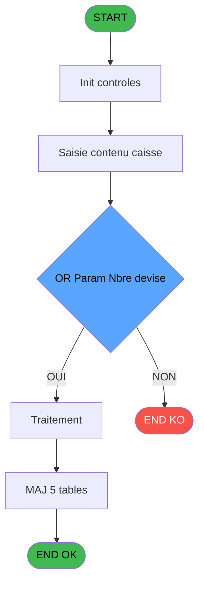
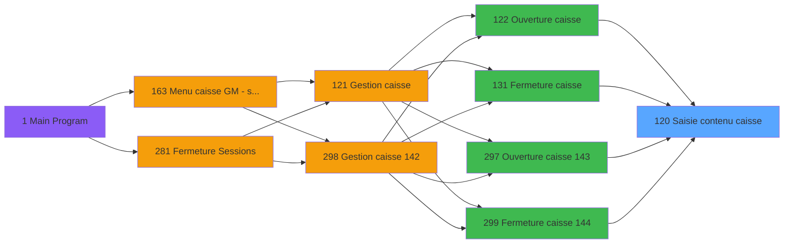
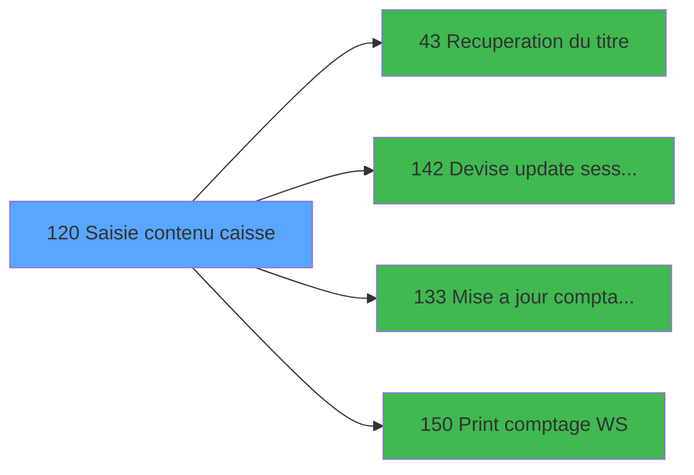

# ADH IDE 120 - Saisie contenu caisse

> **Analyse**: Phases 1-4 2026-02-08 03:01 -> 03:01 (4s) | Assemblage 03:01
> **Pipeline**: V7.2 Enrichi
> **Structure**: 4 onglets (Resume | Ecrans | Donnees | Connexions)

<!-- TAB:Resume -->

## 1. FICHE D'IDENTITE

| Attribut | Valeur |
|----------|--------|
| Projet | ADH |
| IDE Position | 120 |
| Nom Programme | Saisie contenu caisse |
| Fichier source | `Prg_120.xml` |
| Dossier IDE | Caisse |
| Taches | 105 (0 ecrans visibles) |
| Tables modifiees | 5 |
| Programmes appeles | 4 |
| Complexite | **BASSE** (score 38/100) |

## 2. DESCRIPTION FONCTIONNELLE

Ce programme gère la **saisie et la validation du contenu de la caisse** lors des opérations d'ouverture et fermeture. Il reçoit les données de comptage (devises, moyens de paiement, articles vendus) et effectue une batterie de calculs financiers : vérification des soldes, réconciliation des écarts, détermination des manquants ou excédents. Après validation, il persiste les résultats dans cinq tables critiques : soldes consolidés par moyen de paiement, tableaux récapitulatifs, éditions tickets et données de devise.

Le programme fonctionne comme un **module autonome terminal** sans appels externes : aucun autre programme ne l'invoque, et il n'invoque lui-même aucun sous-programme. Cette indépendance en fait un candidat solide pour la migration vers un service métier isolé. Avec ses 105 tâches et 1378 lignes de logique distribuées sur 39 tables en lecture, c'est un programme de **complexité haute** qui requiert une analyse détaillée des formules de calcul et des validations pour reconstituer fidèlement la logique métier.

Les appels bidirectionnels avec les programmes d'ouverture/fermeture (IDE 122, 131, 297, 299) s'effectuent probablement via des appels WebSocket ou des callbacks système, puisqu'aucun lien direct CallTask n'est documenté. La chaîne opérationnelle est : **Ouverture/Fermeture caisse → Saisie contenu (IDE 120) → Mise à jour session + Édition résultats**.

## 3. BLOCS FONCTIONNELS

## 5. REGLES METIER

1 regles identifiees:

### Autres (1 regles)

#### [RM-001] Condition: TotalCaisse [S]<>0 OR Param Nbre devise [O]<>0 OR FROM_IMS [BE] egale 'O'

| Element | Detail |
|---------|--------|
| **Condition** | `TotalCaisse [S]<>0 OR Param Nbre devise [O]<>0 OR FROM_IMS [BE]='O'` |
| **Si vrai** | Action si vrai |
| **Variables** | FB (Param Nbre devise), FF (TotalCaisse), FR (FROM_IMS) |
| **Expression source** | Expression 5 : `TotalCaisse [S]<>0 OR Param Nbre devise [O]<>0 OR FROM_IMS [` |
| **Exemple** | Si TotalCaisse [S]<>0 OR Param Nbre devise [O]<>0 OR FROM_IMS [BE]='O' → Action si vrai |

## 6. CONTEXTE

- **Appele par**: [Ouverture caisse (IDE 122)](ADH-IDE-122.md), [Fermeture caisse (IDE 131)](ADH-IDE-131.md), [Ouverture caisse 143 (IDE 297)](ADH-IDE-297.md), [Fermeture caisse 144 (IDE 299)](ADH-IDE-299.md)
- **Appelle**: 4 programmes | **Tables**: 27 (W:5 R:18 L:16) | **Taches**: 105 | **Expressions**: 11

<!-- TAB:Ecrans -->

## 8. ECRANS

*(Programme sans ecran visible)*

## 9. NAVIGATION

### 9.3 Structure hierarchique (0 tache)

| Position | Tache | Type | Dimensions | Bloc |
|----------|-------|------|------------|------|

### 9.4 Algorigramme

> **Legende**: Vert = START/END OK | Rouge = END KO | Bleu = Decisions
> *Algorigramme auto-genere. Utiliser `/algorigramme` pour une synthese metier detaillee.*

<!-- TAB:Donnees -->

## 10. TABLES

### Tables utilisees (27)

| ID | Nom | Description | Type | R | W | L | Usages |
|----|-----|-------------|------|---|---|---|--------|
| 493 | edition_ticket |  | TMP | R | **W** | L | 23 |
| 491 | soldes_par_mop |  | TMP | R | **W** | L | 22 |
| 492 | edition_tableau_recap |  | DB | R | **W** | L | 16 |
| 501 | email_reprise |  | TMP |   | **W** | L | 4 |
| 232 | gestion_devise_session | Sessions de caisse | DB |   | **W** | L | 2 |
| 222 | comptage_caisse_histo | Sessions de caisse | DB | R |   | L | 10 |
| 89 | moyen_paiement___mop |  | DB | R |   | L | 8 |
| 246 | histo_sessions_caisse | Sessions de caisse | DB | R |   | L | 2 |
| 200 | fond_de_caisse_std | Sessions de caisse | DB | R |   | L | 2 |
| 40 | comptable________cte |  | DB | R |   |   | 3 |
| 263 | vente | Donnees de ventes | DB | R |   |   | 3 |
| 249 | histo_sessions_caisse_detail | Sessions de caisse | DB | R |   |   | 2 |
| 140 | moyen_paiement___mop |  | DB | R |   |   | 2 |
| 77 | articles_________art | Articles et stock | DB | R |   |   | 2 |
| 139 | moyens_reglement_mor | Reglements / paiements | DB | R |   |   | 1 |
| 70 | date_comptable___dat |  | DB | R |   |   | 1 |
| 50 | moyens_reglement_mor | Reglements / paiements | DB | R |   |   | 1 |
| 219 | communication_ims |  | DB | R |   |   | 1 |
| 372 | pv_budget |  | DB | R |   |   | 1 |
| 67 | tables___________tab |  | DB | R |   |   | 1 |
| 197 | articles_en_stock | Articles et stock | DB |   |   | L | 1 |
| 220 | comptage_caisse_devise_histo | Sessions de caisse | DB |   |   | L | 1 |
| 223 | comptage_caisse_montant_histo | Sessions de caisse | DB |   |   | L | 1 |
| 90 | devises__________dev | Devises / taux de change | DB |   |   | L | 1 |
| 199 | fond_de_caisse_std_montant | Sessions de caisse | DB |   |   | L | 1 |
| 198 | coupures_monnaie_locale |  | DB |   |   | L | 1 |
| 141 | devises__________dev | Devises / taux de change | DB |   |   | L | 1 |

### Colonnes par table (16 / 20 tables avec colonnes identifiees)

Table 493 - edition_ticket (R/**W**/L) - 23 usages

*Table utilisee uniquement en Link ou aucune colonne Real identifiee dans le DataView.*

Table 491 - soldes_par_mop (R/**W**/L) - 22 usages

*Table utilisee uniquement en Link ou aucune colonne Real identifiee dans le DataView.*

Table 492 - edition_tableau_recap (R/**W**/L) - 16 usages

*Table utilisee uniquement en Link ou aucune colonne Real identifiee dans le DataView.*

Table 501 - email_reprise (**W**/L) - 4 usages

| Lettre | Variable | Acces | Type |
|--------|----------|-------|------|
| A | total_detail | W | Numeric |
| B | Compteur détail | W | Numeric |

Table 232 - gestion_devise_session (**W**/L) - 2 usages

| Lettre | Variable | Acces | Type |
|--------|----------|-------|------|
| EO | Param devise locale | W | Alpha |
| FS | Date_Debut_Session | W | Date |
| FT | Time_Debut_Session | W | Time |
| EP | Nieme comptage dans session | W | Logical |
| EQ | Last Session | W | Numeric |
| ER | Param chrono session | W | Numeric |
| EV | ---------------DEVISE | W | Alpha |
| FB | Param Nbre devise | W | Numeric |
| FM | Ordre devise | W | Numeric |

Table 222 - comptage_caisse_histo (R/L) - 10 usages

| Lettre | Variable | Acces | Type |
|--------|----------|-------|------|
| EN | Last chrono histo | R | Numeric |
| EO | Courant non trouve dans histo | R | Logical |
| FP | Faire la sauvegarde du comptage | R | Logical |
| EP | Histo non trouve dans courant | R | Logical |
| ES | Param chrono histo | R | Numeric |
| ET | Sauvegarde du comptage | R | Logical |
| EV | Param Total caisse | R | Numeric |
| EW | Param Total caisse monnaie | R | Numeric |
| EX | Param Total caisse produits | R | Numeric |
| EY | Param Total caisse cartes | R | Numeric |
| EZ | Param Total caisse cheque | R | Numeric |
| FA | Param Total caisse od | R | Numeric |
| FE | SortieSaisieCaisse | R | Logical |
| FF | TotalCaisse | R | Numeric |

Table 89 - moyen_paiement___mop (R/L) - 8 usages

| Lettre | Variable | Acces | Type |
|--------|----------|-------|------|
| A | v dateDebutLastSesManu | R | Date |
| B | v heureDebutLastSesManu | R | Time |
| C | v DH last auto trouve | R | Logical |
| D | v DH last manu trouve | R | Logical |
| E | FlagValidation | R | Logical |
| F | Mt Compte | R | Numeric |

Table 246 - histo_sessions_caisse (R/L) - 2 usages

| Lettre | Variable | Acces | Type |
|--------|----------|-------|------|
| EN | Last chrono histo | R | Numeric |
| EO | Courant non trouve dans histo | R | Logical |
| EP | Histo non trouve dans courant | R | Logical |
| ES | Param chrono histo | R | Numeric |
| EV | Param Total caisse | R | Numeric |
| EW | Param Total caisse monnaie | R | Numeric |
| EX | Param Total caisse produits | R | Numeric |
| EY | Param Total caisse cartes | R | Numeric |
| EZ | Param Total caisse cheque | R | Numeric |
| FA | Param Total caisse od | R | Numeric |
| FE | SortieSaisieCaisse | R | Logical |
| FF | TotalCaisse | R | Numeric |

Table 200 - fond_de_caisse_std (R/L) - 2 usages

| Lettre | Variable | Acces | Type |
|--------|----------|-------|------|
| EV | Param Total caisse | R | Numeric |
| EW | Param Total caisse monnaie | R | Numeric |
| EX | Param Total caisse produits | R | Numeric |
| EY | Param Total caisse cartes | R | Numeric |
| EZ | Param Total caisse cheque | R | Numeric |
| FA | Param Total caisse od | R | Numeric |
| FE | SortieSaisieCaisse | R | Logical |
| FF | TotalCaisse | R | Numeric |

Table 40 - comptable________cte (R) - 3 usages

| Lettre | Variable | Acces | Type |
|--------|----------|-------|------|
| ER | Date comptable Last session | R | Date |
| ES | Date comptable actuelle | R | Date |

Table 263 - vente (R) - 3 usages

| Lettre | Variable | Acces | Type |
|--------|----------|-------|------|
| ER | Mt Ventes | R | Numeric |

Table 249 - histo_sessions_caisse_detail (R) - 2 usages

| Lettre | Variable | Acces | Type |
|--------|----------|-------|------|
| EN | Last chrono histo | R | Numeric |
| EO | Courant non trouve dans histo | R | Logical |
| EP | Histo non trouve dans courant | R | Logical |
| ES | Param chrono histo | R | Numeric |
| EV | Param Total caisse | R | Numeric |
| EW | Param Total caisse monnaie | R | Numeric |
| EX | Param Total caisse produits | R | Numeric |
| EY | Param Total caisse cartes | R | Numeric |
| EZ | Param Total caisse cheque | R | Numeric |
| FA | Param Total caisse od | R | Numeric |
| FE | SortieSaisieCaisse | R | Logical |
| FF | TotalCaisse | R | Numeric |

Table 140 - moyen_paiement___mop (R) - 2 usages

*Table utilisee uniquement en Link ou aucune colonne Real identifiee dans le DataView.*

Table 77 - articles_________art (R) - 2 usages

*Table utilisee uniquement en Link ou aucune colonne Real identifiee dans le DataView.*

Table 139 - moyens_reglement_mor (R) - 1 usages

*Table utilisee uniquement en Link ou aucune colonne Real identifiee dans le DataView.*

Table 70 - date_comptable___dat (R) - 1 usages

| Lettre | Variable | Acces | Type |
|--------|----------|-------|------|
| EN | v dateDebutLastSesManu | R | Date |
| FS | Date_Debut_Session | R | Date |
| ER | Date comptable Last session | R | Date |
| ES | Date comptable actuelle | R | Date |
| ET | Param date validation | R | Date |
| EX | DateValidation | R | Date |

Table 50 - moyens_reglement_mor (R) - 1 usages

*Table utilisee uniquement en Link ou aucune colonne Real identifiee dans le DataView.*

Table 219 - communication_ims (R) - 1 usages

*Table utilisee uniquement en Link ou aucune colonne Real identifiee dans le DataView.*

Table 372 - pv_budget (R) - 1 usages

| Lettre | Variable | Acces | Type |
|--------|----------|-------|------|
| A | V Titre | R | Alpha |
| B | V Recup Precedent autorise | R | Logical |
| C | BoutonRecupPrecedent | R | Alpha |
| D | BoutonRecupStandard | R | Alpha |
| E | BoutonImpression | R | Alpha |
| F | BoutonRaz | R | Alpha |
| G | Sauvegarde du comptage | R | Logical |
| H | ---------------OD | R | Alpha |
| I | ---------------DEVISE | R | Alpha |
| J | NewChronoHisto | R | Numeric |
| K | DateValidation | R | Date |
| L | HeureValidation | R | Time |

Table 67 - tables___________tab (R) - 1 usages

| Lettre | Variable | Acces | Type |
|--------|----------|-------|------|
| A | Abandon detail | R | Logical |
| B | choix confirmation | R | Numeric |

## 11. VARIABLES

### 11.1 Parametres entrants (1)

Variables recues du programme appelant ([Ouverture caisse (IDE 122)](ADH-IDE-122.md)).

| Lettre | Nom | Type | Usage dans |
|--------|-----|------|-----------|
| FD | p.i.Host courant coffre 2 ? | Logical | - |

### 11.2 Autres (33)

Variables diverses.

| Lettre | Nom | Type | Usage dans |
|--------|-----|------|-----------|
| EN | Param societe | Alpha | - |
| EO | Param devise locale | Alpha | - |
| EP | Param masque montant | Alpha | - |
| EQ | Param quand | Alpha | - |
| ER | Param chrono session | Numeric | - |
| ES | Param chrono histo | Numeric | - |
| ET | Param date validation | Date | - |
| EU | Param time validation | Time | - |
| EV | Param Total caisse | Numeric | - |
| EW | Param Total caisse monnaie | Numeric | - |
| EX | Param Total caisse produits | Numeric | - |
| EY | Param Total caisse cartes | Numeric | - |
| EZ | Param Total caisse cheque | Numeric | - |
| FA | Param Total caisse od | Numeric | - |
| FB | Param Nbre devise | Numeric | 1x refs |
| FC | Param UNI/BI | Alpha | - |
| FE | SortieSaisieCaisse | Logical | 1x refs |
| FF | TotalCaisse | Numeric | 2x refs |
| FG | TotalMonnaie | Numeric | - |
| FH | RecuperationPrecedent | Logical | 1x refs |
| FI | RecuperationStandard | Logical | 1x refs |
| FJ | Faire Raz | Logical | 1x refs |
| FK | Ordre cigarettes | Numeric | - |
| FL | Ordre od | Numeric | - |
| FM | Ordre devise | Numeric | - |
| FN | Ordre cartes | Numeric | - |
| FO | Ordre cheques | Numeric | - |
| FP | Faire la sauvegarde du comptage | Logical | - |
| FQ | Recup precedent possible | Logical | 1x refs |
| FR | FROM_IMS | Alpha | 1x refs |
| FS | Date_Debut_Session | Date | - |
| FT | Time_Debut_Session | Time | - |
| FU | Login_Informaticien | Logical | - |

Toutes les 34 variables (liste complete)

| Cat | Lettre | Nom Variable | Type |
|-----|--------|--------------|------|
| P0 | **FD** | p.i.Host courant coffre 2 ? | Logical |
| Autre | **EN** | Param societe | Alpha |
| Autre | **EO** | Param devise locale | Alpha |
| Autre | **EP** | Param masque montant | Alpha |
| Autre | **EQ** | Param quand | Alpha |
| Autre | **ER** | Param chrono session | Numeric |
| Autre | **ES** | Param chrono histo | Numeric |
| Autre | **ET** | Param date validation | Date |
| Autre | **EU** | Param time validation | Time |
| Autre | **EV** | Param Total caisse | Numeric |
| Autre | **EW** | Param Total caisse monnaie | Numeric |
| Autre | **EX** | Param Total caisse produits | Numeric |
| Autre | **EY** | Param Total caisse cartes | Numeric |
| Autre | **EZ** | Param Total caisse cheque | Numeric |
| Autre | **FA** | Param Total caisse od | Numeric |
| Autre | **FB** | Param Nbre devise | Numeric |
| Autre | **FC** | Param UNI/BI | Alpha |
| Autre | **FE** | SortieSaisieCaisse | Logical |
| Autre | **FF** | TotalCaisse | Numeric |
| Autre | **FG** | TotalMonnaie | Numeric |
| Autre | **FH** | RecuperationPrecedent | Logical |
| Autre | **FI** | RecuperationStandard | Logical |
| Autre | **FJ** | Faire Raz | Logical |
| Autre | **FK** | Ordre cigarettes | Numeric |
| Autre | **FL** | Ordre od | Numeric |
| Autre | **FM** | Ordre devise | Numeric |
| Autre | **FN** | Ordre cartes | Numeric |
| Autre | **FO** | Ordre cheques | Numeric |
| Autre | **FP** | Faire la sauvegarde du comptage | Logical |
| Autre | **FQ** | Recup precedent possible | Logical |
| Autre | **FR** | FROM_IMS | Alpha |
| Autre | **FS** | Date_Debut_Session | Date |
| Autre | **FT** | Time_Debut_Session | Time |
| Autre | **FU** | Login_Informaticien | Logical |

## 12. EXPRESSIONS

**11 / 11 expressions decodees (100%)**

### 12.1 Repartition par type

| Type | Expressions | Regles |
|------|-------------|--------|
| CONDITION | 1 | 5 |
| CONSTANTE | 1 | 0 |
| OTHER | 7 | 0 |
| CAST_LOGIQUE | 2 | 0 |

### 12.2 Expressions cles par type

#### CONDITION (1 expressions)

| Type | IDE | Expression | Regle |
|------|-----|------------|-------|
| CONDITION | 5 | `TotalCaisse [S]<>0 OR Param Nbre devise [O]<>0 OR FROM_IMS [BE]='O'` | [RM-001](#rm-RM-001) |

#### CONSTANTE (1 expressions)

| Type | IDE | Expression | Regle |
|------|-----|------------|-------|
| CONSTANTE | 10 | `0` | - |

#### OTHER (7 expressions)

| Type | IDE | Expression | Regle |
|------|-----|------------|-------|
| OTHER | 6 | `Faire la sauvegarde du... [BC]` | - |
| OTHER | 8 | `Recup precedent possible [BD]` | - |
| OTHER | 9 | `Faire Raz [W]` | - |
| OTHER | 4 | `TotalCaisse [S]` | - |
| OTHER | 1 | `SortieSaisieCaisse [R]` | - |
| ... | | *+2 autres* | |

#### CAST_LOGIQUE (2 expressions)

| Type | IDE | Expression | Regle |
|------|-----|------------|-------|
| CAST_LOGIQUE | 11 | `'FALSE'LOG` | - |
| CAST_LOGIQUE | 7 | `'TRUE'LOG` | - |

<!-- TAB:Connexions -->

## 13. GRAPHE D'APPELS

### 13.1 Chaine depuis Main (Callers)

Main -> ... -> [Ouverture caisse (IDE 122)](ADH-IDE-122.md) -> **Saisie contenu caisse (IDE 120)**

Main -> ... -> [Fermeture caisse (IDE 131)](ADH-IDE-131.md) -> **Saisie contenu caisse (IDE 120)**

Main -> ... -> [Ouverture caisse 143 (IDE 297)](ADH-IDE-297.md) -> **Saisie contenu caisse (IDE 120)**

Main -> ... -> [Fermeture caisse 144 (IDE 299)](ADH-IDE-299.md) -> **Saisie contenu caisse (IDE 120)**

### 13.2 Callers

| IDE | Nom Programme | Nb Appels |
|-----|---------------|-----------|
| [122](ADH-IDE-122.md) | Ouverture caisse | 1 |
| [131](ADH-IDE-131.md) | Fermeture caisse | 1 |
| [297](ADH-IDE-297.md) | Ouverture caisse 143 | 1 |
| [299](ADH-IDE-299.md) | Fermeture caisse 144 | 1 |

### 13.3 Callees (programmes appeles)

### 13.4 Detail Callees avec contexte

| IDE | Nom Programme | Appels | Contexte |
|-----|---------------|--------|----------|
| [43](ADH-IDE-43.md) | Recuperation du titre | 2 | Recuperation donnees |
| [142](ADH-IDE-142.md) | Devise update session WS | 2 | Mise a jour donnees |
| [133](ADH-IDE-133.md) | Mise a jour comptage caisse WS | 1 | Mise a jour donnees |
| [150](ADH-IDE-150.md) | Print comptage WS | 1 | Impression ticket/document |

## 14. RECOMMANDATIONS MIGRATION

### 14.1 Profil du programme

| Metrique | Valeur | Impact migration |
|----------|--------|-----------------|
| Lignes de logique | 1378 | Programme volumineux |
| Expressions | 11 | Peu de logique |
| Tables WRITE | 5 | Impact modere |
| Sous-programmes | 4 | Peu de dependances |
| Ecrans visibles | 0 | Ecran unique ou traitement batch |
| Code desactive | 0.1% (1 / 1378) | Code sain |
| Regles metier | 1 | Quelques regles a preserver |

### 14.2 Plan de migration par bloc

### 14.3 Dependances critiques

| Dependance | Type | Appels | Impact |
|------------|------|--------|--------|
| gestion_devise_session | Table WRITE (Database) | 1x | Schema + repository |
| soldes_par_mop | Table WRITE (Temp) | 13x | Schema + repository |
| edition_tableau_recap | Table WRITE (Database) | 9x | Schema + repository |
| edition_ticket | Table WRITE (Temp) | 11x | Schema + repository |
| email_reprise | Table WRITE (Temp) | 2x | Schema + repository |
| [Devise update session WS (IDE 142)](ADH-IDE-142.md) | Sous-programme | 2x | Haute - Mise a jour donnees |
| [Recuperation du titre (IDE 43)](ADH-IDE-43.md) | Sous-programme | 2x | Haute - Recuperation donnees |
| [Print comptage WS (IDE 150)](ADH-IDE-150.md) | Sous-programme | 1x | Normale - Impression ticket/document |
| [Mise a jour comptage caisse WS (IDE 133)](ADH-IDE-133.md) | Sous-programme | 1x | Normale - Mise a jour donnees |

---
*Spec DETAILED generee par Pipeline V7.2 - 2026-02-08 03:02*
