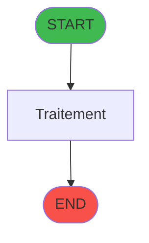
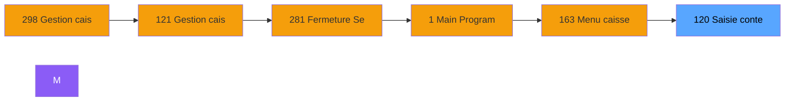
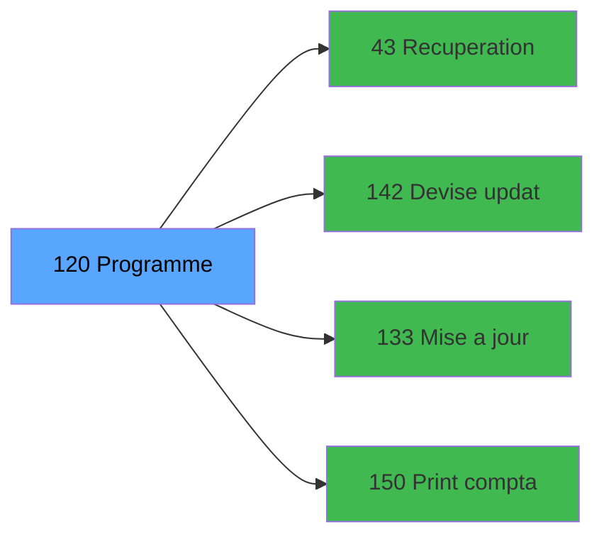

# ADH IDE 120 - Saisie contenu caisse

> **Version spec**: 3.5
> **Analyse**: 2026-01-27 17:57
> **Source**: `Prg_XXX.xml`

---

<!-- TAB:Fonctionnel -->

## SPECIFICATION FONCTIONNELLE

### 1.1 Objectif metier

| Element | Description |
|---------|-------------|
| **Qui** | Operateur |
| **Quoi** | Saisie contenu caisse
 |
| **Pourquoi** | A documenter |
| **Declencheur** | A identifier |

### 1.2 Regles metier

| Code | Regle | Condition |
|------|-------|-----------|
| RM-001 | A documenter | - |

### 1.3 Flux utilisateur

1. Demarrage programme
2. Traitement principal
3. Fin programme

### 1.4 Cas d'erreur

| Erreur | Comportement |
|--------|--------------|
| - | A documenter |

---

<!-- TAB:Technique -->

## SPECIFICATION TECHNIQUE

### 2.1 Identification

| Attribut | Valeur |
|----------|--------|
| **Format IDE** | ADH IDE 120 |
| **Description** | Saisie contenu caisse
 |
| **Module** | ADH |

### 2.2 Tables

| # | Nom logique | Nom physique | Acces | Usage |
|---|-------------|--------------|-------|-------|
| 40 | comptable________cte | `cafil018_dat` | R | 3x |
| 50 | moyens_reglement_mor | `cafil028_dat` | R | 1x |
| 67 | tables___________tab | `cafil045_dat` | R | 1x |
| 70 | date_comptable___dat | `cafil048_dat` | R | 1x |
| 77 | articles_________art | `cafil055_dat` | R | 2x |
| 89 | moyen_paiement___mop | `cafil067_dat` | L | 1x |
| 89 | moyen_paiement___mop | `cafil067_dat` | R | 7x |
| 90 | devises__________dev | `cafil068_dat` | L | 1x |
| 139 | moyens_reglement_mor | `cafil117_dat` | R | 1x |
| 140 | moyen_paiement___mop | `cafil118_dat` | R | 2x |
| 141 | devises__________dev | `cafil119_dat` | L | 1x |
| 197 | articles_en_stock | `caisse_artstock` | L | 1x |
| 198 | coupures_monnaie_locale | `caisse_banknote` | L | 1x |
| 199 | fond_de_caisse_std_montant | `caisse_caissstd_montant` | L | 1x |
| 200 | fond_de_caisse_std | `caisse_caisstd` | L | 1x |
| 200 | fond_de_caisse_std | `caisse_caisstd` | R | 1x |
| 219 | communication_ims | `caisse_com_ims` | R | 1x |
| 220 | comptage_caisse_devise_histo | `caisse_compcais_devise_histo` | L | 1x |
| 222 | comptage_caisse_histo | `caisse_compcais_histo2` | L | 5x |
| 222 | comptage_caisse_histo | `caisse_compcais_histo2` | R | 5x |
| 223 | comptage_caisse_montant_histo | `caisse_compcais_montant_histo` | L | 1x |
| 232 | gestion_devise_session | `caisse_devise` | L | 1x |
| 232 | gestion_devise_session | `caisse_devise` | **W** | 1x |
| 246 | histo_sessions_caisse | `caisse_session` | L | 1x |
| 246 | histo_sessions_caisse | `caisse_session` | R | 1x |
| 249 | histo_sessions_caisse_detail | `caisse_session_detail` | R | 2x |
| 263 | vente | `caisse_vente` | R | 3x |
| 372 | pv_budget | `pv_budget_dat` | R | 1x |
| 491 | soldes_par_mop | `%club_user%_caisse_solde_par_mop` | L | 3x |
| 491 | soldes_par_mop | `%club_user%_caisse_solde_par_mop` | R | 6x |
| 491 | soldes_par_mop | `%club_user%_caisse_solde_par_mop` | **W** | 13x |
| 492 | edition_tableau_recap | `caisse_tabrecap` | L | 5x |
| 492 | edition_tableau_recap | `caisse_tabrecap` | R | 2x |
| 492 | edition_tableau_recap | `caisse_tabrecap` | **W** | 9x |
| 493 | edition_ticket | `%club_user%_caisse_ticket` | L | 7x |
| 493 | edition_ticket | `%club_user%_caisse_ticket` | R | 5x |
| 493 | edition_ticket | `%club_user%_caisse_ticket` | **W** | 11x |
| 501 | email_reprise | `%club_user%_email_reprise` | L | 2x |
| 501 | email_reprise | `%club_user%_email_reprise` | **W** | 2x |
### 2.3 Parametres d'entree

| Variable | Nom | Type | Picture |
|----------|-----|------|---------|
| - | Aucun parametre | - | - |
### 2.4 Algorigramme

### 2.5 Expressions cles

| IDE | Expression | Commentaire |
|-----|------------|-------------|
| 1 | `{0,18}` | - |
| 2 | `{0,21}` | - |
| 3 | `{0,22}` | - |
| 4 | `{0,19}` | - |
| 5 | `{0,19}<>0 OR {0,15}<>0 OR {0,31}='O'` | - |
| 6 | `{0,29}` | - |
| 7 | `'TRUE'LOG` | - |
| 8 | `{0,30}` | - |
| 9 | `{0,23}` | - |
| 10 | `0` | - |
| 11 | `'FALSE'LOG` | - |

> **Total**: 11 expressions (affichees: 11)
### 2.6 Variables importantes

### 2.7 Statistiques

| Metrique | Valeur |
|----------|--------|
| **Taches** | 105 |
| **Lignes logique** | 1378 |
| **Lignes desactivees** | 0 |
---

<!-- TAB:Cartographie -->

## CARTOGRAPHIE APPLICATIVE

### 3.1 Chaine d'appels depuis Main

### 3.2 Callers directs

| IDE | Programme | Nb appels |
|-----|-----------|-----------|
| 122 | Ouverture caisse | 1 |
| 131 | Fermeture caisse | 1 |
| 297 | Ouverture caisse 143 | 1 |
| 299 | Fermeture caisse 144 | 1 |
### 3.3 Callees

| Niv | IDE | Programme | Nb appels |
|-----|-----|-----------|-----------|
| 1 | 43 | Recuperation du titre | 2 |
| 1 | 142 | Devise update session WS | 2 |
| 1 | 133 | Mise a jour comptage caisse WS | 1 |
| 1 | 150 | Print comptage WS | 1 |
### 3.4 Verification orphelin

| Critere | Resultat |
|---------|----------|
| Callers actifs | A verifier |
| **Conclusion** | A analyser |

---

## HISTORIQUE

| Date | Action | Auteur |
|------|--------|--------|
| 2026-01-27 20:20 | **DATA V2** - Tables reelles, Expressions, Stats, CallChain | Script |
| 2026-01-27 19:46 | **DATA POPULATED** - Tables, Callgraph (11 expr) | Script |
| 2026-01-27 17:57 | **Upgrade V3.5** - TAB markers, Mermaid | Claude |

---

*Specification V3.5 - Format avec TAB markers et Mermaid*
