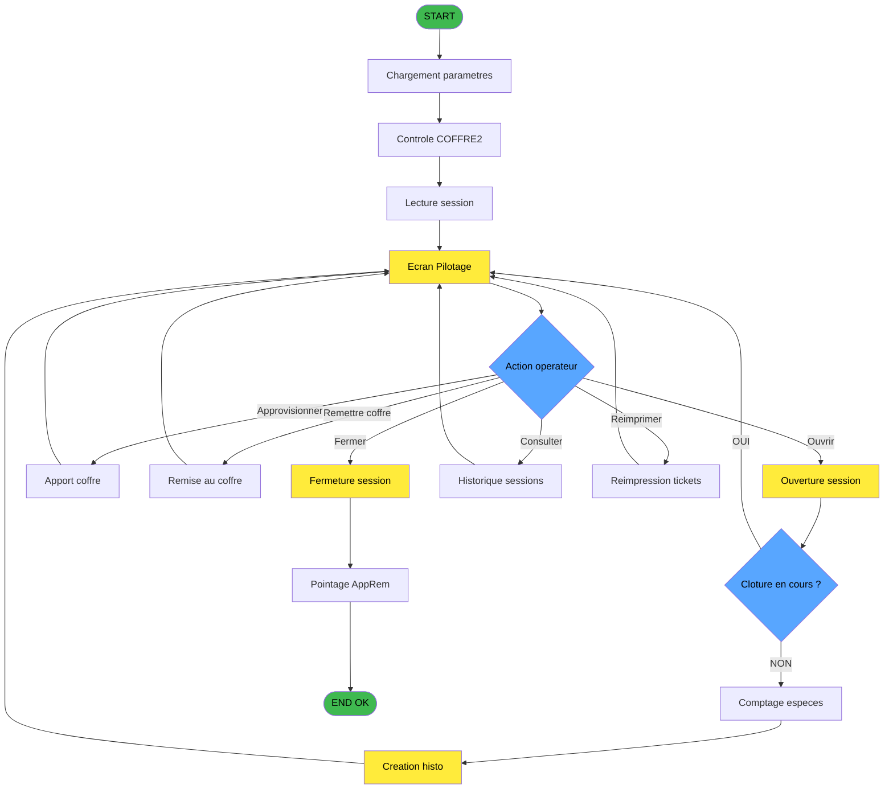
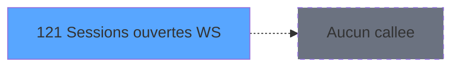

# ADH IDE 121 - Sessions ouvertes WS

> **Analyse**: Phases 1-4 2026-02-07 07:04 -> 07:05 (16s) | Assemblage 07:06
> **Pipeline**: V7.2 Enrichi
> **Structure**: 4 onglets (Resume | Ecrans | Donnees | Connexions)

<!-- TAB:Resume -->

## 1. FICHE D'IDENTITE

| Attribut | Valeur |
|----------|--------|
| Projet | ADH |
| IDE Position | 121 |
| Nom Programme | Sessions ouvertes WS |
| Fichier source | `Prg_121.xml` |
| Dossier IDE | Gestion |
| Taches | 1 (0 ecrans visibles) |
| Tables modifiees | 0 |
| Programmes appeles | 0 |
| :warning: Statut | **ORPHELIN_POTENTIEL** |

## 2. DESCRIPTION FONCTIONNELLE

**Gestion caisse** (Public Name : `Gestion_Caisse_142`) est l'ecran principal de gestion du point de vente Club Med (ID ecran CA0142). Ce programme MDI orchestre toutes les operations de caisse : ouverture et fermeture de session, approvisionnement en especes et produits, remise au coffre, consultation d'historique et reimpression de tickets. Il comporte 32 taches et modifie 4 tables liees aux sessions. Le programme est accessible depuis [Menu caisse GM - scroll (IDE 163)](ADH-IDE-163.md) et [Fermeture Sessions (IDE 281)](ADH-IDE-281.md).

### Initialisation et parametrage

Au demarrage, le programme charge les parametres de caisse depuis la table `parametres_caisse` (table 697) via les taches 121.1 et 121.3 (8 + 12 lignes). 121.2 "Controle COFFRE2" (33 lignes) verifie l'integrite des donnees du coffre dans `sessions_coffre2` (caisse_session_coffre2) en appelant [Controle fermeture caisse WS (IDE 155)](ADH-IDE-155.md) et [Verif session caisse ouverte2 (IDE 156)](ADH-IDE-156.md). 121.4 lit la date comptable dans `date_comptable___dat` (table 70) pour s'assurer que la journee comptable est valide. 121.5 "Lecture session" (31 lignes) lit la table `histo_sessions_caisse` (caisse_session) pour determiner l'etat courant de la session (ouverte, fermee, en cloture) et appelle [Controles - Integrite dates (IDE 48)](ADH-IDE-48.md).

5 taches : 121.1, 121.2, 121.3, 121.4, 121.5

- **121.1** - Parametres caisse (8 lignes, lit parametres_caisse)
- **121.2** - Controle COFFRE2 (33 lignes, lit sessions_coffre2)
- **121.3** - Parametres caisse (12 lignes, lit parametres_caisse)
- **121.4** - Date comptable (4 lignes, lit date_comptable___dat)
- **121.5** - Lecture session (31 lignes, lit histo_sessions_caisse)

### Ecran de pilotage

La tache 121.6 "Pilotage" (128 lignes, ecran SDI 939x178 DLU) est l'ecran principal visible par l'operateur (Gestion de la caisse). Il affiche l'etat de la caisse avec les montants courants et propose un menu d'actions : ouvrir/fermer la session, realiser des apports ou remises, consulter l'historique. Cet ecran appelle [Calcul concurrence sessions (IDE 116)](ADH-IDE-116.md) (12 fois) pour detecter les sessions paralleles, [Recuperation du titre (IDE 43)](ADH-IDE-43.md) pour le nom de l'operateur, et [Raisons utilisation ADH (IDE 231)](ADH-IDE-231.md) pour le contexte fonctionnel. 121.6.12 "Browse - Concurrence sessions" (6 lignes, ecran) affiche la liste des sessions concurrentes dans `concurrence_sessions` (caisse_concurrences) pour alerter si plusieurs postes sont ouverts simultanement.

2 taches : 121.6, 121.6.12

- **121.6** - Pilotage (128 lignes, lit table 740, **[ECRAN]**)
- **121.6.12** - Browse - Concurrence sessions (6 lignes, ecrit concurrence_sessions, **[ECRAN]**)

### Ouverture de session

L'ouverture de session est geree par la sous-tache 121.6.2 (59 lignes) qui verifie d'abord qu'aucune cloture n'est en cours (121.6.2.1 lit `reseau_cloture___rec`, table 23), puis controle la coherence des stocks monnaie et produit (121.6.2.2, 13 lignes, lit table 198). La tache 121.6.2.3 "Creation histo session" (10 lignes) ecrit un nouvel enregistrement dans `histo_sessions_caisse` (caisse_session) en mode Write, et 121.6.2.3.1 cree l'enregistrement coffre2 correspondant dans `sessions_coffre2` (caisse_session_coffre2). 121.6.2.4 initialise la table temporaire de saisie des devises `saisie_approvisionnement` (caisse_saisie_appro_dev) pour le comptage initial des especes. Le programme delegue le processus complet d'ouverture a [Ouverture caisse (IDE 122)](ADH-IDE-122.md) et l'initialisation des devises a [Init devise session WS (IDE 141)](ADH-IDE-141.md).

5 taches : 121.6.2, 121.6.2.1, 121.6.2.2, 121.6.2.3, 121.6.2.4

- **121.6.2** - Ouverture caisse (59 lignes, orchestrateur)
- **121.6.2.1** - Cloture en cours (5 lignes, lit reseau_cloture___rec)
- **121.6.2.2** - Controle monnaie/produit (13 lignes, lit table 198)
- **121.6.2.3** - Creation histo session (10 lignes, ecrit histo_sessions_caisse)
- **121.6.2.4** - init tempo saisie dev (14 lignes, lit saisie_approvisionnement)

### Approvisionnement et remise au coffre

Ce domaine gere les mouvements de fonds entre la caisse et le coffre. La tache 121.6.4 "Apport coffre" (17 lignes) declenche un approvisionnement en especes depuis le coffre vers la caisse, en appelant [Apport coffre (IDE 123)](ADH-IDE-123.md). 121.6.5 "Apport produit" (16 lignes) gere l'approvisionnement en articles (timbres, cartes...) via [Apport articles (IDE 124)](ADH-IDE-124.md) et [Init apport article session WS (IDE 140)](ADH-IDE-140.md). La tache 121.6.6 "Remise au coffre" (46 lignes) effectue l'operation inverse : retour des especes de la caisse vers le coffre, en appelant [Remise en caisse (IDE 125)](ADH-IDE-125.md). 121.6.6.1 remet a zero la table `saisie_approvisionnement` (Write, Delete) pour preparer la prochaine saisie. Chaque mouvement est enregistre par [Mise a jour detail session WS (IDE 134)](ADH-IDE-134.md) et imprime via [Ticket appro remise (IDE 139)](ADH-IDE-139.md).

4 taches : 121.6.4, 121.6.5, 121.6.6, 121.6.6.1

- **121.6.4** - Apport coffre (17 lignes, orchestrateur)
- **121.6.5** - Apport produit (16 lignes, orchestrateur)
- **121.6.6** - Remise au coffre (46 lignes, orchestrateur)
- **121.6.6.1** - RAZ Saisie devises P/V (8 lignes, ecrit saisie_approvisionnement)

### Fermeture de session

La fermeture de session est orchestree par 121.6.3 (45 lignes) qui appelle [Fermeture caisse (IDE 131)](ADH-IDE-131.md) pour le workflow complet de cloture (comptage final, calcul ecarts, validation). 121.6.3.1 "Cloture histo session" (9 lignes) met a jour l'enregistrement dans `histo_sessions_caisse` en mode Write pour marquer la session comme fermee. Le pointage des apports et remises est gere par 121.6.10 (18 lignes) qui verifie la coherence des mouvements coffre avant cloture definitive. 121.6.11 "Open sessions" (3 lignes) relit les sessions ouvertes via 121.6.11.1 "Pointage" (5 lignes, Write sur histo_sessions_caisse) et 121.6.11.2 "Read Sessions" (42 lignes) qui recalcule les totaux.

5 taches : 121.6.3, 121.6.3.1, 121.6.10, 121.6.11, 121.6.11.2

- **121.6.3** - Fermeture caisse (45 lignes, orchestrateur)
- **121.6.3.1** - Cloture histo session (9 lignes, ecrit histo_sessions_caisse)
- **121.6.10** - Pointage AppRem (18 lignes, orchestrateur)
- **121.6.11** - Open sessions (3 lignes, orchestrateur)
- **121.6.11.2** - Read Sessions (42 lignes, lit table 740)

### Consultation et reimpression

121.6.7 "Historique" (2 lignes) ouvre l'ecran de consultation des sessions passees en appelant [Historique session (IDE 132)](ADH-IDE-132.md). 121.6.8 "Consultation" (4 lignes) permet de consulter le detail d'une session specifique via [Affichage sessions (IDE 119)](ADH-IDE-119.md). 121.6.9 "reimprimer tickets" (2 lignes) relance l'impression des tickets de fermeture via [Reimpression tickets fermeture (IDE 151)](ADH-IDE-151.md) et des tickets d'approvisionnement/remise via [Ticket appro remise (IDE 139)](ADH-IDE-139.md).

3 taches : 121.6.7, 121.6.8, 121.6.9

- **121.6.7** - Historique (2 lignes, appelle IDE 132)
- **121.6.8** - Consultation (4 lignes, appelle IDE 119)
- **121.6.9** - reimprimer tickets (2 lignes, appelle IDE 139, IDE 151)

## 3. BLOCS FONCTIONNELS

## 5. REGLES METIER

*(Aucune regle metier identifiee)*

## 6. CONTEXTE

- **Appele par**: (aucun)
- **Appelle**: 0 programmes | **Tables**: 1 (W:0 R:1 L:0) | **Taches**: 1 | **Expressions**: 5

<!-- TAB:Ecrans -->

## 8. ECRANS

*(Programme sans ecran visible)*

## 9. NAVIGATION

### 9.3 Structure hierarchique (0 tache)

| Position | Tache | Type | Dimensions | Bloc |
|----------|-------|------|------------|------|

### 9.4 Algorigramme

> **Legende**: Vert = START/END OK | Jaune = Flux Gestion Sessions | Bleu = Decisions

| Noeud | Source | Justification |
|-------|--------|---------------|
| START | Programme ADH IDE 121 | Point d'entree Gestion caisse (Gestion_Caisse_142) |
| PARAMS | Taches 121.1, 121.3 | Chargement parametres caisse depuis table 697 |
| COFFRE | Tache 121.2 (33 lignes) | Controle integrite coffre2 - securite comptable |
| SESSION | Tache 121.5 (31 lignes) | Lecture etat session dans histo_sessions_caisse |
| PILOTE | Tache 121.6 (128 lignes) | Ecran principal MDI - menu d'actions operateur |
| CHOIX | Menu 121.6 | Decision operateur : 6 actions possibles |
| OUVERT | Tache 121.6.2 (59 lignes) | Workflow ouverture session complet |
| CLOTURE | Tache 121.6.2.1 | Verification cloture en cours dans reseau_cloture___rec |
| COMPTAG | Tache 121.6.2.4 | Initialisation saisie devises pour comptage |
| HISTO | Taches 121.6.2.3, 121.6.2.3.1 | Creation enregistrement session + coffre2 |
| APPORT | Taches 121.6.4, 121.6.5 | Approvisionnement especes et produits |
| REMISE | Tache 121.6.6 (46 lignes) | Retour especes au coffre |
| FERME | Tache 121.6.3 (45 lignes) | Workflow fermeture complet via IDE 131 |
| POINT | Tache 121.6.10 (18 lignes) | Verification coherence mouvements avant cloture |
| CONSULT | Taches 121.6.7, 121.6.8 | Historique et consultation sessions via IDE 132 |
| REIMP | Tache 121.6.9 | Reimpression tickets via IDE 139 et IDE 151 |
| ENDOK | Fin normale | Session fermee et validee |

<!-- TAB:Donnees -->

## 10. TABLES

### Tables utilisees (1)

| ID | Nom | Description | Type | R | W | L | Usages |
|----|-----|-------------|------|---|---|---|--------|
| 246 | histo_sessions_caisse | Sessions de caisse | DB | R |   |   | 1 |

### Colonnes par table (1 / 1 tables avec colonnes identifiees)

Table 246 - histo_sessions_caisse (R) - 1 usages

| Lettre | Variable | Acces | Type |
|--------|----------|-------|------|
| A | Param existe session | R | Logical |
| B | Param existe session ouverte | R | Logical |

## 11. VARIABLES

### 11.1 Autres (2)

Variables diverses.

| Lettre | Nom | Type | Usage dans |
|--------|-----|------|-----------|
| A | Param existe session | Logical | 1x refs |
| B | Param existe session ouverte | Logical | - |

## 12. EXPRESSIONS

**5 / 5 expressions decodees (100%)**

### 12.1 Repartition par type

| Type | Expressions | Regles |
|------|-------------|--------|
| CONSTANTE | 1 | 0 |
| CAST_LOGIQUE | 2 | 0 |
| CONDITION | 1 | 0 |
| OTHER | 1 | 0 |

### 12.2 Expressions cles par type

#### CONSTANTE (1 expressions)

| Type | IDE | Expression | Regle |
|------|-----|------------|-------|
| CONSTANTE | 2 | `0` | - |

#### CAST_LOGIQUE (2 expressions)

| Type | IDE | Expression | Regle |
|------|-----|------------|-------|
| CAST_LOGIQUE | 3 | `'TRUE'LOG` | - |
| CAST_LOGIQUE | 1 | `'FALSE'LOG` | - |

#### CONDITION (1 expressions)

| Type | IDE | Expression | Regle |
|------|-----|------------|-------|
| CONDITION | 4 | `[C]=0` | - |

#### OTHER (1 expressions)

| Type | IDE | Expression | Regle |
|------|-----|------------|-------|
| OTHER | 5 | `Param existe session [A] AND Param existe session o... [B]` | - |

<!-- TAB:Connexions -->

## 13. GRAPHE D'APPELS

### 13.1 Chaine depuis Main (Callers)

**Chemin**: (pas de callers directs)

### 13.2 Callers

| IDE | Nom Programme | Nb Appels |
|-----|---------------|-----------|
| - | (aucun) | - |

### 13.3 Callees (programmes appeles)

### 13.4 Detail Callees avec contexte

| IDE | Nom Programme | Appels | Contexte |
|-----|---------------|--------|----------|
| - | (aucun) | - | - |

## 14. RECOMMANDATIONS MIGRATION

### 14.1 Profil du programme

| Metrique | Valeur | Impact migration |
|----------|--------|-----------------|
| Lignes de logique | 10 | Programme compact |
| Expressions | 5 | Peu de logique |
| Tables WRITE | 0 | Impact faible |
| Sous-programmes | 0 | Peu de dependances |
| Ecrans visibles | 0 | Ecran unique ou traitement batch |
| Code desactive | 0% (0 / 10) | Code sain |
| Regles metier | 0 | Pas de regle identifiee |

### 14.2 Plan de migration par bloc

### 14.3 Dependances critiques

| Dependance | Type | Appels | Impact |
|------------|------|--------|--------|

---
*Spec DETAILED generee par Pipeline V7.2 - 2026-02-07 07:06*
