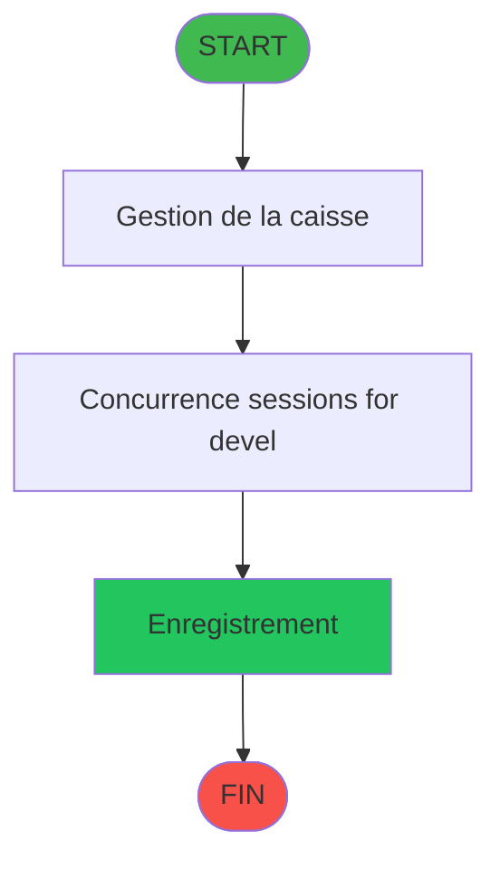
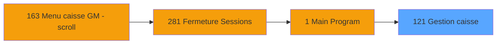
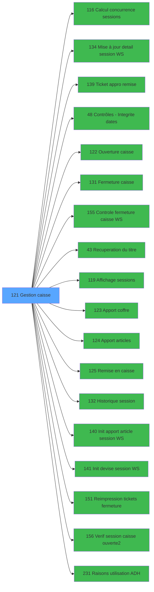

# ADH IDE 121 - Gestion caisse

> **Analyse**: 2026-01-29 11:34
> **Pipeline**: V6.0 Deep Analysis
> **Niveau**: DETAILED (Migration)

<!-- TAB:Fonctionnel -->

## 1. IDENTIFICATION

| Attribut | Valeur |
|----------|--------|
| Projet | ADH |
| IDE Position | 121 |
| Nom Programme | Gestion caisse |
| Statut Orphelin | NON_ORPHELIN |
| Raison | Appele par 2 programme(s): IDE 163, IDE 281 |
| Complexite | **MOYENNE** (48/100) |
| Pipeline | V6.0 |

### Criteres Orphelin

| Critere | Resultat |
|---------|----------|
| Callers directs | OUI (2 callers) |
| Public Name | NON |
| Membre ECF | NON |

## 2. OBJECTIF METIER

**Gestion caisse** - Programme comprenant 2 ecran(s) visible(s): Gestion de la caisse, Concurrence sessions for devel.

### Fonctionnalites principales

- **Gestion de la caisse** (Tache 7, MDI, 939x178)
- **Concurrence sessions for devel** (Tache 32, MDI, 524x236)

### Operations sur les donnees

#### Tables modifiees (WRITE) - 4 tables

- `concurrence_sessions` (caisse_concurrences)
- `saisie_approvisionnement` (caisse_saisie_appro_dev)
- `histo_sessions_caisse` (caisse_session)
- `sessions_coffre2` (caisse_session_coffre2)

#### Tables lues (READ) - 8 tables

- `reseau_cloture___rec` (cafil001_dat)
- `date_comptable___dat` (cafil048_dat)
- `coupures_monnaie_locale` (caisse_banknote)
- `gestion_devise_session` (caisse_devise)
- `histo_sessions_caisse` (caisse_session)
- `histo_sessions_caisse_detail` (caisse_session_detail)
- `droits_applications` (droits)
- `pv_stock_movements` (pv_stockmvt_dat)

#### Tables liees (LINK) - 5 tables

- `articles_en_stock` (caisse_artstock)
- `saisie_approvisionnement` (caisse_saisie_appro_dev)
- `histo_sessions_caisse` (caisse_session)
- `sessions_coffre2` (caisse_session_coffre2)
- `histo_sessions_caisse_detail` (caisse_session_detail)

### Contexte d'utilisation

- **Appele depuis**: Menu caisse GM - scroll (IDE 163), Fermeture Sessions (IDE 281)
- **Appelle**: Calcul concurrence sessions (IDE 116), Mise à jour detail session WS (IDE 134), Ticket appro remise (IDE 139), Contrôles - Integrite dates (IDE 48), Ouverture caisse (IDE 122), Fermeture caisse (IDE 131), Controle fermeture caisse WS (IDE 155), Recuperation du titre (IDE 43), Affichage sessions (IDE 119), Apport coffre (IDE 123), Apport articles (IDE 124), Remise en caisse (IDE 125), Historique session (IDE 132), Init apport article session WS (IDE 140), Init devise session WS (IDE 141), Reimpression tickets fermeture (IDE 151), Verif session caisse ouverte2 (IDE 156), Raisons utilisation ADH (IDE 231)

<!-- TAB:Technique -->

## 3. MODELE DE DONNEES

### Tables (12 tables uniques)

| ID | Nom Logique | Nom Physique | R | W | L | Type | Occurrences |
|----|-------------|--------------|---|---|---|------|-------------|
| 23 | reseau_cloture___rec | cafil001_dat | R | - | - | Database | 1 |
| 70 | date_comptable___dat | cafil048_dat | R | - | - | Database | 1 |
| 197 | articles_en_stock | caisse_artstock | - | - | L | Database | 1 |
| 198 | coupures_monnaie_locale | caisse_banknote | R | - | - | Database | 1 |
| 227 | concurrence_sessions | caisse_concurrences | - | W | - | Database | 1 |
| 232 | gestion_devise_session | caisse_devise | R | - | - | Database | 1 |
| 244 | saisie_approvisionnement | caisse_saisie_appro_dev | - | W | L | Database | 2 |
| 246 | histo_sessions_caisse | caisse_session | R | W | L | Database | 6 |
| 248 | sessions_coffre2 | caisse_session_coffre2 | - | W | L | Database | 3 |
| 249 | histo_sessions_caisse_detail | caisse_session_detail | R | - | L | Database | 4 |
| 697 | droits_applications | droits | R | - | - | Database | 2 |
| 740 | pv_stock_movements | pv_stockmvt_dat | R | - | - | Database | 2 |

## 4. VARIABLES ET PARAMETRES

### Variables Mapping (31 entrees)

| Cat | Ref Expression | Lettre | Nom Variable | Type |
|-----|----------------|--------|--------------|------|
| V. | `{0,18}` | **R** | V Date comptable | Date |
| V. | `{0,19}` | **S** | V session active | Logical |
| V. | `{0,20}` | **T** | V User ouverture | Alpha |
| V. | `{0,21}` | **U** | V Date ouverture | Date |
| V. | `{0,22}` | **V** | V Time ouverture | Time |
| V. | `{0,23}` | **W** | V Date Fin session | Date |
| V. | `{0,24}` | **X** | V Last Chrono | Numeric |
| V. | `{0,25}` | **Y** | V N° caisse reception mini | Numeric |
| V. | `{0,26}` | **Z** | V N° caisse reception maxi | Numeric |
| V. | `{0,53}` | **BA** | V Cloture en cours | Logical |
| V. | `{0,55}` | **BC** | V avec coffre 2 | Alpha |
| V. | `{0,56}` | **BD** | V cloture auto | Alpha |
| V. | `{0,57}` | **BE** | v.fin | Logical |
| Autre | `{0,1}` | **A** | Param Libelle caisse | Alpha |
| Autre | `{0,2}` | **B** | Param Etat caisse | Alpha |
| Autre | `{0,3}` | **C** | Param societe | Alpha |
| Autre | `{0,4}` | **D** | Param devise locale | Alpha |
| Autre | `{0,5}` | **E** | Param nbre decimale | Numeric |
| Autre | `{0,6}` | **F** | Param masque montant | Alpha |
| Autre | `{0,7}` | **G** | Param code village | Alpha |
| Autre | `{0,8}` | **H** | Param nom village | Alpha |
| Autre | `{0,9}` | **I** | Param masque cumul | Alpha |
| Autre | `{0,10}` | **J** | Param Uni/Bi | Alpha |
| Autre | `{0,11}` | **K** | Param Village TAI | Alpha |
| Autre | `{0,12}` | **L** | Param Mode consultation | Logical |
| Autre | `{0,13}` | **M** | p.i.Terminal coffre2 | Numeric |
| Autre | `{0,14}` | **N** | Param VIL open sessions | Alpha |
| Autre | `{0,15}` | **O** | Param FROM_IMS | Alpha |
| Autre | `{0,16}` | **P** | p.i.Hostl coffre2 | Unicode |
| Autre | `{0,17}` | **Q** | i.Host courant coffre 2 ? | Logical |
| Autre | `{0,54}` | **BB** | COFFRE 2 est ouvert | Logical |

## 5. LOGIQUE METIER

### Algorigramme



### Expressions (7 / 7 - 100%)

#### CALCULATION (0 expressions)

| IDE | Expression Decodee |
|-----|-------------------|

#### CONDITION (0 expressions)

| IDE | Expression Decodee |
|-----|-------------------|

#### CONSTANT (1 expressions)

| IDE | Expression Decodee |
|-----|-------------------|
| 3 | `'D'` |

#### DATE (0 expressions)

| IDE | Expression Decodee |
|-----|-------------------|

#### OTHER (6 expressions)

| IDE | Expression Decodee |
|-----|-------------------|
| 1 | `Param VIL open sessions [N]='O'` |
| 2 | `'FALSE'LOG` |
| 4 | `[AE]` |
| 5 | `'TRUE'LOG` |
| 6 | `NOT([AE])` |
| 7 | `VG111` |

#### STRING (0 expressions)

| IDE | Expression Decodee |
|-----|-------------------|

## 6. INTERFACE UTILISATEUR

### Forms Visibles (2 / 32 total)

| Tache | Nom | Type | Dimensions |
|-------|-----|------|------------|
| 7 | Gestion de la caisse | MDI | 939x178 |
| 32 | Concurrence sessions for devel | MDI | 524x236 |

### Toutes les Forms (32)

| Tache | Nom | Type | Dimensions |
|-------|-----|------|------------|
| 1 | Gestion caisse | MDI | - |
| 2 | Paramètres caisse | SDI | - |
| 3 | Controle COFFRE2 | MDI | - |
| 4 | Paramètres caisse | MDI | - |
| 5 | Date comptable | MDI | - |
| 6 | Etat de la caisse | MDI | - |
| 7 | Gestion de la caisse | MDI | 939x178 |
| 8 | Existe histo | MDI | - |
| 9 | Ouverture caisse | MDI | - |
| 10 | Cloture en cours v1 | MDI | - |
| 11 | Controle monnaie/produit | MDI | - |
| 12 | Creation histo session | MDI | - |
| 13 | histo coffre2 | MDI | - |
| 14 | init tempo saisie dev | MDI | - |
| 15 | Fermeture caisse | MDI | - |
| 16 | Clôture histo session | MDI | - |
| 17 | Apport coffre | MDI | - |
| 18 | Apport produit | MDI | - |
| 19 | Remise au coffre | MDI | - |
| 20 | RAZ Saisie devises P/V | MDI | - |
| 21 | Historique | MDI | - |
| 22 | Consultation | MDI | - |
| 23 | reimprimer tickets | MDI | - |
| 24 | Remise au coffre | MDI | - |
| 25 | Open sessions | MDI | - |
| 26 | Pointage | MDI | - |
| 27 | Read Sessions | MDI | - |
| 28 | Remise au coffre | MDI | - |
| 29 | Ligne Initiale | MDI | - |
| 30 | Creation histo session | MDI | - |
| 31 | histo coffre2 | MDI | - |
| 32 | Concurrence sessions for devel | MDI | 524x236 |

### Mockup

```
+----------------------------------------+
| Gestion de la caisse [MDI] 939x178       |
+----------------------------------------+
| (contenu tache 7)                        |
+----------------------------------------+

+------------------------------------------------+
| Concurrence sessions for devel [MDI] 524x236     |
+------------------------------------------------+
| (contenu tache 32)                               |
+------------------------------------------------+

```

<!-- TAB:Cartographie -->

## 7. GRAPHE D'APPELS

### 7.1 Chaine depuis Main (Callers)

**Chemin**: Menu caisse GM - scroll (IDE 163) -> Fermeture Sessions (IDE 281) -> Main Program (IDE 1) -> Gestion caisse (IDE 121)



### 7.2 Callers (Qui m'appelle)

| IDE | Nom Programme | Nb Appels |
|-----|---------------|-----------|
| 163 | Menu caisse GM - scroll | 2 |
| 281 | Fermeture Sessions | 1 |

### 7.3 Callees (Qui j'appelle)



### 7.4 Callees Detail

| IDE | Nom Programme | Nb Appels |
|-----|---------------|-----------|
| 116 | Calcul concurrence sessions | 12 |
| 134 | Mise à jour detail session WS | 3 |
| 139 | Ticket appro remise | 3 |
| 48 | Contrôles - Integrite dates | 2 |
| 122 | Ouverture caisse | 2 |
| 131 | Fermeture caisse | 2 |
| 155 | Controle fermeture caisse WS | 2 |
| 43 | Recuperation du titre | 1 |
| 119 | Affichage sessions | 1 |
| 123 | Apport coffre | 1 |
| 124 | Apport articles | 1 |
| 125 | Remise en caisse | 1 |
| 132 | Historique session | 1 |
| 140 | Init apport article session WS | 1 |
| 141 | Init devise session WS | 1 |
| 151 | Reimpression tickets fermeture | 1 |
| 156 | Verif session caisse ouverte2 | 1 |
| 231 | Raisons utilisation ADH | 1 |

## 8. STATISTIQUES

| Metrique | Valeur |
|----------|--------|
| Taches | 32 |
| Lignes Logic | 678 |
| Lignes Desactivees | 0 |
| Expressions | 7 |
| Regles Metier | 0 |
| Tables (total unique) | 12 |
| Tables WRITE | 4 |
| Tables READ | 8 |
| Tables LINK | 5 |
| Callers | 2 |
| Callees | 18 |
| Forms (total) | 32 |
| Forms Visibles | 2 |
| Variables Mappees | 31 |
| **Ratio lignes actives** | **678 / 678 (100%)** |
| **Ratio lignes desactivees** | **0 / 678 (0%)** |
| **Couverture expressions** | **100%** |

---

## 9. NOTES MIGRATION

### Complexite Estimee: **MOYENNE** (48/100)

| Critere | Score | Detail |
|---------|-------|--------|
| Expressions: 7 | MINIMALE | Expressions: 7 (MINIMALE) |
| Taches: 32 | HAUTE | Taches: 32 (HAUTE) |
| Tables WRITE: 4 | MOYENNE | Tables WRITE: 4 (MOYENNE) |
| Callees: 18 | HAUTE | Callees: 18 (HAUTE) |
| Lignes desactivees: 0% | SAIN | Lignes desactivees: 0% (SAIN) |

### Points d'attention

- **Tables en ecriture**: concurrence_sessions, saisie_approvisionnement, histo_sessions_caisse, sessions_coffre2
- **Dependances callees**: 18 programmes appeles
- **Expressions conditionnelles**: 0
- **Code desactive**: 0 lignes (0%)

### Recommandations Migration

1. **Migration directe** possible avec attention aux regles metier
2. **Tester** les conditions principales (0 conditions)
3. **Valider** les tables WRITE: concurrence_sessions, saisie_approvisionnement, histo_sessions_caisse, sessions_coffre2

---
*Spec DETAILED generee par Pipeline V6.0 - 2026-01-29 11:34*
