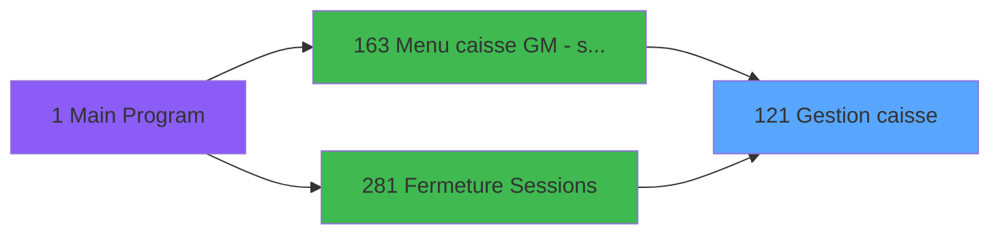
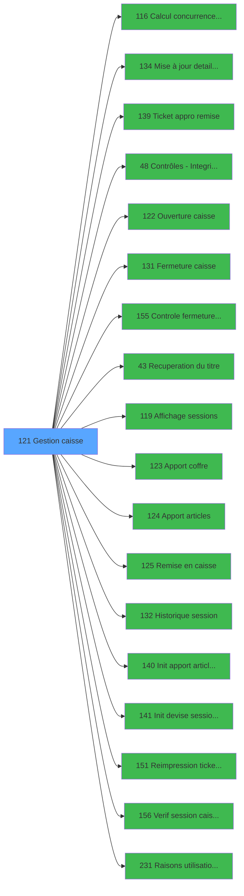

# ADH IDE 121 - Gestion caisse

> **Analyse**: Phases 1-4 2026-01-29 20:09 -> 20:09 (13s) | Assemblage 20:09
> **Pipeline**: V7.1 Deep Analysis
> **Structure**: 4 onglets (Resume | Ecrans | Donnees | Connexions)

<!-- TAB:Resume -->

## 1. FICHE D'IDENTITE

| Attribut | Valeur |
|----------|--------|
| Projet | ADH |
| IDE Position | 121 |
| Nom Programme | Gestion caisse |
| Fichier source | `Prg_121.xml` |
| Domaine metier | Caisse |
| Taches | 32 (2 ecrans visibles) |
| Tables modifiees | 4 |
| Programmes appeles | 18 |

## 2. DESCRIPTION FONCTIONNELLE

**Gestion caisse** assure la gestion complete de ce processus, accessible depuis Menu caisse GM - scroll, Fermeture Sessions.

Le flux de traitement s'organise en **7 blocs fonctionnels** :

- **Traitement** (23 taches) : traitements metier divers
- **Creation** (2 taches) : insertion d'enregistrements en base (mouvements, prestations)
- **Saisie** (2 taches) : ecrans de saisie utilisateur (formulaires, champs, donnees)
- **Validation** (2 taches) : controles et verifications de coherence
- **Initialisation** (1 tache) : reinitialisation d'etats et de variables de travail
- **Impression** (1 tache) : generation de tickets et documents
- **Calcul** (1 tache) : calculs de montants, stocks ou compteurs

Le programme delegue des operations a **18 sous-programmes** couvrant :

- **Affichage donnees** : Affichage sessions
- **Approvisionnement** : Apport coffre, Apport articles
- **Calcul de donnees** : Calcul concurrence sessions
- **Controle/validation** : Controle fermeture caisse WS, Verif session caisse ouverte2
- **Fermeture session** : Fermeture caisse
- **Historique/consultation** : Historique session
- **Impression ticket/document** : Ticket appro remise, Reimpression tickets fermeture
- **Mise a jour donnees** : Mise à jour detail session WS
- **Ouverture session** : Ouverture caisse
- **Parametrage** : Raisons utilisation ADH
- **Programme fidelite** : Remise en caisse
- **Recuperation donnees** : Recuperation du titre
- **Reinitialisation** : Init apport article session WS, Init devise session WS

**Donnees modifiees** : 4 tables en ecriture (concurrence_sessions, saisie_approvisionnement, histo_sessions_caisse, sessions_coffre2).

## 3. BLOCS FONCTIONNELS

### 3.1 Traitement (23 taches)

Traitements internes : 23 taches de traitement metier.

- **Gestion de la caisse** (T7, MDI, 939x178)
- **Concurrence sessions for devel** (T32, MDI, 524x236)
- *Internes*: Gestion caisse (T1), Paramètres caisse (T2), Paramètres caisse (T4), Etat de la caisse (T6), Existe histo (T8), Ouverture caisse (T9), Cloture en cours v1 (T10), histo coffre2 (T13), Fermeture caisse (T15), Clôture histo session (T16), Apport coffre (T17), Apport produit (T18), Remise au coffre (T19), Historique (T21), Consultation (T22), Remise au coffre (T24), Open sessions (T25), Pointage (T26), Read Sessions (T27), Remise au coffre (T28), histo coffre2 (T31)
- **Sous-programmes**: Mise à jour detail session WS (IDE 134), Contrôles - Integrite dates (IDE 48), Ouverture caisse (IDE 122), Fermeture caisse (IDE 131), Recuperation du titre (IDE 43), Apport coffre (IDE 123), Apport articles (IDE 124), Remise en caisse (IDE 125), Historique session (IDE 132), Raisons utilisation ADH (IDE 231)

### 3.2 Validation (2 taches)

Controles de coherence et de conformite : 2 taches verifient les donnees saisies, les droits de l'operateur et les conditions prealables au traitement.

- *Internes*: Controle COFFRE2 (T3), Controle monnaie/produit (T11)
- **Sous-programmes**: Controle fermeture caisse WS (IDE 155), Verif session caisse ouverte2 (IDE 156)

### 3.3 Calcul (1 tache)

Calculs metier : 1 tache effectue les calculs de montants, stocks, compteurs ou statistiques necessaires au traitement.

- *Internes*: Date comptable (T5)
- **Sous-programmes**: Calcul concurrence sessions (IDE 116)
- **Variables cles**: R (V Date comptable), I (Param masque cumul)

### 3.4 Creation (2 taches)

Insertion de nouveaux enregistrements : 2 taches creent des mouvements, prestations ou autres donnees en base.

- *Internes*: Creation histo session (T12), Creation histo session (T30)
- **Tables modifiees**: histo_sessions_caisse

### 3.5 Saisie (2 taches)

Ce bloc traite la saisie des donnees de la transaction. 2 taches internes gerent la collecte et la preparation des informations.

- *Internes*: init tempo saisie dev (T14), RAZ Saisie devises P/V (T20)

### 3.6 Impression (1 tache)

Generation des documents et tickets : 1 tache gere l'impression des recus, tickets et documents associes a l'operation.

- *Internes*: reimprimer tickets (T23)
- **Sous-programmes**: Ticket appro remise (IDE 139), Reimpression tickets fermeture (IDE 151)

### 3.7 Initialisation (1 tache)

Reinitialisation d'etats : 1 tache prepare les variables de travail et remettent les compteurs a zero.

- *Internes*: Ligne Initiale (T29)
- **Sous-programmes**: Init apport article session WS (IDE 140), Init devise session WS (IDE 141)
- **Variables cles**: A (Param Libelle caisse), B (Param Etat caisse), C (Param societe), D (Param devise locale), E (Param nbre decimale)

## 5. REGLES METIER

*(Aucune regle metier identifiee)*

## 6. CONTEXTE

- **Appele par**: Menu caisse GM - scroll (IDE 163), Fermeture Sessions (IDE 281)
- **Appelle**: 18 programmes | **Tables**: 12 (W:4 R:8 L:5) | **Taches**: 32 | **Expressions**: 7

<!-- TAB:Ecrans -->

## 8. ECRANS

### 8.1 Forms visibles (2 / 32)

| # | Tache | Nom | Type | Largeur | Hauteur |
|---|-------|-----|------|---------|---------|
| 1 | 7 | Gestion de la caisse | MDI | 939 | 178 |
| 2 | 32 | Concurrence sessions for devel | MDI | 524 | 236 |

### 8.2 Mockups Ecrans

```
+=============================================+
| Gestion de la caisse [MDI] 939x178 - Tach... |
+---------------------------------------------+
|  (Traitement interne - Traitement)          |
|                                             |
|                                             |
|                                             |
+=============================================+

+============================+
| Concurrence sessions for... |
+----------------------------+
|  (Traitement interne - T...|
|                            |
|                            |
|                            |
|                            |
+============================+

```

## 9. NAVIGATION

### 9.1 Enchainement des ecrans


**Detail par bloc:**

- **Traitement**: Gestion de la caisse (T7), Concurrence sessions for devel (T32)
- **Validation**: traitement interne (2 taches)
- **Calcul**: traitement interne (1 tache)
- **Creation**: traitement interne (2 taches)
- **Saisie**: traitement interne (2 taches)
- **Impression**: traitement interne (1 tache)
- **Initialisation**: traitement interne (1 tache)

### 9.2 Logique decisionnelle

*(Pas de regles metier pour l'algorigramme)*

### 9.3 Structure hierarchique (32 taches)

- **121.1** Gestion caisse (T1)  (MDI) *[Traitement]*
  - **121.1.1** Paramètres caisse (T2)  (SDI)
  - **121.1.2** Paramètres caisse (T4)  (MDI)
  - **121.1.3** Etat de la caisse (T6)  (MDI)
  - **121.1.4** Gestion de la caisse (T7) **[ECRAN]** (MDI) 939x178
  - **121.1.5** Existe histo (T8)  (MDI)
  - **121.1.6** Ouverture caisse (T9)  (MDI)
  - **121.1.7** Cloture en cours v1 (T10)  (MDI)
  - **121.1.8** histo coffre2 (T13)  (MDI)
  - **121.1.9** Fermeture caisse (T15)  (MDI)
  - **121.1.10** Clôture histo session (T16)  (MDI)
  - **121.1.11** Apport coffre (T17)  (MDI)
  - **121.1.12** Apport produit (T18)  (MDI)
  - **121.1.13** Remise au coffre (T19)  (MDI)
  - **121.1.14** Historique (T21)  (MDI)
  - **121.1.15** Consultation (T22)  (MDI)
  - **121.1.16** Remise au coffre (T24)  (MDI)
  - **121.1.17** Open sessions (T25)  (MDI)
  - **121.1.18** Pointage (T26)  (MDI)
  - **121.1.19** Read Sessions (T27)  (MDI)
  - **121.1.20** Remise au coffre (T28)  (MDI)
  - **121.1.21** histo coffre2 (T31)  (MDI)
  - **121.1.22** Concurrence sessions for devel (T32) **[ECRAN]** (MDI) 524x236
- **121.2** Controle COFFRE2 (T3)  (MDI) *[Validation]*
  - **121.2.1** Controle monnaie/produit (T11)  (MDI)
- **121.3** Date comptable (T5)  (MDI) *[Calcul]*
- **121.4** Creation histo session (T12)  (MDI) *[Creation]*
  - **121.4.1** Creation histo session (T30)  (MDI)
- **121.5** init tempo saisie dev (T14)  (MDI) *[Saisie]*
  - **121.5.1** RAZ Saisie devises P/V (T20)  (MDI)
- **121.6** reimprimer tickets (T23)  (MDI) *[Impression]*
- **121.7** Ligne Initiale (T29)  (MDI) *[Initialisation]*

<!-- TAB:Donnees -->

## 10. TABLES

### 10.1 Tables utilisees (12)

| ID | Nom | Description | Type | R | W | L | Usages |
|----|-----|-------------|------|---|---|---|--------|
| 23 | reseau_cloture___rec | Donnees reseau/cloture | DB | R |   |   | 1 |
| 70 | date_comptable___dat |  | DB | R |   |   | 1 |
| 197 | articles_en_stock |  | DB |   |   | L | 1 |
| 198 | coupures_monnaie_locale |  | DB | R |   |   | 1 |
| 227 | concurrence_sessions |  | DB |   | **W** |   | 1 |
| 232 | gestion_devise_session |  | DB | R |   |   | 1 |
| 244 | saisie_approvisionnement |  | DB |   | **W** | L | 2 |
| 246 | histo_sessions_caisse |  | DB | R | **W** | L | 6 |
| 248 | sessions_coffre2 |  | DB |   | **W** | L | 3 |
| 249 | histo_sessions_caisse_detail |  | DB | R |   | L | 4 |
| 697 | droits_applications |  | DB | R |   |   | 2 |
| 740 | pv_stock_movements |  | DB | R |   |   | 2 |

### 10.2 Colonnes par table

<details>
<summary>Table 23 - reseau_cloture___rec (R) - 1 usages</summary>

*Colonnes accessibles via outils MCP (magic_get_line)*

</details>

<details>
<summary>Table 70 - date_comptable___dat (R) - 1 usages</summary>

| Lettre | Variable | Acces | Type |
|--------|----------|-------|------|
| E | Date ouverture | R | Date |
| R | V Date comptable | R | Date |
| U | V Date ouverture | R | Date |
| W | V Date Fin session | R | Date |

</details>

<details>
<summary>Table 198 - coupures_monnaie_locale (R) - 1 usages</summary>

*Colonnes accessibles via outils MCP (magic_get_line)*

</details>

<details>
<summary>Table 227 - concurrence_sessions (**W**) - 1 usages</summary>

*Colonnes accessibles via outils MCP (magic_get_line)*

</details>

<details>
<summary>Table 232 - gestion_devise_session (R) - 1 usages</summary>

*Colonnes accessibles via outils MCP (magic_get_line)*

</details>

<details>
<summary>Table 244 - saisie_approvisionnement (**W**/L) - 2 usages</summary>

*Colonnes accessibles via outils MCP (magic_get_line)*

</details>

<details>
<summary>Table 246 - histo_sessions_caisse (R/**W**/L) - 6 usages</summary>

| Lettre | Variable | Acces | Type |
|--------|----------|-------|------|
| G | existe histo | W | Logical |

</details>

<details>
<summary>Table 248 - sessions_coffre2 (**W**/L) - 3 usages</summary>

| Lettre | Variable | Acces | Type |
|--------|----------|-------|------|
| N | Param VIL open sessions | W | Alpha |

</details>

<details>
<summary>Table 249 - histo_sessions_caisse_detail (R/L) - 4 usages</summary>

*Colonnes accessibles via outils MCP (magic_get_line)*

</details>

<details>
<summary>Table 697 - droits_applications (R) - 2 usages</summary>

*Colonnes accessibles via outils MCP (magic_get_line)*

</details>

<details>
<summary>Table 740 - pv_stock_movements (R) - 2 usages</summary>

*Colonnes accessibles via outils MCP (magic_get_line)*

</details>

## 11. VARIABLES

### 11.1 Variables principales (Top 20 par usage / 31)

| Cat | Lettre | Nom Variable | Type | Usages | Ref |
|-----|--------|--------------|------|--------|-----|
| Autre | **N** | Param VIL open sessions | Alpha | 1x | `N` |
| Autre | **J** | Param Uni/Bi | Alpha | - | `J` |
| Autre | **H** | Param nom village | Alpha | - | `H` |
| Autre | **I** | Param masque cumul | Alpha | - | `I` |
| Autre | **E** | Param nbre decimale | Numeric | - | `E` |
| Autre | **D** | Param devise locale | Alpha | - | `D` |
| Autre | **G** | Param code village | Alpha | - | `G` |
| Autre | **F** | Param masque montant | Alpha | - | `F` |
| Autre | **P** | p.i.Hostl coffre2 | Unicode | - | `P` |
| Autre | **Q** | i.Host courant coffre 2 ? | Logical | - | `Q` |
| Autre | **BB** | COFFRE 2 est ouvert | Logical | - | `BB` |
| Autre | **O** | Param FROM_IMS | Alpha | - | `O` |
| Autre | **K** | Param Village TAI | Alpha | - | `K` |
| Autre | **L** | Param Mode consultation | Logical | - | `L` |
| Autre | **M** | p.i.Terminal coffre2 | Numeric | - | `M` |
| Autre | **C** | Param societe | Alpha | - | `C` |
| V. | **V** | V Time ouverture | Time | - | `V` |
| V. | **W** | V Date Fin session | Date | - | `W` |
| V. | **X** | V Last Chrono | Numeric | - | `X` |
| V. | **U** | V Date ouverture | Date | - | `U` |

### 11.2 Toutes les variables (31)

<details>
<summary>Voir les 31 variables</summary>

| Cat | Lettre | Nom Variable | Type | Ref |
|-----|--------|--------------|------|-----|
| Autre | **A** | Param Libelle caisse | Alpha | `A` |
| Autre | **B** | Param Etat caisse | Alpha | `B` |
| Autre | **C** | Param societe | Alpha | `C` |
| Autre | **D** | Param devise locale | Alpha | `D` |
| Autre | **E** | Param nbre decimale | Numeric | `E` |
| Autre | **F** | Param masque montant | Alpha | `F` |
| Autre | **G** | Param code village | Alpha | `G` |
| Autre | **H** | Param nom village | Alpha | `H` |
| Autre | **I** | Param masque cumul | Alpha | `I` |
| Autre | **J** | Param Uni/Bi | Alpha | `J` |
| Autre | **K** | Param Village TAI | Alpha | `K` |
| Autre | **L** | Param Mode consultation | Logical | `L` |
| Autre | **M** | p.i.Terminal coffre2 | Numeric | `M` |
| Autre | **N** | Param VIL open sessions | Alpha | `N` |
| Autre | **O** | Param FROM_IMS | Alpha | `O` |
| Autre | **P** | p.i.Hostl coffre2 | Unicode | `P` |
| Autre | **Q** | i.Host courant coffre 2 ? | Logical | `Q` |
| Autre | **BB** | COFFRE 2 est ouvert | Logical | `BB` |
| V. | **R** | V Date comptable | Date | `R` |
| V. | **S** | V session active | Logical | `S` |
| V. | **T** | V User ouverture | Alpha | `T` |
| V. | **U** | V Date ouverture | Date | `U` |
| V. | **V** | V Time ouverture | Time | `V` |
| V. | **W** | V Date Fin session | Date | `W` |
| V. | **X** | V Last Chrono | Numeric | `X` |
| V. | **Y** | V N° caisse reception mini | Numeric | `Y` |
| V. | **Z** | V N° caisse reception maxi | Numeric | `Z` |
| V. | **BA** | V Cloture en cours | Logical | `BA` |
| V. | **BC** | V avec coffre 2 | Alpha | `BC` |
| V. | **BD** | V cloture auto | Alpha | `BD` |
| V. | **BE** | v.fin | Logical | `BE` |

</details>

## 12. EXPRESSIONS

**7 / 7 expressions decodees (100%)**

### 12.1 Repartition par bloc

| Bloc fonctionnel | Expressions | Regles |
|-----------------|-------------|--------|
| Autre | 7 | 0 |

### 12.2 Expressions cles par bloc

#### Autre (7 expressions)

| Type | IDE | Expression | Regle |
|------|-----|------------|-------|
| CONSTANT | 3 | `'D'` | - |
| OTHER | 5 | `'TRUE'LOG` | - |
| OTHER | 6 | `NOT([AE])` | - |
| OTHER | 7 | `VG111` | - |
| OTHER | 1 | `Param VIL open sessions [N]='O'` | - |
| ... | | *+2 autres* | |

<!-- TAB:Connexions -->

## 13. GRAPHE D'APPELS

### 13.1 Chaine depuis Main (Callers)

Main -> ... -> Menu caisse GM - scroll (IDE 163) -> **Gestion caisse (IDE 121)**

Main -> ... -> Fermeture Sessions (IDE 281) -> **Gestion caisse (IDE 121)**



### 13.2 Callers

| IDE | Nom Programme | Nb Appels |
|-----|---------------|-----------|
| 163 | Menu caisse GM - scroll | 2 |
| 281 | Fermeture Sessions | 1 |

### 13.3 Callees (programmes appeles)



### 13.4 Detail Callees avec contexte

| IDE | Nom Programme | Appels | Contexte |
|-----|---------------|--------|----------|
| 116 | Calcul concurrence sessions | 12 | Calcul de donnees |
| 134 | Mise à jour detail session WS | 3 | Mise a jour donnees |
| 139 | Ticket appro remise | 3 | Impression ticket/document |
| 48 | Contrôles - Integrite dates | 2 | Sous-programme |
| 122 | Ouverture caisse | 2 | Ouverture session |
| 131 | Fermeture caisse | 2 | Fermeture session |
| 155 | Controle fermeture caisse WS | 2 | Controle/validation |
| 43 | Recuperation du titre | 1 | Recuperation donnees |
| 119 | Affichage sessions | 1 | Affichage donnees |
| 123 | Apport coffre | 1 | Approvisionnement |
| 124 | Apport articles | 1 | Approvisionnement |
| 125 | Remise en caisse | 1 | Programme fidelite |
| 132 | Historique session | 1 | Historique/consultation |
| 140 | Init apport article session WS | 1 | Reinitialisation |
| 141 | Init devise session WS | 1 | Reinitialisation |
| 151 | Reimpression tickets fermeture | 1 | Impression ticket/document |
| 156 | Verif session caisse ouverte2 | 1 | Controle/validation |
| 231 | Raisons utilisation ADH | 1 | Parametrage |

## 14. RECOMMANDATIONS MIGRATION

### 14.1 Profil du programme

| Metrique | Valeur | Impact migration |
|----------|--------|-----------------|
| Lignes de logique | 678 | Programme volumineux |
| Expressions | 7 | Peu de logique |
| Tables WRITE | 4 | Impact modere |
| Sous-programmes | 18 | Forte dependance - migrer les callees en priorite |
| Ecrans visibles | 2 | Quelques ecrans |
| Code desactive | 0% (0 / 678) | Code sain |
| Regles metier | 0 | Pas de regle identifiee |

### 14.2 Plan de migration par bloc

#### Traitement (23 taches: 2 ecrans, 21 traitements)

- Traitement standard a migrer

#### Validation (2 taches: 0 ecran, 2 traitements)

- Transformer les conditions en validators (FluentValidation ou equivalent)

#### Calcul (1 tache: 0 ecran, 1 traitement)

- Migrer la logique de calcul (stock, compteurs, montants)

#### Creation (2 taches: 0 ecran, 2 traitements)

- Insertion de donnees via repository pattern

#### Saisie (2 taches: 0 ecran, 2 traitements)

- Implementer les validations cote client et serveur

#### Impression (1 tache: 0 ecran, 1 traitement)

- Remplacer par generation PDF/HTML
- Configurer le systeme d'impression

#### Initialisation (1 tache: 0 ecran, 1 traitement)

- Reinitialisation dans le constructeur ou methode Init()

### 14.3 Dependances critiques

| Dependance | Type | Appels | Impact |
|------------|------|--------|--------|
| concurrence_sessions | Table WRITE (Database) | 1x | Schema + repository |
| saisie_approvisionnement | Table WRITE (Database) | 1x | Schema + repository |
| histo_sessions_caisse | Table WRITE (Database) | 4x | Schema + repository |
| sessions_coffre2 | Table WRITE (Database) | 2x | Schema + repository |
| IDE 116 - Calcul concurrence sessions | Sous-programme | 12x | **CRITIQUE** - Calcul de donnees |
| IDE 139 - Ticket appro remise | Sous-programme | 3x | **CRITIQUE** - Impression ticket/document |
| IDE 134 - Mise à jour detail session WS | Sous-programme | 3x | **CRITIQUE** - Mise a jour donnees |
| IDE 131 - Fermeture caisse | Sous-programme | 2x | Haute - Fermeture session |
| IDE 155 - Controle fermeture caisse WS | Sous-programme | 2x | Haute - Controle/validation |
| IDE 48 - Contrôles - Integrite dates | Sous-programme | 2x | Haute - Sous-programme |
| IDE 122 - Ouverture caisse | Sous-programme | 2x | Haute - Ouverture session |
| IDE 141 - Init devise session WS | Sous-programme | 1x | Normale - Reinitialisation |
| IDE 140 - Init apport article session WS | Sous-programme | 1x | Normale - Reinitialisation |
| IDE 151 - Reimpression tickets fermeture | Sous-programme | 1x | Normale - Impression ticket/document |

---
*Spec DETAILED generee par Pipeline V7.1 - 2026-01-29 20:09*
