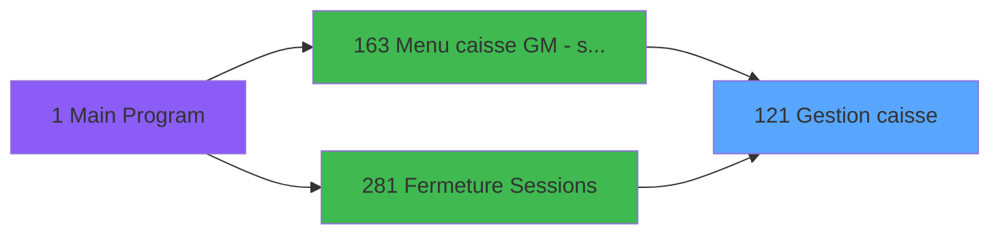
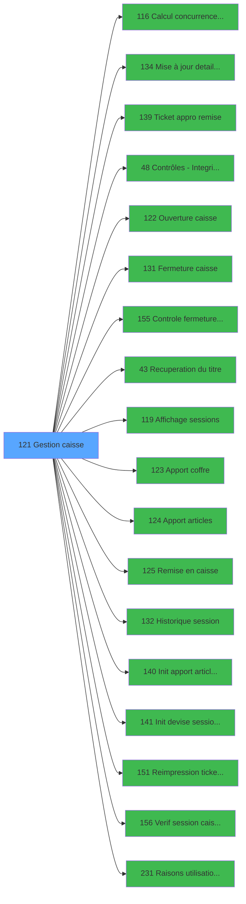

# ADH IDE 121 - Gestion caisse

> **Analyse**: Phases 1-4 2026-02-07 03:50 -> 03:03 (23h12min) | Assemblage 03:03
> **Pipeline**: V7.2 Enrichi
> **Structure**: 4 onglets (Resume | Ecrans | Donnees | Connexions)

<!-- TAB:Resume -->

## 1. FICHE D'IDENTITE

| Attribut | Valeur |
|----------|--------|
| Projet | ADH |
| IDE Position | 121 |
| Nom Programme | Gestion caisse |
| Fichier source | `Prg_121.xml` |
| Dossier IDE | Caisse |
| Taches | 32 (2 ecrans visibles) |
| Tables modifiees | 4 |
| Programmes appeles | 18 |
| Complexite | **MOYENNE** (score 48/100) |

## 2. DESCRIPTION FONCTIONNELLE

**Gestion caisse** (Public Name : `Gestion_Caisse_142`) est l'ecran principal de gestion du point de vente Club Med (ID ecran CA0142). Ce programme MDI orchestre toutes les operations de caisse : ouverture et fermeture de session, approvisionnement en especes et produits, remise au coffre, consultation d'historique et reimpression de tickets. Il comporte 32 taches et modifie 4 tables liees aux sessions. Le programme est accessible depuis [Menu caisse GM - scroll (IDE 163)](ADH-IDE-163.md) et [Fermeture Sessions (IDE 281)](ADH-IDE-281.md).

### Initialisation et parametrage

Au demarrage, le programme charge les parametres de caisse depuis la table `parametres_caisse` (table 697) via les taches 121.1 et 121.3 (8 + 12 lignes). 121.2 "Controle COFFRE2" (33 lignes) verifie l'integrite des donnees du coffre dans `sessions_coffre2` (caisse_session_coffre2) en appelant [Controle fermeture caisse WS (IDE 155)](ADH-IDE-155.md) et [Verif session caisse ouverte2 (IDE 156)](ADH-IDE-156.md). 121.4 lit la date comptable dans `date_comptable___dat` (table 70) pour s'assurer que la journee comptable est valide. 121.5 "Lecture session" (31 lignes) lit la table `histo_sessions_caisse` (caisse_session) pour determiner l'etat courant de la session (ouverte, fermee, en cloture) et appelle [Controles - Integrite dates (IDE 48)](ADH-IDE-48.md).

5 taches : 121.1, 121.2, 121.3, 121.4, 121.5

- **121.1** - Parametres caisse (8 lignes, lit parametres_caisse)
- **121.2** - Controle COFFRE2 (33 lignes, lit sessions_coffre2)
- **121.3** - Parametres caisse (12 lignes, lit parametres_caisse)
- **121.4** - Date comptable (4 lignes, lit date_comptable___dat)
- **121.5** - Lecture session (31 lignes, lit histo_sessions_caisse)

### Ecran de pilotage

La tache 121.6 "Pilotage" (128 lignes, ecran SDI 939x178 DLU) est l'ecran principal visible par l'operateur (Gestion de la caisse). Il affiche l'etat de la caisse avec les montants courants et propose un menu d'actions : ouvrir/fermer la session, realiser des apports ou remises, consulter l'historique. Cet ecran appelle [Calcul concurrence sessions (IDE 116)](ADH-IDE-116.md) (12 fois) pour detecter les sessions paralleles, [Recuperation du titre (IDE 43)](ADH-IDE-43.md) pour le nom de l'operateur, et [Raisons utilisation ADH (IDE 231)](ADH-IDE-231.md) pour le contexte fonctionnel. 121.6.12 "Browse - Concurrence sessions" (6 lignes, ecran) affiche la liste des sessions concurrentes dans `concurrence_sessions` (caisse_concurrences) pour alerter si plusieurs postes sont ouverts simultanement.

2 taches : 121.6, 121.6.12

- **121.6** - Pilotage (128 lignes, lit table 740, **[ECRAN]**)
- **121.6.12** - Browse - Concurrence sessions (6 lignes, ecrit concurrence_sessions, **[ECRAN]**)

### Ouverture de session

L'ouverture de session est geree par la sous-tache 121.6.2 (59 lignes) qui verifie d'abord qu'aucune cloture n'est en cours (121.6.2.1 lit `reseau_cloture___rec`, table 23), puis controle la coherence des stocks monnaie et produit (121.6.2.2, 13 lignes, lit table 198). La tache 121.6.2.3 "Creation histo session" (10 lignes) ecrit un nouvel enregistrement dans `histo_sessions_caisse` (caisse_session) en mode Write, et 121.6.2.3.1 cree l'enregistrement coffre2 correspondant dans `sessions_coffre2` (caisse_session_coffre2). 121.6.2.4 initialise la table temporaire de saisie des devises `saisie_approvisionnement` (caisse_saisie_appro_dev) pour le comptage initial des especes. Le programme delegue le processus complet d'ouverture a [Ouverture caisse (IDE 122)](ADH-IDE-122.md) et l'initialisation des devises a [Init devise session WS (IDE 141)](ADH-IDE-141.md).

5 taches : 121.6.2, 121.6.2.1, 121.6.2.2, 121.6.2.3, 121.6.2.4

- **121.6.2** - Ouverture caisse (59 lignes, orchestrateur)
- **121.6.2.1** - Cloture en cours (5 lignes, lit reseau_cloture___rec)
- **121.6.2.2** - Controle monnaie/produit (13 lignes, lit table 198)
- **121.6.2.3** - Creation histo session (10 lignes, ecrit histo_sessions_caisse)
- **121.6.2.4** - init tempo saisie dev (14 lignes, lit saisie_approvisionnement)

### Approvisionnement et remise au coffre

Ce domaine gere les mouvements de fonds entre la caisse et le coffre. La tache 121.6.4 "Apport coffre" (17 lignes) declenche un approvisionnement en especes depuis le coffre vers la caisse, en appelant [Apport coffre (IDE 123)](ADH-IDE-123.md). 121.6.5 "Apport produit" (16 lignes) gere l'approvisionnement en articles (timbres, cartes...) via [Apport articles (IDE 124)](ADH-IDE-124.md) et [Init apport article session WS (IDE 140)](ADH-IDE-140.md). La tache 121.6.6 "Remise au coffre" (46 lignes) effectue l'operation inverse : retour des especes de la caisse vers le coffre, en appelant [Remise en caisse (IDE 125)](ADH-IDE-125.md). 121.6.6.1 remet a zero la table `saisie_approvisionnement` (Write, Delete) pour preparer la prochaine saisie. Chaque mouvement est enregistre par [Mise a jour detail session WS (IDE 134)](ADH-IDE-134.md) et imprime via [Ticket appro remise (IDE 139)](ADH-IDE-139.md).

4 taches : 121.6.4, 121.6.5, 121.6.6, 121.6.6.1

- **121.6.4** - Apport coffre (17 lignes, orchestrateur)
- **121.6.5** - Apport produit (16 lignes, orchestrateur)
- **121.6.6** - Remise au coffre (46 lignes, orchestrateur)
- **121.6.6.1** - RAZ Saisie devises P/V (8 lignes, ecrit saisie_approvisionnement)

### Fermeture de session

La fermeture de session est orchestree par 121.6.3 (45 lignes) qui appelle [Fermeture caisse (IDE 131)](ADH-IDE-131.md) pour le workflow complet de cloture (comptage final, calcul ecarts, validation). 121.6.3.1 "Cloture histo session" (9 lignes) met a jour l'enregistrement dans `histo_sessions_caisse` en mode Write pour marquer la session comme fermee. Le pointage des apports et remises est gere par 121.6.10 (18 lignes) qui verifie la coherence des mouvements coffre avant cloture definitive. 121.6.11 "Open sessions" (3 lignes) relit les sessions ouvertes via 121.6.11.1 "Pointage" (5 lignes, Write sur histo_sessions_caisse) et 121.6.11.2 "Read Sessions" (42 lignes) qui recalcule les totaux.

5 taches : 121.6.3, 121.6.3.1, 121.6.10, 121.6.11, 121.6.11.2

- **121.6.3** - Fermeture caisse (45 lignes, orchestrateur)
- **121.6.3.1** - Cloture histo session (9 lignes, ecrit histo_sessions_caisse)
- **121.6.10** - Pointage AppRem (18 lignes, orchestrateur)
- **121.6.11** - Open sessions (3 lignes, orchestrateur)
- **121.6.11.2** - Read Sessions (42 lignes, lit table 740)

### Consultation et reimpression

121.6.7 "Historique" (2 lignes) ouvre l'ecran de consultation des sessions passees en appelant [Historique session (IDE 132)](ADH-IDE-132.md). 121.6.8 "Consultation" (4 lignes) permet de consulter le detail d'une session specifique via [Affichage sessions (IDE 119)](ADH-IDE-119.md). 121.6.9 "reimprimer tickets" (2 lignes) relance l'impression des tickets de fermeture via [Reimpression tickets fermeture (IDE 151)](ADH-IDE-151.md) et des tickets d'approvisionnement/remise via [Ticket appro remise (IDE 139)](ADH-IDE-139.md).

3 taches : 121.6.7, 121.6.8, 121.6.9

- **121.6.7** - Historique (2 lignes, appelle IDE 132)
- **121.6.8** - Consultation (4 lignes, appelle IDE 119)
- **121.6.9** - reimprimer tickets (2 lignes, appelle IDE 139, IDE 151)

## 3. BLOCS FONCTIONNELS

### 3.1 Traitement (23 taches)

Traitements internes.

---

#### 121 - Gestion caisse

**Role** : Tache d'orchestration : point d'entree du programme (23 sous-taches). Coordonne l'enchainement des traitements.

22 sous-taches directes

| Tache | Nom | Bloc |
|-------|-----|------|
| [121.1](#t2) | Paramètres caisse | Traitement |
| [121.3](#t4) | Paramètres caisse | Traitement |
| [121.5](#t6) | Etat de la caisse | Traitement |
| [121.6](#t7) | Gestion de la caisse **[[ECRAN]](#ecran-t7)** | Traitement |
| [121.6.1](#t8) | Existe histo | Traitement |
| [121.6.2](#t9) | Ouverture caisse | Traitement |
| [121.6.2.1](#t10) | Cloture en cours v1 | Traitement |
| [121.6.2.3.1](#t13) | histo coffre2 | Traitement |
| [121.6.3](#t15) | Fermeture caisse | Traitement |
| [121.6.3.1](#t16) | Clôture histo session | Traitement |
| [121.6.4](#t17) | Apport coffre | Traitement |
| [121.6.5](#t18) | Apport produit | Traitement |
| [121.6.6](#t19) | Remise au coffre | Traitement |
| [121.6.7](#t21) | Historique | Traitement |
| [121.6.8](#t22) | Consultation | Traitement |
| [121.6.10](#t24) | Remise au coffre | Traitement |
| [121.6.11](#t25) | Open sessions | Traitement |
| [121.6.11.1](#t26) | Pointage | Traitement |
| [121.6.11.2](#t27) | Read Sessions | Traitement |
| [121.6.11.2.1](#t28) | Remise au coffre | Traitement |
| [121.6.11.2.1.2.1](#t31) | histo coffre2 | Traitement |
| [121.6.12](#t32) | Concurrence sessions for devel **[[ECRAN]](#ecran-t32)** | Traitement |

**Variables liees** : FL (V N° caisse reception mini), FM (V N° caisse reception maxi), EN (Param Libelle caisse), EO (Param Etat caisse)

---

#### 121.1 - Paramètres caisse

**Role** : Traitement : Paramètres caisse.
**Variables liees** : FL (V N° caisse reception mini), FM (V N° caisse reception maxi), EN (Param Libelle caisse), EO (Param Etat caisse)

---

#### 121.3 - Paramètres caisse

**Role** : Traitement : Paramètres caisse.
**Variables liees** : FL (V N° caisse reception mini), FM (V N° caisse reception maxi), EN (Param Libelle caisse), EO (Param Etat caisse)

---

#### 121.5 - Etat de la caisse

**Role** : Traitement : Etat de la caisse.
**Variables liees** : FL (V N° caisse reception mini), FM (V N° caisse reception maxi), EN (Param Libelle caisse), EO (Param Etat caisse)

---

#### 121.6 - Gestion de la caisse [[ECRAN]](#ecran-t7)

**Role** : Gestion du moyen de paiement : Gestion de la caisse.
**Ecran** : 939 x 178 DLU (MDI) | [Voir mockup](#ecran-t7)
**Variables liees** : FL (V N° caisse reception mini), FM (V N° caisse reception maxi), EN (Param Libelle caisse), EO (Param Etat caisse)

---

#### 121.6.1 - Existe histo

**Role** : Traitement : Existe histo.

---

#### 121.6.2 - Ouverture caisse

**Role** : Traitement : Ouverture caisse.
**Variables liees** : FG (V User ouverture), FH (V Date ouverture), FI (V Time ouverture), FL (V N° caisse reception mini), FM (V N° caisse reception maxi)

---

#### 121.6.2.1 - Cloture en cours v1

**Role** : Traitement : Cloture en cours v1.
**Variables liees** : FN (V Cloture en cours), FQ (V cloture auto)

---

#### 121.6.2.3.1 - histo coffre2

**Role** : Traitement : histo coffre2.
**Variables liees** : EZ (p.i.Terminal coffre2), FC (p.i.Hostl coffre2)

---

#### 121.6.3 - Fermeture caisse

**Role** : Traitement : Fermeture caisse.
**Variables liees** : FL (V N° caisse reception mini), FM (V N° caisse reception maxi), EN (Param Libelle caisse), EO (Param Etat caisse)

---

#### 121.6.3.1 - Clôture histo session

**Role** : Traitement : Clôture histo session.
**Variables liees** : FF (V session active), FJ (V Date Fin session), FA (Param VIL open sessions)

---

#### 121.6.4 - Apport coffre

**Role** : Traitement : Apport coffre.
**Variables liees** : EZ (p.i.Terminal coffre2), FC (p.i.Hostl coffre2), FP (V avec coffre 2), FD (i.Host courant coffre 2 ?), FO (COFFRE 2 est ouvert)

---

#### 121.6.5 - Apport produit

**Role** : Traitement : Apport produit.

---

#### 121.6.6 - Remise au coffre

**Role** : Calcul fidelite/avantage : Remise au coffre.
**Variables liees** : EZ (p.i.Terminal coffre2), FC (p.i.Hostl coffre2), FP (V avec coffre 2), FD (i.Host courant coffre 2 ?), FO (COFFRE 2 est ouvert)

---

#### 121.6.7 - Historique

**Role** : Consultation/chargement : Historique.

---

#### 121.6.8 - Consultation

**Role** : Consultation/chargement : Consultation.
**Variables liees** : EY (Param Mode consultation)

---

#### 121.6.10 - Remise au coffre

**Role** : Calcul fidelite/avantage : Remise au coffre.
**Variables liees** : EZ (p.i.Terminal coffre2), FC (p.i.Hostl coffre2), FP (V avec coffre 2), FD (i.Host courant coffre 2 ?), FO (COFFRE 2 est ouvert)

---

#### 121.6.11 - Open sessions

**Role** : Traitement : Open sessions.
**Variables liees** : FA (Param VIL open sessions)

---

#### 121.6.11.1 - Pointage

**Role** : Traitement : Pointage.

---

#### 121.6.11.2 - Read Sessions

**Role** : Traitement : Read Sessions.
**Variables liees** : FA (Param VIL open sessions)

---

#### 121.6.11.2.1 - Remise au coffre

**Role** : Calcul fidelite/avantage : Remise au coffre.
**Variables liees** : EZ (p.i.Terminal coffre2), FC (p.i.Hostl coffre2), FP (V avec coffre 2), FD (i.Host courant coffre 2 ?), FO (COFFRE 2 est ouvert)

---

#### 121.6.11.2.1.2.1 - histo coffre2

**Role** : Traitement : histo coffre2.
**Variables liees** : EZ (p.i.Terminal coffre2), FC (p.i.Hostl coffre2)

---

#### 121.6.12 - Concurrence sessions for devel [[ECRAN]](#ecran-t32)

**Role** : Traitement : Concurrence sessions for devel.
**Ecran** : 524 x 236 DLU (MDI) | [Voir mockup](#ecran-t32)
**Variables liees** : FA (Param VIL open sessions)

### 3.2 Validation (2 taches)

Controles de coherence : 2 taches verifient les donnees et conditions.

---

#### 121.2 - Controle COFFRE2

**Role** : Verification : Controle COFFRE2.
**Variables liees** : EZ (p.i.Terminal coffre2), FC (p.i.Hostl coffre2)
**Delegue a** : [Controle fermeture caisse WS (IDE 155)](ADH-IDE-155.md), [Verif session caisse ouverte2 (IDE 156)](ADH-IDE-156.md)

---

#### 121.6.2.2 - Controle monnaie/produit

**Role** : Verification : Controle monnaie/produit.
**Delegue a** : [Controle fermeture caisse WS (IDE 155)](ADH-IDE-155.md), [Verif session caisse ouverte2 (IDE 156)](ADH-IDE-156.md)

### 3.3 Calcul (1 tache)

Calculs metier : montants, stocks, compteurs.

---

#### 121.4 - Date comptable

**Role** : Traitement : Date comptable.
**Variables liees** : FE (V Date comptable), FH (V Date ouverture), FJ (V Date Fin session)
**Delegue a** : [Calcul concurrence sessions (IDE 116)](ADH-IDE-116.md)

### 3.4 Creation (2 taches)

Insertion de nouveaux enregistrements en base.

---

#### 121.6.2.3 - Creation histo session

**Role** : Creation d'enregistrement : Creation histo session.
**Variables liees** : FF (V session active), FJ (V Date Fin session), FA (Param VIL open sessions)

---

#### 121.6.11.2.1.2 - Creation histo session

**Role** : Creation d'enregistrement : Creation histo session.
**Variables liees** : FF (V session active), FJ (V Date Fin session), FA (Param VIL open sessions)

### 3.5 Saisie (2 taches)

Ce bloc traite la saisie des donnees de la transaction.

---

#### 121.6.2.4 - init tempo saisie dev

**Role** : Saisie des donnees : init tempo saisie dev.

---

#### 121.6.6.1 - RAZ Saisie devises P/V

**Role** : Saisie des donnees : RAZ Saisie devises P/V.

### 3.6 Impression (1 tache)

Generation des documents et tickets.

---

#### 121.6.9 - reimprimer tickets

**Role** : Generation du document : reimprimer tickets.
**Delegue a** : [Ticket appro remise (IDE 139)](ADH-IDE-139.md), [Reimpression tickets fermeture (IDE 151)](ADH-IDE-151.md)

### 3.7 Initialisation (1 tache)

Reinitialisation d'etats et variables de travail.

---

#### 121.6.11.2.1.1 - Ligne Initiale

**Role** : Reinitialisation : Ligne Initiale.
**Delegue a** : [Init apport article session WS (IDE 140)](ADH-IDE-140.md), [Init devise session WS (IDE 141)](ADH-IDE-141.md)

## 5. REGLES METIER

1 regles identifiees:

### Autres (1 regles)

#### [RM-001] Condition: Param VIL open sessions [N] egale 'O'

| Element | Detail |
|---------|--------|
| **Condition** | `Param VIL open sessions [N]='O'` |
| **Si vrai** | Action si vrai |
| **Variables** | FA (Param VIL open sessions) |
| **Expression source** | Expression 1 : `Param VIL open sessions [N]='O'` |
| **Exemple** | Si Param VIL open sessions [N]='O' → Action si vrai |
| **Impact** | [121.6.11 - Open sessions](#t25) |

## 6. CONTEXTE

- **Appele par**: [Menu caisse GM - scroll (IDE 163)](ADH-IDE-163.md), [Fermeture Sessions (IDE 281)](ADH-IDE-281.md)
- **Appelle**: 18 programmes | **Tables**: 12 (W:4 R:8 L:5) | **Taches**: 32 | **Expressions**: 7

<!-- TAB:Ecrans -->

## 8. ECRANS

### 8.1 Forms visibles (2 / 32)

| # | Position | Tache | Nom | Type | Largeur | Hauteur | Bloc |
|---|----------|-------|-----|------|---------|---------|------|
| 1 | 121.6 | 121.6 | Gestion de la caisse | MDI | 939 | 178 | Traitement |
| 2 | 121.6.12 | 121.6.12 | Concurrence sessions for devel | MDI | 524 | 236 | Traitement |

### 8.2 Mockups Ecrans

---

#### 121.6 - Gestion de la caisse
**Tache** : [121.6](#t7) | **Type** : MDI | **Dimensions** : 939 x 178 DLU
**Bloc** : Traitement | **Titre IDE** : Gestion de la caisse

<!-- FORM-DATA:
{
    "width":  939,
    "vFactor":  8,
    "type":  "MDI",
    "hFactor":  8,
    "controls":  [
                     {
                         "x":  0,
                         "type":  "label",
                         "var":  "",
                         "y":  2,
                         "w":  931,
                         "fmt":  "",
                         "name":  "",
                         "h":  21,
                         "color":  "",
                         "text":  "",
                         "parent":  null
                     },
                     {
                         "x":  7,
                         "type":  "label",
                         "var":  "",
                         "y":  24,
                         "w":  200,
                         "fmt":  "",
                         "name":  "",
                         "h":  12,
                         "color":  "143",
                         "text":  "Coffre Reception",
                         "parent":  null
                     },
                     {
                         "x":  289,
                         "type":  "label",
                         "var":  "",
                         "y":  65,
                         "w":  71,
                         "fmt":  "",
                         "name":  "",
                         "h":  12,
                         "color":  "",
                         "text":  "par",
                         "parent":  null
                     },
                     {
                         "x":  289,
                         "type":  "label",
                         "var":  "",
                         "y":  84,
                         "w":  71,
                         "fmt":  "",
                         "name":  "",
                         "h":  12,
                         "color":  "",
                         "text":  "le",
                         "parent":  null
                     },
                     {
                         "x":  289,
                         "type":  "label",
                         "var":  "",
                         "y":  102,
                         "w":  71,
                         "fmt":  "",
                         "name":  "",
                         "h":  12,
                         "color":  "",
                         "text":  "à",
                         "parent":  null
                     },
                     {
                         "x":  0,
                         "type":  "label",
                         "var":  "",
                         "y":  151,
                         "w":  931,
                         "fmt":  "",
                         "name":  "",
                         "h":  24,
                         "color":  "",
                         "text":  "",
                         "parent":  null
                     },
                     {
                         "x":  469,
                         "type":  "button",
                         "var":  "",
                         "y":  154,
                         "w":  224,
                         "fmt":  "",
                         "name":  "CLS",
                         "h":  18,
                         "color":  "",
                         "text":  "",
                         "parent":  null
                     },
                     {
                         "x":  381,
                         "type":  "edit",
                         "var":  "",
                         "y":  56,
                         "w":  2,
                         "fmt":  "",
                         "name":  "Field for cursor",
                         "h":  1,
                         "color":  "6",
                         "text":  "",
                         "parent":  null
                     },
                     {
                         "x":  386,
                         "type":  "edit",
                         "var":  "",
                         "y":  46,
                         "w":  256,
                         "fmt":  "",
                         "name":  "",
                         "h":  12,
                         "color":  "6",
                         "text":  "",
                         "parent":  null
                     },
                     {
                         "x":  469,
                         "type":  "button",
                         "var":  "",
                         "y":  129,
                         "w":  224,
                         "fmt":  "",
                         "name":  "Bouton Pointage AppRem",
                         "h":  18,
                         "color":  "",
                         "text":  "",
                         "parent":  null
                     },
                     {
                         "x":  7,
                         "type":  "button",
                         "var":  "",
                         "y":  107,
                         "w":  200,
                         "fmt":  "",
                         "name":  "Bouton Telecollecte TPE",
                         "h":  18,
                         "color":  "",
                         "text":  "",
                         "parent":  null
                     },
                     {
                         "x":  5,
                         "type":  "image",
                         "var":  "",
                         "y":  4,
                         "w":  59,
                         "fmt":  "",
                         "name":  "",
                         "h":  18,
                         "color":  "",
                         "text":  "",
                         "parent":  null
                     },
                     {
                         "x":  75,
                         "type":  "edit",
                         "var":  "",
                         "y":  8,
                         "w":  365,
                         "fmt":  "30",
                         "name":  "",
                         "h":  8,
                         "color":  "",
                         "text":  "",
                         "parent":  null
                     },
                     {
                         "x":  450,
                         "type":  "edit",
                         "var":  "",
                         "y":  8,
                         "w":  203,
                         "fmt":  "24",
                         "name":  "",
                         "h":  8,
                         "color":  "142",
                         "text":  "",
                         "parent":  null
                     },
                     {
                         "x":  663,
                         "type":  "edit",
                         "var":  "",
                         "y":  8,
                         "w":  259,
                         "fmt":  "WWW DD MMM YYYYT",
                         "name":  "",
                         "h":  8,
                         "color":  "",
                         "text":  "",
                         "parent":  null
                     },
                     {
                         "x":  726,
                         "type":  "button",
                         "var":  "",
                         "y":  26,
                         "w":  200,
                         "fmt":  "Appro caisse",
                         "name":  "APC",
                         "h":  18,
                         "color":  "",
                         "text":  "",
                         "parent":  null
                     },
                     {
                         "x":  52,
                         "type":  "image",
                         "var":  "",
                         "y":  39,
                         "w":  111,
                         "fmt":  "",
                         "name":  "",
                         "h":  40,
                         "color":  "",
                         "text":  "",
                         "parent":  null
                     },
                     {
                         "x":  726,
                         "type":  "button",
                         "var":  "",
                         "y":  48,
                         "w":  200,
                         "fmt":  "Appro produits",
                         "name":  "APA",
                         "h":  18,
                         "color":  "",
                         "text":  "",
                         "parent":  null
                     },
                     {
                         "x":  386,
                         "type":  "edit",
                         "var":  "",
                         "y":  65,
                         "w":  256,
                         "fmt":  "",
                         "name":  "",
                         "h":  12,
                         "color":  "6",
                         "text":  "",
                         "parent":  null
                     },
                     {
                         "x":  726,
                         "type":  "button",
                         "var":  "",
                         "y":  70,
                         "w":  200,
                         "fmt":  "Remise en caisse",
                         "name":  "REC",
                         "h":  18,
                         "color":  "",
                         "text":  "",
                         "parent":  null
                     },
                     {
                         "x":  386,
                         "type":  "edit",
                         "var":  "",
                         "y":  84,
                         "w":  256,
                         "fmt":  "",
                         "name":  "",
                         "h":  12,
                         "color":  "6",
                         "text":  "",
                         "parent":  null
                     },
                     {
                         "x":  726,
                         "type":  "button",
                         "var":  "",
                         "y":  92,
                         "w":  200,
                         "fmt":  "\u0026Historiques",
                         "name":  "HIS",
                         "h":  18,
                         "color":  "",
                         "text":  "",
                         "parent":  null
                     },
                     {
                         "x":  386,
                         "type":  "edit",
                         "var":  "",
                         "y":  102,
                         "w":  256,
                         "fmt":  "",
                         "name":  "",
                         "h":  12,
                         "color":  "6",
                         "text":  "",
                         "parent":  null
                     },
                     {
                         "x":  7,
                         "type":  "button",
                         "var":  "",
                         "y":  129,
                         "w":  200,
                         "fmt":  "\u0026Visu sessions",
                         "name":  "",
                         "h":  18,
                         "color":  "",
                         "text":  "",
                         "parent":  null
                     },
                     {
                         "x":  238,
                         "type":  "button",
                         "var":  "",
                         "y":  129,
                         "w":  200,
                         "fmt":  "\u0026Consultation",
                         "name":  "",
                         "h":  18,
                         "color":  "",
                         "text":  "",
                         "parent":  null
                     },
                     {
                         "x":  485,
                         "type":  "button",
                         "var":  "",
                         "y":  129,
                         "w":  440,
                         "fmt":  "Impression du dernier ticket",
                         "name":  "",
                         "h":  18,
                         "color":  "",
                         "text":  "",
                         "parent":  null
                     },
                     {
                         "x":  7,
                         "type":  "button",
                         "var":  "",
                         "y":  154,
                         "w":  200,
                         "fmt":  "\u0026Quitter",
                         "name":  "QUI",
                         "h":  18,
                         "color":  "",
                         "text":  "",
                         "parent":  null
                     },
                     {
                         "x":  238,
                         "type":  "button",
                         "var":  "",
                         "y":  154,
                         "w":  200,
                         "fmt":  "\u0026Ouvrir la session",
                         "name":  "OUV",
                         "h":  18,
                         "color":  "",
                         "text":  "",
                         "parent":  null
                     },
                     {
                         "x":  726,
                         "type":  "button",
                         "var":  "",
                         "y":  154,
                         "w":  200,
                         "fmt":  "Fermer la session",
                         "name":  "FER",
                         "h":  18,
                         "color":  "",
                         "text":  "",
                         "parent":  null
                     },
                     {
                         "x":  7,
                         "type":  "button",
                         "var":  "",
                         "y":  85,
                         "w":  200,
                         "fmt":  "Régul. Télécollecte",
                         "name":  "Bouton Regularisation TPE",
                         "h":  18,
                         "color":  "",
                         "text":  "",
                         "parent":  null
                     }
                 ],
    "taskId":  "121.6",
    "height":  178
}
-->

<strong>Champs : 8 champs</strong>

| Pos (x,y) | Nom | Variable | Type |
|-----------|-----|----------|------|
| 381,56 | Field for cursor | - | edit |
| 386,46 | (sans nom) | - | edit |
| 75,8 | 30 | - | edit |
| 450,8 | 24 | - | edit |
| 663,8 | WWW DD MMM YYYYT | - | edit |
| 386,65 | (sans nom) | - | edit |
| 386,84 | (sans nom) | - | edit |
| 386,102 | (sans nom) | - | edit |

<strong>Boutons : 14 boutons</strong>

| Bouton | Pos (x,y) | Action |
|--------|-----------|--------|
| CLS | 469,154 | Bouton fonctionnel |
| Pointage AppRem | 469,129 | Bouton fonctionnel |
| Telecollecte TPE | 7,107 | Bouton fonctionnel |
| Appro caisse | 726,26 | Appel [Ticket appro remise (IDE 139)](ADH-IDE-139.md) |
| Appro produits | 726,48 | Appel [Ticket appro remise (IDE 139)](ADH-IDE-139.md) |
| Remise en caisse | 726,70 | Appel [Ticket appro remise (IDE 139)](ADH-IDE-139.md) |
| Historiques | 726,92 | Appel [Historique session (IDE 132)](ADH-IDE-132.md) |
| Visu sessions | 7,129 | Bouton fonctionnel |
| Consultation | 238,129 | Bouton fonctionnel |
| Impression du dernier ticket | 485,129 | Appel [Reimpression tickets fermeture (IDE 151)](ADH-IDE-151.md) |
| Quitter | 7,154 | Quitte le programme |
| Ouvrir la session | 238,154 | Ouvre ou ferme la session |
| Fermer la session | 726,154 | Appel [Fermeture caisse (IDE 131)](ADH-IDE-131.md) |
| Régul. Télécollecte | 7,85 | Bouton fonctionnel |

---

#### 121.6.12 - Concurrence sessions for devel
**Tache** : [121.6.12](#t32) | **Type** : MDI | **Dimensions** : 524 x 236 DLU
**Bloc** : Traitement | **Titre IDE** : Concurrence sessions for devel

<!-- FORM-DATA:
{
    "width":  524,
    "vFactor":  8,
    "type":  "MDI",
    "hFactor":  4,
    "controls":  [
                     {
                         "x":  10,
                         "type":  "table",
                         "var":  "",
                         "name":  "",
                         "titleH":  12,
                         "color":  "110",
                         "w":  508,
                         "y":  6,
                         "fmt":  "",
                         "parent":  null,
                         "text":  "",
                         "rowH":  13,
                         "h":  225,
                         "cols":  [
                                      {
                                          "title":  "Utilisateur",
                                          "layer":  1,
                                          "w":  57
                                      },
                                      {
                                          "title":  "Fonction",
                                          "layer":  2,
                                          "w":  42
                                      },
                                      {
                                          "title":  "Occupé",
                                          "layer":  3,
                                          "w":  57
                                      },
                                      {
                                          "title":  "Terminal session",
                                          "layer":  4,
                                          "w":  79
                                      },
                                      {
                                          "title":  "Host",
                                          "layer":  5,
                                          "w":  255
                                      }
                                  ],
                         "rows":  5
                     },
                     {
                         "x":  14,
                         "type":  "edit",
                         "var":  "",
                         "y":  20,
                         "w":  49,
                         "fmt":  "",
                         "name":  "",
                         "h":  8,
                         "color":  "110",
                         "text":  "",
                         "parent":  1
                     },
                     {
                         "x":  73,
                         "type":  "edit",
                         "var":  "",
                         "y":  20,
                         "w":  10,
                         "fmt":  "",
                         "name":  "",
                         "h":  8,
                         "color":  "110",
                         "text":  "",
                         "parent":  1
                     },
                     {
                         "x":  114,
                         "type":  "edit",
                         "var":  "",
                         "y":  20,
                         "w":  10,
                         "fmt":  "",
                         "name":  "",
                         "h":  8,
                         "color":  "110",
                         "text":  "",
                         "parent":  1
                     },
                     {
                         "x":  170,
                         "type":  "edit",
                         "var":  "",
                         "y":  20,
                         "w":  21,
                         "fmt":  "",
                         "name":  "",
                         "h":  8,
                         "color":  "110",
                         "text":  "",
                         "parent":  1
                     },
                     {
                         "x":  250,
                         "type":  "edit",
                         "var":  "",
                         "y":  20,
                         "w":  248,
                         "fmt":  "",
                         "name":  "buffer",
                         "h":  10,
                         "color":  "110",
                         "text":  "",
                         "parent":  1
                     }
                 ],
    "taskId":  "121.6.12",
    "height":  236
}
-->

<strong>Champs : 5 champs</strong>

| Pos (x,y) | Nom | Variable | Type |
|-----------|-----|----------|------|
| 14,20 | (sans nom) | - | edit |
| 73,20 | (sans nom) | - | edit |
| 114,20 | (sans nom) | - | edit |
| 170,20 | (sans nom) | - | edit |
| 250,20 | buffer | - | edit |

## 9. NAVIGATION

### 9.1 Enchainement des ecrans

```mermaid
flowchart TD
    START([Entree])
    style START fill:#3fb950
    VF7[121.6 Gestion de la caisse]
    style VF7 fill:#58a6ff
    VF32[121.6.12 Concurrence sessio...]
    style VF32 fill:#58a6ff
    EXT116[IDE 116 Calcul concurr...]
    style EXT116 fill:#3fb950
    EXT134[IDE 134 Mise à jour de...]
    style EXT134 fill:#3fb950
    EXT139[IDE 139 Ticket appro r...]
    style EXT139 fill:#3fb950
    EXT48[IDE 48 Contrôles - Int...]
    style EXT48 fill:#3fb950
    EXT122[IDE 122 Ouverture caisse]
    style EXT122 fill:#3fb950
    EXT131[IDE 131 Fermeture caisse]
    style EXT131 fill:#3fb950
    EXT155[IDE 155 Controle ferme...]
    style EXT155 fill:#3fb950
    EXT43[IDE 43 Recuperation du...]
    style EXT43 fill:#3fb950
    EXT119[IDE 119 Affichage sess...]
    style EXT119 fill:#3fb950
    EXT123[IDE 123 Apport coffre]
    style EXT123 fill:#3fb950
    EXT124[IDE 124 Apport articles]
    style EXT124 fill:#3fb950
    EXT125[IDE 125 Remise en caisse]
    style EXT125 fill:#3fb950
    EXT132[IDE 132 Historique ses...]
    style EXT132 fill:#3fb950
    EXT140[IDE 140 Init apport ar...]
    style EXT140 fill:#3fb950
    EXT141[IDE 141 Init devise se...]
    style EXT141 fill:#3fb950
    EXT151[IDE 151 Reimpression t...]
    style EXT151 fill:#3fb950
    EXT156[IDE 156 Verif session ...]
    style EXT156 fill:#3fb950
    EXT231[IDE 231 Raisons utilis...]
    style EXT231 fill:#3fb950
    FIN([Sortie])
    style FIN fill:#f85149
    START --> VF7
    VF7 -->|Calcul de donnees| EXT116
    VF7 -->|Mise a jour donnees| EXT134
    VF7 -->|Impression ticket/document| EXT139
    VF7 -->|Sous-programme| EXT48
    VF7 -->|Ouverture session| EXT122
    VF7 -->|Fermeture session| EXT131
    VF7 -->|Controle/validation| EXT155
    VF7 -->|Recuperation donnees| EXT43
    EXT231 --> FIN
```

**Detail par enchainement :**

| Depuis | Action | Vers | Retour |
|--------|--------|------|--------|
| Gestion de la caisse | Calcul de donnees | [Calcul concurrence sessions (IDE 116)](ADH-IDE-116.md) | Retour ecran |
| Gestion de la caisse | Mise a jour donnees | [Mise à jour detail session WS (IDE 134)](ADH-IDE-134.md) | Retour ecran |
| Gestion de la caisse | Impression ticket/document | [Ticket appro remise (IDE 139)](ADH-IDE-139.md) | Retour ecran |
| Gestion de la caisse | Sous-programme | [Contrôles - Integrite dates (IDE 48)](ADH-IDE-48.md) | Retour ecran |
| Gestion de la caisse | Ouverture session | [Ouverture caisse (IDE 122)](ADH-IDE-122.md) | Retour ecran |
| Gestion de la caisse | Fermeture session | [Fermeture caisse (IDE 131)](ADH-IDE-131.md) | Retour ecran |
| Gestion de la caisse | Controle/validation | [Controle fermeture caisse WS (IDE 155)](ADH-IDE-155.md) | Retour ecran |
| Gestion de la caisse | Recuperation donnees | [Recuperation du titre (IDE 43)](ADH-IDE-43.md) | Retour ecran |
| Gestion de la caisse | Affichage donnees | [Affichage sessions (IDE 119)](ADH-IDE-119.md) | Retour ecran |
| Gestion de la caisse | Approvisionnement | [Apport coffre (IDE 123)](ADH-IDE-123.md) | Retour ecran |
| Gestion de la caisse | Approvisionnement | [Apport articles (IDE 124)](ADH-IDE-124.md) | Retour ecran |
| Gestion de la caisse | Programme fidelite | [Remise en caisse (IDE 125)](ADH-IDE-125.md) | Retour ecran |
| Gestion de la caisse | Historique/consultation | [Historique session (IDE 132)](ADH-IDE-132.md) | Retour ecran |
| Gestion de la caisse | Reinitialisation | [Init apport article session WS (IDE 140)](ADH-IDE-140.md) | Retour ecran |
| Gestion de la caisse | Reinitialisation | [Init devise session WS (IDE 141)](ADH-IDE-141.md) | Retour ecran |
| Gestion de la caisse | Impression ticket/document | [Reimpression tickets fermeture (IDE 151)](ADH-IDE-151.md) | Retour ecran |
| Gestion de la caisse | Controle/validation | [Verif session caisse ouverte2 (IDE 156)](ADH-IDE-156.md) | Retour ecran |
| Gestion de la caisse | Parametrage | [Raisons utilisation ADH (IDE 231)](ADH-IDE-231.md) | Retour ecran |

### 9.3 Structure hierarchique (32 taches)

| Position | Tache | Type | Dimensions | Bloc |
|----------|-------|------|------------|------|
| **121.1** | [**Gestion caisse** (121)](#t1) | MDI | - | Traitement |
| 121.1.1 | [Paramètres caisse (121.1)](#t2) | SDI | - | |
| 121.1.2 | [Paramètres caisse (121.3)](#t4) | MDI | - | |
| 121.1.3 | [Etat de la caisse (121.5)](#t6) | MDI | - | |
| 121.1.4 | [Gestion de la caisse (121.6)](#t7) [mockup](#ecran-t7) | MDI | 939x178 | |
| 121.1.5 | [Existe histo (121.6.1)](#t8) | MDI | - | |
| 121.1.6 | [Ouverture caisse (121.6.2)](#t9) | MDI | - | |
| 121.1.7 | [Cloture en cours v1 (121.6.2.1)](#t10) | MDI | - | |
| 121.1.8 | [histo coffre2 (121.6.2.3.1)](#t13) | MDI | - | |
| 121.1.9 | [Fermeture caisse (121.6.3)](#t15) | MDI | - | |
| 121.1.10 | [Clôture histo session (121.6.3.1)](#t16) | MDI | - | |
| 121.1.11 | [Apport coffre (121.6.4)](#t17) | MDI | - | |
| 121.1.12 | [Apport produit (121.6.5)](#t18) | MDI | - | |
| 121.1.13 | [Remise au coffre (121.6.6)](#t19) | MDI | - | |
| 121.1.14 | [Historique (121.6.7)](#t21) | MDI | - | |
| 121.1.15 | [Consultation (121.6.8)](#t22) | MDI | - | |
| 121.1.16 | [Remise au coffre (121.6.10)](#t24) | MDI | - | |
| 121.1.17 | [Open sessions (121.6.11)](#t25) | MDI | - | |
| 121.1.18 | [Pointage (121.6.11.1)](#t26) | MDI | - | |
| 121.1.19 | [Read Sessions (121.6.11.2)](#t27) | MDI | - | |
| 121.1.20 | [Remise au coffre (121.6.11.2.1)](#t28) | MDI | - | |
| 121.1.21 | [histo coffre2 (121.6.11.2.1.2.1)](#t31) | MDI | - | |
| 121.1.22 | [Concurrence sessions for devel (121.6.12)](#t32) [mockup](#ecran-t32) | MDI | 524x236 | |
| **121.2** | [**Controle COFFRE2** (121.2)](#t3) | MDI | - | Validation |
| 121.2.1 | [Controle monnaie/produit (121.6.2.2)](#t11) | MDI | - | |
| **121.3** | [**Date comptable** (121.4)](#t5) | MDI | - | Calcul |
| **121.4** | [**Creation histo session** (121.6.2.3)](#t12) | MDI | - | Creation |
| 121.4.1 | [Creation histo session (121.6.11.2.1.2)](#t30) | MDI | - | |
| **121.5** | [**init tempo saisie dev** (121.6.2.4)](#t14) | MDI | - | Saisie |
| 121.5.1 | [RAZ Saisie devises P/V (121.6.6.1)](#t20) | MDI | - | |
| **121.6** | [**reimprimer tickets** (121.6.9)](#t23) | MDI | - | Impression |
| **121.7** | [**Ligne Initiale** (121.6.11.2.1.1)](#t29) | MDI | - | Initialisation |

### 9.4 Algorigramme

> **Legende**: Vert = START/END OK | Jaune = Flux Gestion Sessions | Bleu = Decisions

| Noeud | Source | Justification |
|-------|--------|---------------|
| START | Programme ADH IDE 121 | Point d'entree Gestion caisse (Gestion_Caisse_142) |
| PARAMS | Taches 121.1, 121.3 | Chargement parametres caisse depuis table 697 |
| COFFRE | Tache 121.2 (33 lignes) | Controle integrite coffre2 - securite comptable |
| SESSION | Tache 121.5 (31 lignes) | Lecture etat session dans histo_sessions_caisse |
| PILOTE | Tache 121.6 (128 lignes) | Ecran principal MDI - menu d'actions operateur |
| CHOIX | Menu 121.6 | Decision operateur : 6 actions possibles |
| OUVERT | Tache 121.6.2 (59 lignes) | Workflow ouverture session complet |
| CLOTURE | Tache 121.6.2.1 | Verification cloture en cours dans reseau_cloture___rec |
| COMPTAG | Tache 121.6.2.4 | Initialisation saisie devises pour comptage |
| HISTO | Taches 121.6.2.3, 121.6.2.3.1 | Creation enregistrement session + coffre2 |
| APPORT | Taches 121.6.4, 121.6.5 | Approvisionnement especes et produits |
| REMISE | Tache 121.6.6 (46 lignes) | Retour especes au coffre |
| FERME | Tache 121.6.3 (45 lignes) | Workflow fermeture complet via IDE 131 |
| POINT | Tache 121.6.10 (18 lignes) | Verification coherence mouvements avant cloture |
| CONSULT | Taches 121.6.7, 121.6.8 | Historique et consultation sessions via IDE 132 |
| REIMP | Tache 121.6.9 | Reimpression tickets via IDE 139 et IDE 151 |
| ENDOK | Fin normale | Session fermee et validee |

<!-- TAB:Donnees -->

## 10. TABLES

### Tables utilisees (12)

| ID | Nom | Description | Type | R | W | L | Usages |
|----|-----|-------------|------|---|---|---|--------|
| 246 | histo_sessions_caisse | Sessions de caisse | DB | R | **W** | L | 6 |
| 248 | sessions_coffre2 | Sessions de caisse | DB |   | **W** | L | 3 |
| 244 | saisie_approvisionnement | Comptage approvisionnement | DB |   | **W** | L | 2 |
| 227 | concurrence_sessions | Sessions de caisse | DB |   | **W** |   | 1 |
| 249 | histo_sessions_caisse_detail | Sessions de caisse | DB | R |   | L | 4 |
| 740 | pv_stock_movements | Articles et stock | DB | R |   |   | 2 |
| 697 | droits_applications | Droits operateur | DB | R |   |   | 2 |
| 70 | date_comptable___dat |  | DB | R |   |   | 1 |
| 198 | coupures_monnaie_locale |  | DB | R |   |   | 1 |
| 232 | gestion_devise_session | Sessions de caisse | DB | R |   |   | 1 |
| 23 | reseau_cloture___rec | Donnees reseau/cloture | DB | R |   |   | 1 |
| 197 | articles_en_stock | Articles et stock | DB |   |   | L | 1 |

### Colonnes par table (10 / 11 tables avec colonnes identifiees)

Table 246 - histo_sessions_caisse (R/**W**/L) - 6 usages

| Lettre | Variable | Acces | Type |
|--------|----------|-------|------|
| EN | Param Libelle caisse | W | Alpha |
| EO | Param Etat caisse | W | Alpha |
| ET | existe histo | W | Logical |
| EU | Type Caisse | W | Alpha |
| FA | Param VIL open sessions | W | Alpha |
| FL | V N° caisse reception mini | W | Numeric |
| FM | V N° caisse reception maxi | W | Numeric |

Table 248 - sessions_coffre2 (**W**/L) - 3 usages

| Lettre | Variable | Acces | Type |
|--------|----------|-------|------|
| EZ | p.i.Terminal coffre2 | W | Numeric |
| FA | Param VIL open sessions | W | Alpha |
| FC | p.i.Hostl coffre2 | W | Unicode |

Table 244 - saisie_approvisionnement (**W**/L) - 2 usages

*Table utilisee uniquement en Link ou aucune colonne Real identifiee dans le DataView.*

Table 227 - concurrence_sessions (**W**) - 1 usages

| Lettre | Variable | Acces | Type |
|--------|----------|-------|------|
| FA | Param VIL open sessions | W | Alpha |

Table 249 - histo_sessions_caisse_detail (R/L) - 4 usages

| Lettre | Variable | Acces | Type |
|--------|----------|-------|------|
| A | Existe session 90 | R | Logical |
| B | COFFRE 2 est ferme | R | Logical |

Table 740 - pv_stock_movements (R) - 2 usages

| Lettre | Variable | Acces | Type |
|--------|----------|-------|------|
| A | Bouton continuer | R | Alpha |
| B | Field for cursor | R | Alpha |
| C | Message | R | Alpha |
| D | Titre | R | Alpha |
| E | Date ouverture | R | Date |
| F | heure ouverture | R | Time |
| G | existe histo | R | Logical |
| H | Autorisation_cloture_ne sert_pa | R | Logical |
| I | abandon | R | Logical |
| J | Bouton Pointage AppRem | R | Alpha |
| K | Bouton Telecollecte TPE | R | Alpha |
| L | Bouton Regul TPE | R | Alpha |
| M | Ecart TPE corrige | R | Logical |
| N | Ouverture Caisse possible? | R | Logical |

Table 697 - droits_applications (R) - 2 usages

*Table utilisee uniquement en Link ou aucune colonne Real identifiee dans le DataView.*

Table 70 - date_comptable___dat (R) - 1 usages

| Lettre | Variable | Acces | Type |
|--------|----------|-------|------|
| ER | Date ouverture | R | Date |
| FE | V Date comptable | R | Date |
| FH | V Date ouverture | R | Date |
| FJ | V Date Fin session | R | Date |

Table 198 - coupures_monnaie_locale (R) - 1 usages

| Lettre | Variable | Acces | Type |
|--------|----------|-------|------|
| A | Existe monnaie | R | Logical |
| B | Existe produit en stock | R | Logical |

Table 232 - gestion_devise_session (R) - 1 usages

| Lettre | Variable | Acces | Type |
|--------|----------|-------|------|
| EN | Existe session 90 | R | Logical |
| EO | Nbre devises en appro | R | Numeric |
| EQ | Param devise locale | R | Alpha |
| ET | Nbre devises compte | R | Numeric |
| FA | Param VIL open sessions | R | Alpha |
| FF | V session active | R | Logical |
| FJ | V Date Fin session | R | Date |

Table 23 - reseau_cloture___rec (R) - 1 usages

| Lettre | Variable | Acces | Type |
|--------|----------|-------|------|
| FN | V Cloture en cours | R | Logical |
| FQ | V cloture auto | R | Alpha |
| EU | Autorisation_cloture_ne sert_pa | R | Logical |

## 11. VARIABLES

### 11.1 Parametres entrants (2)

Variables recues du programme appelant ([Menu caisse GM - scroll (IDE 163)](ADH-IDE-163.md)).

| Lettre | Nom | Type | Usage dans |
|--------|-----|------|-----------|
| EZ | p.i.Terminal coffre2 | Numeric | - |
| FC | p.i.Hostl coffre2 | Unicode | - |

### 11.2 Variables de session (13)

Variables persistantes pendant toute la session.

| Lettre | Nom | Type | Usage dans |
|--------|-----|------|-----------|
| FE | V Date comptable | Date | - |
| FF | V session active | Logical | - |
| FG | V User ouverture | Alpha | - |
| FH | V Date ouverture | Date | - |
| FI | V Time ouverture | Time | - |
| FJ | V Date Fin session | Date | - |
| FK | V Last Chrono | Numeric | - |
| FL | V N° caisse reception mini | Numeric | - |
| FM | V N° caisse reception maxi | Numeric | - |
| FN | V Cloture en cours | Logical | - |
| FP | V avec coffre 2 | Alpha | - |
| FQ | V cloture auto | Alpha | - |
| FR | v.fin | Logical | 2x session |

### 11.3 Autres (16)

Variables diverses.

| Lettre | Nom | Type | Usage dans |
|--------|-----|------|-----------|
| EN | Param Libelle caisse | Alpha | - |
| EO | Param Etat caisse | Alpha | - |
| EP | Param societe | Alpha | - |
| EQ | Param devise locale | Alpha | - |
| ER | Param nbre decimale | Numeric | - |
| ES | Param masque montant | Alpha | - |
| ET | Param code village | Alpha | - |
| EU | Param nom village | Alpha | - |
| EV | Param masque cumul | Alpha | - |
| EW | Param Uni/Bi | Alpha | - |
| EX | Param Village TAI | Alpha | - |
| EY | Param Mode consultation | Logical | - |
| FA | Param VIL open sessions | Alpha | [121.1](#t2), [121.3](#t4), [121.6.11](#t25) |
| FB | Param FROM_IMS | Alpha | - |
| FD | i.Host courant coffre 2 ? | Logical | - |
| FO | COFFRE 2 est ouvert | Logical | - |

Toutes les 31 variables (liste complete)

| Cat | Lettre | Nom Variable | Type |
|-----|--------|--------------|------|
| P0 | **EZ** | p.i.Terminal coffre2 | Numeric |
| P0 | **FC** | p.i.Hostl coffre2 | Unicode |
| V. | **FE** | V Date comptable | Date |
| V. | **FF** | V session active | Logical |
| V. | **FG** | V User ouverture | Alpha |
| V. | **FH** | V Date ouverture | Date |
| V. | **FI** | V Time ouverture | Time |
| V. | **FJ** | V Date Fin session | Date |
| V. | **FK** | V Last Chrono | Numeric |
| V. | **FL** | V N° caisse reception mini | Numeric |
| V. | **FM** | V N° caisse reception maxi | Numeric |
| V. | **FN** | V Cloture en cours | Logical |
| V. | **FP** | V avec coffre 2 | Alpha |
| V. | **FQ** | V cloture auto | Alpha |
| V. | **FR** | v.fin | Logical |
| Autre | **EN** | Param Libelle caisse | Alpha |
| Autre | **EO** | Param Etat caisse | Alpha |
| Autre | **EP** | Param societe | Alpha |
| Autre | **EQ** | Param devise locale | Alpha |
| Autre | **ER** | Param nbre decimale | Numeric |
| Autre | **ES** | Param masque montant | Alpha |
| Autre | **ET** | Param code village | Alpha |
| Autre | **EU** | Param nom village | Alpha |
| Autre | **EV** | Param masque cumul | Alpha |
| Autre | **EW** | Param Uni/Bi | Alpha |
| Autre | **EX** | Param Village TAI | Alpha |
| Autre | **EY** | Param Mode consultation | Logical |
| Autre | **FA** | Param VIL open sessions | Alpha |
| Autre | **FB** | Param FROM_IMS | Alpha |
| Autre | **FD** | i.Host courant coffre 2 ? | Logical |
| Autre | **FO** | COFFRE 2 est ouvert | Logical |

## 12. EXPRESSIONS

**7 / 7 expressions decodees (100%)**

### 12.1 Repartition par type

| Type | Expressions | Regles |
|------|-------------|--------|
| CONDITION | 1 | 5 |
| CONSTANTE | 1 | 0 |
| CAST_LOGIQUE | 2 | 0 |
| OTHER | 2 | 0 |
| REFERENCE_VG | 1 | 0 |

### 12.2 Expressions cles par type

#### CONDITION (1 expressions)

| Type | IDE | Expression | Regle |
|------|-----|------------|-------|
| CONDITION | 1 | `Param VIL open sessions [N]='O'` | [RM-001](#rm-RM-001) |

#### CONSTANTE (1 expressions)

| Type | IDE | Expression | Regle |
|------|-----|------------|-------|
| CONSTANTE | 3 | `'D'` | - |

#### CAST_LOGIQUE (2 expressions)

| Type | IDE | Expression | Regle |
|------|-----|------------|-------|
| CAST_LOGIQUE | 5 | `'TRUE'LOG` | - |
| CAST_LOGIQUE | 2 | `'FALSE'LOG` | - |

#### OTHER (2 expressions)

| Type | IDE | Expression | Regle |
|------|-----|------------|-------|
| OTHER | 6 | `NOT(v.fin [BE])` | - |
| OTHER | 4 | `v.fin [BE]` | - |

#### REFERENCE_VG (1 expressions)

| Type | IDE | Expression | Regle |
|------|-----|------------|-------|
| REFERENCE_VG | 7 | `VG111` | - |

<!-- TAB:Connexions -->

## 13. GRAPHE D'APPELS

### 13.1 Chaine depuis Main (Callers)

Main -> ... -> [Menu caisse GM - scroll (IDE 163)](ADH-IDE-163.md) -> **Gestion caisse (IDE 121)**

Main -> ... -> [Fermeture Sessions (IDE 281)](ADH-IDE-281.md) -> **Gestion caisse (IDE 121)**

### 13.2 Callers

| IDE | Nom Programme | Nb Appels |
|-----|---------------|-----------|
| [163](ADH-IDE-163.md) | Menu caisse GM - scroll | 2 |
| [281](ADH-IDE-281.md) | Fermeture Sessions | 1 |

### 13.3 Callees (programmes appeles)

### 13.4 Detail Callees avec contexte

| IDE | Nom Programme | Appels | Contexte |
|-----|---------------|--------|----------|
| [116](ADH-IDE-116.md) | Calcul concurrence sessions | 12 | Calcul de donnees |
| [134](ADH-IDE-134.md) | Mise à jour detail session WS | 3 | Mise a jour donnees |
| [139](ADH-IDE-139.md) | Ticket appro remise | 3 | Impression ticket/document |
| [48](ADH-IDE-48.md) | Contrôles - Integrite dates | 2 | Sous-programme |
| [122](ADH-IDE-122.md) | Ouverture caisse | 2 | Ouverture session |
| [131](ADH-IDE-131.md) | Fermeture caisse | 2 | Fermeture session |
| [155](ADH-IDE-155.md) | Controle fermeture caisse WS | 2 | Controle/validation |
| [43](ADH-IDE-43.md) | Recuperation du titre | 1 | Recuperation donnees |
| [119](ADH-IDE-119.md) | Affichage sessions | 1 | Affichage donnees |
| [123](ADH-IDE-123.md) | Apport coffre | 1 | Approvisionnement |
| [124](ADH-IDE-124.md) | Apport articles | 1 | Approvisionnement |
| [125](ADH-IDE-125.md) | Remise en caisse | 1 | Programme fidelite |
| [132](ADH-IDE-132.md) | Historique session | 1 | Historique/consultation |
| [140](ADH-IDE-140.md) | Init apport article session WS | 1 | Reinitialisation |
| [141](ADH-IDE-141.md) | Init devise session WS | 1 | Reinitialisation |
| [151](ADH-IDE-151.md) | Reimpression tickets fermeture | 1 | Impression ticket/document |
| [156](ADH-IDE-156.md) | Verif session caisse ouverte2 | 1 | Controle/validation |
| [231](ADH-IDE-231.md) | Raisons utilisation ADH | 1 | Parametrage |

## 14. RECOMMANDATIONS MIGRATION

### 14.1 Profil du programme

| Metrique | Valeur | Impact migration |
|----------|--------|-----------------|
| Lignes de logique | 678 | Programme volumineux |
| Expressions | 7 | Peu de logique |
| Tables WRITE | 4 | Impact modere |
| Sous-programmes | 18 | Forte dependance |
| Ecrans visibles | 2 | Quelques ecrans |
| Code desactive | 0% (0 / 678) | Code sain |
| Regles metier | 1 | Quelques regles a preserver |

### 14.2 Plan de migration par bloc

#### Traitement (23 taches: 2 ecrans, 21 traitements)

- **Strategie** : Orchestrateur avec 2 ecrans (Razor/React) et 21 traitements backend (services).
- Les ecrans deviennent des composants UI, les traitements invisibles deviennent des services injectables.
- 18 sous-programme(s) a migrer ou a reutiliser depuis les services existants.
- Decomposer les taches en services unitaires testables.

#### Validation (2 taches: 0 ecran, 2 traitements)

- **Strategie** : FluentValidation avec validators specifiques.
- Chaque tache de validation -> un validator injectable

#### Calcul (1 tache: 0 ecran, 1 traitement)

- **Strategie** : Services de calcul purs (Domain Services).
- Migrer la logique de calcul (stock, compteurs, montants)

#### Creation (2 taches: 0 ecran, 2 traitements)

- **Strategie** : Repository pattern avec Entity Framework Core.
- Insertion via `IRepository<T>.CreateAsync()`

#### Saisie (2 taches: 0 ecran, 2 traitements)

- **Strategie** : Formulaire React/Blazor avec validation Zod/FluentValidation.
- Validation temps reel cote client + serveur

#### Impression (1 tache: 0 ecran, 1 traitement)

- **Strategie** : Templates HTML -> PDF via wkhtmltopdf ou Puppeteer.
- `PrintService` injectable avec choix imprimante

#### Initialisation (1 tache: 0 ecran, 1 traitement)

- **Strategie** : Constructeur/methode `InitAsync()` dans l'orchestrateur.

### 14.3 Dependances critiques

| Dependance | Type | Appels | Impact |
|------------|------|--------|--------|
| concurrence_sessions | Table WRITE (Database) | 1x | Schema + repository |
| saisie_approvisionnement | Table WRITE (Database) | 1x | Schema + repository |
| histo_sessions_caisse | Table WRITE (Database) | 4x | Schema + repository |
| sessions_coffre2 | Table WRITE (Database) | 2x | Schema + repository |
| [Calcul concurrence sessions (IDE 116)](ADH-IDE-116.md) | Sous-programme | 12x | **CRITIQUE** - Calcul de donnees |
| [Ticket appro remise (IDE 139)](ADH-IDE-139.md) | Sous-programme | 3x | **CRITIQUE** - Impression ticket/document |
| [Mise à jour detail session WS (IDE 134)](ADH-IDE-134.md) | Sous-programme | 3x | **CRITIQUE** - Mise a jour donnees |
| [Fermeture caisse (IDE 131)](ADH-IDE-131.md) | Sous-programme | 2x | Haute - Fermeture session |
| [Controle fermeture caisse WS (IDE 155)](ADH-IDE-155.md) | Sous-programme | 2x | Haute - Controle/validation |
| [Contrôles - Integrite dates (IDE 48)](ADH-IDE-48.md) | Sous-programme | 2x | Haute - Sous-programme |
| [Ouverture caisse (IDE 122)](ADH-IDE-122.md) | Sous-programme | 2x | Haute - Ouverture session |
| [Init devise session WS (IDE 141)](ADH-IDE-141.md) | Sous-programme | 1x | Normale - Reinitialisation |
| [Init apport article session WS (IDE 140)](ADH-IDE-140.md) | Sous-programme | 1x | Normale - Reinitialisation |
| [Reimpression tickets fermeture (IDE 151)](ADH-IDE-151.md) | Sous-programme | 1x | Normale - Impression ticket/document |

---
*Spec DETAILED generee par Pipeline V7.2 - 2026-02-08 03:03*
