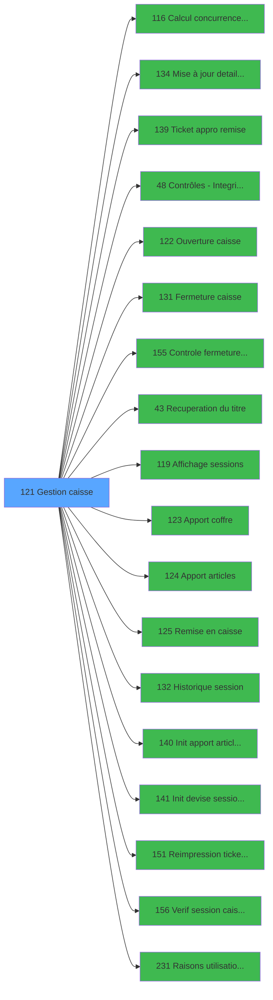

# ADH IDE 121 - Gestion caisse

> **Analyse**: 2026-01-29 13:01
> **Pipeline**: V7.0 Deep Analysis
> **Structure**: 4 onglets (Resume | Ecrans | Donnees | Connexions)

<!-- TAB:Resume -->

## 1. FICHE D'IDENTITE

| Attribut | Valeur |
|----------|--------|
| Projet | ADH |
| IDE Position | 121 |
| Nom Programme | Gestion caisse |
| Complexite | **MOYENNE** (48/100) |
| Statut | NON_ORPHELIN |
| Raison | Appele par 2 programme(s): IDE 163, IDE 281 |
| Taches | 32 |
| Ecrans visibles | 2 |
| Tables modifiees | 4 |
| Programmes appeles | 18 |

## 2. DESCRIPTION FONCTIONNELLE

**Gestion caisse** assure la gestion complete de ce processus, accessible depuis Menu caisse GM - scroll, Fermeture Sessions.

Le flux de traitement s'organise en **7 blocs fonctionnels** :

- **Traitement** (23 taches) : traitements metier divers
- **Creation** (2 taches) : insertion d'enregistrements en base (mouvements, prestations)
- **Saisie** (2 taches) : ecrans de saisie utilisateur (formulaires, champs, donnees)
- **Validation** (2 taches) : controles et verifications de coherence
- **Initialisation** (1 taches) : reinitialisation d'etats et de variables de travail
- **Impression** (1 taches) : generation de tickets et documents
- **Calcul** (1 taches) : calculs de montants, stocks ou compteurs

Le programme delegue des operations a **18 sous-programmes** couvrant :

- **Calcul de donnees** : Calcul concurrence sessions
- **Impression ticket/document** : Ticket appro remise, Reimpression tickets fermeture
- **Programme fidelite** : Remise en caisse
- **Recuperation donnees** : Recuperation du titre
- **Reinitialisation** : Init apport article session WS, Init devise session WS

**Donnees modifiees** : 4 tables en ecriture (concurrence_sessions, saisie_approvisionnement, histo_sessions_caisse, sessions_coffre2).

## 3. BLOCS FONCTIONNELS

### 3.1 Traitement (23 taches)

- **Gestion de la caisse** (Tache 7, MDI, 939x178)
- **Concurrence sessions for devel** (Tache 32, MDI, 524x236)
- *Traitements internes*: Gestion caisse (T1), Paramètres caisse (T2), Paramètres caisse (T4), Etat de la caisse (T6), Existe histo (T8), Ouverture caisse (T9), Cloture en cours v1 (T10), histo coffre2 (T13), Fermeture caisse (T15), Clôture histo session (T16), Apport coffre (T17), Apport produit (T18), Remise au coffre (T19), Historique (T21), Consultation (T22), Remise au coffre (T24), Open sessions (T25), Pointage (T26), Read Sessions (T27), Remise au coffre (T28), histo coffre2 (T31)

### 3.2 Validation (2 taches)

- *Traitements internes*: Controle COFFRE2 (T3), Controle monnaie/produit (T11)

### 3.3 Calcul (1 taches)

- *Traitements internes*: Date comptable (T5)

### 3.4 Creation (2 taches)

- *Traitements internes*: Creation histo session (T12), Creation histo session (T30)

### 3.5 Saisie (2 taches)

- *Traitements internes*: init tempo saisie dev (T14), RAZ Saisie devises P/V (T20)

### 3.6 Impression (1 taches)

- *Traitements internes*: reimprimer tickets (T23)

### 3.7 Initialisation (1 taches)

- *Traitements internes*: Ligne Initiale (T29)

## 4. FLUX UTILISATEUR

Enchainement principal des ecrans:

1. **Gestion de la caisse** (MDI)
2. **Concurrence sessions for devel** (MDI)

## 5. REGLES METIER

*(Aucune regle metier identifiee)*

## 6. PROGRAMMES LIES

- **Appele par**: Menu caisse GM - scroll (IDE 163), Fermeture Sessions (IDE 281)
- **Appelle**: Calcul concurrence sessions (IDE 116), Mise à jour detail session WS (IDE 134), Ticket appro remise (IDE 139), Contrôles - Integrite dates (IDE 48), Ouverture caisse (IDE 122), Fermeture caisse (IDE 131), Controle fermeture caisse WS (IDE 155), Recuperation du titre (IDE 43), Affichage sessions (IDE 119), Apport coffre (IDE 123), Apport articles (IDE 124), Remise en caisse (IDE 125), Historique session (IDE 132), Init apport article session WS (IDE 140), Init devise session WS (IDE 141), Reimpression tickets fermeture (IDE 151), Verif session caisse ouverte2 (IDE 156), Raisons utilisation ADH (IDE 231)

## 7. STATISTIQUES

| Metrique | Valeur |
|----------|--------|
| Taches | 32 |
| Ecrans visibles | 2 / 32 |
| Lignes Logic | 678 |
| Expressions | 7 |
| Regles metier | 0 |
| Tables | 12 (W:4 R:8 L:5) |
| Programmes appeles | 18 |

<!-- TAB:Ecrans -->

## 8. ECRANS

### 8.1 Forms visibles (2 / 32)

| # | Tache | Nom | Type | Largeur | Hauteur |
|---|-------|-----|------|---------|---------|
| 1 | 7 | Gestion de la caisse | MDI | 939 | 178 |
| 2 | 32 | Concurrence sessions for devel | MDI | 524 | 236 |

### 8.2 Mockups Ecrans

```
+=============================================+
| Gestion de la caisse [MDI] 939x178 - Tach... |
+---------------------------------------------+
|  [Phase 2: controles reels]                 |
|                                             |
|                                             |
|                                             |
+=============================================+

+============================+
| Concurrence sessions for... |
+----------------------------+
|  [Phase 2: controles reels]|
|                            |
|                            |
|                            |
|                            |
+============================+

```

## 9. NAVIGATION

### 9.1 Enchainement des ecrans


### 9.2 Logique decisionnelle

*(Pas de regles metier pour l'algorigramme)*

### 9.3 Toutes les taches (32)

| Tache | Nom | Type | Visible | Bloc |
|-------|-----|------|---------|------|
| 1 | Gestion caisse | MDI | - | Traitement |
| 2 | Paramètres caisse | SDI | - | Traitement |
| 3 | Controle COFFRE2 | MDI | - | Validation |
| 4 | Paramètres caisse | MDI | - | Traitement |
| 5 | Date comptable | MDI | - | Calcul |
| 6 | Etat de la caisse | MDI | - | Traitement |
| 7 | Gestion de la caisse | MDI | OUI | Traitement |
| 8 | Existe histo | MDI | - | Traitement |
| 9 | Ouverture caisse | MDI | - | Traitement |
| 10 | Cloture en cours v1 | MDI | - | Traitement |
| 11 | Controle monnaie/produit | MDI | - | Validation |
| 12 | Creation histo session | MDI | - | Creation |
| 13 | histo coffre2 | MDI | - | Traitement |
| 14 | init tempo saisie dev | MDI | - | Saisie |
| 15 | Fermeture caisse | MDI | - | Traitement |
| 16 | Clôture histo session | MDI | - | Traitement |
| 17 | Apport coffre | MDI | - | Traitement |
| 18 | Apport produit | MDI | - | Traitement |
| 19 | Remise au coffre | MDI | - | Traitement |
| 20 | RAZ Saisie devises P/V | MDI | - | Saisie |
| 21 | Historique | MDI | - | Traitement |
| 22 | Consultation | MDI | - | Traitement |
| 23 | reimprimer tickets | MDI | - | Impression |
| 24 | Remise au coffre | MDI | - | Traitement |
| 25 | Open sessions | MDI | - | Traitement |
| 26 | Pointage | MDI | - | Traitement |
| 27 | Read Sessions | MDI | - | Traitement |
| 28 | Remise au coffre | MDI | - | Traitement |
| 29 | Ligne Initiale | MDI | - | Initialisation |
| 30 | Creation histo session | MDI | - | Creation |
| 31 | histo coffre2 | MDI | - | Traitement |
| 32 | Concurrence sessions for devel | MDI | OUI | Traitement |

<!-- TAB:Donnees -->

## 10. TABLES

### 10.1 Vue unifiee (12 tables)

| ID | Nom Logique | Nom Physique | R | W | L | Stockage | Usages |
|----|-------------|--------------|---|---|---|----------|--------|
| 23 | reseau_cloture___rec | cafil001_dat | R | - | - | Database | 1 |
| 70 | date_comptable___dat | cafil048_dat | R | - | - | Database | 1 |
| 197 | articles_en_stock | caisse_artstock | - | - | L | Database | 1 |
| 198 | coupures_monnaie_locale | caisse_banknote | R | - | - | Database | 1 |
| 227 | concurrence_sessions | caisse_concurrences | - | **W** | - | Database | 1 |
| 232 | gestion_devise_session | caisse_devise | R | - | - | Database | 1 |
| 244 | saisie_approvisionnement | caisse_saisie_appro_dev | - | **W** | L | Database | 2 |
| 246 | histo_sessions_caisse | caisse_session | R | **W** | L | Database | 6 |
| 248 | sessions_coffre2 | caisse_session_coffre2 | - | **W** | L | Database | 3 |
| 249 | histo_sessions_caisse_detail | caisse_session_detail | R | - | L | Database | 4 |
| 697 | droits_applications | droits | R | - | - | Database | 2 |
| 740 | pv_stock_movements | pv_stockmvt_dat | R | - | - | Database | 2 |

### 10.2 Colonnes utilisees

*[Phase 2] Analyse detaillee des colonnes reellement lues/modifiees par table.*

## 11. VARIABLES

### 11.1 Variables principales (Top 20 / 31)

| Cat | Lettre | Nom Variable | Type | Ref |
|-----|--------|--------------|------|-----|
| V. | **R** | V Date comptable | Date | `{0,18}` |
| V. | **S** | V session active | Logical | `{0,19}` |
| V. | **T** | V User ouverture | Alpha | `{0,20}` |
| V. | **U** | V Date ouverture | Date | `{0,21}` |
| V. | **V** | V Time ouverture | Time | `{0,22}` |
| V. | **W** | V Date Fin session | Date | `{0,23}` |
| V. | **X** | V Last Chrono | Numeric | `{0,24}` |
| V. | **Y** | V N° caisse reception mini | Numeric | `{0,25}` |
| V. | **Z** | V N° caisse reception maxi | Numeric | `{0,26}` |
| V. | **BA** | V Cloture en cours | Logical | `{0,53}` |
| V. | **BC** | V avec coffre 2 | Alpha | `{0,55}` |
| V. | **BD** | V cloture auto | Alpha | `{0,56}` |
| V. | **BE** | v.fin | Logical | `{0,57}` |
| Autre | **A** | Param Libelle caisse | Alpha | `{0,1}` |
| Autre | **B** | Param Etat caisse | Alpha | `{0,2}` |
| Autre | **C** | Param societe | Alpha | `{0,3}` |
| Autre | **D** | Param devise locale | Alpha | `{0,4}` |
| Autre | **E** | Param nbre decimale | Numeric | `{0,5}` |
| Autre | **F** | Param masque montant | Alpha | `{0,6}` |
| Autre | **G** | Param code village | Alpha | `{0,7}` |

### 11.2 Variables completes (31 entrees)

<details>
<summary>Voir toutes les 31 variables</summary>

| Cat | Lettre | Nom Variable | Type | Ref |
|-----|--------|--------------|------|-----|
| V. | **R** | V Date comptable | Date | `{0,18}` |
| V. | **S** | V session active | Logical | `{0,19}` |
| V. | **T** | V User ouverture | Alpha | `{0,20}` |
| V. | **U** | V Date ouverture | Date | `{0,21}` |
| V. | **V** | V Time ouverture | Time | `{0,22}` |
| V. | **W** | V Date Fin session | Date | `{0,23}` |
| V. | **X** | V Last Chrono | Numeric | `{0,24}` |
| V. | **Y** | V N° caisse reception mini | Numeric | `{0,25}` |
| V. | **Z** | V N° caisse reception maxi | Numeric | `{0,26}` |
| V. | **BA** | V Cloture en cours | Logical | `{0,53}` |
| V. | **BC** | V avec coffre 2 | Alpha | `{0,55}` |
| V. | **BD** | V cloture auto | Alpha | `{0,56}` |
| V. | **BE** | v.fin | Logical | `{0,57}` |
| Autre | **A** | Param Libelle caisse | Alpha | `{0,1}` |
| Autre | **B** | Param Etat caisse | Alpha | `{0,2}` |
| Autre | **C** | Param societe | Alpha | `{0,3}` |
| Autre | **D** | Param devise locale | Alpha | `{0,4}` |
| Autre | **E** | Param nbre decimale | Numeric | `{0,5}` |
| Autre | **F** | Param masque montant | Alpha | `{0,6}` |
| Autre | **G** | Param code village | Alpha | `{0,7}` |
| Autre | **H** | Param nom village | Alpha | `{0,8}` |
| Autre | **I** | Param masque cumul | Alpha | `{0,9}` |
| Autre | **J** | Param Uni/Bi | Alpha | `{0,10}` |
| Autre | **K** | Param Village TAI | Alpha | `{0,11}` |
| Autre | **L** | Param Mode consultation | Logical | `{0,12}` |
| Autre | **M** | p.i.Terminal coffre2 | Numeric | `{0,13}` |
| Autre | **N** | Param VIL open sessions | Alpha | `{0,14}` |
| Autre | **O** | Param FROM_IMS | Alpha | `{0,15}` |
| Autre | **P** | p.i.Hostl coffre2 | Unicode | `{0,16}` |
| Autre | **Q** | i.Host courant coffre 2 ? | Logical | `{0,17}` |
| Autre | **BB** | COFFRE 2 est ouvert | Logical | `{0,54}` |

</details>

## 12. EXPRESSIONS

**7 / 7 expressions decodees (100%)**

### 12.1 Repartition par type

| Type | Nombre |
|------|--------|
| condition | 0 |
| calculation | 0 |
| other | 6 |
| date | 0 |
| constant | 1 |
| string | 0 |

### 12.2 Expressions cles (Top 20)

| # | Type | IDE | Expression | Regle |
|---|------|-----|------------|-------|
| 1 | CONSTANT | 3 | `'D'` | - |
| 2 | OTHER | 5 | `'TRUE'LOG` | - |
| 3 | OTHER | 6 | `NOT([AE])` | - |
| 4 | OTHER | 7 | `VG111` | - |
| 5 | OTHER | 1 | `Param VIL open sessions [N]='O'` | - |
| 6 | OTHER | 2 | `'FALSE'LOG` | - |
| 7 | OTHER | 4 | `[AE]` | - |

<!-- TAB:Connexions -->

## 13. GRAPHE D'APPELS

### 13.1 Chaine depuis Main (Callers)

**Chemin**: Menu caisse GM - scroll (IDE 163) -> Fermeture Sessions (IDE 281) -> Main Program (IDE 1) -> Gestion caisse (IDE 121)


### 13.2 Callers

| IDE | Nom Programme | Nb Appels |
|-----|---------------|-----------|
| 163 | Menu caisse GM - scroll | 2 |
| 281 | Fermeture Sessions | 1 |

### 13.3 Callees (programmes appeles)



### 13.4 Detail Callees avec contexte

| IDE | Nom Programme | Appels | Contexte |
|-----|---------------|--------|----------|
| 116 | Calcul concurrence sessions | 12 | Calcul de donnees |
| 134 | Mise à jour detail session WS | 3 | [Phase 2] |
| 139 | Ticket appro remise | 3 | Impression ticket/document |
| 48 | Contrôles - Integrite dates | 2 | [Phase 2] |
| 122 | Ouverture caisse | 2 | [Phase 2] |
| 131 | Fermeture caisse | 2 | [Phase 2] |
| 155 | Controle fermeture caisse WS | 2 | [Phase 2] |
| 43 | Recuperation du titre | 1 | Recuperation donnees |
| 119 | Affichage sessions | 1 | [Phase 2] |
| 123 | Apport coffre | 1 | [Phase 2] |
| 124 | Apport articles | 1 | [Phase 2] |
| 125 | Remise en caisse | 1 | Programme fidelite |
| 132 | Historique session | 1 | [Phase 2] |
| 140 | Init apport article session WS | 1 | Reinitialisation |
| 141 | Init devise session WS | 1 | Reinitialisation |
| 151 | Reimpression tickets fermeture | 1 | Impression ticket/document |
| 156 | Verif session caisse ouverte2 | 1 | [Phase 2] |
| 231 | Raisons utilisation ADH | 1 | [Phase 2] |

## 14. COMPLEXITE ET MIGRATION

### 14.1 Score: **MOYENNE** (48/100)

| Critere | Evaluation |
|---------|------------|
| Expressions: 7 (MINIMALE) |  |
| Taches: 32 (HAUTE) |  |
| Tables WRITE: 4 (MOYENNE) |  |
| Callees: 18 (HAUTE) |  |
| Code desactive: 0% (SAIN) |  |

### 14.2 Estimation effort: **15 jours**

### 14.3 Recommandations par bloc

#### Traitement (23 taches, ~11j)

- Traitement standard a migrer

#### Validation (2 taches, ~1j)

- Conditions de verification a transformer en validators

#### Calcul (1 taches, ~1j)

- Logique de calcul a migrer (stock, compteurs)

#### Creation (2 taches, ~1j)

- Insertion de donnees (reglements, mouvements)

#### Saisie (2 taches, ~1j)

- Ecran principal de saisie a reproduire
- Gerer les validations champs

#### Impression (1 taches, ~1j)

- Generation tickets/documents
- Configuration imprimantes

#### Initialisation (1 taches, ~1j)

- Reinitialisation etats/variables

### 14.4 Dependances critiques

| Dependance | Type | Impact |
|------------|------|--------|
| concurrence_sessions | Table WRITE | Modification directe |
| saisie_approvisionnement | Table WRITE | Modification directe |
| histo_sessions_caisse | Table WRITE | Modification directe |
| sessions_coffre2 | Table WRITE | Modification directe |
| IDE 116 - Calcul concurrence sessions | Sous-programme (12x) | Calcul de donnees |
| IDE 134 - Mise à jour detail session WS | Sous-programme (3x) | [Phase 2] |
| IDE 139 - Ticket appro remise | Sous-programme (3x) | Impression ticket/document |
| IDE 48 - Contrôles - Integrite dates | Sous-programme (2x) | [Phase 2] |
| IDE 122 - Ouverture caisse | Sous-programme (2x) | [Phase 2] |
| IDE 131 - Fermeture caisse | Sous-programme (2x) | [Phase 2] |
| IDE 155 - Controle fermeture caisse WS | Sous-programme (2x) | [Phase 2] |

---
*Spec DETAILED generee par Pipeline V7.0 - 2026-01-29 13:01*
