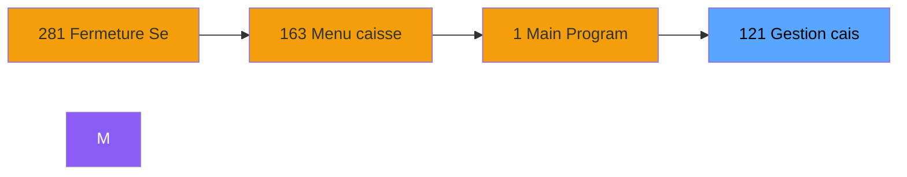
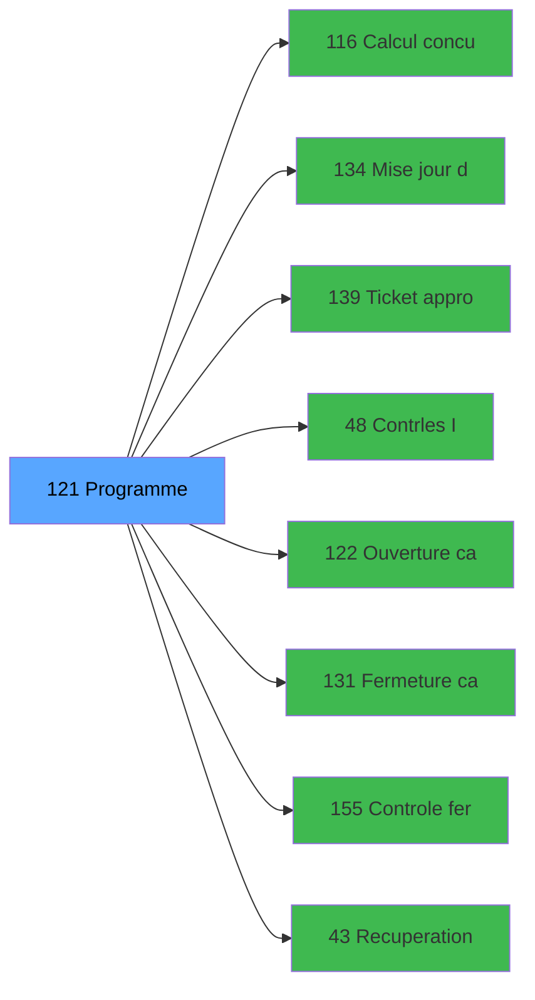

# ADH IDE 121 - Gestion caisse

> **Version spec**: 3.5
> **Analyse**: 2026-01-27 17:57
> **Source**: `Prg_XXX.xml`

---

<!-- TAB:Fonctionnel -->

## SPECIFICATION FONCTIONNELLE

### 1.1 Objectif metier

| Element | Description |
|---------|-------------|
| **Qui** | Operateur |
| **Quoi** | Gestion caisse
 |
| **Pourquoi** | A documenter |
| **Declencheur** | A identifier |

### 1.2 Regles metier

| Code | Regle | Condition |
|------|-------|-----------|
| RM-001 | A documenter | - |

### 1.3 Flux utilisateur

1. Demarrage programme
2. Traitement principal
3. Fin programme

### 1.4 Cas d'erreur

| Erreur | Comportement |
|--------|--------------|
| - | A documenter |

---

<!-- TAB:Technique -->

## SPECIFICATION TECHNIQUE

### 2.1 Identification

| Attribut | Valeur |
|----------|--------|
| **Format IDE** | ADH IDE 121 |
| **Description** | Gestion caisse
 |
| **Module** | ADH |

### 2.2 Tables

| # | Nom logique | Nom physique | Acces | Usage |
|---|-------------|--------------|-------|-------|
| 23 | reseau_cloture___rec | `cafil001_dat` | R | 1x |
| 70 | date_comptable___dat | `cafil048_dat` | R | 1x |
| 197 | articles_en_stock | `caisse_artstock` | L | 1x |
| 198 | coupures_monnaie_locale | `caisse_banknote` | R | 1x |
| 227 | concurrence_sessions | `caisse_concurrences` | **W** | 1x |
| 232 | gestion_devise_session | `caisse_devise` | R | 1x |
| 244 | saisie_approvisionnement | `caisse_saisie_appro_dev` | L | 1x |
| 244 | saisie_approvisionnement | `caisse_saisie_appro_dev` | **W** | 1x |
| 246 | histo_sessions_caisse | `caisse_session` | L | 1x |
| 246 | histo_sessions_caisse | `caisse_session` | R | 1x |
| 246 | histo_sessions_caisse | `caisse_session` | **W** | 4x |
| 248 | sessions_coffre2 | `caisse_session_coffre2` | L | 1x |
| 248 | sessions_coffre2 | `caisse_session_coffre2` | **W** | 2x |
| 249 | histo_sessions_caisse_detail | `caisse_session_detail` | L | 1x |
| 249 | histo_sessions_caisse_detail | `caisse_session_detail` | R | 3x |
| 697 | droits_applications | `droits` | R | 2x |
| 740 | pv_stock_movements | `pv_stockmvt_dat` | R | 2x |
### 2.3 Parametres d'entree

| Variable | Nom | Type | Picture |
|----------|-----|------|---------|
| - | Aucun parametre | - | - |
### 2.4 Algorigramme

### 2.5 Expressions cles

| IDE | Expression | Commentaire |
|-----|------------|-------------|
| 1 | `{0,14}='O'` | - |
| 2 | `'FALSE'LOG` | - |
| 3 | `'D'` | - |
| 4 | `{0,31}` | - |
| 5 | `'TRUE'LOG` | - |
| 6 | `NOT({0,31})` | - |
| 7 | `{32768,111}` | - |

> **Total**: 7 expressions (affichees: 7)
### 2.6 Variables importantes

### 2.7 Statistiques

| Metrique | Valeur |
|----------|--------|
| **Taches** | 32 |
| **Lignes logique** | 678 |
| **Lignes desactivees** | 0 |
---

<!-- TAB:Cartographie -->

## CARTOGRAPHIE APPLICATIVE

### 3.1 Chaine d'appels depuis Main

### 3.2 Callers directs

| IDE | Programme | Nb appels |
|-----|-----------|-----------|
| 163 | Menu caisse GM - scroll | 2 |
| 281 | Fermeture Sessions | 1 |
### 3.3 Callees

| Niv | IDE | Programme | Nb appels |
|-----|-----|-----------|-----------|
| 1 | 116 | Calcul concurrence sessions | 12 |
| 1 | 134 | Mise à jour detail session WS | 3 |
| 1 | 139 | Ticket appro remise | 3 |
| 1 | 48 | Contrôles - Integrite dates | 2 |
| 1 | 122 | Ouverture caisse | 2 |
| 1 | 131 | Fermeture caisse | 2 |
| 1 | 155 | Controle fermeture caisse WS | 2 |
| 1 | 43 | Recuperation du titre | 1 |
| 1 | 119 | Affichage sessions | 1 |
| 1 | 123 | Apport coffre | 1 |
| 1 | 124 | Apport articles | 1 |
| 1 | 125 | Remise en caisse | 1 |
| 1 | 132 | Historique session | 1 |
| 1 | 140 | Init apport article session WS | 1 |
| 1 | 141 | Init devise session WS | 1 |
| 1 | 151 | Reimpression tickets fermeture | 1 |
| 1 | 156 | Verif session caisse ouverte2 | 1 |
| 1 | 231 | Raisons utilisation ADH | 1 |
### 3.4 Verification orphelin

| Critere | Resultat |
|---------|----------|
| Callers actifs | A verifier |
| **Conclusion** | A analyser |

---

## HISTORIQUE

| Date | Action | Auteur |
|------|--------|--------|
| 2026-01-27 20:20 | **DATA V2** - Tables reelles, Expressions, Stats, CallChain | Script |
| 2026-01-27 19:43 | **DATA POPULATED** - Tables, Callgraph (7 expr) | Script |
| 2026-01-27 17:57 | **Upgrade V3.5** - TAB markers, Mermaid | Claude |

---

*Specification V3.5 - Format avec TAB markers et Mermaid*
