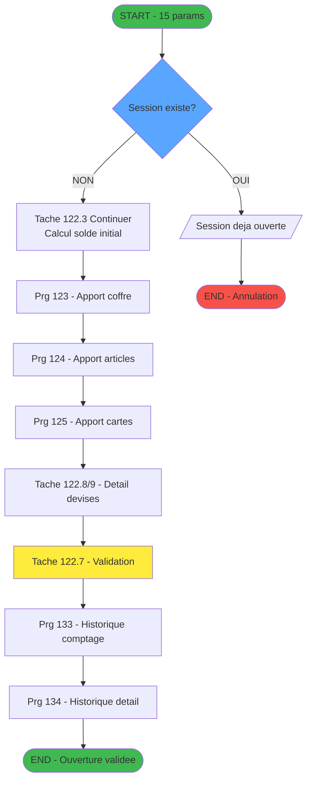
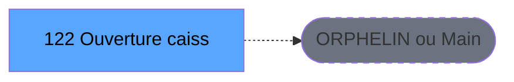
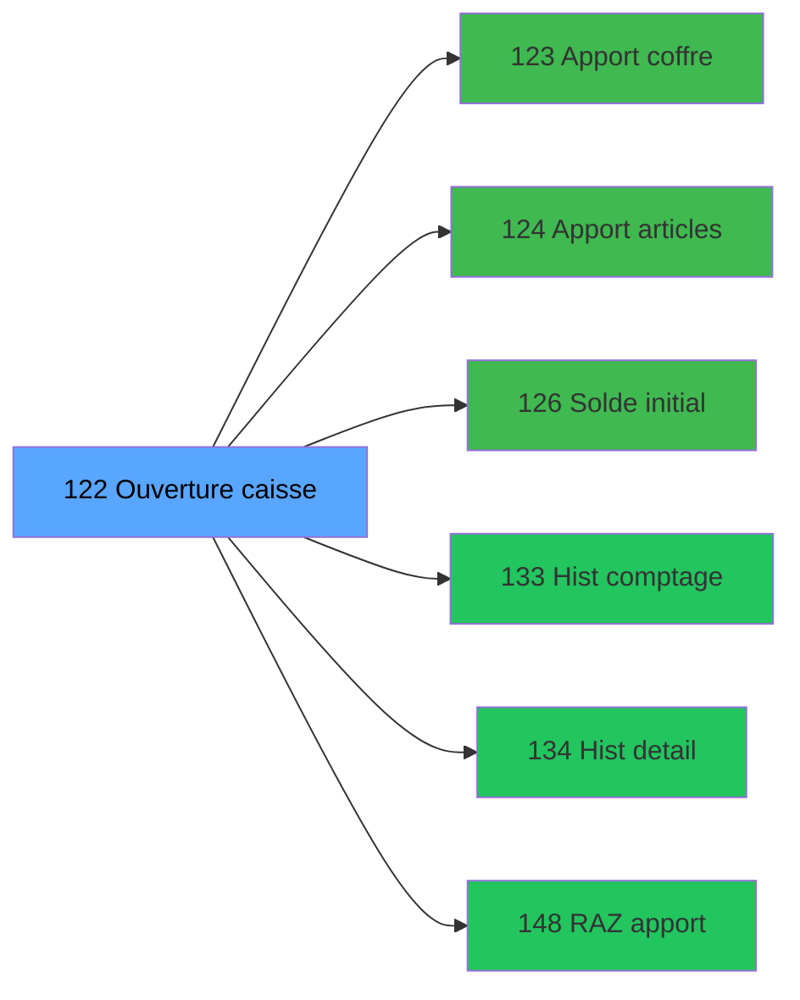

# ADH IDE 122 - Ouverture caisse

> **Version spec**: 4.1
> **Analyse**: 2026-02-07 (enrichie)
> **Source**: `D:\Data\Migration\XPA\PMS\ADH\Source\Prg_122.xml`
> **Methode**: APEX + PDCA + Enrichissement metier manuel

---

<!-- TAB:Fonctionnel -->

## SPECIFICATION FONCTIONNELLE

### 1.1 Objectif metier

**Ouverture caisse** est le **gestionnaire d'ouverture de session caisse** qui **initialise une nouvelle session de caisse pour un terminal donne**.

| Element | Description |
|---------|-------------|
| **Qui** | Caissier ou responsable caisse du village Club Med |
| **Quoi** | Ouverture d'une nouvelle session de caisse avec comptage du fonds de caisse |
| **Pourquoi** | Permettre le demarrage des operations de caisse en declarant les soldes initiaux (especes, monnaie, produits, cartes, cheques) |
| **Declencheur** | Debut de journee/shift ou changement de caissier |
| **Resultat** | Session caisse creee avec soldes initiaux enregistres, prete pour les transactions |

**Objectif metier** : Garantir la tracabilite comptable en enregistrant l'etat initial de la caisse avant toute transaction. Le processus impose un comptage systematique des fonds presents (especes en devises, monnaie, produits, cartes prepayees, cheques, operations diverses).

### 1.2 Workflow d'ouverture

**Etapes du processus** :

1. **Verification session existante** - Controle qu'aucune session n'est deja ouverte sur ce terminal
2. **Calcul du solde initial** (Flag=0) - Recuperation des soldes de la session precedente
3. **Saisie apports coffre** (Flag=1) - Declaration des apports depuis le coffre principal
4. **Saisie apports articles** (Flag=2) - Declaration des stocks articles en caisse
5. **Saisie apports cartes** (Flag=3) - Declaration des cartes prepayees en stock
6. **Saisie apports cheques** (Flag=4) - Declaration des cheques en attente
7. **Saisie autres devises** (Flag=5) - Comptage des devises etrangeres
8. **Validation finale** - Confirmation et enregistrement de l'ouverture

### 1.3 Regles metier

| Code | Regle | Condition |
|------|-------|-----------|
| RM-001 | Une seule session active par terminal | Verification via table sessions_ouvertes |
| RM-002 | Comptage obligatoire des especes | Avant validation finale |
| RM-003 | Coherence des montants par devise | Verifier concordance avec session precedente |
| RM-004 | Enregistrement historique comptage | Appel programme 133 pour audit trail |
| RM-005 | Historisation detail session | Types I (Initial), A (Apport coffre), E (Apport articles) |

### 1.4 Flux utilisateur

```
[Debut] --> [Verifier session existante]
               |
               v
         <Session ouverte?>
          /           \
        OUI           NON
         |             |
   [Erreur: Session   [Calculer solde initial]
    deja ouverte]           |
                            v
                    [Saisie apports coffre]
                            |
                            v
                    [Saisie apports articles]
                            |
                            v
                    [Saisie apports cartes]
                            |
                            v
                    [Detail devises]
                            |
                            v
                    [Validation finale]
                            |
                            v
                    [Historique comptage]
                            |
                            v
                    [Historique detail session]
                            |
                           [Fin]
```

### 1.5 Cas d'erreur

| Erreur | Message | Comportement |
|--------|---------|--------------|
| Session deja ouverte | "Une session de caisse est deja ouverte pour ce numero de terminal" | Abandon ouverture |
| Session village non ouverte | Verification P.Session VIL ouverte | Blocage si False |
| Coffre 2 non ouvert | Verification Param coffre 2 est ouvert | Selon configuration |
| Annulation utilisateur | ESC/Abandon | Rollback des saisies |

---

<!-- TAB:Technique -->

## SPECIFICATION TECHNIQUE

### 2.1 Identification

| Attribut | Valeur |
|----------|--------|
| **IDE Position** | 122 |
| **Fichier XML** | `Prg_122.xml` |
| **Description** | Ouverture caisse |
| **Module** | ADH |
| **Public Name** | - |
| **Nombre taches** | 9 (principal + 8 sous-taches) |
| **Lignes logique** | ~500 |
| **Expressions** | 63+ expressions |

### 2.2 Tables

| # | Nom logique | Nom physique | Acces | Usage |
|---|-------------|--------------|-------|-------|
| 67 | tables___________tab | cafil045_dat | READ | Parametrage tables filiales |
| 232 | gestion_devise_session | caisse_devise | LINK/READ | Gestion devises par session |
| 693 | devise_in | devisein_par | READ | Configuration devises acceptees |

**Resume**: 3 tables accedees en lecture pour parametrage et configuration devises

### 2.3 Parametres d'entree (15 parametres)

| Var | Nom | Type | Picture | Description |
|-----|-----|------|---------|-------------|
| A | Param societe | Alpha | U | Code societe |
| B | Param devise locale | Alpha | U3 | Code devise (EUR, USD...) |
| C | Param Nbre decimales | Numeric | 1 | Precision decimale |
| D | Param masque montant | Alpha | 16 | Format affichage montants |
| E | Param code village | Alpha | 3 | Code village Club Med |
| F | Param nom village | Alpha | U30 | Nom complet village |
| G | Param masque cumul | Alpha | 18 | Format cumuls |
| H | Param Uni/Bi | Alpha | U | Mode devise |
| I | Param village TAI | Alpha | U | Village TAI (Oui/Non) |
| J | Param date comptable | Date | - | Date comptable session |
| K | Param ouverture validee | Logical | - | Flag validation (retour) |
| L | Param chrono session | Numeric | 12 | Numero chronologique session |
| M | p.i.Host courant coffre 2 ? | Logical | - | Coffre secondaire actif |
| N | Param coffre 2 est ouvert | Logical | - | Etat coffre 2 |
| O | P.Session VIL ouverte ? | Logical | - | Session village ouverte |

### 2.4 Variables internes cles

| Var | Nom | Type | Description |
|-----|-----|------|-------------|
| R | Montant solde initial | Numeric | Total especes initial |
| S | Montant solde initial monnaie | Numeric | Monnaie compte |
| T | Montant solde initial produits | Numeric | Valeur stock produits |
| U | Montant solde initial cartes | Numeric | Valeur cartes prepayees |
| V | Montant solde initial cheques | Numeric | Total cheques |
| W | Montant solde initial od | Numeric | Operations diverses |
| X | Nbre devise initial | Numeric | Nombre de devises comptees |
| Y | Montant apport coffre | Numeric | Apport depuis coffre |
| Z | Flag avancement | Numeric | Etape courante (0-5) |
| AA | Action | Numeric | Code action utilisateur |

### 2.5 Algorigramme



### 2.6 Sous-taches

| ISN | Nom | Description |
|-----|-----|-------------|
| 122.1 | Ouverture caisse | Tache principale - initialisation parametres |
| 122.2 | Ouverture caisse | Interface utilisateur principale |
| 122.3 | Continuer | Gestion progression etapes (flags 0-5) |
| 122.4 | Maj devises comptees | Mise a jour comptage multi-devises |
| 122.5 | Raz | Remise a zero des compteurs |
| 122.6 | Generation ticket | Impression ticket ouverture |
| 122.7 | Validation | Validation finale et historisation |
| 122.8 | Detail devises | Liste des devises (vue) |
| 122.9 | Detail devises | Sous-tache detail devise (ligne) |

### 2.7 Programmes appeles (Callees niveau 1)

| IDE | Programme | Description | Condition |
|-----|-----------|-------------|-----------|
| 123 | Apport coffre | Saisie apports depuis coffre | Flag = 1 |
| 124 | Apport articles | Saisie stock articles | Flag = 2 |
| 125 | Apport cartes | Saisie cartes prepayees | Flag = 3 (implicite) |
| 126 | Calcul solde initial | Recuperation soldes precedents | Flag = 0 |
| 133 | Historique comptage | Enregistrement audit trail | Validation |
| 134 | Historique detail | Types I/A/E par mouvement | Validation |
| 148 | RAZ apport | Reinitialisation appro | Condition apport |

### 2.8 Statistiques

| Metrique | Valeur |
|----------|--------|
| **Taches** | 9 |
| **Lignes logique** | ~500 |
| **Expressions** | 63+ |
| **Parametres** | 15 |
| **Tables accedees** | 3 |
| **Tables en ecriture** | Via sous-programmes |
| **Callees niveau 1** | 7 programmes |

---

<!-- TAB:Cartographie -->

## CARTOGRAPHIE APPLICATIVE

### 3.1 Chaine d'appels depuis Main



### 3.2 Callers directs

| IDE | Programme | Nb appels |
|-----|-----------|-----------|
| - | ORPHELIN ou Main direct | - |

### 3.3 Callees (3 niveaux)



| Niv | IDE | Programme | Nb appels | Status |
|-----|-----|-----------|-----------|--------|
| 1 | 123 | Apport coffre | 1 | ACTIF |
| 1 | 124 | Apport articles | 1 | ACTIF |
| 1 | 126 | Calcul solde initial | 1 | ACTIF |
| 1 | 133 | Historique comptage | 1 | ACTIF |
| 1 | 134 | Historique detail session | 3 | ACTIF (types I/A/E) |
| 1 | 148 | RAZ apport | 1 | ACTIF |

**Impact downstream** : 6 programmes directement impactes par une modification de 122

### 3.4 Composants ECF utilises

| ECF | IDE | Public Name | Description |
|-----|-----|-------------|-------------|
| - | - | Aucun composant ECF | - |

### 3.5 Verification orphelin

| Critere | Resultat |
|---------|----------|
| Callers actifs | 0 programmes |
| PublicName | Non defini |
| ECF partage | NON |
| **Conclusion** | **ORPHELIN** - Pas de callers actifs |

---

## 5. REGLES METIER DETAILLEES

### 5.1 Pre-conditions d'ouverture

| Code | Regle | Expression | Action si echec |
|------|-------|------------|-----------------|
| PRE-001 | Session village ouverte | `P.Session VIL ouverte = TRUE` | Blocage ouverture |
| PRE-002 | Aucune session active sur terminal | Verif table sessions_ouvertes | Message erreur + abandon |
| PRE-003 | Date comptable valide | `Param date comptable <> 0` | Demande saisie |
| PRE-004 | Coffre 2 (si actif) | `Host coffre 2 => Coffre 2 ouvert` | Avertissement |

### 5.2 Validations de saisie

| Etape | Champ | Validation | Message |
|-------|-------|------------|---------|
| Solde initial | Montant especes | >= 0 | Montant negatif non autorise |
| Solde initial | Monnaie | >= 0 | Montant negatif non autorise |
| Apport coffre | Montant | >= 0, coherent avec coffre | Verification disponibilite |
| Apport articles | Quantite | >= 0, existe en stock | Stock insuffisant |
| Devises | Taux change | Parametrage devise | Devise non configuree |

### 5.3 Regles de calcul

| Calcul | Formule | Description |
|--------|---------|-------------|
| Total solde initial | `Especes + Monnaie + Produits + Cartes + Cheques + OD` | Somme tous les compartiments |
| Verification coherence | `Solde session N = Cloture session N-1` | Continuite comptable |
| Nombre devises | Count(devises avec montant > 0) | Devises comptees |

### 5.4 Historisation (Audit Trail)

| Type | Code | Description | Table destination |
|------|------|-------------|-------------------|
| Solde Initial | I | Etat initial caisse | Historique detail session |
| Apport Coffre | A | Transfert depuis coffre | Historique detail session |
| Apport Articles | E | Stock articles initial | Historique detail session |
| Comptage | - | Resume comptage global | Historique comptage |

### 5.5 Etats de transition

```
[NON_OUVERT] --ouverture--> [EN_COURS_SAISIE]
[EN_COURS_SAISIE] --validation--> [OUVERT]
[EN_COURS_SAISIE] --annulation--> [NON_OUVERT]
[OUVERT] --cloture--> [CLOTURE]
```

| Etat | Flag | Description |
|------|------|-------------|
| NON_OUVERT | - | Aucune session |
| EN_COURS_SAISIE | 0-5 | Etapes de saisie |
| OUVERT | - | Session active |
| CLOTURE | - | Session fermee |

### 5.6 Contraintes d'integrite

| Contrainte | Description | Niveau |
|------------|-------------|--------|
| Unicite session | 1 session active max par terminal | CRITIQUE |
| Sequence chrono | Numero session incrementale | IMPORTANT |
| Coherence devises | Devises declarees = parametrage village | IMPORTANT |
| Tracabilite | Historique obligatoire avant validation | CRITIQUE |

---

## NOTES MIGRATION

### Complexite

| Critere | Score | Detail |
|---------|-------|--------|
| Taches | 9 | Complexite moyenne |
| Tables | 3 | Lecture seule (ecriture via sous-progs) |
| Callees | 7 | Couplage fort avec sous-programmes |
| Parametres | 15 | Interface riche |
| **Score global** | **HAUTE** | Multi-etapes, multi-devises, audit |

### Points d'attention migration

| Point | Solution moderne |
|-------|-----------------|
| Flag avancement (0-5) | State machine / Redux pattern |
| Multi-devises | Currency service avec taux temps reel |
| Historisation | Event sourcing / Audit log table |
| Formulaires multi-etapes | Wizard component / Stepper |
| Validation temps reel | Form validation library (Zod/Yup) |
| Impression ticket | PDF generation service |

---

## HISTORIQUE

| Date | Action | Auteur |
|------|--------|--------|
| 2026-01-27 23:05 | **V4.0 APEX/PDCA** - Generation automatique complete | Script |
| 2026-02-07 | **V4.1** - Enrichissement metier: workflow ouverture, regles metier, callees, parametres | Claude |

---

*Specification V4.1 - Enrichie avec descriptions metier detaillees*

