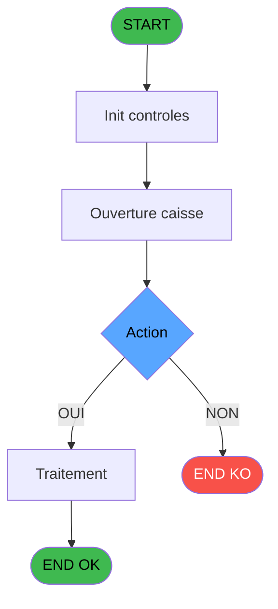
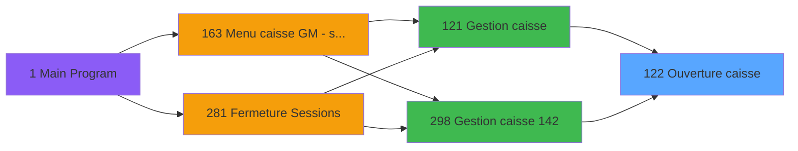
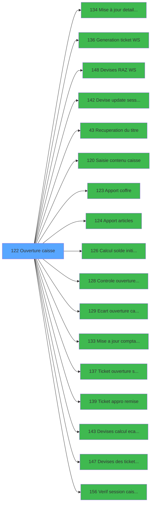

# ADH IDE 122 - Ouverture caisse

> **Analyse**: Phases 1-4 2026-02-08 03:03 -> 03:03 (4s) | Assemblage 03:03
> **Pipeline**: V7.2 Enrichi
> **Structure**: 4 onglets (Resume | Ecrans | Donnees | Connexions)

<!-- TAB:Resume -->

## 1. FICHE D'IDENTITE

| Attribut | Valeur |
|----------|--------|
| Projet | ADH |
| IDE Position | 122 |
| Nom Programme | Ouverture caisse |
| Fichier source | `Prg_122.xml` |
| Dossier IDE | Caisse |
| Taches | 9 (0 ecrans visibles) |
| Tables modifiees | 0 |
| Programmes appeles | 17 |
| Complexite | **BASSE** (score 22/100) |

## 2. DESCRIPTION FONCTIONNELLE

**ADH IDE 122 orchestre l'ouverture complète d'une session de caisse, servant de point d'entrée principal du flux opérationnel.** Le programme initialise une nouvelle session en validant qu'aucune ouverture ne soit déjà active, puis déclenche en cascade une série de 16 sous-programmes spécialisés couvrant tous les aspects du démarrage : mise à jour des sessions, régénération des tickets, réinitialisation des devises, saisie du contenu initial du coffre, calcul du solde de départ, et génération des documents d'ouverture.

**La logique centrale valide l'intégrité de la session via trois vérifications clés** : existence d'une session antérieure, vérification qu'aucune session n'est déjà ouverte, et contrôle de cohérence via le programme Vérif session caisse ouverte (IDE 156). Ces contrôles préviennent les doubles-ouvertures et les incohérences d'état avant de progresser vers le comptage physique des fonds disponibles dans le coffre.

**Le programme finalise l'ouverture en générant un ticket détaillé (IDE 137) et en mettant à jour la comptabilité des stocks d'articles (IDE 124) et des devises (IDE 143, 147),** créant ainsi un état de départ complet et auditable. L'architecture distribuée sur 16 micro-programmes reflète la séparation des responsabilités du système : chaque tâche métier (devises, articles, tickets) possède son propre gestionnaire WebService, permettant une maintenance modulaire et des évolutions indépendantes du flux global.

## 3. BLOCS FONCTIONNELS

## 5. REGLES METIER

2 regles identifiees:

### Autres (2 regles)

#### [RM-001] Condition: Action [Q] egale 0

| Element | Detail |
|---------|--------|
| **Condition** | `Action [Q]=0` |
| **Si vrai** | Action si vrai |
| **Variables** | FD (Action) |
| **Expression source** | Expression 1 : `Action [Q]=0` |
| **Exemple** | Si Action [Q]=0 → Action si vrai |

#### [RM-002] Condition: Montant apport coffre [Z]<>0 OR Montant apport produits [BA]<>0 OR Nbre devise apport [BB] different de 0

| Element | Detail |
|---------|--------|
| **Condition** | `Montant apport coffre [Z]<>0 OR Montant apport produits [BA]<>0 OR Nbre devise apport [BB]<>0` |
| **Si vrai** | Action si vrai |
| **Variables** | FM (Montant apport coffre), FN (Montant apport produits), FO (Nbre devise apport) |
| **Expression source** | Expression 8 : `Montant apport coffre [Z]<>0 OR Montant apport produits [BA]` |
| **Exemple** | Si Montant apport coffre [Z]<>0 OR Montant apport produits [BA]<>0 OR Nbre devise apport [BB]<>0 → Action si vrai |

## 6. CONTEXTE

- **Appele par**: [Gestion caisse (IDE 121)](ADH-IDE-121.md), [Gestion caisse 142 (IDE 298)](ADH-IDE-298.md)
- **Appelle**: 17 programmes | **Tables**: 3 (W:0 R:3 L:1) | **Taches**: 9 | **Expressions**: 8

<!-- TAB:Ecrans -->

## 8. ECRANS

*(Programme sans ecran visible)*

## 9. NAVIGATION

### 9.3 Structure hierarchique (0 tache)

| Position | Tache | Type | Dimensions | Bloc |
|----------|-------|------|------------|------|

### 9.4 Algorigramme

> **Legende**: Vert = START/END OK | Rouge = END KO | Bleu = Decisions
> *Algorigramme auto-genere. Utiliser `/algorigramme` pour une synthese metier detaillee.*

<!-- TAB:Donnees -->

## 10. TABLES

### Tables utilisees (3)

| ID | Nom | Description | Type | R | W | L | Usages |
|----|-----|-------------|------|---|---|---|--------|
| 232 | gestion_devise_session | Sessions de caisse | DB | R |   | L | 2 |
| 693 | devise_in | Devises / taux de change | DB | R |   |   | 1 |
| 67 | tables___________tab |  | DB | R |   |   | 1 |

### Colonnes par table (2 / 3 tables avec colonnes identifiees)

Table 232 - gestion_devise_session (R/L) - 2 usages

| Lettre | Variable | Acces | Type |
|--------|----------|-------|------|
| EO | Param devise locale | R | Alpha |
| FO | Nbre devise apport | R | Numeric |
| FV | Nbre devise comptee | R | Numeric |
| GC | Nbre devise calcule | R | Numeric |
| GJ | Nbre devise ecart | R | Numeric |
| GL | Commentaire ecart devise | R | Alpha |
| GM | Existe ecart devise | R | Logical |
| EY | Param chrono session | R | Numeric |
| FB | P.Session VIL ouverte ? | R | Logical |
| FL | Nbre devise initial | R | Numeric |

Table 693 - devise_in (R) - 1 usages

| Lettre | Variable | Acces | Type |
|--------|----------|-------|------|
| EO | Param devise locale | R | Alpha |
| FO | Nbre devise apport | R | Numeric |
| FV | Nbre devise comptee | R | Numeric |
| GC | Nbre devise calcule | R | Numeric |
| GJ | Nbre devise ecart | R | Numeric |
| GL | Commentaire ecart devise | R | Alpha |
| GM | Existe ecart devise | R | Logical |
| FL | Nbre devise initial | R | Numeric |

Table 67 - tables___________tab (R) - 1 usages

*Table utilisee uniquement en Link ou aucune colonne Real identifiee dans le DataView.*

## 11. VARIABLES

### 11.1 Parametres entrants (2)

Variables recues du programme appelant ([Gestion caisse (IDE 121)](ADH-IDE-121.md)).

| Lettre | Nom | Type | Usage dans |
|--------|-----|------|-----------|
| EZ | p.i.Host courant coffre 2 ? | Logical | - |
| FB | P.Session VIL ouverte ? | Logical | - |

### 11.2 Autres (55)

Variables diverses.

| Lettre | Nom | Type | Usage dans |
|--------|-----|------|-----------|
| EN | Param societe | Alpha | - |
| EO | Param devise locale | Alpha | - |
| EP | Param Nbre decimales | Numeric | - |
| EQ | Param masque montant | Alpha | - |
| ER | Param code village | Alpha | - |
| ES | Param nom village | Alpha | - |
| ET | Param masque cumul | Alpha | - |
| EU | Param Uni/Bi | Alpha | - |
| EV | Param village TAI | Alpha | - |
| EW | Param date comptable | Date | - |
| EX | Param ouverture validee | Logical | - |
| EY | Param chrono session | Numeric | - |
| FA | Param coffre 2 est ouvert | Logical | - |
| FC | Fin | Logical | 1x refs |
| FD | Action | Numeric | 1x refs |
| FE | Flag avancement | Numeric | - |
| FF | Montant solde initial | Numeric | - |
| FG | Montant solde initial monnaie | Numeric | - |
| FH | Montant solde initial produits | Numeric | - |
| FI | Montant solde initial cartes | Numeric | - |
| FJ | Montant solde initial cheques | Numeric | - |
| FK | Montant solde initial od | Numeric | - |
| FL | Nbre devise initial | Numeric | - |
| FM | Montant apport coffre | Numeric | 1x refs |
| FN | Montant apport produits | Numeric | 1x refs |
| FO | Nbre devise apport | Numeric | 1x refs |
| FP | Montant caisse comptee | Numeric | - |
| FQ | Montant caisse comptee monnaie | Numeric | - |
| FR | Montant caisse comptee produits | Numeric | - |
| FS | Montant caisse comptee cartes | Numeric | - |
| FT | Montant caisse comptee cheques | Numeric | - |
| FU | Montant caisse comptee od | Numeric | - |
| FV | Nbre devise comptee | Numeric | - |
| FW | Montant caisse calcule | Numeric | - |
| FX | Montant caisse calcule monnaie | Numeric | - |
| FY | Montant caisse calcule produits | Numeric | - |
| FZ | Montant caisse calcule cartes | Numeric | - |
| GA | Montant caisse calcule cheques | Numeric | - |
| GB | Montant caisse calcule od | Numeric | - |
| GC | Nbre devise calcule | Numeric | - |
| GD | Montant ecart | Numeric | - |
| GE | Montant ecart monnaie | Numeric | - |
| GF | Montant ecart produits | Numeric | - |
| GG | Montant ecart cartes | Numeric | - |
| GH | Montant ecart cheques | Numeric | - |
| GI | Montant ecart od | Numeric | - |
| GJ | Nbre devise ecart | Numeric | - |
| GK | Commentaire ecart | Alpha | - |
| GL | Commentaire ecart devise | Alpha | - |
| GM | Existe ecart devise | Logical | - |
| GN | Validation comptage chrono his | Numeric | - |
| GO | Validation comptage date | Date | - |
| GP | Validation comptage time | Time | - |
| GQ | Edition ticket appro | Logical | 1x refs |
| GR | Edition ticket | Logical | 2x refs |

Toutes les 57 variables (liste complete)

| Cat | Lettre | Nom Variable | Type |
|-----|--------|--------------|------|
| P0 | **EZ** | p.i.Host courant coffre 2 ? | Logical |
| P0 | **FB** | P.Session VIL ouverte ? | Logical |
| Autre | **EN** | Param societe | Alpha |
| Autre | **EO** | Param devise locale | Alpha |
| Autre | **EP** | Param Nbre decimales | Numeric |
| Autre | **EQ** | Param masque montant | Alpha |
| Autre | **ER** | Param code village | Alpha |
| Autre | **ES** | Param nom village | Alpha |
| Autre | **ET** | Param masque cumul | Alpha |
| Autre | **EU** | Param Uni/Bi | Alpha |
| Autre | **EV** | Param village TAI | Alpha |
| Autre | **EW** | Param date comptable | Date |
| Autre | **EX** | Param ouverture validee | Logical |
| Autre | **EY** | Param chrono session | Numeric |
| Autre | **FA** | Param coffre 2 est ouvert | Logical |
| Autre | **FC** | Fin | Logical |
| Autre | **FD** | Action | Numeric |
| Autre | **FE** | Flag avancement | Numeric |
| Autre | **FF** | Montant solde initial | Numeric |
| Autre | **FG** | Montant solde initial monnaie | Numeric |
| Autre | **FH** | Montant solde initial produits | Numeric |
| Autre | **FI** | Montant solde initial cartes | Numeric |
| Autre | **FJ** | Montant solde initial cheques | Numeric |
| Autre | **FK** | Montant solde initial od | Numeric |
| Autre | **FL** | Nbre devise initial | Numeric |
| Autre | **FM** | Montant apport coffre | Numeric |
| Autre | **FN** | Montant apport produits | Numeric |
| Autre | **FO** | Nbre devise apport | Numeric |
| Autre | **FP** | Montant caisse comptee | Numeric |
| Autre | **FQ** | Montant caisse comptee monnaie | Numeric |
| Autre | **FR** | Montant caisse comptee produits | Numeric |
| Autre | **FS** | Montant caisse comptee cartes | Numeric |
| Autre | **FT** | Montant caisse comptee cheques | Numeric |
| Autre | **FU** | Montant caisse comptee od | Numeric |
| Autre | **FV** | Nbre devise comptee | Numeric |
| Autre | **FW** | Montant caisse calcule | Numeric |
| Autre | **FX** | Montant caisse calcule monnaie | Numeric |
| Autre | **FY** | Montant caisse calcule produits | Numeric |
| Autre | **FZ** | Montant caisse calcule cartes | Numeric |
| Autre | **GA** | Montant caisse calcule cheques | Numeric |
| Autre | **GB** | Montant caisse calcule od | Numeric |
| Autre | **GC** | Nbre devise calcule | Numeric |
| Autre | **GD** | Montant ecart | Numeric |
| Autre | **GE** | Montant ecart monnaie | Numeric |
| Autre | **GF** | Montant ecart produits | Numeric |
| Autre | **GG** | Montant ecart cartes | Numeric |
| Autre | **GH** | Montant ecart cheques | Numeric |
| Autre | **GI** | Montant ecart od | Numeric |
| Autre | **GJ** | Nbre devise ecart | Numeric |
| Autre | **GK** | Commentaire ecart | Alpha |
| Autre | **GL** | Commentaire ecart devise | Alpha |
| Autre | **GM** | Existe ecart devise | Logical |
| Autre | **GN** | Validation comptage chrono his | Numeric |
| Autre | **GO** | Validation comptage date | Date |
| Autre | **GP** | Validation comptage time | Time |
| Autre | **GQ** | Edition ticket appro | Logical |
| Autre | **GR** | Edition ticket | Logical |

## 12. EXPRESSIONS

**8 / 8 expressions decodees (100%)**

### 12.1 Repartition par type

| Type | Expressions | Regles |
|------|-------------|--------|
| CONDITION | 2 | 2 |
| CONSTANTE | 2 | 0 |
| OTHER | 3 | 0 |
| CAST_LOGIQUE | 1 | 0 |

### 12.2 Expressions cles par type

#### CONDITION (2 expressions)

| Type | IDE | Expression | Regle |
|------|-----|------------|-------|
| CONDITION | 8 | `Montant apport coffre [Z]<>0 OR Montant apport produits [BA]<>0 OR Nbre devise apport [BB]<>0` | [RM-002](#rm-RM-002) |
| CONDITION | 1 | `Action [Q]=0` | [RM-001](#rm-RM-001) |

#### CONSTANTE (2 expressions)

| Type | IDE | Expression | Regle |
|------|-----|------------|-------|
| CONSTANTE | 7 | `'O'` | - |
| CONSTANTE | 3 | `0` | - |

#### OTHER (3 expressions)

| Type | IDE | Expression | Regle |
|------|-----|------------|-------|
| OTHER | 6 | `Edition ticket [CE]` | - |
| OTHER | 5 | `Edition ticket appro [CD]` | - |
| OTHER | 2 | `Fin [P]` | - |

#### CAST_LOGIQUE (1 expressions)

| Type | IDE | Expression | Regle |
|------|-----|------------|-------|
| CAST_LOGIQUE | 4 | `'FALSE'LOG` | - |

<!-- TAB:Connexions -->

## 13. GRAPHE D'APPELS

### 13.1 Chaine depuis Main (Callers)

Main -> ... -> [Gestion caisse (IDE 121)](ADH-IDE-121.md) -> **Ouverture caisse (IDE 122)**

Main -> ... -> [Gestion caisse 142 (IDE 298)](ADH-IDE-298.md) -> **Ouverture caisse (IDE 122)**

### 13.2 Callers

| IDE | Nom Programme | Nb Appels |
|-----|---------------|-----------|
| [121](ADH-IDE-121.md) | Gestion caisse | 2 |
| [298](ADH-IDE-298.md) | Gestion caisse 142 | 2 |

### 13.3 Callees (programmes appeles)

### 13.4 Detail Callees avec contexte

| IDE | Nom Programme | Appels | Contexte |
|-----|---------------|--------|----------|
| [134](ADH-IDE-134.md) | Mise à jour detail session WS | 7 | Mise a jour donnees |
| [136](ADH-IDE-136.md) | Generation ticket WS | 7 | Impression ticket/document |
| [148](ADH-IDE-148.md) | Devises RAZ WS | 3 | Reinitialisation |
| [142](ADH-IDE-142.md) | Devise update session WS | 2 | Mise a jour donnees |
| [43](ADH-IDE-43.md) | Recuperation du titre | 1 | Recuperation donnees |
| [120](ADH-IDE-120.md) | Saisie contenu caisse | 1 | Sous-programme |
| [123](ADH-IDE-123.md) | Apport coffre | 1 | Approvisionnement |
| [124](ADH-IDE-124.md) | Apport articles | 1 | Approvisionnement |
| [126](ADH-IDE-126.md) | Calcul solde initial WS | 1 | Calcul de donnees |
| [128](ADH-IDE-128.md) | Controle ouverture caisse WS | 1 | Controle/validation |
| [129](ADH-IDE-129.md) | Ecart ouverture caisse | 1 | Ouverture session |
| [133](ADH-IDE-133.md) | Mise a jour comptage caisse WS | 1 | Mise a jour donnees |
| [137](ADH-IDE-137.md) | Ticket ouverture session | 1 | Impression ticket/document |
| [139](ADH-IDE-139.md) | Ticket appro remise | 1 | Impression ticket/document |
| [143](ADH-IDE-143.md) | Devises calcul ecart WS | 1 | Calcul de donnees |
| [147](ADH-IDE-147.md) | Devises des tickets WS | 1 | Impression ticket/document |
| [156](ADH-IDE-156.md) | Verif session caisse ouverte2 | 1 | Controle/validation |

## 14. RECOMMANDATIONS MIGRATION

### 14.1 Profil du programme

| Metrique | Valeur | Impact migration |
|----------|--------|-----------------|
| Lignes de logique | 336 | Taille moyenne |
| Expressions | 8 | Peu de logique |
| Tables WRITE | 0 | Impact faible |
| Sous-programmes | 17 | Forte dependance |
| Ecrans visibles | 0 | Ecran unique ou traitement batch |
| Code desactive | 0% (0 / 336) | Code sain |
| Regles metier | 2 | Quelques regles a preserver |

### 14.2 Plan de migration par bloc

### 14.3 Dependances critiques

| Dependance | Type | Appels | Impact |
|------------|------|--------|--------|
| [Generation ticket WS (IDE 136)](ADH-IDE-136.md) | Sous-programme | 7x | **CRITIQUE** - Impression ticket/document |
| [Mise à jour detail session WS (IDE 134)](ADH-IDE-134.md) | Sous-programme | 7x | **CRITIQUE** - Mise a jour donnees |
| [Devises RAZ WS (IDE 148)](ADH-IDE-148.md) | Sous-programme | 3x | **CRITIQUE** - Reinitialisation |
| [Devise update session WS (IDE 142)](ADH-IDE-142.md) | Sous-programme | 2x | Haute - Mise a jour donnees |
| [Ticket appro remise (IDE 139)](ADH-IDE-139.md) | Sous-programme | 1x | Normale - Impression ticket/document |
| [Ticket ouverture session (IDE 137)](ADH-IDE-137.md) | Sous-programme | 1x | Normale - Impression ticket/document |
| [Mise a jour comptage caisse WS (IDE 133)](ADH-IDE-133.md) | Sous-programme | 1x | Normale - Mise a jour donnees |
| [Verif session caisse ouverte2 (IDE 156)](ADH-IDE-156.md) | Sous-programme | 1x | Normale - Controle/validation |
| [Devises des tickets WS (IDE 147)](ADH-IDE-147.md) | Sous-programme | 1x | Normale - Impression ticket/document |
| [Devises calcul ecart WS (IDE 143)](ADH-IDE-143.md) | Sous-programme | 1x | Normale - Calcul de donnees |

---
*Spec DETAILED generee par Pipeline V7.2 - 2026-02-08 03:03*
