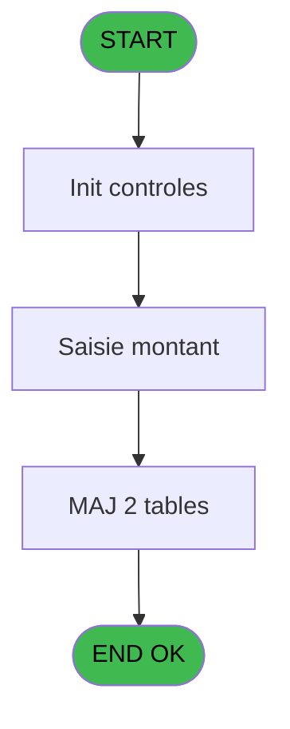
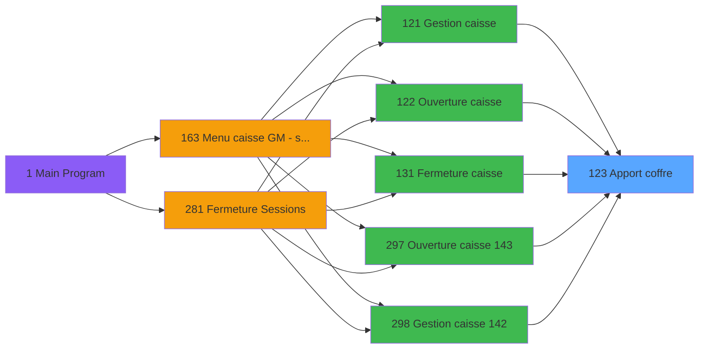
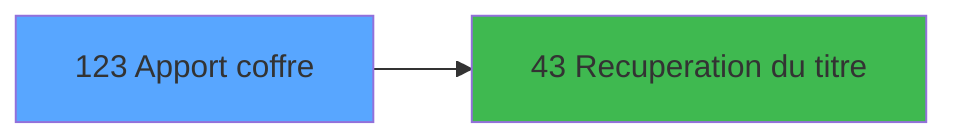

# ADH IDE 123 - Apport coffre

> **Analyse**: Phases 1-4 2026-02-08 03:03 -> 03:03 (4s) | Assemblage 03:03
> **Pipeline**: V7.2 Enrichi
> **Structure**: 4 onglets (Resume | Ecrans | Donnees | Connexions)

<!-- TAB:Resume -->

## 1. FICHE D'IDENTITE

| Attribut | Valeur |
|----------|--------|
| Projet | ADH |
| IDE Position | 123 |
| Nom Programme | Apport coffre |
| Fichier source | `Prg_123.xml` |
| Dossier IDE | Caisse |
| Taches | 15 (0 ecrans visibles) |
| Tables modifiees | 2 |
| Programmes appeles | 1 |
| Complexite | **BASSE** (score 19/100) |

## 2. DESCRIPTION FONCTIONNELLE

ADH IDE 123 - Apport coffre est un programme de gestion des approvisionnements en devises et numéraire dans la session de caisse. Il intervient à plusieurs moments clés : lors de l'ouverture de caisse (IDE 122), en cours de gestion (IDE 121), et à la fermeture (IDE 131). Ce programme centralise la saisie des apports de fonds au coffre-fort, permettant de suivre les mouvements de trésorerie en temps réel.

Le flux principal consiste à enregistrer chaque apport par devise (EUR, USD, etc.) avec les montants correspondants. Le programme récupère le titre de la devise via un appel à IDE 43, puis stocke les données dans deux tables clés : gestion_devise_session (suivi des devises par session) et saisie_approvisionnement (historique détaillé des approvisionnements). Cette structure permet de maintenir la cohérence entre les mouvements de caisse et les enregistrements d'approvisionnement.

L'importance de ce programme réside dans son rôle de pivot pour la validation des écarts de caisse. Les apports enregistrés ici servent de base de comparaison lors de la fermeture de caisse (IDE 131/144), où les montants théoriques (somme des mouvements + apports) sont confrontés aux montants réels comptés. Une traçabilité complète des approvisionnements garantit l'intégrité des clôtures comptables et facilite l'audit des opérations de caisse.

## 3. BLOCS FONCTIONNELS

## 5. REGLES METIER

4 regles identifiees:

### Autres (4 regles)

#### [RM-001] Condition: Param UNI/BI [F] different de 'B'

| Element | Detail |
|---------|--------|
| **Condition** | `Param UNI/BI [F]<>'B'` |
| **Si vrai** | Action si vrai |
| **Variables** | ES (Param UNI/BI) |
| **Expression source** | Expression 2 : `Param UNI/BI [F]<>'B'` |
| **Exemple** | Si Param UNI/BI [F]<>'B' → Action si vrai |

#### [RM-002] Condition: Param UNI/BI [F] egale 'B'

| Element | Detail |
|---------|--------|
| **Condition** | `Param UNI/BI [F]='B'` |
| **Si vrai** | Action si vrai |
| **Variables** | ES (Param UNI/BI) |
| **Expression source** | Expression 3 : `Param UNI/BI [F]='B'` |
| **Exemple** | Si Param UNI/BI [F]='B' → Action si vrai |

#### [RM-003] Negation de (Existe devise à la vente [J]) (condition inversee)

| Element | Detail |
|---------|--------|
| **Condition** | `NOT (Existe devise à la vente [J])` |
| **Si vrai** | Action si vrai |
| **Variables** | EW (Existe devise à la vente) |
| **Expression source** | Expression 4 : `NOT (Existe devise à la vente [J])` |
| **Exemple** | Si NOT (Existe devise à la vente [J]) → Action si vrai |

#### [RM-004] Negation de (Param coffre 2 ouvert [H]) AND NOT p.i.Host courant coffr... [I] (condition inversee)

| Element | Detail |
|---------|--------|
| **Condition** | `NOT (Param coffre 2 ouvert [H]) AND NOT p.i.Host courant coffr... [I]` |
| **Si vrai** | Action si vrai |
| **Variables** | EU (Param coffre 2 ouvert) |
| **Expression source** | Expression 6 : `NOT (Param coffre 2 ouvert [H]) AND NOT p.i.Host courant cof` |
| **Exemple** | Si NOT (Param coffre 2 ouvert [H]) AND NOT p.i.Host courant coffr... [I] → Action si vrai |

## 6. CONTEXTE

- **Appele par**: [Gestion caisse (IDE 121)](ADH-IDE-121.md), [Ouverture caisse (IDE 122)](ADH-IDE-122.md), [Fermeture caisse (IDE 131)](ADH-IDE-131.md), [Ouverture caisse 143 (IDE 297)](ADH-IDE-297.md), [Gestion caisse 142 (IDE 298)](ADH-IDE-298.md), [Fermeture caisse 144 (IDE 299)](ADH-IDE-299.md)
- **Appelle**: 1 programmes | **Tables**: 5 (W:2 R:3 L:2) | **Taches**: 15 | **Expressions**: 8

<!-- TAB:Ecrans -->

## 8. ECRANS

*(Programme sans ecran visible)*

## 9. NAVIGATION

### 9.3 Structure hierarchique (0 tache)

| Position | Tache | Type | Dimensions | Bloc |
|----------|-------|------|------------|------|

### 9.4 Algorigramme

> **Legende**: Vert = START/END OK | Rouge = END KO | Bleu = Decisions
> *Algorigramme auto-genere. Utiliser `/algorigramme` pour une synthese metier detaillee.*

<!-- TAB:Donnees -->

## 10. TABLES

### Tables utilisees (5)

| ID | Nom | Description | Type | R | W | L | Usages |
|----|-----|-------------|------|---|---|---|--------|
| 244 | saisie_approvisionnement | Comptage approvisionnement | DB | R | **W** | L | 5 |
| 232 | gestion_devise_session | Sessions de caisse | DB |   | **W** |   | 1 |
| 67 | tables___________tab |  | DB | R |   |   | 2 |
| 141 | devises__________dev | Devises / taux de change | DB | R |   |   | 2 |
| 215 | comptage_coffre_devise_histo | Etat du coffre | DB |   |   | L | 1 |

### Colonnes par table (3 / 4 tables avec colonnes identifiees)

Table 244 - saisie_approvisionnement (R/**W**/L) - 5 usages

*Table utilisee uniquement en Link ou aucune colonne Real identifiee dans le DataView.*

Table 232 - gestion_devise_session (**W**) - 1 usages

| Lettre | Variable | Acces | Type |
|--------|----------|-------|------|
| EO | Libelle devise | W | Alpha |
| EQ | Param devise locale | W | Alpha |
| ET | Param Nombre devises apport | W | Numeric |
| EW | Existe devise à la vente | W | Logical |

Table 67 - tables___________tab (R) - 2 usages

*Table utilisee uniquement en Link ou aucune colonne Real identifiee dans le DataView.*

Table 141 - devises__________dev (R) - 2 usages

| Lettre | Variable | Acces | Type |
|--------|----------|-------|------|
| A | v. hisuser | R | Unicode |
| B | v. hischronohisto | R | Numeric |

## 11. VARIABLES

### 11.1 Parametres entrants (1)

Variables recues du programme appelant ([Gestion caisse (IDE 121)](ADH-IDE-121.md)).

| Lettre | Nom | Type | Usage dans |
|--------|-----|------|-----------|
| EV | p.i.Host courant coffre 2 ? | Logical | - |

### 11.2 Autres (10)

Variables diverses.

| Lettre | Nom | Type | Usage dans |
|--------|-----|------|-----------|
| EN | Param societe | Alpha | - |
| EO | Param masque montant | Alpha | - |
| EP | Param Montant apport | Numeric | - |
| EQ | Param devise locale | Alpha | - |
| ER | Param quand | Alpha | - |
| ES | Param UNI/BI | Alpha | 2x refs |
| ET | Param Nombre devises apport | Numeric | - |
| EU | Param coffre 2 ouvert | Logical | 1x refs |
| EW | Existe devise à la vente | Logical | 2x refs |
| EX | Fin | Logical | 1x refs |

## 12. EXPRESSIONS

**8 / 8 expressions decodees (100%)**

### 12.1 Repartition par type

| Type | Expressions | Regles |
|------|-------------|--------|
| CONDITION | 2 | 2 |
| NEGATION | 2 | 2 |
| OTHER | 3 | 0 |
| CAST_LOGIQUE | 1 | 0 |

### 12.2 Expressions cles par type

#### CONDITION (2 expressions)

| Type | IDE | Expression | Regle |
|------|-----|------------|-------|
| CONDITION | 3 | `Param UNI/BI [F]='B'` | [RM-002](#rm-RM-002) |
| CONDITION | 2 | `Param UNI/BI [F]<>'B'` | [RM-001](#rm-RM-001) |

#### NEGATION (2 expressions)

| Type | IDE | Expression | Regle |
|------|-----|------------|-------|
| NEGATION | 6 | `NOT (Param coffre 2 ouvert [H]) AND NOT p.i.Host courant coffr... [I]` | [RM-004](#rm-RM-004) |
| NEGATION | 4 | `NOT (Existe devise à la vente [J])` | [RM-003](#rm-RM-003) |

#### OTHER (3 expressions)

| Type | IDE | Expression | Regle |
|------|-----|------------|-------|
| OTHER | 8 | `NOT(ExpCalc('6'EXP))` | - |
| OTHER | 5 | `Existe devise à la vente [J]` | - |
| OTHER | 1 | `Fin [K]` | - |

#### CAST_LOGIQUE (1 expressions)

| Type | IDE | Expression | Regle |
|------|-----|------------|-------|
| CAST_LOGIQUE | 7 | `'TRUE'LOG` | - |

<!-- TAB:Connexions -->

## 13. GRAPHE D'APPELS

### 13.1 Chaine depuis Main (Callers)

Main -> ... -> [Gestion caisse (IDE 121)](ADH-IDE-121.md) -> **Apport coffre (IDE 123)**

Main -> ... -> [Ouverture caisse (IDE 122)](ADH-IDE-122.md) -> **Apport coffre (IDE 123)**

Main -> ... -> [Fermeture caisse (IDE 131)](ADH-IDE-131.md) -> **Apport coffre (IDE 123)**

Main -> ... -> [Ouverture caisse 143 (IDE 297)](ADH-IDE-297.md) -> **Apport coffre (IDE 123)**

Main -> ... -> [Gestion caisse 142 (IDE 298)](ADH-IDE-298.md) -> **Apport coffre (IDE 123)**

Main -> ... -> [Fermeture caisse 144 (IDE 299)](ADH-IDE-299.md) -> **Apport coffre (IDE 123)**

### 13.2 Callers

| IDE | Nom Programme | Nb Appels |
|-----|---------------|-----------|
| [121](ADH-IDE-121.md) | Gestion caisse | 1 |
| [122](ADH-IDE-122.md) | Ouverture caisse | 1 |
| [131](ADH-IDE-131.md) | Fermeture caisse | 1 |
| [297](ADH-IDE-297.md) | Ouverture caisse 143 | 1 |
| [298](ADH-IDE-298.md) | Gestion caisse 142 | 1 |
| [299](ADH-IDE-299.md) | Fermeture caisse 144 | 1 |

### 13.3 Callees (programmes appeles)

### 13.4 Detail Callees avec contexte

| IDE | Nom Programme | Appels | Contexte |
|-----|---------------|--------|----------|
| [43](ADH-IDE-43.md) | Recuperation du titre | 2 | Recuperation donnees |

## 14. RECOMMANDATIONS MIGRATION

### 14.1 Profil du programme

| Metrique | Valeur | Impact migration |
|----------|--------|-----------------|
| Lignes de logique | 166 | Programme compact |
| Expressions | 8 | Peu de logique |
| Tables WRITE | 2 | Impact faible |
| Sous-programmes | 1 | Peu de dependances |
| Ecrans visibles | 0 | Ecran unique ou traitement batch |
| Code desactive | 0% (0 / 166) | Code sain |
| Regles metier | 4 | Quelques regles a preserver |

### 14.2 Plan de migration par bloc

### 14.3 Dependances critiques

| Dependance | Type | Appels | Impact |
|------------|------|--------|--------|
| gestion_devise_session | Table WRITE (Database) | 1x | Schema + repository |
| saisie_approvisionnement | Table WRITE (Database) | 2x | Schema + repository |
| [Recuperation du titre (IDE 43)](ADH-IDE-43.md) | Sous-programme | 2x | Haute - Recuperation donnees |

---
*Spec DETAILED generee par Pipeline V7.2 - 2026-02-08 03:04*
